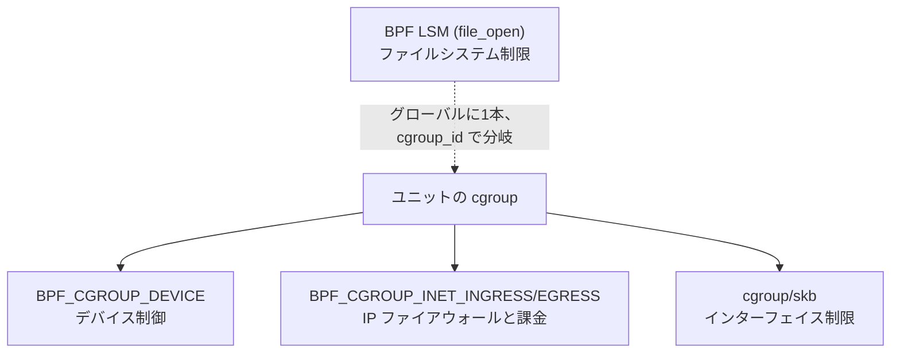

# 第13章 BPF によるリソース制約

> 本章で読むソース
>
> - [`src/core/bpf-devices.c`](https://github.com/systemd/systemd/blob/v261.1/src/core/bpf-devices.c)
> - [`src/core/bpf-firewall.c`](https://github.com/systemd/systemd/blob/v261.1/src/core/bpf-firewall.c)
> - [`src/core/bpf-restrict-fs.c`](https://github.com/systemd/systemd/blob/v261.1/src/core/bpf-restrict-fs.c)
> - [`src/core/bpf-restrict-ifaces.c`](https://github.com/systemd/systemd/blob/v261.1/src/core/bpf-restrict-ifaces.c)

## この章の狙い

cgroup の標準コントローラだけでは、デバイスアクセスの許否やパケット単位のフィルタリングを表現できない。
systemd はこれらを BPF プログラムとして組み立て、cgroup へアタッチすることで実現する。
本章では、デバイス制御、IP ファイアウォール、ファイルシステム制限、ネットワークインターフェイス制限という四つの BPF 機構が、どうプログラムを生成しどう cgroup に結び付くかを追う。

## 前提

- 第12章の cgroup 統合とコントローラマスクを理解していること
- BPF が「カーネル内で検証済みの小さなプログラムを特定のフック点で実行する仕組み」であることを知っていること
- cgroup v2 の階層構造（第12章）を把握していること

## BPF は cgroup の疑似コントローラである

第12章で見たコントローラマスクには、標準コントローラとは別に BPF ベースの疑似コントローラのビットがある。
BPF による制約は、cgroup ディレクトリに BPF プログラムをアタッチして実現する。
四つの機構はアタッチ先のフック点が異なる。



デバイス制御、ファイアウォール、インターフェイス制限は cgroup へ直接アタッチする。
ファイルシステム制限だけは LSM フックにグローバルに一本アタッチし、cgroup ID をキーにした BPF マップで対象を絞る点が異なる。

## デバイスアクセス制御

`DeviceAllow=` などの指定は `BPF_PROG_TYPE_CGROUP_DEVICE` プログラムに変換される。
`bpf_devices_cgroup_init()` がプログラムの骨格を組み立てる。
プログラムに渡されるコンテキストからデバイス種別（block/char）とアクセス種別（読み書き mknod）と major/minor 番号をレジスタへ読み込む命令を先頭に置く。

[`src/core/bpf-devices.c` L173-L189](https://github.com/systemd/systemd/blob/v261.1/src/core/bpf-devices.c#L173-L189)

```c
        if (policy == CGROUP_DEVICE_POLICY_AUTO && !allow_list) {
                *ret = NULL;
                return 0;
        }

        r = bpf_program_new(BPF_PROG_TYPE_CGROUP_DEVICE, "sd_devices", &prog);
        if (r < 0)
                return log_error_errno(r, "Loading device control BPF program failed: %m");

        if (policy == CGROUP_DEVICE_POLICY_CLOSED || allow_list) {
                r = bpf_program_add_instructions(prog, pre_insn, ELEMENTSOF(pre_insn));
                if (r < 0)
                        return log_error_errno(r, "Extending device control BPF program failed: %m");
        }
```

個々の許可デバイスは、その major/minor に一致したら「許可」へジャンプする命令列として追記される。
最後に `bpf_devices_apply_policy()` が末尾へ既定の判定を足してプログラムを完成させ、cgroup へアタッチする。
ポリシーが `STRICT` かつ許可リストが空なら「すべて拒否」で終わり、そうでなければ一致しなかったパケットを既定で許可する。

[`src/core/bpf-devices.c` L208-L220](https://github.com/systemd/systemd/blob/v261.1/src/core/bpf-devices.c#L208-L220)

```c
        const bool deny_everything = policy == CGROUP_DEVICE_POLICY_STRICT && !allow_list;

        const struct bpf_insn post_insn[] = {
                /* return DENY */
                BPF_MOV64_IMM(BPF_REG_0, 0),
                BPF_JMP_A(1),
        };

        const struct bpf_insn exit_insn[] = {
                /* finally return DENY if deny_everything else ALLOW */
                BPF_MOV64_IMM(BPF_REG_0, deny_everything ? 0 : 1),
                BPF_EXIT_INSN()
        };
```

アタッチは `BPF_F_ALLOW_MULTI` フラグで行う。

[`src/core/bpf-devices.c` L244-L247](https://github.com/systemd/systemd/blob/v261.1/src/core/bpf-devices.c#L244-L247)

```c
        r = bpf_program_cgroup_attach(*prog, BPF_CGROUP_DEVICE, controller_path, BPF_F_ALLOW_MULTI);
        if (r < 0)
                return log_error_errno(r, "Attaching device control BPF program to cgroup %s failed: %m",
                                       empty_to_root(cgroup_path));
```

`BPF_F_ALLOW_MULTI` は、同じフック点に複数のプログラムを重ねて付けることを許す。
これにより、祖先 cgroup のプログラムと子孫のプログラムがカーネル側で順に評価され、上位の制約を下位が引き継ぐ。

## IP ファイアウォールと課金

`IPAddressAllow=` や `IPAddressDeny=`、`IPAccounting=` は、ingress と egress それぞれの BPF プログラムに変換される。
`bpf_firewall_compile_bpf()` が、パケットのプロトコルを一度だけ読んでレジスタにキャッシュし、許可リストと拒否リストの照合結果を専用レジスタ（R8）に記録する命令列を組む。

[`src/core/bpf-firewall.c` L188-L192](https://github.com/systemd/systemd/blob/v261.1/src/core/bpf-firewall.c#L188-L192)

```c
        const struct bpf_insn post_insn[] = {
                BPF_MOV64_IMM(BPF_REG_0, 1),
                BPF_JMP_IMM(BPF_JNE, BPF_REG_8, ACCESS_DENIED, 1),
                BPF_MOV64_IMM(BPF_REG_0, 0),
        };
```

許可と拒否の両方が立った場合は許可を優先する。
判定に使うアドレスリストは BPF マップに格納され、`bpf_firewall_compile()` が再コンパイルのたびにアクセスマップとプログラムだけを作り直す。
課金マップは作り直さず再利用する。

[`src/core/bpf-firewall.c` L561-L572](https://github.com/systemd/systemd/blob/v261.1/src/core/bpf-firewall.c#L561-L572)

```c
        /* Note that when we compile a new firewall we first flush out the access maps and the BPF programs themselves,
         * but we reuse the accounting maps. That way the firewall in effect always maps to the actual
         * configuration, but we don't flush out the accounting unnecessarily */

        crt->ip_bpf_ingress = bpf_program_free(crt->ip_bpf_ingress);
        crt->ip_bpf_egress = bpf_program_free(crt->ip_bpf_egress);

        crt->ipv4_allow_map_fd = safe_close(crt->ipv4_allow_map_fd);
        crt->ipv4_deny_map_fd = safe_close(crt->ipv4_deny_map_fd);
```

内部ノード（slice など）ではアクセス制御プログラムを作らず、課金だけを行う。
プロセスを実際に含む葉ノードが、親までのすべての IP ルールを取り込んでコンパイルするからだ。
アタッチの際は、新しいプログラムを付けてから古いプログラムを外す。

[`src/core/bpf-firewall.c` L707-L722](https://github.com/systemd/systemd/blob/v261.1/src/core/bpf-firewall.c#L707-L722)

```c
        /* Let's clear the fields, but destroy the programs only after attaching the new programs, so that
         * there's no time window where neither program is attached. (There will be a program where both are
         * attached, but that's OK, since this is a security feature where we rather want to lock down too
         * much than too little. */
        ip_bpf_egress_uninstall = TAKE_PTR(crt->ip_bpf_egress_installed);
        ip_bpf_ingress_uninstall = TAKE_PTR(crt->ip_bpf_ingress_installed);

        if (crt->ip_bpf_egress) {
                r = bpf_program_cgroup_attach(crt->ip_bpf_egress, BPF_CGROUP_INET_EGRESS, path, BPF_F_ALLOW_MULTI);
                // ... (中略) ...
                /* Remember that this BPF program is installed now. */
                crt->ip_bpf_egress_installed = TAKE_PTR(crt->ip_bpf_egress);
        }
```

順序を逆にすると、一瞬どちらのプログラムも付いていない窓が生じ、そのあいだフィルタを素通りしてしまう。
両方付いている瞬間は許可より制限が強く働くだけなので、セキュリティ機能としては安全側に倒れる。

## ファイルシステムアクセス制限

`RestrictFileSystems=` は BPF LSM を使う。
これは他の三つと違い、cgroup ではなく LSM フックへアタッチする。
まず利用可能性を判定する段で、securityfs のマウントと BPF LSM フックの有効化を確認する。

[`src/core/bpf-restrict-fs.c` L84-L96](https://github.com/systemd/systemd/blob/v261.1/src/core/bpf-restrict-fs.c#L84-L96)

```c
        r = lsm_supported("bpf");
        if (r == -ENOPKG) {
                log_debug_errno(r, "bpf-restrict-fs: securityfs not mounted, BPF LSM support not available.");
                return (supported = false);
        }
        // ... (中略) ...
        if (r == 0) {
                log_info("bpf-restrict-fs: BPF LSM hook not enabled in the kernel, BPF LSM not supported.");
                return (supported = false);
        }
```

`bpf_restrict_fs_setup()` はマネージャー起動時に一度だけ LSM プログラムをアタッチする。
このプログラムはシステム全体で一本だけ動き、どのユニットに属するかを実行時に cgroup ID で見分ける。

[`src/core/bpf-restrict-fs.c` L121-L130](https://github.com/systemd/systemd/blob/v261.1/src/core/bpf-restrict-fs.c#L121-L130)

```c
        link = sym_bpf_program__attach_lsm(obj->progs.restrict_filesystems);
        r = bpf_get_error_translated(link);
        if (r != 0)
                return log_error_errno(r, "bpf-restrict-fs: Failed to link '%s' LSM BPF program: %m",
                                       sym_bpf_program__name(obj->progs.restrict_filesystems));

        log_info("bpf-restrict-fs: LSM BPF program attached");

        obj->links.restrict_filesystems = TAKE_PTR(link);
        m->restrict_fs = TAKE_PTR(obj);
```

ユニットごとの許可ファイルシステムは、二段のマップで表現する。
外側マップは cgroup ID をキーに内側マップを引き、内側マップにそのユニットで許可するファイルシステムの magic 番号を並べる。

[`src/core/bpf-restrict-fs.c` L154-L161](https://github.com/systemd/systemd/blob/v261.1/src/core/bpf-restrict-fs.c#L154-L161)

```c
        if (sym_bpf_map_update_elem(outer_map_fd, &cgroup_id, &inner_map_fd, BPF_ANY) != 0)
                return log_error_errno(errno, "bpf-restrict-fs: Error populating BPF map: %m");

        uint32_t allow = allow_list;

        /* Use key 0 to store whether this is an allow list or a deny list */
        if (sym_bpf_map_update_elem(inner_map_fd, &zero, &allow, BPF_ANY) != 0)
                return log_error_errno(errno, "bpf-restrict-fs: Error initializing map: %m");
```

一本のプログラムがマップの引き当てだけで全ユニットを扱えるため、ユニットごとにプログラムをロードしアタッチする必要がない。

## ネットワークインターフェイス制限

`RestrictNetworkInterfaces=` は、ingress と egress の cgroup/skb プログラムを cgroup へアタッチする。
`restrict_ifaces_install_impl()` が cgroup をファイルディスクリプタで開き、二つのプログラムをそれぞれリンクとして付ける。

[`src/core/bpf-restrict-ifaces.c` L131-L143](https://github.com/systemd/systemd/blob/v261.1/src/core/bpf-restrict-ifaces.c#L131-L143)

```c
        ingress_link = sym_bpf_program__attach_cgroup(obj->progs.sd_restrictif_i, cgroup_fd);
        r = bpf_get_error_translated(ingress_link);
        if (r != 0)
                return log_unit_error_errno(u, r, "restrict-interfaces: Failed to create ingress cgroup link: %m");

        egress_link = sym_bpf_program__attach_cgroup(obj->progs.sd_restrictif_e, cgroup_fd);
        r = bpf_get_error_translated(egress_link);
        if (r != 0)
                return log_unit_error_errno(u, r, "restrict-interfaces: Failed to create egress cgroup link: %m");

        crt->restrict_ifaces_ingress_bpf_link = TAKE_PTR(ingress_link);
        crt->restrict_ifaces_egress_bpf_link = TAKE_PTR(egress_link);
```

ここで得られる `bpf_link` は、アタッチ状態を表すカーネルオブジェクトへのハンドルである。
このハンドルは再実行（reexec）をまたいで引き継がれる。

## 最適化: bpf_link の引き継ぎでフィルタを途切れさせない

BPF による制約は、systemd が自分自身を再実行しても効き続けなければならない。
プログラムを付け直すあいだにフィルタが外れると、その窓でパケットが素通りする。
systemd は `bpf_link` のファイルディスクリプタをシリアライズし、再実行後の新しいプロセスへそのまま渡す。

[`src/core/bpf-restrict-ifaces.c` L172-L176](https://github.com/systemd/systemd/blob/v261.1/src/core/bpf-restrict-ifaces.c#L172-L176)

```c
        r = bpf_serialize_link(f, fds, "restrict-ifaces-bpf-fd", crt->restrict_ifaces_ingress_bpf_link);
        if (r < 0)
                return r;

        return bpf_serialize_link(f, fds, "restrict-ifaces-bpf-fd", crt->restrict_ifaces_egress_bpf_link);
```

リンクのファイルディスクリプタが生きている限りプログラムはアタッチされたままなので、再実行の前後でフィルタが一度も外れない。
ファイアウォールのアタッチが「新を付けてから旧を外す」順序を守るのも同じ狙いであり、いずれもセキュリティ機能を無防備な瞬間なしに更新するための工夫である。

## まとめ

systemd はデバイス制御、IP ファイアウォール、ファイルシステム制限、インターフェイス制限を、標準コントローラでは表せない制約として BPF で実装する。
デバイス、ファイアウォール、インターフェイスの三つは cgroup へ `BPF_F_ALLOW_MULTI` でアタッチし、祖先の制約を子孫が階層的に引き継ぐ。
ファイルシステム制限は LSM フックへ一本だけアタッチし、cgroup ID をキーにした二段マップで全ユニットを一本のプログラムで扱う。
ファイアウォールは再コンパイル時にアクセスマップとプログラムだけを作り直し課金マップを再利用し、アタッチは新を付けてから旧を外す。
`bpf_link` を再実行に引き継ぐことで、systemd 自身の入れ替え中もフィルタを一度も途切れさせない。

## 関連する章

- 第12章：cgroup v2 統合（BPF 疑似コントローラを含むマスク計算と realize）
- 第6章：マネージャーとメインループ（再実行時のシリアライズ）
- 第9章：Service（実行時に BPF 制約を適用されるサービスプロセス）
