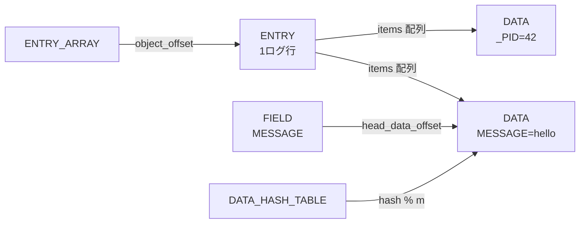

# 第14章 ジャーナルファイルフォーマット

> 本章で読むソース
>
> - [`src/libsystemd/sd-journal/journal-def.h`](https://github.com/systemd/systemd/blob/v261.1/src/libsystemd/sd-journal/journal-def.h)
> - [`src/libsystemd/sd-journal/journal-file.c`](https://github.com/systemd/systemd/blob/v261.1/src/libsystemd/sd-journal/journal-file.c)

## この章の狙い

systemd のログは、テキストではなく構造化されたバイナリファイルに記録される。
一つのログ行は複数のフィールド（`MESSAGE=`、`_PID=`、`PRIORITY=` など）の集まりであり、同じ値が何度も現れる。
本章では、このジャーナルファイルがどんなオブジェクトで構成され、重複する値をどう一度だけ格納し、時刻やシーケンス番号による検索をどう索引するかを読む。

## 前提

- ログエントリが「キー=値」形式のフィールド集合であることを知っていること
- ハッシュテーブルと連結リストの基本を理解していること
- mmap によるファイルアクセスの概念を把握していること

## ファイルヘッダ

ジャーナルファイルの先頭には固定サイズのヘッダが置かれる。
署名 `LPKSHHRH` で始まり、フラグ、各種オフセット、エントリ数などのメタデータを持つ。

[`src/libsystemd/sd-journal/journal-def.h` L217-L241](https://github.com/systemd/systemd/blob/v261.1/src/libsystemd/sd-journal/journal-def.h#L217-L241)

```c
#define struct_Header__contents {                       \
        uint8_t signature[8]; /* "LPKSHHRH" */          \
        le32_t compatible_flags;                        \
        le32_t incompatible_flags;                      \
        uint8_t state;                                  \
        uint8_t reserved[7];                            \
        sd_id128_t file_id;                             \
        sd_id128_t machine_id;                          \
        sd_id128_t tail_entry_boot_id;                  \
        sd_id128_t seqnum_id;                           \
        le64_t header_size;                             \
        le64_t arena_size;                              \
        le64_t data_hash_table_offset;                  \
        le64_t data_hash_table_size;                    \
        le64_t field_hash_table_offset;                 \
        le64_t field_hash_table_size;                   \
        le64_t tail_object_offset;                      \
        le64_t n_objects;                               \
        le64_t n_entries;                               \
```

ヘッダの `state` はファイルの一貫性状態を表し、`OFFLINE`（安全に閉じた）、`ONLINE`（書き込み中）、`ARCHIVED`（ローテーション済み）のいずれかを取る。

[`src/libsystemd/sd-journal/journal-def.h` L174-L179](https://github.com/systemd/systemd/blob/v261.1/src/libsystemd/sd-journal/journal-def.h#L174-L179)

```c
enum {
        STATE_OFFLINE = 0,
        STATE_ONLINE = 1,
        STATE_ARCHIVED = 2,
        _STATE_MAX,
};
```

フラグは `incompatible_flags` と `compatible_flags` に分かれる。
前者は「これを理解できないと読めない」機能を、後者は「理解できなくても読める」機能を表す。
圧縮方式（XZ、LZ4、ZSTD）、鍵付きハッシュ、コンパクトモードは非互換フラグである。

[`src/libsystemd/sd-journal/journal-def.h` L182-L200](https://github.com/systemd/systemd/blob/v261.1/src/libsystemd/sd-journal/journal-def.h#L182-L200)

```c
enum {
        HEADER_INCOMPATIBLE_COMPRESSED_XZ   = 1 << 0,
        HEADER_INCOMPATIBLE_COMPRESSED_LZ4  = 1 << 1,
        HEADER_INCOMPATIBLE_KEYED_HASH      = 1 << 2,
        HEADER_INCOMPATIBLE_COMPRESSED_ZSTD = 1 << 3,
        HEADER_INCOMPATIBLE_COMPACT         = 1 << 4,
```

## オブジェクトの共通ヘッダ

ヘッダの後ろの領域（arena）には、可変長のオブジェクトが並ぶ。
どのオブジェクトも共通の `ObjectHeader` で始まり、種別とフラグとサイズを持つ。

[`src/libsystemd/sd-journal/journal-def.h` L68-L75](https://github.com/systemd/systemd/blob/v261.1/src/libsystemd/sd-journal/journal-def.h#L68-L75)

```c
struct ObjectHeader {
        uint8_t type;
        uint8_t flags;
        uint8_t reserved[6];
        le64_t size;
        uint8_t payload[0]; /* The struct is embedded in other objects, hence flex array (i.e. payload[])
                             * cannot be used. */
} _packed_;
```

種別は七つある。

[`src/libsystemd/sd-journal/journal-def.h` L47-L58](https://github.com/systemd/systemd/blob/v261.1/src/libsystemd/sd-journal/journal-def.h#L47-L58)

```c
typedef enum ObjectType {
        OBJECT_UNUSED, /* also serves as "any type" or "additional category" */
        OBJECT_DATA,
        OBJECT_FIELD,
        OBJECT_ENTRY,
        OBJECT_DATA_HASH_TABLE,
        OBJECT_FIELD_HASH_TABLE,
        OBJECT_ENTRY_ARRAY,
        OBJECT_TAG,
        _OBJECT_TYPE_MAX,
        _OBJECT_TYPE_INVALID = -EINVAL,
} ObjectType;
```

役割を整理すると次のようになる。

- **DATA**：一つの `フィールド=値` の実体であり、同じ値は一度だけ格納する（例 `MESSAGE=hello`）。
- **FIELD**：フィールド名を表し、同名の DATA を連結する（例 `MESSAGE`）。
- **ENTRY**：一つのログ行を表し、含む DATA への参照の配列を持つ。
- **DATA_HASH_TABLE / FIELD_HASH_TABLE**：値と名前の重複排除に使うハッシュ表。
- **ENTRY_ARRAY**：エントリの並びを索引する配列。
- **TAG**：暗号署名（改竄検知）のためのオブジェクト。



## エントリの追加と重複排除

ログ行の追加は `journal_file_append_entry()` から始まる。
各フィールドを `journal_file_append_data()` で DATA オブジェクトへ変換し、それらへの参照を集めて ENTRY を作る。

DATA を追加するとき、まず値のハッシュを計算し、同じ値がすでに存在しないかをデータハッシュ表で探す。
見つかれば既存のオフセットを返し、新しいオブジェクトは作らない。

[`src/libsystemd/sd-journal/journal-file.c` L1865-L1878](https://github.com/systemd/systemd/blob/v261.1/src/libsystemd/sd-journal/journal-file.c#L1865-L1878)

```c
        hash = journal_file_hash_data(f, data, size);

        r = journal_file_find_data_object_with_hash(f, data, size, hash, ret_object, ret_offset);
        if (r < 0)
                return r;
        if (r > 0)
                return 0;

        eq = memchr(data, '=', size);
        if (!eq)
                return -EUCLEAN;

        osize = journal_file_data_payload_offset(f) + size;
        r = journal_file_append_object(f, OBJECT_DATA, osize, &o, &p);
```

探索は、ハッシュ値をテーブルサイズで割った剰余でバケットを選び、そのバケットに連なる DATA を辿って値を突き合わせる。

[`src/libsystemd/sd-journal/journal-file.c` L1649-L1669](https://github.com/systemd/systemd/blob/v261.1/src/libsystemd/sd-journal/journal-file.c#L1649-L1669)

```c
        h = hash % m;
        p = le64toh(f->data_hash_table[h].head_hash_offset);

        while (p > 0) {
                Object *o;
                void *d;
                size_t rsize;

                r = journal_file_move_to_object(f, OBJECT_DATA, p, &o);
                if (r < 0)
                        return r;

                if (le64toh(o->data.hash) != hash)
                        goto next;
                // ... (中略) ...
                if (memcmp_nn(data, size, d, rsize) == 0) {
```

新しい DATA を作った場合は、ハッシュ表の該当バケットの連結リスト末尾へ繋ぐ。

[`src/libsystemd/sd-journal/journal-file.c` L1465-L1481](https://github.com/systemd/systemd/blob/v261.1/src/libsystemd/sd-journal/journal-file.c#L1465-L1481)

```c
        h = hash % m;
        p = le64toh(f->data_hash_table[h].tail_hash_offset);
        if (p == 0)
                /* Only entry in the hash table is easy */
                f->data_hash_table[h].head_hash_offset = htole64(offset);
        else {
                /* Move back to the previous data object, to patch in
                 * pointer */

                r = journal_file_move_to_object(f, OBJECT_DATA, p, &o);
                if (r < 0)
                        return r;

                o->data.next_hash_offset = htole64(offset);
        }

        f->data_hash_table[h].tail_hash_offset = htole64(offset);
```

同じ `MESSAGE=...` を持つ多数のログ行があっても、その値の実体は一つの DATA として一度だけ書かれる。
各 ENTRY はその DATA のオフセットを参照するだけで済む。

## エントリ配列による索引

ENTRY を書いたら、それを索引に繋ぐ。
系のすべてのエントリを順に辿れるように、ENTRY_ARRAY という配列オブジェクトの連鎖で索引する。
`journal_file_link_entry()` がヘッダの `entry_array_offset` を起点にエントリを配列へ追加する。

[`src/libsystemd/sd-journal/journal-file.c` L2261-L2267](https://github.com/systemd/systemd/blob/v261.1/src/libsystemd/sd-journal/journal-file.c#L2261-L2267)

```c
        /* Link up the entry itself */
        r = link_entry_into_array(f,
                                  &f->header->entry_array_offset,
                                  &f->header->n_entries,
                                  JOURNAL_HEADER_CONTAINS(f->header, tail_entry_array_offset) ? &f->header->tail_entry_array_offset : NULL,
                                  JOURNAL_HEADER_CONTAINS(f->header, tail_entry_array_n_entries) ? &f->header->tail_entry_array_n_entries : NULL,
                                  offset);
```

配列が満杯になると新しい配列を確保し、前の配列から繋ぐ。
このとき確保するサイズは、直前の配列の二倍にする。

[`src/libsystemd/sd-journal/journal-file.c` L2141-L2153](https://github.com/systemd/systemd/blob/v261.1/src/libsystemd/sd-journal/journal-file.c#L2141-L2153)

```c
        if (hidx > n)
                n = (hidx+1) * 2;
        else
                n = n * 2;

        if (n < 4)
                n = 4;

        r = journal_file_append_object(f, OBJECT_ENTRY_ARRAY,
                                       offsetof(Object, entry_array.items) + n * journal_file_entry_array_item_size(f),
                                       &o, &q);
```

各 DATA オブジェクトも、自分を含む ENTRY の一覧を同じ二倍成長の配列で保持する。
これにより「このフィールド値を含むログ行」の絞り込みが、全エントリ走査なしにできる。

## エントリ内アイテムのディスク順ソート

ENTRY が参照する DATA の並びは、書き込み前にディスク上のオフセット順へ並べ替える。

[`src/libsystemd/sd-journal/journal-file.c` L2634-L2637](https://github.com/systemd/systemd/blob/v261.1/src/libsystemd/sd-journal/journal-file.c#L2634-L2637)

```c
        /* Order by the position on disk, in order to improve seek
         * times for rotating media. */
        typesafe_qsort(items, n_iovec, entry_item_cmp);
        n_iovec = remove_duplicate_entry_items(items, n_iovec);
```

エントリを読むとき、参照先の DATA をオフセット昇順に辿れば、ディスクを前方へ一方向に読むだけで済む。
回転メディアでのシーク時間を減らす狙いである。

## 鍵付きハッシュとコンパクトモード

`incompatible_flags` の二つの機能が、フォーマットの安全性と省サイズに効く。

鍵付きハッシュ（`KEYED_HASH`）を有効にすると、DATA のハッシュ計算にファイルごとの秘密鍵を混ぜる。
攻撃者がハッシュ衝突を狙ってバケットを一本の長い連鎖に潰す攻撃を防ぐためだ。
その場合でも、ファイル間で一貫したエントリ識別子を得るために、XOR ハッシュには鍵に依存しない Jenkins ハッシュを使う。

[`src/libsystemd/sd-journal/journal-file.c` L2623-L2626](https://github.com/systemd/systemd/blob/v261.1/src/libsystemd/sd-journal/journal-file.c#L2623-L2626)

```c
                if (JOURNAL_HEADER_KEYED_HASH(f->header))
                        xor_hash ^= jenkins_hash64(iovec[i].iov_base, iovec[i].iov_len);
                else
                        xor_hash ^= le64toh(o->data.hash);
```

コンパクトモード（`COMPACT`）を有効にすると、ENTRY や ENTRY_ARRAY 内のオフセットを 64 ビットではなく 32 ビットで格納する。

[`src/libsystemd/sd-journal/journal-file.c` L2304-L2310](https://github.com/systemd/systemd/blob/v261.1/src/libsystemd/sd-journal/journal-file.c#L2304-L2310)

```c
        if (JOURNAL_HEADER_COMPACT(f->header)) {
                assert(item->object_offset <= UINT32_MAX);
                o->entry.items.compact[i].object_offset = htole32(item->object_offset);
        } else {
                o->entry.items.regular[i].object_offset = htole64(item->object_offset);
                o->entry.items.regular[i].hash = htole64(item->hash);
        }
```

ファイルサイズを 4GiB 以下に制限する代わりに、参照の格納量が半分になる。
ログのように参照が大量に並ぶ構造では、この差がファイル全体の大きさを目立って縮める。

## 最適化: 重複排除と二倍成長の索引

このフォーマットの効率は、二つの機構が支える。

第一が DATA の重複排除である。
`_SYSTEMD_UNIT=` や `PRIORITY=` のように、同じ値が何千行にもわたって繰り返されるフィールドは、値の実体を一つの DATA として一度だけ書く。
新しいログ行はその DATA のオフセットを参照するだけなので、行数に比例してファイルが膨らむ代わりに、ユニークな値の数にしか比例しない。
重複判定はハッシュ表で定数時間に近く行われるため、追加のたびに全走査する必要がない。

第二が ENTRY_ARRAY の二倍成長である。
索引配列を満杯のたびに直前の二倍で確保することで、n 個のエントリを追加する総コストが償却で線形に収まる。
配列が連鎖して並ぶため、シーケンス番号や時刻での検索を、連鎖をまたいだ二分探索で対数的に絞り込める。
これが `journalctl` の時刻範囲指定が大きなファイルでも速い理由である。

## まとめ

ジャーナルファイルは、固定ヘッダの後ろに可変長オブジェクトを並べた追記型のバイナリ形式である。
ログ行は ENTRY として表され、含むフィールド値は DATA として格納し、同じ値はハッシュ表で重複排除して一度だけ書く。
エントリの並びは二倍成長する ENTRY_ARRAY の連鎖で索引し、時刻やシーケンス番号での検索を二分探索で行える。
鍵付きハッシュが衝突攻撃を防ぎ、コンパクトモードがオフセットを 32 ビットに詰めてファイルを縮める。
エントリ内の参照をディスクオフセット順に並べることで、読み出し時のシークを一方向に抑える。

## 関連する章

- 第15章：journald の書き込みとローテーション（このフォーマットへ実際にエントリを積む側）
- 第4章：`sd-event`（journald が使うイベントループ基盤）
