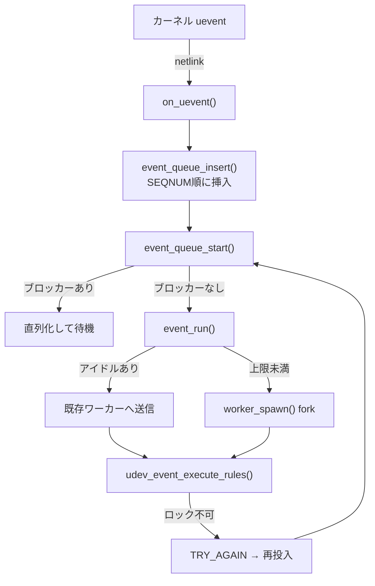

# 第16章 udev デーモンのイベント処理

> 本章で読むソース
>
> - [`src/udev/udevd.c`](https://github.com/systemd/systemd/blob/v261.1/src/udev/udevd.c)
> - [`src/udev/udev-manager.c`](https://github.com/systemd/systemd/blob/v261.1/src/udev/udev-manager.c)
> - [`src/udev/udev-event.c`](https://github.com/systemd/systemd/blob/v261.1/src/udev/udev-event.c)

## この章の狙い

`systemd-udevd` は、カーネルが発するデバイスイベント（uevent）を受け取り、ルールに従ってデバイスノードやシンボリックリンクや属性を整える。
本章では、udevd が uevent をどうキューに積み、複数のワーカープロセスへどう振り分け、関連するデバイスのイベントをどう直列化するかを追う。
一つのイベントをワーカーが処理する中身も読む。

## 前提

- 第4章の `sd-event`（イベントループ）を理解していること
- カーネルの uevent が netlink 経由で届くことを知っていること
- プロセスの fork とワーカープール型の並行処理の概念を把握していること

## デーモンの起動とワーカー準備

udevd は `run_udevd()` でマネージャーを生成し、設定を読み、`manager_main()` へ入る。
ワーカーを fork する前に、ワーカーが使う共有ライブラリをあらかじめロードしておく。

[`src/udev/udevd.c` L60-L65](https://github.com/systemd/systemd/blob/v261.1/src/udev/udevd.c#L60-L65)

```c
        /* Load some shared libraries before we fork any workers */
        (void) DLOPEN_LIBACL(LOG_DEBUG, SD_ELF_NOTE_DLOPEN_PRIORITY_RECOMMENDED);
        (void) DLOPEN_LIBBLKID(LOG_DEBUG, SD_ELF_NOTE_DLOPEN_PRIORITY_RECOMMENDED);
        (void) DLOPEN_LIBKMOD(LOG_DEBUG, SD_ELF_NOTE_DLOPEN_PRIORITY_RECOMMENDED);
        (void) DLOPEN_LIBMOUNT(LOG_DEBUG, SD_ELF_NOTE_DLOPEN_PRIORITY_RECOMMENDED);
        (void) DLOPEN_TPM2(LOG_DEBUG, SD_ELF_NOTE_DLOPEN_PRIORITY_RECOMMENDED);
```

親が先にロードしておくと、fork したワーカーは copy-on-write でその共有ライブラリを引き継ぐ。
ワーカーごとに動的リンクをやり直す手間が省ける。

## uevent の受信とキュー投入

カーネルからの uevent は netlink のデバイスモニタ経由で届き、`on_uevent()` が受ける。
イベントをキューに積み、そのデバイスに関して待たされていたイベントの再投入を促す。

[`src/udev/udev-manager.c` L1091-L1101](https://github.com/systemd/systemd/blob/v261.1/src/udev/udev-manager.c#L1091-L1101)

```c
        (void) manager_create_queue_file(manager);

        device_ensure_usec_initialized(dev, NULL);

        r = event_queue_insert(manager, dev);
        if (r < 0) {
                log_device_error_errno(dev, r, "Failed to insert device into event queue: %m");
                return 1;
        }

        (void) manager_requeue_locked_events_by_device(manager, dev);
```

`event_queue_insert()` は、届いたデバイスから SEQNUM やアクション、devpath を取り出して `Event` を作る。
カーネルはまれにイベントを SEQNUM 順と違う順で送るため、キューへは SEQNUM 順を保って挿入する。

[`src/udev/udev-manager.c` L950-L974](https://github.com/systemd/systemd/blob/v261.1/src/udev/udev-manager.c#L950-L974)

```c
        /* The kernel sometimes sends events in a wrong order, and we may receive an event with smaller
         * SEQNUM after one with larger SEQNUM. To workaround the issue, let's reorder events if necessary. */

        Event *prev = NULL;
        LIST_FOREACH_BACKWARDS(event, e, manager->last_event) {
                if (e->seqnum < event->seqnum) {
                        prev = e;
                        break;
                }
                // ... (中略) ...
        }

        LIST_INSERT_AFTER(event, manager->events, prev, event);
```

## ワーカーへの振り分けと直列化

キューの処理は `event_queue_start()` が回す。
キューを先頭から見て、実行できるイベントをワーカーへ渡していく。
ここで重要なのは、関連するデバイスのイベントを同時に走らせないことだ。

[`src/udev/udev-manager.c` L745-L762](https://github.com/systemd/systemd/blob/v261.1/src/udev/udev-manager.c#L745-L762)

```c
        LIST_FOREACH(event, event, manager->events) {
                if (event->state != EVENT_QUEUED)
                        continue;

                event_find_blocker(event);

                /* do not start event if parent or child event is still running or queued */
                if (event->blocker)
                        continue;

                r = event_run(event);
                if (r < 0)
                        return r;

                /* A worker is activated now. Let's check if we can process more events. */
                if (!manager_can_process_event(manager))
                        break;
        }
```

`event_find_blocker()` が、同じデバイス、親デバイス、子デバイスに関する未処理イベントを探す。
見つかればそのイベントを「ブロッカー」として記録し、ブロッカーが処理し終わるまで自分を実行しない。

[`src/udev/udev-manager.c` L672-L688](https://github.com/systemd/systemd/blob/v261.1/src/udev/udev-manager.c#L672-L688)

```c
        LIST_FOREACH_BACKWARDS(event, e, (event->blocker ?: event)->event_prev) {
                if (e->state == EVENT_PROCESSED)
                        continue;

                if (!streq_ptr(event->id, e->id) &&
                    !devpath_conflict(event->devpath, e->devpath) &&
                    !devpath_conflict(event->devpath, e->devpath_old) &&
                    !devpath_conflict(event->devpath_old, e->devpath) &&
                    !(event->devnode && streq_ptr(event->devnode, e->devnode)))
                        continue;
                // ... (中略) ...
                unref_and_replace_new_ref(event->blocker, e, event_ref, event_unref);
                return;
        }
```

これにより、互いに無関係なデバイスのイベントは並行して処理され、親子や同一デバイスのイベントだけが順序を保って直列化される。

## ワーカーの再利用と生成

イベントを実行する `event_run()` は、まず遊んでいるワーカーを探して再利用する。
アイドルなワーカーが見つかれば、そのワーカーへデバイスを netlink で送る。

[`src/udev/udev-manager.c` L617-L645](https://github.com/systemd/systemd/blob/v261.1/src/udev/udev-manager.c#L617-L645)

```c
        Worker *worker;
        HASHMAP_FOREACH(worker, manager->workers) {
                if (worker->state != WORKER_IDLE)
                        continue;

                r = device_monitor_send(manager->monitor, &worker->address, event->dev);
                // ... (中略) ...
                worker_attach_event(worker, event);
                return 0;
        }
        // ... (中略) ...
        /* start new worker and pass initial device */
        r = worker_spawn(manager, event);
```

アイドルなワーカーがなく、かつワーカー数が上限（`children_max`）未満なら、新しいワーカーを fork する。
`manager_can_process_event()` が、上限に達しているかアイドルワーカーがいるかを見て、これ以上処理できるかを判定する。

[`src/udev/udev-manager.c` L702-L708](https://github.com/systemd/systemd/blob/v261.1/src/udev/udev-manager.c#L702-L708)

```c
        if (hashmap_size(manager->workers) < manager->config.children_max)
                goto yes_we_can; /* new worker can be spawned */

        Worker *worker;
        HASHMAP_FOREACH(worker, manager->workers)
                if (worker->state == WORKER_IDLE)
                        goto yes_we_can; /* found an idle worker */
```

新規ワーカーは fork した子プロセスで `udev_worker_main()` を実行し、以後は netlink で渡されるデバイスを処理し続ける。

[`src/udev/udev-manager.c` L575-L598](https://github.com/systemd/systemd/blob/v261.1/src/udev/udev-manager.c#L575-L598)

```c
        r = pidref_safe_fork("(udev-worker)", FORK_DEATHSIG_SIGTERM, &pidref);
        // ... (中略) ...
        if (r == 0) {
                _cleanup_(udev_worker_done) UdevWorker w = {
                        .monitor = TAKE_PTR(worker_monitor),
                        .properties = TAKE_PTR(manager->properties),
                        .rules = TAKE_PTR(manager->rules),
                        .config = manager->config,
                        .manager_pid = manager_pid,
                };
                // ... (中略) ...
                /* Worker process */
                r = udev_worker_main(&w, event->dev);
```

## ワーカーによるイベント処理

ワーカーはデバイスを受け取ると `udev_event_execute_rules()` を呼び、ルールを適用する。
ルールの適用結果に基づき、ネットワークインターフェイス名の変更、デバイスノードの更新、`/run/udev/data/` のデータベース更新を行う。

[`src/udev/udev-event.c` L403-L448](https://github.com/systemd/systemd/blob/v261.1/src/udev/udev-event.c#L403-L448)

```c
        r = udev_rules_apply_to_event(rules, event);
        if (r < 0)
                return log_device_debug_errno(dev, r, "Failed to apply udev rules: %m");
        // ... (中略) ...
        r = update_devnode(event);
        if (r < 0)
                return r;
        // ... (中略) ...
        if (EVENT_MODE_DESTRUCTIVE(event)) {
                r = device_update_db(dev);
                if (r < 0)
                        return log_device_debug_errno(dev, r, "Failed to update database under /run/udev/data/: %m");
        }

        device_set_is_initialized(dev);
```

## デバイスロックと再投入

ブロック層のデバイスは、パーティションの再読み込み中など、別プロセスが排他ロックを握っていることがある。
ワーカーがデバイスをロックできないと、親へ `TRY_AGAIN=1` を通知する。
親は該当イベントを「ロック待ち」状態にして、後で再投入する。

[`src/udev/udev-manager.c` L1222-L1232](https://github.com/systemd/systemd/blob/v261.1/src/udev/udev-manager.c#L1222-L1232)

```c
        _cleanup_(event_enter_processedp) Event *event = worker_detach_event(worker);

        if (strv_contains(l, "TRY_AGAIN=1")) {
                /* Worker cannot lock the device. */
                r = event_enter_locked(event, strv_find_startswith(l, "WHOLE_DISK="));
                if (r < 0) {
                        (void) device_add_errno(event->dev, r);
                        (void) device_broadcast_on_error(event->dev, manager->monitor);
                } else
                        TAKE_PTR(event);
        }
```

イベントループの各周回の後処理 `on_post()` が、ロック待ちイベントの再投入とキューの再開を試みる。
ワーカーがアイドルに戻っても、対象デバイスがロックされていて処理が遅れることがあるため、周回ごとに再挑戦する。

[`src/udev/udev-manager.c` L1338-L1343](https://github.com/systemd/systemd/blob/v261.1/src/udev/udev-manager.c#L1338-L1343)

```c
                /* Try to process pending events if idle workers exist. Why is this necessary?
                 * When a worker finished an event and became idle, even if there was a pending event,
                 * the corresponding device might have been locked and the processing of the event
                 * delayed for a while, preventing the worker from processing the event immediately.
                 * Now, the device may be unlocked. Let's try again! */
                (void) event_queue_start(manager);
```



## 最適化: ワーカープールと選択的直列化

udevd の並行処理は、二つの工夫で速さと正しさを両立させる。

第一がワーカープールの再利用である。
イベントごとにプロセスを fork せず、アイドルなワーカーがいればそれへ netlink でデバイスを送って処理させる。
fork とワーカー初期化のコストは、上限（`children_max`）に達するまでの立ち上げ時にしか払わない。
共有ライブラリを fork 前にロードしておくため、ワーカーは copy-on-write でそれらを引き継ぎ、動的リンクをやり直さない。

第二が選択的な直列化である。
互いに無関係なデバイスのイベントは複数ワーカーで同時に処理する一方、親子や同一デバイスのイベントだけをブロッカー機構で直列化する。
すべてを直列化すれば安全だが遅く、すべてを並行にすれば速いが順序依存の処理が壊れる。
`event_find_blocker()` が devpath の包含関係で衝突を判定することで、並行度を最大に保ちながら順序が必要な組だけを直列に流す。

## まとめ

`systemd-udevd` は、netlink で届く uevent を SEQNUM 順にキューへ積み、ワーカープールへ振り分けて処理する。
ワーカーはアイドルなものを再利用し、足りなければ上限までの範囲で fork する。
親子や同一デバイスのイベントはブロッカー機構で直列化し、無関係なイベントは並行して処理する。
ワーカーはルールを適用してデバイスノードやデータベースを更新し、デバイスをロックできない場合は `TRY_AGAIN` で親へ差し戻して後で再投入させる。
共有ライブラリの事前ロードと copy-on-write、選択的直列化により、大量のデバイスイベントを安全かつ並行に捌く。

## 関連する章

- 第17章：hwdb とデバイス列挙（起動時に既存デバイスへ uevent を合成する仕組み）
- 第4章：`sd-event`（キュー処理と後処理 `on_post` を回すイベントループ）
