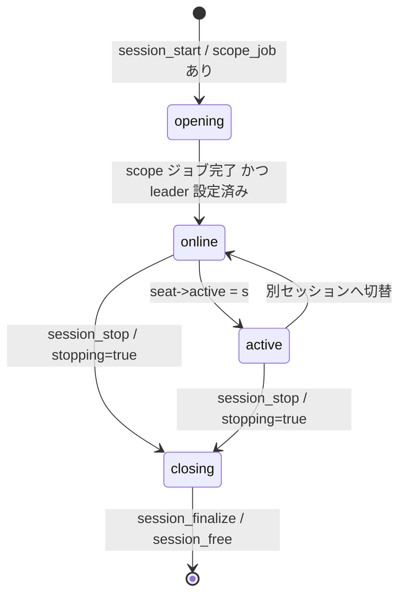

# 第18章 logind のセッション管理

> **本章で読むソース**
>
> - [`src/login/logind.c`](https://github.com/systemd/systemd/blob/v261.1/src/login/logind.c)
> - [`src/login/logind-session.c`](https://github.com/systemd/systemd/blob/v261.1/src/login/logind-session.c)
> - [`src/login/logind-seat.c`](https://github.com/systemd/systemd/blob/v261.1/src/login/logind-seat.c)

## この章の狙い

`systemd-logind` は、ログインしたユーザーのセッションと、そのセッションが結び付く物理的な席（シート）とデバイスを管理するデーモンである。
本章では、logind がどのように起動して状態を復元し、セッションを表す **Session** オブジェクトをどんな状態遷移で扱い、複数のセッションが一つの席を奪い合う切り替えをどう調停するかを読む。
セッションの生死をポーリングなしで追跡する pidfd の使い方と、その pidfd をデーモン再起動をまたいで持ち越す fdstore の仕組みを、機構の中心に置く。

## 前提

- [第4章 sd-event](../part01-foundation/04-sd-event.md)：logind はイベントループ上で動く。
  デバイス監視、pidfd 監視、タイマーはすべてイベントソースである。
- [第5章 sd-bus](../part01-foundation/05-sd-bus.md)：セッションの生成要求は D-Bus 経由で届く。
  scope ユニットの起動要求も PID 1 への D-Bus 呼び出しである。
- [第12章 cgroup](../part03-resources/12-cgroup.md)：各セッションは scope ユニットとして cgroup に閉じ込められる。

## logind が管理する三つの対象

logind の **マネージャー**は、シート、セッション、ユーザーの三種類のオブジェクトをハッシュマップで保持する。
`manager_new()` は、これらの入れ物と、logind 自身のイベントループを一度に確保する。

[`src/login/logind.c` L69-L105](https://github.com/systemd/systemd/blob/v261.1/src/login/logind.c#L69-L105)

```c
        *m = (Manager) {
                .console_active_fd = -EBADF,
                .reserve_vt_fd = -EBADF,
                .idle_action_not_before_usec = now(CLOCK_MONOTONIC),
                .scheduled_shutdown_action = _HANDLE_ACTION_INVALID,

                .devices = hashmap_new(&device_hash_ops),
                .seats = hashmap_new(&seat_hash_ops),
                .sessions = hashmap_new(&session_hash_ops),
                .users = hashmap_new(&user_hash_ops),
                .inhibitors = hashmap_new(&inhibitor_hash_ops),
                .buttons = hashmap_new(&button_hash_ops),

                .user_units = hashmap_new(&string_hash_ops),
                .session_units = hashmap_new(&string_hash_ops),
        };
```

**シート**（Seat）は、ディスプレイやキーボードなど、一人のユーザーが物理的に占有する入出力デバイスのまとまりを指す。
典型的な PC は席が一つだけであり、これが `seat0` である。
**セッション**（Session）は、あるユーザーが特定のシート上または遠隔から開いたログインの単位である。
**ユーザー**（User）は uid ごとの集約で、同じ uid の複数セッションと、そのユーザー用のスライスをまとめる。
シートは複数のセッションを持ち、そのうち高々一つだけが「アクティブ」になる。

## 起動と状態の復元

`run()` は設定を読み、必要なディレクトリを作り、`manager_startup()` を呼ぶ。

[`src/login/logind.c` L1369-L1387](https://github.com/systemd/systemd/blob/v261.1/src/login/logind.c#L1369-L1387)

```c
        /* Always create the directories people can create inotify watches in. Note that some applications
         * might check for the existence of /run/systemd/seats/ to determine whether logind is available, so
         * please always make sure these directories are created early on and unconditionally. */
        (void) mkdir_label("/run/systemd/seats", 0755);
        (void) mkdir_label("/run/systemd/users", 0755);
        (void) mkdir_label("/run/systemd/sessions", 0755);

        r = manager_new(&m);
        if (r < 0)
                return log_error_errno(r, "Failed to allocate manager object: %m");

        (void) manager_parse_config_file(m);

        r = manager_startup(m);
```

`manager_startup()` は、まず udev やバス、コンソールへの接続を張り、`seat0` を作ってから、ディスク上の状態を列挙する。

[`src/login/logind.c` L1248-L1277](https://github.com/systemd/systemd/blob/v261.1/src/login/logind.c#L1248-L1277)

```c
        /* Deserialize state */
        r = manager_enumerate_devices(m);
        if (r < 0)
                log_warning_errno(r, "Device enumeration failed: %m");

        r = manager_enumerate_seats(m);
        if (r < 0)
                log_warning_errno(r, "Seat enumeration failed: %m");

        r = manager_enumerate_users(m);
        if (r < 0)
                log_warning_errno(r, "User enumeration failed: %m");

        r = manager_enumerate_sessions(m);
        if (r < 0)
                log_warning_errno(r, "Session enumeration failed: %m");

        r = manager_enumerate_fds(m, &varlink_fd);
        if (r < 0)
                log_warning_errno(r, "File descriptor enumeration failed: %m");
```

ここで復元される状態は、`/run/systemd/sessions/` などに置かれた状態ファイルである。
logind は自身が再起動しても、稼働中のセッションを取りこぼさないように、セッションごとの情報をこのディレクトリへ書き出しておく。
`manager_enumerate_sessions()` は、その各ファイルについて `session_load()` を呼び、メモリ上の Session を作り直す。

列挙のあと、`manager_startup()` は復元した各オブジェクトを起動し、最後に一度だけ GC を回して、すでに消えたセッションを片付ける。

[`src/login/logind.c` L1293-L1315](https://github.com/systemd/systemd/blob/v261.1/src/login/logind.c#L1293-L1315)

```c
        /* And start everything */
        HASHMAP_FOREACH(seat, m->seats)
                (void) seat_start(seat);

        HASHMAP_FOREACH(user, m->users)
                (void) user_start(user);

        HASHMAP_FOREACH(session, m->sessions)
                (void) session_start(session, NULL, NULL);
```

## セッションの状態機械

Session が外部に見せる状態は四つである。
状態は Session の構造体に直接持たず、`session_get_state()` がその時々のフィールドから計算する。

[`src/login/logind-session.c` L1374-L1388](https://github.com/systemd/systemd/blob/v261.1/src/login/logind-session.c#L1374-L1388)

```c
SessionState session_get_state(Session *s) {
        assert(s);

        /* always check closing first */
        if (s->stopping || s->timer_event_source)
                return SESSION_CLOSING;

        if (s->scope_job || !pidref_is_set(&s->leader))
                return SESSION_OPENING;

        if (session_is_active(s))
                return SESSION_ACTIVE;

        return SESSION_ONLINE;
}
```

`opening` は scope ユニットの起動ジョブがまだ走っている段階、`online` はセッションが確立したが席の前面にいない段階、`active` は席の前面にいる段階、`closing` は終了処理に入った段階である。
状態を計算で導く設計には、フィールドを一つ更新すれば状態が自然に切り替わり、状態と実体の食い違いが起きにくいという利点がある。



## セッションの起動と scope

`session_start()` は、まずユーザーを起動し、続いて `session_start_scope()` でセッション用の scope ユニットを PID 1 に作らせる。

[`src/login/logind-session.c` L884-L909](https://github.com/systemd/systemd/blob/v261.1/src/login/logind-session.c#L884-L909)

```c
int session_start(Session *s, sd_bus_message *properties, sd_bus_error *error) {
        int r;

        assert(s);

        if (!s->user)
                return -ESTALE;

        if (s->stopping)
                return -EINVAL;

        if (s->started)
                return 0;

        r = user_start(s->user);
        if (r < 0)
                return r;

        r = session_start_scope(s, properties, error);
        if (r < 0)
                return r;
```

scope ユニットは、セッションのリーダープロセスとその子孫を一つの cgroup にまとめる器である。
`session_start_scope()` は `session-<id>.scope` という名前で `manager_start_scope()` を呼び、リーダーの pidfd を PID 1 に渡す。

[`src/login/logind-session.c` L794-L825](https://github.com/systemd/systemd/blob/v261.1/src/login/logind-session.c#L794-L825)

```c
        scope = strjoin("session-", s->id, ".scope");
        if (!scope)
                return log_oom();

        description = strjoina("Session ", s->id, " of User ", s->user->user_record->user_name);

        r = manager_start_scope(
                        s->manager,
                        scope,
                        &s->leader,
                        /* allow_pidfd= */ true,
                        s->user->slice,
                        description,
```

起動が済むと、セッションは状態ファイルへ保存され、シートやユーザーへ変更が通知される。

[`src/login/logind-session.c` L929-L946](https://github.com/systemd/systemd/blob/v261.1/src/login/logind-session.c#L929-L946)

```c
        s->started = true;

        user_elect_display(s->user);

        /* Save data */
        (void) session_save(s);
        (void) user_save(s->user);
        if (s->seat)
                (void) seat_save(s->seat);
```

## リーダーを pidfd で追う

セッションには「リーダー」プロセスがある。
ログインシェルやディスプレイマネージャが起動したセッションプロセスである。
logind はこのプロセスが死んだ瞬間にセッションを畳みたいが、SIGCHLD で子として待てるのは自分の子だけであり、セッションリーダーは logind の子ではない。
そこで logind は、リーダーの **pidfd** をイベントループに登録し、プロセス終了を `EPOLLIN` として受け取る。

[`src/login/logind-session.c` L112-L131](https://github.com/systemd/systemd/blob/v261.1/src/login/logind-session.c#L112-L131)

```c
static int session_watch_pidfd(Session *s) {
        int r;

        assert(s);
        assert(s->manager);
        assert(pidref_is_set(&s->leader));
        assert(s->leader.fd >= 0);
        assert(!s->leader_pidfd_event_source);

        r = sd_event_add_io(s->manager->event, &s->leader_pidfd_event_source, s->leader.fd, EPOLLIN, session_dispatch_leader_pidfd, s);
        if (r < 0)
                return r;

        r = sd_event_source_set_priority(s->leader_pidfd_event_source, SD_EVENT_PRIORITY_IMPORTANT);
        if (r < 0)
                return r;
```

イベントが立つと `session_dispatch_leader_pidfd()` が呼ばれ、セッションを停止して GC キューへ載せる。

[`src/login/logind-session.c` L98-L110](https://github.com/systemd/systemd/blob/v261.1/src/login/logind-session.c#L98-L110)

```c
static int session_dispatch_leader_pidfd(sd_event_source *es, int fd, uint32_t revents, void *userdata) {
        Session *s = ASSERT_PTR(userdata);

        assert(s->leader.fd == fd);

        s->leader_pidfd_event_source = sd_event_source_unref(s->leader_pidfd_event_source);

        session_stop(s, /* force= */ false);

        session_add_to_gc_queue(s);

        return 1;
}
```

pidfd を使うと、PID の再利用による取り違えが原理的に起きない。
PID は数値であり、プロセスが消えれば別のプロセスへ割り当て直される。
一方 pidfd は特定のプロセス実体を指すファイルディスクリプタなので、リーダーが死んだあとに同じ番号の PID が現れても、logind が別プロセスをリーダーと誤認することはない。

### 再起動をまたぐ fdstore

pidfd による追跡には弱点がある。
logind が再起動すると、開いていた pidfd は閉じてしまう。
状態ファイルに PID 番号を書き戻すだけでは、上に述べた取り違えの危険が復活する。
そこで logind は、リーダーの pidfd を PID 1 の **fdstore** へ預けておき、再起動後に受け取り直す。

[`src/login/logind-session.c` L260-L266](https://github.com/systemd/systemd/blob/v261.1/src/login/logind-session.c#L260-L266)

```c
        if (s->leader.fd >= 0) {
                r = notify_push_fdf(s->leader.fd, "session-%s-leader-fd", s->id);
                if (r < 0)
                        log_warning_errno(r, "Failed to push leader pidfd for session '%s', ignoring: %m", s->id);
                else
                        s->leader_fd_saved = true;
        }
```

fdstore は、サービスが `sd_notify` でファイルディスクリプタを PID 1 に手渡し、サービス再起動時に環境変数付きで返してもらう仕組みである。
再起動後の `manager_enumerate_fds()` は、渡された各 fd の名前を `session-<id>-leader-fd` のような形で解釈し、対応するセッションへ結び直す。

[`src/login/logind.c` L576-L603](https://github.com/systemd/systemd/blob/v261.1/src/login/logind.c#L576-L603)

```c
static int manager_enumerate_fds(Manager *m, int *ret_varlink_fd) {
        _cleanup_strv_free_ char **fdnames = NULL;
        int varlink_fd = -EBADF, n, r = 0;

        assert(m);
        assert(ret_varlink_fd);

        n = sd_listen_fds_with_names(/* unset_environment= */ true, &fdnames);
        if (n < 0)
                return log_error_errno(n, "Failed to acquire passed fd list: %m");

        for (int i = 0; i < n; i++) {
                int fd = SD_LISTEN_FDS_START + i;

                if (streq(fdnames[i], "varlink")) {
                        assert(varlink_fd < 0);
                        varlink_fd = fd;
                        continue;
                }

                RET_GATHER(r, manager_attach_session_fd_one_consume(m, fdnames[i], fd));
        }
```

この二段構えにより、logind はセッションリーダーを、再起動をまたいでもプロセス実体の同一性を保ったまま追跡できる。
状態ファイルに書かれた PID 番号は補助情報でしかなく、正しさの根拠は預けた pidfd にある。

## セッションの停止と GC

セッションが畳まれる契機は複数ある。
リーダーの pidfd が閉じたとき、バス経由の明示的な終了要求、アイドルタイマー、そして解放タイマーである。
`session_stop()` は scope を放棄し、`stopping` フラグを立てて状態ファイルを更新する。

[`src/login/logind-session.c` L999-L1034](https://github.com/systemd/systemd/blob/v261.1/src/login/logind-session.c#L999-L1034)

```c
int session_stop(Session *s, bool force) {
        int r;

        assert(s);

        /* This is called whenever we begin with tearing down a session record. It's called in four cases: explicit API
         * request via the bus (either directly for the session object or for the seat or user object this session
         * belongs to; 'force' is true), or due to automatic GC (i.e. scope vanished; 'force' is false), or because the
         * session FIFO saw an EOF ('force' is false), or because the release timer hit ('force' is false). */

        if (!s->user)
                return -ESTALE;
        if (!s->started)
                return 0;
        if (s->stopping)
                return 0;
```

実際に Session をメモリから消すのは GC である。
`manager_gc()` は、GC キューに載ったセッションが回収可能かを `session_may_gc()` で確かめ、まだ停止処理に入っていなければ `session_stop()` を呼び、最終的に `session_finalize()` と `session_free()` で解放する。

[`src/login/logind.c` L1084-L1098](https://github.com/systemd/systemd/blob/v261.1/src/login/logind.c#L1084-L1098)

```c
        while ((session = LIST_POP(gc_queue, m->session_gc_queue))) {
                session->in_gc_queue = false;

                /* First, if we are not closing yet, initiate stopping. */
                if (session_may_gc(session, drop_not_started) &&
                    session_get_state(session) != SESSION_CLOSING)
                        (void) session_stop(session, /* force= */ false);

                /* Normally, this should make the session referenced again, if it doesn't then let's get rid
                 * of it immediately. */
                if (session_may_gc(session, drop_not_started)) {
                        (void) session_finalize(session);
                        session_free(session);
                }
        }
```

GC はイベントループの各周回の頭で `manager_run()` から呼ばれる。

[`src/login/logind.c` L1320-L1344](https://github.com/systemd/systemd/blob/v261.1/src/login/logind.c#L1320-L1344)

```c
static int manager_run(Manager *m) {
        int r;

        assert(m);

        for (;;) {
                r = sd_event_get_state(m->event);
                if (r < 0)
                        return r;
                if (r == SD_EVENT_FINISHED)
                        return 0;

                manager_gc(m, true);
```

## シートとアクティブセッションの切り替え

一つのシートに複数のセッションがぶら下がるとき、どれが前面かを決めるのがシートの仕事である。
VT を持つ `seat0` では、切り替えの主導権はカーネルの仮想端末層にある。
`session_activate()` は VT のあるシートでは `chvt()` を呼ぶだけで、実際の切り替え通知はカーネルから戻ってくる。

[`src/login/logind-session.c` L741-L776](https://github.com/systemd/systemd/blob/v261.1/src/login/logind-session.c#L741-L776)

```c
int session_activate(Session *s) {
        unsigned num_pending;

        assert(s);
        assert(s->user);

        if (!s->seat)
                return -EOPNOTSUPP;

        if (s->seat->active == s)
                return 0;

        /* on seats with VTs, we let VTs manage session-switching */
        if (seat_has_vts(s->seat)) {
                if (s->vtnr == 0)
                        return -EOPNOTSUPP;

                return chvt(s->vtnr);
        }
```

カーネルが VT の切り替えを通知すると、`seat_read_active_vt()` を経て `seat_active_vt_changed()` が呼ばれ、その VT 番号を持つセッションを新しいアクティブに選ぶ。

[`src/login/logind-seat.c` L531-L564](https://github.com/systemd/systemd/blob/v261.1/src/login/logind-seat.c#L531-L564)

```c
int seat_active_vt_changed(Seat *s, unsigned vtnr) {
        Session *new_active = NULL;
        int r;

        assert(s);
        assert(vtnr >= 1);

        if (!seat_has_vts(s))
                return -EINVAL;

        log_debug("VT changed to %u", vtnr);

        /* we might have earlier closing sessions on the same VT, so try to
         * find a running one first */
        LIST_FOREACH(sessions_by_seat, i, s->sessions)
                if (i->vtnr == vtnr && !i->stopping) {
                        new_active = i;
                        break;
                }
```

`seat_set_active()` は、古いアクティブセッションのデバイスを一時停止し、新しいセッションのデバイスへアクセス権を移す。
このデバイスの受け渡しは、後述する udev の合成イベントと ACL の付け替えで実現される。

[`src/login/logind-seat.c` L409-L453](https://github.com/systemd/systemd/blob/v261.1/src/login/logind-seat.c#L409-L453)

```c
int seat_set_active(Seat *s, Session *session) {
        Session *old_active;
        int r;

        assert(s);
        assert(!session || session->seat == s);
        // ... (中略) ...
        old_active = s->active;
        s->active = session;

        seat_save(s);

        if (old_active) {
                user_save(old_active->user);
                session_save(old_active);
                session_device_pause_all(old_active);
                session_send_changed(old_active, "Active");
        }

        r = seat_trigger_devices(s);
        if (r < 0)
                return r;

        r = static_node_acl(s);
        if (r < 0)
                return r;
```

## デバイスへのアクセス権を席の前面へ渡す

ログイン中のユーザーだけがカメラやサウンドカードなどのデバイスを触れるように、logind は席の前面にいるセッションのユーザーへ、`uaccess` タグの付いたデバイスの ACL を与える。
アクティブが切り替わるたびに、`seat_trigger_devices()` が該当デバイスへ udev の合成 `change` イベントを打ち、udev のルールが ACL を付け直す。

[`src/login/logind-seat.c` L272-L327](https://github.com/systemd/systemd/blob/v261.1/src/login/logind-seat.c#L272-L327)

```c
static int seat_trigger_devices(Seat *s) {
        int r;

        assert(s);

        set_clear(s->uevents);
        // ... (中略) ...
        FOREACH_DEVICE(e, d) {
                // ... (中略) ...
                sd_id128_t uuid;
                r = sd_device_trigger_with_uuid(d, SD_DEVICE_CHANGE, &uuid);
                if (r < 0) {
                        log_device_debug_errno(d, r, "Failed to trigger 'change' event, ignoring: %m");
                        continue;
                }
```

打ったイベントには UUID を付け、`s->uevents` にその UUID を記録しておく。
udev がイベントを処理して返してくると、`manager_process_device_triggered_by_seat()` がその UUID を照合し、集合から取り除く。
すべて処理が終わってから、`seat_triggered_uevents_done()` が新しいアクティブセッションのデバイスを再開させる。
この仕組みにより、ACL の適用が終わる前にデバイスを再開してアクセス拒否を起こす競合を避けている。

## まとめ

logind は、シート、セッション、ユーザーの三層でログインを表現し、各セッションを PID 1 の scope ユニットとして cgroup に閉じ込める。
セッションの状態はフィールドから計算され、四つの状態を行き来する。
生死の追跡には pidfd を使い、PID 再利用による取り違えを排除する。
その pidfd を fdstore へ預けることで、logind 自身の再起動をまたいでもセッションを正しく引き継げる。
これが本章で見た中心的な最適化であり、ポーリングも待機ループもなしに、プロセス実体の同一性を保ったままセッションの寿命を管理する仕組みである。

## 関連する章

- [第19章 sd-login API と PAM 連携](19-sd-login.md)：セッションを生成する PAM モジュールと、状態を読み出すクライアント API。
- [第12章 cgroup](../part03-resources/12-cgroup.md)：セッションを収める scope ユニットの実体。
- [第16章 udev デーモン](../part05-udev/16-udev-daemon.md)：`uaccess` タグと ACL を付け直すルールの実行主体。
