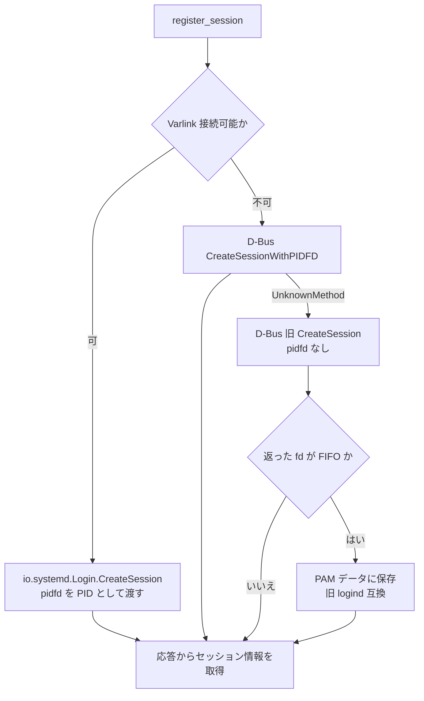

# 第19章 sd-login API と PAM 連携

> **本章で読むソース**
>
> - [`src/libsystemd/sd-login/sd-login.c`](https://github.com/systemd/systemd/blob/v261.1/src/libsystemd/sd-login/sd-login.c)
> - [`src/login/pam_systemd.c`](https://github.com/systemd/systemd/blob/v261.1/src/login/pam_systemd.c)
> - [`src/basic/cgroup-util.c`](https://github.com/systemd/systemd/blob/v261.1/src/basic/cgroup-util.c)

## この章の狙い

第18章で見た logind は、セッションを内部で管理するデーモンだった。
本章では、その logind を外から使う二つの側を読む。
一つはログイン時にセッションを作らせる PAM モジュール `pam_systemd` であり、もう一つはセッションの情報を問い合わせるクライアントライブラリ `sd-login` である。
セッションの帰属を cgroup の階層名だけから復元でき、状態の問い合わせが logind への通信なしに `/run` のファイル読み取りで完結するという、書き手と読み手を分離した設計を機構の中心に置く。

## 前提

- [第18章 logind のセッション管理](18-logind.md)：本章のクライアントが呼ぶ相手。
  セッションを scope ユニットに閉じ込め、状態を `/run/systemd/sessions/` へ書く。
- [第5章 sd-bus](../part01-foundation/05-sd-bus.md)：セッション生成要求の主経路は D-Bus と Varlink である。
- [第12章 cgroup](../part03-resources/12-cgroup.md)：セッションの帰属は cgroup パスに符号化される。

## ログインの入口としての PAM モジュール

ユーザーがログインすると、`login` や `sshd` や `gdm` などのプログラムが PAM を通す。
PAM のセッション段階で `pam_systemd.so` が呼ばれ、`pam_sm_open_session()` が実行される。
この関数がセッション生成の入口である。

[`src/login/pam_systemd.c` L1742-L1776](https://github.com/systemd/systemd/blob/v261.1/src/login/pam_systemd.c#L1742-L1776)

```c
_public_ PAM_EXTERN int pam_sm_open_session(
                pam_handle_t *pamh,
                int flags,
                int argc, const char **argv) {

        int r;

        assert(pamh);
        // ... (中略) ...
        _cleanup_(user_record_unrefp) UserRecord *ur = NULL;
        r = acquire_user_record(pamh, &ur);
        if (r != PAM_SUCCESS)
                return r;
```

`pam_sm_open_session()` は、まずユーザーレコードを取得し、続いてセッションの文脈を組み立てる。
文脈は PAM のアイテム（サービス名、TTY、遠隔ホストなど）と、環境変数 `XDG_SEAT` や `XDG_SESSION_TYPE` などから集める。

[`src/login/pam_systemd.c` L1778-L1795](https://github.com/systemd/systemd/blob/v261.1/src/login/pam_systemd.c#L1778-L1795)

```c
        _cleanup_(session_context_done) SessionContext c = {};
        r = pam_get_item_many(
                        pamh,
                        PAM_SERVICE,  &c.service,
                        PAM_XDISPLAY, &c.display,
                        PAM_TTY,      &c.tty,
                        PAM_RUSER,    &c.remote_user,
                        PAM_RHOST,    &c.remote_host);
        if (r != PAM_SUCCESS)
                return pam_syslog_pam_error(pamh, LOG_ERR, r, "Failed to get PAM items: @PAMERR@");

        c.seat = getenv_harder(pamh, "XDG_SEAT", NULL);
        c.vtnr = getenv_harder_uint32(pamh, "XDG_VTNR", 0);
        c.type = getenv_harder(pamh, "XDG_SESSION_TYPE", type_pam);
        c.class = getenv_harder(pamh, "XDG_SESSION_CLASS", class_pam);
```

文脈が揃うと `register_session()` を呼び、logind にセッションを作らせる。
戻ってきた席、型、ランタイムディレクトリを使って環境を整える。

[`src/login/pam_systemd.c` L1814-L1827](https://github.com/systemd/systemd/blob/v261.1/src/login/pam_systemd.c#L1814-L1827)

```c
        session_context_mangle(pamh, &c, ur, debug);

        _cleanup_free_ char *seat_buffer = NULL, *type_buffer = NULL, *runtime_dir = NULL;
        r = register_session(pamh, &c, ur, debug, &seat_buffer, &type_buffer, &runtime_dir);
        if (r != PAM_SUCCESS)
                return r;

        r = import_shell_credentials(pamh, debug);
        if (r != PAM_SUCCESS)
                return r;

        r = setup_environment(pamh, ur, runtime_dir, c.area, debug);
```

## Varlink を優先し D-Bus へ落ちる

`register_session()` は logind に `CreateSession` を要求する。
経路は複数あり、新しいものから順に試して段階的に後退する。



まず Varlink のソケット `/run/systemd/io.systemd.Login` へ接続を試みる。

[`src/login/pam_systemd.c` L1117-L1159](https://github.com/systemd/systemd/blob/v261.1/src/login/pam_systemd.c#L1117-L1159)

```c
        bool done = false;
        if (can_use_varlink(c)) {

                r = sd_varlink_connect_address(&vl, "/run/systemd/io.systemd.Login");
                if (r < 0)
                        pam_debug_syslog_errno(pamh, debug, r, "Failed to connect to logind via Varlink, falling back to D-Bus: %m");
                else {
                        // ... (中略) ...
                        r = sd_varlink_callbo(
                                        vl,
                                        "io.systemd.Login.CreateSession",
                                        &vreply,
                                        &error_id,
                                        SD_JSON_BUILD_PAIR_UNSIGNED("UID", ur->uid),
                                        JSON_BUILD_PAIR_PIDREF("PID", &pidref),
                                        JSON_BUILD_PAIR_STRING_NON_EMPTY("Service", c->service),
                                        JSON_BUILD_PAIR_ENUM("Type", c->type),
                                        JSON_BUILD_PAIR_ENUM("Class", c->class),
```

Varlink 呼び出しでは、自プロセスの pidfd を `PID` として渡す。
これにより logind は、第18章で見たリーダー追跡を pidfd で始められる。
Varlink に接続できなければ、`done` が偽のまま D-Bus 経由の `create_session_message()` へ落ちる。

[`src/login/pam_systemd.c` L1203-L1245](https://github.com/systemd/systemd/blob/v261.1/src/login/pam_systemd.c#L1203-L1245)

```c
        if (!done) {
                // ... (中略) ...
                r = create_session_message(
                                bus,
                                pamh,
                                ur,
                                c,
                                /* avoid_pidfd= */ false,
                                &m);
                if (r < 0)
                        return pam_bus_log_create_error(pamh, r);

                _cleanup_(sd_bus_error_free) sd_bus_error error = SD_BUS_ERROR_NULL;
                r = sd_bus_call(bus, m, LOGIN_SLOW_BUS_CALL_TIMEOUT_USEC, &error, &reply);
                if (r < 0 && sd_bus_error_has_name(&error, SD_BUS_ERROR_UNKNOWN_METHOD)) {
                        sd_bus_error_free(&error);
                        pam_debug_syslog(pamh, debug,
                                         "CreateSessionWithPIDFD() API is not available, retrying with CreateSession().");
```

D-Bus 経路はさらに二段の後退を持つ。
新しい `CreateSessionWithPIDFD` が使えなければ、pidfd を渡さない旧来の `CreateSession` を試す。
古い logind が返す fd が FIFO であれば、それを PAM データとして保存する。

[`src/login/pam_systemd.c` L1274-L1287](https://github.com/systemd/systemd/blob/v261.1/src/login/pam_systemd.c#L1274-L1287)

```c
        /* Since v258, logind fully relies on pidfd to monitor the lifetime of the session leader
         * process and returns a dummy session_fd (no longer a fifo). However because logind cannot
         * be restarted (known long-standing issue), we must still be prepared to receive a fifo fd
         * from a running logind older than v258. */
        if (sd_is_fifo(session_fd, NULL) > 0) {
                _cleanup_close_ int fd = fcntl(session_fd, F_DUPFD_CLOEXEC, 3);
                if (fd < 0)
                        return pam_syslog_errno(pamh, LOG_ERR, errno, "Failed to dup session fd: %m");

                r = sym_pam_set_data(pamh, "systemd.session-fd", FD_TO_PTR(fd), NULL);
```

## セッション環境の引き渡し

logind の応答からセッション ID、席、VT 番号、ランタイムディレクトリを受け取ると、それらを環境変数へ書き戻す。
セッション内のプロセスは、これらの `XDG_*` 変数からセッションの素性を知る。

[`src/login/pam_systemd.c` L1298-L1332](https://github.com/systemd/systemd/blob/v261.1/src/login/pam_systemd.c#L1298-L1332)

```c
        r = update_environment(pamh, "XDG_SESSION_ID", id);
        if (r != PAM_SUCCESS)
                return r;
        // ... (中略) ...
        r = update_environment(pamh, "XDG_SESSION_TYPE", c->type);
        if (r != PAM_SUCCESS)
                return r;

        r = update_environment(pamh, "XDG_SESSION_CLASS", c->class);
        if (r != PAM_SUCCESS)
                return r;
        // ... (中略) ...
        r = update_environment(pamh, "XDG_SEAT", real_seat);
        if (r != PAM_SUCCESS)
                return r;
```

ログアウト時には `pam_sm_close_session()` が呼ばれ、`XDG_SESSION_ID` を頼りに `ReleaseSession` を発行する。
ここでも Varlink を先に試し、失敗したら D-Bus へ落ちる。

[`src/login/pam_systemd.c` L1871-L1896](https://github.com/systemd/systemd/blob/v261.1/src/login/pam_systemd.c#L1871-L1896)

```c
        id = sym_pam_getenv(pamh, "XDG_SESSION_ID");
        if (id) {
                _cleanup_(sd_varlink_unrefp) sd_varlink *vl = NULL;
                bool done = false;

                r = sd_varlink_connect_address(&vl, "/run/systemd/io.systemd.Login");
                if (r < 0)
                        pam_debug_syslog_errno(pamh, debug, r, "Failed to connect to logind via Varlink, falling back to D-Bus: %m");
                else {
                        _cleanup_(sd_json_variant_unrefp) sd_json_variant *vreply = NULL;
                        const char *error_id = NULL;
                        r = sd_varlink_callbo(
                                        vl,
                                        "io.systemd.Login.ReleaseSession",
```

## クライアント API はデーモンに聞かない

`sd-login` は、セッションやシートの情報を読むための公開ライブラリである。
その大半の関数は logind と通信しない。
セッションの状態を返す `sd_session_get_state()` は、`/run/systemd/sessions/<id>` の状態ファイルから `STATE` の値を読むだけである。

[`src/libsystemd/sd-login/sd-login.c` L710-L729](https://github.com/systemd/systemd/blob/v261.1/src/libsystemd/sd-login/sd-login.c#L710-L729)

```c
_public_ int sd_session_get_state(const char *session, char **ret_state) {
        _cleanup_free_ char *p = NULL, *s = NULL;
        int r;

        r = file_of_session(session, &p);
        if (r < 0)
                return r;

        r = parse_env_file(/* f= */ NULL, p, "STATE", &s);
        if (r == -ENOENT)
                return -ENXIO;
        if (r < 0)
                return r;
        if (isempty(s))
                return -EIO;

        if (ret_state)
                *ret_state = TAKE_PTR(s);
        return 0;
}
```

`sd_session_is_active()` も同じ状態ファイルの `ACTIVE` を読むだけである。

[`src/libsystemd/sd-login/sd-login.c` L642-L659](https://github.com/systemd/systemd/blob/v261.1/src/libsystemd/sd-login/sd-login.c#L642-L659)

```c
_public_ int sd_session_is_active(const char *session) {
        _cleanup_free_ char *p = NULL, *s = NULL;
        int r;

        r = file_of_session(session, &p);
        if (r < 0)
                return r;

        r = parse_env_file(/* f= */ NULL, p, "ACTIVE", &s);
        if (r == -ENOENT)
                return -ENXIO;
        if (r < 0)
                return r;
        if (isempty(s))
                return -EIO;

        return parse_boolean(s);
}
```

セッションの列挙も、`/run/systemd/sessions/` のディレクトリを読むだけで済む。

[`src/libsystemd/sd-login/sd-login.c` L1000-L1010](https://github.com/systemd/systemd/blob/v261.1/src/libsystemd/sd-login/sd-login.c#L1000-L1010)

```c
_public_ int sd_get_sessions(char ***ret_sessions) {
        int r;

        r = get_files_in_directory("/run/systemd/sessions/", ret_sessions);
        if (r == -ENOENT) {
                if (ret_sessions)
                        *ret_sessions = NULL;
                return 0;
        }
        return r;
}
```

logind が状態ファイルの唯一の書き手であり、`sd-login` はその読み手に徹する。
この分離のおかげで、状態の問い合わせはデーモンへの往復を伴わない単なるファイル読み取りになる。
問い合わせる側は logind の応答を待たされず、logind は問い合わせのたびに割り込まれない。

## セッションの帰属は cgroup 名に書かれている

「このプロセスはどのセッションか」を答える `sd_pid_get_session()` は、状態ファイルすら読まない。
プロセスの cgroup パスを取り、その名前からセッション ID を切り出す。

[`src/basic/cgroup-util.c` L1050-L1087](https://github.com/systemd/systemd/blob/v261.1/src/basic/cgroup-util.c#L1050-L1087)

```c
int cg_path_get_session(const char *path, char **ret_session) {
        _cleanup_free_ char *unit = NULL;
        char *start, *end;
        int r;

        assert(path);

        r = cg_path_get_unit(path, &unit);
        if (r < 0)
                return r;

        start = startswith(unit, "session-");
        if (!start)
                return -ENXIO;
        end = endswith(start, ".scope");
        if (!end)
                return -ENXIO;

        *end = 0;
        if (!session_id_valid(start))
                return -ENXIO;
```

第18章で見たとおり、セッションのプロセスは `session-<id>.scope` という scope ユニットの cgroup に入っている。
`cg_path_get_session()` は cgroup パスからユニット名を取り出し、`session-` と `.scope` に挟まれた部分をセッション ID として返す。
セッションの帰属を cgroup の階層名そのものに符号化しておくことで、プロセスは自分の cgroup を読むだけで、logind に問い合わせることなくセッションを特定できる。
カーネルが cgroup の帰属を強制するため、この対応はプロセスが偽装できない。

## 変化を待つ inotify モニタ

状態ファイルを読む方式には、変化を検知する仕組みが要る。
`sd_login_monitor_new()` は `/run/systemd` 配下のディレクトリに inotify のウォッチを張り、そのファイルディスクリプタを呼び出し元に渡す。

[`src/libsystemd/sd-login/sd-login.c` L1183-L1218](https://github.com/systemd/systemd/blob/v261.1/src/libsystemd/sd-login/sd-login.c#L1183-L1218)

```c
_public_ int sd_login_monitor_new(const char *category, sd_login_monitor **ret) {
        _cleanup_close_ int fd = -EBADF;

        assert_return(ret, -EINVAL);

        fd = inotify_init1(IN_NONBLOCK|IN_CLOEXEC);
        if (fd < 0)
                return -errno;

        static const struct {
                const char *name;
                const char *path;
        } categories[] = {
                { "seat",     "/run/systemd/seats/"    },
                { "session",  "/run/systemd/sessions/" },
                { "uid",      "/run/systemd/users/"    },
                { "machine",  "/run/systemd/machines/" },
        };

        bool good = false;
        FOREACH_ELEMENT(c, categories) {
                if (category && !streq(category, c->name))
                        continue;

                if (inotify_add_watch(fd, c->path, IN_MOVED_TO|IN_DELETE) < 0)
                        return -errno;

                good = true;
        }
```

ウォッチは `IN_MOVED_TO` と `IN_DELETE` を見る。
第18章の `session_save()` は状態ファイルを一時ファイルへ書いてから名前を付け替える方式だったので、更新は `IN_MOVED_TO` として届く。
呼び出し元はこの fd を自分のイベントループに載せ、変化があったときだけファイルを読み直せる。
ポーリングで状態ファイルを何度も読み返す必要はない。

## まとめ

`pam_systemd` はログインの入口で、収集した文脈を添えて logind に `CreateSession` を要求し、応答を `XDG_*` 環境変数へ書き戻す。
経路は Varlink を優先し、使えなければ D-Bus へ、さらに旧 API へと段階的に後退する。
`sd-login` は状態の読み手で、logind と通信せず `/run` のファイルを読むか、cgroup 名からセッションを導く。
書き手（logind）と読み手（sd-login）を状態ファイルで分離し、帰属を cgroup 階層に符号化することで、問い合わせをデーモンへの往復から切り離したのが本章の中心的な工夫である。

## 関連する章

- [第18章 logind のセッション管理](18-logind.md)：状態ファイルの書き手であり、`CreateSession` の実装。
- [第24章 homed と Varlink](../part08-periphery/24-homed-and-varlink.md)：本章で使った Varlink IPC の仕組み。
- [第12章 cgroup](../part03-resources/12-cgroup.md)：セッションを表す scope ユニットの cgroup。
