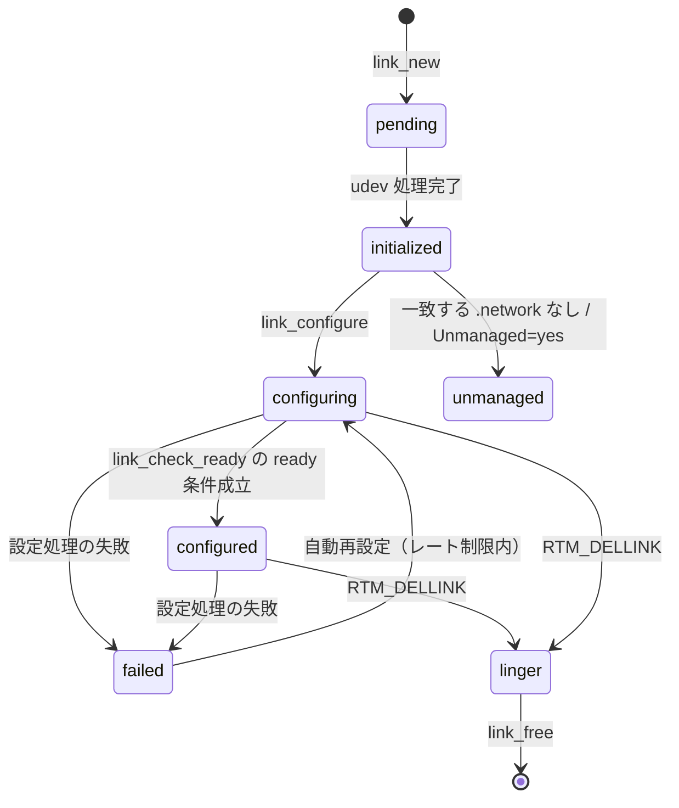

# 第20章 networkd のリンク管理

> **本章で読むソース**
>
> - [`src/network/networkd.c`](https://github.com/systemd/systemd/blob/v261.1/src/network/networkd.c)
> - [`src/network/networkd-link.c`](https://github.com/systemd/systemd/blob/v261.1/src/network/networkd-link.c)
> - [`src/network/networkd-link.h`](https://github.com/systemd/systemd/blob/v261.1/src/network/networkd-link.h)
> - [`src/network/networkd-state-file.c`](https://github.com/systemd/systemd/blob/v261.1/src/network/networkd-state-file.c)

## この章の狙い

`systemd-networkd` は、カーネルのネットワークインターフェースを設定するデーモンである。
本章では、networkd が特権を落として起動する流れと、各インターフェースを表す **Link** オブジェクトがどんな状態を経て設定済みへ至るかを読む。
一つのリンクの設定が数十の非同期な netlink 要求に分かれる中で、いつ「設定完了」と判断するかを一箇所で束ねる仕組みを機構の中心に置く。

## 前提

- [第4章 sd-event](../part01-foundation/04-sd-event.md)：networkd はイベントループ上で動き、rtnetlink と udev のメッセージを待つ。
- [第16章 udev デーモン](../part05-udev/16-udev-daemon.md)：リンクの初期化は udev の処理完了を待ってから始まる。
- [第2章 ユニットファイルと依存関係](../part00-overview/02-unit-files-and-dependencies.md)：`.network` ファイルの照合はユニットの `[Match]` に似た考え方である。

## 特権を落として起動する

`run()` は、root で起動された場合にランタイムディレクトリを作り、`systemd-network` ユーザーへ特権を落とす。
落とす際、ネットワーク管理に必要なケーパビリティだけを残す。

[`src/network/networkd.c` L44-L68](https://github.com/systemd/systemd/blob/v261.1/src/network/networkd.c#L44-L68)

```c
        if (geteuid() == 0) {
                uid_t uid;
                gid_t gid;

                r = get_user_creds("systemd-network", /* flags= */ 0, NULL, &uid, &gid, NULL, NULL);
                if (r < 0)
                        return log_error_errno(r, "Cannot resolve user name %s: %m", "systemd-network");
                // ... (中略) ...
                r = drop_privileges(uid, gid,
                                    (1ULL << CAP_NET_ADMIN) |
                                    (1ULL << CAP_NET_BIND_SERVICE) |
                                    (1ULL << CAP_NET_BROADCAST) |
                                    (1ULL << CAP_NET_RAW) |
                                    (1ULL << CAP_SYS_ADMIN) |
                                    (1ULL << CAP_BPF));
                if (r < 0)
                        return log_error_errno(r, "Failed to drop privileges: %m");
        }
```

root のまま動かさず必要なケーパビリティに絞るのは、万一デーモンが乗っ取られても被害範囲をネットワーク操作に限るためである。
特権を落としたあと、マネージャーを生成し、設定を読み、既存のインターフェースを列挙して起動する。

[`src/network/networkd.c` L81-L111](https://github.com/systemd/systemd/blob/v261.1/src/network/networkd.c#L81-L111)

```c
        r = manager_new(&m, /* test_mode= */ false);
        if (r < 0)
                return log_error_errno(r, "Could not create manager: %m");

        r = manager_setup(m);
        if (r < 0)
                return log_error_errno(r, "Could not set up manager: %m");
        // ... (中略) ...
        r = manager_enumerate(m);
        if (r < 0)
                return r;

        r = manager_deserialize(m);
        if (r < 0)
                log_warning_errno(r, "Failed to deserialize the previous invocation, ignoring: %m");

        r = manager_start(m);
        if (r < 0)
                return log_error_errno(r, "Could not start manager: %m");
```

## リンクの状態機械

各インターフェースは Link オブジェクトになり、七つの状態を持つ。
状態の定義は列挙型のコメントにそのまま書かれている。

[`src/network/networkd-link.h` L15-L22](https://github.com/systemd/systemd/blob/v261.1/src/network/networkd-link.h#L15-L22)

```c
        LINK_STATE_PENDING,     /* udev has not initialized the link */
        LINK_STATE_INITIALIZED, /* udev has initialized the link */
        LINK_STATE_CONFIGURING, /* configuring addresses, routes, etc. */
        LINK_STATE_CONFIGURED,  /* everything is configured */
        LINK_STATE_UNMANAGED,   /* Unmanaged=yes is set */
        LINK_STATE_FAILED,      /* at least one configuration process failed */
        LINK_STATE_LINGER,      /* RTM_DELLINK for the link has been received */
```

新しいリンクは `pending` で生まれる。
udev がそのデバイスを処理し終えると `initialized` へ進み、`.network` ファイルの照合と設定が始まると `configuring` になる。
すべての設定が済むと `configured` に達する。
`unmanaged` は管理対象外、`failed` は設定失敗、`linger` はカーネルからリンク削除通知（`RTM_DELLINK`）を受けた状態である。

状態の切り替えは `link_set_state()` に集約され、変化があればバスへ通知し、状態ファイルを更新対象に印付けする。

[`src/network/networkd-link.c` L377-L391](https://github.com/systemd/systemd/blob/v261.1/src/network/networkd-link.c#L377-L391)

```c
void link_set_state(Link *link, LinkState state) {
        assert(link);

        if (link->state == state)
                return;

        log_link_debug(link, "State changed: %s -> %s",
                       link_state_to_string(link->state),
                       link_state_to_string(state));

        link->state = state;

        link_send_changed(link, "AdministrativeState");
        link_dirty(link);
}
```



## udev の初期化を待つ

`link_check_initialized()` は、リンクに対応する udev デバイスが処理済みかを確かめる。
udev がまだそのデバイスを処理していなければ、ここで待って何もしない。

[`src/network/networkd-link.c` L1772-L1806](https://github.com/systemd/systemd/blob/v261.1/src/network/networkd-link.c#L1772-L1806)

```c
int link_check_initialized(Link *link) {
        _cleanup_(sd_device_unrefp) sd_device *device = NULL;
        int r;

        assert(link);

        if (!udev_available())
                return link_initialized_and_synced(link);

        /* udev should be around */
        r = sd_device_new_from_ifindex(&device, link->ifindex);
        if (r < 0) {
                log_link_debug_errno(link, r, "Could not find device, waiting for device initialization: %m");
                return 0;
        }

        r = device_is_processed(device);
        if (r < 0)
                return log_link_warning_errno(link, r, "Could not determine whether the device is processed by udevd: %m");
        if (r == 0) {
                /* not yet ready */
                log_link_debug(link, "link pending udev initialization...");
                return 0;
        }
```

udev の処理を待つのは、インターフェース名やデバイス属性が確定してから設定を始めるためである。
名前が確定する前に設定すると、`.network` ファイルの照合が誤る。
デバイスが処理済みなら `link_initialized()` を経て、`pending` から `initialized` へ移り、rtnetlink の `GETLINK` で最新状態と同期してから設定へ入る。

[`src/network/networkd-link.c` L1699-L1712](https://github.com/systemd/systemd/blob/v261.1/src/network/networkd-link.c#L1699-L1712)

```c
        if (link->state == LINK_STATE_PENDING) {
                log_link_debug(link, "Link state is up-to-date");
                link_set_state(link, LINK_STATE_INITIALIZED);

                r = link_new_bound_by_list(link);
                if (r < 0)
                        return r;

                r = link_handle_bound_by_list(link);
                if (r < 0)
                        return r;
        }

        return link_reconfigure_impl(link, /* flags= */ 0);
```

## .network ファイルを照合して設定へ入る

`link_reconfigure_impl()` は、リンクに合う `.network` ファイルを `link_get_network()` で探す。
一致するものがなければ `unmanaged` へ入り、あれば古い設定を落として新しいファイルを適用する。

[`src/network/networkd-link.c` L1492-L1531](https://github.com/systemd/systemd/blob/v261.1/src/network/networkd-link.c#L1492-L1531)

```c
        r = link_get_network(link, &network);
        if (r == -ENOENT) {
                link_enter_unmanaged(link);
                return 0;
        }
        if (r < 0)
                return r;

        if (link->network == network && !FLAGS_SET(flags, LINK_RECONFIGURE_UNCONDITIONALLY))
                return 0;
        // ... (中略) ...
        _cleanup_(network_unrefp) Network *old_network = TAKE_PTR(link->network);

        /* Then, apply new .network file */
        link->network = network_ref(network);
```

照合は `net_match_config()` に委ね、`[Match]` セクションの条件（MAC アドレス、ドライバ、名前、SSID など）をインターフェースの実際の属性と突き合わせる。

[`src/network/networkd-link.c` L1376-L1415](https://github.com/systemd/systemd/blob/v261.1/src/network/networkd-link.c#L1376-L1415)

```c
        ORDERED_HASHMAP_FOREACH(network, link->manager->networks) {
                bool warn = false;

                r = net_match_config(
                                &network->match,
                                link->dev,
                                &link->hw_addr,
                                &link->permanent_hw_addr,
                                link->driver,
                                link->iftype,
                                link->kind,
                                link->ifname,
                                link->alternative_names,
                                link->wlan_iftype,
                                link->ssid,
                                &link->bssid);
```

適用が決まると `initialized` に置き直し、`link_configure()` を呼ぶ。

[`src/network/networkd-link.c` L1552-L1562](https://github.com/systemd/systemd/blob/v261.1/src/network/networkd-link.c#L1552-L1562)

```c
        link_update_operstate(link, true);
        link_dirty(link);

        link_set_state(link, LINK_STATE_INITIALIZED);
        link->activated = false;

        r = link_configure(link);
        if (r < 0)
                return r;
```

## 設定は非同期な要求の束

`link_configure()` は状態を `configuring` にし、MTU、MAC、マスター、各種アドレス取得プロトコル、静的アドレスやルートといった設定項目を次々に要求する。
どの `link_request_*` も、rtnetlink へメッセージを送るだけで応答は待たない。

[`src/network/networkd-link.c` L1232-L1264](https://github.com/systemd/systemd/blob/v261.1/src/network/networkd-link.c#L1232-L1264)

```c
static int link_configure(Link *link) {
        int r;

        assert(link);
        assert(link->network);
        assert(link->state == LINK_STATE_INITIALIZED);

        link_set_state(link, LINK_STATE_CONFIGURING);

        r = link_drop_unmanaged_config(link);
        if (r < 0)
                return r;
        // ... (中略) ...
        r = link_configure_mtu(link);
        if (r < 0)
                return r;
```

これらの要求は内部の要求キューに積まれ、netlink 応答が届くたびにハンドラが対応するフラグ（`static_routes_configured` など）を立てる。
設定項目が同期的に一つずつ完了を待つのではなく、まとめて投げて応答を並行に受けるので、往復の待ち時間が重ならない。

## 完了判定を一箇所で束ねる

設定項目の完了ハンドラは、いずれも最後に `link_check_ready()` を呼ぶ。
この関数は、リンクが `configured` になる条件をすべて一箇所で点検する。
必須の静的設定やリンク層条件が未完了なら、その旨をデバッグログに残して戻る。
動的取得については、後段で少なくとも一つが ready かを判定する。

[`src/network/networkd-link.c` L484-L515](https://github.com/systemd/systemd/blob/v261.1/src/network/networkd-link.c#L484-L515)

```c
void link_check_ready(Link *link) {
        Address *a;

        assert(link);

        if (link->state == LINK_STATE_CONFIGURED)
                return;

        if (link->state != LINK_STATE_CONFIGURING)
                return (void) log_link_debug(link, "%s(): link is in %s state.", __func__, link_state_to_string(link->state));

        if (!link->network)
                return (void) log_link_debug(link, "%s(): link is unmanaged.", __func__);

        if (!link->tc_configured)
                return (void) log_link_debug(link, "%s(): traffic controls are not configured.", __func__);

        if (link->set_link_messages > 0)
                return (void) log_link_debug(link, "%s(): link layer is configuring.", __func__);

        if (!link->activated)
                return (void) log_link_debug(link, "%s(): link is not activated.", __func__);
```

静的アドレスやルートなどの静的設定はすべて完了するまで待つ。
一方、静的アドレスがない場合の動的取得は、IPv4LL、DHCPv4、DHCPv6、DHCP-PD、NDisc のうち少なくとも一つが ready になれば `configured` へ進む。
すべての条件が満たされたときだけ `ready` ラベルへ飛んで `configured` に切り替える。

[`src/network/networkd-link.c` L613-L627](https://github.com/systemd/systemd/blob/v261.1/src/network/networkd-link.c#L613-L627)

```c
        /* At least one dynamic addressing protocol is finished. */
        if (!ipv4ll_ready && !dhcp4_ready && !dhcp6_ready && !dhcp_pd_ready && !ndisc_ready)
                return (void) log_link_debug(link, "%s(): dynamic addressing protocols are enabled but none of them finished yet.", __func__);
        // ... (中略) ...
ready:
        link_set_state(link, LINK_STATE_CONFIGURED);
}
```

この設計が本章の中心である。
数十の設定項目は非同期に完了し、その順序は毎回変わりうる。
各ハンドラが自分の完了フラグだけを立て、共通の `link_check_ready()` が全項目を横断して判定するので、完了順序に依存せずに正しく `configured` を導ける。
最後に完了した項目が誰であっても、その完了ハンドラが呼ぶ `link_check_ready()` が残りの条件をすべて満たしていることを見つけ、状態を確定させる。

## 状態ファイルと wait-online

networkd は、リンクごとの状態と全体の集約状態を `/run/systemd/netif/` 配下へ書き出す。
`manager_save()` は各リンクの operstate やアドレス状態の最大値を取り、`required_for_online` なリンクのオンライン数と未オンライン数を数える。

[`src/network/networkd-state-file.c` L378-L396](https://github.com/systemd/systemd/blob/v261.1/src/network/networkd-state-file.c#L378-L396)

```c
        Link *link;
        HASHMAP_FOREACH(link, m->links_by_index) {
                if (link->flags & IFF_LOOPBACK)
                        continue;

                operstate = MAX(operstate, link->operstate);
                carrier_state = MAX(carrier_state, link->carrier_state);
                address_state = MAX(address_state, link->address_state);
                ipv4_address_state = MAX(ipv4_address_state, link->ipv4_address_state);
                ipv6_address_state = MAX(ipv6_address_state, link->ipv6_address_state);

                if (!link->network)
                        continue;

                if (link->network->required_for_online) {
                        if (link->online_state == LINK_ONLINE_STATE_OFFLINE)
                                links_offline++;
                        else if (link->online_state == LINK_ONLINE_STATE_ONLINE)
                                links_online++;
                }
```

集約したオンライン状態は、`systemd-networkd-wait-online.service` が「ネットワークが上がったか」を判断する材料になる。
第19章の sd-login と同じく、状態ファイルの書き手はデーモンであり、待ち受ける側はファイルを読むか inotify で変化を待つ。

## まとめ

networkd は特権を落として起動し、各インターフェースを Link として七つの状態で扱う。
udev の初期化を待ってから `.network` ファイルを照合し、一致すれば非同期な netlink 要求を束にして送る。
それらの完了順序は一定しないが、各ハンドラが共通の `link_check_ready()` を呼び、静的設定の完了と動的取得の ready 条件を横断的に点検してから `configured` へ切り替える。
この完了判定の一元化が、順序非依存で正しく設定完了を導く本章の工夫である。

## 関連する章

- [第21章 resolved のスタブリゾルバ](21-resolved.md)：networkd が配る DNS 情報を受け取る名前解決デーモン。
- [第16章 udev デーモン](../part05-udev/16-udev-daemon.md)：リンク初期化の前提となるデバイス処理。
- [第4章 sd-event](../part01-foundation/04-sd-event.md)：rtnetlink と udev イベントを捌くループ。
