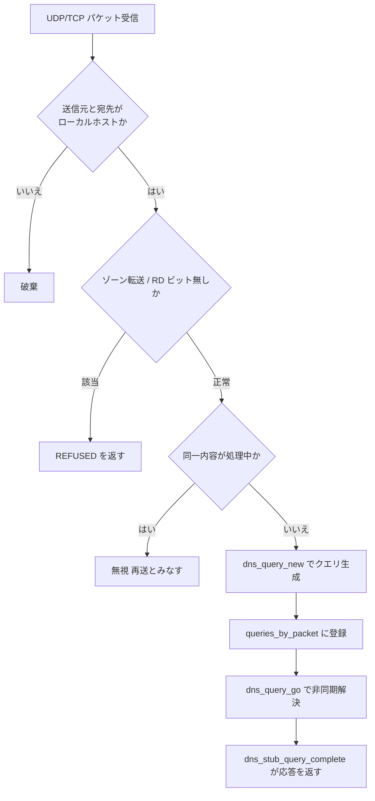

# 第21章 resolved のスタブリゾルバ

> **本章で読むソース**
>
> - [`src/resolve/resolved-manager.c`](https://github.com/systemd/systemd/blob/v261.1/src/resolve/resolved-manager.c)
> - [`src/resolve/resolved-dns-stub.c`](https://github.com/systemd/systemd/blob/v261.1/src/resolve/resolved-dns-stub.c)

## この章の狙い

`systemd-resolved` は、名前解決を一手に引き受けるデーモンである。
アプリケーションは `127.0.0.53` に立つ小さな DNS サーバー（スタブリゾルバ）へ問い合わせを投げ、resolved がその先の上流サーバーや LLMNR、mDNS を使って解決する。
本章では、このスタブリゾルバがどんなソケットを開き、届いた DNS パケットをどう検証してクエリへ変換するかを読む。
同じ問い合わせが何度も届いたときに上流への重複解決を避ける仕組みと、外部からの到達を物理的に断つソケット設定を機構の中心に置く。

## 前提

- [第4章 sd-event](../part01-foundation/04-sd-event.md)：スタブソケットはイベントループの IO イベントソースになる。
- [第20章 networkd のリンク管理](20-networkd.md)：リンクごとの DNS サーバー情報を resolved に渡す送り手。
- [第5章 sd-bus](../part01-foundation/05-sd-bus.md)：スタブ以外に D-Bus と Varlink の問い合わせ口も持つ。

## resolved の全体像とスタブの位置

resolved のマネージャーは、名前解決の経路を「スコープ」という単位で束ねる。
`manager_new()` は、上流の DNS サーバーへ問い合わせるグローバルなユニキャストスコープを作り、ネットワーク変化やホスト名を監視するイベントソースを張る。

[`src/resolve/resolved-manager.c` L780-L790](https://github.com/systemd/systemd/blob/v261.1/src/resolve/resolved-manager.c#L780-L790)

```c
        r = dns_scope_new(m, &m->unicast_scope, DNS_SCOPE_GLOBAL, /* link= */ NULL, /* delegate= */ NULL, DNS_PROTOCOL_DNS, AF_UNSPEC);
        if (r < 0)
                return r;

        r = manager_network_monitor_listen(m);
        if (r < 0)
                return r;

        r = manager_rtnl_listen(m);
        if (r < 0)
                return r;
```

問い合わせを受け付ける口は複数ある。
D-Bus と Varlink のインターフェース、NSS モジュール向けの経路、そして本章で読むスタブリゾルバである。
スタブリゾルバは、`/etc/resolv.conf` が `127.0.0.53` を指すよう設定された環境で、既存の DNS クライアントをそのまま resolved に接続させるための互換口である。
`manager_start()` が `manager_dns_stub_start()` を呼んでスタブを立ち上げる。

[`src/resolve/resolved-manager.c` L831-L845](https://github.com/systemd/systemd/blob/v261.1/src/resolve/resolved-manager.c#L831-L845)

```c
int manager_start(Manager *m) {
        int r;

        assert(m);

        r = manager_dns_stub_start(m);
        if (r < 0)
                return r;

        r = manager_varlink_init(m);
        if (r < 0)
                return r;

        return 0;
}
```

## スタブが開くソケット

`manager_dns_stub_start()` は、二つのアドレスについて UDP と TCP のソケットを開く。
`127.0.0.53` が通常のスタブ、`127.0.0.54` は DNS プロキシ用である。

[`src/resolve/resolved-dns-stub.c` L1394-L1420](https://github.com/systemd/systemd/blob/v261.1/src/resolve/resolved-dns-stub.c#L1394-L1420)

```c
        else {
                static const struct {
                        uint32_t addr;
                        int socket_type;
                } stub_sockets[] = {
                        { INADDR_DNS_STUB,       SOCK_DGRAM  },
                        { INADDR_DNS_STUB,       SOCK_STREAM },
                        { INADDR_DNS_PROXY_STUB, SOCK_DGRAM  },
                        { INADDR_DNS_PROXY_STUB, SOCK_STREAM },
                };
                // ... (中略) ...
                FOREACH_ELEMENT(s, stub_sockets) {
                        union in_addr_union a = {
                                .in.s_addr = htobe32(s->addr),
                        };
                        // ... (中略) ...
                        r = manager_dns_stub_fd(m, AF_INET, &a, s->socket_type);
```

ポート 53 を使うには `CAP_NET_BIND_SERVICE` が要る。
起動時にこのケーパビリティがなければ、スタブは作らずに警告を出す。

[`src/resolve/resolved-dns-stub.c` L1390-L1393](https://github.com/systemd/systemd/blob/v261.1/src/resolve/resolved-dns-stub.c#L1390-L1393)

```c
        if (m->dns_stub_listener_mode == DNS_STUB_LISTENER_NO)
                log_debug("Not creating stub listener.");
        else if (!have_effective_cap(CAP_NET_BIND_SERVICE))
                log_warning("Missing CAP_NET_BIND_SERVICE capability, not creating stub listener on port 53.");
```

## 外部からの到達を断つ

`127.0.0.53` はループバックアドレスだが、それだけでは外部からのパケットが届く経路を完全には塞げない。
`manager_dns_stub_fd()` は、通常のスタブソケットをループバックインターフェースに縛り付け、さらに送出 TTL を 1 に設定する。

[`src/resolve/resolved-dns-stub.c` L1227-L1248](https://github.com/systemd/systemd/blob/v261.1/src/resolve/resolved-dns-stub.c#L1227-L1248)

```c
        if (!address_is_proxy(family, listen_addr)) {
                /* Make sure no traffic from outside the local host can leak to onto this socket */
                r = socket_bind_to_ifindex(fd, LOOPBACK_IFINDEX);
                if (r < 0)
                        return r;

                r = socket_set_ttl(fd, family, 1);
                if (r < 0)
                        return r;
        } else if (type == SOCK_DGRAM) {
                /* Turn off Path MTU Discovery for UDP, for security reasons. See socket_disable_pmtud() for
                 * a longer discussion. (We only do this for sockets that are potentially externally
                 * accessible, i.e. the proxy stub one. For the non-proxy one we instead set the TTL to 1,
                 * see above, so that packets don't get routed at all.) */
                r = socket_disable_pmtud(fd, family);
```

ループバックへの束縛と TTL=1 の二重の措置により、通常スタブへのパケットはホストの外へ出ることも外から入ることもできない。
プロキシ用の `127.0.0.54` は NAT リダイレクトで外部トラフィックを受ける用途があるため、代わりに Path MTU Discovery を切る別の防御を選ぶ。
バインドが済むと、UDP なら `on_dns_stub_packet`、TCP なら `on_dns_stub_stream` を IO イベントソースとして登録する。

[`src/resolve/resolved-dns-stub.c` L1261-L1272](https://github.com/systemd/systemd/blob/v261.1/src/resolve/resolved-dns-stub.c#L1261-L1272)

```c
        r = sd_event_add_io(m->event, event_source, fd, EPOLLIN,
                            type == SOCK_DGRAM ? on_dns_stub_packet : on_dns_stub_stream,
                            m);
        if (r < 0)
                return r;

        r = sd_event_source_set_io_fd_own(*event_source, true);
        if (r < 0)
                return r;
```

## 届いたパケットを検証する

UDP パケットが届くと `on_dns_stub_packet_internal()` が `manager_recv()` で受信し、`dns_stub_process_query()` へ渡す。
届いたパケットは、次の関門を順に通ってからクエリに変換される。



この関数は、まず送信元と宛先がローカルホストであることを確かめる。

[`src/resolve/resolved-dns-stub.c` L939-L945](https://github.com/systemd/systemd/blob/v261.1/src/resolve/resolved-dns-stub.c#L939-L945)

```c
        if (!l && /* l == NULL if this is the main stub */
            !address_is_proxy(p->family, &p->destination) && /* don't restrict needlessly for 127.0.0.54 */
            (in_addr_is_localhost(p->family, &p->sender) <= 0 ||
             in_addr_is_localhost(p->family, &p->destination) <= 0)) {
                log_warning("Got packet on unexpected (i.e. non-localhost) IP range, ignoring.");
                return;
        }
```

続いて、自分が上流へ投げたパケットのループバックでないこと、パケットが正しく解釈できること、EDNS のバージョンが対応範囲であることを順に確かめる。
廃止された型やゾーン転送の要求、そして再帰要求ビット（RD）が立っていない問い合わせは、対応するエラーコードで拒否する。

[`src/resolve/resolved-dns-stub.c` L978-L989](https://github.com/systemd/systemd/blob/v261.1/src/resolve/resolved-dns-stub.c#L978-L989)

```c
        if (dns_type_is_zone_transfer(dns_question_first_key(p->question)->type)) {
                log_debug("Got request for zone transfer, refusing.");
                dns_stub_send_failure(m, l, s, p, DNS_RCODE_REFUSED, false);
                return;
        }

        if (!DNS_PACKET_RD(p))  {
                /* If the "rd" bit is off (i.e. recursion was not requested), then refuse operation */
                log_debug("Got request with recursion disabled, refusing.");
                dns_stub_send_failure(m, l, s, p, DNS_RCODE_REFUSED, false);
                return;
        }
```

## 重複した問い合わせを一つにまとめる

UDP は信頼性のないプロトコルなので、クライアントは応答が来ないと同じ問い合わせを再送する。
resolved は、処理中の問い合わせをパケット内容で引けるハッシュマップに登録しておき、同じ内容のパケットが再び届いたら無視する。

[`src/resolve/resolved-dns-stub.c` L952-L957](https://github.com/systemd/systemd/blob/v261.1/src/resolve/resolved-dns-stub.c#L952-L957)

```c
        queries_by_packet = l ? &l->queries_by_packet : &m->stub_queries_by_packet;
        existing = hashmap_get(*queries_by_packet, p);
        if (existing && dns_packet_equal(existing->request_packet, p)) {
                log_debug("Got repeat packet from client, ignoring.");
                return;
        }
```

新しい問い合わせについては、クエリオブジェクトを作ったあとに、この request パケットをキーとして登録する。

[`src/resolve/resolved-dns-stub.c` L1053-L1063](https://github.com/systemd/systemd/blob/v261.1/src/resolve/resolved-dns-stub.c#L1053-L1063)

```c
        /* Add the query to the hash table we use to determine repeat packets now. We don't care about
         * failures here, since in the worst case we'll not recognize duplicate incoming requests, which
         * isn't particularly bad. */
        (void) hashmap_put(*queries_by_packet, q->request_packet, q);

        r = dns_query_go(q);
        if (r < 0) {
                log_error_errno(r, "Failed to start query: %m");
                dns_stub_send_failure(m, l, s, p, DNS_RCODE_SERVFAIL, false);
                return;
        }
```

これが本章の中心的な工夫である。
名前解決は上流サーバーへの往復を含み、応答が返るまでに時間がかかる。
その間にクライアントが再送してくると、素朴には同じ名前を何度も上流へ問い合わせてしまう。
処理中のクエリをパケット内容で索引しておくことで、再送は進行中の一件に吸収され、上流への問い合わせは一つに保たれる。
重複を取りこぼしても正しさは損なわれない（最悪でも上流への問い合わせが増えるだけである）ため、登録の失敗は無視してよい。

## クエリを非同期に走らせて応答を返す

検証を通ったパケットは `dns_query_new()` でクエリへ変換される。
DNSSEC が要求されている（DO ビット）場合やプロキシ宛ての場合は、resolved が内容を加工せずそのまま通す「バイパス」モードを有効にする。

[`src/resolve/resolved-dns-stub.c` L1007-L1027](https://github.com/systemd/systemd/blob/v261.1/src/resolve/resolved-dns-stub.c#L1007-L1027)

```c
        } else if (dns_packet_do(p)) {
                log_debug("Got request with DNSSEC enabled, enabling bypass logic.");
                bypass = true;
        }

        if (bypass)
                r = dns_query_new(m, &q, NULL, NULL, p, 0,
                                  protocol_flags|
                                  SD_RESOLVED_NO_CNAME|
                                  SD_RESOLVED_NO_SEARCH|
                                  (DNS_PACKET_CD(p) ? SD_RESOLVED_NO_VALIDATE | SD_RESOLVED_NO_CACHE : 0)|
                                  SD_RESOLVED_REQUIRE_PRIMARY|
                                  SD_RESOLVED_CLAMP_TTL|
                                  SD_RESOLVED_RELAX_SINGLE_LABEL);
```

クエリには完了コールバック `dns_stub_query_complete` を仕掛け、`dns_query_go()` で走らせて関数は戻る。
解決が終わると、このコールバックがスタブへ応答パケットを組み立てて送り返す。
問い合わせのたびにスレッドを塞がず、複数の解決を並行に進められる。

[`src/resolve/resolved-dns-stub.c` L1036-L1039](https://github.com/systemd/systemd/blob/v261.1/src/resolve/resolved-dns-stub.c#L1036-L1039)

```c
        q->request_packet = dns_packet_ref(p);
        q->request_stream = dns_stream_ref(s); /* make sure the stream stays around until we can send a reply through it */
        q->stub_listener_extra = l;
        q->complete = dns_stub_query_complete;
```

TCP の場合は、ストリームが途中で切れたときに投げっぱなしのクエリを取り消せるよう、ストリームごとに所属するクエリの集合を覚えておく。

[`src/resolve/resolved-dns-stub.c` L1041-L1051](https://github.com/systemd/systemd/blob/v261.1/src/resolve/resolved-dns-stub.c#L1041-L1051)

```c
        if (s) {
                /* Remember which queries belong to this stream, so that we can cancel them when the stream
                 * is disconnected early */

                r = set_ensure_put(&s->queries, NULL, q);
                if (r < 0) {
                        log_oom();
                        return;
                }
                assert(r > 0);
        }
```

## まとめ

resolved は名前解決をスコープ単位で束ねるデーモンで、既存の DNS クライアント向けに `127.0.0.53` のスタブリゾルバを提供する。
スタブソケットはループバックへ縛られ TTL=1 で送出されるため、外部との行き来が物理的に断たれる。
届いたパケットは送信元とプロトコル要件を検証してからクエリへ変換され、非同期に解決されて応答が返る。
処理中のクエリをパケット内容で索引することで、UDP 再送を進行中の一件へ吸収し、上流への重複問い合わせを避けるのが本章の工夫である。

## 関連する章

- [第20章 networkd のリンク管理](20-networkd.md)：リンクごとの DNS サーバー情報を resolved に供給する。
- [第24章 homed と Varlink](../part08-periphery/24-homed-and-varlink.md)：resolved も備える Varlink インターフェースの仕組み。
- [第4章 sd-event](../part01-foundation/04-sd-event.md)：スタブソケットと上流応答を捌くイベントループ。
