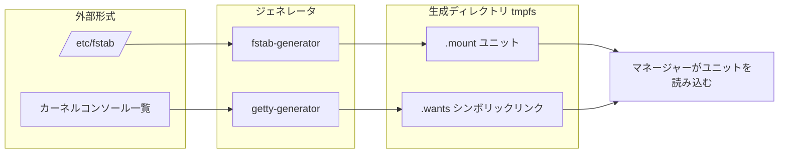

# 第22章 ユニットジェネレータ

> **本章で読むソース**
>
> - [`src/shared/generator.h`](https://github.com/systemd/systemd/blob/v261.1/src/shared/generator.h)
> - [`src/shared/generator.c`](https://github.com/systemd/systemd/blob/v261.1/src/shared/generator.c)
> - [`src/getty-generator/getty-generator.c`](https://github.com/systemd/systemd/blob/v261.1/src/getty-generator/getty-generator.c)
> - [`src/fstab-generator/fstab-generator.c`](https://github.com/systemd/systemd/blob/v261.1/src/fstab-generator/fstab-generator.c)

## この章の狙い

`/etc/fstab` やカーネルコマンドラインは、systemd のユニットファイルではない。
それでも systemd はこれらを起動時に読み、マウントや getty を自動で立ち上げる。
橋渡しをするのが **ジェネレータ**である。
ジェネレータは、外部の設定形式を systemd のユニットファイルへ翻訳する小さなプログラムである。
本章では、ジェネレータの共通の枠組みと、getty ジェネレータおよび fstab ジェネレータの二例を読む。
外部形式のパーサをマネージャー本体から切り離す設計を機構の中心に置く。

## 前提

- [第2章 ユニットファイルと依存関係](../part00-overview/02-unit-files-and-dependencies.md)：ジェネレータが出力するユニットと依存関係の記法。
- [第6章 マネージャー](../part02-core/06-manager.md)：ジェネレータを起動時に呼び、その出力を読み込む側。
- [第10章 ソケットアクティベーション](../part02-core/10-socket-activation.md)：`.wants` ディレクトリによる依存の張り方は本章と共通である。

## ジェネレータという共通の型

ジェネレータは、マネージャーが起動の初期（およびリロード時）に実行する短命のプログラムである。
外部形式の解釈はジェネレータの中で完結し、マネージャーは生成された一様なユニットだけを読む。



出力先のディレクトリを引数で受け取り、そこにユニットファイルと依存関係のシンボリックリンクを書き出して終了する。
共通の入口が `DEFINE_MAIN_GENERATOR_FUNCTION` マクロで、引数の個数を検査し、ログを初期化して実装関数へ渡す。

[`src/shared/generator.h` L106-L118](https://github.com/systemd/systemd/blob/v261.1/src/shared/generator.h#L106-L118)

```c
/* Similar to DEFINE_MAIN_FUNCTION, but initializes logging and assigns positional arguments. */
#define DEFINE_MAIN_GENERATOR_FUNCTION(impl)                            \
        _DEFINE_MAIN_FUNCTION(                                          \
                ({                                                      \
                        log_setup_generator();                          \
                        if (!IN_SET(argc, 2, 4))                        \
                                return log_error_errno(SYNTHETIC_ERRNO(EINVAL), \
                                                       "This program takes one or three arguments."); \
                }),                                                     \
                impl(argv[1],                                           \
                     argv[argc == 4 ? 2 : 1],                           \
                     argv[argc == 4 ? 3 : 1]),                          \
                exit_failure_if_negative)
```

引数は一つか三つである。
三つの場合は「通常」「早期」「後期」の三種類の出力先で、依存関係の解決順序に応じて使い分ける。
どのジェネレータも、この三つの出力先へファイルを置くだけで、マネージャーとは標準入出力や引数以外のやり取りをしない。

出力を作る道具も共通である。
`generator_open_unit_file()` は出力先にユニットファイルを新規作成し、`generator_add_symlink()` は依存関係を表すシンボリックリンクを張る。
ユニットファイルの作成は `O_EXCL` 相当の排他モードで開き、同名が既にあれば重複エントリとして検出する。

[`src/shared/generator.c` L69-L76](https://github.com/systemd/systemd/blob/v261.1/src/shared/generator.c#L69-L76)

```c
                r = fopen_unlocked(p, "wxe", &f);
                if (r < 0) {
                        if (source && r == -EEXIST)
                                return log_error_errno(r,
                                                       "Failed to create unit file '%s', as it already exists. Duplicate entry in '%s'?",
                                                       p, source);

                        return log_error_errno(r, "Failed to create unit file '%s': %m", p);
```

## 例その一 getty ジェネレータ

getty ジェネレータは、シリアルコンソールやコンテナの端末に対して、ログインプロンプト（getty）を自動で用意する。
`run()` は、カーネルコマンドラインや資格情報から有効な入力源を決め、初期 RAM ディスク内なら何もせずに終わる。

[`src/getty-generator/getty-generator.c` L275-L295](https://github.com/systemd/systemd/blob/v261.1/src/getty-generator/getty-generator.c#L275-L295)

```c
static int run(const char *dest, const char *dest_early, const char *dest_late) {
        int r;

        assert_se(arg_dest = dest);

        if (in_initrd()) {
                log_debug("Skipping generator, running in the initrd.");
                return EXIT_SUCCESS;
        }
        // ... (中略) ...
        if (arg_getty_sources == GETTY_SOURCE_NONE) {
                log_debug("Disabled, exiting.");
                return 0;
        }
```

有効なカーネルコンソールを見つけると、仮想端末でないものについて `add_serial_getty()` を呼ぶ。

[`src/getty-generator/getty-generator.c` L312-L331](https://github.com/systemd/systemd/blob/v261.1/src/getty-generator/getty-generator.c#L312-L331)

```c
        /* Automatically add in a serial getty on all active kernel consoles */
        if (FLAGS_SET(arg_getty_sources, GETTY_SOURCE_CONSOLE)) {
                _cleanup_strv_free_ char **consoles = NULL;
                r = get_kernel_consoles(&consoles);
                if (r < 0)
                        log_warning_errno(r, "Failed to get active kernel consoles, ignoring: %m");
                else if (r > 0)
                        STRV_FOREACH(i, consoles) {
                                /* We assume that gettys on virtual terminals are started via manual
                                 * configuration and do this magic only for non-VC terminals. */
                                if (tty_is_vc(*i))
                                        continue;

                                if (verify_tty(*i) < 0)
                                        continue;

                                r = add_serial_getty(*i);
                                if (r < 0)
                                        return r;
                        }
        }
```

getty ジェネレータはユニットファイルそのものを書かない。
既存のテンプレートユニット `serial-getty@.service` を、対象の TTY 名でインスタンス化して `getty.target` の `.wants` に張るだけである。

[`src/getty-generator/getty-generator.c` L36-L60](https://github.com/systemd/systemd/blob/v261.1/src/getty-generator/getty-generator.c#L36-L60)

```c
static int add_getty_impl(const char *tty, const char *path, const char *type, const char *unit_path) {
        int r;
        // ... (中略) ...
        _cleanup_free_ char *instance = NULL;
        r = unit_name_path_escape(tty, &instance);
        if (r < 0)
                return log_error_errno(r, "Failed to escape %s tty path %s: %m", type, tty);

        log_debug("Automatically adding %s getty for %s.", type, tty);

        return generator_add_symlink_full(arg_dest, "getty.target", "wants", unit_path, instance);
}

static int add_serial_getty(const char *path) {
        const char *tty = skip_dev_prefix(ASSERT_PTR(path));
        return add_getty_impl(tty, path, "serial", SYSTEM_DATA_UNIT_DIR "/serial-getty@.service");
}
```

`generator_add_symlink_full()` は、テンプレートをインスタンス化した名前で `<target>.<dep_type>/` の下にリンクを作る。
既存のユニットファイルを書き換えず、リンクを一本増やすだけで依存関係を追加できる。

[`src/shared/generator.c` L118-L129](https://github.com/systemd/systemd/blob/v261.1/src/shared/generator.c#L118-L129)

```c
        if (instance) {
                r = unit_name_replace_instance(fn, instance, &instantiated);
                if (r < 0)
                        return log_error_errno(r, "Failed to instantiate '%s' for '%s': %m", fn, instance);
        }

        if (dep_type) { /* Create a .wants/ style dep */
                from = path_join(dn ?: "..", fn);
                if (!from)
                        return log_oom();

                to = strjoin(dir, "/", dst, ".", dep_type, "/", instantiated ?: fn);
```

## 例その二 fstab ジェネレータ

fstab ジェネレータは、`/etc/fstab` の各行を `.mount` ユニットや `.swap` ユニットへ翻訳する。
`parse_fstab()` は libmount で fstab を読み、各エントリを `parse_fstab_one()` へ渡す。

[`src/fstab-generator/fstab-generator.c` L1059-L1081](https://github.com/systemd/systemd/blob/v261.1/src/fstab-generator/fstab-generator.c#L1059-L1081)

```c
        for (;;) {
                struct libmnt_fs *fs;

                r = sym_mnt_table_next_fs(table, iter, &fs);
                if (r < 0)
                        return log_error_errno(r, "Failed to get next entry from '%s': %m", fstab);
                if (r > 0) /* EOF */
                        return ret;

                r = parse_fstab_one(
                                fstab,
                                sym_mnt_fs_get_source(fs),
                                sym_mnt_fs_get_target(fs),
                                sym_mnt_fs_get_fstype(fs),
                                sym_mnt_fs_get_options(fs),
                                sym_mnt_fs_get_passno(fs),
                                prefix_sysroot,
                                /* accept_root= */ false,
                                /* use_swap_enabled= */ true);
```

翻訳の実体が `add_mount()` である。
マウント先のパスから `.mount` ユニット名を作り、`generator_open_unit_file()` で出力先にユニットファイルを開いて `[Unit]` と `[Mount]` を書き込む。

[`src/fstab-generator/fstab-generator.c` L556-L568](https://github.com/systemd/systemd/blob/v261.1/src/fstab-generator/fstab-generator.c#L556-L568)

```c
        r = unit_name_from_path(where, ".mount", &name);
        if (r < 0)
                return log_error_errno(r, "Failed to generate unit name: %m");

        r = generator_open_unit_file(dest, source, name, &f);
        if (r < 0)
                return r;

        fprintf(f,
                "[Unit]\n"
                "Documentation=man:fstab(5) man:systemd-fstab-generator(8)\n"
                "SourcePath=%s\n",
                source);
```

`SourcePath=` に元の fstab を記録しておくのは、生成物がどの設定に由来するかをマネージャーが追跡できるようにするためである。
fstab の `x-systemd.*` オプションは、この段階で依存関係やタイムアウトへ翻訳される。
たとえば NFS の `bg` マウントは、systemd 側でジョブ制御するためにオプションを組み替える。

[`src/fstab-generator/fstab-generator.c` L570-L582](https://github.com/systemd/systemd/blob/v261.1/src/fstab-generator/fstab-generator.c#L570-L582)

```c
        if (STRPTR_IN_SET(fstype, "nfs", "nfs4") && !(flags & MOUNT_AUTOMOUNT) &&
            fstab_test_yes_no_option(opts, "bg\0" "fg\0")) {
                // ... (中略) ...
                opts = strjoina("x-systemd.mount-timeout=infinity,retry=10000,nofail,", opts, ",fg");
                SET_FLAG(flags, MOUNT_NOFAIL, true);
        }
```

## 外部形式のパーサをマネージャーから切り離す

getty ジェネレータと fstab ジェネレータは、扱う入力も出力も違う。
片方はテンプレートへのリンクを張り、もう片方はユニットファイルを書き起こす。
共通するのは、外部形式（カーネルコンソール一覧、fstab）を解釈するのはジェネレータであり、マネージャーではないという点である。

これが本章の中心である。
マネージャー本体は、fstab や getty の作法を一切知らない。
libmount を呼ぶのも、`/dev/hvc0` のような端末を試すのも、ジェネレータの中だけで起きる。
マネージャーが読むのは、常に一様なユニットファイルと `.wants` リンクである。
外部形式ごとの特別扱いを起動の初期に隔離することで、依存解決やユニット読み込みという中心の経路を単純に保てる。
ジェネレータどうしは独立したプログラムなので、マネージャーはこれらを並行に起動でき、出力は tmpfs 上の生成ディレクトリへ書かれるため実ディスクへの書き込みを伴わない。

## まとめ

ジェネレータは、外部の設定形式を systemd のユニットへ翻訳する短命のプログラムである。
`DEFINE_MAIN_GENERATOR_FUNCTION` で出力先を受け取り、`generator_open_unit_file()` でユニットを書き、`generator_add_symlink()` で依存を張る。
getty ジェネレータはテンプレートをインスタンス化してリンクを張り、fstab ジェネレータは `.mount` ユニットを書き起こす。
外部形式の解釈をジェネレータへ隔離することで、マネージャーの中心経路を一様なユニットの扱いに保つのが本章の工夫である。

## 関連する章

- [第23章 tmpfiles と sysusers](23-tmpfiles-and-sysusers.md)：起動時に宣言的な設定を適用するもう一組のツール。
- [第6章 マネージャー](../part02-core/06-manager.md)：ジェネレータを起動しその出力を読む側。
- [第2章 ユニットファイルと依存関係](../part00-overview/02-unit-files-and-dependencies.md)：生成されるユニットと `.wants` の意味。
