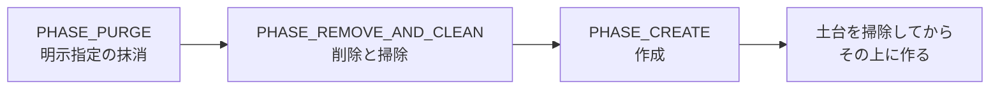

# 第23章 tmpfiles と sysusers

> **本章で読むソース**
>
> - [`src/tmpfiles/tmpfiles.c`](https://github.com/systemd/systemd/blob/v261.1/src/tmpfiles/tmpfiles.c)
> - [`src/sysusers/sysusers.c`](https://github.com/systemd/systemd/blob/v261.1/src/sysusers/sysusers.c)

## この章の狙い

`systemd-tmpfiles` と `systemd-sysusers` は、起動時にシステムの状態を宣言どおりに整える二つのツールである。
前者はファイルやディレクトリの作成と掃除を、後者はシステムユーザーとグループの登録を担う。
どちらも「あるべき状態」を設定ファイルで宣言し、現在の状態との差分を埋める点で共通する。
本章では、tmpfiles が操作を段階に分けて安全に適用する仕組みと、sysusers が `/etc/passwd` などを壊さずに書き換える仕組みを読む。

## 前提

- [第22章 ユニットジェネレータ](22-unit-generators.md)：起動時に宣言的設定を適用するという発想を本章と共有する。
- [第2章 ユニットファイルと依存関係](../part00-overview/02-unit-files-and-dependencies.md)：これらのツールは対応するサービスユニットから起動される。

## tmpfiles の宣言と行の種別

tmpfiles の設定は行単位で、各行の先頭一文字が操作の種別を表す。
種別は列挙型 `ItemType` にまとまっていて、その文字がそのまま列挙値になっている。

[`src/tmpfiles/tmpfiles.c` L86-L119](https://github.com/systemd/systemd/blob/v261.1/src/tmpfiles/tmpfiles.c#L86-L119)

```c
typedef enum ItemType {
        /* These ones take file names */
        CREATE_FILE                    = 'f',
        TRUNCATE_FILE                  = 'F', /* deprecated: use f+ */
        CREATE_DIRECTORY               = 'd',
        TRUNCATE_DIRECTORY             = 'D',
        CREATE_SUBVOLUME               = 'v',
        // ... (中略) ...
        CREATE_SYMLINK                 = 'L',
        CREATE_CHAR_DEVICE             = 'c',
        CREATE_BLOCK_DEVICE            = 'b',
        COPY_FILES                     = 'C',

        /* These ones take globs */
        WRITE_FILE                     = 'w',
        EMPTY_DIRECTORY                = 'e',
        SET_XATTR                      = 't',
        // ... (中略) ...
        REMOVE_PATH                    = 'r',
        RECURSIVE_REMOVE_PATH          = 'R',
        RELABEL_PATH                   = 'z',
        RECURSIVE_RELABEL_PATH         = 'Z',
        ADJUST_MODE                    = 'm', /* legacy, 'z' is identical to this */
} ItemType;
```

種別は二群に分かれる。
前半はファイル名を対象に何かを作る操作、後半は glob（ワイルドカード）を対象に属性を変える操作や掃除する操作である。
`f` はファイル作成、`d` はディレクトリ作成、`L` はシンボリックリンク、`z` は SELinux ラベルの付け直し、`r` はパスの削除である。

種別ごとの実処理は `create_item()` の巨大な `switch` に集約される。
たとえばファイル作成は親ディレクトリを用意してから中身を書く。

[`src/tmpfiles/tmpfiles.c` L3101-L3121](https://github.com/systemd/systemd/blob/v261.1/src/tmpfiles/tmpfiles.c#L3101-L3121)

```c
        switch (i->type) {

        case IGNORE_PATH:
        case IGNORE_DIRECTORY_PATH:
        case REMOVE_PATH:
        case RECURSIVE_REMOVE_PATH:
                return 0;

        case TRUNCATE_FILE:
        case CREATE_FILE:
                r = mkdir_parents_item(i, S_IFREG);
                if (r < 0)
                        return r;

                if ((i->type == CREATE_FILE && i->append_or_force) || i->type == TRUNCATE_FILE)
                        r = truncate_file(c, i, i->path);
                else
                        r = create_file(c, i, i->path);
                if (r < 0)
                        return r;
                break;
```

## 掃除してから作る段階分け

tmpfiles は、一度の起動で「削除」と「作成」の両方を求められることがある。
古いものを消してから新しいものを作らないと、消したいものと作りたいものが衝突する。
`run()` は操作を三つの段階に分け、必ずこの順で回す。



[`src/tmpfiles/tmpfiles.c` L4846-L4851](https://github.com/systemd/systemd/blob/v261.1/src/tmpfiles/tmpfiles.c#L4846-L4851)

```c
        enum {
                PHASE_PURGE,
                PHASE_REMOVE_AND_CLEAN,
                PHASE_CREATE,
                _PHASE_MAX
        } phase;
```

段階のループでは、各段階に該当する操作だけを選んで適用する。
コメントが順序の理由をそのまま述べている。

[`src/tmpfiles/tmpfiles.c` L4977-L5001](https://github.com/systemd/systemd/blob/v261.1/src/tmpfiles/tmpfiles.c#L4977-L5001)

```c
        /* If multiple operations are requested, let's first run the remove/clean operations, and only then
         * the create operations. i.e. that we first clean out the platform we then build on. */
        for (phase = 0; phase < _PHASE_MAX; phase++) {
                OperationMask op;

                if (phase == PHASE_PURGE)
                        op = arg_operation & OPERATION_PURGE;
                else if (phase == PHASE_REMOVE_AND_CLEAN)
                        op = arg_operation & (OPERATION_REMOVE|OPERATION_CLEAN);
                else if (phase == PHASE_CREATE)
                        op = arg_operation & OPERATION_CREATE;
                else
                        assert_not_reached();

                if (op == 0) /* Nothing requested in this phase */
                        continue;

                /* The non-globbing ones usually create things, hence we apply them first */
                ORDERED_HASHMAP_FOREACH(a, c.items)
                        RET_GATHER(r, process_item_array(&c, a, op));

                /* The globbing ones usually alter things, hence we apply them second. */
                ORDERED_HASHMAP_FOREACH(a, c.globs)
                        RET_GATHER(r, process_item_array(&c, a, op));
        }
```

段階の中でも、glob でない項目（主に作成）を先に、glob の項目（主に属性変更）を後に適用する。
段階分けの前には、項目どうしの親子関係を結んでおく。
ディレクトリを作る項目が、その中のファイルを作る項目より先に処理されるようにするためである。

[`src/tmpfiles/tmpfiles.c` L4965-L4975](https://github.com/systemd/systemd/blob/v261.1/src/tmpfiles/tmpfiles.c#L4965-L4975)

```c
        /* Let's now link up all child/parent relationships */
        ORDERED_HASHMAP_FOREACH(a, c.items) {
                r = link_parent(&c, a);
                if (r < 0)
                        return r;
        }
        ORDERED_HASHMAP_FOREACH(a, c.globs) {
                r = link_parent(&c, a);
                if (r < 0)
                        return r;
        }
```

この段階分けが tmpfiles の中心的な工夫である。
削除と作成を同じ順不同のループで混ぜると、消す前に作ったり、作った直後に消したりして、結果が入力順に依存する。
「まず掃除し、その上に組み立てる」という順序を段階として固定することで、設定ファイル中の行の順番によらず、同じ入力からは同じ最終状態が得られる。

## sysusers の宣言とシステムユーザーの登録

sysusers は、システムサービスが必要とするユーザーとグループを宣言的に用意する。
`run()` は設定を読み、既存のユーザーデータベースを読み込んでから、各項目を処理して最後にファイルを書く。

処理の前に `/etc/passwd` のロックを取り、他のツールとの競合を防ぐ。

[`src/sysusers/sysusers.c` L2368-L2388](https://github.com/systemd/systemd/blob/v261.1/src/sysusers/sysusers.c#L2368-L2388)

```c
        if (!arg_dry_run) {
                lock = take_etc_passwd_lock(arg_root);
                if (lock < 0)
                        return log_error_errno(lock, "Failed to take /etc/passwd lock: %m");
        }

        r = load_user_database(&c);
        if (r < 0)
                return log_error_errno(r, "Failed to load user database: %m");

        r = load_group_database(&c);
        if (r < 0)
                return log_error_errno(r, "Failed to read group database: %m");

        ORDERED_HASHMAP_FOREACH(i, c.groups)
                (void) process_item(&c, i);

        ORDERED_HASHMAP_FOREACH(i, c.users)
                (void) process_item(&c, i);

        return write_files(&c);
```

グループを先に、ユーザーを後に処理するのは、ユーザーの主グループが先に存在している必要があるからである。
処理段階では UID や GID の割り当てだけを決め、実際の書き込みは最後の `write_files()` にまとめる。

## 壊さずに書き換える一時ファイルと原子的な差し替え

`/etc/passwd` や `/etc/shadow` は、システムのログインを支える要のファイルである。
書き換えの途中で電源が落ちても、これらが半端な状態になってはならない。
`write_files()` は、まず四つのファイルすべてを一時ファイルとして書き出す。

[`src/sysusers/sysusers.c` L975-L989](https://github.com/systemd/systemd/blob/v261.1/src/sysusers/sysusers.c#L975-L989)

```c
        r = write_temporary_group(c, group_path, &group, &group_tmp);
        if (r < 0)
                return r;

        r = write_temporary_gshadow(c, gshadow_path, &gshadow, &gshadow_tmp);
        if (r < 0)
                return r;

        r = write_temporary_passwd(c, passwd_path, &passwd, &passwd_tmp);
        if (r < 0)
                return r;

        r = write_temporary_shadow(c, shadow_path, &shadow, &shadow_tmp);
        if (r < 0)
                return r;
```

一時ファイルの用意が全部成功してから、古いファイルのバックアップを取り、最後に一時ファイルを本来の名前へ改名して差し替える。

[`src/sysusers/sysusers.c` L1014-L1021](https://github.com/systemd/systemd/blob/v261.1/src/sysusers/sysusers.c#L1014-L1021)

```c
        /* And make the new files count */
        if (group) {
                r = rename_and_apply_smack_floor_label(group_tmp, group_path);
                if (r < 0)
                        return log_error_errno(r, "Failed to rename %s to %s: %m",
                                               group_tmp, group_path);
                group_tmp = mfree(group_tmp);
        }
```

これが sysusers の中心的な工夫である。
`rename()` は同一ファイルシステム上で原子的に完了する。
既存の名前に対して改名すると、その名前は一瞬たりとも欠けることなく、古い内容から新しい内容へ切り替わる。
書き込みの途中でクラッシュしても、まだ改名していない本来のファイルは元のまま残る。
生成に失敗した一時ファイルは、`unlink_and_freep` により自動で消える。
ロックと原子的な改名を組み合わせることで、複数の書き手が同時に走っても、また途中で異常終了しても、認証情報のファイルは常に整合した状態を保つ。

## まとめ

tmpfiles と sysusers は、あるべき状態を宣言して現在との差分を埋める起動時ツールである。
tmpfiles は種別文字で操作を表し、削除と作成を段階に分けて順序を固定することで、入力順に依存しない最終状態を導く。
sysusers はロックを取り、四つのファイルを一時ファイルへ書いてから原子的に改名することで、認証情報を壊さずに更新する。
どちらも、宣言的な設定を安全に適用するための順序と原子性の工夫を備えている。

## 関連する章

- [第22章 ユニットジェネレータ](22-unit-generators.md)：起動時に宣言的設定をユニットへ翻訳するツール。
- [第19章 sd-login API と PAM 連携](../part06-logind/19-sd-login.md)：sysusers が用意するユーザーを使うログインの経路。
