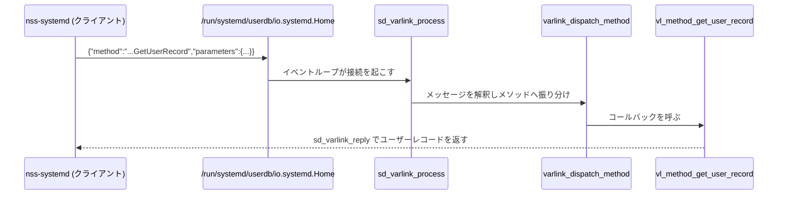

# 第24章 homed と Varlink

> **本章で読むソース**
>
> - [`src/home/homed.c`](https://github.com/systemd/systemd/blob/v261.1/src/home/homed.c)
> - [`src/home/homed-manager.c`](https://github.com/systemd/systemd/blob/v261.1/src/home/homed-manager.c)
> - [`src/home/homed-varlink.c`](https://github.com/systemd/systemd/blob/v261.1/src/home/homed-varlink.c)
> - [`src/libsystemd/sd-varlink/sd-varlink.c`](https://github.com/systemd/systemd/blob/v261.1/src/libsystemd/sd-varlink/sd-varlink.c)

## この章の狙い

`systemd-homed` は、持ち運び可能で自己完結したホームディレクトリ（ホームエリア）を管理するデーモンである。
homed が管理するユーザーは `/etc/passwd` に載らない。
それでも `getpwnam()` のような通常の名前解決でこれらのユーザーが見えるのは、homed が **Varlink** というプロトコルでユーザーデータベースを提供しているからである。
本章では、homed が Varlink サーバーとしてどう自分を公開するかと、その Varlink がどんな仕組みの IPC かを読む。
一度の要求で複数の応答を流せる仕組みを機構の中心に置く。

## 前提

- [第19章 sd-login API と PAM 連携](../part06-logind/19-sd-login.md)：Varlink を使う側の例として `CreateSession` を見た。
- [第4章 sd-event](../part01-foundation/04-sd-event.md)：Varlink サーバーはイベントループ上で接続を処理する。
- [第23章 tmpfiles と sysusers](23-tmpfiles-and-sysusers.md)：`/etc/passwd` に載る従来のシステムユーザーとの対比。

## homed の骨格

`homed.c` はごく短い。
マネージャーを作り、起動処理を回し、イベントループへ入るだけである。

[`src/home/homed.c` L16-L46](https://github.com/systemd/systemd/blob/v261.1/src/home/homed.c#L16-L46)

```c
static int run(int argc, char *argv[]) {
        _cleanup_(manager_freep) Manager *m = NULL;
        _unused_ _cleanup_(notify_on_cleanup) const char *notify_stop = NULL;
        int r;

        log_setup();
        // ... (中略) ...
        r = manager_new(&m);
        if (r < 0)
                return log_error_errno(r, "Could not create manager: %m");

        r = manager_startup(m);
        if (r < 0)
                return log_error_errno(r, "Failed to start up daemon: %m");

        notify_stop = notify_start(NOTIFY_READY_MESSAGE, NOTIFY_STOPPING_MESSAGE);

        r = sd_event_loop(m->event);
```

実際の管理はマネージャーが担い、各ホームエリアは Home オブジェクトとして `homes_by_uid` などのハッシュマップに保持される。
外部への公開口は二つあり、管理操作向けの D-Bus と、名前解決向けの Varlink である。

## userdb 提供者としての Varlink サーバー

`manager_bind_varlink()` は Varlink サーバーを作り、`io.systemd.UserDatabase` インターフェースの三つのメソッドを登録する。

[`src/home/homed-manager.c` L1072-L1088](https://github.com/systemd/systemd/blob/v261.1/src/home/homed-manager.c#L1072-L1088)

```c
        r = sd_varlink_server_add_interface_many(
                        m->varlink_server,
                        &vl_interface_io_systemd_UserDatabase,
                        &vl_interface_io_systemd_service);
        if (r < 0)
                return log_error_errno(r, "Failed to add UserDatabase interface to varlink server: %m");

        r = sd_varlink_server_bind_method_many(
                        m->varlink_server,
                        "io.systemd.UserDatabase.GetUserRecord",  vl_method_get_user_record,
                        "io.systemd.UserDatabase.GetGroupRecord", vl_method_get_group_record,
                        "io.systemd.UserDatabase.GetMemberships", vl_method_get_memberships,
                        "io.systemd.service.Ping",                varlink_method_ping,
                        "io.systemd.service.SetLogLevel",         varlink_method_set_log_level,
                        "io.systemd.service.GetEnvironment",      varlink_method_get_environment);
```

サーバーは `/run/systemd/userdb/io.systemd.Home` という決まった場所の unix ソケットで待ち受け、イベントループに接続する。

[`src/home/homed-manager.c` L1101-L1107](https://github.com/systemd/systemd/blob/v261.1/src/home/homed-manager.c#L1101-L1107)

```c
        r = sd_varlink_server_listen_address(m->varlink_server, socket_path, 0666 | SD_VARLINK_SERVER_MODE_MKDIR_0755);
        if (r < 0)
                return log_error_errno(r, "Failed to bind to varlink socket '%s': %m", socket_path);

        r = sd_varlink_server_attach_event(m->varlink_server, m->event, SD_EVENT_PRIORITY_NORMAL);
        if (r < 0)
                return log_error_errno(r, "Failed to attach varlink connection to event loop: %m");
```

`/run/systemd/userdb/` に置かれた各ソケットが、userdb の照会先になる。
NSS の nss-systemd モジュールは、名前を解決するときこのディレクトリのソケットへ Varlink で問い合わせ、homed もその一つとして応答する。
無限再帰を避けるため、homed 自身は `$SYSTEMD_BYPASS_USERDB` に自分のサービス名を入れ、自分への問い合わせを迂回する。

[`src/home/homed-manager.c` L1114-L1116](https://github.com/systemd/systemd/blob/v261.1/src/home/homed-manager.c#L1114-L1116)

```c
        /* Avoid recursion */
        if (setenv("SYSTEMD_BYPASS_USERDB", m->userdb_service, 1) < 0)
                return log_error_errno(errno, "Failed to set $SYSTEMD_BYPASS_USERDB: %m");
```

## Varlink のメッセージと状態機械

Varlink は、unix ストリームソケット上で JSON オブジェクトをやり取りする素朴な IPC である。
名前解決の一件が流れる経路は次のようになる。



接続一本ごとに状態機械を持ち、`sd_varlink_process()` がイベントループから呼ばれて一段ずつ状態を進める。
書き込み、応答の処理、メソッドの実行、次のメッセージの解釈、読み込みを順に試す。

[`src/libsystemd/sd-varlink/sd-varlink.c` L1384-L1402](https://github.com/systemd/systemd/blob/v261.1/src/libsystemd/sd-varlink/sd-varlink.c#L1384-L1402)

```c
        r = varlink_write(v);
        if (r < 0)
                varlink_log_errno(v, r, "Write failed: %m");
        if (r != 0)
                goto finish;

        r = varlink_dispatch_reply(v);
        if (r < 0)
                varlink_log_errno(v, r, "Reply dispatch failed: %m");
        if (r != 0)
                goto finish;

        r = varlink_dispatch_method(v);
        if (r < 0)
                varlink_log_errno(v, r, "Method dispatch failed: %m");
        if (r != 0)
                goto finish;

        r = varlink_parse_message(v);
```

サーバー側の要求は JSON オブジェクトで、`method`（呼ぶメソッド名）、`parameters`（引数）、そして三つの真偽フラグ `oneway`、`more`、`upgrade` を持つ。
`varlink_dispatch_method()` がこのオブジェクトを分解し、フラグを読み取る。

[`src/libsystemd/sd-varlink/sd-varlink.c` L1155-L1193](https://github.com/systemd/systemd/blob/v261.1/src/libsystemd/sd-varlink/sd-varlink.c#L1155-L1193)

```c
        JSON_VARIANT_OBJECT_FOREACH(k, e, v->current) {

                if (streq(k, "method")) {
                        if (method)
                                goto invalid;
                        if (!sd_json_variant_is_string(e))
                                goto invalid;

                        method = sd_json_variant_string(e);

                } else if (streq(k, "parameters")) {
                        // ... (中略) ...
                } else if (streq(k, "oneway")) {
                        // ... (中略) ...
                } else if (streq(k, "more")) {

                        if ((flags & (SD_VARLINK_METHOD_ONEWAY|SD_VARLINK_METHOD_MORE|SD_VARLINK_METHOD_UPGRADE)) != 0)
                                goto invalid;

                        if (!sd_json_variant_is_boolean(e))
                                goto invalid;

                        if (sd_json_variant_boolean(e))
                                flags |= SD_VARLINK_METHOD_MORE;
```

メソッド名から登録済みのコールバックを引き、それを呼ぶ。

[`src/libsystemd/sd-varlink/sd-varlink.c` L1232-L1245](https://github.com/systemd/systemd/blob/v261.1/src/libsystemd/sd-varlink/sd-varlink.c#L1232-L1245)

```c
        /* First consult user supplied method implementations */
        bool is_fiber = false;
        callback = hashmap_get(v->server->methods, method);
        if (!callback) {
                callback = hashmap_get(v->server->fiber_methods, method);
                if (callback)
                        is_fiber = true;
        }
        if (!callback) {
                if (streq(method, "org.varlink.service.GetInfo"))
                        callback = generic_method_get_info;
                else if (streq(method, "org.varlink.service.GetInterfaceDescription"))
                        callback = generic_method_get_interface_description;
        }
```

`org.varlink.service.GetInfo` や `GetInterfaceDescription` を汎用ハンドラが持つのは、Varlink がインターフェース記述（IDL）を自己記述する仕組みを備えるためである。
クライアントは相手のインターフェース定義を問い合わせて、送る引数を検証できる。

## メソッドの実装（homed 側）

homed の `vl_method_get_user_record()` は、要求の引数を型付きで取り出し、UID か名前でホームを引く。

[`src/home/homed-varlink.c` L99-L113](https://github.com/systemd/systemd/blob/v261.1/src/home/homed-varlink.c#L99-L113)

```c
        r = sd_varlink_dispatch(link, parameters, dispatch_table, &p);
        if (r != 0)
                return r;

        if (!streq_ptr(p.service, m->userdb_service))
                return sd_varlink_error(link, "io.systemd.UserDatabase.BadService", NULL);

        r = sd_varlink_set_sentinel(link, "io.systemd.UserDatabase.NoRecordFound");
        if (r < 0)
                return r;

        if (uid_is_valid(p.uid))
                h = hashmap_get(m->homes_by_uid, UID_TO_PTR(p.uid));
        else if (p.user_name) {
                r = manager_get_home_by_name(m, p.user_name, &h);
```

一件が見つかれば、そのユーザーレコードを JSON に組み立てて `sd_varlink_reply()` で返す。

[`src/home/homed-varlink.c` L145-L152](https://github.com/systemd/systemd/blob/v261.1/src/home/homed-varlink.c#L145-L152)

```c
        trusted = client_is_trusted(link, h);

        _cleanup_(sd_json_variant_unrefp) sd_json_variant *v = NULL;
        r = build_user_json(h, trusted, &v);
        if (r < 0)
                return r;

        return sd_varlink_reply(link, v);
```

## 一度の要求で複数を返す

UID も名前も指定されなかったとき、この関数は全ホームを列挙して返す。
一件ごとに `sd_varlink_reply()` を呼び、ループの中で複数の応答を流す。

[`src/home/homed-varlink.c` L118-L136](https://github.com/systemd/systemd/blob/v261.1/src/home/homed-varlink.c#L118-L136)

```c
                /* If neither UID nor name was specified, then dump all homes. */

                HASHMAP_FOREACH(h, m->homes_by_uid) {
                        if (!home_user_match_lookup_parameters(&p, h))
                                continue;

                        trusted = client_is_trusted(link, h);

                        _cleanup_(sd_json_variant_unrefp) sd_json_variant *v = NULL;
                        r = build_user_json(h, trusted, &v);
                        if (r < 0)
                                return r;

                        r = sd_varlink_reply(link, v);
                        if (r < 0)
                                return r;
                }

                return 0;
```

これを成り立たせるのが、要求時の `more` フラグである。
クライアントが `more` を立てて呼ぶと、サーバーは一つの要求に対して応答を何度でも返せる。
これが本章の中心的な工夫である。
ユーザー一覧のような複数件の結果を返すとき、素朴には一件ごとに要求と応答の往復を繰り返すことになる。
`more` による連続応答なら、要求は一度だけで、サーバーは見つかった順に結果を流し込める。
往復の回数が件数に比例して増えることを避けられる。

## まとめ

homed は持ち運び可能なホームエリアを管理し、自身を Varlink の userdb 提供者として公開する。
NSS はこの Varlink ソケットへ問い合わせることで、`/etc/passwd` に載らない homed のユーザーを解決できる。
Varlink は unix ソケット上で JSON オブジェクトをやり取りする IPC で、接続ごとの状態機械としてイベントループ上で処理される。
要求は `method` と `parameters` にフラグを添えた形をとり、`more` フラグによって一度の要求で複数の応答を流せる。
この連続応答が、列挙の往復を件数分繰り返さずに済ませる本章の工夫である。

## 関連する章

- [第19章 sd-login API と PAM 連携](../part06-logind/19-sd-login.md)：Varlink をクライアントとして使う例。
- [第21章 resolved のスタブリゾルバ](../part07-network/21-resolved.md)：resolved も備える Varlink インターフェース。
- [第23章 tmpfiles と sysusers](23-tmpfiles-and-sysusers.md)：`/etc/passwd` に載る従来型システムユーザーとの対比。
