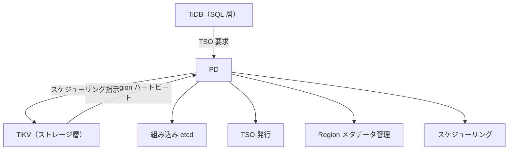

# 第1章 PD とは何か

> **本章で読むソース**
>
> - [`cmd/pd-server/main.go`](https://github.com/tikv/pd/blob/v8.5.6/cmd/pd-server/main.go)
> - [`server/server.go`](https://github.com/tikv/pd/blob/v8.5.6/server/server.go)
> - [`server/grpc_service.go`](https://github.com/tikv/pd/blob/v8.5.6/server/grpc_service.go)
> - [`pkg/id/id.go`](https://github.com/tikv/pd/blob/v8.5.6/pkg/id/id.go)

## この章の狙い

PD が TiDB エコシステムの中で何を担い、どの層に位置するかを示す。
PD の役割を `Server` 構造体や gRPC サービスの定義に結び付け、後続の各部がどの論点を引き継ぐかを前方リンクで案内する。
導入章なので個々の機構には深入りせず、入口の所在と全体の構図を確定させることに絞る。

## 前提

TiDB エコシステムは、SQL を処理する計算層の TiDB、分散ストレージ層の TiKV、列指向の解析エンジン TiFlash、メタデータと時刻を司る PD から成る。
本書はこのうち PD を読む。
読者には Go と分散システムの基礎を仮定する。
本章のコード引用はすべて tikv/pd のタグ `v8.5.6` に固定する。

## PD の位置付け

**PD（Placement Driver）** は TiDB エコシステムのクラスタマネージャであり、クラスタ全体のメタデータ管理と調整を担う。
TiKV が各ノードでデータを保持し複製するのに対し、PD はクラスタを俯瞰する立場から、時刻の発行、メタデータの集約、負荷分散の指示を出す。
この役割は3つの柱に分けて捉えられる。

第1の柱は **TSO（Timestamp Oracle）の発行**である。
TiDB のトランザクションは、開始と確定それぞれで単調増加するタイムスタンプを必要とする。
PD はこのタイムスタンプを一元的に発行し、クラスタ内のすべてのトランザクションに時間的順序を与える。
TSO は物理時刻と論理カウンタの組で構成され、単調性は PD のリーダーノードが保証する。
TSO の生成機構と永続化は第1部で読む。

第2の柱は **Region メタデータの管理**である。
TiKV はキー空間を **Region** という連続したキー範囲の単位に分割し、各 Region を複数ノードに複製する。
どの Region がどのキー範囲を持ち、どの **Store** にレプリカがあり、だれがリーダーであるかを、PD が一元的に把握する。
TiKV の各 Store は定期的に**ハートビート**を送り、PD はそれを受けてメタデータを更新する。
Region メタデータの構造とハートビートの処理は第2部で読む。

第3の柱は**スケジューリング**である。
PD はハートビートで集めた統計に基づいて、Region のレプリカ移動やリーダー移動を指示する **Operator** を生成する。
Operator は TiKV へのハートビート応答に載せて送り返される。
リーダーの均衡、Region の均衡、ホットスポットの解消など、目的に応じた**スケジューラ**が Operator を生み出す。
スケジューリング基盤と個々のスケジューラは第3部と第4部で読む。

全体の構図を図1に示す。



図1　PD の3つの柱と、TiDB、TiKV との関係。PD は組み込み etcd の上に構築される。

## エントリポイント

PD の `main` 関数は `cmd/pd-server/main.go` にある。
cobra の `rootCmd` を組み立て、`createServerWrapper` を実行関数として渡す。

[`cmd/pd-server/main.go L60-L75`](https://github.com/tikv/pd/blob/v8.5.6/cmd/pd-server/main.go#L60-L75)

```go
func main() {
	rootCmd := &cobra.Command{
		Use:   "pd-server",
		Short: "Placement Driver server",
		Run:   createServerWrapper,
	}

	addFlags(rootCmd)
	rootCmd.AddCommand(NewServiceCommand())

	rootCmd.SetOutput(os.Stdout)
	if err := rootCmd.Execute(); err != nil {
		rootCmd.Println(err)
		exit(1)
	}
}
```

`createServerWrapper` が呼ぶ `start` 関数は、まず `schedulers.Register()` で組み込みスケジューラを登録し、設定を解析してから、`server.CreateServer` でサーバーを生成する。

[`cmd/pd-server/main.go L263-L272`](https://github.com/tikv/pd/blob/v8.5.6/cmd/pd-server/main.go#L263-L272)

```go
	ctx, cancel := context.WithCancel(context.Background())
	serviceBuilders := []server.HandlerBuilder{api.NewHandler, apiv2.NewV2Handler, autoscaling.NewHandler}
	if swaggerserver.Enabled() {
		serviceBuilders = append(serviceBuilders, swaggerserver.NewHandler)
	}
	serviceBuilders = append(serviceBuilders, dashboard.GetServiceBuilders()...)
	svr, err := server.CreateServer(ctx, cfg, services, serviceBuilders...)
	if err != nil {
		log.Fatal("create server failed", errs.ZapError(err))
	}
```

`CreateServer` に渡す `serviceBuilders` は REST API のハンドラ群である。
v1 API、v2 API、オートスケーリング、ダッシュボードといった HTTP サービスがここで注入される。
生成したサーバーは `svr.Run()` でブロッキング起動し、シグナルで停止する。

[`cmd/pd-server/main.go L274-L291`](https://github.com/tikv/pd/blob/v8.5.6/cmd/pd-server/main.go#L274-L291)

```go
	sc := make(chan os.Signal, 1)
	signal.Notify(sc,
		syscall.SIGHUP,
		syscall.SIGINT,
		syscall.SIGTERM,
		syscall.SIGQUIT)

	var sig os.Signal
	go func() {
		sig = <-sc
		cancel()
	}()

	if err := svr.Run(); err != nil {
		log.Fatal("run server failed", errs.ZapError(err))
	}
```

## Server 構造体

PD プロセスの中心は `Server` 構造体である。
フィールドに、PD の3つの柱がそのまま対応する。

[`server/server.go L135-L191`](https://github.com/tikv/pd/blob/v8.5.6/server/server.go#L135-L191)

```go
// Server is the pd server. It implements bs.Server
type Server struct {
	diagnosticspb.DiagnosticsServer

	// Server state. 0 is not running, 1 is running.
	isRunning int64

	// Server start timestamp
	startTimestamp int64

	// Configs and initial fields.
	cfg                             *config.Config
	// ... (中略) ...
	persistOptions                  *config.PersistOptions
	handler                         *Handler

	// ... (中略) ...

	// for PD leader election.
	member *member.EmbeddedEtcdMember
	// etcd client
	client *clientv3.Client
	// electionClient is used for leader election.
	electionClient *clientv3.Client
	// ... (中略) ...

	// Server services.
	// for id allocator, we can use one allocator for
	// store, region and peer, because we just need
	// a unique ID.
	idAllocator id.Allocator
	// ... (中略) ...
	// for storage operation.
	storage storage.Storage
	// ... (中略) ...
	// for basicCluster operation.
	basicCluster *core.BasicCluster
	// for tso.
	tsoAllocatorManager *tso.AllocatorManager
	// for raft cluster
	cluster *cluster.RaftCluster
	// For async region heartbeat.
	hbStreams *hbstream.HeartbeatStreams
```

「TSO の発行」に対応するのが `tsoAllocatorManager` である。
「Region メタデータの管理」に対応するのが `basicCluster`、`storage`、`hbStreams` である。
`basicCluster` がメモリ上の Region 情報を、`storage` が etcd と LevelDB への永続化を、`hbStreams` がハートビート応答の非同期送信を担う。
「スケジューリング」に対応するのが `cluster`（`RaftCluster`）である。
`RaftCluster` はクラスタ全体の運用を取りまとめる構造体であり、内部に Coordinator を持ってスケジューリングループの起点となる。

リーダー選出を担うのが `member`（`EmbeddedEtcdMember`）である。
PD は複数ノードで動き、etcd の選出機構で1台のリーダーを選ぶ。
TSO の発行とスケジューリングはリーダーだけが行う。

## 起動シーケンス

`Server.Run` は、etcd の起動、サーバーの初期化、バックグラウンドループの開始を順に行う。

[`server/server.go L616-L637`](https://github.com/tikv/pd/blob/v8.5.6/server/server.go#L616-L637)

```go
// Run runs the pd server.
func (s *Server) Run() error {
	go systimemon.StartMonitor(s.ctx, time.Now, func() {
		log.Error("system time jumps backward", errs.ZapError(errs.ErrIncorrectSystemTime))
		timeJumpBackCounter.Inc()
	})
	if err := s.startEtcd(s.ctx); err != nil {
		return err
	}

	if err := s.startServer(s.ctx); err != nil {
		return err
	}

	s.cgMonitor.StartMonitor(s.ctx)

	// ... (中略) ...
	s.startServerLoop(s.ctx)

	return nil
}
```

最初にシステム時刻の逆行を監視するゴルーチンを起動する。
TSO は単調増加を保証するため、時刻の逆行は致命的である。
次に `startEtcd` で組み込み etcd を起動し、`startServer` でサーバーの各コンポーネントを初期化する。
最後に `startServerLoop` でバックグラウンドのループ群を起動する。

[`server/server.go L659-L670`](https://github.com/tikv/pd/blob/v8.5.6/server/server.go#L659-L670)

```go
func (s *Server) startServerLoop(ctx context.Context) {
	s.serverLoopCtx, s.serverLoopCancel = context.WithCancel(ctx)
	s.serverLoopWg.Add(4)
	go s.leaderLoop()
	go s.etcdLeaderLoop()
	go s.serverMetricsLoop()
	go s.encryptionKeyManagerLoop()
	if s.IsAPIServiceMode() {
		s.initTSOPrimaryWatcher()
		s.initSchedulingPrimaryWatcher()
	}
}
```

`leaderLoop` は PD リーダーの選出と切り替えを駆動するループである。
リーダーになったノードだけが TSO の発行とスケジューリングを開始する。
起動シーケンスの全体像は [サーバーアーキテクチャ](02-server-architecture.md) で読む。

## gRPC サービス

TiKV や TiDB からのリクエストは gRPC で PD に届く。
etcd の起動時に gRPC サーバーへサービスを登録する。

[`server/server.go L313-L321`](https://github.com/tikv/pd/blob/v8.5.6/server/server.go#L313-L321)

```go
	etcdCfg.ServiceRegister = func(gs *grpc.Server) {
		grpcServer := &GrpcServer{Server: s}
		pdpb.RegisterPDServer(gs, grpcServer)
		keyspacepb.RegisterKeyspaceServer(gs, &KeyspaceServer{GrpcServer: grpcServer})
		diagnosticspb.RegisterDiagnosticsServer(gs, s)
		// Register the micro services GRPC service.
		s.registry.InstallAllGRPCServices(s, gs)
		s.grpcServer = gs
	}
```

`GrpcServer`（`server/grpc_service.go`）は `Server` を包むラッパーであり、`pdpb.PDServer` インタフェースを実装する。
`GrpcServer` が公開するメソッドは PD の3つの柱に直接対応する。

- `Tso`（L522）：TSO の発行。双方向ストリーミングでクライアントにタイムスタンプを返す。
- `Bootstrap`（L658）、`AllocID`（L731）、`GetStore`（L796）、`PutStore`（L852）：クラスタメタデータの操作。
- `StoreHeartbeat`（L954）、`RegionHeartbeat`（L1233）：ハートビートの受信。Region の統計を集め、スケジューリング指示を応答に載せて返す。

## ID アロケータの窓付き採番

PD は Store、Region、Peer に対して一意な ID を発行する。
`Server` の `idAllocator` フィールドがその責務を担い、Store と Region と Peer で同じアロケータを共有する（コメントにあるとおり、必要なのは一意性だけだからである）。

実装の `allocatorImpl` は、メモリ上のカウンタ `base` と、etcd に永続化された上限値 `end` の2つの境界で窓を管理する。
窓の幅 `step` の既定値は1000である。

[`pkg/id/id.go L43-L58`](https://github.com/tikv/pd/blob/v8.5.6/pkg/id/id.go#L43-L58)

```go
const defaultAllocStep = uint64(1000)

// allocatorImpl is used to allocate ID.
type allocatorImpl struct {
	mu   syncutil.RWMutex
	base uint64
	end  uint64

	client    *clientv3.Client
	rootPath  string
	allocPath string
	label     string
	member    string
	step      uint64
	metrics   *metrics
}
```

`Alloc` は `base` を1つ進めて返す。
`base` が `end` に達したときだけ `rebaseLocked` を呼び、新しい窓を確保する。

[`pkg/id/id.go L93-L106`](https://github.com/tikv/pd/blob/v8.5.6/pkg/id/id.go#L93-L106)

```go
// Alloc returns a new id.
func (alloc *allocatorImpl) Alloc() (uint64, error) {
	alloc.mu.Lock()
	defer alloc.mu.Unlock()

	if alloc.base == alloc.end {
		if err := alloc.rebaseLocked(true); err != nil {
			return 0, err
		}
	}

	alloc.base++

	return alloc.base, nil
}
```

`rebaseLocked` は etcd 上の上限値を CAS（Compare-And-Swap）で `step` だけ前進させ、新しい窓 `(end - step, end]` をメモリに確保する。

[`pkg/id/id.go L129-L178`](https://github.com/tikv/pd/blob/v8.5.6/pkg/id/id.go#L129-L178)

```go
func (alloc *allocatorImpl) rebaseLocked(checkCurrEnd bool) error {
	key := alloc.getAllocIDPath()
	// ... (中略) ...
	end += alloc.step
	value := typeutil.Uint64ToBytes(end)
	txn := kv.NewSlowLogTxn(alloc.client)
	resp, err := txn.If(cmps...).Then(clientv3.OpPut(key, string(value))).Commit()
	if err != nil {
		return errs.ErrEtcdTxnInternal.Wrap(err).GenWithStackByArgs()
	}
	if !resp.Succeeded {
		return errs.ErrEtcdTxnConflict.FastGenByArgs()
	}

	alloc.metrics.idGauge.Set(float64(end))
	alloc.end = end
	alloc.base = end - alloc.step
	// ... (中略) ...
}
```

この窓付き採番が PD の ID 発行における最適化である。
ID を1つ発行するたびに etcd へ書き込むと、毎回 Raft 合意のネットワークラウンドトリップが発生する。
窓付き採番では、1000個分の範囲を1回の CAS で確保し、窓の内側ではメモリ上のインクリメントだけで ID を返す。
etcd への書き込みは窓を使い切ったときだけ発生するため、ID 発行1回あたりの平均コストは etcd 直接書き込みの 1/1000 になる。
PD が再起動すると、使い切らなかった窓の残りは破棄され、次の窓から採番が再開される。
ID の一意性と単調増加は壊れない。

## まとめ

PD は TiDB エコシステムのクラスタマネージャであり、TSO の発行、Region メタデータの管理、スケジューリングという3つの柱で役割を整理できる。
プロセスは `cmd/pd-server/main.go` の `main` 関数から起動し、`server.CreateServer` でサーバーを生成して `Run` で動き続ける。
`Server` 構造体は `tsoAllocatorManager`、`basicCluster`、`cluster`（`RaftCluster`）を持ち、3つの柱に対応する。
gRPC の `GrpcServer` が `Tso`、`StoreHeartbeat`、`RegionHeartbeat` などのメソッドでこれらの機能を公開する。
ID アロケータは1000個の窓をメモリに確保する窓付き採番で、etcd への書き込み頻度を 1/1000 に抑える。

## 関連する章

- [サーバーアーキテクチャ](02-server-architecture.md)：起動シーケンスとサーバー内部構造の詳細を読む。
- [TiDB、TiKV との関係](03-relationship-with-tidb-tikv.md)：PD と他コンポーネントの連携を読む。
- [TSO の仕組みと GlobalAllocator](../part01-tso/04-tso-and-global-allocator.md)：TSO の生成機構を読む。
- [Store の管理とストアハートビート](../part02-metadata/07-store-management.md)：Store メタデータとハートビート処理を読む。
- [Region メタデータと RegionTree](../part02-metadata/08-region-and-region-tree.md)：Region メタデータの構造を読む。
- [Coordinator とスケジューリングループ](../part03-scheduling/10-coordinator.md)：スケジューリング基盤を読む。
