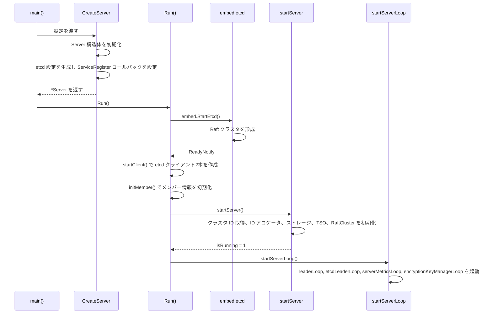
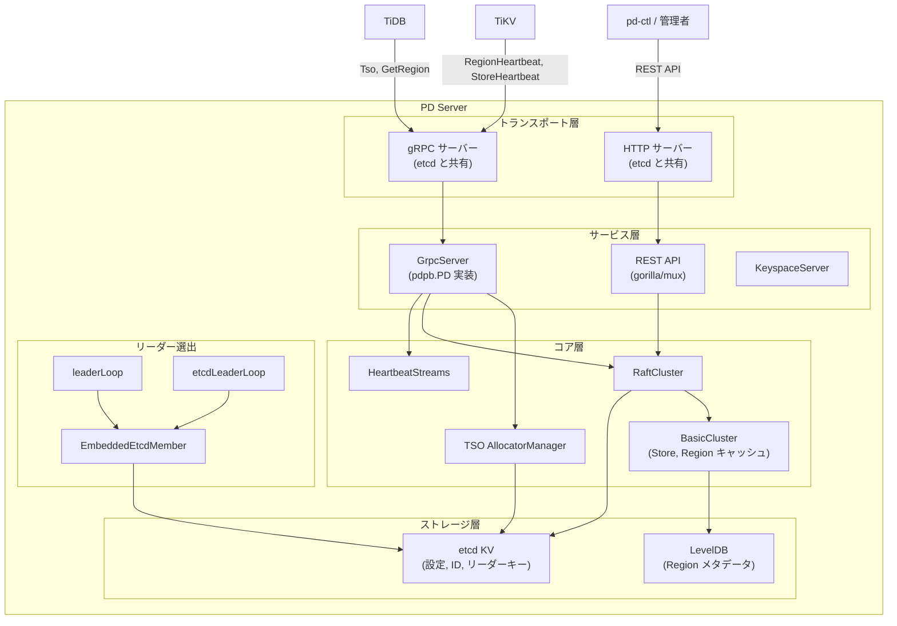

# 第2章 サーバーアーキテクチャ

> **本章で読むソース**
> - [`server/server.go`](https://github.com/tikv/pd/blob/v8.5.6/server/server.go)
> - [`server/grpc_service.go`](https://github.com/tikv/pd/blob/v8.5.6/server/grpc_service.go)
> - [`server/api/router.go`](https://github.com/tikv/pd/blob/v8.5.6/server/api/router.go)
> - [`pkg/member/member.go`](https://github.com/tikv/pd/blob/v8.5.6/pkg/member/member.go)

## この章の狙い

PD サーバーの内部構造を、起動シーケンスを軸にして読む。
`CreateServer` で何を組み立て、`Run` でどの順にサービスを立ち上げるかを追い、gRPC 層、REST API 層、組み込み etcd、リーダー選出ループがどう噛み合うかを明らかにする。

## 前提

- Go の基本的な並行処理（ゴルーチン、チャネル、`context`）を理解していること。
- etcd のリース（lease）と選出（election）の概念を知っていること。
- gRPC のサーバーストリーミング、双方向ストリーミングの違いを把握していること。

## Server 構造体

PD プロセスの中心は `Server` 構造体である。

[`server/server.go` L135-244](https://github.com/tikv/pd/blob/v8.5.6/server/server.go#L135-L244)

```go
// Server is the pd server. It implements bs.Server
type Server struct {
	diagnosticspb.DiagnosticsServer

	// Server state. 0 is not running, 1 is running.
	isRunning int64

	// Server start timestamp
	startTimestamp int64

	// Configs and initial fields.
	cfg                             *config.Config
	serviceMiddlewareCfg            *config.ServiceMiddlewareConfig
	etcdCfg                         *embed.Config
	// ... (中略) ...

	member *member.EmbeddedEtcdMember

	client         *clientv3.Client
	electionClient *clientv3.Client
	// ... (中略) ...

	tsoAllocatorManager *tso.AllocatorManager
	cluster             *cluster.RaftCluster
	hbStreams           *hbstream.HeartbeatStreams
	// ... (中略) ...
	grpcServer *grpc.Server
	// ... (中略) ...
}
```

主要なフィールドを役割ごとに整理する。

- **etcd 関連**：`etcdCfg`（組み込み etcd の設定）、`member`（リーダー選出を担う `EmbeddedEtcdMember`）、`client`（メタデータ読み書き用 etcd クライアント）、`electionClient`（選出専用 etcd クライアント）
- **クラスタ管理**：`cluster`（`RaftCluster`。Region と Store のメタデータを保持し、スケジューリングを実行する）、`basicCluster`（Store と Region のインメモリキャッシュ）、`hbStreams`（Region ハートビートの応答ストリーム管理）
- **TSO**：`tsoAllocatorManager`（タイムスタンプの割り当てを管理する）、`tsoDispatcher`（TSO プロキシリクエストの分配）
- **API 基盤**：`grpcServer`（gRPC サーバーのハンドル）、`serviceRateLimiter` と `grpcServiceRateLimiter`（REST と gRPC のレート制限）、`auditBackends`（監査ログ）

etcd クライアントを2本に分離している設計は、スロットリング回避の工夫として後述する。

## 起動シーケンス

PD サーバーの起動は、`CreateServer` による構築フェーズと `Run` による実行フェーズに分かれる。

### CreateServer：サーバーの組み立て

[`server/server.go` L250-326](https://github.com/tikv/pd/blob/v8.5.6/server/server.go#L250-L326)

```go
func CreateServer(ctx context.Context, cfg *config.Config, services []string, legacyServiceBuilders ...HandlerBuilder) (*Server, error) {
	var mode string
	if len(services) != 0 {
		mode = APIServiceMode
	} else {
		mode = PDMode
	}
	// ... (中略) ...
	s := &Server{
		cfg:            cfg,
		persistOptions: config.NewPersistOptions(cfg),
		// ... (中略) ...
		member:         &member.EmbeddedEtcdMember{},
		ctx:            ctx,
		startTimestamp: time.Now().Unix(),
		mode:           mode,
		// ... (中略) ...
	}
	// ... (中略) ...
	etcdCfg, err := s.cfg.GenEmbedEtcdConfig()
	// ... (中略) ...
	etcdCfg.ServiceRegister = func(gs *grpc.Server) {
		grpcServer := &GrpcServer{Server: s}
		pdpb.RegisterPDServer(gs, grpcServer)
		keyspacepb.RegisterKeyspaceServer(gs, &KeyspaceServer{GrpcServer: grpcServer})
		diagnosticspb.RegisterDiagnosticsServer(gs, s)
		s.registry.InstallAllGRPCServices(s, gs)
		s.grpcServer = gs
	}
	// ... (中略) ...
	return s, nil
}
```

`CreateServer` は次の処理を行う。

1. **動作モードの決定**（L251-256）。`services` 引数がある場合は `APIServiceMode`（マイクロサービスモード）、なければ `PDMode`（従来の単体モード）で起動する。
2. **`Server` 構造体の初期化**（L260-276）。設定、永続化オプション、空の `EmbeddedEtcdMember` を詰める。
3. **監査とレート制限の基盤構築**（L280-289）。ローカルログと Prometheus の2種類の監査バックエンドを用意し、REST 用と gRPC 用のレートリミッタをそれぞれ初期化する。
4. **組み込み etcd 設定の生成**（L292）。`GenEmbedEtcdConfig` で etcd の `embed.Config` を作る。
5. **gRPC サービス登録コールバックの設定**（L313-321）。etcd が内部で gRPC サーバーを立ち上げる際に呼ばれるコールバックに、PD の gRPC サービス（`pdpb.PD`、`keyspacepb.Keyspace`、診断サービス、マイクロサービス）を登録する。

ここで注目すべきは、PD が独自の gRPC サーバーを立てるのではなく、etcd が起動する gRPC サーバーにサービスを相乗りさせている点である。
PD は etcd と同じポートで gRPC リクエストを受け付けるため、クライアントは etcd との接続と PD への RPC 呼び出しを1本の接続で行える。

### Run：起動の実行

[`server/server.go` L616-637](https://github.com/tikv/pd/blob/v8.5.6/server/server.go#L616-L637)

```go
func (s *Server) Run() error {
	go systimemon.StartMonitor(s.ctx, time.Now, func() {
		log.Error("system time jumps backward", errs.ZapError(errs.ErrIncorrectSystemTime))
		timeJumpBackCounter.Inc()
	})
	if err := s.startEtcd(s.ctx); err != nil {
		return err
	}

	if err := s.startServer(s.ctx); err != nil {
		return err
	}

	s.cgMonitor.StartMonitor(s.ctx)

	// ... (中略) ...
	s.startServerLoop(s.ctx)

	return nil
}
```

`Run` は4つのステップを順に実行する。

1. **システム時刻監視ゴルーチンの起動**（L617）。時刻の巻き戻りを検知してログに出力する。TSO の単調増加を保証する上で、時刻のジャンプは致命的なため、起動直後から監視を開始する。
2. **組み込み etcd の起動**（L621）。`startEtcd` を呼ぶ。
3. **サーバーコンポーネントの初期化**（L625）。`startServer` を呼ぶ。
4. **サーバーループの開始**（L634）。`startServerLoop` でリーダー選出などのバックグラウンドゴルーチンを起動する。

### startEtcd：組み込み etcd の起動

[`server/server.go` L328-370](https://github.com/tikv/pd/blob/v8.5.6/server/server.go#L328-L370)

```go
func (s *Server) startEtcd(ctx context.Context) error {
	newCtx, cancel := context.WithTimeout(ctx, EtcdStartTimeout)
	defer cancel()

	etcd, err := embed.StartEtcd(s.etcdCfg)
	// ... (中略) ...
	select {
	// Wait etcd until it is ready to use
	case <-etcd.Server.ReadyNotify():
	case <-newCtx.Done():
		return errs.ErrCancelStartEtcd.FastGenByArgs()
	}

	// Start the etcd and HTTP clients, then init the member.
	err = s.startClient()
	// ... (中略) ...
	err = s.initMember(newCtx, etcd)
	// ... (中略) ...
	return nil
}
```

`embed.StartEtcd`（L332）で etcd を起動し、`ReadyNotify` チャネル（L353）で準備完了を待つ。
タイムアウトは `EtcdStartTimeout`（5分）である。

起動後、`startClient`（L359）が etcd クライアントを2本作成する。

[`server/server.go` L382-404](https://github.com/tikv/pd/blob/v8.5.6/server/server.go#L382-L404)

```go
func (s *Server) startClient() error {
	// ... (中略) ...
	/* Starting two different etcd clients here is to avoid the throttling. */
	// This etcd client will be used to access the etcd cluster to read and write all kinds of meta data.
	s.client, err = etcdutil.CreateEtcdClient(tlsConfig, etcdCfg.AdvertiseClientUrls, etcdutil.ServerEtcdClientPurpose, true)
	// ... (中略) ...
	// This etcd client will only be used to read and write the election-related data, such as leader key.
	s.electionClient, err = etcdutil.CreateEtcdClient(tlsConfig, etcdCfg.AdvertiseClientUrls, etcdutil.ElectionEtcdClientPurpose, false)
	// ... (中略) ...
}
```

`client` はメタデータの読み書き全般に使い、`electionClient` はリーダーキーの操作にのみ使う。
コメントに「to avoid the throttling」とあるとおり、選出の書き込みがメタデータ操作のスロットリングに巻き込まれることを防ぐ設計である。

### startServer：コンポーネントの初期化

[`server/server.go` L434-536](https://github.com/tikv/pd/blob/v8.5.6/server/server.go#L434-L536)

`startServer` はクラスタ ID の取得に始まり、以下のコンポーネントを順に初期化する。

1. **メンバー情報の登録**（L444-454）。自ノードの名前、アドレス、バイナリバージョン、Git ハッシュを etcd に書き込む。
2. **ID アロケータ**（L455-461）。Store ID や Region ID の採番に使う。
3. **ストレージ**（L466-476）。etcd をバックエンドとする汎用ストレージと、LevelDB をバックエンドとする Region メタデータ用ストレージの2層を組み合わせる。
4. **TSO アロケータマネージャ**（L480）。タイムスタンプの割り当てを管理する。
5. **RaftCluster**（L495）。Region と Store のメタデータを保持し、スケジューリング指示を生成する中核コンポーネントである。
6. **Keyspace マネージャ**（L507）とハートビートストリーム（L509）。

最後に `atomic.StoreInt64(&s.isRunning, 1)`（L533）でサーバーの稼働状態を示すフラグを立てる。

## gRPC サービス層

### GrpcServer と登録

PD の gRPC サービスは **`GrpcServer`** 構造体が実装する。

[`server/grpc_service.go` L99-103](https://github.com/tikv/pd/blob/v8.5.6/server/grpc_service.go#L99-L103)

```go
type GrpcServer struct {
	*Server
	schedulingClient             atomic.Value
	concurrentTSOProxyStreamings atomic.Int32
}
```

「GrpcServer」は `Server` を埋め込んでおり、「Server」のフィールドとメソッドにすべてアクセスできる。
`CreateServer` の `ServiceRegister` コールバック（前述）で `pdpb.RegisterPDServer(gs, grpcServer)` を呼び、etcd の gRPC サーバーに PD サービスを登録する。

### 主要 RPC

`GrpcServer` が実装する主要な RPC を役割ごとに整理する。

**TSO 関連**

| RPC | 種別 | 行 | 役割 |
|-----|------|------|------|
| `Tso` | 双方向ストリーミング | L522 | タイムスタンプの割り当て。ローカル処理またはマイクロサービスへの転送 |
| `GetMinTS` | 単項 | L296 | 全 TSO サーバーから最小タイムスタンプを取得 |
| `SyncMaxTS` | 単項 | L2554 | DC 間の最大タイムスタンプ同期 |

**クラスタメタデータ関連**

| RPC | 種別 | 行 | 役割 |
|-----|------|------|------|
| `GetMembers` | 単項 | L458 | PD クラスタのメンバー一覧、etcd リーダー、PD リーダーを返す |
| `Bootstrap` | 単項 | L658 | 初期 Store と Region でクラスタを起動する |
| `GetStore` | 単項 | L796 | Store 情報を取得 |
| `PutStore` | 単項 | L852 | Store を登録 |
| `GetAllStores` | 単項 | L909 | 全 Store 一覧を取得 |
| `GetRegion` | 単項 | L1456 | キーで Region を検索 |
| `GetRegionByID` | 単項 | L1579 | ID で Region を検索 |
| `ScanRegions` | 単項 | L1641 | Region の範囲スキャン |

**ハートビート関連**

| RPC | 種別 | 行 | 役割 |
|-----|------|------|------|
| `StoreHeartbeat` | 単項 | L954 | Store の統計情報を受信し、クラスタ状態を更新 |
| `RegionHeartbeat` | 双方向ストリーミング | L1233 | Region の統計を受信し、スケジューリング指示を返す |
| `ReportBuckets` | クライアントストリーミング | L1123 | Region 内のバケット情報を受信 |

**スケジューリング関連**

| RPC | 種別 | 行 | 役割 |
|-----|------|------|------|
| `AskSplit` | 単項 | L1791 | 分割用の新しい Region ID とピア ID を採番 |
| `AskBatchSplit` | 単項 | L1837 | 一括分割用の ID 採番 |
| `ScatterRegion` | 単項 | L2063 | Region を分散配置 |
| `GetOperator` | 単項 | L2342 | 実行中の Operator を取得 |

### Tso RPC の処理フロー

TSO は PD が提供する最もクリティカルな RPC である。
処理の分岐を確認する。

[`server/grpc_service.go` L522-534](https://github.com/tikv/pd/blob/v8.5.6/server/grpc_service.go#L522-L534)

```go
func (s *GrpcServer) Tso(stream pdpb.PD_TsoServer) error {
	// ... (中略) ...
	if s.IsServiceIndependent(constant.TSOServiceName) {
		return s.forwardTSO(stream)
	}

	tsDeadlineCh := make(chan *tsoutil.TSDeadline, 1)
	go tsoutil.WatchTSDeadline(stream.Context(), tsDeadlineCh)
	// ... (中略) ...
```

TSO マイクロサービスが独立稼働している場合（`IsServiceIndependent` が true）はリクエストをそちらへ転送する。
そうでなければ PD 自身が `tsoAllocatorManager.HandleRequest` でタイムスタンプを割り当てる。

### RegionHeartbeat の処理フロー

`RegionHeartbeat` は双方向ストリーミング RPC である。
TiKV は Region ごとのリーダーがこのストリーム上でハートビートを送り続け、PD はストリーム上でスケジューリング指示（Operator）を返す。

[`server/grpc_service.go` L1233-1261](https://github.com/tikv/pd/blob/v8.5.6/server/grpc_service.go#L1233-L1261)

```go
func (s *GrpcServer) RegionHeartbeat(stream pdpb.PD_RegionHeartbeatServer) error {
	var (
		server                      = &heartbeatServer{stream: stream}
		flowRoundDivisor            = core.GetFlowRoundDivisorByDigit(s.persistOptions.GetPDServerConfig().FlowRoundByDigit)
		// ... (中略) ...
	)
	// ... (中略) ...
	for {
		request, err := server.Recv()
		// ... (中略) ...
```

受信ループの中で `rc.HandleRegionHeartbeat(region)` を呼び、Region メタデータをインメモリキャッシュに反映する。
スケジューリング結果があれば、同じストリーム上で `Send` を呼んで TiKV に返す。

## REST API 層

### ルーターの構成

REST API は gorilla/mux を使い、`createRouter` 関数で組み立てる。

[`server/api/router.go` L89-129](https://github.com/tikv/pd/blob/v8.5.6/server/api/router.go#L89-L129)

```go
func createRouter(prefix string, svr *server.Server) *mux.Router {
	serviceMiddle := newServiceMiddlewareBuilder(svr)
	// ... (中略) ...
	rootRouter := mux.NewRouter().PathPrefix(prefix).Subrouter()
	// ... (中略) ...
	apiRouter := rootRouter.PathPrefix(apiPrefix).Subrouter()

	clusterRouter := apiRouter.NewRoute().Subrouter()
	clusterRouter.Use(newClusterMiddleware(svr).middleware)
	// ... (中略) ...
```

ルーターは階層構造を持つ。

```
rootRouter (/pd)
 └── apiRouter (/pd/api/v1)
      ├── clusterRouter（クラスタ初期化済みを要求するミドルウェア付き）
      │    ├── escapeRouter（URL エンコードパス対応）
      │    └── ruleRouter（Placement Rules 専用ミドルウェア付き）
      └── (ミドルウェアなしの直接登録)
```

すべてのハンドラは `serviceMiddleware` を経由し、レート制限と監査ログの制御を受ける。

### 主要エンドポイント

REST API のエンドポイントを主要なカテゴリごとに示す。
ベースパスは `/pd/api/v1` である。

| カテゴリ | 代表的パス | メソッド | 行 |
|---------|-----------|---------|------|
| クラスタ | `/cluster` | GET | L159 |
| 設定 | `/config`, `/config/schedule`, `/config/replicate` | GET, POST | L162-176 |
| Store | `/store/{id}`, `/stores` | GET, DELETE, POST | L217-233 |
| Region | `/region/id/{id}`, `/regions` | GET | L247-286 |
| メンバー | `/members`, `/leader` | GET, POST, DELETE | L292-300 |
| Operator | `/operators` | GET, POST, DELETE | L134-139 |
| スケジューラ | `/schedulers` | GET, POST, DELETE | L146-149 |
| ホットスポット | `/hotspot/regions/write`, `/hotspot/stores` | GET | L240-244 |
| Placement Rules | `/config/rules`, `/config/rule` | GET, POST, DELETE | L181-203 |
| ヘルスチェック | `/health`, `/ping` | GET | L334-335 |

エンドポイントの総数は約120に及ぶ。
変更操作（POST, DELETE, PUT）にはローカルログと Prometheus の両方の監査ラベルが付き、参照操作（GET）には Prometheus のみが付く。

ルーター構築の末尾（L391-406）では、登録された全ルートを Walk し、各ルート名をサービスラベルとして `Server` に登録する。
この仕組みにより、レート制限と監査をルート単位で制御できる。

## 組み込み etcd の役割

PD は etcd をライブラリとして組み込んで（embed して）使う。
外部の etcd クラスタに依存しない。

etcd は PD の中で3つの役割を果たす。

1. **メタデータの永続化**。クラスタ設定、Store 情報、GC セーフポイントなどを etcd の KV に保存する。Region メタデータは量が大きいため LevelDB に分離しているが、小規模なメタデータは etcd に直接格納する。
2. **リーダー選出**。etcd のリースとトランザクション（compare-and-swap）を使い、PD クラスタのリーダーを選出する。
3. **gRPC と HTTP のトランスポート**。前述のとおり、PD は etcd の gRPC サーバーと HTTP サーバーに相乗りする。

etcd の起動から PD サービスの提供開始までの流れを図示する。



## ゴルーチン構成

`startServerLoop` は4つのバックグラウンドゴルーチンを起動する。

[`server/server.go` L659-670](https://github.com/tikv/pd/blob/v8.5.6/server/server.go#L659-L670)

```go
func (s *Server) startServerLoop(ctx context.Context) {
	s.serverLoopCtx, s.serverLoopCancel = context.WithCancel(ctx)
	s.serverLoopWg.Add(4)
	go s.leaderLoop()
	go s.etcdLeaderLoop()
	go s.serverMetricsLoop()
	go s.encryptionKeyManagerLoop()
	if s.IsAPIServiceMode() {
		s.initTSOPrimaryWatcher()
		s.initSchedulingPrimaryWatcher()
	}
}
```

各ゴルーチンの役割を整理する。

| ゴルーチン | 行 | 役割 |
|-----------|------|------|
| `leaderLoop` | L662 | PD リーダーの選出と維持。最も重要なループ |
| `etcdLeaderLoop` | L663 | etcd リーダーの優先度を定期的にチェックし、必要なら etcd リーダーを移動 |
| `serverMetricsLoop` | L664 | etcd の term、applied index、committed index を1分間隔で Prometheus に出力 |
| `encryptionKeyManagerLoop` | L665 | 暗号化キーの変更を監視 |

API サービスモードでは、さらに TSO プライマリウォッチャーとスケジューリングプライマリウォッチャーが etcd のウォッチループを開始する。

### leaderLoop：リーダー選出ループ

`leaderLoop` は PD リーダーの選出と監視を担う無限ループである。

[`server/server.go` L1619-1695](https://github.com/tikv/pd/blob/v8.5.6/server/server.go#L1619-L1695)

```go
func (s *Server) leaderLoop() {
	// ... (中略) ...
	for {
		if s.IsClosed() {
			// ... (中略) ...
			return
		}

		leader, checkAgain := s.member.CheckLeader()
		// ... (中略) ...
		if leader != nil {
			// ... (中略) ...
			// WatchLeader will keep looping and never return unless the PD leader has changed.
			leader.Watch(s.serverLoopCtx)
			// ... (中略) ...
		}

		// To make sure the etcd leader and PD leader are on the same server.
		etcdLeader := s.member.GetEtcdLeader()
		if etcdLeader != s.member.ID() {
			// ... (中略) ...
			continue
		}
		s.campaignLeader()
	}
}
```

ループの各反復は3つの分岐を持つ。

1. **既にリーダーが存在する場合**（L1641-1659）。そのリーダーを `Watch` し、リーダーが変わるまでブロックする。Region ストレージが有効なら、リーダーとの Region 同期も開始する。
2. **自ノードが etcd リーダーでない場合**（L1662-1691）。立候補をスキップする。PD リーダーは etcd リーダーと同じノードで動くことを意図しており、etcd リーダーでないノードは立候補しない[^1]。ただし PD リーダーが長時間不在の場合は、etcd リーダーシップの移動を試みる（L1674-1683）。
3. **自ノードが etcd リーダーである場合**（L1693）。`campaignLeader` を呼んで立候補する。

[^1]: etcd リーダーと PD リーダーを同居させる理由は、etcd への書き込みレイテンシを最小化するためと考えられる。Raft のリーダーがローカルにいれば、リーダーへの転送コストが不要になる。

### campaignLeader：リーダーへの就任

[`server/server.go` L1697-1811](https://github.com/tikv/pd/blob/v8.5.6/server/server.go#L1697-L1811)

`campaignLeader` は以下の手順でリーダーに就任する。

1. **etcd トランザクションによるリーダー獲得**（L1699）。`member.CampaignLeader` を呼ぶ。内部では etcd の compare-and-swap トランザクションを実行し、リーダーキーが存在しなければ自ノードの情報を書き込む。
2. **リース維持の開始**（L1723）。`member.KeepLeader` でリースの keep-alive を開始する。
3. **設定の再読み込み**（L1726-1734）。etcd KV から設定と TTL を読み込む。
4. **リーダーコールバックの実行**（L1742-1747）。
5. **RaftCluster の起動**（L1750）。`createRaftCluster` でスケジューリングの中核を起動する。
6. **リーダーフラグの有効化**（L1763）。`EnableLeader` を呼ぶと、gRPC の各 RPC がリクエストを受け付け始める。
7. **リーダーティッカーループ**（L1780-1810）。`LeaderTickInterval` ごとにリースの有効性をチェックし、リースが切れるか etcd リーダーが変わったら退任する。

## リーダー選出の仕組み

リーダー選出の実体は `EmbeddedEtcdMember` が担う。

[`pkg/member/member.go` L52-68](https://github.com/tikv/pd/blob/v8.5.6/pkg/member/member.go#L52-L68)

```go
type EmbeddedEtcdMember struct {
	leadership *election.Leadership
	leader     atomic.Value // stored as *pdpb.Member
	etcd       *embed.Etcd
	client     *clientv3.Client
	id         uint64       // etcd server id.
	member     *pdpb.Member // current PD's info.
	rootPath   string
	memberValue string
	lastLeaderUpdatedTime atomic.Value
}
```

「EmbeddedEtcdMember」は「etcd リーダー」と「PD リーダー」という2つの独立した概念を扱う。
etcd リーダーは Raft のリーダーであり、PD リーダーは etcd KV 上のリーダーキー（`{rootPath}/leader`）をリースで保持するノードである。

### CampaignLeader

[`pkg/member/member.go` L186-201](https://github.com/tikv/pd/blob/v8.5.6/pkg/member/member.go#L186-L201)

```go
func (m *EmbeddedEtcdMember) CampaignLeader(ctx context.Context, leaseTimeout int64) error {
	m.leadership.AddCampaignTimes()
	// ... (中略) ...
	if m.leadership.GetCampaignTimesNum() > campaignLeaderFrequencyTimes {
		if err := m.ResignEtcdLeader(ctx, m.Name(), ""); err != nil {
			return err
		}
		m.leadership.ResetCampaignTimes()
		return errs.ErrLeaderFrequentlyChange.FastGenByArgs(m.Name(), m.GetLeaderPath())
	}

	return m.leadership.Campaign(leaseTimeout, m.MemberValue())
}
```

立候補回数を追跡し、短期間に `campaignLeaderFrequencyTimes`（3回）を超えた場合は etcd リーダーシップを譲渡して立候補を中断する。
リーダーの頻繁な切り替わり（thrashing）を防ぐ安全弁である。

通常時は `leadership.Campaign` が etcd のトランザクションを実行する。
トランザクションの条件は「リーダーキーの CreateRevision が 0（キーが存在しない）」であり、成功すればリースつきでリーダーキーを書き込む。
複数ノードが同時に立候補しても、etcd のトランザクションが排他制御を保証する。

### CheckLeader

[`pkg/member/member.go` L232-269](https://github.com/tikv/pd/blob/v8.5.6/pkg/member/member.go#L232-L269)

```go
func (m *EmbeddedEtcdMember) CheckLeader() (ElectionLeader, bool) {
	if err := m.PreCheckLeader(); err != nil {
		// ... (中略) ...
		return nil, true
	}

	leader, revision, err := m.getPersistentLeader()
	// ... (中略) ...
	if leader == nil {
		return nil, false
	}

	if m.IsSameLeader(leader) {
		// ... (中略) ...
		if err = m.leadership.DeleteLeaderKey(); err != nil {
			// ... (中略) ...
		}
		return nil, false
	}

	return &EmbeddedEtcdLeader{
		wrapper:  m,
		member:   leader,
		revision: revision,
	}, false
}
```

`CheckLeader` は3つの結果を返す。

1. **etcd リーダーが不在**（L233-237）。`(nil, true)` を返し、再試行を促す。
2. **リーダーキーが存在しない、または自分自身がリーダーだが不整合がある**（L245-261）。`(nil, false)` を返し、即座に立候補を開始させる。自分がリーダーとして記録されているのに `CheckLeader` が呼ばれるのは前回の `campaignLeader` が中途半端に失敗した場合であり、リーダーキーを削除して再選出する。
3. **他のノードがリーダー**（L264-268）。`EmbeddedEtcdLeader` を返し、呼び出し元はそのリーダーを `Watch` する。

## サーバー内部構造の全体像

PD サーバー内部のコンポーネント間の関係を図示する。



## 高速化の工夫：etcd クライアントの分離によるスロットリング回避

PD は etcd クライアントを2本に分けている（`client` と `electionClient`）。
この設計は、メタデータ操作と選出操作のスロットリングを分離するためのものである。

etcd クライアントは内部で gRPC ストリームを多重化しており、大量のメタデータ読み書きが発生すると gRPC のフロー制御によってスロットリングが生じうる。
リーダー選出はリースの更新（keep-alive）を時間内に完了しなければリーダーシップを失うため、メタデータ操作のバックプレッシャーに巻き込まれることは許容できない。

クライアントを分離することで、メタデータの負荷が高い状況でも選出のリース更新は独立したコネクション上で遅延なく処理される。
ソースのコメント（L391）にも「Starting two different etcd clients here is to avoid the throttling」と明記されている。

## まとめ

PD サーバーの起動は `CreateServer` → `Run` → `startEtcd` → `startServer` → `startServerLoop` の順で進む。
etcd を組み込みで起動し、その gRPC サーバーに PD サービスを相乗りさせる構造が特徴である。

gRPC 層は `GrpcServer` が約40の RPC を実装し、TSO の割り当て、ハートビートの処理、Region の検索などを提供する。
REST API 層は gorilla/mux で約120のエンドポイントを持ち、クラスタ管理や設定変更の操作を提供する。

リーダー選出は `leaderLoop` が駆動し、etcd のリースベースの compare-and-swap トランザクションで排他制御する。
PD リーダーは etcd リーダーと同じノードで動くことを意図しており、etcd への書き込みレイテンシを最小化する。

## 関連する章

- [第1章 PD とは何か](01-what-is-pd.md)：PD の役割と位置づけ
- [第4章 TSO の仕組みと GlobalAllocator](../part01-tso/04-tso-and-global-allocator.md)：TSO RPC の内部実装
- [第7章 Store の管理とストアハートビート](../part02-metadata/07-store-management.md)：`StoreHeartbeat` RPC の詳細
- [第9章 Region ハートビートと統計収集](../part02-metadata/09-region-heartbeat.md)：`RegionHeartbeat` RPC の詳細
- [第19章 etcd とリーダー選出](../part05-ha-ops/19-etcd-and-leader-election.md)：リーダー選出の詳細
