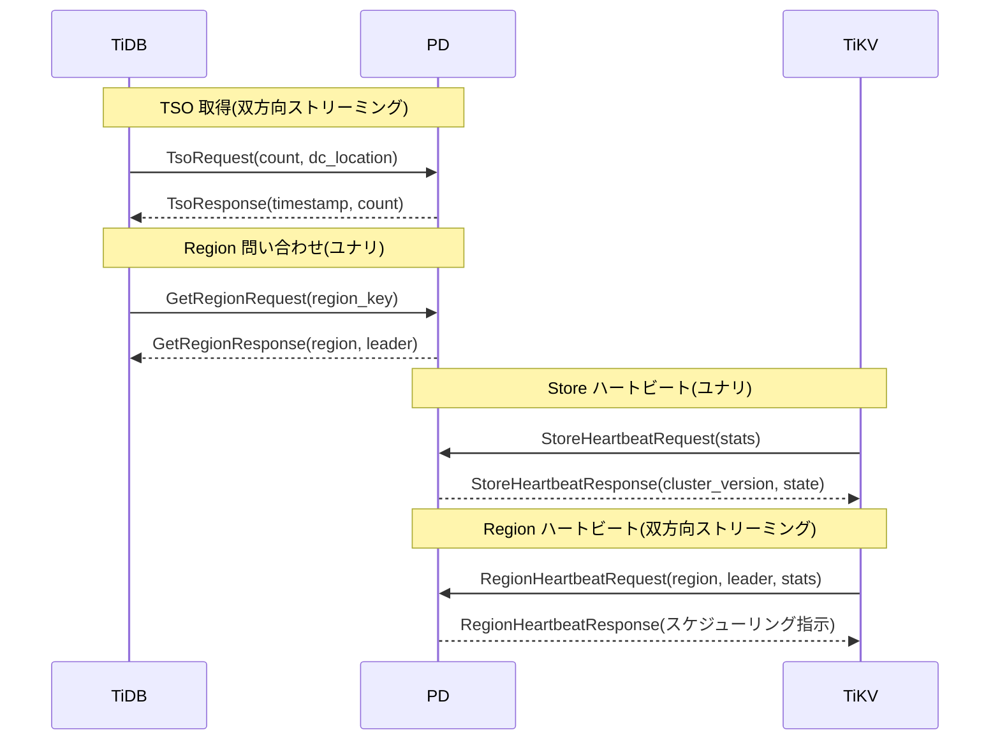
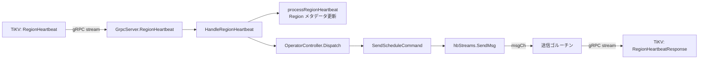

# 第3章 TiDB、TiKV との関係

> **本章で読むソース**
>
> - [`client/client.go`](https://github.com/tikv/pd/blob/v8.5.6/client/client.go)
> - [`client/pd_service_discovery.go`](https://github.com/tikv/pd/blob/v8.5.6/client/pd_service_discovery.go)
> - [`server/grpc_service.go`](https://github.com/tikv/pd/blob/v8.5.6/server/grpc_service.go)
> - [`server/cluster/cluster_worker.go`](https://github.com/tikv/pd/blob/v8.5.6/server/cluster/cluster_worker.go)
> - [`pkg/schedule/hbstream/heartbeat_streams.go`](https://github.com/tikv/pd/blob/v8.5.6/pkg/schedule/hbstream/heartbeat_streams.go)
> - [`pkg/schedule/operator/operator_controller.go`](https://github.com/tikv/pd/blob/v8.5.6/pkg/schedule/operator/operator_controller.go)

## この章の狙い

PD は単体で動くプロセスではなく、TiDB と TiKV のあいだに立って TSO の発行、Region 情報の提供、スケジューリング指示の配信を行うクラスタマネージャである。
本章では、TiDB から PD、TiKV から PD、PD から TiKV という3方向の通信を protobuf のメッセージ定義とサーバー実装の両面から読む。
あわせて、クライアント側の接続管理を担う PD Client の構造を確認し、ハートビートの並行処理による高速化の仕組みを機構レベルで説明する。

## 前提

第1章で PD の役割(TSO の発行、Region メタデータの管理、スケジューリング)を概観し、第2章でサーバーの起動から gRPC サービスの登録までを確認した。
本章では、登録された gRPC ハンドラが実際にどのようなメッセージを受け取り、どのような応答を返すかを読み進める。
コード引用はすべて tikv/pd のタグ `v8.5.6` に固定する。

## 通信の全体像

TiDB、TiKV、PD の3コンポーネントは gRPC で接続される。
通信の方向と目的を次の図にまとめる。



TiDB は TSO の取得と Region キャッシュの更新のために PD を呼ぶ。
TiKV は Store と Region の2種類のハートビートを PD へ送り、PD は Region ハートビートの応答にスケジューリング指示を載せて返す。
以下の節でそれぞれの通信を読む。

## pdpb サービス定義

PD の gRPC インターフェースは、kvproto リポジトリの `pdpb.proto` に定義されている。
主要な RPC を種類ごとに整理する。

TSO の `Tso` と Region ハートビートの `RegionHeartbeat` は**双方向ストリーミング** RPC である。
クライアントとサーバーが1本のストリーム上でメッセージを連続的にやり取りするため、接続の確立コストを RPC ごとに払わなくてよい。
一方、`StoreHeartbeat` と `GetRegion` は**ユナリ** RPC であり、1リクエスト1レスポンスで完結する。

protobuf 定義から主要な RPC を抜粋する。

```protobuf
service PD {
    rpc Tso(stream TsoRequest) returns (stream TsoResponse) {}
    rpc GetRegion(GetRegionRequest) returns (GetRegionResponse) {}
    rpc GetRegionByID(GetRegionByIDRequest) returns (GetRegionResponse) {}
    rpc GetStore(GetStoreRequest) returns (GetStoreResponse) {}
    rpc GetAllStores(GetAllStoresRequest) returns (GetAllStoresResponse) {}
    rpc StoreHeartbeat(StoreHeartbeatRequest) returns (StoreHeartbeatResponse) {}
    rpc RegionHeartbeat(stream RegionHeartbeatRequest) returns (stream RegionHeartbeatResponse) {}
    rpc AskBatchSplit(AskBatchSplitRequest) returns (AskBatchSplitResponse) {}
    rpc ReportBatchSplit(ReportBatchSplitRequest) returns (ReportBatchSplitResponse) {}
    rpc ScatterRegion(ScatterRegionRequest) returns (ScatterRegionResponse) {}
    rpc GetMembers(GetMembersRequest) returns (GetMembersResponse) {}
}
```

この定義から2つの設計方針が読み取れる。
第一に、TiKV から PD への状態報告(ハートビート)と PD から TiKV への指示(スケジューリング)が同じストリーム上で行われる点である。
第二に、TSO の取得を独立したストリーミング RPC として切り出すことで、レイテンシに敏感な TSO を他の RPC と分離している点である。

## TiDB から PD への要求

### TSO の取得

TiDB がトランザクションを開始するとき、コミットタイムスタンプや開始タイムスタンプとして TSO を取得する。
PD Client の `GetTS` メソッドが入り口となる。

[`client/client.go L778-L781`](https://github.com/tikv/pd/blob/v8.5.6/client/client.go#L778-L781)

```go
func (c *client) GetTS(ctx context.Context) (physical int64, logical int64, err error) {
	resp := c.GetTSAsync(ctx)
	return resp.Wait()
}
```

`GetTS` は同期インターフェースだが、内部では非同期版の `GetTSAsync` を呼んで `Wait` で待つだけである。
`GetTSAsync` は `GetLocalTSAsync` を経由し、`dispatchTSORequestWithRetry` でリクエストを TSO ストリームへ投入する。

[`client/client.go L727-L729`](https://github.com/tikv/pd/blob/v8.5.6/client/client.go#L727-L729)

```go
func (c *client) GetTSAsync(ctx context.Context) TSFuture {
	return c.GetLocalTSAsync(ctx, globalDCLocation)
}
```

[`client/client.go L742-L775`](https://github.com/tikv/pd/blob/v8.5.6/client/client.go#L742-L775)

```go
func (c *client) dispatchTSORequestWithRetry(ctx context.Context, dcLocation string) TSFuture {
	var (
		retryable bool
		err       error
		req       *tsoRequest
	)
	for i := range dispatchRetryCount {
		// Do not delay for the first time.
		if i > 0 {
			time.Sleep(dispatchRetryDelay)
		}
		// Get the tsoClient each time, as it may be initialized or switched during the process.
		tsoClient := c.getTSOClient()
		if tsoClient == nil {
			err = errs.ErrClientGetTSO.FastGenByArgs("tso client is nil")
			continue
		}
		// ... (中略) ...
		retryable, err = tsoClient.dispatchRequest(req)
		if !retryable {
			break
		}
	}
	// ... (中略) ...
	return req
}
```

リトライは最大2回(`dispatchRetryCount = 2`)で、2回目以降は 50ms の遅延を挟む。
TSO クライアントの切り替え中にも対応するため、ループの先頭で毎回 `getTSOClient` を呼んで最新のクライアントを取得する。

PD サーバー側では `GrpcServer.Tso` がストリームを処理する。
TSO マイクロサービスモードでない場合、`tsoAllocatorManager.HandleRequest` でタイムスタンプを割り当て、レスポンスを返す。

[`server/grpc_service.go L640-L653`](https://github.com/tikv/pd/blob/v8.5.6/server/grpc_service.go#L640-L653)

```go
		ts, err := s.tsoAllocatorManager.HandleRequest(ctx, request.GetDcLocation(), count)
		task.End()
		tsoHandleDuration.Observe(time.Since(start).Seconds())
		if err != nil {
			return status.Error(codes.Unknown, err.Error())
		}
		response := &pdpb.TsoResponse{
			Header:    wrapHeader(),
			Timestamp: &ts,
			Count:     count,
		}
		if err := stream.Send(response); err != nil {
			return errors.WithStack(err)
		}
```

`TsoResponse` は `Timestamp` フィールドに物理時刻(ミリ秒)と論理カウンタを持つ。
クライアントはこの2値を組み合わせて、全クラスタで一意なタイムスタンプを得る。

### Region 情報の取得

TiDB は SQL を実行するとき、対象キーがどの Region に属するかを PD に問い合わせる。
クライアント側では `client.GetRegion` がこの処理を担う。

[`client/client.go L892-L927`](https://github.com/tikv/pd/blob/v8.5.6/client/client.go#L892-L927)

```go
func (c *client) GetRegion(ctx context.Context, key []byte, opts ...GetRegionOption) (*Region, error) {
	// ... (中略) ...
	req := &pdpb.GetRegionRequest{
		Header:      c.requestHeader(),
		RegionKey:   key,
		NeedBuckets: options.needBuckets,
	}
	serviceClient, cctx := c.getRegionAPIClientAndContext(ctx, options.allowFollowerHandle && c.option.getEnableFollowerHandle())
	if serviceClient == nil {
		return nil, errs.ErrClientGetProtoClient
	}
	resp, err := pdpb.NewPDClient(serviceClient.GetClientConn()).GetRegion(cctx, req)
	if serviceClient.NeedRetry(resp.GetHeader().GetError(), err) {
		protoClient, cctx := c.getClientAndContext(ctx)
		if protoClient == nil {
			return nil, errs.ErrClientGetProtoClient
		}
		resp, err = protoClient.GetRegion(cctx, req)
	}
	// ... (中略) ...
	return handleRegionResponse(resp), nil
}
```

注目すべきは、`getRegionAPIClientAndContext` でフォロワーへの読み取りを試みる点である。
フォロワー読み取りが有効な場合、リーダーでなくフォロワー PD ノードへリクエストを送ることで、リーダーの負荷を分散できる。
フォロワーがエラーを返した場合は `NeedRetry` で判定し、リーダーへフォールバックする。

サーバー側の `GrpcServer.GetRegion` も、フォロワーとリーダーで異なるコードパスを持つ。

[`server/grpc_service.go L1482-L1501`](https://github.com/tikv/pd/blob/v8.5.6/server/grpc_service.go#L1482-L1501)

```go
	if *followerHandle {
		rc = s.cluster
		if !rc.GetRegionSyncer().IsRunning() {
			return &pdpb.GetRegionResponse{Header: regionNotFound()}, nil
		}
		region = rc.GetRegionByKey(request.GetRegionKey())
		if region == nil {
			log.Warn("follower get region nil", zap.String("key", string(request.GetRegionKey())))
			return &pdpb.GetRegionResponse{Header: regionNotFound()}, nil
		}
	} else {
		rc = s.GetRaftCluster()
		if rc == nil {
			return &pdpb.GetRegionResponse{Header: notBootstrappedHeader()}, nil
		}
		region = rc.GetRegionByKey(request.GetRegionKey())
		// ... (中略) ...
	}
```

フォロワーは `RegionSyncer` がリーダーから同期した Region 情報を返す。
同期が走っていなければ `regionNotFound` を返し、クライアントがリーダーへフォールバックする設計になっている。

## TiKV から PD へのハートビート

TiKV は2種類のハートビートを PD へ定期的に送信する。
**StoreHeartbeat** はノード全体の統計(容量、読み書きバイト数、リージョン数)を報告し、**RegionHeartbeat** は個々の Region の状態(リーダー、ピア構成、読み書き統計)を報告する。

### StoreHeartbeat

`StoreHeartbeat` はユナリ RPC である。
TiKV の各ノードが自身のストア統計を `StoreStats` メッセージに詰めて送信する。

```protobuf
message StoreHeartbeatRequest {
    RequestHeader header = 1;
    StoreStats stats = 2;
    StoreReport store_report = 3;
    replication_modepb.StoreDRAutoSyncStatus dr_autosync_status = 4;
}
```

`StoreStats` にはストア ID、容量、使用量、リージョン数、スナップショット送受信数、読み書きバイト数、CPU 使用率、メモリ使用量など多数のフィールドが含まれる。
PD はこの統計をもとにストアの負荷を判定し、スケジューリング判断の入力にする。

サーバー側の実装は `GrpcServer.StoreHeartbeat` である。

[`server/grpc_service.go L954-L977`](https://github.com/tikv/pd/blob/v8.5.6/server/grpc_service.go#L954-L977)

```go
func (s *GrpcServer) StoreHeartbeat(ctx context.Context, request *pdpb.StoreHeartbeatRequest) (*pdpb.StoreHeartbeatResponse, error) {
	// ... (中略) ...
	fn := func(ctx context.Context, client *grpc.ClientConn) (any, error) {
		return pdpb.NewPDClient(client).StoreHeartbeat(ctx, request)
	}
	if rsp, err := s.unaryMiddleware(ctx, request, fn); err != nil {
		return nil, err
	} else if rsp != nil {
		return rsp.(*pdpb.StoreHeartbeatResponse), err
	}

	if request.GetStats() == nil {
		return nil, errors.Errorf("invalid store heartbeat command, but %v", request)
	}
	// ... (中略) ...
```

`unaryMiddleware` はリーダーフォワーディングを担うミドルウェアである。
PD フォロワーが受けた StoreHeartbeat をリーダーへ転送し、リーダーだけがクラスタ状態を更新する。

`StoreHeartbeatResponse` は `cluster_version`(クラスタバージョン)や `state`(ノード状態)を返す。
Operator のようなスケジューリング指示は含まず、あくまでストア側の設定同期が目的である。

### RegionHeartbeat

`RegionHeartbeat` は双方向ストリーミング RPC であり、PD と TiKV のあいだの通信の中核をなす。
TiKV は各 Region のリーダーピアから、Region のメタデータと統計を `RegionHeartbeatRequest` として送信する。

```protobuf
message RegionHeartbeatRequest {
    RequestHeader header = 1;
    metapb.Region region = 2;
    metapb.Peer leader = 3;
    repeated PeerStats down_peers = 4;
    repeated metapb.Peer pending_peers = 5;
    uint64 bytes_written = 6;
    uint64 bytes_read = 7;
    uint64 keys_written = 8;
    uint64 keys_read = 9;
    uint64 approximate_size = 10;
    TimeInterval interval = 12;
    uint64 approximate_keys = 13;
    uint64 term = 14;
    // ... (中略) ...
}
```

サーバー側で最も重要な処理は、ストリームのバインドと Region メタデータの更新である。

[`server/grpc_service.go L1327-L1333`](https://github.com/tikv/pd/blob/v8.5.6/server/grpc_service.go#L1327-L1333)

```go
		if time.Since(lastBind) > s.cfg.HeartbeatStreamBindInterval.Duration {
			regionHeartbeatCounter.WithLabelValues(storeAddress, storeLabel, "report", "bind").Inc()
			s.hbStreams.BindStream(storeID, server)
			// refresh FlowRoundByDigit
			flowRoundDivisor = core.GetFlowRoundDivisorByDigit(s.persistOptions.GetPDServerConfig().FlowRoundByDigit)
			lastBind = time.Now()
		}
```

`BindStream` はストア ID と gRPC ストリームを対応づける。
この対応づけにより、後述するスケジューラが特定のストアへスケジューリング指示を送れるようになる。

バインドの後、リクエストを `RegionInfo` へ変換し、`HandleRegionHeartbeat` でクラスタ状態を更新する。

[`server/grpc_service.go L1335-L1360`](https://github.com/tikv/pd/blob/v8.5.6/server/grpc_service.go#L1335-L1360)

```go
		region := core.RegionFromHeartbeat(request, flowRoundDivisor)
		if region.GetLeader() == nil {
			log.Error("invalid request, the leader is nil", zap.Reflect("request", request), errs.ZapError(errs.ErrLeaderNil))
			// ... (中略) ...
			continue
		}
		// ... (中略) ...
		err = rc.HandleRegionHeartbeat(region)
```

## PD から TiKV へのスケジューリング指示

PD がスケジューリング指示を TiKV に伝える経路は、Region ハートビートの応答ストリームである。
PD は `RegionHeartbeatResponse` にスケジューリング指示のフィールドを設定し、TiKV のリーダーピアへ送る。

### RegionHeartbeatResponse のメッセージ構造

```protobuf
message RegionHeartbeatResponse {
    ResponseHeader header = 1;
    ChangePeer change_peer = 2;
    TransferLeader transfer_leader = 3;
    uint64 region_id = 4;
    metapb.RegionEpoch region_epoch = 5;
    metapb.Peer target_peer = 6;
    Merge merge = 7;
    SplitRegion split_region = 8;
    ChangePeerV2 change_peer_v2 = 9;
    BatchSwitchWitness switch_witnesses = 10;
    ChangeSplit change_split = 11;
}
```

`change_peer` はピアの追加と削除、`transfer_leader` はリーダー移譲、`merge` は Region 結合、`split_region` は Region 分割を指示する。
1つのレスポンスには高々1種類の指示だけが設定される。
TiKV はこのレスポンスを受け取り、Raft を通じて指示を実行する。

### Operator からハートビート応答への変換

PD 内部では、スケジューリングの意思決定は **Operator** というオブジェクトで表現される。
「Operator」は複数の **Step** からなり、各 Step が1つの protobuf フィールド(ChangePeer、TransferLeader など)に対応する。

ハートビートを受けたあとの Operator ディスパッチは `HandleRegionHeartbeat` の末尾で起きる。

[`server/cluster/cluster_worker.go L38-L73`](https://github.com/tikv/pd/blob/v8.5.6/server/cluster/cluster_worker.go#L38-L73)

```go
func (c *RaftCluster) HandleRegionHeartbeat(region *core.RegionInfo) error {
	tracer := core.NewNoopHeartbeatProcessTracer()
	if c.GetScheduleConfig().EnableHeartbeatBreakdownMetrics {
		tracer = core.NewHeartbeatProcessTracer()
	}
	defer tracer.Release()
	var taskRunner, miscRunner, logRunner, syncRegionRunner ratelimit.Runner
	taskRunner, miscRunner, logRunner, syncRegionRunner = syncRunner, syncRunner, syncRunner, syncRunner
	if c.GetScheduleConfig().EnableHeartbeatConcurrentRunner {
		taskRunner = c.heartbeatRunner
		miscRunner = c.miscRunner
		logRunner = c.logRunner
		syncRegionRunner = c.syncRegionRunner
	}
	// ... (中略) ...
	if err := c.processRegionHeartbeat(ctx, region); err != nil {
		// ... (中略) ...
		return err
	}
	// ... (中略) ...
	c.coordinator.GetOperatorController().Dispatch(region, operator.DispatchFromHeartBeat, c.coordinator.RecordOpStepWithTTL)
	return nil
}
```

末尾の `Dispatch` 呼び出しが、Region に対応する Operator が存在するかを確認し、存在すれば次の Step を TiKV へ送る。

`Dispatch` の内部では、Operator のステータスに応じて分岐する。

[`pkg/schedule/operator/operator_controller.go L149-L165`](https://github.com/tikv/pd/blob/v8.5.6/pkg/schedule/operator/operator_controller.go#L149-L165)

```go
func (oc *Controller) Dispatch(region *core.RegionInfo, source string, recordOpStepWithTTL func(regionID uint64)) {
	// Check existed
	if op := oc.GetOperator(region.GetID()); op != nil {
		// ... (中略) ...
		step := op.Check(region)
		switch op.Status() {
		case STARTED:
			operatorCounter.WithLabelValues(op.Desc(), "check").Inc()
			if source == DispatchFromHeartBeat && oc.checkStaleOperator(op, step, region) {
				return
			}
			oc.SendScheduleCommand(region, step, source)
		// ... (中略) ...
		}
	}
}
```

ステータスが `STARTED` であれば `SendScheduleCommand` が呼ばれる。
`SUCCESS` であれば Operator を除去し、`TIMEOUT` であれば破棄する。

`SendScheduleCommand` は Step を protobuf コマンドへ変換し、ハートビートストリーム経由で送信する。

[`pkg/schedule/operator/operator_controller.go L815-L827`](https://github.com/tikv/pd/blob/v8.5.6/pkg/schedule/operator/operator_controller.go#L815-L827)

```go
func (oc *Controller) SendScheduleCommand(region *core.RegionInfo, step OpStep, source string) {
	log.Info("send schedule command",
		zap.Uint64("region-id", region.GetID()),
		zap.Stringer("step", step),
		zap.String("source", source))

	useConfChangeV2 := versioninfo.IsFeatureSupported(oc.config.GetClusterVersion(), versioninfo.ConfChangeV2)
	cmd := step.GetCmd(region, useConfChangeV2)
	if cmd == nil {
		return
	}
	oc.hbStreams.SendMsg(region, cmd)
}
```

最終的に `hbStreams.SendMsg` が `RegionHeartbeatResponse` を組み立てる。

[`pkg/schedule/hbstream/heartbeat_streams.go L37-L48`](https://github.com/tikv/pd/blob/v8.5.6/pkg/schedule/hbstream/heartbeat_streams.go#L37-L48)

```go
type Operation struct {
	ChangePeer *pdpb.ChangePeer
	// Pd can return transfer_leader to let TiKV does leader transfer itself.
	TransferLeader *pdpb.TransferLeader
	Merge          *pdpb.Merge
	// PD sends split_region to let TiKV split a region into two regions.
	SplitRegion     *pdpb.SplitRegion
	ChangePeerV2    *pdpb.ChangePeerV2
	SwitchWitnesses *pdpb.BatchSwitchWitness
	// PD requires preventing the auto-splitting of this region.
	ChangeSplit *pdpb.ChangeSplit
}
```

[`pkg/schedule/hbstream/heartbeat_streams.go L202-L237`](https://github.com/tikv/pd/blob/v8.5.6/pkg/schedule/hbstream/heartbeat_streams.go#L202-L237)

```go
func (s *HeartbeatStreams) SendMsg(region *core.RegionInfo, op *Operation) {
	if region.GetLeader() == nil {
		return
	}

	// TODO: use generic
	var resp core.RegionHeartbeatResponse
	switch s.typ {
	// ... (中略) ...
	default:
		resp = &pdpb.RegionHeartbeatResponse{
			Header:          &pdpb.ResponseHeader{ClusterId: s.clusterID},
			RegionId:        region.GetID(),
			RegionEpoch:     region.GetRegionEpoch(),
			TargetPeer:      region.GetLeader(),
			ChangePeer:      op.ChangePeer,
			TransferLeader:  op.TransferLeader,
			Merge:           op.Merge,
			SplitRegion:     op.SplitRegion,
			ChangePeerV2:    op.ChangePeerV2,
			SwitchWitnesses: op.SwitchWitnesses,
			ChangeSplit:     op.ChangeSplit,
		}
	}

	select {
	case s.msgCh <- resp:
	case <-s.hbStreamCtx.Done():
	}
}
```

`SendMsg` はレスポンスをチャネル `msgCh` へ投入する。
別のゴルーチンがこのチャネルから取り出し、`BindStream` で対応づけた gRPC ストリーム経由で TiKV へ送信する。
この非同期設計により、スケジューラの意思決定と gRPC 送信が同一ゴルーチンで直列化されず、ハートビート処理のレイテンシに影響しない。

スケジューリング指示の配信経路を図にまとめる。



## PD Client の構造と接続管理

### Client インターフェース

TiDB や TiKV が PD と通信するために使うクライアントライブラリは `client/` パッケージに実装されている。
`Client` インターフェースが提供するメソッドの全体像は、埋め込まれた `RPCClient` から読み取れる。

[`client/client.go L80-L88`](https://github.com/tikv/pd/blob/v8.5.6/client/client.go#L80-L88)

```go
type RPCClient interface {
	// GetAllMembers gets the members Info from PD
	GetAllMembers(ctx context.Context) ([]*pdpb.Member, error)
	// GetRegion gets a region and its leader Peer from PD by key.
	// The region may expire after split. Caller is responsible for caching and
	// taking care of region change.
	// Also, it may return nil if PD finds no Region for the key temporarily,
	// client should retry later.
	GetRegion(ctx context.Context, key []byte, opts ...GetRegionOption) (*Region, error)
```

`RPCClient` は `GetRegion`、`GetStore`、`ScanRegions` といった Region 操作に加えて、`TSOClient`、`MetaStorageClient`、`KeyspaceClient` などの専門インターフェースを埋め込んでいる。
この設計により、TSO 取得(`GetTS`)、メタデータ操作、キースペース管理を1つの `Client` から利用できる。

[`client/client.go L164-L180`](https://github.com/tikv/pd/blob/v8.5.6/client/client.go#L164-L180)

```go
type Client interface {
	RPCClient

	// GetClusterID gets the cluster ID from PD.
	GetClusterID(ctx context.Context) uint64
	// GetLeaderURL returns current leader's URL. It returns "" before
	// syncing leader from server.
	GetLeaderURL() string
	// GetServiceDiscovery returns ServiceDiscovery
	GetServiceDiscovery() ServiceDiscovery

	// UpdateOption updates the client option.
	UpdateOption(option DynamicOption, value any) error

	// Close closes the client.
	Close()
}
```

### client 構造体と初期化

具体的な実装は `client` 構造体である。

[`client/client.go L220-L237`](https://github.com/tikv/pd/blob/v8.5.6/client/client.go#L220-L237)

```go
type client struct {
	keyspaceID      uint32
	svrUrls         []string
	pdSvcDiscovery  *pdServiceDiscovery
	tokenDispatcher *tokenDispatcher

	// For service mode switching.
	serviceModeKeeper

	// For internal usage.
	updateTokenConnectionCh chan struct{}

	ctx    context.Context
	cancel context.CancelFunc
	wg     sync.WaitGroup
	tlsCfg *tls.Config
	option *option
}
```

`pdSvcDiscovery` フィールドがサービスディスカバリを担う。
`serviceModeKeeper` は PD モードと API サービスモードの切り替えを管理し、TSO クライアントの生存期間を制御する。

初期化は `createClientWithKeyspace` で行われる。

[`client/client.go L343-L346`](https://github.com/tikv/pd/blob/v8.5.6/client/client.go#L343-L346)

```go
	c.pdSvcDiscovery = newPDServiceDiscovery(
		clientCtx, clientCancel, &c.wg, c.setServiceMode,
		nil, keyspaceID, c.svrUrls, c.tlsCfg, c.option)
	if err := c.setup(); err != nil {
```

`newPDServiceDiscovery` でサービスディスカバリを作成し、`setup` 内で `Init` を呼ぶことで、PD クラスタへの初回接続を確立する。

### サービスディスカバリ

`pdServiceDiscovery` は PD クラスタのメンバー管理と接続管理を担う。

[`client/pd_service_discovery.go L405-L449`](https://github.com/tikv/pd/blob/v8.5.6/client/pd_service_discovery.go#L405-L449)

```go
type pdServiceDiscovery struct {
	isInitialized bool

	urls atomic.Value // Store as []string
	// PD leader
	leader atomic.Value // Store as pdServiceClient
	// PD follower
	followers sync.Map // Store as map[string]pdServiceClient
	// PD leader and PD followers
	all               atomic.Value // Store as []pdServiceClient
	apiCandidateNodes [apiKindCount]*pdServiceBalancer
	// PD follower URLs. Only for tso.
	followerURLs atomic.Value // Store as []string

	clusterID uint64
	// url -> a gRPC connection
	clientConns sync.Map // Store as map[string]*grpc.ClientConn
	// ... (中略) ...
}
```

`leader` と `followers` をそれぞれ `atomic.Value` と `sync.Map` で保持する設計により、リーダー切り替えの際にロックなしで読み取れる。
`clientConns` は URL から gRPC 接続への対応を `sync.Map` で管理し、同一 PD ノードへの接続を再利用する。

初期化時に3つのバックグラウンドゴルーチンを起動する。

[`client/pd_service_discovery.go L515-L518`](https://github.com/tikv/pd/blob/v8.5.6/client/pd_service_discovery.go#L515-L518)

```go
	c.wg.Add(3)
	go c.updateMemberLoop()
	go c.updateServiceModeLoop()
	go c.memberHealthCheckLoop()
```

`updateMemberLoop` は1分間隔(`memberUpdateInterval`)で PD メンバーの一覧を取得し、リーダーの切り替えを検知する。
`memberHealthCheckLoop` は1秒間隔でリーダーとフォロワーの死活を確認する。

リーダーの発見と切り替えは `updateMember` で行われる。

[`client/pd_service_discovery.go L893-L936`](https://github.com/tikv/pd/blob/v8.5.6/client/pd_service_discovery.go#L893-L936)

```go
func (c *pdServiceDiscovery) updateMember() error {
	for i, url := range c.GetServiceURLs() {
		// ... (中略) ...
		members, err := c.getMembers(c.ctx, url, updateMemberTimeout)
		// Check the cluster ID.
		if err == nil && members.GetHeader().GetClusterId() != c.clusterID {
			err = errs.ErrClientUpdateMember.FastGenByArgs("cluster id does not match")
		}
		// Check the TSO Allocator Leader.
		var errTSO error
		if err == nil {
			if members.GetLeader() == nil || len(members.GetLeader().GetClientUrls()) == 0 {
				err = errs.ErrClientGetLeader.FastGenByArgs("leader url doesn't exist")
			}
			// ... (中略) ...
		}
		// ... (中略) ...
		c.updateURLs(members.GetMembers())
		if err := c.updateServiceClient(members.GetMembers(), members.GetLeader()); err != nil {
			return err
		}
		// ... (中略) ...
	}
	return errs.ErrClientGetMember.FastGenByArgs()
}
```

既知の PD URL すべてに `GetMembers` RPC を試み、成功したレスポンスからリーダーの URL を取得する。
クラスタ ID の一致を検証したあと、`updateServiceClient` 経由で `switchLeader` がリーダー接続を切り替える。

[`client/pd_service_discovery.go L1002-L1026`](https://github.com/tikv/pd/blob/v8.5.6/client/pd_service_discovery.go#L1002-L1026)

```go
func (c *pdServiceDiscovery) switchLeader(url string) (bool, error) {
	oldLeader := c.getLeaderServiceClient()
	if url == oldLeader.GetURL() && oldLeader.GetClientConn() != nil {
		return false, nil
	}

	newConn, err := c.GetOrCreateGRPCConn(url)
	// If gRPC connect is created successfully or leader is new, still saves.
	if url != oldLeader.GetURL() || newConn != nil {
		// Set PD leader and Global TSO Allocator (which is also the PD leader)
		leaderClient := newPDServiceClient(url, url, newConn, true)
		c.leader.Store(leaderClient)
	}
	// Run callbacks
	if c.tsoGlobalAllocLeaderUpdatedCb != nil {
		if err := c.tsoGlobalAllocLeaderUpdatedCb(url); err != nil {
			return true, err
		}
	}
	for _, cb := range c.leaderSwitchedCbs {
		cb()
	}
	// ... (中略) ...
	return true, err
}
```

URL が同一でも接続が nil なら再接続を試みる。
切り替え完了後、TSO アロケータの更新コールバックとリーダー切り替えコールバックを順に実行する。

## ハートビートの並行処理(高速化の工夫)

PD が大規模クラスタで数十万の Region ハートビートを処理するとき、すべてを直列に実行すると gRPC のゴルーチンがボトルネックになる。
`HandleRegionHeartbeat` は、この問題を**並行ランナー**で解決する。

[`server/cluster/cluster_worker.go L44-L51`](https://github.com/tikv/pd/blob/v8.5.6/server/cluster/cluster_worker.go#L44-L51)

```go
	var taskRunner, miscRunner, logRunner, syncRegionRunner ratelimit.Runner
	taskRunner, miscRunner, logRunner, syncRegionRunner = syncRunner, syncRunner, syncRunner, syncRunner
	if c.GetScheduleConfig().EnableHeartbeatConcurrentRunner {
		taskRunner = c.heartbeatRunner
		miscRunner = c.miscRunner
		logRunner = c.logRunner
		syncRegionRunner = c.syncRegionRunner
	}
```

`EnableHeartbeatConcurrentRunner` が有効な場合、ハートビート処理の各段階(Region ツリーの更新、統計の集計、ログ出力、リージョン同期)を4つの独立したランナーへ分散する。
各ランナーは `ratelimit.ConcurrentRunner` であり、内部にワーカープールを持つ。
無効な場合は `syncRunner`(同期ランナー)が使われ、すべての処理が gRPC ゴルーチン上で直列に実行される。

この設計の効果は2つある。
第一に、CPU コアの多いマシンでハートビート処理を水平分散できる。
第二に、ログ出力や統計更新といったクリティカルパスでない処理を別ゴルーチンに逃がすことで、Region メタデータ更新のレイテンシを短縮できる。

## まとめ

TiDB は PD に対して TSO の取得(`Tso` ストリーミング RPC)と Region 情報の問い合わせ(`GetRegion` ユナリ RPC)を行う。
TiKV は `StoreHeartbeat`(ユナリ)と `RegionHeartbeat`(双方向ストリーミング)の2種のハートビートでクラスタ状態を報告する。
PD は Region ハートビートの応答ストリームにスケジューリング指示(`ChangePeer`、`TransferLeader`、`Merge`、`SplitRegion` など)を載せて TiKV へ配信する。
この配信経路は、Operator から Step を取り出し、`hbStreams.SendMsg` でチャネル経由の非同期送信を行う設計であり、スケジューラの処理と gRPC の送信を分離している。

PD Client は `pdServiceDiscovery` によってリーダーの発見と切り替えを自動化し、`atomic.Value` によるロックフリー読み取りで接続管理のオーバーヘッドを抑えている。
ハートビート処理では、並行ランナーによって Region ツリー更新、統計集計、ログ出力、リージョン同期を4つのワーカープールへ分散することで、大規模クラスタでのスループットを確保する。

## 関連する章

- [第1章 PD とは何か](01-what-is-pd.md): PD の3つの役割(TSO、メタデータ管理、スケジューリング)の概要
- [第2章 サーバーアーキテクチャ](02-server-architecture.md): gRPC サービスの登録と起動の流れ
- [第4章 TSO の仕組みと GlobalAllocator](../part01-tso/04-tso-and-global-allocator.md): 本章で触れた `tsoAllocatorManager.HandleRequest` の内部
- [第9章 Region ハートビートと統計収集](../part02-metadata/09-region-heartbeat.md): `processRegionHeartbeat` による Region メタデータ更新の詳細
- [第11章 Operator と Step](../part03-scheduling/11-operator-and-step.md): 「Operator」と「Step」の設計と、Step から protobuf コマンドへの変換
- [第22章 PD Client とサービスディスカバリ](../part05-ha-ops/22-pd-client.md): PD Client の接続管理とフェイルオーバーの詳細
