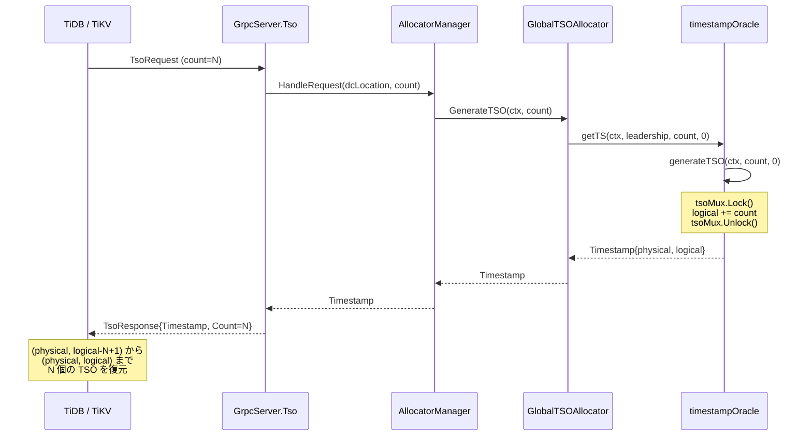
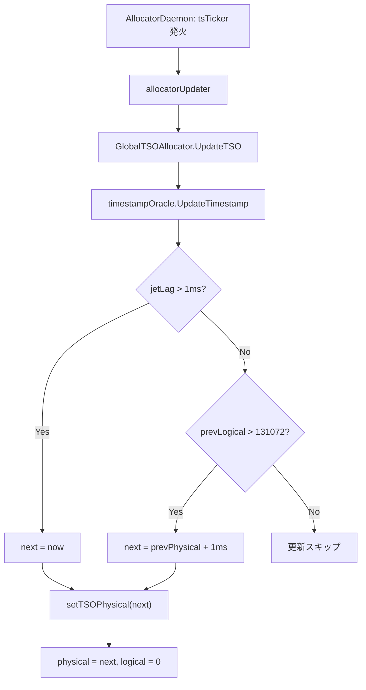

# 第4章 TSO の仕組みと GlobalAllocator

> **本章で読むソース**
>
> - [`pkg/tso/tso.go`](https://github.com/tikv/pd/blob/v8.5.6/pkg/tso/tso.go)
> - [`pkg/tso/global_allocator.go`](https://github.com/tikv/pd/blob/v8.5.6/pkg/tso/global_allocator.go)
> - [`pkg/tso/allocator_manager.go`](https://github.com/tikv/pd/blob/v8.5.6/pkg/tso/allocator_manager.go)
> - [`server/grpc_service.go`](https://github.com/tikv/pd/blob/v8.5.6/server/grpc_service.go)

## この章の狙い

TSO の64ビット表現と、それをメモリ上で管理する `timestampOracle`、採番を外部に公開する `GlobalTSOAllocator` の構造を読む。
gRPC のリクエストからタイムスタンプが返るまでの呼び出し経路を追い、物理クロックの定期更新と論理カウンタのリセットの仕組みを確認する。
最適化の工夫として、1回のロック獲得で複数のタイムスタンプを採番するバッチ処理を機構レベルで説明する。

## 前提

[第1章](../part00-overview/01-what-is-pd.md)で述べたとおり、PD は TiDB エコシステムのクラスタマネージャであり、TSO の発行はその3つの柱のひとつである。
TiDB のトランザクションは開始時と確定時にそれぞれ単調増加するタイムスタンプを取得し、MVCC の可視性判定に用いる。
PD のリーダーノードだけが TSO を発行し、単調性を保証する。
本章のコード引用はすべて tikv/pd のタグ `v8.5.6` に固定する。

## TSO の64ビット表現

**TSO（Timestamp Oracle）** は64ビット整数であり、上位46ビットが**物理部**（ミリ秒単位のタイムスタンプ）、下位18ビットが**論理部**（カウンタ）を表す。
物理部はシステム時刻から取り、論理部は同一ミリ秒内の採番順序を区別する。

定数 `maxLogical` が論理部の上限を定める。

[`pkg/tso/tso.go L41-L55`](https://github.com/tikv/pd/blob/v8.5.6/pkg/tso/tso.go#L41-L55)

```go
const (
	// UpdateTimestampGuard is the min timestamp interval.
	UpdateTimestampGuard = time.Millisecond
	// maxLogical is the max upper limit for logical time.
	// When a TSO's logical time reaches this limit,
	// the physical time will be forced to increase.
	maxLogical = int64(1 << 18)
	// MaxSuffixBits indicates the max number of suffix bits.
	MaxSuffixBits = 4
	// ... (中略) ...
	jetLagWarningThreshold = 150 * time.Millisecond
)
```

`maxLogical` は `1 << 18`、すなわち 262144 である。
1ミリ秒あたり最大262144個の TSO を発行できる計算になる。
**`UpdateTimestampGuard`** は物理クロックの更新判定に使う閾値であり、後述の `UpdateTimestamp` で参照される。

## tsoObject と timestampOracle

メモリ上で物理部と論理部を保持するのが **`tsoObject`** 構造体である。

[`pkg/tso/tso.go L58-L63`](https://github.com/tikv/pd/blob/v8.5.6/pkg/tso/tso.go#L58-L63)

```go
type tsoObject struct {
	syncutil.RWMutex
	physical   time.Time
	logical    int64
	updateTime time.Time
}
```

`physical` が物理部の時刻、`logical` が論理カウンタ、`updateTime` が最終更新時刻である。
`syncutil.RWMutex` を埋め込んでおり、読み書きをロックで保護する。

この `tsoObject` をフィールドに持ち、etcd との同期や採番の制御を担うのが **`timestampOracle`** 構造体である。

[`pkg/tso/tso.go L66-L85`](https://github.com/tikv/pd/blob/v8.5.6/pkg/tso/tso.go#L66-L85)

```go
type timestampOracle struct {
	client          *clientv3.Client
	keyspaceGroupID uint32
	tsPath  string
	storage endpoint.TSOStorage
	// ... (中略) ...
	updatePhysicalInterval time.Duration
	maxResetTSGap          func() time.Duration
	// tso info stored in the memory
	tsoMux *tsoObject
	// last timestamp window stored in etcd
	lastSavedTime atomic.Value // stored as time.Time
	suffix        int
	dcLocation    string
	// ... (中略) ...
}
```

`timestampOracle` は `tsoMux`（`tsoObject` へのポインタ）を通じて物理部と論理部を操作する。
`suffix` フィールドは Local TSO で使うサフィックスであり、Global TSO では 0 に設定される[^suffix]。

[^suffix]: Local TSO とサフィックスの詳細は [第6章](06-local-tso-and-microservice.md) で読む。

## GlobalTSOAllocator

**`GlobalTSOAllocator`** は、`timestampOracle` を包んで外部に採番機能を公開する構造体である。

[`pkg/tso/global_allocator.go L76-L94`](https://github.com/tikv/pd/blob/v8.5.6/pkg/tso/global_allocator.go#L76-L94)

```go
type GlobalTSOAllocator struct {
	ctx    context.Context
	cancel context.CancelFunc
	wg     sync.WaitGroup

	// for global TSO synchronization
	am *AllocatorManager
	// for election use
	member ElectionMember
	// ... (中略) ...
	timestampOracle      *timestampOracle
	// ... (中略) ...
	syncRTT atomic.Value // store as int64 milliseconds
	// pre-initialized metrics
	tsoAllocatorRoleGauge prometheus.Gauge
}
```

`am`（`AllocatorManager`）はアロケータの生成と管理を行うマネージャである。
`member` はリーダー選出のためのインタフェースであり、`timestampOracle` が採番時にリーダーシップを検証する際に使う。

`GlobalTSOAllocator` は **`Allocator`** インタフェースを実装する。

[`pkg/tso/global_allocator.go L46-L73`](https://github.com/tikv/pd/blob/v8.5.6/pkg/tso/global_allocator.go#L46-L73)

```go
type Allocator interface {
	// Initialize is used to initialize a TSO allocator.
	Initialize(suffix int) error
	// IsInitialize is used to indicates whether this allocator is initialized.
	IsInitialize() bool
	// UpdateTSO is used to update the TSO in memory and the time window in etcd.
	UpdateTSO() error
	// ... (中略) ...
	// GenerateTSO is used to generate a given number of TSOs.
	// Make sure you have initialized the TSO allocator before calling.
	GenerateTSO(ctx context.Context, count uint32) (pdpb.Timestamp, error)
	// Reset is used to reset the TSO allocator.
	Reset()
}
```

`Initialize`、`UpdateTSO`、`GenerateTSO` が採番の主要な操作である。

### Initialize

`Initialize` は `suffix` を 0 に設定し、`SyncTimestamp` で etcd から物理クロックを同期する。

[`pkg/tso/global_allocator.go L185-L190`](https://github.com/tikv/pd/blob/v8.5.6/pkg/tso/global_allocator.go#L185-L190)

```go
func (gta *GlobalTSOAllocator) Initialize(int) error {
	gta.tsoAllocatorRoleGauge.Set(1)
	gta.timestampOracle.suffix = 0
	return gta.timestampOracle.SyncTimestamp()
}
```

`SyncTimestamp` は etcd に保存された最終タイムスタンプを読み出し、現在時刻と比較して安全な初期値を `tsoMux` に設定する。
初期化が完了すると、「GlobalTSOAllocator」は採番可能な状態になる。

## TSO 採番の呼び出し経路

クライアントから TSO を要求して応答が返るまでの流れを追う。

### gRPC Tso ハンドラ

TiDB や TiKV からの TSO 要求は gRPC の双方向ストリーミングで届く。
`GrpcServer.Tso` メソッドがストリームからリクエストを読み、`AllocatorManager.HandleRequest` に委譲する。

[`server/grpc_service.go L638-L654`](https://github.com/tikv/pd/blob/v8.5.6/server/grpc_service.go#L638-L654)

```go
		count := request.GetCount()
		ctx, task := trace.NewTask(ctx, "tso")
		ts, err := s.tsoAllocatorManager.HandleRequest(ctx, request.GetDcLocation(), count)
		task.End()
		tsoHandleDuration.Observe(time.Since(start).Seconds())
		if err != nil {
			return status.Error(codes.Unknown, err.Error())
		}
		response := &pdpb.TsoResponse{
			Header:    wrapHeader(),
			Timestamp: &ts,
			Count:     count,
		}
		if err := stream.Send(response); err != nil {
			return errors.WithStack(err)
		}
```

`request.GetCount()` でクライアントが要求するタイムスタンプの個数を取得し、そのまま `HandleRequest` に渡す。
応答の `Count` フィールドにも同じ値を返す。
この `count` がバッチ処理の起点であり、後述する。

### AllocatorManager.HandleRequest

`HandleRequest` は `dcLocation` に対応するアロケータを取得し、`GenerateTSO` を呼ぶ。

[`pkg/tso/allocator_manager.go L1117-L1129`](https://github.com/tikv/pd/blob/v8.5.6/pkg/tso/allocator_manager.go#L1117-L1129)

```go
func (am *AllocatorManager) HandleRequest(ctx context.Context, dcLocation string, count uint32) (pdpb.Timestamp, error) {
	defer trace.StartRegion(ctx, "AllocatorManager.HandleRequest").End()
	if len(dcLocation) == 0 {
		dcLocation = GlobalDCLocation
	}
	allocatorGroup, exist := am.getAllocatorGroup(dcLocation)
	if !exist {
		err := errs.ErrGetAllocator.FastGenByArgs(fmt.Sprintf("%s allocator not found, generate timestamp failed", dcLocation))
		return pdpb.Timestamp{}, err
	}
	return allocatorGroup.allocator.GenerateTSO(ctx, count)
}
```

`dcLocation` が空の場合は `GlobalDCLocation` に補完される。
単一データセンター構成では常にこの分岐を通り、「GlobalTSOAllocator」の `GenerateTSO` が呼ばれる。

### GlobalTSOAllocator.GenerateTSO

`GenerateTSO` は dc-location マップが空であれば `timestampOracle.getTS` を直接呼ぶ。

[`pkg/tso/global_allocator.go L237-L241`](https://github.com/tikv/pd/blob/v8.5.6/pkg/tso/global_allocator.go#L237-L241)

```go
	dcLocationMap := gta.am.GetClusterDCLocations()
	if len(dcLocationMap) == 0 {
		return gta.timestampOracle.getTS(ctx, gta.member.GetLeadership(), count, 0)
	}
```

単一データセンター構成ではこの分岐で処理が完結する。
`suffixBits` に 0 を渡しているため、論理部のサフィックス加工は行われない。

### timestampOracle.getTS

`getTS` はリトライループの中で `generateTSO` を呼び、論理部が `maxLogical` を超えていないか検証する。

[`pkg/tso/tso.go L407-L447`](https://github.com/tikv/pd/blob/v8.5.6/pkg/tso/tso.go#L407-L447)

```go
func (t *timestampOracle) getTS(ctx context.Context, leadership *election.Leadership, count uint32, suffixBits int) (pdpb.Timestamp, error) {
	defer trace.StartRegion(ctx, "timestampOracle.getTS").End()
	var resp pdpb.Timestamp
	if count == 0 {
		return resp, errs.ErrGenerateTimestamp.FastGenByArgs("tso count should be positive")
	}
	for i := range maxRetryCount {
		currentPhysical, _ := t.getTSO()
		if currentPhysical == typeutil.ZeroTime {
			// If it's leader, maybe SyncTimestamp hasn't completed yet
			if leadership.Check() {
				time.Sleep(200 * time.Millisecond)
				continue
			}
			// ... (中略) ...
			return pdpb.Timestamp{}, errs.ErrGenerateTimestamp.FastGenByArgs("timestamp in memory isn't initialized")
		}
		// Get a new TSO result with the given count
		resp.Physical, resp.Logical, _ = t.generateTSO(ctx, int64(count), suffixBits)
		if resp.GetPhysical() == 0 {
			return pdpb.Timestamp{}, errs.ErrGenerateTimestamp.FastGenByArgs("timestamp in memory has been reset")
		}
		if resp.GetLogical() >= maxLogical {
			// ... (中略) ...
			t.metrics.logicalOverflowEvent.Inc()
			time.Sleep(t.updatePhysicalInterval)
			continue
		}
		// In case lease expired after the first check.
		if !leadership.Check() {
			return pdpb.Timestamp{}, errs.ErrGenerateTimestamp.FastGenByArgs(
				fmt.Sprintf("requested %s anymore", errs.NotLeaderErr))
		}
		resp.SuffixBits = uint32(suffixBits)
		return resp, nil
	}
	// ... (中略) ...
}
```

ループの先頭で `getTSO` を呼び、物理部が未初期化（ゼロ値）なら 200ms スリープしてリトライする。
`generateTSO` の結果、論理部が `maxLogical`（262144）以上になった場合は、物理クロックの更新を待って再試行する。
リーダーシップが失われた場合はエラーを返す。

### timestampOracle.generateTSO

`generateTSO` は `tsoMux` のロックを取り、論理カウンタに `count` を加算して物理部と論理部を返す。

[`pkg/tso/tso.go L126-L143`](https://github.com/tikv/pd/blob/v8.5.6/pkg/tso/tso.go#L126-L143)

```go
func (t *timestampOracle) generateTSO(ctx context.Context, count int64, suffixBits int) (physical int64, logical int64, lastUpdateTime time.Time) {
	defer trace.StartRegion(ctx, "timestampOracle.generateTSO").End()
	t.tsoMux.Lock()
	defer t.tsoMux.Unlock()
	if t.tsoMux.physical == typeutil.ZeroTime {
		return 0, 0, typeutil.ZeroTime
	}
	physical = t.tsoMux.physical.UnixNano() / int64(time.Millisecond)
	t.tsoMux.logical += count
	logical = t.tsoMux.logical
	if suffixBits > 0 && t.suffix >= 0 {
		logical = t.calibrateLogical(logical, suffixBits)
	}
	// Return the last update time
	lastUpdateTime = t.tsoMux.updateTime
	t.tsoMux.updateTime = time.Now()
	return physical, logical, lastUpdateTime
}
```

`t.tsoMux.logical += count` が採番の核心である。
`count` 個分の連番を一度に確保し、加算後の `logical` を返す。
呼び出し元は `(physical, logical - count + 1)` から `(physical, logical)` までの `count` 個のタイムスタンプを復元できる。
この仕組みがバッチ処理であり、本章で取り上げる最適化の工夫である。

### 呼び出し経路のまとめ

以下のシーケンス図に TSO 採番の流れを示す。



## バッチ採番による効率化

TSO の採番で最もコストが高い操作は `tsoMux` のロック獲得である。
すべての TSO 要求が同一の `tsoMux` を経由するため、ロックの競合がスループットのボトルネックになりうる。

バッチ採番はこのボトルネックを緩和する。
gRPC の `Tso` ハンドラはクライアントが `request.GetCount()` で指定した個数をそのまま `HandleRequest` に渡す。
この `count` は `generateTSO` まで伝搬し、`tsoMux.logical += count` で一度に `count` 個分の論理カウンタを確保する。

ロックの獲得と解放は `count` の値にかかわらず1回ずつである。
`count` が 1 のときも 100 のときも、ロックの回数は変わらない。
クライアントが複数の TSO をまとめて要求すれば、ロック競合の回数がその分だけ減り、スループットが向上する。

クライアント側では、応答の `(physical, logical)` と `count` から個々の TSO を逆算する。
`logical - count + 1` から `logical` までの連番がそれぞれ1つの TSO に対応し、いずれも同じ `physical` を持つ。
この逆算はクライアントのメモリ上で完結するため、PD 側の負荷は増えない。

## 物理クロックの更新と論理カウンタのリセット

論理部は18ビット（最大262144）しかないため、同一の物理部で採番し続けるといずれ枯渇する。
PD はバックグラウンドで物理クロックを定期的に更新し、論理カウンタをリセットすることで枯渇を防ぐ。

### AllocatorDaemon と allocatorUpdater

**`AllocatorManager`** の `AllocatorDaemon` メソッドがティッカーを起動し、`updatePhysicalInterval` の間隔で `allocatorUpdater` を呼ぶ。

[`pkg/tso/allocator_manager.go L715-L730`](https://github.com/tikv/pd/blob/v8.5.6/pkg/tso/allocator_manager.go#L715-L730)

```go
	tsTicker := time.NewTicker(am.updatePhysicalInterval)
	// ... (中略) ...
	defer tsTicker.Stop()
	// ... (中略) ...
	for {
		select {
		// ... (中略) ...
		case <-tsTicker.C:
			am.allocatorUpdater()
		// ... (中略) ...
		}
	}
```

`allocatorUpdater` は初期化済みかつリーダーシップを持つアロケータだけをフィルタし、それぞれに対して `UpdateTSO` を呼ぶ。

[`pkg/tso/allocator_manager.go L749-L758`](https://github.com/tikv/pd/blob/v8.5.6/pkg/tso/allocator_manager.go#L749-L758)

```go
func (am *AllocatorManager) allocatorUpdater() {
	allocatorGroups := am.getAllocatorGroups(FilterUninitialized(), FilterUnavailableLeadership())
	for _, ag := range allocatorGroups {
		am.wg.Add(1)
		go am.updateAllocator(ag)
	}
	am.wg.Wait()
}
```

### UpdateTSO

`GlobalTSOAllocator` の `UpdateTSO` は `timestampOracle.UpdateTimestamp` を呼ぶ。
失敗時は最大3回リトライする。

[`pkg/tso/global_allocator.go L198-L212`](https://github.com/tikv/pd/blob/v8.5.6/pkg/tso/global_allocator.go#L198-L212)

```go
func (gta *GlobalTSOAllocator) UpdateTSO() (err error) {
	// ... (中略) ...
	maxRetryCount := 3
	for range maxRetryCount {
		err = gta.timestampOracle.UpdateTimestamp()
		if err == nil {
			return nil
		}
		log.Warn("try to update the global tso but failed", errs.ZapError(err))
		// ... (中略) ...
		time.Sleep(50 * time.Millisecond)
	}
	return
}
```

### UpdateTimestamp の next 決定ロジック

`UpdateTimestamp` の中核は、次の物理クロック値 `next` をどう決めるかである。
`now`（現在時刻）と `prevPhysical`（前回の物理部）の差を **`jetLag`** とし、3つの分岐で `next` を決定する。

[`pkg/tso/tso.go L364-L379`](https://github.com/tikv/pd/blob/v8.5.6/pkg/tso/tso.go#L364-L379)

```go
	var next time.Time
	if jetLag > UpdateTimestampGuard {
		next = now
	} else if prevLogical > maxLogical/2 {
		// ... (中略) ...
		log.Warn("the logical time may be not enough",
			logutil.CondUint32("keyspace-group-id", t.keyspaceGroupID, t.keyspaceGroupID > 0),
			zap.Int64("prev-logical", prevLogical))
		next = prevPhysical.Add(time.Millisecond)
	} else {
		t.metrics.skipSaveEvent.Inc()
		return nil
	}
```

第1の分岐は `jetLag > UpdateTimestampGuard`（1ms）の場合である。
前回の物理部から1ms 以上経過しているので、`now` をそのまま次の物理部にする。
通常の更新はこの分岐を通る。

第2の分岐は `prevLogical > maxLogical/2`（131072）の場合である。
論理カウンタが半分を超えており、次の更新までに枯渇する可能性がある。
この場合は `prevPhysical + 1ms` を次の物理部にして、論理カウンタの枯渇を防ぐ。
`jetLag` が 1ms 未満でも物理部を強制的に進める点がこの分岐の特徴である。

第3の分岐（`else`）は、経過時間が短く論理カウンタにも余裕がある場合であり、更新をスキップする。

### setTSOPhysical

`next` が決まると `setTSOPhysical` で物理部を更新する。
このメソッドは物理部を `next` に進めると同時に、論理カウンタを 0 にリセットする。

[`pkg/tso/tso.go L101-L114`](https://github.com/tikv/pd/blob/v8.5.6/pkg/tso/tso.go#L101-L114)

```go
func (t *timestampOracle) setTSOPhysical(next time.Time, force bool) {
	t.tsoMux.Lock()
	defer t.tsoMux.Unlock()
	if t.tsoMux.physical == typeutil.ZeroTime && !force {
		return
	}
	if typeutil.SubTSOPhysicalByWallClock(next, t.tsoMux.physical) > 0 {
		t.tsoMux.physical = next
		t.tsoMux.logical = 0
		t.tsoMux.updateTime = time.Now()
	}
}
```

`next` が現在の `physical` より未来であることを確認してから更新する。
時刻が逆行する更新は無視されるため、TSO の単調増加が壊れることはない。
`logical` を 0 にリセットすることで、新しい物理部のもとで論理カウンタが再び 0 から始まる。

物理クロック更新の全体の流れを図にまとめる。



## まとめ

TSO は64ビット整数であり、上位46ビットが物理部（ミリ秒）、下位18ビットが論理部（カウンタ）を表す。
`tsoObject` がメモリ上で物理部と論理部を保持し、`timestampOracle` が採番とクロック同期を担う。
「GlobalTSOAllocator」は `timestampOracle` を包み、`Allocator` インタフェースを通じて採番機能を公開する。

gRPC の `Tso` ハンドラから `AllocatorManager.HandleRequest`、`GlobalTSOAllocator.GenerateTSO`、`timestampOracle.getTS`、`generateTSO` へと呼び出しが連なり、`tsoMux` のロック内で論理カウンタを加算して TSO を返す。

バッチ採番では、クライアントが `count` で指定した個数の TSO を1回のロック獲得で発行する。
ロック競合の回数を減らすことでスループットを向上させる仕組みである。

物理クロックは `AllocatorDaemon` のティッカーが定期的に更新する。
`jetLag` が 1ms を超えるか論理カウンタが半分を超えたときに物理部を進め、同時に論理カウンタを 0 にリセットする。
これにより論理部の枯渇を防ぎつつ、TSO の単調増加を維持する。

## 関連する章

- [PD とは何か](../part00-overview/01-what-is-pd.md)：PD の3つの柱と TSO の位置付けを読む。
- [タイムスタンプの永続化と安全性](05-tso-persistence.md)：`SyncTimestamp` による etcd への永続化と、リーダー切り替え時の安全性を読む。
- [Local TSO とマイクロサービス化](06-local-tso-and-microservice.md)：複数データセンター構成での Local TSO とサフィックスの仕組みを読む。
