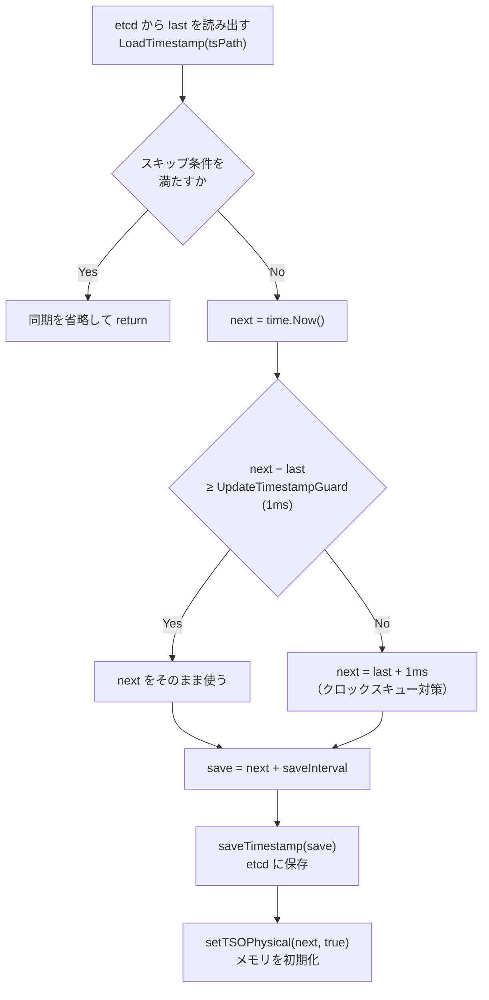
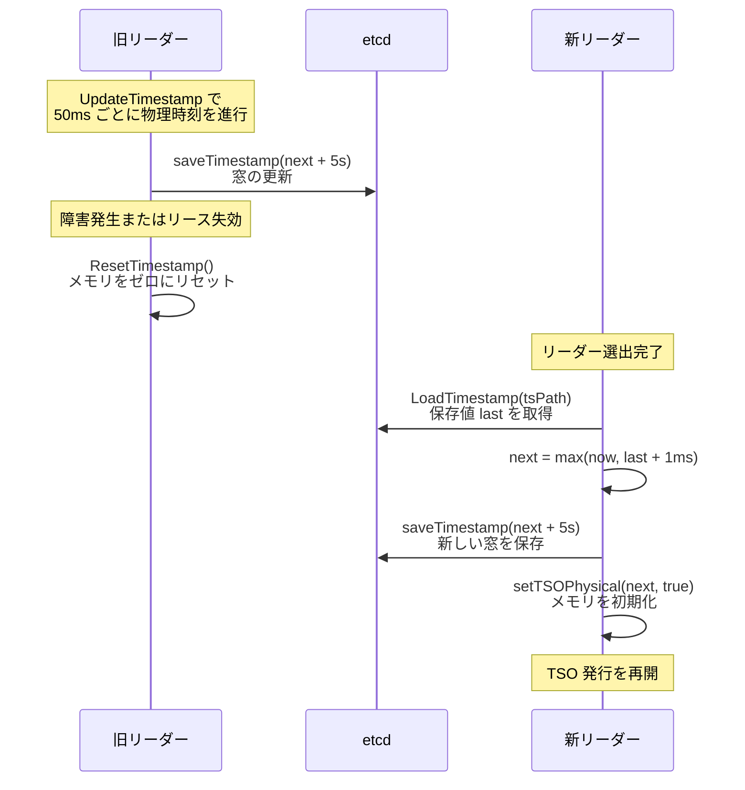

# 第5章 タイムスタンプの永続化と安全性

> **本章で読むソース**
>
> - [`pkg/tso/tso.go`](https://github.com/tikv/pd/blob/v8.5.6/pkg/tso/tso.go)
> - [`pkg/tso/global_allocator.go`](https://github.com/tikv/pd/blob/v8.5.6/pkg/tso/global_allocator.go)
> - [`pkg/storage/endpoint/tso.go`](https://github.com/tikv/pd/blob/v8.5.6/pkg/storage/endpoint/tso.go)

## この章の狙い

TSO の値がメモリ上でどのように保持され発行されるかは第4章で読んだ。
しかし PD のリーダーは交代し、プロセスは予期しない再起動に遭う。
メモリ上の TSO だけでは、リーダー切り替わり後に巻き戻りが起きてしまう。

本章では、PD がどのように etcd へ物理タイムスタンプを永続化し、リーダー交代時にどのような手順で安全に TSO を引き継ぐかを読む。
具体的には、先行保存の窓方式による etcd 書き込みの削減、`SyncTimestamp` によるリーダー起動時の同期、`UpdateTimestamp` による定期更新、そして障害シナリオでの挙動を扱う。

## 前提

第4章で読んだ `timestampOracle` 構造体の全体像を前提とする。
TSO は物理部（ミリ秒精度の壁時計）と論理部（18ビットカウンタ、上限 `maxLogical` = 2^18 = 262,144）の組である。

本章で頻出する2つの設定値を先に示す。

- **`saveInterval`**：etcd に先行保存する窓の幅。デフォルトは `DefaultTSOSaveInterval` = 5秒（`defaultLeaderLease` 秒）[^1]。
- **`updatePhysicalInterval`**：`UpdateTimestamp` の呼び出し間隔。デフォルトは 50ms。

[^1]: `saveInterval` の既定値は `server/config/config.go` L229-L230 で定義される。`defaultLeaderLease = 5`（同 L178）から `time.Duration(5) * time.Second` = 5秒となる。

## etcd への保存形式

### TSOStorage インタフェース

TSO の永続化は `TSOStorage` インタフェースを通じて行われる。

[`pkg/storage/endpoint/tso.go L32-L36`](https://github.com/tikv/pd/blob/v8.5.6/pkg/storage/endpoint/tso.go#L32-L36)

```go
// TSOStorage is the interface for timestamp storage.
type TSOStorage interface {
	LoadTimestamp(prefix string) (time.Time, error)
	SaveTimestamp(ctx context.Context, key string, ts time.Time) error
	DeleteTimestamp(ctx context.Context, key string) error
}
```

`SaveTimestamp` が書き込み、`LoadTimestamp` がリーダー起動時の読み出し、`DeleteTimestamp` がキー削除を担う。

### etcd キーパスと保存値

デフォルトの Keyspace Group（ID = 0）では、etcd のキーパスは `/pd/{cluster_id}/timestamp` となる。
この構成は `KeyspaceGroupGlobalTSPath` と `TimestampPath` で組み立てられる。

[`pkg/utils/keypath/key_path.go L72-L73`](https://github.com/tikv/pd/blob/v8.5.6/pkg/utils/keypath/key_path.go#L72-L73)

```go
// TimestampKey is the key of timestamp oracle used for the suffix.
TimestampKey = "timestamp"
```

[`pkg/utils/keypath/key_path.go L425-L428`](https://github.com/tikv/pd/blob/v8.5.6/pkg/utils/keypath/key_path.go#L425-L428)

```go
// TimestampPath returns the timestamp path for the given timestamp oracle path prefix.
func TimestampPath(tsPath string) string {
	return path.Join(tsPath, TimestampKey)
}
```

値は `time.Time` の `UnixNano()` をビッグエンディアン 8バイトのバイト列に変換して保存する。

[`pkg/storage/endpoint/tso.go L90-L91`](https://github.com/tikv/pd/blob/v8.5.6/pkg/storage/endpoint/tso.go#L90-L91)

```go
		data := typeutil.Uint64ToBytes(uint64(ts.UnixNano()))
		return txn.Save(key, string(data))
```

読み出し時は逆変換で `time.Time` に復元する。

[`pkg/utils/typeutil/time.go L22-L30`](https://github.com/tikv/pd/blob/v8.5.6/pkg/utils/typeutil/time.go#L22-L30)

```go
// ParseTimestamp returns a timestamp for a given byte slice.
func ParseTimestamp(data []byte) (time.Time, error) {
	nano, err := BytesToUint64(data)
	if err != nil {
		return ZeroTime, err
	}

	return time.Unix(0, int64(nano)), nil
}
```

### SaveTimestamp: トランザクションによる単調性保証

`SaveTimestamp` は etcd のトランザクション（`RunInTxn`）内で、現在保存されている値を読み取り、新しい値が厳密に大きいことを検査してから書き込む。

[`pkg/storage/endpoint/tso.go L72-L93`](https://github.com/tikv/pd/blob/v8.5.6/pkg/storage/endpoint/tso.go#L72-L93)

```go
func (se *StorageEndpoint) SaveTimestamp(ctx context.Context, key string, ts time.Time) error {
	return se.RunInTxn(ctx, func(txn kv.Txn) error {
		value, err := txn.Load(key)
		if err != nil {
			return err
		}

		previousTS := typeutil.ZeroTime
		if value != "" {
			previousTS, err = typeutil.ParseTimestamp([]byte(value))
			if err != nil {
				log.Error("parse timestamp failed", zap.String("key", key), zap.String("value", value), zap.Error(err))
				return err
			}
		}
		if previousTS != typeutil.ZeroTime && typeutil.SubRealTimeByWallClock(ts, previousTS) <= 0 {
			return errors.Errorf("saving timestamp %d is less than or equal to the previous one %d", ts.UnixNano(), previousTS.UnixNano())
		}
		data := typeutil.Uint64ToBytes(uint64(ts.UnixNano()))
		return txn.Save(key, string(data))
	})
}
```

L87 の条件が単調性のガードである。
新しい時刻 `ts` が既存の `previousTS` 以下であれば、トランザクション全体がエラーで中断される。
この検査により、etcd 上の保存値が後退することはない。

## 窓方式: etcd 書き込みの削減

PD は TSO を発行するたびに etcd へ書き込むわけではない。
現在の物理時刻よりも「saveInterval」（デフォルト5秒）先の時刻を etcd に保存し、その範囲内ではメモリ上の TSO を進めるだけで etcd アクセスを省く。
本章ではこの仕組みを**窓方式**と呼ぶ。

窓方式の要点は次の通りである。

1. リーダー起動時（`SyncTimestamp`）に `next + saveInterval` を etcd に保存する。この保存値が「窓の上端」となる。
2. 定期更新（`UpdateTimestamp`）では、メモリ上の物理時刻を壁時計に追従させるが、etcd には書き込まない。
3. 物理時刻が窓の上端に近づいた（残余が `UpdateTimestampGuard` = 1ms 以下になった）ときだけ、新しい窓を etcd に保存する。

`saveInterval` = 5秒、`updatePhysicalInterval` = 50ms の既定構成では、etcd への書き込みはおよそ5秒に1回で済む。
50ms ごとに書き込む場合と比べて約100分の1に抑えられる。
これが本章で扱う最適化の工夫であり、TSO 発行のレイテンシと etcd の負荷を同時に下げる機構である。

`timestampOracle` の `lastSavedTime` フィールドが窓の上端をメモリ上に保持する。

[`pkg/tso/tso.go L78-L79`](https://github.com/tikv/pd/blob/v8.5.6/pkg/tso/tso.go#L78-L79)

```go
	// last timestamp window stored in etcd
	lastSavedTime atomic.Value // stored as time.Time
```

以下の図に、窓方式の動作を時間軸上で示す。

```mermaid
gantt
    title 窓方式による永続化タイムライン
    dateFormat X
    axisFormat %s秒

    section etcd 保存値
    窓1（next₁ + 5s）          :done, w1, 0, 5
    窓2（next₂ + 5s）          :done, w2, 5, 10
    窓3（next₃ + 5s）          :done, w3, 10, 15

    section メモリ上の物理時刻
    50ms ごとに壁時計に追従      :active, mem, 0, 15

    section etcd 書き込み発生
    SyncTimestamp              :milestone, m1, 0, 0
    窓の残余 ≤ 1ms             :milestone, m2, 5, 5
    窓の残余 ≤ 1ms             :milestone, m3, 10, 10
```



窓の内側にいる間は `UpdateTimestamp` が etcd 書き込みをスキップし、窓の端に達したときだけ次の窓を保存する。

## SyncTimestamp: リーダー起動時の同期

新しいリーダーが選出されると、`GlobalTSOAllocator.Initialize` から `SyncTimestamp` が呼ばれる。

[`pkg/tso/global_allocator.go L185-L190`](https://github.com/tikv/pd/blob/v8.5.6/pkg/tso/global_allocator.go#L185-L190)

```go
// Initialize will initialize the created global TSO allocator.
func (gta *GlobalTSOAllocator) Initialize(int) error {
	gta.tsoAllocatorRoleGauge.Set(1)
	// The suffix of a Global TSO should always be 0.
	gta.timestampOracle.suffix = 0
	return gta.timestampOracle.SyncTimestamp()
}
```

`SyncTimestamp` は4つの段階で TSO を安全に初期化する。

[`pkg/tso/tso.go L176-L244`](https://github.com/tikv/pd/blob/v8.5.6/pkg/tso/tso.go#L176-L244)

```go
func (t *timestampOracle) SyncTimestamp() error {
	log.Info("start to sync timestamp", logutil.CondUint32("keyspace-group-id", t.keyspaceGroupID, t.keyspaceGroupID > 0))
	t.metrics.syncEvent.Inc()

	// ... (中略: failpoint) ...

	last, err := t.storage.LoadTimestamp(t.tsPath)
	if err != nil {
		return err
	}
	lastSavedTime := t.getLastSavedTime()
	// We could skip the synchronization if the following conditions are met:
	//   1. The timestamp in memory has been initialized.
	//   2. The last saved timestamp in etcd is not zero.
	//   3. The last saved timestamp in memory is not zero.
	//   4. The last saved timestamp in etcd is equal to the last saved timestamp in memory.
	if t.isInitialized() &&
		last != typeutil.ZeroTime &&
		lastSavedTime != typeutil.ZeroTime &&
		typeutil.SubRealTimeByWallClock(last, lastSavedTime) == 0 {
		log.Info("skip sync timestamp",
			// ... (中略) ...
		t.metrics.skipSyncEvent.Inc()
		return nil
	}

	next := time.Now()
	// ... (中略: failpoint) ...
	// If the current system time minus the saved etcd timestamp is less than `UpdateTimestampGuard`,
	// the timestamp allocation will start from the saved etcd timestamp temporarily.
	if typeutil.SubRealTimeByWallClock(next, last) < UpdateTimestampGuard {
		log.Warn("system time may be incorrect",
			// ... (中略) ...
		next = last.Add(UpdateTimestampGuard)
	}
	// ... (中略: failpoint) ...
	save := next.Add(t.saveInterval)
	start := time.Now()
	if err = t.saveTimestamp(save); err != nil {
		t.metrics.errSaveSyncTSEvent.Inc()
		return err
	}
	t.lastSavedTime.Store(save)
	t.metrics.syncSaveDuration.Observe(time.Since(start).Seconds())

	// ... (中略: ログ出力) ...
	// save into memory
	t.setTSOPhysical(next, true)
	return nil
}
```

処理の流れを段階ごとに追う。

**段階1: etcd から前リーダーの保存値を読み出す。**
`LoadTimestamp` は、指定されたプレフィックス以下のすべてのキーを走査し、最大の時刻を返す。
Global TSO の場合、Local TSO のキーも含めて最大値を取るため、いかなる TSO 経路の保存値も見落とさない。

[`pkg/storage/endpoint/tso.go L43-L69`](https://github.com/tikv/pd/blob/v8.5.6/pkg/storage/endpoint/tso.go#L43-L69)

```go
func (se *StorageEndpoint) LoadTimestamp(prefix string) (time.Time, error) {
	prefixEnd := clientv3.GetPrefixRangeEnd(prefix)
	keys, values, err := se.LoadRange(prefix, prefixEnd, 0)
	if err != nil {
		return typeutil.ZeroTime, err
	}
	if len(keys) == 0 {
		return typeutil.ZeroTime, nil
	}

	maxTSWindow := typeutil.ZeroTime
	for i, key := range keys {
		key := strings.TrimSpace(key)
		if !strings.HasSuffix(key, keypath.TimestampKey) {
			continue
		}
		tsWindow, err := typeutil.ParseTimestamp([]byte(values[i]))
		if err != nil {
			log.Error("parse timestamp window that from etcd failed", zap.String("ts-window-key", key), zap.Time("max-ts-window", maxTSWindow), zap.Error(err))
			continue
		}
		if typeutil.SubRealTimeByWallClock(tsWindow, maxTSWindow) > 0 {
			maxTSWindow = tsWindow
		}
	}
	return maxTSWindow, nil
}
```

**段階2: 同期のスキップ判定。**
メモリ上の TSO が初期化済みで、etcd の保存値とメモリ上の「lastSavedTime」が一致している場合、同期を省略する（L196-L205）。
これは同一リーダーが `SyncTimestamp` を再度呼んだ場合の不要な etcd 書き込みを防ぐ最適化である。

**段階3: 開始時刻の決定。**
現在の壁時計（`next = time.Now()`）と etcd の保存値（`last`）を比較する。
壁時計が保存値を `UpdateTimestampGuard`（1ms）以上超えていれば壁時計をそのまま使う。
超えていなければ、壁時計が遅れているか、前リーダーが最近まで稼働していた可能性がある。
この場合、`last + UpdateTimestampGuard`（= 保存値 + 1ms）を開始時刻として採用する（L216-L223）。
この分岐がクロックスキューに対する防御線となる。

**段階4: 新しい窓の保存とメモリの初期化。**
決定した `next` に `saveInterval` を加えた時刻を etcd に保存する（L227-L233）。
成功したら、`setTSOPhysical(next, true)` でメモリ上の物理時刻を `next` に初期化し、論理部を 0 にリセットする（L242）。

`SyncTimestamp` の流れを図に示す。



## UpdateTimestamp: 定期更新ループ

`SyncTimestamp` でメモリが初期化された後は、`UpdateTimestamp` が `updatePhysicalInterval`（デフォルト50ms）ごとに呼ばれ、物理時刻をシステムクロックに追従させる。

[`pkg/tso/tso.go L331-L402`](https://github.com/tikv/pd/blob/v8.5.6/pkg/tso/tso.go#L331-L402)

```go
func (t *timestampOracle) UpdateTimestamp() error {
	if !t.isInitialized() {
		return errs.ErrUpdateTimestamp.FastGenByArgs("timestamp in memory has not been initialized")
	}
	prevPhysical, prevLogical := t.getTSO()
	// ... (中略: メトリクス設定) ...

	now := time.Now()
	// ... (中略: failpoint) ...

	t.metrics.saveEvent.Inc()

	jetLag := typeutil.SubRealTimeByWallClock(now, prevPhysical)
	if jetLag > 3*t.updatePhysicalInterval && jetLag > jetLagWarningThreshold {
		log.Warn("clock offset",
			// ... (中略) ...
		t.metrics.slowSaveEvent.Inc()
	}

	if jetLag < 0 {
		t.metrics.systemTimeSlowEvent.Inc()
	}

	var next time.Time
	// If the system time is greater, it will be synchronized with the system time.
	if jetLag > UpdateTimestampGuard {
		next = now
	} else if prevLogical > maxLogical/2 {
		// The reason choosing maxLogical/2 here is that it's big enough for common cases.
		// Because there is enough timestamp can be allocated before next update.
		log.Warn("the logical time may be not enough",
			// ... (中略) ...
		next = prevPhysical.Add(time.Millisecond)
	} else {
		// It will still use the previous physical time to alloc the timestamp.
		t.metrics.skipSaveEvent.Inc()
		return nil
	}

	// It is not safe to increase the physical time to `next`.
	// The time window needs to be updated and saved to etcd.
	if typeutil.SubRealTimeByWallClock(t.getLastSavedTime(), next) <= UpdateTimestampGuard {
		save := next.Add(t.saveInterval)
		start := time.Now()
		if err := t.saveTimestamp(save); err != nil {
			// ... (中略: エラーログ) ...
			t.metrics.errSaveUpdateTSEvent.Inc()
			return err
		}
		t.lastSavedTime.Store(save)
		t.metrics.updateSaveDuration.Observe(time.Since(start).Seconds())
	}
	// save into memory
	t.setTSOPhysical(next, false)

	return nil
}
```

`UpdateTimestamp` は3つの分岐で物理時刻の進め方を決定する。

1. **壁時計が十分に進んでいる場合**（`jetLag > UpdateTimestampGuard`、すなわち `now` が `prevPhysical` を 1ms 以上超えている）。`next = now` として壁時計に追従する。通常の動作はこの分岐に入る。
2. **論理部が枯渇しかけている場合**（`prevLogical > maxLogical / 2`、すなわち論理カウンタが 131,072 を超えた）。壁時計が進んでいなくても、物理時刻を 1ms 強制的に進めて論理部をリセットする。これにより論理部のオーバーフローを未然に防ぐ。
3. **どちらにも該当しない場合**。物理時刻は前回のまま据え置き、論理部だけで TSO を発行し続ける。etcd への書き込みは発生しない。

物理時刻を進めた後、窓の残余（`lastSavedTime - next`）が `UpdateTimestampGuard`（1ms）以下であれば、`next + saveInterval` を etcd に保存して窓を更新する（L383-L397）。
窓の残余がまだ十分にあれば、etcd には書き込まずメモリだけを更新する。

## 単調増加の保証機構

TSO が巻き戻らないことは、メモリ層、etcd 層、発行層の3層で保護されている。

### メモリ層: setTSOPhysical

`setTSOPhysical` は、新しい物理時刻が現在の値より進んでいるときだけ更新する。

[`pkg/tso/tso.go L101-L114`](https://github.com/tikv/pd/blob/v8.5.6/pkg/tso/tso.go#L101-L114)

```go
func (t *timestampOracle) setTSOPhysical(next time.Time, force bool) {
	t.tsoMux.Lock()
	defer t.tsoMux.Unlock()
	// Do not update the zero physical time if the `force` flag is false.
	if t.tsoMux.physical == typeutil.ZeroTime && !force {
		return
	}
	// make sure the ts won't fall back
	if typeutil.SubTSOPhysicalByWallClock(next, t.tsoMux.physical) > 0 {
		t.tsoMux.physical = next
		t.tsoMux.logical = 0
		t.tsoMux.updateTime = time.Now()
	}
}
```

L109 の条件 `SubTSOPhysicalByWallClock(next, physical) > 0` が、物理時刻の後退を防ぐガードである。
`SubTSOPhysicalByWallClock` はミリ秒精度で差分を計算するため、ミリ秒未満の後退も許さない。

物理時刻が更新されると論理部は 0 にリセットされる（L111）。
`force` 引数は `SyncTimestamp` からの初期化時に `true` で渡され、ゼロ値からの初期化を許可する。
`UpdateTimestamp` からは `false` で呼ばれるため、未初期化状態での更新は発生しない。

### etcd 層: SaveTimestamp のトランザクション

前節で読んだ通り、`SaveTimestamp` は etcd トランザクション内で `ts > previousTS` を検査する。
複数の PD ノードが同時に書き込もうとしても、トランザクションが直列化するため、保存値は常に単調増加する。

### 発行層: getTS のリトライ

`getTS` は `generateTSO` で論理部を進めた後、論理部が `maxLogical`（262,144）以上に達していないかを検査する。

[`pkg/tso/tso.go L429-L436`](https://github.com/tikv/pd/blob/v8.5.6/pkg/tso/tso.go#L429-L436)

```go
		if resp.GetLogical() >= maxLogical {
			log.Warn("logical part outside of max logical interval, please check ntp time, or adjust config item `tso-update-physical-interval`",
				logutil.CondUint32("keyspace-group-id", t.keyspaceGroupID, t.keyspaceGroupID > 0),
				zap.Reflect("response", resp),
				zap.Int("retry-count", i), errs.ZapError(errs.ErrLogicOverflow))
			t.metrics.logicalOverflowEvent.Inc()
			time.Sleep(t.updatePhysicalInterval)
			continue
		}
```

論理部が上限に達した場合、`updatePhysicalInterval` だけスリープしてからリトライする。
スリープの間に `UpdateTimestamp` が物理時刻を進め、論理部がリセットされることを期待する設計である。
最大 `maxRetryCount`（10回）までリトライし、それでも成功しなければエラーを返す。

## 障害シナリオでの挙動

### PD リーダーの突然停止

PD リーダーがクラッシュした場合、etcd には最後の窓の上端（`lastSavedTime`）が残っている。
新リーダーは `SyncTimestamp` でこの値を読み出し、現在の壁時計と比較して大きい方を基点に新しい窓を保存する。

前リーダーが最後に発行した TSO の物理部は、`lastSavedTime` より必ず小さい。
窓方式の不変条件として「メモリ上の物理時刻 < etcd 上の保存値」が常に成り立つからである。
新リーダーは `lastSavedTime` 以上の時刻から開始するため、TSO の巻き戻りは起きない。

### クロックスキュー

新リーダーのシステムクロックが前リーダーより遅れている場合、`SyncTimestamp` の L216-L222 が防御する。

```go
	if typeutil.SubRealTimeByWallClock(next, last) < UpdateTimestampGuard {
		log.Warn("system time may be incorrect",
			// ... (中略) ...
		next = last.Add(UpdateTimestampGuard)
	}
```

壁時計（`next`）が etcd の保存値（`last`）を `UpdateTimestampGuard`（1ms）以上超えていなければ、`last + 1ms` を開始時刻にする。
これにより、クロックが遅れていても TSO は前リーダーの保存値を下回らない。

一方、`UpdateTimestamp` でも `jetLag < 0`（壁時計がメモリ上の物理時刻より前に戻った）は検知される（L360-L362）。
この場合、物理時刻は更新されず、論理部が枯渇するまで既存の物理時刻で発行が続く。

### etcd 書き込みの失敗

`saveTimestamp` が失敗した場合、`SyncTimestamp` はエラーを返し、リーダーの初期化自体が中断される。
TSO は発行されず、クライアントはリトライする。

`UpdateTimestamp` での失敗は、物理時刻の更新をスキップするだけで即座にプロセスを停止しない。
ただし窓が更新されないため、壁時計が窓の上端に到達するとそれ以上の物理時刻の進行ができなくなり、やがて論理部が枯渇して TSO 発行がエラーを返すようになる。
PD のログに `save timestamp failed` の警告が出力されるため、運用者はこれを監視して対処する必要がある。

### ResetTimestamp: リーダー退任時のクリーンアップ

リーダーが退任する際は `ResetTimestamp` がメモリ上の TSO をゼロ値にリセットする。

[`pkg/tso/tso.go L450-L458`](https://github.com/tikv/pd/blob/v8.5.6/pkg/tso/tso.go#L450-L458)

```go
func (t *timestampOracle) ResetTimestamp() {
	t.tsoMux.Lock()
	defer t.tsoMux.Unlock()
	log.Info("reset the timestamp in memory", logutil.CondUint32("keyspace-group-id", t.keyspaceGroupID, t.keyspaceGroupID > 0))
	t.tsoMux.physical = typeutil.ZeroTime
	t.tsoMux.logical = 0
	t.tsoMux.updateTime = typeutil.ZeroTime
	t.lastSavedTime.Store(typeutil.ZeroTime)
}
```

物理時刻、論理部、更新時刻、保存時刻のすべてをゼロに戻す。
これにより、退任したノードから TSO が発行されることはなくなる。
`getTS` は `physical == ZeroTime` を検知すると TSO 生成を拒否するため、リセット後のリクエストはエラーとなる。

## リーダー切り替わりの全体像

リーダー交代における永続化と同期の全体の流れを図に示す。



新リーダーが `LoadTimestamp` で取得する `last` は、旧リーダーが最後に保存した窓の上端である。
旧リーダーが実際に発行した TSO の物理部はこれより小さいため、新リーダーの開始時刻が旧リーダーの最後の発行値を下回ることはない。

## まとめ

PD の TSO 永続化は、窓方式と3層の単調性保証で構成される。

窓方式は、`saveInterval`（デフォルト5秒）分だけ先の時刻を etcd に保存し、窓の内側では etcd 書き込みを省略する。
これにより etcd への書き込み頻度を約100分の1に削減しつつ、障害時の安全な復旧起点を確保する。

リーダー起動時の `SyncTimestamp` は、etcd の保存値と壁時計を比較して安全な開始時刻を決定し、クロックスキューに対しても保存値 + 1ms を下限とすることで巻き戻りを防ぐ。

定期更新の `UpdateTimestamp` は壁時計に追従しつつ、論理部の枯渇時には物理時刻を 1ms 進めて論理部をリセットする。
メモリ層（`setTSOPhysical`）、etcd 層（`SaveTimestamp` のトランザクション）、発行層（`getTS` のオーバーフロー検査）の3層が、TSO の単調増加を協調して保証する。

## 関連する章

- [第4章 TSO の仕組みと GlobalAllocator](04-tso-and-global-allocator.md): `timestampOracle` 構造体の全体像と TSO 発行の流れ。本章の前提。
- [第6章 Local TSO とマイクロサービス化](06-local-tso-and-microservice.md): Local TSO Allocator での永続化パスの違いと、Global TSO との同期。
