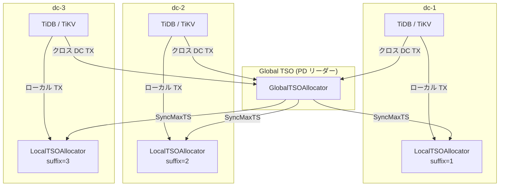
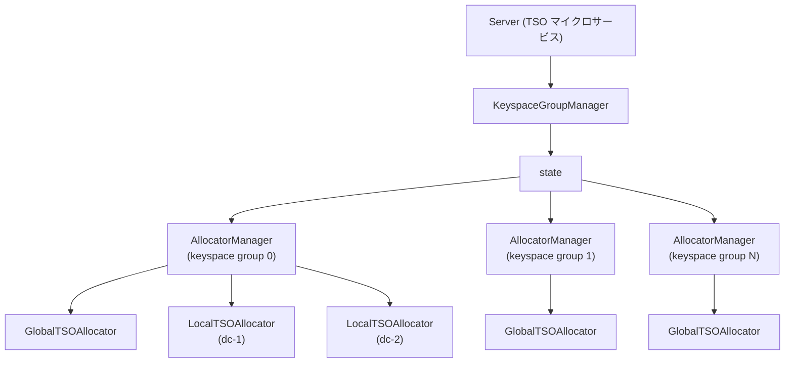

# 第6章 Local TSO とマイクロサービス化

> **本章で読むソース**
>
> - [`pkg/tso/local_allocator.go`](https://github.com/tikv/pd/blob/v8.5.6/pkg/tso/local_allocator.go)
> - [`pkg/tso/tso.go`](https://github.com/tikv/pd/blob/v8.5.6/pkg/tso/tso.go)
> - [`pkg/tso/global_allocator.go`](https://github.com/tikv/pd/blob/v8.5.6/pkg/tso/global_allocator.go)
> - [`pkg/tso/allocator_manager.go`](https://github.com/tikv/pd/blob/v8.5.6/pkg/tso/allocator_manager.go)
> - [`pkg/mcs/tso/server/server.go`](https://github.com/tikv/pd/blob/v8.5.6/pkg/mcs/tso/server/server.go)
> - [`pkg/tso/keyspace_group_manager.go`](https://github.com/tikv/pd/blob/v8.5.6/pkg/tso/keyspace_group_manager.go)

## この章の狙い

第4章では単一データセンター構成における TSO 採番の仕組みを読んだ。
本章では、マルチ DC 構成で DC ごとに TSO を発行する Local TSO の仕組みと、Global TSO との同期方式を読む。
さらに、PD から TSO 機能を独立プロセスとして切り出す TSO マイクロサービスの構造を追い、`KeyspaceGroupManager` がアロケータをどのように管理するかを確認する。

## 前提

[第4章](04-tso-and-global-allocator.md)で読んだ以下の知識を前提とする。

- TSO は上位46ビットの物理部と下位18ビットの論理部からなる64ビット整数である
- `timestampOracle` がメモリ上の物理部と論理部を管理し、`generateTSO` で論理カウンタを加算して採番する
- `GlobalTSOAllocator` は `Allocator` インタフェースを実装し、`AllocatorManager` が `dcLocation` に応じてアロケータを選択する

## Local TSO の目的

単一 DC 構成では、すべてのトランザクションが PD リーダーから Global TSO を取得する。
マルチ DC 構成でも同じ方式を使うと、遠距離の DC にいるクライアントは TSO 取得のたびに DC 間の往復遅延を負担する。

**Local TSO** は、この遅延を回避するための仕組みである。
DC 内で完結するトランザクション（ローカルトランザクション）に対して、その DC の PD ノードが TSO を発行する。
クライアントから見た TSO 取得のレイテンシは DC 内の RTT に収まる。
DC をまたぐトランザクションは従来どおり Global TSO を使う。

## LocalTSOAllocator の構造

**`LocalTSOAllocator`** は、DC ごとの TSO 採番を担う構造体である。

[`pkg/tso/local_allocator.go L40-L54`](https://github.com/tikv/pd/blob/v8.5.6/pkg/tso/local_allocator.go#L40-L54)

```go
type LocalTSOAllocator struct {
	allocatorManager *AllocatorManager
	// leadership is used to campaign the corresponding DC's Local TSO Allocator.
	leadership      *election.Leadership
	timestampOracle *timestampOracle
	// for election use, notice that the leadership that member holds is
	// the leadership for PD leader. Local TSO Allocator's leadership is for the
	// election of Local TSO Allocator leader among several PD servers and
	// Local TSO Allocator only use member's some etcd and pdpb.Member info.
	// So it's not conflicted.
	rootPath        string
	allocatorLeader atomic.Value // stored as *pdpb.Member
	// pre-initialized metrics
	tsoAllocatorRoleGauge prometheus.Gauge
}
```

`leadership` は PD リーダーのリーダーシップとは別のオブジェクトであり、コメントにあるとおり DC 単位のリーダー選出に使う。
同じ DC に複数の PD ノードがある場合、そのうち1台だけが「LocalTSOAllocator」のリーダーとなり、TSO を発行する。
`timestampOracle` は第4章で読んだものと同じ構造体であり、`suffix` フィールドで DC ごとの TSO の一意性を担保する。

`Initialize` は `suffix` を設定し、etcd からタイムスタンプを同期する。

[`pkg/tso/local_allocator.go L100-L105`](https://github.com/tikv/pd/blob/v8.5.6/pkg/tso/local_allocator.go#L100-L105)

```go
// Initialize will initialize the created local TSO allocator.
func (lta *LocalTSOAllocator) Initialize(suffix int) error {
	lta.tsoAllocatorRoleGauge.Set(1)
	lta.timestampOracle.suffix = suffix
	return lta.timestampOracle.SyncTimestamp()
}
```

「GlobalTSOAllocator」の `Initialize` は `suffix` を 0 に固定していた。
「LocalTSOAllocator」は DC ごとに異なる `suffix` を受け取り、論理部の下位ビットに埋め込む。

`GenerateTSO` はリーダーシップの検証後に `getTS` を呼ぶ。

[`pkg/tso/local_allocator.go L123-L133`](https://github.com/tikv/pd/blob/v8.5.6/pkg/tso/local_allocator.go#L123-L133)

```go
// GenerateTSO is used to generate a given number of TSOs.
// Make sure you have initialized the TSO allocator before calling.
func (lta *LocalTSOAllocator) GenerateTSO(ctx context.Context, count uint32) (pdpb.Timestamp, error) {
	defer trace.StartRegion(ctx, "LocalTSOAllocator.GenerateTSO").End()
	if !lta.leadership.Check() {
		lta.getMetrics().notLeaderEvent.Inc()
		return pdpb.Timestamp{}, errs.ErrGenerateTimestamp.FastGenByArgs(
			fmt.Sprintf("requested pd %s of %s allocator", errs.NotLeaderErr, lta.timestampOracle.dcLocation))
	}
	return lta.timestampOracle.getTS(ctx, lta.leadership, count, lta.allocatorManager.GetSuffixBits())
}
```

`getTS` の第4引数に `GetSuffixBits()` を渡している点が「GlobalTSOAllocator」との違いである。
「GlobalTSOAllocator」は 0 を渡すため、サフィックス加工が行われなかった。
「LocalTSOAllocator」は DC の suffix 情報を論理部に反映させる。

## suffix による TSO の一意化

各 DC の「LocalTSOAllocator」は独立に採番するため、異なる DC が同じ物理部と論理部を持つ TSO を発行する可能性がある。
**suffix** はこの衝突を防ぐための仕組みであり、論理部の下位ビットに DC 固有の値を埋め込む。

`calibrateLogical` がこの埋め込みを行う。

[`pkg/tso/tso.go L153-L168`](https://github.com/tikv/pd/blob/v8.5.6/pkg/tso/tso.go#L153-L168)

```go
// Because the Local TSO in each Local TSO Allocator is independent, so they are possible
// to be the same at sometimes, to avoid this case, we need to use the logical part of the
// Local TSO to do some differentiating work.
// For example, we have three DCs: dc-1, dc-2 and dc-3. The bits of suffix is defined by
// the const suffixBits. Then, for dc-2, the suffix may be 1 because it's persisted
// in etcd with the value of 1.
// Once we get a normal TSO like this (18 bits): xxxxxxxxxxxxxxxxxx. We will make the TSO's
// low bits of logical part from each DC looks like:
//
//	global: xxxxxxxxxx00000000
//	  dc-1: xxxxxxxxxx00000001
//	  dc-2: xxxxxxxxxx00000010
//	  dc-3: xxxxxxxxxx00000011
func (t *timestampOracle) calibrateLogical(rawLogical int64, suffixBits int) int64 {
	return rawLogical<<suffixBits + int64(t.suffix)
}
```

コメントの例のとおり、`rawLogical` を `suffixBits` だけ左シフトし、空いた下位ビットに `suffix` を加算する。
3つの DC がある場合、suffix は 1、2、3 となり、同じ `rawLogical` でも下位ビットが異なるため衝突しない。
Global TSO は suffix が 0 なので下位ビットがすべて 0 になる。

サフィックスのビット数は `MaxSuffixBits = 4` が上限である。

[`pkg/tso/tso.go L49`](https://github.com/tikv/pd/blob/v8.5.6/pkg/tso/tso.go#L49)

```go
MaxSuffixBits = 4
```

実際のビット数は DC の数に応じて動的に決まる。
`CalSuffixBits` は DC に割り当てた最大の suffix 値からビット数を算出する。

[`pkg/tso/allocator_manager.go L500-L503`](https://github.com/tikv/pd/blob/v8.5.6/pkg/tso/allocator_manager.go#L500-L503)

```go
// CalSuffixBits calculates the bits of suffix by the max suffix sign.
func CalSuffixBits(maxSuffix int32) int {
	// maxSuffix + 1 because we have the Global TSO holds 0 as the suffix sign
	return int(math.Ceil(math.Log2(float64(maxSuffix + 1))))
}
```

`GetSuffixBits` は `AllocatorManager` が保持する `maxSuffix` から `CalSuffixBits` を呼ぶ。

[`pkg/tso/allocator_manager.go L493-L497`](https://github.com/tikv/pd/blob/v8.5.6/pkg/tso/allocator_manager.go#L493-L497)

```go
func (am *AllocatorManager) GetSuffixBits() int {
	am.mu.RLock()
	defer am.mu.RUnlock()
	return CalSuffixBits(am.mu.maxSuffix)
}
```

各 DC の suffix 値は etcd に永続化される。
`getOrCreateLocalTSOSuffix` は etcd から既存の suffix マッピングを読み出し、対象 DC の suffix が未割り当てであれば `maxSuffix + 1` を新たに書き込む。

[`pkg/tso/allocator_manager.go L892-L930`](https://github.com/tikv/pd/blob/v8.5.6/pkg/tso/allocator_manager.go#L892-L930)

```go
func (am *AllocatorManager) getOrCreateLocalTSOSuffix(dcLocation string) (int32, error) {
	dcLocationSuffix, err := am.getDCLocationSuffixMapFromEtcd()
	if err != nil {
		return -1, nil
	}
	var maxSuffix int32
	for curDCLocation, suffix := range dcLocationSuffix {
		if curDCLocation == dcLocation {
			return suffix, nil
		}
		if suffix > maxSuffix {
			maxSuffix = suffix
		}
	}
	maxSuffix++
	localTSOSuffixKey := am.GetLocalTSOSuffixPath(dcLocation)
	localTSOSuffixValue := strconv.FormatInt(int64(maxSuffix), 10)
	txnResp, err := kv.NewSlowLogTxn(am.member.Client()).
		If(clientv3.Compare(clientv3.CreateRevision(localTSOSuffixKey), "=", 0)).
		Then(clientv3.OpPut(localTSOSuffixKey, localTSOSuffixValue)).
		Commit()
	// ... (中略) ...
	return maxSuffix, nil
}
```

etcd トランザクションの `If` 条件で `CreateRevision == 0`（キーが存在しない）を検証してから `Put` する。
複数の PD ノードが同時に suffix を割り当てようとしても、先にトランザクションが成功したノードだけが書き込める。

## AllocatorManager による Local TSO の管理

**`AllocatorManager`** は Global と Local の両方のアロケータを一元管理する。

[`pkg/tso/allocator_manager.go L150-L195`](https://github.com/tikv/pd/blob/v8.5.6/pkg/tso/allocator_manager.go#L150-L195)

```go
type AllocatorManager struct {
	mu struct {
		syncutil.RWMutex
		allocatorGroups    map[string]*allocatorGroup
		clusterDCLocations map[string]*DCLocationInfo
		maxSuffix int32
	}
	// ... (中略) ...
	kgID uint32
	member ElectionMember
	rootPath               string
	storage                endpoint.TSOStorage
	enableLocalTSO         bool
	// ... (中略) ...
}
```

`allocatorGroups` は `dcLocation` をキーとして「GlobalTSOAllocator」と各 DC の「LocalTSOAllocator」を保持する。
`clusterDCLocations` はクラスタ内の DC ロケーション情報を保持し、`maxSuffix` は割り当て済みの最大 suffix 値を記録する。
`enableLocalTSO` が `false` の場合、Local TSO の関連処理はスキップされる。

### DC ロケーションの登録

`SetLocalTSOConfig` は PD ノードの DC ロケーションを etcd に登録する。

[`pkg/tso/allocator_manager.go L346-L383`](https://github.com/tikv/pd/blob/v8.5.6/pkg/tso/allocator_manager.go#L346-L383)

```go
func (am *AllocatorManager) SetLocalTSOConfig(dcLocation string) error {
	serverName := am.member.Name()
	serverID := am.member.ID()
	if err := am.checkDCLocationUpperLimit(dcLocation); err != nil {
		// ... (中略) ...
		return err
	}
	// The key-value pair in etcd will be like: serverID -> dcLocation
	dcLocationKey := am.member.GetDCLocationPath(serverID)
	resp, err := kv.
		NewSlowLogTxn(am.member.Client()).
		Then(clientv3.OpPut(dcLocationKey, dcLocation)).
		Commit()
	// ... (中略) ...
}
```

etcd には `serverID -> dcLocation` のマッピングが保存される。
これにより、クラスタ内のどの PD ノードがどの DC に属するかを全ノードが共有できる。

**`DCLocationInfo`** は DC ロケーションに属するサーバ ID のリストと、その DC の suffix を保持する。

[`pkg/tso/allocator_manager.go L83-L88`](https://github.com/tikv/pd/blob/v8.5.6/pkg/tso/allocator_manager.go#L83-L88)

```go
type DCLocationInfo struct {
	ServerIDs []uint64
	Suffix    int32
}
```

### AllocatorDaemon

`AllocatorDaemon` は3つのティッカーを回すイベントループである。

[`pkg/tso/allocator_manager.go L705-L746`](https://github.com/tikv/pd/blob/v8.5.6/pkg/tso/allocator_manager.go#L705-L746)

```go
func (am *AllocatorManager) AllocatorDaemon(ctx context.Context) {
	log.Info("entering into allocator daemon", logutil.CondUint32("keyspace-group-id", am.kgID, am.kgID > 0))
	var patrolTicker = &time.Ticker{}
	if am.enableLocalTSO {
		patrolTicker = time.NewTicker(patrolStep)
		defer patrolTicker.Stop()
	}
	tsTicker := time.NewTicker(am.updatePhysicalInterval)
	// ... (中略) ...
	defer tsTicker.Stop()
	checkerTicker := time.NewTicker(PriorityCheck)
	defer checkerTicker.Stop()

	for {
		select {
		case <-patrolTicker.C:
			am.allocatorPatroller(ctx)
		case <-tsTicker.C:
			am.allocatorUpdater()
		case <-checkerTicker.C:
			go am.ClusterDCLocationChecker()
			if am.enableLocalTSO {
				go am.PriorityChecker()
			}
		case <-ctx.Done():
			log.Info("exit allocator daemon", logutil.CondUint32("keyspace-group-id", am.kgID, am.kgID > 0))
			return
		}
	}
}
```

`patrolTicker` は `enableLocalTSO` が `true` の場合だけ起動する。
`tsTicker` は物理クロックの定期更新（第4章で読んだ `allocatorUpdater`）を駆動する。
`checkerTicker` は DC ロケーション情報の更新と、Local TSO 有効時のプライオリティチェックを行う。

### allocatorPatroller

`allocatorPatroller` はクラスタの DC ロケーション情報と既存のアロケータを突き合わせ、過不足を検出する。

[`pkg/tso/allocator_manager.go L793-L816`](https://github.com/tikv/pd/blob/v8.5.6/pkg/tso/allocator_manager.go#L793-L816)

```go
func (am *AllocatorManager) allocatorPatroller(serverCtx context.Context) {
	dcLocations := am.GetClusterDCLocations()
	allocatorGroups := am.getAllocatorGroups(FilterDCLocation(GlobalDCLocation))
	for dcLocation := range dcLocations {
		if slice.NoneOf(allocatorGroups, func(i int) bool {
			return allocatorGroups[i].dcLocation == dcLocation
		}) {
			am.setUpLocalAllocator(serverCtx, dcLocation, election.NewLeadership(
				am.member.Client(),
				am.getAllocatorPath(dcLocation),
				fmt.Sprintf("%s local allocator leader election", dcLocation),
			))
		}
	}
	for _, ag := range allocatorGroups {
		if _, exist := dcLocations[ag.dcLocation]; !exist {
			am.deleteAllocatorGroup(ag.dcLocation)
		}
	}
}
```

前半のループは、DC ロケーション情報にあるがアロケータが存在しない DC に対して `setUpLocalAllocator` で新規作成する。
後半のループは、アロケータが存在するが DC ロケーション情報にない DC のアロケータを削除する。
DC の追加と削除に対して動的にアロケータの数を調整する仕組みである。

### allocatorUpdater

第4章でも読んだ `allocatorUpdater` は、初期化済みかつリーダーシップを持つアロケータの物理クロックを更新する。

[`pkg/tso/allocator_manager.go L749-L758`](https://github.com/tikv/pd/blob/v8.5.6/pkg/tso/allocator_manager.go#L749-L758)

```go
func (am *AllocatorManager) allocatorUpdater() {
	allocatorGroups := am.getAllocatorGroups(FilterUninitialized(), FilterUnavailableLeadership())
	for _, ag := range allocatorGroups {
		am.wg.Add(1)
		go am.updateAllocator(ag)
	}
	am.wg.Wait()
}
```

フィルタは Global と Local を区別しない。
初期化済みでリーダーシップを持つすべてのアロケータに対して、ゴルーチンで並行に更新を実行する。

### HandleRequest

`HandleRequest` は `dcLocation` に対応するアロケータを取得し、`GenerateTSO` を呼ぶ。

[`pkg/tso/allocator_manager.go L1117-L1129`](https://github.com/tikv/pd/blob/v8.5.6/pkg/tso/allocator_manager.go#L1117-L1129)

```go
func (am *AllocatorManager) HandleRequest(ctx context.Context, dcLocation string, count uint32) (pdpb.Timestamp, error) {
	defer trace.StartRegion(ctx, "AllocatorManager.HandleRequest").End()
	if len(dcLocation) == 0 {
		dcLocation = GlobalDCLocation
	}
	allocatorGroup, exist := am.getAllocatorGroup(dcLocation)
	if !exist {
		err := errs.ErrGetAllocator.FastGenByArgs(fmt.Sprintf("%s allocator not found, generate timestamp failed", dcLocation))
		return pdpb.Timestamp{}, err
	}

	return allocatorGroup.allocator.GenerateTSO(ctx, count)
}
```

`dcLocation` が空なら `GlobalDCLocation` を使い、値があればその DC の「LocalTSOAllocator」を使う。
`Allocator` インタフェースにより、呼び出し元は Global と Local を区別する必要がない。

## Global TSO と Local TSO の同期

各 DC の「LocalTSOAllocator」は独立に採番するため、DC 間で TSO の大小関係にずれが生じうる。
DC をまたぐトランザクションが正しい順序を得るには、Global TSO が全 DC の Local TSO より大きい値を返す必要がある。
「GlobalTSOAllocator」の `GenerateTSO` がこの同期を担う。

[`pkg/tso/global_allocator.go L220-L230`](https://github.com/tikv/pd/blob/v8.5.6/pkg/tso/global_allocator.go#L220-L230)

```go
// GenerateTSO is used to generate the given number of TSOs.
// Make sure you have initialized the TSO allocator before calling this method.
// Basically, there are two ways to generate a Global TSO:
//  1. The old way to generate a normal TSO from memory directly, which makes the TSO service node become single point.
//  2. The new way to generate a Global TSO by synchronizing with all other Local TSO Allocators.
//
// And for the new way, there are two different strategies:
//  1. Collect the max Local TSO from all Local TSO Allocator leaders and write it back to them as MaxTS.
//  2. Estimate a MaxTS and try to write it to all Local TSO Allocator leaders directly to reduce the RTT.
//     During the process, if the estimated MaxTS is not accurate, it will fallback to the collecting way.
func (gta *GlobalTSOAllocator) GenerateTSO(ctx context.Context, count uint32) (pdpb.Timestamp, error) {
```

コメントが述べるとおり、Local TSO が有効な場合に2つの戦略がある。

1. **collect 方式**：全 DC の Local TSO リーダーから現在の最大 TSO を収集し、それを MaxTS として全リーダーに書き戻す
2. **estimate 方式**：`syncRTT`（過去の同期 RTT）をもとに MaxTS を事前に推定し、全リーダーに直接書き込む。推定が外れた場合は collect 方式にフォールバックする

estimate 方式の推定ロジックが `estimateMaxTS` である。

[`pkg/tso/global_allocator.go L166-L182`](https://github.com/tikv/pd/blob/v8.5.6/pkg/tso/global_allocator.go#L166-L182)

```go
func (gta *GlobalTSOAllocator) estimateMaxTS(ctx context.Context, count uint32, suffixBits int) (*pdpb.Timestamp, bool, error) {
	physical, logical, lastUpdateTime := gta.timestampOracle.generateTSO(ctx, int64(count), 0)
	if physical == 0 {
		return &pdpb.Timestamp{}, false, errs.ErrGenerateTimestamp.FastGenByArgs("timestamp in memory isn't initialized")
	}
	estimatedMaxTSO := &pdpb.Timestamp{
		Physical: physical + time.Since(lastUpdateTime).Milliseconds() + 2*gta.getSyncRTT(),
		Logical:  logical,
	}
	if !gta.precheckLogical(estimatedMaxTSO, suffixBits) {
		return nil, true, nil
	}
	return estimatedMaxTSO, false, nil
}
```

`Physical` に現在時刻からの経過分と `syncRTT` の2倍を加算し、同期往復中に Local TSO が進む分を見越している。
`syncRTT` は前回の `SyncMaxTS` 呼び出しで計測した往復時間であり、`atomic.Value` に保存されている。

`SyncMaxTS` が全 DC の Local TSO リーダーへの gRPC 並行呼び出しを実行する。

[`pkg/tso/global_allocator.go L370-L380`](https://github.com/tikv/pd/blob/v8.5.6/pkg/tso/global_allocator.go#L370-L380)

```go
func (gta *GlobalTSOAllocator) SyncMaxTS(
	ctx context.Context,
	dcLocationMap map[string]DCLocationInfo,
	maxTSO *pdpb.Timestamp,
	skipCheck bool,
) error {
	defer trace.StartRegion(ctx, "GlobalTSOAllocator.SyncMaxTS").End()
	originalMaxTSO := *maxTSO
	for i := range syncMaxRetryCount {
		allocatorLeaders := make(map[string]*pdpb.Member)
```

リトライループ内で各 DC の Local TSO リーダーに MaxTS を送り、全リーダーの TSO がこの値以上になるよう書き換える。
失敗したリーダーがあればリトライし、最終的に全 DC の TSO が Global TSO 以下であることを保証する。



## TSO マイクロサービス

従来の PD はリーダー選出、TSO 発行、スケジューリングを1つのプロセスで担っていた。
**TSO マイクロサービス**は、TSO 発行の機能を PD から切り出して独立プロセスとして動かすアーキテクチャである。
TSO の負荷が高い環境では、TSO 専用のプロセスを水平にスケールさせることができる。

TSO マイクロサービスのエントリポイントが `Server` 構造体である。

[`pkg/mcs/tso/server/server.go L64-L87`](https://github.com/tikv/pd/blob/v8.5.6/pkg/mcs/tso/server/server.go#L64-L87)

```go
type Server struct {
	*server.BaseServer
	diagnosticspb.DiagnosticsServer

	isRunning int64

	serverLoopCtx    context.Context
	serverLoopCancel func()
	serverLoopWg     sync.WaitGroup

	cfg *Config

	service              *Service
	keyspaceGroupManager *tso.KeyspaceGroupManager

	tsoProtoFactory *tsoutil.TSOProtoFactory

	serviceID       *discovery.ServiceRegistryEntry
	serviceRegister *discovery.ServiceRegister
}
```

`keyspaceGroupManager` が TSO マイクロサービスの中核である。
`serviceRegister` はこのノードを etcd にサービスとして登録し、PD やクライアントから発見可能にする。

`startServer` で `KeyspaceGroupManager` を生成し、初期化する。

[`pkg/mcs/tso/server/server.go L351-L392`](https://github.com/tikv/pd/blob/v8.5.6/pkg/mcs/tso/server/server.go#L351-L392)

```go
func (s *Server) startServer() (err error) {
	// ... (中略) ...
	s.serverLoopCtx, s.serverLoopCancel = context.WithCancel(s.Context())
	legacySvcRootPath := keypath.LegacyRootPath()
	tsoSvcRootPath := keypath.TSOSvcRootPath()
	s.keyspaceGroupManager = tso.NewKeyspaceGroupManager(
		s.serverLoopCtx, s.serviceID, s.GetClient(), s.GetHTTPClient(),
		s.cfg.AdvertiseListenAddr, legacySvcRootPath, tsoSvcRootPath, s.cfg)
	if err := s.keyspaceGroupManager.Initialize(); err != nil {
		return err
	}
	// ... (中略) ...
}
```

`legacySvcRootPath` は従来の PD のルートパス、`tsoSvcRootPath` は TSO マイクロサービス固有のルートパスである。
両方のパスを渡すことで、従来の PD から TSO マイクロサービスへの移行期にも対応する。

## KeyspaceGroupManager

**`KeyspaceGroupManager`** は、複数の keyspace group にまたがるアロケータを管理する。
keyspace group は TiDB のマルチテナント機能のための区分であり、テナントごとに独立した TSO 空間を持つことができる。

内部状態を保持するのが `state` 構造体である。

[`pkg/tso/keyspace_group_manager.go L66-L89`](https://github.com/tikv/pd/blob/v8.5.6/pkg/tso/keyspace_group_manager.go#L66-L89)

```go
type state struct {
	syncutil.RWMutex
	ams [constant.MaxKeyspaceGroupCountInUse]*AllocatorManager
	kgs [constant.MaxKeyspaceGroupCountInUse]*endpoint.KeyspaceGroup
	keyspaceLookupTable map[uint32]uint32
	splittingGroups map[uint32]time.Time
	deletedGroups map[uint32]struct{}
	requestedGroups map[uint32]struct{}
}
```

`ams` と `kgs` は keyspace group ID をインデックスとする固定サイズ配列であり、上限は `MaxKeyspaceGroupCountInUse` で定まる。

[`pkg/mcs/utils/constant/constant.go L83`](https://github.com/tikv/pd/blob/v8.5.6/pkg/mcs/utils/constant/constant.go#L83)

```go
MaxKeyspaceGroupCountInUse = uint32(4096)
```

`keyspaceLookupTable` は keyspace ID から keyspace group ID への逆引きテーブルである。

`Initialize` は etcd の watch ループを起動し、バックグラウンドのゴルーチンを3つ開始する。

[`pkg/tso/keyspace_group_manager.go L440-L458`](https://github.com/tikv/pd/blob/v8.5.6/pkg/tso/keyspace_group_manager.go#L440-L458)

```go
func (kgm *KeyspaceGroupManager) Initialize() error {
	if err := kgm.InitializeTSOServerWatchLoop(); err != nil {
		log.Error("failed to initialize tso server watch loop", zap.Error(err))
		kgm.Close()
		return errs.ErrLoadKeyspaceGroupsTerminated.Wrap(err)
	}
	if err := kgm.InitializeGroupWatchLoop(); err != nil {
		log.Error("failed to initialize group watch loop", zap.Error(err))
		kgm.Close()
		return errs.ErrLoadKeyspaceGroupsTerminated.Wrap(err)
	}

	kgm.wg.Add(3)
	go kgm.primaryPriorityCheckLoop()
	go kgm.groupSplitPatroller()
	go kgm.deletedGroupCleaner()

	return nil
}
```

`InitializeTSOServerWatchLoop` は TSO サーバノードの追加と削除を監視する。
`InitializeGroupWatchLoop` は keyspace group の変更を監視し、`updateKeyspaceGroup` で `state` を更新する。
`updateKeyspaceGroup` は etcd のイベントを受け取り、keyspace group の作成、更新、分割に応じて `AllocatorManager` を生成または再構成する。

TSO リクエストの処理は `HandleTSORequest` が担う。

[`pkg/tso/keyspace_group_manager.go L1072-L1109`](https://github.com/tikv/pd/blob/v8.5.6/pkg/tso/keyspace_group_manager.go#L1072-L1109)

```go
func (kgm *KeyspaceGroupManager) HandleTSORequest(
	ctx context.Context,
	keyspaceID, keyspaceGroupID uint32,
	dcLocation string, count uint32,
) (ts pdpb.Timestamp, curKeyspaceGroupID uint32, err error) {
	// ... (中略) ...
	am, _, curKeyspaceGroupID, err := kgm.getKeyspaceGroupMetaWithCheck(keyspaceID, keyspaceGroupID)
	// ... (中略) ...
	ts, err = am.HandleRequest(ctx, dcLocation, count)
	return ts, curKeyspaceGroupID, err
}
```

`getKeyspaceGroupMetaWithCheck` が keyspace ID と keyspace group ID から適切な `AllocatorManager` を取得する。
以降は `AllocatorManager.HandleRequest` がアロケータを選んで採番する流れであり、第4章で読んだ経路と同じである。



## 最適化の工夫

### estimateMaxTS による gRPC 往復の削減

Global TSO の発行時に全 DC の Local TSO リーダーと同期する必要があるが、collect 方式では2往復の gRPC 通信が発生する（収集と書き戻し）。
estimate 方式は、前回の同期で計測した `syncRTT` を `atomic.Value` に保存しておき、次回の MaxTS を事前に推定する。
推定値は `physical + 経過時間 + 2 * syncRTT` で算出し、同期往復中に Local TSO が進む分を見越す。
推定が成功すれば書き戻しの1往復だけで済み、gRPC の往復回数が半減する。
推定が外れた場合は collect 方式にフォールバックするため、TSO の正しさは損なわない。

### state の固定サイズ配列によるロック粒度の最小化

`KeyspaceGroupManager` の `state` は keyspace group ごとの `AllocatorManager` を `[4096]*AllocatorManager` の固定サイズ配列で保持する。
マップではなく固定長配列を使うことで、keyspace group ID をそのままインデックスとして `O(1)` でアクセスできる。
`HandleTSORequest` が特定の keyspace group のアロケータを取得する際、`state` 全体の排他ロックを長時間保持する必要がない。
配列のインデックスアクセスは原子的なポインタ読み取りに近く、並行リクエスト間のロック競合を抑える。

## まとめ

Local TSO は DC ごとに TSO を発行し、ローカルトランザクションの TSO 取得レイテンシを DC 内 RTT に抑える仕組みである。
`LocalTSOAllocator` は `timestampOracle` の `suffix` フィールドを使い、論理部の下位ビットに DC 固有の値を埋め込んで DC 間の TSO 衝突を防ぐ。

`AllocatorManager` は `AllocatorDaemon` のイベントループで DC ロケーションの変化を監視し、「LocalTSOAllocator」を動的に追加または削除する。
「GlobalTSOAllocator」は `SyncMaxTS` で全 DC の Local TSO リーダーと同期し、Global TSO が常に全 Local TSO より大きい値を返すことを保証する。

TSO マイクロサービスは TSO 発行を独立プロセスに切り出すアーキテクチャであり、`KeyspaceGroupManager` が keyspace group ごとの `AllocatorManager` を管理する。
`state` の固定サイズ配列と etcd の watch ループにより、マルチテナント環境での TSO 要求を効率的に処理する。

## 関連する章

- [TSO の仕組みと GlobalAllocator](04-tso-and-global-allocator.md)：`timestampOracle` と「GlobalTSOAllocator」の構造、TSO 採番の呼び出し経路を読む。
- [タイムスタンプの永続化と安全性](05-tso-persistence.md)：`SyncTimestamp` による etcd への永続化とリーダー切り替え時の安全性を読む。
- [マイクロサービスアーキテクチャ](../part05-ha-ops/21-microservice.md)：PD のマイクロサービス化の全体像を読む。
