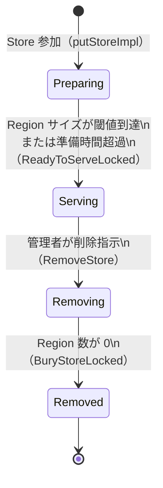

# 第7章 Store の管理とストアハートビート

> **本章で読むソース**
>
> - [`pkg/core/store.go`](https://github.com/tikv/pd/blob/v8.5.6/pkg/core/store.go)
> - [`pkg/core/store_stats.go`](https://github.com/tikv/pd/blob/v8.5.6/pkg/core/store_stats.go)
> - [`pkg/core/store_option.go`](https://github.com/tikv/pd/blob/v8.5.6/pkg/core/store_option.go)
> - [`server/grpc_service.go`](https://github.com/tikv/pd/blob/v8.5.6/server/grpc_service.go)
> - [`server/cluster/cluster.go`](https://github.com/tikv/pd/blob/v8.5.6/server/cluster/cluster.go)

## この章の狙い

PD が個々の TiKV ノード（Store）をどのデータ構造で表現し、ハートビートを通じてどのように状態を管理するかを読む。
Store の状態遷移（Preparing から Serving、Removing、Removed まで）を追い、ラベルによる配置制御の仕組みを確認する。
最適化の工夫として、空き容量の HMA（Hull Moving Average）による平滑化と、etcd 書き込みの間引きを機構レベルで説明する。

## 前提

[第1章](../part00-overview/01-what-is-pd.md)で述べたとおり、PD は TiDB エコシステムのクラスタマネージャであり、各 TiKV ノードからハートビートを受けてメタデータを集約する。
TiKV の各ノードは PD の用語で Store と呼ばれ、一意の Store ID を持つ。
本章のコード引用はすべて tikv/pd のタグ `v8.5.6` に固定する。

## StoreInfo と storeStats

PD が1台の Store を表現する中心的な構造体が **`StoreInfo`** である。

[`pkg/core/store.go` L54-L75](https://github.com/tikv/pd/blob/v8.5.6/pkg/core/store.go#L54-L75)

```go
type StoreInfo struct {
	meta *metapb.Store
	*storeStats
	pauseLeaderTransfer  bool         // not allow to be used as source or target of transfer leader
	slowStoreEvicted     atomic.Int64 // this store has been evicted as a slow store, should not transfer leader to it
	slowTrendEvicted     atomic.Int64 // this store has been evicted as a slow store by trend, should not transfer leader to it
	stoppingStoreEvicted bool         // this store has been evicted as a stopping store, should not transfer leader to it
	leaderCount          int
	regionCount          int
	learnerCount         int
	witnessCount         int
	leaderSize           int64
	regionSize           int64
	pendingPeerCount     int
	lastPersistTime      time.Time
	leaderWeight         float64
	regionWeight         float64
	limiter              storelimit.StoreLimit
	minResolvedTS        uint64
	lastAwakenTime       time.Time
	networkSlowTriggers  uint64
}
```

`meta` フィールドは protobuf で定義された Store のメタデータ（ID、アドレス、状態、ラベルなど）を保持する。
`leaderCount` や `regionCount` はハートビートから集計されたカウンタであり、スケジューラが負荷を比較するときに参照する。
`pauseLeaderTransfer` や `slowStoreEvicted` はリーダー移動の制御フラグで、低速 Store からリーダーを移動させないようにする。

`StoreInfo` は **`storeStats`** を埋め込んでおり、統計情報の管理を分離している。

[`pkg/core/store_stats.go` L24-L30](https://github.com/tikv/pd/blob/v8.5.6/pkg/core/store_stats.go#L24-L30)

```go
type storeStats struct {
	mu       syncutil.RWMutex
	rawStats *pdpb.StoreStats

	// avgAvailable is used to make available smooth, aka no sudden changes.
	avgAvailable *movingaverage.HMA
}
```

`rawStats` はハートビートで受け取った生の統計情報をそのまま保持する。
`avgAvailable` は空きディスク容量を平滑化するための移動平均であり、瞬間的な変動がスケジューリングに影響することを防ぐ。
この平滑化の仕組みは後の節で詳しく読む。

## StoresInfo による全 Store の管理

クラスタ内のすべての Store は **`StoresInfo`** が一括して保持する。

[`pkg/core/store.go` L723-L726](https://github.com/tikv/pd/blob/v8.5.6/pkg/core/store.go#L723-L726)

```go
type StoresInfo struct {
	syncutil.RWMutex
	stores map[uint64]*StoreInfo
}
```

Store ID をキーとする map で全 Store を管理する。
`syncutil.RWMutex` の埋め込みにより、読み取りは `RLock`、書き込みは `Lock` で保護される。
`RaftCluster` がこの「StoresInfo」を保持しており、ハートビートの受信や Store の追加のたびに map を更新する。

## Store の状態遷移

### NodeState の4状態

Store は protobuf の `NodeState` として4つの状態を持つ。
PD は旧来の `StoreState`（Up、Offline、Tombstone）を `NodeState` へ変換して管理する。
この対応関係は `SetStoreState` に定義されている。

[`pkg/core/store_option.go` L78-L99](https://github.com/tikv/pd/blob/v8.5.6/pkg/core/store_option.go#L78-L99)

```go
func SetStoreState(state metapb.StoreState, physicallyDestroyed ...bool) StoreCreateOption {
	return func(store *StoreInfo) {
		meta := typeutil.DeepClone(store.meta, StoreFactory)
		switch state {
		case metapb.StoreState_Up:
			meta.State = metapb.StoreState_Up
			meta.NodeState = metapb.NodeState_Serving
		case metapb.StoreState_Offline:
			// ... (中略) ...
			meta.State = metapb.StoreState_Offline
			meta.NodeState = metapb.NodeState_Removing
			// ... (中略) ...
		case metapb.StoreState_Tombstone:
			meta.State = metapb.StoreState_Tombstone
			meta.NodeState = metapb.NodeState_Removed
		}
		store.meta = meta
	}
}
```

`StoreState_Up` は `NodeState_Serving` に対応し、`StoreState_Offline` は `NodeState_Removing` に対応する。
`StoreState_Tombstone` は `NodeState_Removed` に対応し、Store が完全に撤去されたことを示す。
`NodeState_Preparing` は新しい Store が参加した直後の初期状態であり、Region データが十分に移行されるまで「Serving」に昇格しない。

以下の図に状態遷移をまとめる。



### ハートビートタイムアウトによる状態検知

NodeState の遷移とは別に、PD はハートビートの途絶時間に基づいて Store の可用性を判定する。

[`pkg/core/store.go` L625-L629](https://github.com/tikv/pd/blob/v8.5.6/pkg/core/store.go#L625-L629)

```go
	storeDisconnectDuration = 20 * time.Second
	storeUnhealthyDuration  = 10 * time.Minute
```

[`pkg/core/store.go` L635-L642](https://github.com/tikv/pd/blob/v8.5.6/pkg/core/store.go#L635-L642)

```go
func (s *StoreInfo) IsDisconnected() bool {
	return s.DownTime() > storeDisconnectDuration
}

func (s *StoreInfo) IsUnhealthy() bool {
	return s.DownTime() > storeUnhealthyDuration
}
```

最後のハートビートから20秒を超えると「Disconnected」、10分を超えると「Unhealthy」と判定される。
「Disconnected」の段階ではまだ一時的なネットワーク障害の可能性があるため、スケジューラはこの Store への新たなリーダー移動を控える程度にとどまる。
「Unhealthy」になると PD はこの Store 上の Region レプリカを他の Store に移す Operator の生成を開始する。
この判定は NodeState とは独立した仕組みであり、Store が Serving のまま Disconnected や Unhealthy になりうる。

## 状態遷移メソッド

### PutMetaStore（Store 登録）

新しい Store が PD に参加するとき、gRPC の `PutStore` 呼び出しを経て `PutMetaStore` が実行される。

[`server/cluster/cluster.go` L1413-L1420](https://github.com/tikv/pd/blob/v8.5.6/server/cluster/cluster.go#L1413-L1420)

`PutMetaStore` は内部で `putStoreImpl` を呼ぶ。
`putStoreImpl` はラベルの検証（`checkStoreLabels`）を行い、新規 Store であれば NodeState を Preparing に設定して map に追加する。

[`server/cluster/cluster.go` L1425-L1469](https://github.com/tikv/pd/blob/v8.5.6/server/cluster/cluster.go#L1425-L1469)

既存の Store が再登録された場合、`putStoreImpl` はアドレスの重複やバージョンの互換性を検査し、メタデータを更新する。

### RemoveStore（削除指示）

管理者が `pd-ctl` などで Store の削除を指示すると `RemoveStore` が呼ばれる。

[`server/cluster/cluster.go` L1515-L1561](https://github.com/tikv/pd/blob/v8.5.6/server/cluster/cluster.go#L1515-L1561)

```go
func (c *RaftCluster) RemoveStore(storeID uint64, physicallyDestroyed bool) error {
	// ... (中略) ...
	if err := c.setStore(
		store.Clone(core.SetStoreState(metapb.StoreState_Offline, physicallyDestroyed)),
		core.SetStoreState(metapb.StoreState_Offline, physicallyDestroyed),
	); err != nil {
		return err
	}
	// ... (中略) ...
	_ = c.SetStoreLimit(storeID, storelimit.RemovePeer, storelimit.Unlimited)
	return nil
}
```

`RemoveStore` は Store の状態を Offline（NodeState では Removing）に変更する。
同時に `RemovePeer` のレート制限を Unlimited に設定し、この Store からの Region 移動を制限なく実行できるようにする。
`physicallyDestroyed` が true の場合はディスク障害などでデータが失われたことを意味し、PD はレプリカの移動ではなく即座の再配置を行う。

### BuryStoreLocked（Tombstone への遷移）

Removing 状態の Store から全 Region が退避し終わると、`BuryStoreLocked` が Store を Tombstone（Removed）に遷移させる。

[`server/cluster/cluster.go` L1619-L1661](https://github.com/tikv/pd/blob/v8.5.6/server/cluster/cluster.go#L1619-L1661)

```go
func (c *RaftCluster) BuryStoreLocked(storeID uint64, forceBury bool) error {
	// ... (中略) ...
	err := c.setStore(
		store.Clone(core.SetStoreState(metapb.StoreState_Tombstone)),
		core.SetStoreState(metapb.StoreState_Tombstone),
	)
	// ... (中略) ...
}
```

`forceBury` が true の場合は Region の残存に関係なく強制的に Tombstone へ遷移させる。
通常の運用では `checkStore` が Region 数の減少を確認してから自動的に `BuryStoreLocked` を呼ぶ。

### UpStore と ReadyToServeLocked

`UpStore` は Tombstone や Offline になった Store を再び Up（Serving）に戻すメソッドであり、Store の再参加に使う。

[`server/cluster/cluster.go` L1693-L1736](https://github.com/tikv/pd/blob/v8.5.6/server/cluster/cluster.go#L1693-L1736)

`ReadyToServeLocked` は Preparing 状態の Store を Serving に昇格させる。

[`server/cluster/cluster.go` L1739-L1752](https://github.com/tikv/pd/blob/v8.5.6/server/cluster/cluster.go#L1739-L1752)

### checkStores と checkStore（定期巡回）

PD はバックグラウンドで定期的に `checkStores` を呼び、全 Store の状態を巡回する。

[`server/cluster/cluster.go` L1812-L1838](https://github.com/tikv/pd/blob/v8.5.6/server/cluster/cluster.go#L1812-L1838)

`checkStores` は全 Store に対して `checkStore` を呼ぶ。
`checkStore` は2種類の状態遷移を判定する。

1つ目は Preparing から Serving への遷移である。

[`server/cluster/cluster.go` L1866-L1891](https://github.com/tikv/pd/blob/v8.5.6/server/cluster/cluster.go#L1866-L1891)

```go
	if store.IsPreparing() {
		if store.GetUptime() >= c.opt.GetMaxStorePreparingTime() || c.GetTotalRegionCount() < core.InitClusterRegionThreshold {
			if err := c.ReadyToServeLocked(storeID); err != nil {
				// ... (中略) ...
			}
		} else if c.IsPrepared() || (c.IsServiceIndependent(constant.SchedulingServiceName) && c.isStorePrepared()) {
			threshold := c.getThreshold(c.GetStores(), store)
			regionSize := float64(store.GetRegionSize())
			// ... (中略) ...
			if regionSize >= threshold {
				if err := c.ReadyToServeLocked(storeID); err != nil {
					// ... (中略) ...
				}
			}
		}
	}
```

Preparing の Store は、準備時間の上限を超えた場合、またはクラスタの初期段階で Region 数が少ない場合に無条件で Serving に昇格する。
それ以外の場合は、Store の Region サイズがクラスタ平均から算出した閾値に達したかどうかで判定する。
この段階的な昇格により、データが十分に移行される前にスケジューラが新 Store をフル稼働の対象にすることを防ぐ。

2つ目は Removing から Removed への遷移である。

[`server/cluster/cluster.go` L1900-L1919](https://github.com/tikv/pd/blob/v8.5.6/server/cluster/cluster.go#L1900-L1919)

```go
	regionSize := c.GetStoreRegionSize(storeID)
	// ... (中略) ...
	needBury := c.GetStoreRegionCount(storeID) == 0
	// ... (中略) ...
	if needBury {
		if err := c.BuryStoreLocked(storeID, false); err != nil {
			// ... (中略) ...
		}
	}
```

Removing 状態の Store 上の Region 数が0になると、`BuryStoreLocked` を呼んで Tombstone に遷移させる。

## ストアハートビートの処理経路

TiKV の各 Store は定期的に（デフォルト10秒間隔で）ストアハートビートを PD に送信する。
ハートビートはディスク使用量、Region 数、リーダー数などの統計を運ぶ。

### gRPC エントリポイント

ハートビートの gRPC エントリポイントは `GrpcServer.StoreHeartbeat` である。

[`server/grpc_service.go` L953-L1044](https://github.com/tikv/pd/blob/v8.5.6/server/grpc_service.go#L953-L1044)

```go
func (s *GrpcServer) StoreHeartbeat(ctx context.Context, request *pdpb.StoreHeartbeatRequest) (*pdpb.StoreHeartbeatResponse, error) {
```

このメソッドは次の手順で処理を進める。

まずレート制限を確認し、統計が nil でないかを検証する。
次に Store が Tombstone でないことを確認する。
Tombstone の Store がハートビートを送ってきた場合はエラーを返し、TiKV 側にシャットダウンを促す。
検証を通過すると `RaftCluster.HandleStoreHeartbeat` に処理を委譲する。
応答にはレプリケーション状態、クラスタバージョン、安全でないリカバリの情報を付与して返す。

### HandleStoreHeartbeat

`HandleStoreHeartbeat` はハートビートの統計を `StoreInfo` に反映する中核メソッドである。

[`server/cluster/cluster.go` L1049](https://github.com/tikv/pd/blob/v8.5.6/server/cluster/cluster.go#L1049)

```go
func (c *RaftCluster) HandleStoreHeartbeat(heartbeat *pdpb.StoreHeartbeatRequest, resp *pdpb.StoreHeartbeatResponse) error {
```

[`server/cluster/cluster.go` L1082-L1102](https://github.com/tikv/pd/blob/v8.5.6/server/cluster/cluster.go#L1082-L1102)

```go
	opts = append(opts, core.SetStoreStats(stats), core.SetLastHeartbeatTS(nowTime))
	newStore := store.Clone(opts...)

	if newStore.IsLowSpace(c.opt.GetLowSpaceRatio()) {
		log.Warn("store does not have enough disk space",
			// ... (中略) ...
	}
	if newStore.NeedPersist() && c.storage != nil {
		if err := c.storage.SaveStoreMeta(newStore.GetMeta()); err != nil {
			log.Error("failed to persist store", zap.Uint64("store-id", storeID), errs.ZapError(err))
		} else {
			opts = append(opts, core.SetLastPersistTime(nowTime))
		}
	}
	// Supply NodeState in the response to help the store handle special cases
	// more conveniently, such as avoiding calling `remove_peer` redundantly under
	// NodeState_Removing.
	resp.State = store.GetNodeState()
	c.PutStore(newStore, opts...)
```

処理の流れは次のとおりである。

ハートビートから受け取った統計とタイムスタンプを `StoreCreateOption` として組み立て、`store.Clone` で新しい `StoreInfo` を生成する。
`StoreInfo` は不変（immutable）であり、更新は常に Clone で新しいインスタンスを作る方式を取る。
ディスク空き容量が閾値を下回っていれば警告ログを出力する。
`NeedPersist` が true であれば etcd にメタデータを永続化する（この間引きの仕組みは後の節で読む）。
応答に現在の NodeState を載せ、TiKV 側が Removing 状態を認識して不要なピア削除要求を出さないようにする。
最後に `PutStore` で map 内の `StoreInfo` を新しいインスタンスに差し替える。

## ラベルによる配置制御

TiKV の各 Store にはキーバリュー形式の**ラベル**を付与できる。
典型的にはデータセンター、ラック、ホストの階層を `zone`、`rack`、`host` といったキーで表す。
PD はこのラベル階層に基づいて、Region のレプリカを異なる障害ドメインに分散させる。

### checkStoreLabels

Store の登録時に `checkStoreLabels` がラベルの整合性を検証する。

[`server/cluster/cluster.go` L1483-L1511](https://github.com/tikv/pd/blob/v8.5.6/server/cluster/cluster.go#L1483-L1511)

```go
func (c *RaftCluster) checkStoreLabels(s *core.StoreInfo) error {
	keysSet := make(map[string]struct{})
	for _, k := range c.opt.GetLocationLabels() {
		keysSet[k] = struct{}{}
		if v := s.GetLabelValue(k); len(v) == 0 {
			log.Warn("label configuration is incorrect",
				// ... (中略) ...
			if c.opt.GetStrictlyMatchLabel() {
				return errors.Errorf("label configuration is incorrect, need to specify the key: %s ", k)
			}
		}
	}
	// ... (中略) ...
}
```

PD の設定で指定された `location-labels`（たとえば `["zone", "rack", "host"]`）の各キーについて、Store がそのラベルを持っているかを確認する。
`strictly-match-label` が有効な場合、ラベルが欠けている Store の登録はエラーとして拒否する。
無効な場合は警告ログを出すだけで登録を許可する。

### CompareLocation と DistinctScore

スケジューラが2つの Store の位置関係を評価するとき、`CompareLocation` と `DistinctScore` を使う。

[`pkg/core/store.go` L656-L666](https://github.com/tikv/pd/blob/v8.5.6/pkg/core/store.go#L656-L666)

`CompareLocation` は `location-labels` の上位（zone など）から順に2つの Store のラベル値を比較し、最初に異なるラベルの階層を返す。
たとえば zone が異なれば0を、zone は同じだが rack が異なれば1を返す。
すべてのラベルが一致すれば -1 を返す。

[`pkg/core/store.go` L672-L683](https://github.com/tikv/pd/blob/v8.5.6/pkg/core/store.go#L672-L683)

`DistinctScore` は、ある Store が既存のレプリカ配置に対してどれだけ距離があるかをスコア化する。
上位のラベルで異なるほど高いスコアを得るため、スケジューラは障害ドメインの分散度が最大になる Store を選択できる。

## 最適化の工夫: HMA による空き容量の平滑化と etcd 書き込みの間引き

### HMA（Hull Moving Average）による平滑化

ストアハートビートで報告される空きディスク容量は、圧縮処理やデータの一括削除などで瞬間的に大きく変動しうる。
この変動にスケジューラが即座に反応すると、Region の移動が頻繁に発生してクラスタが不安定になる。
PD はこの問題を HMA（Hull Moving Average）で平滑化することで解決している。

`storeStats` の初期化時に、ウィンドウサイズ60の HMA が生成される。

[`pkg/core/store_stats.go` L32-L37](https://github.com/tikv/pd/blob/v8.5.6/pkg/core/store_stats.go#L32-L37)

```go
func newStoreStats() *storeStats {
	return &storeStats{
		rawStats:     &pdpb.StoreStats{},
		avgAvailable: movingaverage.NewHMA(60), // take 10 minutes sample under 10s heartbeat rate
	}
}
```

ハートビート間隔が10秒の場合、ウィンドウサイズ60は直近10分間のサンプルに相当する。

ハートビートを受信するたびに `updateRawStats` が呼ばれ、空き容量を HMA に投入する。

[`pkg/core/store_stats.go` L39-L48](https://github.com/tikv/pd/blob/v8.5.6/pkg/core/store_stats.go#L39-L48)

```go
func (ss *storeStats) updateRawStats(rawStats *pdpb.StoreStats) {
	ss.mu.Lock()
	defer ss.mu.Unlock()
	ss.rawStats = rawStats

	if ss.avgAvailable == nil {
		return
	}
	ss.avgAvailable.Add(float64(rawStats.GetAvailable()))
}
```

スケジューラが空き容量を参照するときは、生の値ではなく `GetAvgAvailable` を通して平滑化された値を取得する。

[`pkg/core/store_stats.go` L136-L143](https://github.com/tikv/pd/blob/v8.5.6/pkg/core/store_stats.go#L136-L143)

```go
func (ss *storeStats) GetAvgAvailable() uint64 {
	ss.mu.RLock()
	defer ss.mu.RUnlock()
	if ss.avgAvailable == nil {
		return ss.rawStats.Available
	}
	return climp0(ss.avgAvailable.Get())
}
```

HMA は単純移動平均（SMA）よりも遅延が小さく、変動の平滑化と応答速度のバランスに優れる。
`climp0` は負の値を0にクランプする関数であり、平滑化の結果が負にならないことを保証する。
この仕組みにより、一時的なディスク容量の変動がスケジューリング判断に波及することを抑えている。

### etcd 書き込みの間引き

ハートビートはデフォルトで10秒ごとに到着するが、そのたびに etcd へメタデータを書き込むと etcd への負荷が過大になる。
PD は `NeedPersist` による間引きでこの問題を回避している。

[`pkg/core/store.go` L37-L39](https://github.com/tikv/pd/blob/v8.5.6/pkg/core/store.go#L37-L39)

```go
const (
	// Interval to save store meta (including heartbeat ts) to etcd.
	storePersistInterval = 5 * time.Minute
```

[`pkg/core/store.go` L397-L399](https://github.com/tikv/pd/blob/v8.5.6/pkg/core/store.go#L397-L399)

```go
func (s *StoreInfo) NeedPersist() bool {
	return s.GetLastHeartbeatTS().Sub(s.lastPersistTime) > storePersistInterval
}
```

最後に etcd へ永続化した時刻と現在のハートビートの時刻の差が5分を超えた場合にのみ `NeedPersist` は true を返す。
10秒間隔のハートビートのうち、実際に etcd へ書き込むのは約30回に1回である。
メモリ上の `StoreInfo` は毎回更新されるため、直近の統計は常にスケジューラから参照できる。
PD が再起動した場合は、etcd に永続化された最後の状態から復元し、その後のハートビートで最新状態に追いつく。

## まとめ

PD は `StoreInfo` と埋め込みの `storeStats` で各 Store のメタデータと統計を管理し、`StoresInfo` の map でクラスタ全体を保持する。
Store は Preparing、Serving、Removing、Removed の4状態を遷移し、`checkStore` の定期巡回と管理者の明示的な操作が遷移を駆動する。
空き容量の HMA 平滑化が瞬間的な変動によるスケジューリングの振動を抑え、etcd 書き込みの5分間隔の間引きがメタデータストアへの負荷を軽減する。

## 関連する章

- [第1章 PD とは何か](../part00-overview/01-what-is-pd.md): PD の全体像と3つの柱
- [第3章 TiDB、TiKV との関係](../part00-overview/03-relationship-with-tidb-tikv.md): Store が PD に登録されるまでの流れ
