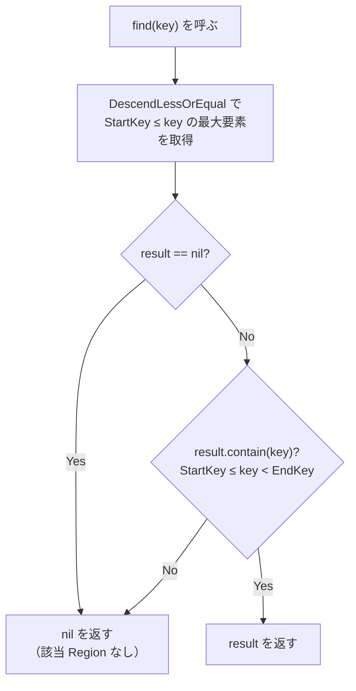
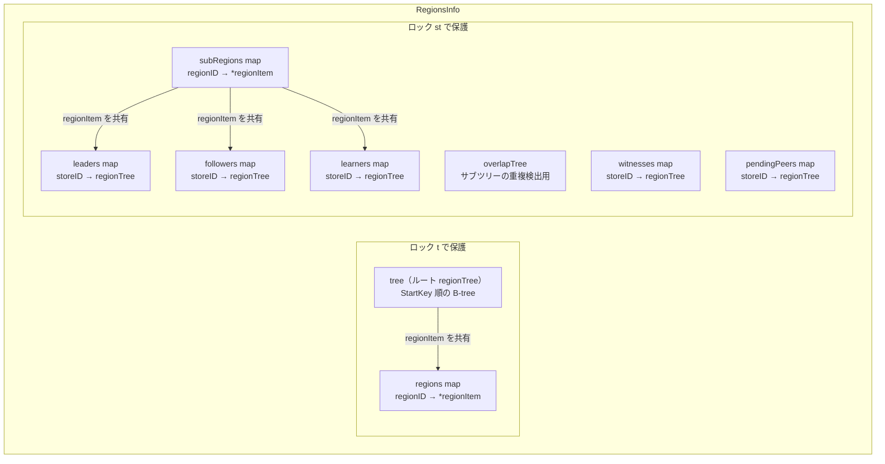

# 第8章 Region メタデータと RegionTree

> **本章で読むソース**
>
> - [`pkg/core/region.go`](https://github.com/tikv/pd/blob/v8.5.6/pkg/core/region.go)
> - [`pkg/core/region_tree.go`](https://github.com/tikv/pd/blob/v8.5.6/pkg/core/region_tree.go)
> - [`pkg/core/basic_cluster.go`](https://github.com/tikv/pd/blob/v8.5.6/pkg/core/basic_cluster.go)

## この章の狙い

PD はクラスタ内のすべての Region のメタデータをメモリ上に保持し、キー検索、範囲走査、Store 単位の統計集計をこのデータ構造の上で行う。
本章では、Region 1つを表す `RegionInfo`、キー範囲で Region を索引する `regionTree`、全 Region を管理するコンテナ `RegionsInfo` の3層を順に読み、PD がハートビートで受け取った Region 情報をどう格納し検索するかを確定させる。

## 前提

第1章で述べたとおり、TiKV はキー空間を **Region** という連続したキー範囲の単位に分割し、各 Region を複数の **Store** に複製する。
TiKV の各 Store は定期的に**ハートビート**を PD に送り、PD はそれを受けてメモリ上のメタデータを更新する。
本章のコード引用はすべて tikv/pd のタグ `v8.5.6` に固定する。

## RegionInfo：Region 1つのメタデータ

**`RegionInfo`** は Region 1つのメタデータを保持する構造体である。

[`pkg/core/region.go L62-89`](https://github.com/tikv/pd/blob/v8.5.6/pkg/core/region.go#L62-L89)

```go
type RegionInfo struct {
	meta              *metapb.Region
	learners          []*metapb.Peer
	witnesses         []*metapb.Peer
	voters            []*metapb.Peer
	leader            *metapb.Peer
	downPeers         []*pdpb.PeerStats
	pendingPeers      []*metapb.Peer
	term              uint64
	cpuUsage          uint64
	writtenBytes      uint64
	writtenKeys       uint64
	readBytes         uint64
	readKeys          uint64
	approximateSize   int64
	approximateKvSize int64
	approximateKeys   int64
	interval          *pdpb.TimeInterval
	replicationStatus *replication_modepb.RegionReplicationStatus
	queryStats        *pdpb.QueryStats
	flowRoundDivisor  uint64
	// ... (中略) ...
	source RegionSource
	ref atomic.Int32
}
```

フィールドは大きく4種に分かれる。

- **meta**：protobuf の `metapb.Region` であり、Region ID、StartKey、EndKey、RegionEpoch、Peers を保持する。
- **ピアの分類**：`voters`、`learners`、`witnesses` の3スライスに分類して保持する。`leader` はリーダーピアへのポインタである。`downPeers`（障害ピア）と `pendingPeers`（適用中ピア）も記録する。
- **I/O 統計**：`writtenBytes`、`writtenKeys`、`readBytes`、`readKeys` の4カウンタ、および `approximateSize`、`approximateKeys` によるサイズ推定値。
- **ソースと参照カウント**：`source` は `RegionInfo` の出所を示す。`ref` はルートツリーとサブツリーからの参照数を追跡する。

### RegionSource

**`RegionSource`** は `RegionInfo` がどの経路で作られたかを示す列挙型である。

[`pkg/core/region.go L92-101`](https://github.com/tikv/pd/blob/v8.5.6/pkg/core/region.go#L92-L101)

```go
type RegionSource uint32

const (
	Storage   RegionSource = iota
	Sync
	Heartbeat
)
```

`Storage` は etcd/LevelDB からロードしたもの、`Sync` は Region Syncer 経由、`Heartbeat` は TiKV からのハートビートで受信したものを意味する。
`Storage` から来た Region はメタデータが古い可能性がある。

### classifyVoterAndLearner

`NewRegionInfo` は `meta` と `leader` を受け取って `RegionInfo` を生成し、末尾で `classifyVoterAndLearner` を呼ぶ。

[`pkg/core/region.go L143-160`](https://github.com/tikv/pd/blob/v8.5.6/pkg/core/region.go#L143-L160)

```go
func classifyVoterAndLearner(region *RegionInfo) {
	region.learners = make([]*metapb.Peer, 0, 1)
	region.voters = make([]*metapb.Peer, 0, len(region.meta.Peers))
	region.witnesses = make([]*metapb.Peer, 0, 1)
	for _, p := range region.meta.Peers {
		if IsLearner(p) {
			region.learners = append(region.learners, p)
		} else {
			region.voters = append(region.voters, p)
		}
		if IsWitness(p) {
			region.witnesses = append(region.witnesses, p)
		}
	}
	sort.Sort(peerSlice(region.learners))
	sort.Sort(peerSlice(region.voters))
	sort.Sort(peerSlice(region.witnesses))
}
```

`meta.Peers` を走査し、`IsLearner` で Learner と Voter に分類しつつ、`IsWitness` で Witness も抽出する。
分類後に各スライスをソートするのは、後続の `SortedPeersEqual` でピア一致判定を O(n) で行うためである。

### RegionFromHeartbeat

ハートビートから `RegionInfo` を構築する関数が `RegionFromHeartbeat` である。

[`pkg/core/region.go L217-265`](https://github.com/tikv/pd/blob/v8.5.6/pkg/core/region.go#L217-L265)

```go
func RegionFromHeartbeat(heartbeat RegionHeartbeatRequest, flowRoundDivisor uint64) *RegionInfo {
	regionSize := heartbeat.GetApproximateSize() / units.MiB
	if heartbeat.GetApproximateSize() > 0 && regionSize < EmptyRegionApproximateSize {
		regionSize = EmptyRegionApproximateSize
	}

	region := &RegionInfo{
		term:             heartbeat.GetTerm(),
		meta:             heartbeat.GetRegion(),
		leader:           heartbeat.GetLeader(),
		downPeers:        heartbeat.GetDownPeers(),
		pendingPeers:     heartbeat.GetPendingPeers(),
		writtenBytes:     heartbeat.GetBytesWritten(),
		writtenKeys:      heartbeat.GetKeysWritten(),
		readBytes:        heartbeat.GetBytesRead(),
		readKeys:         heartbeat.GetKeysRead(),
		approximateSize:  int64(regionSize),
		approximateKeys:  int64(heartbeat.GetApproximateKeys()),
		// ... (中略) ...
		source:           Heartbeat,
		flowRoundDivisor: flowRoundDivisor,
	}
	// ... (中略) ...
	classifyVoterAndLearner(region)
	return region
}
```

サイズをバイトから MB に変換し、空でない Region が 1MB 未満の場合は 1MB に切り上げる。
I/O カウンタが `ImpossibleFlowSize` 以上であれば 0 にリセットする処理もあり、TiKV 側の異常値を弾く安全弁として機能する。
末尾で `classifyVoterAndLearner` を呼び、ピアの分類を確定させる。

### contain

キーが Region の範囲内にあるかを判定するメソッドが `contain` である。

[`pkg/core/region.go L744-747`](https://github.com/tikv/pd/blob/v8.5.6/pkg/core/region.go#L744-L747)

```go
func (r *RegionInfo) contain(key []byte) bool {
	start, end := r.GetStartKey(), r.GetEndKey()
	return bytes.Compare(key, start) >= 0 && (len(end) == 0 || bytes.Compare(key, end) < 0)
}
```

キー範囲は `[StartKey, EndKey)` の半開区間である。
`EndKey` が空の場合は無限大として扱い、キー空間の末尾までを含む Region を表現する。

## regionTree：キー範囲で Region を索引する B-tree

### regionItem と B-tree の構造

**`regionItem`** は `RegionInfo` を B-tree に格納するためのラッパーである。

[`pkg/core/region_tree.go L30-54`](https://github.com/tikv/pd/blob/v8.5.6/pkg/core/region_tree.go#L30-L54)

```go
type regionItem struct {
	*RegionInfo
}

func (r *regionItem) Less(other *regionItem) bool {
	left := r.meta.StartKey
	right := other.meta.StartKey
	return bytes.Compare(left, right) < 0
}
```

`Less` は `StartKey` のバイト列比較で順序を決める。
B-tree にはこの順序で挿入されるため、ツリーを昇順に走査すればキー空間を左から右へ辿ることになる。

**`regionTree`** は `regionItem` を格納する B-tree と、集計済みの統計値を持つ。

[`pkg/core/region_tree.go L56-70`](https://github.com/tikv/pd/blob/v8.5.6/pkg/core/region_tree.go#L56-L70)

```go
const (
	defaultBTreeDegree = 64
)

type regionTree struct {
	tree *btree.BTreeG[*regionItem]
	totalSize           int64
	totalWriteBytesRate float64
	totalWriteKeysRate  float64
	notFromStorageRegionsCnt int
	countRef bool
}
```

B-tree の次数は 64 である。
`totalSize` と `totalWriteBytesRate`、`totalWriteKeysRate` はツリー内の全 Region の統計をインクリメンタルに集計した値であり、挿入や削除のたびに加減算で更新される。
`countRef` が true のツリーでは、挿入時に `RegionInfo` の参照カウントを増やし、削除時に減らす。

ルートツリーは `newRegionTreeWithCountRef` で生成され、参照カウントを有効にする。
サブツリーは `newRegionTree` で生成され、参照カウントを使わない。

[`pkg/core/region_tree.go L72-91`](https://github.com/tikv/pd/blob/v8.5.6/pkg/core/region_tree.go#L72-L91)

```go
func newRegionTree() *regionTree {
	return &regionTree{
		tree:                     btree.NewG[*regionItem](defaultBTreeDegree),
		totalSize:                0,
		totalWriteBytesRate:      0,
		totalWriteKeysRate:       0,
		notFromStorageRegionsCnt: 0,
	}
}

func newRegionTreeWithCountRef() *regionTree {
	return &regionTree{
		tree:                     btree.NewG[*regionItem](defaultBTreeDegree),
		// ... (中略) ...
		countRef:                 true,
	}
}
```

### find：ポイントクエリ

あるキーを含む Region を B-tree から探す操作の中核が `find` である。

[`pkg/core/region_tree.go L285-297`](https://github.com/tikv/pd/blob/v8.5.6/pkg/core/region_tree.go#L285-L297)

```go
func (t *regionTree) find(item *regionItem) *regionItem {
	var result *regionItem
	t.tree.DescendLessOrEqual(item, func(i *regionItem) bool {
		result = i
		return false
	})

	if result == nil || !result.contain(item.GetStartKey()) {
		return nil
	}

	return result
}
```

`DescendLessOrEqual` は、引数の `StartKey` 以下で最大の要素を1つ取得する。
取得した Region の範囲にキーが含まれるかを `contain` で確認し、含まれなければ nil を返す。

この2段階の検索が必要な理由は、B-tree の要素が `StartKey` でソートされているからである。
あるキー `k` を含む Region の `StartKey` は `k` 以下だが、B-tree はそれを直接探せない。
そこでまず `k` 以下の最も近い `StartKey` を持つ Region を見つけ、次にその Region の `EndKey` が `k` を超えているかを確認する。



`search` は `find` の公開用ラッパーであり、キーから一時的な `regionItem` を作って `find` に渡す。

[`pkg/core/region_tree.go L258-265`](https://github.com/tikv/pd/blob/v8.5.6/pkg/core/region_tree.go#L258-L265)

```go
func (t *regionTree) search(regionKey []byte) *RegionInfo {
	region := &RegionInfo{meta: &metapb.Region{StartKey: regionKey}}
	result := t.find(&regionItem{RegionInfo: region})
	if result == nil {
		return nil
	}
	return result.RegionInfo
}
```

### update：挿入と重複範囲の処理

新しい Region を B-tree に挿入する `update` は、重複する既存 Region の除去を同時に行う。

[`pkg/core/region_tree.go L161-203`](https://github.com/tikv/pd/blob/v8.5.6/pkg/core/region_tree.go#L161-L203)

```go
func (t *regionTree) update(item *regionItem, withOverlaps bool, overlaps ...*RegionInfo) []*RegionInfo {
	region := item.RegionInfo
	t.totalSize += region.approximateSize
	regionWriteBytesRate, regionWriteKeysRate := region.GetWriteRate()
	t.totalWriteBytesRate += regionWriteBytesRate
	t.totalWriteKeysRate += regionWriteKeysRate
	// ... (中略) ...

	if !withOverlaps {
		overlaps = t.overlaps(item)
	}

	for _, old := range overlaps {
		t.tree.Delete(&regionItem{RegionInfo: old})
	}
	t.tree.ReplaceOrInsert(item)
	if t.countRef {
		item.RegionInfo.IncRef()
	}
	// ... (中略) ...
	for i, overlap := range overlaps {
		old := overlap
		result[i] = old
		t.totalSize -= old.approximateSize
		// ... (中略) ...
		if t.countRef {
			old.DecRef()
		}
	}

	return result
}
```

処理は5段階で進む。

1. 新 Region の統計値を `totalSize` 等に加算する。
2. `withOverlaps` が false であれば `overlaps` メソッドで重複する既存 Region を検出する。
3. 重複する旧 Region をすべて B-tree から削除する。
4. `ReplaceOrInsert` で新 Region を挿入し、`countRef` が有効なら参照カウントを増やす。
5. 旧 Region の統計値を減算し、`countRef` が有効なら参照カウントを減らす。

重複検出を行う `overlaps` は、`find` で新 Region の `StartKey` 以下の既存 Region を見つけ、そこから `AscendGreaterOrEqual` で `EndKey` に達するまで昇順に走査する。

[`pkg/core/region_tree.go L135-156`](https://github.com/tikv/pd/blob/v8.5.6/pkg/core/region_tree.go#L135-L156)

```go
func (t *regionTree) overlaps(item *regionItem) []*RegionInfo {
	result := t.find(item)
	if result == nil {
		result = item
	}
	endKey := item.GetEndKey()
	var overlaps []*RegionInfo
	t.tree.AscendGreaterOrEqual(result, func(i *regionItem) bool {
		if len(endKey) > 0 && bytes.Compare(endKey, i.GetStartKey()) <= 0 {
			return false
		}
		overlaps = append(overlaps, i.RegionInfo)
		return true
	})
	return overlaps
}
```

範囲が変わらない場合は `updateStat` が呼ばれ、ツリーの構造を変えずに統計値だけを差分更新する。

### scanRange：範囲走査

`scanRange` は指定キーを含む Region から昇順に走査し、コールバック `f` が false を返すまで続ける。

[`pkg/core/region_tree.go L301-316`](https://github.com/tikv/pd/blob/v8.5.6/pkg/core/region_tree.go#L301-L316)

```go
func (t *regionTree) scanRange(startKey []byte, f func(*RegionInfo) bool) {
	region := &RegionInfo{meta: &metapb.Region{StartKey: startKey}}
	start := &regionItem{RegionInfo: region}
	startItem := t.find(start)
	if startItem == nil {
		startItem = start
	}
	t.tree.AscendGreaterOrEqual(startItem, func(item *regionItem) bool {
		return f(item.RegionInfo)
	})
}
```

まず `find` で `startKey` を含む Region を探し、見つからなければ `startKey` 自体を起点にして `AscendGreaterOrEqual` で昇順走査を始める。
`ScanRegions` や `overlaps` など、範囲に関わる操作はこの走査パターンを共有する。

## RegionsInfo：全 Region を管理するコンテナ

### 構造体の全体像

**`RegionsInfo`** はクラスタ内のすべての Region を管理するコンテナである。
ルートツリー、ID マップ、Store 単位のサブツリー群という3系統のインデックスを持つ。

[`pkg/core/region.go L926-939`](https://github.com/tikv/pd/blob/v8.5.6/pkg/core/region.go#L926-L939)

```go
type RegionsInfo struct {
	t            RWLockStats
	tree         *regionTree
	regions      map[uint64]*regionItem // regionID -> regionInfo
	st           RWLockStats
	subRegions   map[uint64]*regionItem // regionID -> regionInfo
	leaders      map[uint64]*regionTree // storeID -> sub regionTree
	followers    map[uint64]*regionTree // storeID -> sub regionTree
	learners     map[uint64]*regionTree // storeID -> sub regionTree
	witnesses    map[uint64]*regionTree // storeID -> sub regionTree
	pendingPeers map[uint64]*regionTree // storeID -> sub regionTree
	overlapTree *regionTree
}
```

**`RWLockStats`** は `sync.RWMutex` にロック待ち時間の統計を付加した構造体である[^rwlockstats]。
`RegionsInfo` は2つの `RWLockStats` を持ち、それぞれ異なるデータを保護する。

[^rwlockstats]: [`pkg/core/region.go L889-923`](https://github.com/tikv/pd/blob/v8.5.6/pkg/core/region.go#L889-L923) で定義される。`Lock` と `RLock` でロック獲得までの経過時間を `totalWaitTime` に加算し、ロック競合の診断に使う。

- `t`：ルートツリー `tree` と ID マップ `regions` を保護する。
- `st`：サブツリー群（`leaders`、`followers`、`learners`、`witnesses`、`pendingPeers`）と `subRegions` マップ、`overlapTree` を保護する。

ロックを2つに分割している理由は、ルートツリーの更新とサブツリーの更新を独立した操作として実行できるようにするためである。
ハートビートの処理ではまず `t` を取ってルートツリーを更新し、次に `st` を取ってサブツリーを更新する。
この分割により、ルートツリーのロック保持時間が短くなり、他のハートビートの処理が待たされにくくなる。

`NewRegionsInfo` はルートツリーと `overlapTree` を `newRegionTreeWithCountRef`（参照カウントあり）で生成し、サブツリー用のマップを初期化する。

[`pkg/core/region.go L942-954`](https://github.com/tikv/pd/blob/v8.5.6/pkg/core/region.go#L942-L954)

```go
func NewRegionsInfo() *RegionsInfo {
	return &RegionsInfo{
		tree:         newRegionTreeWithCountRef(),
		regions:      make(map[uint64]*regionItem),
		subRegions:   make(map[uint64]*regionItem),
		leaders:      make(map[uint64]*regionTree),
		followers:    make(map[uint64]*regionTree),
		learners:     make(map[uint64]*regionTree),
		witnesses:    make(map[uint64]*regionTree),
		pendingPeers: make(map[uint64]*regionTree),
		overlapTree:  newRegionTreeWithCountRef(),
	}
}
```

3系統のインデックスの関係を図に示す。



ルートツリーはキー空間全体の一意な Region マッピングを保持し、サブツリーは Store 単位でロール別（リーダー、フォロワー、Learner、Witness、PendingPeer）にインデックスする。
`regions` マップと `subRegions` マップは同じ `regionItem` への参照を保持するが、ロックの保護範囲が異なる。

### setRegionLocked：ルートツリーへの登録

ハートビートで受け取った Region をルートツリーに登録する処理が `setRegionLocked` である。

[`pkg/core/region.go L1219-1267`](https://github.com/tikv/pd/blob/v8.5.6/pkg/core/region.go#L1219-L1267)

```go
func (r *RegionsInfo) setRegionLocked(region *RegionInfo, withOverlaps bool, ol ...*RegionInfo) (*RegionInfo, []*RegionInfo, bool) {
	var (
		item   *regionItem
		origin *RegionInfo
	)
	rangeChanged := true

	if item = r.regions[region.GetID()]; item != nil {
		origin = item.RegionInfo
		rangeChanged = !origin.rangeEqualsTo(region)
		if rangeChanged {
			// ... (中略) ...
			r.tree.remove(origin)
			item.RegionInfo = region
		} else {
			r.tree.updateStat(origin, region)
			item.RegionInfo = region
			return origin, nil, rangeChanged
		}
	} else {
		item = &regionItem{RegionInfo: region}
		r.regions[region.GetID()] = item
	}
	var overlaps []*RegionInfo
	if rangeChanged {
		overlaps = r.tree.update(item, withOverlaps, ol...)
		for _, old := range overlaps {
			delete(r.regions, old.GetID())
		}
	}
	return origin, overlaps, rangeChanged
}
```

処理は3つの分岐を持つ。

1. **ID が既存かつ範囲が変わっていない場合**：`updateStat` で統計値だけを差分更新し、早期リターンする。ツリーの構造変更は起きない。
2. **ID が既存かつ範囲が変わった場合**：旧 Region をツリーから削除し、`regionItem` の中身を新 Region に差し替えたうえで `tree.update` を呼ぶ。重複した他の Region は `regions` マップからも削除する。
3. **ID が新規の場合**：新しい `regionItem` を作成して `regions` マップに登録し、`tree.update` で挿入する。

範囲が変わっていない場合の早期リターンは、ハートビートで最も頻度が高いケース（Region の分割や結合が起きず、統計値だけが更新される場合）を高速に処理する。

### サブツリー：Store 単位のロール別インデックス

ルートツリーの更新後、`UpdateSubTree` がサブツリーを更新する。

[`pkg/core/region.go L1270-1284`](https://github.com/tikv/pd/blob/v8.5.6/pkg/core/region.go#L1270-L1284)

```go
func (r *RegionsInfo) UpdateSubTree(region, origin *RegionInfo, overlaps []*RegionInfo, rangeChanged bool) {
	// ... (中略) ...
	r.st.Lock()
	defer r.st.Unlock()
	if origin != nil {
		if r.preUpdateSubTreeLocked(rangeChanged, !origin.peersEqualTo(region), false, origin, region) {
			return
		}
	}
	r.updateSubTreeLocked(rangeChanged, overlaps, region)
}
```

`preUpdateSubTreeLocked` は、範囲もピア構成も変わっていなければ統計値だけを更新して早期リターンする。
変更がある場合は `updateSubTreeLocked` に進む。

[`pkg/core/region.go L1127-1172`](https://github.com/tikv/pd/blob/v8.5.6/pkg/core/region.go#L1127-L1172)

```go
func (r *RegionsInfo) updateSubTreeLocked(rangeChanged bool, overlaps []*RegionInfo, region *RegionInfo) {
	if rangeChanged {
		// ... (中略) ...
		for _, overlap := range overlaps {
			r.removeRegionFromSubTreeLocked(overlap)
		}
	}
	item := &regionItem{region}
	r.subRegions[region.GetID()] = item
	r.overlapTree.update(item, false)
	setPeer := func(peersMap map[uint64]*regionTree, storeID uint64) {
		store, ok := peersMap[storeID]
		if !ok {
			store = newRegionTree()
			peersMap[storeID] = store
		}
		store.update(item, false)
	}
	for _, peer := range region.GetVoters() {
		storeID := peer.GetStoreId()
		if peer.GetId() == region.leader.GetId() {
			setPeer(r.leaders, storeID)
		} else {
			setPeer(r.followers, storeID)
		}
	}
	// ... (中略) ...
	setPeers(r.learners, region.GetLearners())
	setPeers(r.witnesses, region.GetWitnesses())
	setPeers(r.pendingPeers, region.GetPendingPeers())
}
```

処理の流れは次のとおりである。

1. 範囲が変わった場合は `removeRegionFromSubTreeLocked` で重複する旧 Region をすべてのサブツリーから除去する。
2. `subRegions` マップと `overlapTree` に新 Region を登録する。
3. Voter の各ピアについて、リーダーなら `leaders`、それ以外なら `followers` の Store 別ツリーに挿入する。
4. Learner、Witness、PendingPeer も同様に Store 別ツリーに挿入する。

`removeRegionFromSubTreeLocked` は全ピアの Store ID について、すべてのサブツリーマップから `remove` を呼ぶ。

[`pkg/core/region.go L1359-1370`](https://github.com/tikv/pd/blob/v8.5.6/pkg/core/region.go#L1359-L1370)

```go
func (r *RegionsInfo) removeRegionFromSubTreeLocked(region *RegionInfo) {
	for _, peer := range region.GetMeta().GetPeers() {
		storeID := peer.GetStoreId()
		r.leaders[storeID].remove(region)
		r.followers[storeID].remove(region)
		r.learners[storeID].remove(region)
		r.witnesses[storeID].remove(region)
		r.pendingPeers[storeID].remove(region)
	}
	r.overlapTree.remove(region)
	delete(r.subRegions, region.GetMeta().GetId())
}
```

### 検索と走査の公開 API

`GetRegionByKey` はルートツリーの `search` でキーを含む Region を探し、`regions` マップから `regionItem` を取得する。

[`pkg/core/region.go L1434-1442`](https://github.com/tikv/pd/blob/v8.5.6/pkg/core/region.go#L1434-L1442)

```go
func (r *RegionsInfo) GetRegionByKey(regionKey []byte) *RegionInfo {
	r.t.RLock()
	defer r.t.RUnlock()
	region := r.tree.search(regionKey)
	if region == nil {
		return nil
	}
	return r.getRegionLocked(region.GetID())
}
```

`ScanRegions` は `scanRange` でルートツリーを昇順に走査し、`endKey` に達するか `limit` 件に達するまで Region を収集する。

[`pkg/core/region.go L1851-1866`](https://github.com/tikv/pd/blob/v8.5.6/pkg/core/region.go#L1851-L1866)

```go
func (r *RegionsInfo) ScanRegions(startKey, endKey []byte, limit int) []*RegionInfo {
	r.t.RLock()
	defer r.t.RUnlock()
	var res []*RegionInfo
	r.tree.scanRange(startKey, func(region *RegionInfo) bool {
		if len(endKey) > 0 && bytes.Compare(region.GetStartKey(), endKey) >= 0 {
			return false
		}
		if limit > 0 && len(res) >= limit {
			return false
		}
		res = append(res, region)
		return true
	})
	return res
}
```

`GetStoreStats` はサブツリーの `length()` と `TotalSize()` を使って、Store 単位のリーダー数、Region 数、サイズを返す。

[`pkg/core/region.go L1631-1636`](https://github.com/tikv/pd/blob/v8.5.6/pkg/core/region.go#L1631-L1636)

```go
func (r *RegionsInfo) GetStoreStats(storeID uint64) (leader, region, witness, learner, pending int, leaderSize, regionSize int64) {
	r.st.RLock()
	defer r.st.RUnlock()
	return r.leaders[storeID].length(), r.getStoreRegionCountLocked(storeID), r.witnesses[storeID].length(),
		r.learners[storeID].length(), r.pendingPeers[storeID].length(), r.leaders[storeID].TotalSize(), r.getStoreRegionSizeLocked(storeID)
}
```

各サブツリーが `totalSize` をインクリメンタルに保持しているため、全 Region を走査せずに O(1) で統計を返せる。
この統計はスケジューラが Store 間の負荷バランスを判断する際に使う。

## BasicCluster：Store と Region の統合

**`BasicCluster`** は `StoresInfo` と `RegionsInfo` を埋め込んだ統合コンテナである。

[`pkg/core/basic_cluster.go L22-25`](https://github.com/tikv/pd/blob/v8.5.6/pkg/core/basic_cluster.go#L22-L25)

```go
type BasicCluster struct {
	*StoresInfo
	*RegionsInfo
}
```

`UpdateStoreStatus` は `RegionsInfo` の `GetStoreStats` でサブツリーから統計を取得し、`StoresInfo` 側の Store 情報を更新する。

[`pkg/core/basic_cluster.go L36-39`](https://github.com/tikv/pd/blob/v8.5.6/pkg/core/basic_cluster.go#L36-L39)

```go
func (bc *BasicCluster) UpdateStoreStatus(storeID uint64) {
	leaderCount, regionCount, witnessCount, learnerCount, pendingPeerCount, leaderRegionSize, regionSize := bc.GetStoreStats(storeID)
	bc.StoresInfo.UpdateStoreStatus(storeID, leaderCount, regionCount, witnessCount, learnerCount, pendingPeerCount, leaderRegionSize, regionSize)
}
```

Region メタデータから Store 単位の統計を引き出し、`StoresInfo` に反映するという流れが、`BasicCluster` の一メソッドで完結する。

**`RegionSetInformer`** はスケジューラが必要とする読み取り操作を定義するインタフェースである。

[`pkg/core/basic_cluster.go L91-109`](https://github.com/tikv/pd/blob/v8.5.6/pkg/core/basic_cluster.go#L91-L109)

```go
type RegionSetInformer interface {
	GetTotalRegionCount() int
	RandFollowerRegions(storeID uint64, ranges []keyutil.KeyRange) []*RegionInfo
	RandLeaderRegions(storeID uint64, ranges []keyutil.KeyRange) []*RegionInfo
	RandLearnerRegions(storeID uint64, ranges []keyutil.KeyRange) []*RegionInfo
	// ... (中略) ...
	ScanRegions(startKey, endKey []byte, limit int) []*RegionInfo
	GetRegionByKey(regionKey []byte) *RegionInfo
	// ... (中略) ...
}
```

`RandLeaderRegions` や `RandFollowerRegions` は Store 単位のサブツリーに対して `RandomRegions` を呼ぶ。
スケジューラはこのインタフェースを通じて `RegionsInfo` にアクセスするため、内部のロック戦略やツリー構造には依存しない。

## 最適化の工夫：B-tree インデックスによる高速ランダムアクセスとインクリメンタル統計

本章で読んだコードには、2つの最適化が組み込まれている。

**B-tree のインデックスアクセスによる高速ランダム選択**が第1の最適化である。
`RandomRegions` はスケジューラが Region をランダムに選択する際に呼ばれる。

[`pkg/core/region_tree.go L363-466`](https://github.com/tikv/pd/blob/v8.5.6/pkg/core/region_tree.go#L363-L466)

```go
func (t *regionTree) RandomRegions(n int, ranges []keyutil.KeyRange) []*RegionInfo {
	treeLen := t.length()
	// ... (中略) ...
	var (
		startIndex, endIndex = 0, treeLen
		randIndex            int
		// ... (中略) ...
		setAndCheckStartEndIndices = func() (skip bool) {
			// ... (中略) ...
			pivotItem.meta.StartKey = startKey
			startItem, startIndex = t.tree.GetWithIndex(pivotItem)
			// ... (中略) ...
		}
	)
	if len(ranges) <= 1 {
		// ... (中略) ...
		for curLen < n {
			randIndex = rand.Intn(endIndex-startIndex) + startIndex
			region = t.tree.GetAt(randIndex).RegionInfo
			if region.isInvolved(startKey, endKey) {
				regions = append(regions, region)
				curLen++
			}
			// ... (中略) ...
		}
		return regions
	}
	// ... (中略) ...
}
```

通常の B-tree ではランダムな要素を選ぶには全要素を走査するか、ランダムなキーで検索する必要がある。
PD が使う B-tree 実装は `GetWithIndex` と `GetAt` を提供する。
`GetWithIndex` はキーからそのインデックス位置を O(log n) で取得し、`GetAt` はインデックスから要素を O(log n)[^btree-complexity] で取得する。
この組み合わせにより、`rand.Intn` で生成したランダムインデックスから直接要素にアクセスできる。
全要素の走査を避けられるため、数十万 Region のクラスタでもランダム選択が高速に完了する。

[^btree-complexity]: B-tree のインデックスアクセスは厳密には O(log n) だが、次数 64 の B-tree では数十万要素でも深さ 3 程度であり、定数に近い速度で動作する。

**インクリメンタルな統計集計**が第2の最適化である。
`regionTree` は `totalSize`、`totalWriteBytesRate`、`totalWriteKeysRate` を挿入や削除のたびに加減算で更新する。
`TotalSize()` や `TotalWriteRate()` はこの集計済みの値を返すだけなので O(1) である。
`GetStoreStats` はサブツリーの `length()` と `TotalSize()` を呼ぶだけで Store 単位の統計を返せるため、スケジューリングループの各サイクルで全 Region を走査する必要がない。
ハートビート頻度が高い大規模クラスタでは、この差分更新方式がスケジューリングのレイテンシを低く保つ。

## まとめ

PD の Region メタデータ管理は `RegionInfo`、`regionTree`、`RegionsInfo` の3層で構成される。
`RegionInfo` は Region 1つのメタデータと I/O 統計を保持し、ハートビートのたびに `RegionFromHeartbeat` で生成される。
`regionTree` は `StartKey` 順の B-tree で Region を索引し、`find` によるポイントクエリ、`overlaps` による重複検出、`scanRange` による範囲走査を提供する。
`RegionsInfo` はルートツリーと ID マップを `t` ロックで、Store 単位のサブツリー群を `st` ロックで保護し、2つのロックの分離によりハートビート処理の並行性を高めている。
`BasicCluster` はこの `RegionsInfo` と `StoresInfo` を統合し、スケジューラに `RegionSetInformer` インタフェースを公開する。

## 関連する章

- [第1章 PD とは何か](../part00-overview/01-what-is-pd.md)：PD の3つの柱と Region メタデータの位置付け。
- [第7章 Store の管理とストアハートビート](07-store-management.md)：`StoresInfo` の構造とストアハートビートの処理。
- [第9章 Region ハートビートと統計収集](09-region-heartbeat.md)：ハートビートを受けて `RegionsInfo` を更新する処理の詳細。
