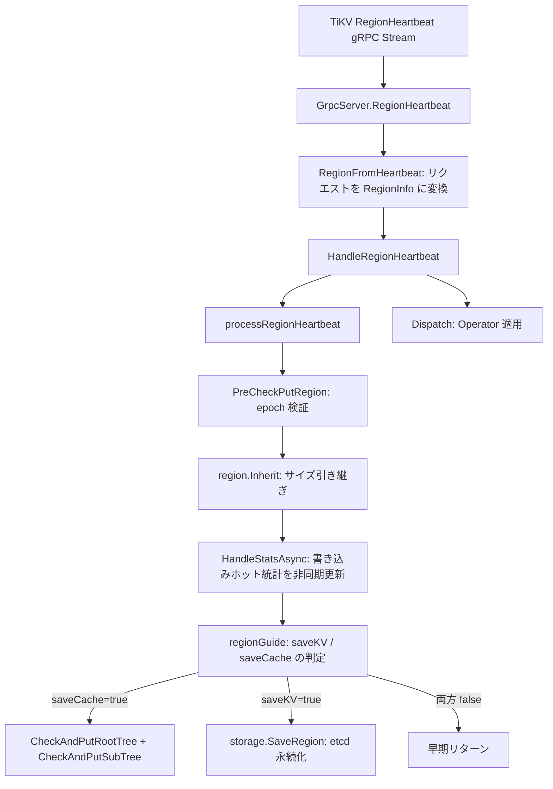
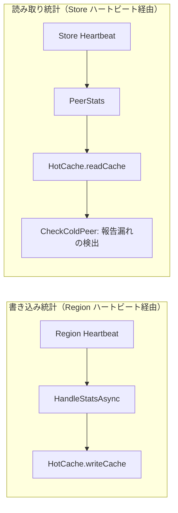

# 第9章 Region ハートビートと統計収集

> **本章で読むソース**
>
> - [`server/grpc_service.go`](https://github.com/tikv/pd/blob/v8.5.6/server/grpc_service.go)
> - [`server/cluster/cluster_worker.go`](https://github.com/tikv/pd/blob/v8.5.6/server/cluster/cluster_worker.go)
> - [`server/cluster/cluster.go`](https://github.com/tikv/pd/blob/v8.5.6/server/cluster/cluster.go)
> - [`pkg/core/region.go`](https://github.com/tikv/pd/blob/v8.5.6/pkg/core/region.go)
> - [`pkg/cluster/cluster.go`](https://github.com/tikv/pd/blob/v8.5.6/pkg/cluster/cluster.go)
> - [`pkg/statistics/hot_cache.go`](https://github.com/tikv/pd/blob/v8.5.6/pkg/statistics/hot_cache.go)
> - [`pkg/statistics/hot_peer_cache.go`](https://github.com/tikv/pd/blob/v8.5.6/pkg/statistics/hot_peer_cache.go)
> - [`pkg/statistics/hot_peer.go`](https://github.com/tikv/pd/blob/v8.5.6/pkg/statistics/hot_peer.go)
> - [`pkg/statistics/store.go`](https://github.com/tikv/pd/blob/v8.5.6/pkg/statistics/store.go)
> - [`pkg/statistics/store_hot_peers_infos.go`](https://github.com/tikv/pd/blob/v8.5.6/pkg/statistics/store_hot_peers_infos.go)

## この章の狙い

TiKV は各 Region のリーダーから PD へ定期的にハートビートを送信し、PD はその情報で Region メタデータを更新し、ホットリージョン統計を収集する。
本章では、gRPC ストリームで受け取ったハートビートが `RegionInfo` に変換され、etcd への永続化判定と統計更新を経てスケジューラへ渡されるまでの経路を読む。
最適化の工夫として、フロー値のみが変化したハートビートで etcd 書き込みを省く saveKV/saveCache 分離と、フロー値の量子化（`flowRoundDivisor`）を機構レベルで説明する。

## 前提

[第7章](07-store-management.md)で Store ハートビートの受信経路を読んだ。
[第8章](08-region-and-region-tree.md)で `RegionInfo` 構造体と `RegionTree` によるメタデータ管理を読んだ。
本章はその続きとして、Region ハートビートの受信から統計収集までを扱う。
コード引用は tikv/pd のタグ `v8.5.6` に固定する。

## ハートビートで運ばれる情報

TiKV から送られる Region ハートビートは、Region のメタデータ、リーダー情報、フロー統計を含む。
PD はこれらを **`RegionInfo`** 構造体で保持する。

[`pkg/core/region.go L59-L89`](https://github.com/tikv/pd/blob/v8.5.6/pkg/core/region.go#L59-L89)

```go
type RegionInfo struct {
	meta              *metapb.Region
	learners          []*metapb.Peer
	witnesses         []*metapb.Peer
	voters            []*metapb.Peer
	leader            *metapb.Peer
	downPeers         []*pdpb.PeerStats
	pendingPeers      []*metapb.Peer
	term              uint64
	cpuUsage          uint64
	writtenBytes      uint64
	writtenKeys       uint64
	readBytes         uint64
	readKeys          uint64
	approximateSize   int64
	approximateKvSize int64
	approximateKeys   int64
	interval          *pdpb.TimeInterval
	replicationStatus *replication_modepb.RegionReplicationStatus
	queryStats        *pdpb.QueryStats
	flowRoundDivisor  uint64
	buckets unsafe.Pointer
	source RegionSource
	ref atomic.Int32
}
```

`meta` が Region の epoch やキーレンジを持つ protobuf メッセージである。
`writtenBytes` と `readBytes` はハートビート区間内のフロー量を記録する。
`approximateSize` は Region の推定サイズであり、MB 単位に丸められて格納される。
`flowRoundDivisor` はフロー値を量子化する除数であり、後述する saveCache 判定の頻度を制御する。

gRPC リクエストから `RegionInfo` のフィールドを取り出すために **`RegionHeartbeatRequest`** インタフェースが定義されている。

[`pkg/core/region.go L200-L214`](https://github.com/tikv/pd/blob/v8.5.6/pkg/core/region.go#L200-L214)

```go
type RegionHeartbeatRequest interface {
	GetTerm() uint64
	GetRegion() *metapb.Region
	GetLeader() *metapb.Peer
	GetDownPeers() []*pdpb.PeerStats
	GetPendingPeers() []*metapb.Peer
	GetBytesWritten() uint64
	GetKeysWritten() uint64
	GetBytesRead() uint64
	GetKeysRead() uint64
	GetInterval() *pdpb.TimeInterval
	GetQueryStats() *pdpb.QueryStats
	GetApproximateSize() uint64
	GetApproximateKeys() uint64
}
```

このインタフェースを受け取り `RegionInfo` を生成するのが **`RegionFromHeartbeat`** 関数である（L217-L265）。
`RegionFromHeartbeat` はリクエストのサイズを MB 単位に丸め、非現実的なフロー値をフィルタし、各 Peer を voter と learner に分類して `RegionInfo` を返す。

## gRPC から processRegionHeartbeat への受信経路

TiKV のリーダー Peer は gRPC の双方向ストリームで Region ハートビートを送信する。
PD 側のエントリポイントは `GrpcServer.RegionHeartbeat` である。

[`server/grpc_service.go L1232-L1233`](https://github.com/tikv/pd/blob/v8.5.6/server/grpc_service.go#L1232-L1233)

```go
// RegionHeartbeat implements gRPC PDServer.
func (s *GrpcServer) RegionHeartbeat(stream pdpb.PD_RegionHeartbeatServer) error {
```

この関数はストリームからリクエストを逐次読み出し、`RegionFromHeartbeat` で `RegionInfo` に変換する。

[`server/grpc_service.go L1335`](https://github.com/tikv/pd/blob/v8.5.6/server/grpc_service.go#L1335)

```go
region := core.RegionFromHeartbeat(request, flowRoundDivisor)
```

変換された `RegionInfo` は `HandleRegionHeartbeat` に渡される。

[`server/grpc_service.go L1360`](https://github.com/tikv/pd/blob/v8.5.6/server/grpc_service.go#L1360)

```go
err = rc.HandleRegionHeartbeat(region)
```

**`HandleRegionHeartbeat`** は、ハートビート処理のトレーサー初期化と並行ランナーの選択を行ったうえで `processRegionHeartbeat` を呼び出す。

[`server/cluster/cluster_worker.go L38-L73`](https://github.com/tikv/pd/blob/v8.5.6/server/cluster/cluster_worker.go#L38-L73)

```go
func (c *RaftCluster) HandleRegionHeartbeat(region *core.RegionInfo) error {
	tracer := core.NewNoopHeartbeatProcessTracer()
	if c.GetScheduleConfig().EnableHeartbeatBreakdownMetrics {
		tracer = core.NewHeartbeatProcessTracer()
	}
	// ... (中略) ...
	if c.GetScheduleConfig().EnableHeartbeatConcurrentRunner {
		taskRunner = c.heartbeatRunner
		miscRunner = c.miscRunner
		logRunner = c.logRunner
		syncRegionRunner = c.syncRegionRunner
	}
	// ... (中略) ...
	if err := c.processRegionHeartbeat(ctx, region); err != nil {
		// ...
	}
	// ...
	c.coordinator.GetOperatorController().Dispatch(region, operator.DispatchFromHeartBeat, c.coordinator.RecordOpStepWithTTL)
	return nil
}
```

`processRegionHeartbeat` が完了すると、`OperatorController.Dispatch` が呼ばれ、保留中の Operator があればその Region に適用される。

以下の図は、ハートビートが gRPC ストリームから Operator 適用まで流れる経路を示す。



## Region メタデータの更新判定

**`processRegionHeartbeat`** がハートビート処理の中核である。

[`server/cluster/cluster.go L1211-L1359`](https://github.com/tikv/pd/blob/v8.5.6/server/cluster/cluster.go#L1211-L1359)

処理は5段階で進む。

第1段階として、既存の Region メタデータとの整合性を検証する。

[`server/cluster/cluster.go L1211`](https://github.com/tikv/pd/blob/v8.5.6/server/cluster/cluster.go#L1211)

```go
var regionGuide = core.GenerateRegionGuideFunc(true)
```

[`server/cluster/cluster.go L1217`](https://github.com/tikv/pd/blob/v8.5.6/server/cluster/cluster.go#L1217)

```go
origin, _, err := c.PreCheckPutRegion(region)
```

`PreCheckPutRegion` は Region の epoch（Version と ConfVer）を確認し、古いハートビートを棄却する。

第2段階として、epoch 検証を通過した `RegionInfo` に既存情報からサイズや Bucket を引き継ぐ。

[`server/cluster/cluster.go L1223`](https://github.com/tikv/pd/blob/v8.5.6/server/cluster/cluster.go#L1223)

```go
region.Inherit(origin, c.GetStoreConfig().IsEnableRegionBucket())
```

第3段階として、統計情報の非同期更新を実行する。

[`server/cluster/cluster.go L1226`](https://github.com/tikv/pd/blob/v8.5.6/server/cluster/cluster.go#L1226)

```go
cluster.HandleStatsAsync(c, region)
```

この呼び出しの詳細は次節で読む。

第4段階として、**`regionGuide`** が saveKV と saveCache の要否を判定する。

[`server/cluster/cluster.go L1232`](https://github.com/tikv/pd/blob/v8.5.6/server/cluster/cluster.go#L1232)

```go
saveKV, saveCache, needSync, retained := regionGuide(ctx, region, origin)
```

「regionGuide」の実体は **`GenerateRegionGuideFunc`** が返す関数であり、以下の決定木に従う。

[`pkg/core/region.go L755-L885`](https://github.com/tikv/pd/blob/v8.5.6/pkg/core/region.go#L755-L885)

- 新規 Region（origin が nil）の場合、saveKV と saveCache の両方を true にする（L789-L795）。
- Region の Version が増加した場合（Split や Merge の完了）、saveKV と saveCache を true にする（L797-L809）。
- ConfVer が増加した場合（Peer の追加や削除）、saveKV と saveCache を true にする（L810-L820）。
- リーダーが変わった場合、saveCache を true にし needSync を true にする（L821-L831）。saveKV は false のままである。
- フロー値（`GetRoundBytesWritten` や `GetRoundBytesRead` の差分）が変化した場合、saveCache と needSync を true にする（L845-L850）。saveKV は false のままである。
- `downPeers` や `pendingPeers` が変化した場合、saveCache と needSync を true にする（L851-L864）。

saveKV と saveCache の両方が false の場合、`processRegionHeartbeat` は早期リターンする（L1235-L1261）。
メタデータもフロー値も変化しない「空」のハートビートでは、etcd 書き込みもキャッシュ更新も行わない。

第5段階として、判定結果に応じてキャッシュ書き込みと etcd 永続化を実行する。

saveCache が true の場合、`RegionTree` にキャッシュを書き込む。

[`server/cluster/cluster.go L1276`](https://github.com/tikv/pd/blob/v8.5.6/server/cluster/cluster.go#L1276)

```go
if overlaps, err = c.CheckAndPutRootTree(ctx, region); err != nil {
```

`CheckAndPutSubTree` も非同期タスクとして投入される（L1280-L1287）。

saveKV が true の場合にのみ etcd への永続化を実行する。

[`server/cluster/cluster.go L1336`](https://github.com/tikv/pd/blob/v8.5.6/server/cluster/cluster.go#L1336)

```go
if err := c.storage.SaveRegion(region.GetMeta()); err != nil {
```

needSync が true の場合、`changedRegions` チャネルへ Region を送り、他のコンポーネントへ変更を通知する（L1348-L1357）。

**saveKV と saveCache の分離が、ハートビート処理における最大の最適化である。**
フロー値（書き込みバイト数、読み取りバイト数）の変化は最も頻繁に発生するハートビート更新であるが、この場合 saveKV は false のまま etcd 書き込みが省略される。
`RegionTree` のインメモリキャッシュだけを更新することで、etcd への I/O 負荷を大幅に削減する。

フロー値の量子化もキャッシュ更新の頻度を下げる。
`GetRoundBytesRead` は `flowRoundDivisor` でフロー値を丸める。

[`pkg/core/region.go L650-L655`](https://github.com/tikv/pd/blob/v8.5.6/pkg/core/region.go#L650-L655)

```go
func (r *RegionInfo) GetRoundBytesRead() uint64 {
	if r.flowRoundDivisor == 0 {
		return r.readBytes
	}
	return ((r.readBytes + r.flowRoundDivisor/2) / r.flowRoundDivisor) * r.flowRoundDivisor
}
```

`GetRoundBytesWritten`（L663-L668）も同じパターンで書き込みバイト数を丸める。
丸めにより、フロー値の微小な揺れでは saveCache が true にならない。
「regionGuide」は丸め後の値で差分を比較するため、`flowRoundDivisor` が大きいほどキャッシュ更新の頻度が下がる。

## ホットリージョン統計の収集

`processRegionHeartbeat` 内で呼ばれる **`HandleStatsAsync`** が、ホットリージョン統計を非同期に更新する。

[`pkg/cluster/cluster.go L38-L60`](https://github.com/tikv/pd/blob/v8.5.6/pkg/cluster/cluster.go#L38-L60)

```go
func HandleStatsAsync(c Cluster, region *core.RegionInfo) {
	checkWritePeerTask := func(cache *statistics.HotPeerCache) {
		reportInterval := region.GetInterval()
		interval := reportInterval.GetEndTimestamp() - reportInterval.GetStartTimestamp()
		stats := cache.CheckPeerFlow(region, region.GetPeers(), region.GetWriteLoads(), interval)
		for _, stat := range stats {
			cache.UpdateStat(stat)
		}
	}
	checkExpiredTask := func(cache *statistics.HotPeerCache) {
		expiredStats := cache.CollectExpiredItems(region)
		for _, stat := range expiredStats {
			cache.UpdateStat(stat)
		}
	}
	c.GetHotStat().CheckWriteAsync(checkExpiredTask)
	c.GetHotStat().CheckReadAsync(checkExpiredTask)
	c.GetHotStat().CheckWriteAsync(checkWritePeerTask)
	c.GetCoordinator().GetSchedulersController().CheckTransferWitnessLeader(region)
}
```

`HandleStatsAsync` は3つのタスクをキューに投入する。
`checkExpiredTask` は書き込みキャッシュと読み取りキャッシュの両方から、ハートビートが途絶えた Region の期限切れエントリを除去する。
`checkWritePeerTask` は Region の書き込みフロー（`GetWriteLoads` の戻り値）をもとにホットピアの判定を行う。

`GetWriteLoads` はフロー値を float64 のスライスとして返す。

[`pkg/core/region.go L1793-L1803`](https://github.com/tikv/pd/blob/v8.5.6/pkg/core/region.go#L1793-L1803)

```go
func (r *RegionInfo) GetWriteLoads() []float64 {
	return []float64{
		0,
		0,
		0,
		float64(r.GetBytesWritten()),
		float64(r.GetKeysWritten()),
		float64(r.GetWriteQueryNum()),
	}
}
```

スライスの先頭3要素は読み取り系指標（BytesRead、KeysRead、QueryRead）のスロットであり、書き込みフローの計算では使わない。

**`HotCache`** が書き込み統計と読み取り統計を分離して管理する。

[`pkg/statistics/hot_cache.go L29-L34`](https://github.com/tikv/pd/blob/v8.5.6/pkg/statistics/hot_cache.go#L29-L34)

```go
type HotCache struct {
	ctx        context.Context
	writeCache *HotPeerCache
	readCache  *HotPeerCache
}
```

[`pkg/statistics/hot_cache.go L37-L46`](https://github.com/tikv/pd/blob/v8.5.6/pkg/statistics/hot_cache.go#L37-L46)

```go
func NewHotCache(ctx context.Context, cluster *core.BasicCluster) *HotCache {
	w := &HotCache{
		ctx:        ctx,
		writeCache: NewHotPeerCache(ctx, cluster, utils.Write),
		readCache:  NewHotPeerCache(ctx, cluster, utils.Read),
	}
	go w.updateItems(w.readCache.taskQueue, w.runReadTask)
	go w.updateItems(w.writeCache.taskQueue, w.runWriteTask)
	return w
}
```

「HotCache」は初期化時に2つのゴルーチンを起動する。
`writeCache.taskQueue` を消費するゴルーチンと `readCache.taskQueue` を消費するゴルーチンである。
`CheckWriteAsync` はタスクを `writeCache.taskQueue` へ送り、`CheckReadAsync` は `readCache.taskQueue` へ送る。
各キャッシュにゴルーチンが1つだけなので、アクセスは直列化され、ロックなしで安全に読み書きできる。

**`HotPeerCache`** がホットピアの追跡データを保持する。

[`pkg/statistics/hot_peer_cache.go L60-L72`](https://github.com/tikv/pd/blob/v8.5.6/pkg/statistics/hot_peer_cache.go#L60-L72)

```go
type HotPeerCache struct {
	kind              utils.RWType
	cluster           *core.BasicCluster
	peersOfStore      map[uint64]*utils.TopN
	storesOfRegion    map[uint64]map[uint64]struct{}
	regionsOfStore    map[uint64]map[uint64]struct{}
	topNTTL           time.Duration
	taskQueue         *chanx.UnboundedChan[func(*HotPeerCache)]
	thresholdsOfStore map[uint64]*thresholds
	metrics           map[uint64][utils.ActionTypeLen]prometheus.Gauge
	lastGCTime        time.Time
}
```

`peersOfStore` は Store ID をキーとして、その Store 上のホットピアを TopN ヒープで保持する。
`storesOfRegion` は Region ID から Store ID の集合への逆引きマップである。

**`CheckPeerFlow`** がホットピアの判定ロジックを実装する。

[`pkg/statistics/hot_peer_cache.go L181-L236`](https://github.com/tikv/pd/blob/v8.5.6/pkg/statistics/hot_peer_cache.go#L181-L236)

新規のピアについては `calcHotThresholds` で閾値を計算し、フロー値が閾値を超えるかどうかを判定する（L207-L216）。
既存のホットピアについては統計を更新して返す（L229-L233）。

動的閾値の計算は **`calcHotThresholds`** が担う。

[`pkg/statistics/hot_peer_cache.go L303-L340`](https://github.com/tikv/pd/blob/v8.5.6/pkg/statistics/hot_peer_cache.go#L303-L340)

```go
if tn, ok := f.peersOfStore[storeID]; ok {
	t.topNLen = tn.Len()
	if t.topNLen < TopNN {
		return t.rates
	}
	for i := range t.rates {
		t.rates[i] = math.Max(tn.GetTopNMin(i).(*HotPeerStat).GetLoad(i)*HotThresholdRatio, t.rates[i])
	}
}
```

TopN ヒープに十分な数のエントリ（`TopNN` 以上）が溜まっている場合、ヒープの最小値に `HotThresholdRatio` を乗じた値を閾値とする[^percentile]。
エントリが少ない段階ではデフォルトの `rates` をそのまま使う。
Store ごとの負荷分布に閾値が適応するため、高負荷の Store では閾値が引き上がり、低負荷の Store では引き下がる。

[^percentile]: TopN ヒープは負荷上位 N 件を保持するので、ヒープの最小値は全体の80パーセンタイル相当にあたる。`HotThresholdRatio` を乗じることで閾値にマージンを持たせている。

ホットピアの状態は **`HotPeerStat`** 構造体で管理される。

[`pkg/statistics/hot_peer.go L92-L118`](https://github.com/tikv/pd/blob/v8.5.6/pkg/statistics/hot_peer.go#L92-L118)

```go
type HotPeerStat struct {
	StoreID  uint64
	RegionID uint64
	HotDegree int
	AntiCount int
	Loads []float64
	rollingLoads []*dimStat
	stores []uint64
	actionType utils.ActionType
	isLeader bool
	lastTransferLeaderTime time.Time
	inCold bool
	allowInherited bool
}
```

`HotDegree` はハートビートを受け取るたびにインクリメントされ、フロー値が閾値を下回るとデクリメントされる。
`AntiCount` はヒステリシスの役割を果たし、一時的なフロー低下でピアが即座にホットリストから除去されることを防ぐ。

## 書き込み統計と読み取り統計の経路の違い

書き込みフロー統計と読み取りフロー統計は、異なるハートビート経路で PD に届く。

書き込み統計は Region ハートビート経由で届く。
TiKV のリーダーが Region ハートビートに `BytesWritten` と `KeysWritten` を含めて送信し、PD は `HandleStatsAsync` を通じて `HotCache` の `writeCache` に投入する。

読み取り統計は Store ハートビート経由で届く。
TiKV は Store ハートビートの `PeerStats` フィールドに各 Region の読み取り量を含めて送信する。
PD の `HandleStoreHeartbeat` がこれを受け取り、「HotCache」の `readCache` に投入する。

[`server/cluster/cluster.go L1108`](https://github.com/tikv/pd/blob/v8.5.6/server/cluster/cluster.go#L1108)

```go
c.hotStat.Observe(storeID, newStore.GetStoreStats())
```

[`server/cluster/cluster.go L1114-L1148`](https://github.com/tikv/pd/blob/v8.5.6/server/cluster/cluster.go#L1114-L1148)

Store ハートビートの `PeerStats` をループして各 Region の読み取り統計を取り出し、`CheckReadAsync` で `readCache` に投入する。

読み取り統計が Store ハートビートに乗る理由は、読み取りがリーダーだけでなくフォロワーでも処理されるためである。
Region ハートビートはリーダーからのみ送信されるので、フォロワーの読み取り量を報告できない。
Store ハートビートならば、その Store 上のすべての Peer（リーダーとフォロワーの両方）の読み取り量を報告できる。

Store ハートビートで報告されなかった Region については **`CheckColdPeer`** で検出する。

[`server/cluster/cluster.go L1168-L1177`](https://github.com/tikv/pd/blob/v8.5.6/server/cluster/cluster.go#L1168-L1177)

「CheckColdPeer」は、以前ホットだったが今回の Store ハートビートに含まれなかった Region を見つけ、`readCache` から除去する候補として投入する。



## Store スコアへの統計情報の集約

ホットピア単位で収集された統計は、Store 単位に集約されてスケジューラの入力となる。

**`StoresStats`** は Store ごとのフロー統計をノイズ除去しながら蓄積する。

[`pkg/statistics/store.go L38-L42`](https://github.com/tikv/pd/blob/v8.5.6/pkg/statistics/store.go#L38-L42)

「StoresStats」は `rollingStoresStats` マップを持ち、Store ID ごとに **`RollingStoreStats`** を管理する。

[`pkg/statistics/store.go L136-L140`](https://github.com/tikv/pd/blob/v8.5.6/pkg/statistics/store.go#L136-L140)

「RollingStoreStats」は `timeMedians`（時間加重の中央値フィルタ）と `movingAvgs`（移動平均フィルタ）の2種類のノイズ除去機構を持つ。

[`pkg/statistics/store.go L143-L168`](https://github.com/tikv/pd/blob/v8.5.6/pkg/statistics/store.go#L143-L168)

初期化時に、読み取りバイト数、書き込みバイト数、読み取りキー数、書き込みキー数、クエリ数には **TimeMedian** フィルタを割り当てる（L149-L154）。
CPU 使用率やディスク読み書きレートには **MedianFilter** を割り当てる（L155-L157）。
「TimeMedian」はサンプル間隔の不均一さを吸収し、「MedianFilter」は外れ値を除去する。

Store ハートビートのたびに `Observe` メソッド（L78-L81）が呼ばれ、フィルタに新しいサンプルが投入される。

ホットピアの統計を Store 単位に集約するのが **`CollectHotPeerInfos`** である。

[`pkg/statistics/store_hot_peers_infos.go L37-L69`](https://github.com/tikv/pd/blob/v8.5.6/pkg/statistics/store_hot_peers_infos.go#L37-L69)

「CollectHotPeerInfos」は Store ごとに `TotalBytesRate`、`TotalKeysRate`、`TotalQueryRate`、`Count` を集計する。

**`SummaryStoresLoad`** がこれらの情報を TiKV ノード用と TiFlash ノード用に分けて集約する。

[`pkg/statistics/store_hot_peers_infos.go L107-L140`](https://github.com/tikv/pd/blob/v8.5.6/pkg/statistics/store_hot_peers_infos.go#L107-L140)

TiKV コレクタ（L119-L126）と TiFlash コレクタ（L127-L134）を分けることで、ストアの種類に応じたスケジューリング判断が可能になる。
この集約結果は hot-region スケジューラが Store 間の負荷偏りを検出する入力として使う。

## まとめ

Region ハートビートの処理は、gRPC ストリームでの受信、`RegionInfo` への変換、epoch 検証、統計更新、saveKV/saveCache 判定、キャッシュ書き込みと etcd 永続化の各段階で構成される。

「GenerateRegionGuideFunc」による saveKV/saveCache の分離は、最も頻繁なフロー変化のハートビートで etcd 書き込みを省略し、I/O 負荷を削減する。
`flowRoundDivisor` による量子化は、フロー値の微小な揺れによるキャッシュ更新をさらに抑制する。

ホットリージョン統計は、書き込みが Region ハートビート経由、読み取りが Store ハートビート経由の二系統で収集され、「HotCache」の2つのゴルーチンで直列処理される。
動的閾値は Store ごとの TopN ヒープの80パーセンタイルから算出され、負荷分布に適応する。

## 関連する章

- [第7章 Store の管理とストアハートビート](07-store-management.md)
- [第8章 Region メタデータと RegionTree](08-region-and-region-tree.md)
- [第10章 Coordinator とスケジューリングループ](../part03-scheduling/10-coordinator.md)
- [第16章 hot-region スケジューラと統計](../part04-schedulers/16-hot-region.md)
