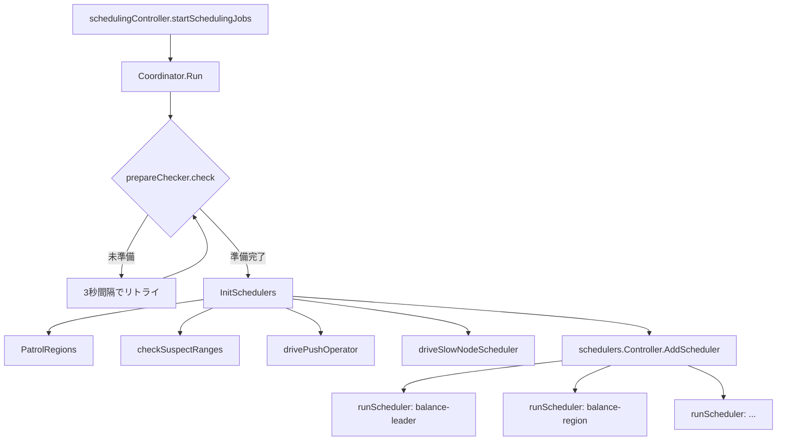
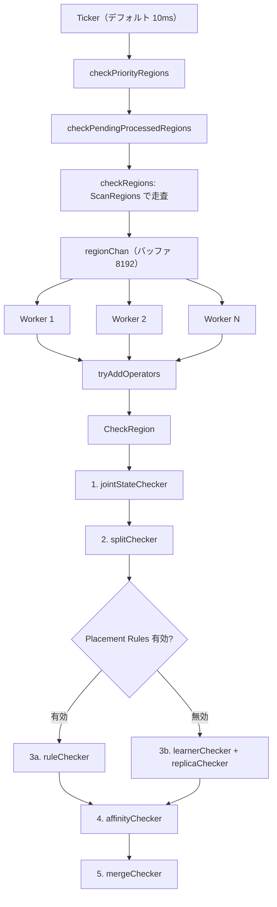

# 第10章 Coordinator とスケジューリングループ

> **本章で読むソース**
>
> - [`pkg/schedule/coordinator.go`](https://github.com/tikv/pd/blob/v8.5.6/pkg/schedule/coordinator.go)
> - [`pkg/schedule/prepare_checker.go`](https://github.com/tikv/pd/blob/v8.5.6/pkg/schedule/prepare_checker.go)
> - [`pkg/schedule/schedulers/scheduler.go`](https://github.com/tikv/pd/blob/v8.5.6/pkg/schedule/schedulers/scheduler.go)
> - [`pkg/schedule/schedulers/scheduler_controller.go`](https://github.com/tikv/pd/blob/v8.5.6/pkg/schedule/schedulers/scheduler_controller.go)
> - [`pkg/schedule/checker/checker_controller.go`](https://github.com/tikv/pd/blob/v8.5.6/pkg/schedule/checker/checker_controller.go)
> - [`server/cluster/scheduling_controller.go`](https://github.com/tikv/pd/blob/v8.5.6/server/cluster/scheduling_controller.go)

## この章の狙い

PD のスケジューリングは、**スケジューラ**が Operator を生成する経路と、**チェッカー**が Region の異常を検出して Operator を生成する経路の二本立てで動く。
これらを束ねて起動し、実行ループを回すのが **Coordinator** である。
本章では、「Coordinator」の構造体定義から起動シーケンス、「スケジューラ」ごとの実行ループ、「チェッカー」の巡回ループまでを読む。
最適化の工夫として、「スケジューラ」の指数バックオフと巡回スキャン上限の動的計算を機構レベルで説明する。

## 前提

[第9章](../part02-metadata/09-region-heartbeat.md)で Region ハートビートの受信から統計収集までを読んだ。
本章はその先、収集された統計から Operator を生成し実行ループを回す仕組みを読む。
コード引用は tikv/pd のタグ `v8.5.6` に固定する。

## Coordinator 構造体と生成

「Coordinator」はスケジューリング基盤の中核となる構造体であり、「スケジューラ」の制御器、「チェッカー」の制御器、Operator の制御器を束ねて保持する。

[`pkg/schedule/coordinator.go L59-L78`](https://github.com/tikv/pd/blob/v8.5.6/pkg/schedule/coordinator.go#L59-L78)

```go
type Coordinator struct {
	syncutil.RWMutex

	wg     sync.WaitGroup
	ctx    context.Context
	cancel context.CancelFunc

	schedulersInitialized bool

	cluster           sche.ClusterInformer
	prepareChecker    *prepareChecker
	checkers          *checker.Controller
	regionScatterer   *scatter.RegionScatterer
	regionSplitter    *splitter.RegionSplitter
	schedulers        *schedulers.Controller
	opController      *operator.Controller
	hbStreams         *hbstream.HeartbeatStreams
	pluginInterface   *PluginInterface
	diagnosticManager *diagnostic.Manager
}
```

`cluster` はクラスタメタデータへの参照であり、Region や Store の情報を「スケジューラ」と「チェッカー」に提供する。
`prepareChecker` はクラスタが十分なハートビートを受信したかを判定する構造体である。
`checkers` は「チェッカー」群を束ねる **`checker.Controller`** である。
`schedulers` は「スケジューラ」群を束ねる **`schedulers.Controller`** である。
`opController` は生成された Operator の投入と実行を管理する **`operator.Controller`** である。

**`NewCoordinator`**（L81-L111）が各制御器を生成する。

[`pkg/schedule/coordinator.go L81-L111`](https://github.com/tikv/pd/blob/v8.5.6/pkg/schedule/coordinator.go#L81-L111)

`operator.Controller` を生成した後、その成功コールバックとして `AffinityChecker.RecordOpSuccess` を登録する。
Operator が正常に完了したとき、`AffinityChecker` が結果を記録し、次回の配置判断に反映する仕組みである。

スケジューリングループで使われる定数は以下のとおりである。

[`pkg/schedule/coordinator.go L45-L56`](https://github.com/tikv/pd/blob/v8.5.6/pkg/schedule/coordinator.go#L45-L56)

```go
const (
	runSchedulerCheckInterval = 3 * time.Second
	collectTimeout            = 5 * time.Minute
	maxLoadConfigRetries      = 10
	// pushOperatorTickInterval is the interval try to push the operator.
	pushOperatorTickInterval = 500 * time.Millisecond
	// ... (中略) ...
)
```

`runSchedulerCheckInterval` は起動前のポーリング間隔、`collectTimeout` はハートビート収集のタイムアウト、`pushOperatorTickInterval` は Operator を TiKV へ送信する間隔を表す。

## schedulingController からの起動経路

「Coordinator」を起動するのは **`schedulingController`** である。

[`server/cluster/scheduling_controller.go L45-L59`](https://github.com/tikv/pd/blob/v8.5.6/server/cluster/scheduling_controller.go#L45-L59)

```go
type schedulingController struct {
	parentCtx context.Context
	ctx       context.Context
	cancel    context.CancelFunc
	mu        syncutil.RWMutex
	wg        sync.WaitGroup
	*core.BasicCluster
	opt         sc.ConfProvider
	coordinator *schedule.Coordinator
	labelStats  *statistics.LabelStatistics
	regionStats *statistics.RegionStatistics
	hotStat     *statistics.HotStat
	slowStat    *statistics.SlowStat
	running     bool
}
```

「schedulingController」は `RaftCluster` のフィールドとして埋め込まれ、スケジューリング関連のゴルーチン群を管理する。

**`startSchedulingJobs`**（L91-L104）が3つのゴルーチンを起動する。

[`server/cluster/scheduling_controller.go L91-L104`](https://github.com/tikv/pd/blob/v8.5.6/server/cluster/scheduling_controller.go#L91-L104)

1つ目の `runCoordinator` が `Coordinator.Run` を呼び出す。
2つ目の `runStatsBackgroundJobs` が統計の定期更新を行う。
3つ目の `runSchedulingMetricsCollectionJob` がスケジューリング関連メトリクスを収集する。

## prepareChecker による準備判定

「Coordinator」は起動直後にスケジューリングを開始しない。
クラスタ内の全 Store から十分なハートビートを受信するまで待機する。
この判定を担うのが **`prepareChecker`** である。

[`pkg/schedule/prepare_checker.go L26-L30`](https://github.com/tikv/pd/blob/v8.5.6/pkg/schedule/prepare_checker.go#L26-L30)

```go
type prepareChecker struct {
	syncutil.RWMutex
	start    time.Time
	prepared bool
}
```

**`check`** メソッド（L39-L74）が準備完了の判定を行う。

[`pkg/schedule/prepare_checker.go L39-L74`](https://github.com/tikv/pd/blob/v8.5.6/pkg/schedule/prepare_checker.go#L39-L74)

判定条件は2つある。
1つ目は、`collectTimeout`（5分）を超過した場合であり、タイムアウトとして準備完了と見なす。
2つ目は、各 Store がハートビートで報告した Region 数が `CollectFactor` の閾値に達した場合である。
全 Store がこの条件を満たすと準備完了となる。

5分間のタイムアウトは、一部の Store が起動しない場合にスケジューリングが永久に始まらない事態を防ぐ。

## Coordinator.Run の起動シーケンス

**`Run`** メソッドが「Coordinator」のメインループである。

[`pkg/schedule/coordinator.go L227-L257`](https://github.com/tikv/pd/blob/v8.5.6/pkg/schedule/coordinator.go#L227-L257)

起動は2段階で進む。

第1段階では、3秒間隔の Ticker で `prepareChecker.check` をポーリングする。
「prepareChecker」が `true` を返すまで、「スケジューラ」も「チェッカー」も動かない。

第2段階として、準備完了後に `InitSchedulers(true)` を呼び出し、4つのゴルーチンを起動する。

1. **PatrolRegions**: Region を巡回して「チェッカー」を適用する
2. **checkSuspectRanges**: 疑わしいキーレンジを再検査する
3. **drivePushOperator**: 実行中の Operator のステップを TiKV へ送信する
4. **driveSlowNodeScheduler**: 低速ノードの検出と evict スケジューラの自動投入を行う

これらに加えて、`InitSchedulers` 内で `schedulers.Controller.AddScheduler` が呼ばれ、「スケジューラ」ごとに `runScheduler` ゴルーチンが起動する。

以下の図は、「schedulingController」から「Coordinator」が起動し、各ゴルーチンが立ち上がるまでの構成を示す。



## Scheduler インタフェースと登録機構

個々の「スケジューラ」は **`Scheduler`** インタフェースを実装する。

[`pkg/schedule/schedulers/scheduler.go L36-L60`](https://github.com/tikv/pd/blob/v8.5.6/pkg/schedule/schedulers/scheduler.go#L36-L60)

```go
type Scheduler interface {
	http.Handler
	GetName() string
	GetType() types.CheckerSchedulerType
	EncodeConfig() ([]byte, error)
	ReloadConfig() error
	GetMinInterval() time.Duration
	GetNextInterval(interval time.Duration) time.Duration
	PrepareConfig(cluster sche.SchedulerCluster) error
	CleanConfig(cluster sche.SchedulerCluster)
	Schedule(cluster sche.SchedulerCluster, dryRun bool) ([]*operator.Operator, []plan.Plan)
	IsScheduleAllowed(cluster sche.SchedulerCluster) bool
	IsDisable() bool
	SetDisable(bool) error
	IsDefault() bool
}
```

`Schedule` メソッドがスケジューリングの本体であり、クラスタの状態を受け取って Operator のスライスを返す。
`GetMinInterval` と `GetNextInterval` は実行間隔の制御に使われ、後述する指数バックオフの仕組みを支える。

「スケジューラ」の登録は **`RegisterScheduler`** 関数で行われる。

[`pkg/schedule/schedulers/scheduler.go L126-L163`](https://github.com/tikv/pd/blob/v8.5.6/pkg/schedule/schedulers/scheduler.go#L126-L163)

各「スケジューラ」パッケージは `init()` 関数内で `RegisterScheduler` を呼び、生成関数を `schedulerMap` に登録する。
**`CreateScheduler`** は `schedulerMap` から生成関数を取り出し、「Scheduler」インタフェースの実装を返す。

## InitSchedulers によるスケジューラ読み込み

**`InitSchedulers`**（L260-L374）は永続化ストレージから「スケジューラ」の設定を読み込み、各「スケジューラ」を生成して起動する。

[`pkg/schedule/coordinator.go L260-L374`](https://github.com/tikv/pd/blob/v8.5.6/pkg/schedule/coordinator.go#L260-L374)

処理は3段階で進む。

第1段階として、ストレージから「スケジューラ」設定を最大10回（`maxLoadConfigRetries`）リトライで読み込む。
pd-ctl や API で追加された「スケジューラ」の設定は etcd に永続化されており、PD 再起動時にここで復元される。

第2段階として、新形式（個別設定）と旧形式（スケジュール設定内）の両方から「スケジューラ」を生成する。
引数 `needRun` が `true` の場合は `AddScheduler` を呼んでゴルーチンを起動する。
`false` の場合は `AddSchedulerHandler` のみを登録し、HTTP ハンドラとして設定変更を受け付けるが実行はしない。

第3段階として、無効な設定を除去してストレージに書き戻し、`markSchedulersInitialized()` で初期化完了を記録する。

## schedulers.Controller のスケジューラ実行ループ

「スケジューラ」群の管理と実行を担うのが `schedulers.Controller` である。

[`pkg/schedule/schedulers/scheduler_controller.go L46-L59`](https://github.com/tikv/pd/blob/v8.5.6/pkg/schedule/schedulers/scheduler_controller.go#L46-L59)

```go
type Controller struct {
	syncutil.RWMutex
	wg      sync.WaitGroup
	ctx     context.Context
	cluster sche.SchedulerCluster
	storage endpoint.ConfigStorage
	// ... (中略) ...
	schedulers map[string]*ScheduleController
	// ... (中略) ...
	schedulerHandlers map[string]http.Handler
	opController      *operator.Controller
}
```

`schedulers` マップが名前から **`ScheduleController`** への対応を保持する。

[`pkg/schedule/schedulers/scheduler_controller.go L440-L450`](https://github.com/tikv/pd/blob/v8.5.6/pkg/schedule/schedulers/scheduler_controller.go#L440-L450)

```go
type ScheduleController struct {
	Scheduler
	cluster            sche.SchedulerCluster
	opController       *operator.Controller
	nextInterval       time.Duration
	ctx                context.Context
	cancel             context.CancelFunc
	delayAt            int64
	delayUntil         int64
	diagnosticRecorder *DiagnosticRecorder
}
```

「ScheduleController」は「Scheduler」インタフェースを埋め込み、実行間隔の制御（`nextInterval`）と遅延実行（`delayAt`、`delayUntil`）の状態を追加する。

**`AddScheduler`**（L200-L228）が「ScheduleController」を生成し、`PrepareConfig` を呼んだ後、`runScheduler` ゴルーチンを起動する。

[`pkg/schedule/schedulers/scheduler_controller.go L200-L228`](https://github.com/tikv/pd/blob/v8.5.6/pkg/schedule/schedulers/scheduler_controller.go#L200-L228)

**`runScheduler`** が「スケジューラ」ごとの実行ループである。

[`pkg/schedule/schedulers/scheduler_controller.go L361-L388`](https://github.com/tikv/pd/blob/v8.5.6/pkg/schedule/schedulers/scheduler_controller.go#L361-L388)

```go
func (c *Controller) runScheduler(s *ScheduleController) {
	defer logutil.LogPanic()
	defer c.wg.Done()
	defer s.Scheduler.CleanConfig(c.cluster)

	ticker := time.NewTicker(s.GetInterval())
	defer ticker.Stop()
	for {
		select {
		case <-ticker.C:
			diagnosable := s.IsDiagnosticAllowed()
			if !s.AllowSchedule(diagnosable) {
				continue
			}
			if op := s.Schedule(diagnosable); len(op) > 0 {
				added := c.opController.AddWaitingOperator(op...)
				log.Debug("add operator", zap.Int("added", added), zap.Int("total", len(op)), zap.String("scheduler", s.Scheduler.GetName()))
			}
			// Note: we reset the ticker here to support updating configuration dynamically.
			ticker.Reset(s.GetInterval())
		case <-s.Ctx().Done():
			log.Info("scheduler has been stopped",
				zap.String("scheduler-name", s.Scheduler.GetName()),
				errs.ZapError(s.Ctx().Err()))
			return
		}
	}
}
```

ループは Ticker の発火ごとに `AllowSchedule` でスケジューリング可否を確認し、許可されていれば `Schedule` を呼ぶ。
`Schedule` が Operator を返した場合、`AddWaitingOperator` で Operator キューに投入する。
Ticker の間隔は `s.GetInterval()` で毎回リセットされる。
この間隔が動的に変化する仕組みが、次に述べる指数バックオフである。

### スケジューラの指数バックオフ

「ScheduleController」の `Schedule` メソッド（L477-L525）は、Operator 生成の成否に応じて実行間隔を動的に調整する。

[`pkg/schedule/schedulers/scheduler_controller.go L477-L525`](https://github.com/tikv/pd/blob/v8.5.6/pkg/schedule/schedulers/scheduler_controller.go#L477-L525)

`Schedule` は最大10回（`maxScheduleRetries`）リトライし、ラベル拒否の判定も行う。
Operator の生成に成功すると `nextInterval` を `GetMinInterval()` にリセットする。
生成に失敗すると `GetNextInterval(interval)` を呼び、`nextInterval` を段階的に拡大する。

この仕組みにより、Operator を生成できない状態が続くと「スケジューラ」の実行間隔が指数的に広がる。
クラスタが安定してバランスが取れているとき、「スケジューラ」は呼ばれるたびに「移動すべき Region がない」と判定して空の結果を返す。
指数バックオフがなければ、この無駄な計算が `MinInterval`（数秒）ごとに繰り返される。
バックオフによって間隔が数十秒から数分に伸び、CPU 消費を抑える。
Region の移動が必要な状況（Store の追加や障害）が発生して Operator が生成されると、間隔は即座に `MinInterval` に戻り、迅速なスケジューリングが再開する。

## checker.Controller の構造

「チェッカー」群を束ねる `checker.Controller` は7種類の「チェッカー」を保持する。

[`pkg/schedule/checker/checker_controller.go L62-L94`](https://github.com/tikv/pd/blob/v8.5.6/pkg/schedule/checker/checker_controller.go#L62-L94)

```go
type Controller struct {
	ctx                     context.Context
	cluster                 sche.CheckerCluster
	conf                    config.CheckerConfigProvider
	opController            *operator.Controller
	learnerChecker          *LearnerChecker
	replicaChecker          *ReplicaChecker
	ruleChecker             *RuleChecker
	splitChecker            *SplitChecker
	mergeChecker            *MergeChecker
	affinityChecker         *AffinityChecker
	jointStateChecker       *JointStateChecker
	priorityInspector       *PriorityInspector
	pendingProcessedRegions *cache.TTLUint64
	suspectKeyRanges        *cache.TTLString // suspect key-range regions that may need fix
	patrolRegionContext     *PatrolRegionContext
	// ... (中略) ...
}
```

`pendingProcessedRegions` は処理待ち Region の TTL キャッシュ、`suspectKeyRanges` は疑わしいキーレンジの TTL キャッシュである。
`patrolRegionContext` が後述するワーカープールの管理構造を保持する。

巡回に関わる定数は以下のとおりである。

[`pkg/schedule/checker/checker_controller.go L39-L52`](https://github.com/tikv/pd/blob/v8.5.6/pkg/schedule/checker/checker_controller.go#L39-L52)

```go
const (
	suspectRegionLimit         = 1024
	checkSuspectRangesInterval = 100 * time.Millisecond
	// ... (中略) ...
	MinPatrolRegionScanLimit = 128
	// MaxPatrolScanRegionLimit is the max limit of regions to scan for a batch.
	MaxPatrolScanRegionLimit = 8192
	patrolRegionPartition    = 1024
	patrolRegionChanLen      = MaxPatrolScanRegionLimit
)
```

`MinPatrolRegionScanLimit` と `MaxPatrolScanRegionLimit` はスキャン上限の下限と上限、`patrolRegionPartition` はスキャン上限の計算に使う分割数である。
`patrolRegionChanLen` は Region をワーカーに渡すチャネルのバッファサイズであり、`MaxPatrolScanRegionLimit` と同じ8192に設定されている。

## PatrolRegions の巡回ループ

**`PatrolRegions`**（L123-L185）が Region の巡回ループを実装する。

[`pkg/schedule/checker/checker_controller.go L123-L185`](https://github.com/tikv/pd/blob/v8.5.6/pkg/schedule/checker/checker_controller.go#L123-L185)

ループは設定可能な間隔（デフォルト10ms）の Ticker で駆動され、各 Tick で3種類の検査を順に実行する。

1. **`checkPriorityRegions`**: 優先度の高い Region（Operator 実行に失敗した Region など）を先に検査する
2. **`checkPendingProcessedRegions`**: `pendingProcessedRegions` キャッシュに登録された Region を検査する
3. **`checkRegions`**: `ScanRegions` で `patrolRegionScanLimit` 件ずつ Region を走査し、`regionChan` に送る

「checkRegions」はキーレンジの先頭から順に走査し、`ScanRegions` が `nil` キーを返した時点で全 Region の走査が一巡したと判断する。
一巡にかかった時間をメトリクスとして記録し、先頭からの走査を再開する。

ワーカープールの管理構造は **`PatrolRegionContext`** である。

[`pkg/schedule/checker/checker_controller.go L524-L565`](https://github.com/tikv/pd/blob/v8.5.6/pkg/schedule/checker/checker_controller.go#L524-L565)

```go
type PatrolRegionContext struct {
	workersCtx    context.Context
	workersCancel context.CancelFunc
	regionChan    chan *core.RegionInfo
	wg            sync.WaitGroup
}
```

`regionChan` はバッファサイズ `patrolRegionChanLen`（8192）のチャネルである。
`startPatrolRegionWorkers` が `workerCount` 個のゴルーチンを起動し、各ゴルーチンは `regionChan` から Region を取り出して `tryAddOperators` を呼ぶ。
`tryAddOperators` の内部で次節の `CheckRegion` が呼ばれ、「チェッカー」が Region を検査する。

## CheckRegion のチェッカー適用順序

**`CheckRegion`**（L277-L351）は単一の Region に対して「チェッカー」を順に適用する。

[`pkg/schedule/checker/checker_controller.go L277-L351`](https://github.com/tikv/pd/blob/v8.5.6/pkg/schedule/checker/checker_controller.go#L277-L351)

適用順序は固定されており、先に適用された「チェッカー」が Operator を返した場合、後続の「チェッカー」は実行されない。

1. **`jointStateChecker`**: Joint Consensus の中間状態を解消する。Raft の構成変更が Joint 状態で停止した Region を検出し、最終状態へ遷移させる Operator を生成する。
2. **`splitChecker`**: Region の分割が必要かを判定する。
3. **`ruleChecker`**（Placement Rules 有効時）または **`learnerChecker`** と **`replicaChecker`**（無効時）: Placement Rules が有効な場合は「ruleChecker」がルールに基づくレプリカ配置を検査する。無効な場合は「learnerChecker」が Learner の昇格を、「replicaChecker」がレプリカ数の充足を検査する。
4. **`affinityChecker`**: Operator 完了後のアフィニティ制約を検査する。
5. **`mergeChecker`**: サイズが小さい Region の結合候補を探す。

`jointStateChecker` が最優先なのは、Joint 状態の Region は Raft の構成変更が中途半端であり、放置するとクラスタの可用性に影響するためである。
`mergeChecker` が最後なのは、レプリカ配置や分割の問題がある Region を結合すると状況が悪化するためである。

以下の図は、「PatrolRegions」の巡回から「チェッカー」適用までの流れを示す。



### スキャン上限の動的計算

「PatrolRegions」が1回の Tick で走査する Region 数（`patrolRegionScanLimit`）は **`calculateScanLimit`** で動的に計算される。

[`pkg/schedule/checker/checker_controller.go L573-L581`](https://github.com/tikv/pd/blob/v8.5.6/pkg/schedule/checker/checker_controller.go#L573-L581)

```go
func calculateScanLimit(cluster sche.CheckerCluster) int {
	regionCount := cluster.GetTotalRegionCount()
	// ... (中略) ...
	scanlimit := max(MinPatrolRegionScanLimit, regionCount/patrolRegionPartition)
	return min(scanlimit, MaxPatrolScanRegionLimit)
}
```

`regionCount / patrolRegionPartition`（= Region 数 / 1024）をスキャン上限とし、下限を128、上限を8192で制約する。

この計算により、Region 数に比例してバッチサイズが拡大し、全 Region の一巡に必要な Tick 数はおよそ `patrolRegionPartition`（1024回）に保たれる。
Ticker 間隔がデフォルト10ms の場合、一巡の所要時間は Region 数にかかわらずおよそ10秒前後になる。
Region 数が13万の小規模クラスタでも1300万の大規模クラスタでも巡回周期が同程度に保たれるため、「チェッカー」の検出遅延が Region 数に比例して悪化することを防ぐ。

## drivePushOperator と driveSlowNodeScheduler

「Coordinator」が起動する4つのゴルーチンのうち、残り2つの役割を読む。

**`drivePushOperator`**（L162-L178）は500ms 間隔の Ticker で `opController.PushOperators` を呼び出す。

[`pkg/schedule/coordinator.go L162-L178`](https://github.com/tikv/pd/blob/v8.5.6/pkg/schedule/coordinator.go#L162-L178)

`PushOperators` は実行中の Operator が持つステップ（AddPeer や RemovePeer など）を、ハートビートの応答として TiKV へ送信する。
Region ハートビートの応答に Operator のステップを載せる設計のため、ハートビートが届かない Region には Operator を適用できない。
`drivePushOperator` はハートビートを待たずに能動的にステップを送信することで、Operator の実行を促進する。

**`driveSlowNodeScheduler`**（L181-L214）は1分間隔で低速ノードの自動検出を行う。

[`pkg/schedule/coordinator.go L181-L214`](https://github.com/tikv/pd/blob/v8.5.6/pkg/schedule/coordinator.go#L181-L214)

raft-kv2（TiKV の新ストレージエンジン）が使われている場合、**evict-slow-trend** スケジューラを自動的に追加する。
この「スケジューラ」は、応答が遅い Store から「リーダー」を退避させる。
raft-kv2 以外のエンジンでは、この自動投入は行われない。

## まとめ

「Coordinator」は、「schedulingController」から起動され、「prepareChecker」による準備判定を経て、「スケジューラ」と「チェッカー」の実行ループを開始する。

「スケジューラ」は `schedulers.Controller` の `runScheduler` ゴルーチンで個別に実行され、`Schedule` メソッドが Operator を返す。
指数バックオフにより、Operator を生成できない安定状態では実行間隔が拡大し、CPU 消費を抑える。

「チェッカー」は `checker.Controller` の「PatrolRegions」ゴルーチンが全 Region を巡回し、ワーカープールで `CheckRegion` を並列実行する。
`calculateScanLimit` による動的なバッチサイズ調整により、Region 数にかかわらず巡回周期がおよそ一定に保たれる。

## 関連する章

- [第9章 Region ハートビートと統計収集](../part02-metadata/09-region-heartbeat.md)
- [第11章 Operator と Step](11-operator-and-step.md)
- [第12章 OperatorController と完了追跡](12-operator-controller.md)
- [第14章 balance-leader スケジューラ](../part04-schedulers/14-balance-leader.md)
- [第17章 ReplicaChecker と RuleChecker](../part04-schedulers/17-replica-and-rule-checker.md)
