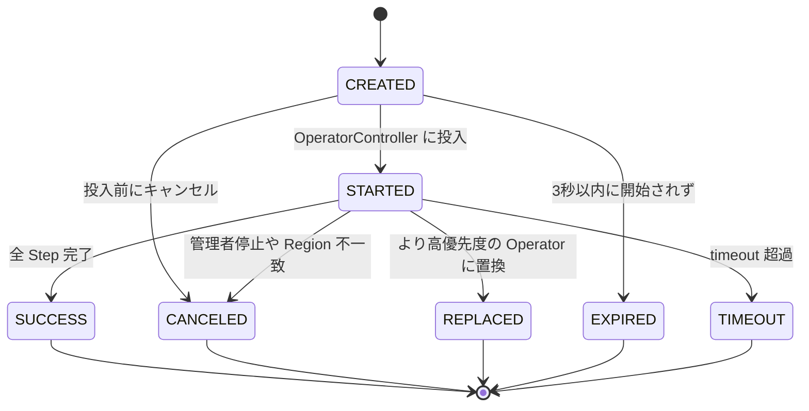
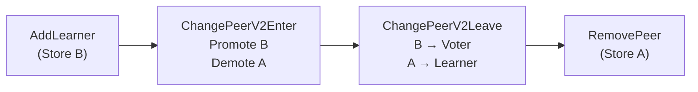

# 第11章 Operator と Step

> **本章で読むソース**
>
> - [`pkg/schedule/operator/operator.go`](https://github.com/tikv/pd/blob/v8.5.6/pkg/schedule/operator/operator.go)
> - [`pkg/schedule/operator/step.go`](https://github.com/tikv/pd/blob/v8.5.6/pkg/schedule/operator/step.go)
> - [`pkg/schedule/operator/status.go`](https://github.com/tikv/pd/blob/v8.5.6/pkg/schedule/operator/status.go)
> - [`pkg/schedule/operator/status_tracker.go`](https://github.com/tikv/pd/blob/v8.5.6/pkg/schedule/operator/status_tracker.go)
> - [`pkg/schedule/operator/builder.go`](https://github.com/tikv/pd/blob/v8.5.6/pkg/schedule/operator/builder.go)
> - [`pkg/schedule/operator/influence.go`](https://github.com/tikv/pd/blob/v8.5.6/pkg/schedule/operator/influence.go)
> - [`pkg/schedule/operator/kind.go`](https://github.com/tikv/pd/blob/v8.5.6/pkg/schedule/operator/kind.go)

## この章の狙い

PD のスケジューラやチェッカーが生成する指示は、すべて **Operator** という単位で表現される。
「Operator」は Region に対する変更操作の列であり、個々のアトミックな操作は **OpStep** インタフェースで抽象化されている。
本章では、Operator の構造体定義と状態遷移、OpStep の具体型、Builder による Operator の組み立て、OpInfluence によるフロー制限を読む。
最適化の工夫として、`Check` メソッドにおけるロックフリーの Step 進行と、`TotalInfluence` の計算結果キャッシュを機構レベルで説明する。

## 前提

[第9章](../part02-metadata/09-region-heartbeat.md)で Region ハートビートの受信経路を読んだ。
本章はスケジューリング基盤の中核であり、第10章で扱う Coordinator が Operator を受け取って Region に適用する流れの前提となる。
コード引用は tikv/pd のタグ `v8.5.6` に固定する。

## Operator 構造体

「Operator」は PD のスケジューリング決定を表す中心的なデータ構造である。
一つの「Operator」は一つの Region に対する操作列を保持する。

[`pkg/schedule/operator/operator.go L72-L89`](https://github.com/tikv/pd/blob/v8.5.6/pkg/schedule/operator/operator.go#L72-L89)

```go
type Operator struct {
	desc             string
	brief            string
	regionID         uint64
	regionEpoch      *metapb.RegionEpoch
	kind             OpKind
	steps            []OpStep
	stepsTime        []int64 // step finish time
	currentStep      int32
	status           OpStatusTracker
	level            constant.PriorityLevel
	Counters         []prometheus.Counter
	FinishedCounters []prometheus.Counter
	additionalInfos  opAdditionalInfo
	ApproximateSize  int64
	timeout          time.Duration
	influence        *OpInfluence
}
```

`steps` が「OpStep」の配列であり、先頭から順に実行される。
`currentStep` は現在実行中の Step のインデックスを示し、`atomic` パッケージで読み書きされる。
`stepsTime` は各 Step の完了時刻をナノ秒で記録する配列である。
`status` は後述する「OpStatusTracker」で、Operator の状態遷移を管理する。
`timeout` は全 Step のタイムアウトの合計であり、Operator 全体のタイムアウトとして使われる。
`influence` は後述する「TotalInfluence」の計算結果をキャッシュするフィールドである。

`NewOperator` は各 Step の `Timeout` を合計して Operator 全体のタイムアウトを算出する。

[`pkg/schedule/operator/operator.go L92-L117`](https://github.com/tikv/pd/blob/v8.5.6/pkg/schedule/operator/operator.go#L92-L117)

```go
func NewOperator(desc, brief string, regionID uint64, regionEpoch *metapb.RegionEpoch,
	kind OpKind, approximateSize int64, steps ...OpStep) *Operator {
	level := constant.Medium
	if kind&OpAdmin != 0 {
		level = constant.Urgent
	}
	maxDuration := float64(0)
	for _, v := range steps {
		maxDuration += v.Timeout(approximateSize).Seconds()
	}
	return &Operator{
		desc:        desc,
		brief:       brief,
		regionID:    regionID,
		regionEpoch: regionEpoch,
		kind:        kind,
		steps:       steps,
		stepsTime:   make([]int64, len(steps)),
		status:      NewOpStatusTracker(),
		level:       level,
		// ... (中略) ...
		ApproximateSize: approximateSize,
		timeout:         time.Duration(maxDuration) * time.Second,
	}
}
```

`OpAdmin` フラグが含まれる場合は優先度が `Urgent` に設定される。
それ以外の Operator は `Medium` 優先度で作成される。

## OpKind: Operator の分類

**OpKind** はビットフィールドで定義され、Operator がどの種類のスケジューラやチェッカーから生成されたかを表す。

[`pkg/schedule/operator/kind.go L33-L58`](https://github.com/tikv/pd/blob/v8.5.6/pkg/schedule/operator/kind.go#L33-L58)

```go
const (
	OpAdmin OpKind = 1 << iota
	OpAffinity
	OpMerge
	OpRange
	OpReplica
	OpSplit
	OpHotRegion
	OpRegion
	OpLeader
	OpWitnessLeader
	OpWitness
	opMax
)
```

ビットフィールドであるため、一つの Operator が複数の種別を兼ねられる。
たとえば Peer の移動とリーダー移転を含む Operator は `OpRegion | OpLeader` となる。

`SchedulerKind` メソッドは最下位ビットを取り出して、Operator の主たる種別を返す。

[`pkg/schedule/operator/operator.go L218-L224`](https://github.com/tikv/pd/blob/v8.5.6/pkg/schedule/operator/operator.go#L218-L224)

```go
func (o *Operator) SchedulerKind() OpKind {
	// LowBit ref: https://en.wikipedia.org/wiki/Find_first_set
	// 6(110) ==> 2(10)
	// 5(101) ==> 1(01)
	// 4(100) ==> 4(100)
	return o.kind & (-o.kind)
}
```

`kind & (-kind)` は最下位セットビットを抽出するビット演算である[^lowbit]。
「OpKind」の定義順が小さいほど優先度が高いため、`OpAdmin` は他のすべての種別より優先される。

[^lowbit]: 2の補数表現では `-kind` は `^kind + 1` であり、`kind & (-kind)` は最も低い位置にある 1 のビットだけを残す。

## OpStep インタフェースと具体 Step

「OpStep」は Operator を構成する個々のアトミックな操作を表すインタフェースである。

[`pkg/schedule/operator/step.go L54-L62`](https://github.com/tikv/pd/blob/v8.5.6/pkg/schedule/operator/step.go#L54-L62)

```go
type OpStep interface {
	fmt.Stringer
	ConfVerChanged(region *core.RegionInfo) uint64
	IsFinish(region *core.RegionInfo) bool
	CheckInProgress(ci *core.BasicCluster, config config.SharedConfigProvider, region *core.RegionInfo) error
	Influence(opInfluence *OpInfluence, region *core.RegionInfo)
	Timeout(regionSize int64) time.Duration
	GetCmd(region *core.RegionInfo, useConfChangeV2 bool) *hbstream.Operation
}
```

各メソッドの役割は次のとおりである。

- **`IsFinish`**：Region のハートビート情報から、この Step が完了したか判定する
- **`GetCmd`**：ハートビート応答に含めるスケジューリングコマンドを生成する
- **`Influence`**：この Step が Store に与える負荷の変化量を計算する
- **`Timeout`**：Region サイズに応じたタイムアウト時間を返す
- **`ConfVerChanged`**：この Step によって Region の ConfVer がいくつ増加するかを返す
- **`CheckInProgress`**：Step が実行可能な状態にあるかを検証する

以下では主要な具体 Step 型を読む。

### TransferLeader

**TransferLeader** は Region のリーダーを別の Store へ移転する Step である。

[`pkg/schedule/operator/step.go L65-L70`](https://github.com/tikv/pd/blob/v8.5.6/pkg/schedule/operator/step.go#L65-L70)

```go
type TransferLeader struct {
	FromStore, ToStore uint64
	ToStores []uint64
}
```

`ToStores` は複数候補のリーダー移転に対応するフィールドである。
`IsFinish` は Region の現在のリーダーが `ToStore` または `ToStores` のいずれかと一致すれば完了と判定する。

[`pkg/schedule/operator/step.go L82-L89`](https://github.com/tikv/pd/blob/v8.5.6/pkg/schedule/operator/step.go#L82-L89)

```go
func (tl TransferLeader) IsFinish(region *core.RegionInfo) bool {
	for _, storeID := range tl.ToStores {
		if region.GetLeader().GetStoreId() == storeID {
			return true
		}
	}
	return region.GetLeader().GetStoreId() == tl.ToStore
}
```

リーダー移転は Raft の内部操作であり、Peer の追加や削除を伴わない。
そのため `ConfVerChanged` は常に 0 を返し、`Timeout` は `fastStepWaitDuration` を使う。

`Influence` は転送元の `LeaderCount` と `LeaderSize` を減らし、転送先のそれらを増やす。

[`pkg/schedule/operator/step.go L114-L122`](https://github.com/tikv/pd/blob/v8.5.6/pkg/schedule/operator/step.go#L114-L122)

```go
func (tl TransferLeader) Influence(opInfluence *OpInfluence, region *core.RegionInfo) {
	from := opInfluence.GetStoreInfluence(tl.FromStore)
	to := opInfluence.GetStoreInfluence(tl.ToStore)

	from.LeaderSize -= region.GetApproximateSize()
	from.LeaderCount--
	to.LeaderSize += region.GetApproximateSize()
	to.LeaderCount++
}
```

### AddLearner と AddPeer

**AddLearner** は Region に Learner Peer を追加する Step である。

[`pkg/schedule/operator/step.go L446-L449`](https://github.com/tikv/pd/blob/v8.5.6/pkg/schedule/operator/step.go#L446-L449)

```go
type AddLearner struct {
	ToStore, PeerID, SendStore uint64
	IsLightWeight              bool
	IsWitness                  bool
}
```

`SendStore` はスナップショットの送信元 Store を指定するフィールドである。
「AddLearner」の `Timeout` は `slowStepWaitDuration` を使う。
Learner の追加にはスナップショット転送が必要であり、Region サイズに比例した時間がかかるためである。

**AddPeer** は Voter Peer を直接追加する Step である。
構造は「AddLearner」に似ているが、`SendStore` フィールドを持たない。

[`pkg/schedule/operator/step.go L143-L148`](https://github.com/tikv/pd/blob/v8.5.6/pkg/schedule/operator/step.go#L143-L148)

```go
type AddPeer struct {
	ToStore, PeerID uint64
	IsLightWeight   bool
	IsWitness       bool
}
```

実際の Operator 構築では、Builder が Voter 追加を「AddLearner + PromoteLearner」の2ステップに分解するため、`AddPeer` が直接使われる場面は限られる。

### PromoteLearner

**PromoteLearner** は Learner を Voter に昇格させる Step である。

[`pkg/schedule/operator/step.go L534-L538`](https://github.com/tikv/pd/blob/v8.5.6/pkg/schedule/operator/step.go#L534-L538)

```go
type PromoteLearner struct {
	ToStore, PeerID uint64
	IsWitness       bool
}
```

昇格は Raft の設定変更だけで完結し、データ転送を伴わない。
そのため `Influence` は空実装であり、`Timeout` は `fastStepWaitDuration` を返す。

### RemovePeer

**RemovePeer** は Region から Peer を削除する Step である。

[`pkg/schedule/operator/step.go L589-L594`](https://github.com/tikv/pd/blob/v8.5.6/pkg/schedule/operator/step.go#L589-L594)

```go
type RemovePeer struct {
	FromStore, PeerID uint64
	IsLightWeight     bool
	IsDownStore       bool
}
```

`IsFinish` は対象 Store 上に Peer が存在しなくなった時点で完了と判定する。
`IsDownStore` フラグが true の場合、`Influence` の計算でコストが `SmallRegionThreshold` に制限される。
ダウンした Store からの Peer 削除は実際のデータ移動を伴わないため、フロー制限の負荷を小さく見積もる設計である。

### MergeRegion

**MergeRegion** は2つの Region を統合する Step である。

[`pkg/schedule/operator/step.go L663-L674`](https://github.com/tikv/pd/blob/v8.5.6/pkg/schedule/operator/step.go#L663-L674)

```go
type MergeRegion struct {
	FromRegion *metapb.Region
	ToRegion   *metapb.Region
	// there are two regions involved in merge process,
	// so to keep them from other scheduler,
	// both of them should add MerRegion operatorStep.
	// But actually, TiKV just needs the region want to be merged to get the merge request,
	// thus use a IsPassive mark to indicate that
	// this region doesn't need to send merge request to TiKV.
	IsPassive bool
}
```

Region のマージには2つの Region が関与する。
マージのリクエストを TiKV に送る側（アクティブ側）と、マージ先として待機する側（パッシブ側）の2つの Operator がペアで作成される。
`IsPassive` が true の Operator は TiKV にコマンドを送らず、マージ先 Region のキーレンジが変化するのを待って完了と判定する。
コメントにあるとおり、パッシブ側の Operator は他のスケジューラがマージ対象の Region を操作しないようブロックする役割も担う。

### ChangePeerV2Enter と ChangePeerV2Leave（Joint Consensus）

Raft の Joint Consensus を利用して、複数の Peer の昇格と降格をアトミックに実行する Step である。

[`pkg/schedule/operator/step.go L826-L829`](https://github.com/tikv/pd/blob/v8.5.6/pkg/schedule/operator/step.go#L826-L829)

```go
type ChangePeerV2Enter struct {
	PromoteLearners []PromoteLearner
	DemoteVoters    []DemoteVoter
}
```

[`pkg/schedule/operator/step.go L963-L967`](https://github.com/tikv/pd/blob/v8.5.6/pkg/schedule/operator/step.go#L963-L967)

```go
type ChangePeerV2Leave struct {
	PromoteLearners []PromoteLearner
	DemoteVoters    []DemoteVoter
}
```

**ChangePeerV2Enter** が Joint State に入る操作、**ChangePeerV2Leave** が Joint State を抜ける操作である。
この2つの Step は常にペアで使われる。
Joint State 内では IncomingVoter と DemotingVoter が共存し、ここでリーダー移転を挟むことで、旧リーダーの降格と新リーダーの昇格を安全に行える。

### Step のタイムアウト算出

各 Step の `Timeout` は Region サイズに応じて2種類の計算式のいずれかを使う。

[`pkg/schedule/operator/step.go L1105-L1121`](https://github.com/tikv/pd/blob/v8.5.6/pkg/schedule/operator/step.go#L1105-L1121)

```go
func slowStepWaitDuration(regionSize int64) time.Duration {
	seconds := DefaultSlowExecutorRate * regionSize
	wait := time.Duration(seconds) * time.Second
	if wait < SlowStepWaitTime {
		wait = SlowStepWaitTime
	}
	return wait
}

func fastStepWaitDuration(regionSize int64) time.Duration {
	seconds := int64(DefaultFastExecutorRate * float64(regionSize))
	wait := time.Duration(seconds) * time.Second
	if wait < FastStepWaitTime {
		wait = FastStepWaitTime
	}
	return wait
}
```

`slowStepWaitDuration` は 6 秒/MB で Region サイズに比例し、下限が 10 分である。
スナップショットの転送を伴う「AddLearner」や「AddPeer」で使われる。
`fastStepWaitDuration` は 0.6 秒/MB で Region サイズに比例し、下限が 60 秒である。
リーダー移転や Peer 削除など、データ転送を伴わない操作で使われる。

下限値 60 秒は、大規模クラスタにおける Region ハートビートの遅延を考慮した設計である。
Region ハートビートのデフォルト間隔は 60 秒であるため、最低でもハートビートを1回受信するまでは Step の完了を確認できない。

以下の表は、主要な Step のタイムアウト区分と Influence への影響をまとめたものである。

| Step 型 | タイムアウト区分 | RegionCount | LeaderCount | StepCost |
|---|---|---|---|---|
| TransferLeader | fast | 変化なし | +1/-1 | なし |
| AddLearner | slow | +1 | 変化なし | AddPeer |
| AddPeer | slow | +1 | 変化なし | AddPeer |
| PromoteLearner | fast | 変化なし | 変化なし | なし |
| RemovePeer | fast | -1 | 変化なし | RemovePeer |
| MergeRegion | fast x10 | -1（パッシブ側） | -1（パッシブ側） | なし |
| ChangePeerV2Enter | fast x N | 変化なし | 変化なし | なし |
| ChangePeerV2Leave | fast x N | 変化なし | 変化なし | なし |

## Operator の状態遷移と OpStatusTracker

「Operator」のライフサイクルは **OpStatus** で管理される。

[`pkg/schedule/operator/status.go L25-L40`](https://github.com/tikv/pd/blob/v8.5.6/pkg/schedule/operator/status.go#L25-L40)

```go
const (
	CREATED OpStatus = iota
	STARTED
	SUCCESS
	CANCELED
	REPLACED
	EXPIRED
	TIMEOUT
	statusCount
	firstEndStatus = SUCCESS
)
```

「CREATED」は作成直後の状態であり、OperatorController に投入されると「STARTED」に遷移する。
「SUCCESS」以降の5つは終了状態であり、一度到達すると他の状態へ遷移できない。
`firstEndStatus` は `SUCCESS` に等しく、この値以上の状態はすべて終了状態と判定される。

許可される遷移は `validTrans` テーブルで静的に定義されている。

[`pkg/schedule/operator/status.go L45-L62`](https://github.com/tikv/pd/blob/v8.5.6/pkg/schedule/operator/status.go#L45-L62)

```go
var validTrans = transition{
	CREATED: {
		STARTED:  true,
		CANCELED: true,
		EXPIRED:  true,
	},
	STARTED: {
		SUCCESS:  true,
		CANCELED: true,
		REPLACED: true,
		TIMEOUT:  true,
	},
	SUCCESS:  {},
	CANCELED: {},
	REPLACED: {},
	EXPIRED:  {},
	TIMEOUT:  {},
}
```

以下の Mermaid 図は「Operator」の状態遷移を示す。



**OpStatusTracker** は「Operator」の状態遷移を排他制御つきで管理する構造体である。

[`pkg/schedule/operator/status_tracker.go L34-L38`](https://github.com/tikv/pd/blob/v8.5.6/pkg/schedule/operator/status_tracker.go#L34-L38)

```go
type OpStatusTracker struct {
	rw         syncutil.RWMutex
	current    OpStatus
	reachTimes statusTimes
}
```

`reachTimes` は `[firstEndStatus + 1]time.Time` 型の固定長配列である[^reach-times]。
非終了状態（CREATED, STARTED）はインデックスでそのまま格納し、終了状態は `firstEndStatus` のスロット1つを共有する。
Operator が到達する終了状態は高々1つであるため、この設計でメモリを節約している。

[^reach-times]: `statusTimes` は `status_tracker.go` L31 で `type statusTimes [firstEndStatus + 1]time.Time` と定義されている。

`To` メソッドは `validTrans` テーブルを参照して、遷移が許可されている場合のみ状態を更新する。

[`pkg/schedule/operator/status_tracker.go L80-L93`](https://github.com/tikv/pd/blob/v8.5.6/pkg/schedule/operator/status_tracker.go#L80-L93)

```go
func (trk *OpStatusTracker) To(dst OpStatus) bool {
	trk.rw.Lock()
	defer trk.rw.Unlock()
	return trk.toLocked(dst)
}

func (trk *OpStatusTracker) toLocked(dst OpStatus) bool {
	if dst < statusCount && validTrans[trk.current][dst] {
		trk.current = dst
		trk.setTime(trk.current, time.Now())
		return true
	}
	return false
}
```

遷移が無効な場合は何もせず false を返す。
これにより、終了状態からの再遷移は自動的に拒否される。

`CheckExpired` は「CREATED」状態のまま `OperatorExpireTime`（3秒）を超えた場合に「EXPIRED」へ遷移させる。

[`pkg/schedule/operator/status_tracker.go L111-L122`](https://github.com/tikv/pd/blob/v8.5.6/pkg/schedule/operator/status_tracker.go#L111-L122)

```go
func (trk *OpStatusTracker) CheckExpired(exp time.Duration) bool {
	trk.rw.Lock()
	defer trk.rw.Unlock()
	if trk.current == CREATED {
		if time.Since(trk.reachTimes[CREATED]) < exp {
			return false
		}
		_ = trk.toLocked(EXPIRED)
		return true
	}
	return trk.current == EXPIRED
}
```

`CheckTimeout` は「STARTED」状態のまま所定のタイムアウトを超えた場合に「TIMEOUT」へ遷移させる。

[`pkg/schedule/operator/status_tracker.go L125-L137`](https://github.com/tikv/pd/blob/v8.5.6/pkg/schedule/operator/status_tracker.go#L125-L137)

```go
func (trk *OpStatusTracker) CheckTimeout(duration time.Duration) bool {
	trk.rw.Lock()
	defer trk.rw.Unlock()
	if trk.current == STARTED {
		start := trk.getTime(STARTED)
		if time.Since(start) < duration {
			return false
		}
		_ = trk.toLocked(TIMEOUT)
		return true
	}
	return trk.current == TIMEOUT
}
```

## Operator の実行サイクル: Check メソッド

Region ハートビートが到着するたびに OperatorController が「Operator」の `Check` を呼び出す。
`Check` は現在の Step が完了しているか Region の状態から判定し、完了していれば次の Step へ進む。

[`pkg/schedule/operator/operator.go L371-L391`](https://github.com/tikv/pd/blob/v8.5.6/pkg/schedule/operator/operator.go#L371-L391)

```go
func (o *Operator) Check(region *core.RegionInfo) OpStep {
	if o.IsEnd() {
		return nil
	}
	// CheckTimeout will call CheckSuccess first
	defer func() { _ = o.CheckTimeout() }()
	for step := atomic.LoadInt32(&o.currentStep); int(step) < len(o.steps); step++ {
		if o.steps[int(step)].IsFinish(region) {
			current := time.Now()
			if atomic.CompareAndSwapInt64(&(o.stepsTime[step]), 0, current.UnixNano()) {
				startTime, _ := o.getCurrentTimeAndStep()
				operatorStepDuration.WithLabelValues(reflect.TypeOf(o.steps[int(step)]).Name()).
					Observe(current.Sub(startTime).Seconds())
			}
			atomic.StoreInt32(&o.currentStep, step+1)
		} else {
			return o.steps[int(step)]
		}
	}
	return nil
}
```

処理の流れは次のとおりである。

1. Operator が終了状態であれば nil を返す
2. `currentStep` から順に各 Step の `IsFinish` を呼び、完了した Step を飛ばす
3. 完了した Step の時刻を CAS で記録し、`currentStep` をアトミックにインクリメントする
4. 未完了の Step を見つけたらそれを返す（OperatorController がハートビート応答にコマンドとして埋め込む）
5. 全 Step が完了していれば nil を返す
6. `defer` で `CheckTimeout` を呼び、タイムアウト判定を行う

Step 完了時刻の記録に `CompareAndSwapInt64` を使っている点が重要である。
複数の goroutine が同時に `Check` を呼んでも、完了時刻は一度だけ記録される。
これによりミューテックスなしで Step の進行を安全に管理できる。

全 Step が完了すると `currentStep` が `len(steps)` に到達し、呼び出し元の `CheckSuccess` が「SUCCESS」への状態遷移を行う。

[`pkg/schedule/operator/operator.go L292-L297`](https://github.com/tikv/pd/blob/v8.5.6/pkg/schedule/operator/operator.go#L292-L297)

```go
func (o *Operator) CheckSuccess() bool {
	if atomic.LoadInt32(&o.currentStep) >= int32(len(o.steps)) {
		return o.status.To(SUCCESS) || o.Status() == SUCCESS
	}
	return false
}
```

## Builder: 目標配置から Operator を組み立てる

**Builder** は、目標とする Peer 配置を宣言的に指定し、そこから最適な Step 列を生成するための構造体である。

### Builder の使い方

Builder はメソッドチェーンによる DSL スタイルの API を提供する。

[`pkg/schedule/operator/builder.go L33-L37`](https://github.com/tikv/pd/blob/v8.5.6/pkg/schedule/operator/builder.go#L33-L37)

```go
//	op, err := NewBuilder(desc, cluster, region).
//	            RemovePeer(store1).
//	            AddPeer(peer1).
//	            SetLeader(store2).
//	            Build(kind)
```

`NewBuilder` は現在の Region の Peer 構成を `originPeers` に記録し、`targetPeers` を `originPeers` のコピーで初期化する。
`AddPeer`、`RemovePeer`、`SetLeader` などの各メソッドは `targetPeers` を変更するだけで、Step 列の生成は `Build` 呼び出し時まで遅延される。

`Build` は `prepareBuild` で差分を計算したあと、Joint Consensus の使用可否に応じて Step 列を構築する。

[`pkg/schedule/operator/builder.go L393-L413`](https://github.com/tikv/pd/blob/v8.5.6/pkg/schedule/operator/builder.go#L393-L413)

```go
func (b *Builder) Build(kind OpKind) (*Operator, error) {
	var brief string

	if b.err != nil {
		return nil, b.err
	}

	if brief, b.err = b.prepareBuild(); b.err != nil {
		return nil, b.err
	}
	if b.useJointConsensus {
		kind, b.err = b.buildStepsWithJointConsensus(kind)
	} else {
		kind, b.err = b.buildStepsWithoutJointConsensus(kind)
	}
	if b.err != nil {
		return nil, b.err
	}

	return NewOperator(b.desc, brief, b.regionID, b.regionEpoch, kind, b.approximateSize, b.steps...), nil
}
```

`prepareBuild` は `originPeers` と `targetPeers` の差分を計算し、追加（`toAdd`）、削除（`toRemove`）、昇格（`toPromote`）、降格（`toDemote`）の4つのマップに分類する。
Joint Consensus が無効な場合、Voter の降格は「RemovePeer + AddLearner」に分解され、`toDemote` ではなく `toRemove` と `toAdd` に振り分けられる。

### Joint Consensus パスと非 Joint Consensus パス

Builder は2つの Step 生成パスを持つ。

**Joint Consensus パス**（`buildStepsWithJointConsensus`）は、TiKV が ConfChangeV2 をサポートしており、かつ変更対象が2つ以上の場合に使われる。
このパスでは、Voter の追加を「AddLearner + ChangePeerV2Enter（Promote）」に分解し、Voter の削除を「ChangePeerV2Enter（Demote）+ RemovePeer」に分解する。
複数の昇格と降格を `ChangePeerV2Enter` / `ChangePeerV2Leave` のペアにまとめることで、Step 数を削減し、中間状態でレプリカ数が一時的に不足するリスクを回避する。

以下の Mermaid 図は、Peer を Store A から Store B へ移動する場合の Joint Consensus パスの Step 列を示す。



**非 Joint Consensus パス**（`buildStepsWithoutJointConsensus`）は、変更が1つだけの場合やクラスタが Joint Consensus をサポートしない場合に使われる。
このパスでは Peer の追加と削除を一つずつ実行し、各ステップの前後でリーダーの位置を調整する。

非 Joint Consensus パスでは、複数の実行計画候補から最適なものを選ぶために `stepPlanPreferFuncs` という優先順位関数のリストを使う。

[`pkg/schedule/operator/builder.go L1153-L1165`](https://github.com/tikv/pd/blob/v8.5.6/pkg/schedule/operator/builder.go#L1153-L1165)

```go
func (b *Builder) initStepPlanPreferFuncs() {
	b.stepPlanPreferFuncs = []func(stepPlan) int{
		b.planPreferReplaceByNearest, // 1. violate it affects replica safety.
		// 2-3 affects operator execution speed.
		b.planPreferUpStoreAsLeader, // 2. compare to 3, it is more likely to affect execution speed.
		b.planPreferOldPeerAsLeader, // 3. violate it may or may not affect execution speed.
		// 4-6 are less important as they are only trying to build the
		// operator with less leader transfer steps.
		b.planPreferAddOrPromoteTargetLeader, // 4. it is precondition of 5 so goes first.
		b.planPreferTargetLeader,             // 5. it may help 6 in later steps.
		b.planPreferLessLeaderTransfer,       // 6. trivial optimization to make the operator more tidy.
	}
}
```

最優先は `planPreferReplaceByNearest` であり、追加先と削除元のラベル距離が近いほど高スコアとなる。
ラベルの近さは `location-labels` で定義された階層のうち一致するラベル数で測る。
これにより、たとえば同じラック内での Peer 移動が、ラックをまたぐ移動より優先される。

## OpInfluence: Operator がもたらす Store 負荷の見積もり

PD は同時に多数の Operator を実行するが、特定の Store にスナップショット送受信が集中すると過負荷になる。
**OpInfluence** は、実行中の Operator 群が各 Store にどれだけの負荷変動を与えるかを集約するデータ構造である。

[`pkg/schedule/operator/influence.go L25-L28`](https://github.com/tikv/pd/blob/v8.5.6/pkg/schedule/operator/influence.go#L25-L28)

```go
type OpInfluence struct {
	mu              syncutil.RWMutex
	StoresInfluence map[uint64]*StoreInfluence
}
```

[`pkg/schedule/operator/influence.go L81-L88`](https://github.com/tikv/pd/blob/v8.5.6/pkg/schedule/operator/influence.go#L81-L88)

```go
type StoreInfluence struct {
	RegionSize   int64
	RegionCount  int64
	LeaderSize   int64
	LeaderCount  int64
	WitnessCount int64
	StepCost     map[storelimit.Type]int64
}
```

各 Step の `Influence` メソッドが「StoreInfluence」のカウンタを増減させる。
たとえば「TransferLeader」は転送元の `LeaderCount` を1減らし、転送先の `LeaderCount` を1増やす。
「AddLearner」は追加先の `RegionSize` と `RegionCount` を増やし、Region サイズに応じた `StepCost` を加算する。

`StepCost` の加算には `AdjustStepCost` が使われる。

[`pkg/schedule/operator/influence.go L139-L145`](https://github.com/tikv/pd/blob/v8.5.6/pkg/schedule/operator/influence.go#L139-L145)

```go
func (s *StoreInfluence) AdjustStepCost(limitType storelimit.Type, regionSize int64) {
	if regionSize > storelimit.SmallRegionThreshold {
		s.AddStepCost(limitType, storelimit.RegionInfluence[limitType])
	} else if regionSize > core.EmptyRegionApproximateSize {
		s.AddStepCost(limitType, storelimit.SmallRegionInfluence[limitType])
	}
}
```

Region サイズが `SmallRegionThreshold` を超える場合と小さい場合とでコストを分けている。
空の Region（`EmptyRegionApproximateSize` 以下）には Influence を加算しない。
OperatorController はこの集約値を使い、Store ごとのフロー制限を超えないよう新しい Operator の投入を抑制する。

## 高速化の工夫: TotalInfluence のキャッシュとロックフリー Step 進行

### TotalInfluence のキャッシュ

Operator の全 Step が Store に与える影響は、Operator の生存中に何度も問い合わせられる。
`TotalInfluence` は初回呼び出し時に計算結果を `influence` フィールドにキャッシュし、以降はキャッシュを加算するだけにする。

[`pkg/schedule/operator/operator.go L425-L438`](https://github.com/tikv/pd/blob/v8.5.6/pkg/schedule/operator/operator.go#L425-L438)

```go
func (o *Operator) TotalInfluence(opInfluence *OpInfluence, region *core.RegionInfo) {
	// skip if region is nil and not cache influence.
	if region == nil && o.influence == nil {
		return
	}
	if o.influence == nil {
		o.influence = NewOpInfluence()
		for step := range o.steps {
			o.steps[step].Influence(o.influence, region)
		}
	}
	opInfluence.Add(o.influence)
}
```

この仕組みにより、Operator ごとの Influence 計算は O(Step 数) を1回だけ行い、以降は O(Store 数) の加算で済む。
OperatorController が全 Operator の Influence を集約する場面で、Step 数が多い Operator の再計算コストを回避できる。

一方、`UnfinishedInfluence` は未完了の Step のみを対象とするため、キャッシュは使わず毎回計算する。

### ロックフリーの Step 進行

前述の `Check` メソッドは `currentStep` に `atomic.LoadInt32` / `atomic.StoreInt32` を、`stepsTime` に `atomic.CompareAndSwapInt64` を使う。
ミューテックスではなくアトミック操作で Step の進行を制御することで、ハートビート処理のホットパスでのロック競合を回避している。
状態遷移を管理する「OpStatusTracker」はミューテックスを使うが、Step 完了の判定と進行は Operator 構造体の atomic フィールドだけで完結するため、通常のハートビート処理ではミューテックスを取らずに済む。

## まとめ

「Operator」は PD のスケジューリング決定を表現する単位であり、「OpStep」の列として構成される。
各 Step は `IsFinish` で完了を判定し、`GetCmd` でハートビート応答に埋め込むコマンドを生成する。
Operator の状態は CREATED から STARTED を経て、SUCCESS、CANCELED、REPLACED、EXPIRED、TIMEOUT のいずれかの終了状態に至る。
Builder が現在の Peer 配置と目標配置の差分から最適な Step 列を生成し、Joint Consensus の利用可否に応じて構築パスを切り替える。
「OpInfluence」は Operator 群が Store に与える負荷を集約し、フロー制限の判断材料を提供する。

## 関連する章

- [第9章 Region ハートビートと統計収集](../part02-metadata/09-region-heartbeat.md)：ハートビートの受信経路を扱う。Operator の `Check` はハートビート処理時に呼ばれる。
- 第10章 Coordinator とスケジューリングループ：Coordinator がスケジューラから Operator を受け取り OperatorController に投入する流れを扱う。
- 第12章 OperatorController と完了追跡：OperatorController が Operator のライフサイクルを管理し、ハートビート応答にコマンドを埋め込む機構を扱う。
