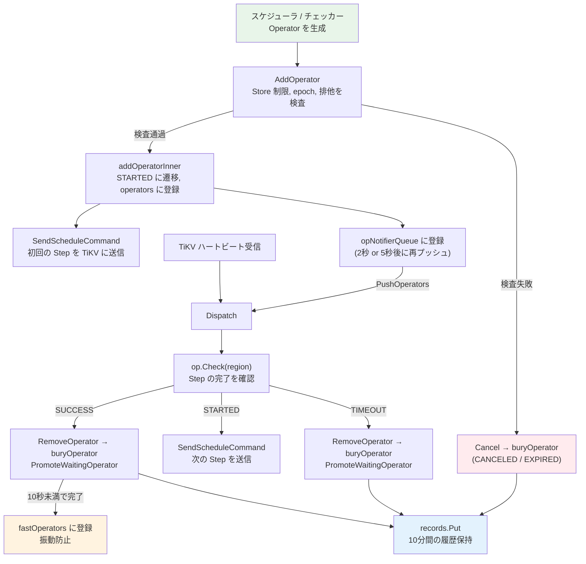

# 第12章 OperatorController と完了追跡

> **本章で読むソース**
>
> - [`pkg/schedule/operator/operator_controller.go`](https://github.com/tikv/pd/blob/v8.5.6/pkg/schedule/operator/operator_controller.go)
> - [`pkg/schedule/hbstream/heartbeat_streams.go`](https://github.com/tikv/pd/blob/v8.5.6/pkg/schedule/hbstream/heartbeat_streams.go)

## この章の狙い

スケジューラやチェッカーが生成した Operator を受け取り、TiKV へ送り届け、完了まで追跡する **`Controller`**（OperatorController）の仕組みを読む。
Operator の投入から完了までのライフサイクルを追い、同一 Region への多重 Operator を防ぐ排他制御、ハートビートごとの進捗確認、タイムアウト判定、完了履歴の保持を確認する。
最適化の工夫として、ハートビートを待たずに Operator を TiKV へ能動的にプッシュする **`opNotifierQueue`** と、短時間で完了した Operator の影響を一定期間保持する **`fastOperators`** の仕組みを機構レベルで説明する。

## 前提

第11章で Operator と Step の構造、すなわち `Operator` 構造体が複数の `OpStep` を順に実行する設計を読んだ。
本章はその Operator を管理する「コントローラ」側の仕組みを扱う。
コード引用は tikv/pd のタグ `v8.5.6` に固定する。

## Controller 構造体

**`Controller`** は、実行中の Operator を Region ID で管理し、TiKV への送信と完了追跡を担う構造体である。

[`pkg/schedule/operator/operator_controller.go L82-L105`](https://github.com/tikv/pd/blob/v8.5.6/pkg/schedule/operator/operator_controller.go#L82-L105)

```go
// Controller is used to limit the speed of scheduling.
type Controller struct {
	operators sync.Map
	ctx       context.Context
	config    config.SharedConfigProvider
	cluster   *core.BasicCluster
	hbStreams *hbstream.HeartbeatStreams

	// fast path, TTLUint64 is safe for concurrent.
	fastOperators *cache.TTLUint64

	// opNotifierQueue is a priority queue to notify the operator to be checked.
	// safe for concurrent.
	opNotifierQueue *concurrentHeapOpQueue

	// successCallbacks are called when an operator completes successfully.
	// Set during initialization, read-only afterwards (no lock needed).
	successCallbacks []func(op *Operator)

	// states
	records   *records // safe for concurrent
	wop       WaitingOperator
	wopStatus *waitingOperatorStatus
	counts    *opCounter
}
```

`operators` は `sync.Map` であり、Region ID をキーとして実行中の Operator を保持する。
`sync.Map` を使うことで、ハートビート処理やスケジューラなど複数のゴルーチンがロックなしに並行アクセスできる。
`hbStreams` は TiKV との gRPC ストリームをまとめた「ハートビートストリーム」であり、スケジューリング指示の送信に使う。
`fastOperators` は短時間で完了した Operator を TTL 付きキャッシュに保持するフィールドであり、後述する最適化に関わる。
`opNotifierQueue` は Operator を能動的にプッシュするための優先度キューである。
`records` は完了した Operator のステータスを一定時間保持する履歴キャッシュである。
`wop` は実行待ちの Operator を格納するキューであり、実行中の Operator が完了すると昇格する。

## AddOperator: Operator の投入と排他制御

スケジューラが生成した Operator は `AddOperator` メソッドで「コントローラ」に投入される。

[`pkg/schedule/operator/operator_controller.go L369-L394`](https://github.com/tikv/pd/blob/v8.5.6/pkg/schedule/operator/operator_controller.go#L369-L394)

```go
// AddOperator adds operators to the running operators.
func (oc *Controller) AddOperator(ops ...*Operator) bool {
	// ... (中略) ...
	if oc.ExceedStoreLimit(ops...) {
		for _, op := range ops {
			operatorCounter.WithLabelValues(op.Desc(), "exceed-limit").Inc()
			_ = op.Cancel(ExceedStoreLimit)
			oc.buryOperator(op)
		}
		return false
	}
	if pass, reason := oc.checkAddOperator(false, ops...); !pass {
		for _, op := range ops {
			_ = op.Cancel(reason)
			oc.buryOperator(op)
		}
		return false
	}
	for _, op := range ops {
		if !oc.addOperatorInner(op) {
			return false
		}
	}
	return true
}
```

投入には3段階の検査がある。

1. **Store レート制限**：`ExceedStoreLimit` が、Operator の影響する Store ごとのレート制限を確認する。制限を超えていれば Operator はキャンセルされる。
2. **投入前検査**：`checkAddOperator` が、Region の存在、epoch の一致、同一 Region に既存の同優先度以上の Operator がないこと、待機キューの上限を超えていないこと、Operator が期限切れでないことを確認する。
3. **実登録**：`addOperatorInner` が Operator を `operators` マップに登録し、TiKV への初回送信を行う。

### checkAddOperator の排他制御

`checkAddOperator` は同一 Region への多重 Operator を防ぐ中心的な検査である。

[`pkg/schedule/operator/operator_controller.go L462-L468`](https://github.com/tikv/pd/blob/v8.5.6/pkg/schedule/operator/operator_controller.go#L462-L468)

```go
		if oldi, ok := oc.operators.Load(op.RegionID()); ok && oldi.(*Operator) != nil && !isHigherPriorityOperator(op, oldi.(*Operator)) {
			old := oldi.(*Operator)
			log.Debug("already have operator, cancel add operator",
				zap.Uint64("region-id", op.RegionID()),
				zap.Reflect("old", old))
			operatorCounter.WithLabelValues(op.Desc(), "already-have").Inc()
			return false, AlreadyExist
		}
```

同じ Region に対して既に Operator が動いている場合、新しい Operator の優先度が高いときだけ投入が許可される。
優先度が同じか低ければ `AlreadyExist` として拒否される。
この仕組みにより、一つの Region に対して同時に一つの Operator だけが実行される。

### addOperatorInner: 登録と初回送信

投入検査を通過した Operator は `addOperatorInner` で実際に登録される。

[`pkg/schedule/operator/operator_controller.go L526-L597`](https://github.com/tikv/pd/blob/v8.5.6/pkg/schedule/operator/operator_controller.go#L526-L597)

```go
func (oc *Controller) addOperatorInner(op *Operator) bool {
	regionID := op.RegionID()

	// If there is an old operator, replace it. The priority should be checked
	// already.
	if oldi, ok := oc.operators.Load(regionID); ok {
		old := oldi.(*Operator)
		_ = oc.removeOperatorInner(old)
		_ = old.Replace()
		oc.buryOperator(old)
	}

	if !op.Start() {
		// ... (中略) ...
		return false
	}

	old, loaded := oc.operators.LoadOrStore(regionID, op)
	// ... (中略) ...
	oc.counts.inc(op.SchedulerKind())
	// ... (中略) ...
	var step OpStep
	if region := oc.cluster.GetRegion(op.RegionID()); region != nil {
		if step = op.Check(region); step != nil {
			oc.SendScheduleCommand(region, step, DispatchFromCreate)
		}
	}

	oc.opNotifierQueue.push(&operatorWithTime{op: op, time: getNextPushOperatorTime(step, time.Now())})
	// ... (中略) ...
	return true
}
```

処理の流れは次のとおりである。

1. 同じ Region に旧 Operator が残っていれば、削除して REPLACED 状態にする。
2. `op.Start()` で Operator のステータスを CREATED から STARTED に遷移させる。
3. `operators.LoadOrStore` で `sync.Map` にアトミックに登録する。
4. Operator が影響する Store のレート制限バジェットを消費する。
5. 現在の Region 状態で最初の Step を確認し、未完了であれば `SendScheduleCommand` で TiKV に指示を送る。
6. `opNotifierQueue` に登録して、能動的な再プッシュを予約する。

## Dispatch: ハートビートによる進捗確認

TiKV からハートビートが届くたびに、その Region に紐づく Operator の進捗が `Dispatch` メソッドで確認される。

[`pkg/schedule/operator/operator_controller.go L149-L206`](https://github.com/tikv/pd/blob/v8.5.6/pkg/schedule/operator/operator_controller.go#L149-L206)

```go
func (oc *Controller) Dispatch(region *core.RegionInfo, source string, recordOpStepWithTTL func(regionID uint64)) {
	if op := oc.GetOperator(region.GetID()); op != nil {
		// ... (中略) ...
		step := op.Check(region)
		switch op.Status() {
		case STARTED:
			operatorCounter.WithLabelValues(op.Desc(), "check").Inc()
			if source == DispatchFromHeartBeat && oc.checkStaleOperator(op, step, region) {
				return
			}
			oc.SendScheduleCommand(region, step, source)
		case SUCCESS:
			// ... (中略) ...
			if oc.RemoveOperator(op) {
				operatorCounter.WithLabelValues(op.Desc(), "promote-success").Inc()
				oc.PromoteWaitingOperator()
			}
			if time.Since(op.GetStartTime()) < FastOperatorFinishTime {
				oc.pushFastOperator(op)
			}
		case TIMEOUT:
			if oc.RemoveOperator(op, Timeout) {
				operatorCounter.WithLabelValues(op.Desc(), "promote-timeout").Inc()
				oc.PromoteWaitingOperator()
			}
		default:
			// CREATED, EXPIRED must not appear.
			// CANCELED, REPLACED must remove before transition.
			// ... (中略) ...
		}
	}
}
```

`Dispatch` の動作は、`op.Check(region)` を呼び出して Operator のステータスを更新したのち、ステータスに応じて分岐する。

- **STARTED**：Operator がまだ実行中である。ハートビート由来の場合は `checkStaleOperator` で Region epoch の不一致や Step の進行不能を検出し、問題があれば Operator を取り消す。問題がなければ `SendScheduleCommand` で次の Step を TiKV へ送る。
- **SUCCESS**：すべての Step が完了した。Operator を削除し、待機キューから次の Operator を昇格させる。完了までの所要時間が10秒未満であれば `fastOperators` キャッシュに登録する。
- **TIMEOUT**：Operator が制限時間を超えた。Operator を削除し、待機キューから昇格させる。

### Operator.Check による Step の進行

`Dispatch` が呼ぶ `op.Check(region)` は、Operator 内部の Step を順に確認し、完了した Step を進める。

[`pkg/schedule/operator/operator.go L371-L391`](https://github.com/tikv/pd/blob/v8.5.6/pkg/schedule/operator/operator.go#L371-L391)

```go
func (o *Operator) Check(region *core.RegionInfo) OpStep {
	if o.IsEnd() {
		return nil
	}
	// CheckTimeout will call CheckSuccess first
	defer func() { _ = o.CheckTimeout() }()
	for step := atomic.LoadInt32(&o.currentStep); int(step) < len(o.steps); step++ {
		if o.steps[int(step)].IsFinish(region) {
			// ... (中略) ...
			atomic.StoreInt32(&o.currentStep, step+1)
		} else {
			return o.steps[int(step)]
		}
	}
	return nil
}
```

`currentStep` をアトミック操作で読み書きしている点が特徴である。
TiKV からのハートビートと `opNotifierQueue` からのプッシュが並行して `Dispatch` を呼ぶ可能性があるため、ロックではなく `atomic.LoadInt32` / `atomic.StoreInt32` で Step の進行を管理している。
`defer` で `CheckTimeout` を呼ぶことで、Step の確認後に必ずタイムアウト判定が走る。

## SendScheduleCommand: Step からレスポンスメッセージへの変換

`SendScheduleCommand` は、現在の Step を TiKV が理解できる gRPC メッセージに変換して送信する。

[`pkg/schedule/operator/operator_controller.go L815-L827`](https://github.com/tikv/pd/blob/v8.5.6/pkg/schedule/operator/operator_controller.go#L815-L827)

```go
func (oc *Controller) SendScheduleCommand(region *core.RegionInfo, step OpStep, source string) {
	log.Info("send schedule command",
		zap.Uint64("region-id", region.GetID()),
		zap.Stringer("step", step),
		zap.String("source", source))

	useConfChangeV2 := versioninfo.IsFeatureSupported(oc.config.GetClusterVersion(), versioninfo.ConfChangeV2)
	cmd := step.GetCmd(region, useConfChangeV2)
	if cmd == nil {
		return
	}
	oc.hbStreams.SendMsg(region, cmd)
}
```

各 `OpStep` は `GetCmd` メソッドを持ち、自身を `Operation` 構造体に変換する。
`Operation` は `ChangePeer`、`TransferLeader`、`Merge`、`SplitRegion` などの protobuf メッセージを格納する構造体である。

[`pkg/schedule/hbstream/heartbeat_streams.go L37-L48`](https://github.com/tikv/pd/blob/v8.5.6/pkg/schedule/hbstream/heartbeat_streams.go#L37-L48)

```go
type Operation struct {
	ChangePeer *pdpb.ChangePeer
	// Pd can return transfer_leader to let TiKV does leader transfer itself.
	TransferLeader *pdpb.TransferLeader
	Merge          *pdpb.Merge
	// PD sends split_region to let TiKV split a region into two regions.
	SplitRegion     *pdpb.SplitRegion
	ChangePeerV2    *pdpb.ChangePeerV2
	SwitchWitnesses *pdpb.BatchSwitchWitness
	// PD requires preventing the auto-splitting of this region.
	ChangeSplit *pdpb.ChangeSplit
}
```

### HeartbeatStreams による非同期送信

`hbStreams.SendMsg` は `Operation` を `RegionHeartbeatResponse` に組み立て、バッファ付きチャネル `msgCh` に投入する。

[`pkg/schedule/hbstream/heartbeat_streams.go L202-L244`](https://github.com/tikv/pd/blob/v8.5.6/pkg/schedule/hbstream/heartbeat_streams.go#L202-L244)

```go
func (s *HeartbeatStreams) SendMsg(region *core.RegionInfo, op *Operation) {
	if region.GetLeader() == nil {
		return
	}

	var resp core.RegionHeartbeatResponse
	switch s.typ {
	// ... (中略) ...
	default:
		resp = &pdpb.RegionHeartbeatResponse{
			Header:          &pdpb.ResponseHeader{ClusterId: s.clusterID},
			RegionId:        region.GetID(),
			RegionEpoch:     region.GetRegionEpoch(),
			TargetPeer:      region.GetLeader(),
			ChangePeer:      op.ChangePeer,
			TransferLeader:  op.TransferLeader,
			Merge:           op.Merge,
			SplitRegion:     op.SplitRegion,
			ChangePeerV2:    op.ChangePeerV2,
			SwitchWitnesses: op.SwitchWitnesses,
			ChangeSplit:     op.ChangeSplit,
		}
	}

	select {
	case s.msgCh <- resp:
	case <-s.hbStreamCtx.Done():
	}
}
```

PD はハートビートのレスポンスにスケジューリング指示を載せて TiKV に返す。
`RegionHeartbeatResponse` の `ChangePeer` や `TransferLeader` フィールドに値が入っていれば、TiKV はそれを実行する。
`msgCh` は容量1024のバッファ付きチャネルであり、バックグラウンドの `run` ゴルーチンが消費して Store ごとの gRPC ストリームに送信する。

[`pkg/schedule/hbstream/heartbeat_streams.go L130-L156`](https://github.com/tikv/pd/blob/v8.5.6/pkg/schedule/hbstream/heartbeat_streams.go#L130-L156)

```go
		case msg := <-s.msgCh:
			storeID := msg.GetTargetPeer().GetStoreId()
			// ... (中略) ...
			if stream, ok := s.streams[storeID]; ok {
				if err := stream.Send(msg); err != nil {
					log.Warn("send heartbeat message fail",
						zap.Uint64("region-id", msg.GetRegionId()), errs.ZapError(errs.ErrGRPCSend, err))
					delete(s.streams, storeID)
					// ... (中略) ...
				}
			}
```

`TargetPeer` から Store ID を取り出し、対応する gRPC ストリームに `Send` する。
送信に失敗した場合はストリームを削除し、TiKV が再接続するまで送信をスキップする。

## タイムアウトと取り消し

Operator は2つの期限を持つ。

- **Expire（期限切れ）**：CREATED 状態のまま3秒以上経過すると EXPIRED になる。
- **Timeout（タイムアウト）**：STARTED 状態で実行を開始したのち、制限時間を超えると TIMEOUT になる。

Expire の閾値は `OperatorExpireTime` 定数で定義されている。

[`pkg/schedule/operator/operator.go L31-L34`](https://github.com/tikv/pd/blob/v8.5.6/pkg/schedule/operator/operator.go#L31-L34)

```go
const (
	// OperatorExpireTime is the duration that when an operator is not started
	// after it, the operator will be considered expired.
	OperatorExpireTime = 3 * time.Second
```

Timeout の制限時間は Operator 生成時に各 Step の `Timeout` メソッドの合計として算出される。

[`pkg/schedule/operator/operator.go L97-L100`](https://github.com/tikv/pd/blob/v8.5.6/pkg/schedule/operator/operator.go#L97-L100)

```go
	maxDuration := float64(0)
	for _, v := range steps {
		maxDuration += v.Timeout(approximateSize).Seconds()
	}
```

Step の種類によって制限時間は異なる。
`TransferLeader` や `PromoteLearner` のような軽量 Step は `FastStepWaitTime`（60秒）であり、`AddPeer` や `MergeRegion` のような重量 Step は `SlowStepWaitTime`（10分）に Region サイズに応じた加算がある。

### ステータスの状態遷移

Operator のステータスは `OpStatusTracker` が管理し、有効な遷移のみが許可される。

[`pkg/schedule/operator/status.go L25-L61`](https://github.com/tikv/pd/blob/v8.5.6/pkg/schedule/operator/status.go#L25-L61)

```go
const (
	CREATED OpStatus = iota
	STARTED
	SUCCESS  // Finished successfully
	CANCELED // Canceled due to some reason
	REPLACED // Replaced by a higher priority operator
	EXPIRED  // Didn't start to run for too long
	TIMEOUT  // Running for too long
)

var validTrans = transition{
	CREATED: {
		STARTED:  true,
		CANCELED: true,
		EXPIRED:  true,
	},
	STARTED: {
		SUCCESS:  true,
		CANCELED: true,
		REPLACED: true,
		TIMEOUT:  true,
	},
	// ... (中略) ...
}
```

CREATED から STARTED への遷移は `addOperatorInner` 内の `op.Start()` で行われる。
STARTED から先の遷移は、`Dispatch` 内の `op.Check(region)` が呼ぶ `CheckSuccess` と `CheckTimeout` によって自動的に判定される。

### buryOperator: 終了ステータスの記録

Operator が終了状態に到達すると、`buryOperator` がステータスに応じたログとメトリクスを出力し、`records` に記録する。

[`pkg/schedule/operator/operator_controller.go L707-L765`](https://github.com/tikv/pd/blob/v8.5.6/pkg/schedule/operator/operator_controller.go#L707-L765)

```go
func (oc *Controller) buryOperator(op *Operator) {
	st := op.Status()

	if !IsEndStatus(st) {
		// ... (中略) ...
		_ = op.Cancel(Unknown)
	}

	switch st {
	case SUCCESS:
		log.Info("operator finish",
			zap.Uint64("region-id", op.RegionID()),
			zap.Duration("takes", op.RunningTime()),
			zap.Reflect("operator", op),
			zap.String("additional-info", op.LogAdditionalInfo()))
		// ... (中略) ...
	case TIMEOUT:
		log.Info("operator timeout",
			zap.Uint64("region-id", op.RegionID()),
			zap.Duration("takes", op.RunningTime()),
			// ... (中略) ...
		)
	// ... (中略) ...
	}

	oc.records.Put(op)
}
```

終了状態でない Operator が `buryOperator` に渡された場合は、安全策として CANCELED に強制遷移させる。
最後に `oc.records.Put(op)` で履歴キャッシュに書き込む。

## OperatorRecords: 完了した Operator の履歴管理

完了した Operator のステータスは **`records`** 構造体で一定期間保持される。

[`pkg/schedule/operator/operator_controller.go L982-L994`](https://github.com/tikv/pd/blob/v8.5.6/pkg/schedule/operator/operator_controller.go#L982-L994)

```go
type records struct {
	ttl *cache.TTLUint64
}

const operatorStatusRemainTime = 10 * time.Minute

func newRecords(ctx context.Context) *records {
	return &records{
		ttl: cache.NewIDTTL(ctx, time.Minute, operatorStatusRemainTime),
	}
}
```

「レコード」は `cache.TTLUint64` を内部に持つ。
TTL は10分であり、完了から10分間は `GetOperatorStatus` で Operator のステータスを問い合わせることができる。
10分を過ぎるとエントリは自動的に削除される。

[`pkg/schedule/operator/operator_controller.go L1006-L1010`](https://github.com/tikv/pd/blob/v8.5.6/pkg/schedule/operator/operator_controller.go#L1006-L1010)

```go
func (o *records) Put(op *Operator) {
	id := op.RegionID()
	record := NewOpWithStatus(op)
	o.ttl.Put(id, record)
}
```

`Put` は Operator を `OpWithStatus` に包んでキャッシュに格納する。
キーは Region ID であるため、同じ Region に対する新しい Operator の記録が古い記録を上書きする。

[`pkg/schedule/operator/operator_controller.go L768-L774`](https://github.com/tikv/pd/blob/v8.5.6/pkg/schedule/operator/operator_controller.go#L768-L774)

```go
func (oc *Controller) GetOperatorStatus(id uint64) *OpWithStatus {
	if opi, ok := oc.operators.Load(id); ok && opi.(*Operator) != nil {
		op := opi.(*Operator)
		return NewOpWithStatus(op)
	}
	return oc.records.Get(id)
}
```

`GetOperatorStatus` はまず実行中の `operators` を探し、見つからなければ「レコード」から履歴を取得する。
pd-ctl や HTTP API が Operator のステータスを問い合わせるとき、この二段構えの検索が使われる。

## 能動プッシュと高速 Operator キャッシュ

ここまでの説明では、ハートビートが届いたときに `Dispatch` が呼ばれる受動的な経路を見てきた。
しかし、Region ハートビートのデフォルト間隔は60秒であり、ハートビートだけに頼るとスケジューリングの反映が遅れる。
PD はこの遅延を短縮するために、2つの仕組みを備えている。

### opNotifierQueue による能動プッシュ

`addOperatorInner` が Operator を登録する際、`opNotifierQueue` にも次回プッシュ時刻を設定して投入する。

[`pkg/schedule/operator/operator_controller.go L591`](https://github.com/tikv/pd/blob/v8.5.6/pkg/schedule/operator/operator_controller.go#L591)

```go
	oc.opNotifierQueue.push(&operatorWithTime{op: op, time: getNextPushOperatorTime(step, time.Now())})
```

プッシュ間隔は Step の種類によって異なる。

[`pkg/schedule/operator/operator_controller.go L243-L250`](https://github.com/tikv/pd/blob/v8.5.6/pkg/schedule/operator/operator_controller.go#L243-L250)

```go
func getNextPushOperatorTime(step OpStep, now time.Time) time.Time {
	nextTime := slowNotifyInterval
	switch step.(type) {
	case TransferLeader, PromoteLearner, ChangePeerV2Enter, ChangePeerV2Leave:
		nextTime = fastNotifyInterval
	}
	return now.Add(nextTime)
}
```

`TransferLeader` や `PromoteLearner` のように短時間で完了する Step は `fastNotifyInterval`（2秒）で再プッシュされる。
それ以外の Step は `slowNotifyInterval`（5秒）で再プッシュされる。
Coordinator のメインループが `PushOperators` を定期的に呼び出すことで、キューからの能動プッシュが実行される。

[`pkg/schedule/operator/operator_controller.go L297-L309`](https://github.com/tikv/pd/blob/v8.5.6/pkg/schedule/operator/operator_controller.go#L297-L309)

```go
func (oc *Controller) PushOperators(recordOpStepWithTTL func(regionID uint64)) {
	for {
		r, next := oc.pollNeedDispatchRegion()
		if !next {
			break
		}
		if r == nil {
			continue
		}

		oc.Dispatch(r, DispatchFromNotifierQueue, recordOpStepWithTTL)
	}
}
```

この仕組みにより、リーダー移動のような軽量操作は2秒ごとに進捗が確認される。
ハートビートの60秒間隔を待たずに済むため、スケジューリングのレイテンシが大幅に短縮される。

### fastOperators キャッシュ

Operator が10秒未満で完了すると、`fastOperators` に登録される。

[`pkg/schedule/operator/operator_controller.go L829-L831`](https://github.com/tikv/pd/blob/v8.5.6/pkg/schedule/operator/operator_controller.go#L829-L831)

```go
func (oc *Controller) pushFastOperator(op *Operator) {
	oc.fastOperators.Put(op.RegionID(), op)
}
```

「高速 Operator キャッシュ」の目的は、完了直後の Operator の影響をスケジューラに伝えることにある。
通常、Operator は完了すると `operators` マップから削除されるが、削除直後にスケジューラが走ると、完了した移動の影響を考慮せずに新しい Operator を生成してしまう。
`GetFastOpInfluence` がこのキャッシュを参照し、最近完了した Operator の影響をスケジューラの判断に反映することで、Region が往復移動する振動を防いでいる。

`FastOperatorFinishTime` は10秒、キャッシュの TTL も10秒であり、高速に完了した Operator の影響は完了後10秒間だけ保持される。

## Operator のライフサイクル

Operator の投入から完了までの流れを図で示す。



## まとめ

`Controller` は Operator の投入、実行、完了追跡を一手に担う。
同一 Region に対して同時に一つの Operator だけが実行される排他制御を `sync.Map` のアトミック操作で実現している。
ハートビート受信時の受動的な進捗確認に加え、`opNotifierQueue` による2秒/5秒間隔の能動プッシュがスケジューリングのレイテンシを短縮する。
完了した Operator は `records` に10分間保持され、`fastOperators` が直近の高速 Operator の影響を保持して振動を防ぐ。

## 関連する章

- 第11章「Operator と Step」：Operator の構造と Step の種類を扱った。本章はその Operator を管理するコントローラ側である。
- 第9章「[Region ハートビートと統計収集](../part02-metadata/09-region-heartbeat.md)」：TiKV からのハートビートの受信経路を読んだ。本章で扱った `Dispatch` はその経路の延長にある。
- 第10章「Coordinator とスケジューリングループ」：Coordinator が `PushOperators` を定期的に呼び出し、本章の能動プッシュを駆動する。
