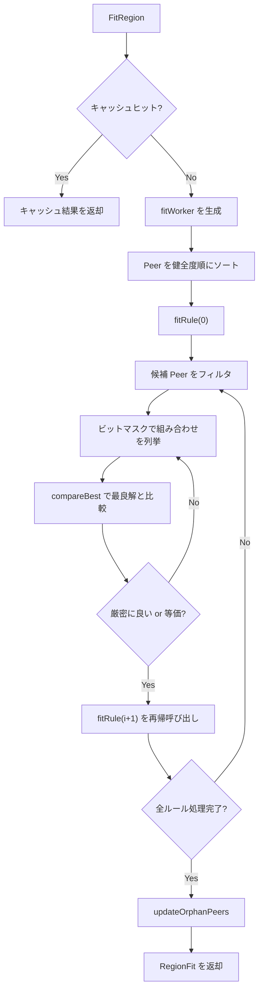

# 第13章 Placement Rules と制約充足

> **本章で読むソース**
>
> - [`pkg/schedule/placement/rule.go`](https://github.com/tikv/pd/blob/v8.5.6/pkg/schedule/placement/rule.go)
> - [`pkg/schedule/placement/rule_manager.go`](https://github.com/tikv/pd/blob/v8.5.6/pkg/schedule/placement/rule_manager.go)
> - [`pkg/schedule/placement/fit.go`](https://github.com/tikv/pd/blob/v8.5.6/pkg/schedule/placement/fit.go)
> - [`pkg/schedule/placement/label_constraint.go`](https://github.com/tikv/pd/blob/v8.5.6/pkg/schedule/placement/label_constraint.go)
> - [`pkg/schedule/placement/config.go`](https://github.com/tikv/pd/blob/v8.5.6/pkg/schedule/placement/config.go)
> - [`pkg/schedule/placement/rule_list.go`](https://github.com/tikv/pd/blob/v8.5.6/pkg/schedule/placement/rule_list.go)
> - [`pkg/schedule/placement/region_rule_cache.go`](https://github.com/tikv/pd/blob/v8.5.6/pkg/schedule/placement/region_rule_cache.go)

## この章の狙い

**Placement Rules** は Region の Peer をどの Store に、何個、どの Role（Voter, Leader, Follower, Learner）で配置するかを宣言的に指定する仕組みである。
ユーザーは SQL の `ALTER TABLE ... PLACEMENT POLICY` や pd-ctl を通じてルールを設定し、PD はそのルールに従って Region の Peer 構成を維持する。
本章では Rule の構造体、**RuleManager** によるルールのライフサイクル管理、`fitRegion` による制約充足アルゴリズム、**LabelConstraint** による Store フィルタリングを読み解く。

## 前提

第8章（Region メタデータ）と第11章（Operator）の知識を前提とする。
本章のコード引用はすべて tikv/pd のタグ `v8.5.6` に固定する。

---

## Rule 構造体

**Rule** は「あるキー範囲に対して、指定した条件の Store へ、指定した Role の Peer を N 個配置せよ」という宣言を表す構造体である。

[`pkg/schedule/placement/rule.go L56-74`](https://github.com/tikv/pd/blob/v8.5.6/pkg/schedule/placement/rule.go#L56-L74)

```go
type Rule struct {
	GroupID          string            `json:"group_id"`                    // mark the source that add the rule
	ID               string            `json:"id"`                          // unique ID within a group
	Index            int               `json:"index,omitempty"`             // rule apply order in a group, rule with less ID is applied first when indexes are equal
	Override         bool              `json:"override,omitempty"`          // when it is true, all rules with less indexes are disabled
	StartKey         []byte            `json:"-"`                           // range start key
	StartKeyHex      string            `json:"start_key"`                   // hex format start key, for marshal/unmarshal
	EndKey           []byte            `json:"-"`                           // range end key
	EndKeyHex        string            `json:"end_key"`                     // hex format end key, for marshal/unmarshal
	Role             PeerRoleType      `json:"role"`                        // expected role of the peers
	IsWitness        bool              `json:"is_witness"`                  // when it is true, it means the role is also a witness
	Count            int               `json:"count"`                       // expected count of the peers
	LabelConstraints []LabelConstraint `json:"label_constraints,omitempty"` // used to select stores to place peers
	LocationLabels   []string          `json:"location_labels,omitempty"`   // used to make peers isolated physically
	IsolationLevel   string            `json:"isolation_level,omitempty"`   // used to isolate replicas explicitly and forcibly
	// ... (中略) ... Version, CreateTimestamp, group フィールド
}
```

`GroupID` と `ID` の組が「Rule」のグローバルに一意なキーとなる。
`Key()` メソッドがこの二要素のタプルを返す。

[`pkg/schedule/placement/rule.go L99-102`](https://github.com/tikv/pd/blob/v8.5.6/pkg/schedule/placement/rule.go#L99-L102)

```go
func (r *Rule) Key() [2]string {
	return [2]string{r.GroupID, r.ID}
}
```

`Index` は同一グループ内での適用順序を制御し、`Override` が true の場合は同一グループ内でそれより小さい Index を持つルールをすべて無効化する。
`StartKey` と `EndKey` は「Rule」が適用されるキー範囲を指定し、空の場合はすべてのキー範囲に適用される。

`Role` は Peer に期待する役割を **PeerRoleType** として表す。
Voter（Leader と Follower の両方にマッチ）、Leader、Follower、Learner の4種類が定義されている（rule.go L26-37）。
`Count` はこの Role で配置すべき Peer の数を指定する。
`LabelConstraints` は後述する「LabelConstraint」のスライスで Peer を配置可能な Store を絞り込み、`LocationLabels` はラベル階層（例：zone, rack, host）を指定して Peer を物理的に分散させる。

### Rule のソート順

複数の「Rule」を適用する際の順序は `compareRule` で決まる。

[`pkg/schedule/placement/rule.go L152-173`](https://github.com/tikv/pd/blob/v8.5.6/pkg/schedule/placement/rule.go#L152-L173)

```go
func compareRule(a, b *Rule) int {
	switch {
	case a.groupIndex() < b.groupIndex():
		return -1
	case a.groupIndex() > b.groupIndex():
		return 1
	case a.GroupID < b.GroupID:
		return -1
	case a.GroupID > b.GroupID:
		return 1
	case a.Index < b.Index:
		return -1
	case a.Index > b.Index:
		return 1
	case a.ID < b.ID:
		return -1
	case a.ID > b.ID:
		return 1
	default:
		return 0
	}
}
```

比較の優先順位は、グループの Index、`GroupID`（辞書順）、「Rule」の `Index`、`ID`（辞書順）の4段階である。

---

## RuleGroup とルールの適用順序

**RuleGroup** はルールをグループ化するための構造体である。

[`pkg/schedule/placement/rule.go L118-122`](https://github.com/tikv/pd/blob/v8.5.6/pkg/schedule/placement/rule.go#L118-L122)

```go
type RuleGroup struct {
	ID       string `json:"id,omitempty"`
	Index    int    `json:"index,omitempty"`
	Override bool   `json:"override,omitempty"`
}
```

`Index` はグループ間の適用順序を決め、`Override` が true のグループはそれより前のすべてのグループのルールを無効化する。

ルールが `compareRule` でソートされた後、`prepareRulesForApply` が Override の効果を適用して最終的な適用対象を決定する。

[`pkg/schedule/placement/rule.go L191-208`](https://github.com/tikv/pd/blob/v8.5.6/pkg/schedule/placement/rule.go#L191-L208)

```go
func prepareRulesForApply(rules []*Rule) []*Rule {
	var res []*Rule
	var i, j int
	for i = 1; i < len(rules); i++ {
		if rules[j].GroupID != rules[i].GroupID {
			if rules[i].group != nil && rules[i].group.Override {
				res = res[:0] // override all previous groups
			} else {
				res = append(res, rules[j:i]...) // save rules belong to previous group
			}
			j = i
		}
		if rules[i].Override {
			j = i // skip all previous rules in the same group
		}
	}
	return append(res, rules[j:]...)
}
```

ソート済みのルール列を先頭から走査し、グループの境界で次のグループの `RuleGroup.Override` が true なら `res = res[:0]` でそれまでの蓄積をすべて捨てる。
グループ内では `Override` = true のルールが現れると `j = i` により同一グループ内のそれ以前のルールをスキップする。

ソースのコメント（L182-190）の具体例では、ruleD（group 2）、ruleC（group 3, RuleGroupB の Override=true）、ruleB と ruleA（group 4, ruleA の Override=true）の4ルールから、最終的に ruleA と ruleC の2つだけが残る。
ruleC のグループが Override=true で ruleD を消し、ruleA の Override=true が同一グループ内の ruleB を消すためである。

---

## LabelConstraint

**LabelConstraint** は Store のラベルに対する条件を1つ表す。

[`pkg/schedule/placement/label_constraint.go L46-50`](https://github.com/tikv/pd/blob/v8.5.6/pkg/schedule/placement/label_constraint.go#L46-L50)

```go
type LabelConstraint struct {
	Key    string            `json:"key,omitempty"`
	Op     LabelConstraintOp `json:"op,omitempty"`
	Values []string          `json:"values,omitempty"`
}
```

演算子は `In`, `NotIn`, `Exists`, `NotExists` の4種類である（label_constraint.go L28-39）。

`MatchStore` が1つの「LabelConstraint」を Store に対して評価する。

[`pkg/schedule/placement/label_constraint.go L53-67`](https://github.com/tikv/pd/blob/v8.5.6/pkg/schedule/placement/label_constraint.go#L53-L67)

```go
func (c *LabelConstraint) MatchStore(store *core.StoreInfo) bool {
	switch c.Op {
	case In:
		label := store.GetLabelValue(c.Key)
		return label != "" && slice.AnyOf(c.Values, func(i int) bool { return c.Values[i] == label })
	case NotIn:
		label := store.GetLabelValue(c.Key)
		return label == "" || slice.NoneOf(c.Values, func(i int) bool { return c.Values[i] == label })
	case Exists:
		return store.GetLabelValue(c.Key) != ""
	case NotExists:
		return store.GetLabelValue(c.Key) == ""
	}
	return false
}
```

`In` はラベルが存在し、かつ `Values` のいずれかに一致する場合に true を返す。
`NotIn` はラベルが存在しないか、`Values` のいずれにも一致しない場合に true を返す。
ラベルが存在しなくても `NotIn` は true になる点が `In` との非対称性である。

### 排他ラベルによる物理的隔離

`MatchLabelConstraints` は「LabelConstraint」のスライス全体で Store を評価するが、その前に排他ラベルのチェックを行う。

[`pkg/schedule/placement/label_constraint.go L82-95`](https://github.com/tikv/pd/blob/v8.5.6/pkg/schedule/placement/label_constraint.go#L82-L95)

```go
func MatchLabelConstraints(store *core.StoreInfo, constraints []LabelConstraint) bool {
	if store == nil {
		return false
	}

	for _, l := range store.GetLabels() {
		if isExclusiveLabel(l.GetKey()) &&
			slice.NoneOf(constraints, func(i int) bool { return constraints[i].Key == l.GetKey() }) {
			return false
		}
	}

	return slice.AllOf(constraints, func(i int) bool { return constraints[i].MatchStore(store) })
}
```

`isExclusiveLabel`（label_constraint.go L74-79）は、`$` で始まるラベルキーまたは `legacyExclusiveLabels`（`"engine"` と `"exclusive"`）に該当するキーを排他ラベルと判定する。
Store が排他ラベルを持っている場合、「Rule」の constraints がそのラベルキーを明示的に参照していなければ、その Store は候補から除外される。

この仕組みにより、TiFlash Store（`engine=tiflash` ラベルを持つ）は `engine` を constraints で明示的に指定した「Rule」だけにマッチし、通常の TiKV 向けルールが TiFlash に Peer を配置する事故を防いでいる。

---

## RuleManager

**RuleManager** はルールのライフサイクル（ロード、追加、削除、永続化）を管理する。

[`pkg/schedule/placement/rule_manager.go L53-66`](https://github.com/tikv/pd/blob/v8.5.6/pkg/schedule/placement/rule_manager.go#L53-L66)

```go
type RuleManager struct {
	ctx     context.Context
	storage endpoint.RuleStorage
	syncutil.RWMutex
	initialized bool
	ruleConfig  *ruleConfig
	ruleList    ruleList

	// used for rule validation
	keyType          string
	storeSetInformer core.StoreSetInformer
	cache            *RegionRuleFitCacheManager
	conf             config.SharedConfigProvider
}
```

`ruleConfig` がルールとグループのマスターデータを保持し、`ruleList` がキー範囲でインデックスされた適用済みルールのリストを保持する。

### 初期化

`Initialize`（rule_manager.go L82-153）はストレージからルールとグループをロードし、ルールが1つもなければレプリカ数（`maxReplica`）に応じた Voter ルールをデフォルトとして生成してストレージに保存する。
最後に `ruleConfig.adjust()` でグループポインタを設定し、`buildRuleList` でキー範囲インデックスを構築する。

### ルールの追加と削除

`SetRule` と `DeleteRule` は、パッチベースのトランザクション機構を使ってルールを更新する。
`BeginPatch()` で `RuleConfigPatch` を作り、変更を蓄積し、`TryCommitPatchLocked` で一括適用する。

[`pkg/schedule/placement/rule_manager.go L472-492`](https://github.com/tikv/pd/blob/v8.5.6/pkg/schedule/placement/rule_manager.go#L472-L492)

```go
func (m *RuleManager) TryCommitPatchLocked(patch *RuleConfigPatch) error {
	patch.adjust()

	ruleList, err := buildRuleList(patch)
	if err != nil {
		return err
	}

	patch.trim()

	// save updates
	err = m.savePatch(patch.mut)
	if err != nil {
		return err
	}

	// update in-memory state
	patch.commit()
	m.ruleList = ruleList
	return nil
}
```

`adjust()` がグループポインタを設定し、`buildRuleList` が新しい設定でルールリストを構築してバリデーションする。
構築に失敗すると変更は適用されない。
`trim()` が実質的に変化のない変更を除去し、`savePatch` がストレージに永続化し、`commit()` がインメモリの「ruleConfig」にマージする。
ストレージへの書き込みが成功してからインメモリ状態を更新する順序になっている。

---

## ruleConfig と RuleConfigPatch

**ruleConfig** はルールとグループをマップで保持する。

[`pkg/schedule/placement/config.go L24-27`](https://github.com/tikv/pd/blob/v8.5.6/pkg/schedule/placement/config.go#L24-L27)

```go
type ruleConfig struct {
	rules  map[[2]string]*Rule   // {group, id} => Rule
	groups map[string]*RuleGroup // id => RuleGroup
}
```

**RuleConfigPatch** は元の設定への参照（`c`）と、変更を蓄積するためのミューテーション用「ruleConfig」（`mut`）を保持する（config.go L90-93）。
`commit()` の呼び出し時に `mut` の内容が `c` へマージされる。
このパッチ方式により、`buildRuleList` によるバリデーションを変更の適用前に実行でき、不正な設定がインメモリ状態に入り込むことを防いでいる。

---

## ruleList とキー範囲の索引

**ruleList** はルールをキー範囲ごとにグループ化し、Region のキー範囲から適用すべきルールを高速に引くための索引構造である。

[`pkg/schedule/placement/rule_list.go L48-59`](https://github.com/tikv/pd/blob/v8.5.6/pkg/schedule/placement/rule_list.go#L48-L59)

```go
type rangeRules struct {
	startKey   []byte
	rules      []*Rule // all the rules match the given range
	applyRules []*Rule // selected rules after prepareRulesForApply
}

type ruleList struct {
	ranges    []rangeRules
	rangeList rangelist.List
}
```

`buildRuleList`（rule_list.go L67-117）が `rangelist.Builder` を使ってこの索引を構築する。
各キー範囲セグメントに対して `prepareRulesForApply` で適用対象を絞り、`checkApplyRules` で最低1つの Voter または Leader ルールが含まれることを検証する。

Region のキー範囲からルールを引くには `getRulesForApplyRange` を使う。

[`pkg/schedule/placement/rule_list.go L127-133`](https://github.com/tikv/pd/blob/v8.5.6/pkg/schedule/placement/rule_list.go#L127-L133)

```go
func (rl ruleList) getRulesForApplyRange(start, end []byte) []*Rule {
	i, data := rl.rangeList.GetData(start, end)
	if i < 0 || len(data) == 0 {
		return nil
	}
	return rl.ranges[i].applyRules
}
```

---

## FitRegion: フィッティングアルゴリズム

フィッティングは Placement Rules の中核処理である。
Region の現在の Peer 構成が適用ルールを満たしているかを判定し、最良の割り当て（**RegionFit**）を返す。
チェッカーはこの結果を見て、不足する Peer の追加や余剰 Peer の削除を Operator として生成する。

[`pkg/schedule/placement/rule_manager.go L420-436`](https://github.com/tikv/pd/blob/v8.5.6/pkg/schedule/placement/rule_manager.go#L420-L436)

```go
func (m *RuleManager) FitRegion(storeSet StoreSet, region *core.RegionInfo) (fit *RegionFit) {
	regionStores := getStoresByRegion(storeSet, region)
	rules := m.GetRulesForApplyRegion(region)
	var isCached bool
	if m.conf.IsPlacementRulesCacheEnabled() {
		if isCached, fit = m.cache.CheckAndGetCache(region, rules, regionStores); isCached && fit != nil {
			return fit
		}
	}
	fit = fitRegion(regionStores, region, rules, m.conf.IsWitnessAllowed())
	fit.regionStores = regionStores
	fit.rules = rules
	if isCached {
		m.SetRegionFitCache(region, fit)
	}
	return fit
}
```

キャッシュがヒットすればそのまま返し、ミスの場合は `fitRegion` を呼び出して結果をキャッシュに格納する。

`fitRegion`（fit.go L183-187）は **fitWorker** を生成して探索を実行する。

[`pkg/schedule/placement/fit.go L189-197`](https://github.com/tikv/pd/blob/v8.5.6/pkg/schedule/placement/fit.go#L189-L197)

```go
type fitWorker struct {
	stores         []*core.StoreInfo
	bestFit        RegionFit  // update during execution
	peers          []*fitPeer // p.selected is updated during execution.
	rules          []*Rule
	supportWitness bool
	needIsolation  bool
	exit           bool
}
```

`bestFit` は探索中に逐次更新される最良のフィッティング結果である。
`peers` は Region の各 Peer を `fitPeer` としてラップしたもので、`selected` フラグで割り当て済みかどうかを追跡する。
`needIsolation` は、いずれかのルールが `LocationLabels` を持つ場合に true になる。

`newFitWorker`（fit.go L212-228）では Peer を健全度スコア（`stateScore`）の降順にソートする。
健全な Peer を優先的にルールに割り当てることで、ダウンした Peer を OrphanPeers に回しやすくする。
`run()`（fit.go L230-233）は `fitRule(0)` を呼び出し、続いて `updateOrphanPeers(0)` で未割り当ての Peer を収集する。

### 再帰的なルールフィッティング

`fitRule` はルールのインデックスを引数に取り、再帰的にすべてのルールに対する最良の割り当てを探索する。

[`pkg/schedule/placement/fit.go L238-271`](https://github.com/tikv/pd/blob/v8.5.6/pkg/schedule/placement/fit.go#L238-L271)

```go
func (w *fitWorker) fitRule(index int) bool {
	if w.exit {
		return false
	}
	if index >= len(w.rules) {
		// If there is no isolation level and we already find one solution, we can early exit searching instead of
		// searching the whole cases.
		if !w.needIsolation && w.bestFit.IsSatisfied() {
			w.exit = true
		}
		return false
	}

	var candidates []*fitPeer
	if checkRule(w.rules[index], w.stores) {
		for _, p := range w.peers {
			if !p.selected && MatchLabelConstraints(p.store, w.rules[index].LabelConstraints) &&
				!(p.isLeader && w.supportWitness && w.rules[index].IsWitness) {
				candidates = append(candidates, p)
			}
		}
	}

	count := w.rules[index].Count
	if len(candidates) < count {
		count = len(candidates)
	}

	return w.fixRuleWithCandidates(candidates, index, count)
}
```

全ルールの処理が終わった時点で、`needIsolation` が false かつすでに充足していれば `exit` を true にして探索を打ち切る。
`LocationLabels` が設定されている場合は、より高い IsolationScore を持つ割り当てが存在する可能性があるため探索を継続する。

候補の Peer は、まだ他のルールに割り当てられておらず（`!p.selected`）、「LabelConstraint」を満たし、Leader を Witness として割り当てない、という3条件で絞り込まれる。

### ビットマスクによる組み合わせ列挙

`fixRuleWithCandidates` は候補 Peer から `count` 個を選ぶ全組み合わせをビットマスクで列挙する。

[`pkg/schedule/placement/fit.go L275-297`](https://github.com/tikv/pd/blob/v8.5.6/pkg/schedule/placement/fit.go#L275-L297)

```go
func (w *fitWorker) fixRuleWithCandidates(candidates []*fitPeer, index int, count int) bool {
	var better bool
	limit := uint(1<<len(candidates) - 1)
	binaryInt := uint(1<<count - 1)
	for ; binaryInt <= limit; binaryInt++ {
		if bits.OnesCount(binaryInt) != count {
			continue
		}
		selected := pickPeersFromBinaryInt(candidates, binaryInt)
		better = w.compareBest(selected, index) || better
		unSelectPeers(selected)
		if w.exit {
			break
		}
	}
	return better
}
```

`binaryInt` は `count` ビットが立った最小値から `limit`（全ビットが立った値）まで増加し、`bits.OnesCount` でビット数が `count` に等しい値だけを処理する。
これは C(len(candidates), count) 個の組み合わせの列挙に等しい。

### 最良解の比較と再帰

`compareBest` は新しい候補と現在の最良解を比較し、再帰的に後続ルールの探索を進める。

[`pkg/schedule/placement/fit.go L325-349`](https://github.com/tikv/pd/blob/v8.5.6/pkg/schedule/placement/fit.go#L325-L349)

```go
func (w *fitWorker) compareBest(selected []*fitPeer, index int) bool {
	rf := newRuleFit(w.rules[index], selected, w.supportWitness)
	cmp := 1
	if best := w.bestFit.RuleFits[index]; best != nil {
		cmp = compareRuleFit(rf, best)
	}

	switch cmp {
	case 1:
		w.bestFit.RuleFits[index] = rf
		// Reset previous result after position index.
		for i := index + 1; i < len(w.rules); i++ {
			w.bestFit.RuleFits[i] = nil
		}
		w.fitRule(index + 1)
		w.updateOrphanPeers(index + 1)
		return true
	case 0:
		if w.fitRule(index + 1) {
			w.bestFit.RuleFits[index] = rf
			return true
		}
	}
	return false
}
```

新しい「RuleFit」が既存の最良解より厳密に良い場合（`cmp == 1`）、`bestFit` を更新し、後続ルールの結果をすべてリセットしてから再帰する。
等価な場合（`cmp == 0`）は後続ルールの探索を試み、そちらが改善すればこちらも採用する。
劣る場合は何もしない。



---

## RegionFit と RuleFit

「RegionFit」は各ルールに対する **RuleFit** と、どのルールにも割り当てられなかった余剰 Peer（`OrphanPeers`）を保持する（fit.go L31-36）。

[`pkg/schedule/placement/fit.go L122-137`](https://github.com/tikv/pd/blob/v8.5.6/pkg/schedule/placement/fit.go#L122-L137)

```go
type RuleFit struct {
	Rule                   *Rule          `json:"rule"`
	Peers                  []*metapb.Peer `json:"peers"`
	PeersWithDifferentRole []*metapb.Peer `json:"peers-different-role"`
	IsolationScore         float64        `json:"isolation-score"`
	WitnessScore           int            `json:"witness-score"`
	stores                 []*core.StoreInfo
}
```

`Peers` はこのルールに割り当てられた Peer のリストで、`PeersWithDifferentRole` はルールで指定された Role と異なる Role を持つ Peer のサブセットである。

「RuleFit」の充足は `len(f.Peers) == f.Rule.Count && len(f.PeersWithDifferentRole) == 0` で判定される（fit.go L140-142）。
「RegionFit」全体の充足は、すべての「RuleFit」が充足しており OrphanPeers がないことである（fit.go L84-94）。

### RuleFit の比較

`compareRuleFit` は2つの「RuleFit」を4段階の優先順位で比較する。

[`pkg/schedule/placement/fit.go L153-174`](https://github.com/tikv/pd/blob/v8.5.6/pkg/schedule/placement/fit.go#L153-L174)

```go
func compareRuleFit(a, b *RuleFit) int {
	switch {
	case len(a.Peers) < len(b.Peers):
		return -1
	case len(a.Peers) > len(b.Peers):
		return 1
	case len(a.PeersWithDifferentRole) > len(b.PeersWithDifferentRole):
		return -1
	case len(a.PeersWithDifferentRole) < len(b.PeersWithDifferentRole):
		return 1
	case a.IsolationScore < b.IsolationScore:
		return -1
	case a.IsolationScore > b.IsolationScore:
		return 1
	case a.WitnessScore > b.WitnessScore:
		return -1
	case a.WitnessScore < b.WitnessScore:
		return 1
	default:
		return 0
	}
}
```

Peer 数が多いほうが良く、Role 不一致が少ないほうが良く、IsolationScore が高いほうが良く、WitnessScore が低いほうが良い。

---

## 分散スコア（IsolationScore）

`isolationScore` は割り当てられた Peer 群がラベル階層上でどの程度分散しているかを数値化する。

[`pkg/schedule/placement/fit.go L421-440`](https://github.com/tikv/pd/blob/v8.5.6/pkg/schedule/placement/fit.go#L421-L440)

```go
func isolationScore(peers []*fitPeer, labels []string) float64 {
	var score float64
	if len(labels) == 0 || len(peers) <= 1 {
		return 0
	}
	// NOTE: following loop is partially duplicated with `core.DistinctScore`.
	// The reason not to call it directly is that core.DistinctScore only
	// accepts `[]StoreInfo` not `[]*fitPeer` and I don't want alloc slice
	// here because it is kind of hot path.
	// After Go supports generics, we will be enable to do some refactor and
	// reuse `core.DistinctScore`.
	for i, p1 := range peers {
		for _, p2 := range peers[i+1:] {
			if index := p1.store.CompareLocation(p2.store, labels); index != -1 {
				score += math.Pow(replicaBaseScore, float64(len(labels)-index-1))
			}
		}
	}
	return score
}
```

**replicaBaseScore** は 100 である（fit.go L26）。
全 Peer のペアについて `CompareLocation` を呼び出し、2つの Store が最初に異なるラベルのインデックスを取得する。
スコアへの寄与は `100^(len(labels)-index-1)` である。

たとえば `LocationLabels` が `["zone", "rack", "host"]` の場合、zone レベルで異なるペアは 10000 を、rack レベルで異なるペアは 100 を、host レベルで異なるペアは 1 を加算する。
上位ラベルでの分散が指数的に高く評価されるため、可能な限り異なる zone に Peer を配置する割り当てが選ばれる。

コメント（L426-431）が述べるとおり、このループは `core.DistinctScore` と重複している。
`core.DistinctScore` は `[]StoreInfo` を引数に取るため、`[]*fitPeer` から変換するにはスライスのヒープ割り当てが必要になる。
フィッティングはハートビートごとに呼ばれるホットパスであり、割り当てを避けるためにコードを複製している。

---

## フィッティング結果のキャッシュ

**RegionRuleFitCacheManager** はフィッティング結果を Region 単位でキャッシュし、ハートビートごとの再計算を抑制する。

[`pkg/schedule/placement/region_rule_cache.go L41-45`](https://github.com/tikv/pd/blob/v8.5.6/pkg/schedule/placement/region_rule_cache.go#L41-L45)

```go
type RegionRuleFitCacheManager struct {
	mu           syncutil.RWMutex
	regionCaches map[uint64]*regionRuleFitCache
	storeCaches  map[uint64]*storeCache
}
```

`CheckAndGetCache`（region_rule_cache.go L64-78）はキャッシュエントリが存在し、`IsUnchanged` が true を返せばキャッシュヒットとする。
`IsUnchanged`（region_rule_cache.go L107-112）は Region の Peer トポロジ、ルール、Store の3要素がすべて変化していないことを確認する。

### 遅延キャッシュ格納

`SetCache` はキャッシュの格納を即座には行わない。

[`pkg/schedule/placement/region_rule_cache.go L81-95`](https://github.com/tikv/pd/blob/v8.5.6/pkg/schedule/placement/region_rule_cache.go#L81-L95)

```go
func (manager *RegionRuleFitCacheManager) SetCache(region *core.RegionInfo, fit *RegionFit) {
	// ... (中略) ... バリデーション
	manager.mu.Lock()
	defer manager.mu.Unlock()
	if cache, ok := manager.regionCaches[region.GetID()]; ok {
		cache.hitCount++
		if cache.hitCount >= minHitCountToCacheHit {
			cache.bestFit = fit
		}
		return
	}
	manager.regionCaches[region.GetID()] = manager.toRegionRuleFitCache(region, fit)
}
```

初回はキャッシュエントリを作成するが、`bestFit` は nil、`hitCount` は 0 のままである（`toRegionRuleFitCache`、region_rule_cache.go L141-149）。
以降の呼び出しで `hitCount` がインクリメントされ、**`minHitCountToCacheHit`**（= 10、region_rule_cache.go L25）に達して初めて `bestFit` が格納される。
トポロジが頻繁に変化する不安定な Region では `IsUnchanged` が false を返すためヒットカウントが蓄積されず、実質的にキャッシュが有効化されない。

キャッシュの無効化条件はソースのコメント（region_rule_cache.go L28-40）に列挙されている。
Region の Peer トポロジ変更、ダウン Peer の存在、リーダー変更、ルール変更、Store のトポロジ変更、Store のラベル変更、Store の状態変更の7つである。

---

## 高速化の工夫

本章で読んだコードには3つの最適化が含まれている。

1つ目は「RegionRuleFitCacheManager」によるフィッティング結果のキャッシュである。
ハートビートごとに `FitRegion` を再計算するコストを、キャッシュヒット時にはルックアップだけで済ませている。
`minHitCountToCacheHit` = 10 という閾値により、不安定な Region にはキャッシュを格納しない。

2つ目は `needIsolation` フラグによる早期終了である。
どのルールも `LocationLabels` を持たない場合、最初に充足する割り当てが見つかった時点で `exit` = true として残りの組み合わせ探索をスキップする（fit.go L244-248）。
`LocationLabels` がないため IsolationScore は常に 0 であり、最初の充足解が最良解と等価になるからである。

3つ目は `isolationScore` のアロケーション回避である。
`core.DistinctScore` が `[]StoreInfo` を要求するのに対し、フィッティングでは `[]*fitPeer` で Peer を管理している。
変換用のスライスをヒープに確保するのを避けるため、ループを複製してインライン化している（fit.go L426-431）。

---

## まとめ

Placement Rules は宣言的なレプリカ配置の仕組みである。
「Rule」構造体がキー範囲、Role、数、ラベル制約を1つの宣言にまとめる。
「RuleManager」がパッチベースのトランザクション機構でルールのライフサイクルを管理し、バリデーションを通過した変更だけがインメモリ状態に反映される。
「ruleList」がキー範囲で索引化されたルールリストを提供し、Region からの高速な引き当てを可能にする。
「LabelConstraint」と排他ラベルの仕組みが、TiFlash のような異種 Store の物理的隔離を実現する。
`fitRegion` がビットマスクベースの組み合わせ探索で最良の Peer 割り当てを求め、`compareRuleFit` の4段階の優先順位で解の品質を評価する。
「RegionRuleFitCacheManager」がヒットカウントに基づく遅延キャッシュで、安定した Region に対するフィッティングの再計算コストを削減する。

---

## 関連する章

- 第8章: Region メタデータと RegionTree（RegionInfo の構造を扱う）
- 第11章: Operator と Step（フィッティング結果から生成される Operator を扱う）
- 第12章: OperatorController と完了追跡（生成された Operator のディスパッチを扱う）
- 第17章: ReplicaChecker と RuleChecker（RuleChecker が `FitRegion` を呼び出してルール違反を検出し Operator を生成する）
