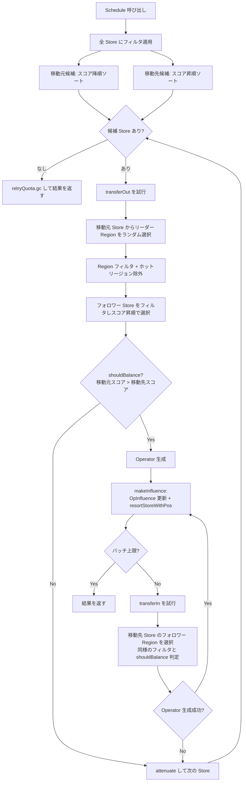

# 第14章 balance-leader スケジューラ

> **本章で読むソース**
>
> - [`pkg/schedule/schedulers/balance_leader.go`](https://github.com/tikv/pd/blob/v8.5.6/pkg/schedule/schedulers/balance_leader.go)
> - [`pkg/schedule/schedulers/utils.go`](https://github.com/tikv/pd/blob/v8.5.6/pkg/schedule/schedulers/utils.go)（`solver`、`retryQuota`）
> - [`pkg/core/store.go`](https://github.com/tikv/pd/blob/v8.5.6/pkg/core/store.go)（`LeaderScore`）
> - [`pkg/schedule/filter/filters.go`](https://github.com/tikv/pd/blob/v8.5.6/pkg/schedule/filter/filters.go)
> - [`pkg/schedule/filter/region_filters.go`](https://github.com/tikv/pd/blob/v8.5.6/pkg/schedule/filter/region_filters.go)

## この章の狙い

**balance-leader スケジューラ**は、クラスタ内の Store 間でリーダーの負荷を均等化する組み込みスケジューラである。
リーダースコアの計算からバランス判定、Operator 生成までの処理フローを読み、バッチ生成における増分ソートの最適化を機構レベルで説明する。

## 前提

[第10章](../part03-scheduling/10-coordinator.md)で Coordinator がスケジューラを起動し実行ループを回す仕組みを読んだ。
[第11章](../part03-scheduling/11-operator-and-step.md)で Operator の構造体と OpInfluence を読んだ。
[第13章](../part03-scheduling/13-placement-rules.md)で Placement Rules による配置制約を読んだ。
本章はこれらの基盤の上で、具体的なスケジューラの実装を読む最初の章である。
コード引用は tikv/pd のタグ `v8.5.6` に固定する。

---

## balanceLeaderScheduler の構造体

`balanceLeaderScheduler` は `BaseScheduler` を埋め込み、リトライ制御用の `retryQuota`、設定、フィルタ群を保持する。

[`pkg/schedule/schedulers/balance_leader.go L158-L165`](https://github.com/tikv/pd/blob/v8.5.6/pkg/schedule/schedulers/balance_leader.go#L158-L165)

```go
type balanceLeaderScheduler struct {
	*BaseScheduler
	*retryQuota
	conf          *balanceLeaderSchedulerConfig
	handler       http.Handler
	filters       []filter.Filter
	filterCounter *filter.Counter
}
```

コンストラクタ `newBalanceLeaderScheduler` が `filters` に2種類のフィルタを設定する。

[`pkg/schedule/schedulers/balance_leader.go L169-L185`](https://github.com/tikv/pd/blob/v8.5.6/pkg/schedule/schedulers/balance_leader.go#L169-L185)

```go
func newBalanceLeaderScheduler(opController *operator.Controller, conf *balanceLeaderSchedulerConfig, options ...BalanceLeaderCreateOption) Scheduler {
	s := &balanceLeaderScheduler{
		BaseScheduler: NewBaseScheduler(opController, types.BalanceLeaderScheduler, conf),
		retryQuota:    newRetryQuota(),
		conf:          conf,
		handler:       newBalanceLeaderHandler(conf),
	}
	// ... (中略) ...
	s.filters = []filter.Filter{
		&filter.StoreStateFilter{ActionScope: s.GetName(), TransferLeader: true, OperatorLevel: constant.High},
		filter.NewSpecialUseFilter(s.GetName()),
	}
	s.filterCounter = filter.NewCounter(s.GetName())
	return s
}
```

**StoreStateFilter** はリーダー移動元と移動先の Store の状態（ダウン、削除中、ビジーなど）を検査する。
**specialUseFilter** は `specialUse` ラベルが付いた Store（ホットリージョン用や予約用途）を除外する。
これらのフィルタはスケジューラの生存期間を通じて共有され、`Schedule` の呼び出しごとに再生成しない。

スケジューラが Operator を生成してよいかの上限判定は `IsScheduleAllowed` が担う。

[`pkg/schedule/schedulers/balance_leader.go L224-L230`](https://github.com/tikv/pd/blob/v8.5.6/pkg/schedule/schedulers/balance_leader.go#L224-L230)

```go
func (s *balanceLeaderScheduler) IsScheduleAllowed(cluster sche.SchedulerCluster) bool {
	allowed := s.OpController.OperatorCount(operator.OpLeader) < cluster.GetSchedulerConfig().GetLeaderScheduleLimit()
	if !allowed {
		operator.IncOperatorLimitCounter(s.GetType(), operator.OpLeader)
	}
	return allowed
}
```

実行中のリーダー Operator の数が `LeaderScheduleLimit` 未満のときだけ、新たな Operator の生成を許可する。

## Schedule メソッドの処理フロー

`Schedule` メソッドはスケジューリングループから呼ばれ、リーダー移動の Operator をバッチで生成する。

[`pkg/schedule/schedulers/balance_leader.go L325-L375`](https://github.com/tikv/pd/blob/v8.5.6/pkg/schedule/schedulers/balance_leader.go#L325-L375)

```go
func (s *balanceLeaderScheduler) Schedule(cluster sche.SchedulerCluster, dryRun bool) ([]*operator.Operator, []plan.Plan) {
	// ... (中略) ...
	leaderSchedulePolicy := cluster.GetSchedulerConfig().GetLeaderSchedulePolicy()
	opInfluence := s.OpController.GetOpInfluence(cluster.GetBasicCluster())
	kind := constant.NewScheduleKind(constant.LeaderKind, leaderSchedulePolicy)
	solver := newSolver(basePlan, kind, cluster, opInfluence)

	stores := cluster.GetStores()
	scoreFunc := func(store *core.StoreInfo) float64 {
		return store.LeaderScore(solver.kind.Policy, solver.getOpInfluence(store.GetID()))
	}
	sourceCandidate := newCandidateStores(filter.SelectSourceStores(stores, s.filters, cluster.GetSchedulerConfig(), collector, s.filterCounter), false, scoreFunc)
	targetCandidate := newCandidateStores(filter.SelectTargetStores(stores, s.filters, cluster.GetSchedulerConfig(), nil, s.filterCounter), true, scoreFunc)
	usedRegions := make(map[uint64]struct{})

	result := make([]*operator.Operator, 0, batch)
	for sourceCandidate.hasStore() || targetCandidate.hasStore() {
		if sourceCandidate.hasStore() {
			op := createTransferLeaderOperator(sourceCandidate, transferOut, s, solver, usedRegions, collector)
			if op != nil {
				result = append(result, op)
				if len(result) >= batch {
					return result, collector.GetPlans()
				}
				makeInfluence(op, solver, usedRegions, sourceCandidate, targetCandidate)
			}
		}
		if targetCandidate.hasStore() {
			op := createTransferLeaderOperator(targetCandidate, transferIn, s, solver, usedRegions, nil)
			if op != nil {
				result = append(result, op)
				if len(result) >= batch {
					return result, collector.GetPlans()
				}
				makeInfluence(op, solver, usedRegions, sourceCandidate, targetCandidate)
			}
		}
	}
	s.retryQuota.gc(append(sourceCandidate.stores, targetCandidate.stores...))
	return result, collector.GetPlans()
}
```

処理は以下の手順で進む。

1. クラスタ設定から `leaderSchedulePolicy`（ByCount または BySize）を取得し、`solver` を生成する。
2. 全 Store にフィルタを適用し、移動元候補（スコア降順）と移動先候補（スコア昇順）の2つの `candidateStores` を作る。
3. ループの各反復で、移動元候補からの `transferOut` と移動先候補からの `transferIn` を試みる。
4. Operator を生成できたら `makeInfluence` で OpInfluence を更新し、候補リストを増分ソートで修正する。
5. バッチサイズに達するか候補がなくなるまで繰り返す。

バッチサイズは定数で定義される。

[`pkg/schedule/schedulers/balance_leader.go L42-L52`](https://github.com/tikv/pd/blob/v8.5.6/pkg/schedule/schedulers/balance_leader.go#L42-L52)

```go
const (
	BalanceLeaderBatchSize    = 4
	MaxBalanceLeaderBatchSize = 10
	transferIn  = "transfer-in"
	transferOut = "transfer-out"
)
```

デフォルトでは1回の `Schedule` 呼び出しで最大4個の Operator を生成する。
設定で変更できるが、上限は10である。

## リーダースコアの計算

リーダーの負荷を数値化する **LeaderScore** は `StoreInfo` のメソッドである。

[`pkg/core/store.go L412-L421`](https://github.com/tikv/pd/blob/v8.5.6/pkg/core/store.go#L412-L421)

```go
func (s *StoreInfo) LeaderScore(policy constant.SchedulePolicy, delta int64) float64 {
	switch policy {
	case constant.BySize:
		return float64(s.GetLeaderSize()+delta) / math.Max(s.GetLeaderWeight(), minWeight)
	case constant.ByCount:
		return float64(int64(s.GetLeaderCount())+delta) / math.Max(s.GetLeaderWeight(), minWeight)
	default:
		return 0
	}
}
```

`policy` が `BySize` の場合はリーダー Region の合計サイズ、`ByCount` の場合はリーダー Region の個数を**リーダーウェイト**で除算する。
`delta` は OpInfluence の補正値であり、実行中の Operator による将来の変化を先取りしてスコアに反映する。
「リーダーウェイト」は Store ごとに設定可能な重みで、値を下げるとスコアが上がりリーダーが移動しやすくなる。

## Store の候補選択

**candidateStores** はスコア順にソートされた Store のリストを保持し、順にイテレートする構造体である。

[`pkg/schedule/schedulers/balance_leader.go L232-L265`](https://github.com/tikv/pd/blob/v8.5.6/pkg/schedule/schedulers/balance_leader.go#L232-L265)

```go
type candidateStores struct {
	stores   []*core.StoreInfo
	getScore func(*core.StoreInfo) float64
	index    int
	asc      bool
}

func newCandidateStores(stores []*core.StoreInfo, asc bool, getScore func(*core.StoreInfo) float64) *candidateStores {
	cs := &candidateStores{stores: stores, getScore: getScore, asc: asc}
	sort.Slice(cs.stores, cs.sortFunc())
	return cs
}

// ... (中略) ...

func (cs *candidateStores) less(iID uint64, scorei float64, jID uint64, scorej float64) bool {
	if typeutil.Float64Equal(scorei, scorej) {
		return iID > jID
	}
	if cs.asc {
		return scorei < scorej
	}
	return scorei > scorej
}
```

移動元候補は `asc=false`（スコア降順）で生成され、スコアの高い Store から順にリーダーを移動する。
移動先候補は `asc=true`（スコア昇順）で生成され、スコアの低い Store を優先してリーダーを受け入れる。
スコアが等しい場合は Store ID が大きいほうを先に処理する。
これはスコアの同値で安定した順序を保証するための決定的なタイブレイクである。

## transferLeaderOut と transferLeaderIn

Operator の生成は `createTransferLeaderOperator` が「candidateStores」から1つの Store を取り出して行う。

[`pkg/schedule/schedulers/balance_leader.go L377-L409`](https://github.com/tikv/pd/blob/v8.5.6/pkg/schedule/schedulers/balance_leader.go#L377-L409)

```go
func createTransferLeaderOperator(cs *candidateStores, dir string, s *balanceLeaderScheduler,
	ssolver *solver, usedRegions map[uint64]struct{}, collector *plan.Collector) *operator.Operator {
	store := cs.getStore()
	retryLimit := s.retryQuota.getLimit(store)
	var creator func(*solver, *plan.Collector) *operator.Operator
	switch dir {
	case transferOut:
		ssolver.Source, ssolver.Target = store, nil
		creator = s.transferLeaderOut
	case transferIn:
		ssolver.Source, ssolver.Target = nil, store
		creator = s.transferLeaderIn
	}
	var op *operator.Operator
	for range retryLimit {
		if op = creator(ssolver, collector); op != nil {
			if _, ok := usedRegions[op.RegionID()]; !ok {
				break
			}
			op = nil
		}
	}
	if op != nil {
		s.retryQuota.resetLimit(store)
	} else {
		s.attenuate(store)
		cs.next()
	}
	return op
}
```

方向が `transferOut` なら移動元 Store を固定して移動先を探索し、`transferIn` なら移動先 Store を固定して移動元を探索する。
`retryLimit` 回まで Operator 生成を試み、すでに同じバッチ内で使用した Region（`usedRegions`）に該当する Operator は捨てて再試行する。
生成に成功したらリトライ上限をリセットし、失敗したら上限を減衰させて次の Store に進む。

### transferLeaderOut の探索

`transferLeaderOut` は移動元 Store からリーダー Region をランダムに選び、その Region のフォロワーの中から最適な移動先を探す。

[`pkg/schedule/schedulers/balance_leader.go L429-L477`](https://github.com/tikv/pd/blob/v8.5.6/pkg/schedule/schedulers/balance_leader.go#L429-L477)

```go
func (s *balanceLeaderScheduler) transferLeaderOut(solver *solver, collector *plan.Collector) *operator.Operator {
	rs := s.conf.getRanges()
	// ... (中略) ...
	solver.Region = filter.SelectOneRegion(solver.RandLeaderRegions(solver.sourceStoreID(), rs),
		collector, filter.NewRegionPendingFilter(), filter.NewRegionDownFilter(),
		filter.NewAffinityFilter(solver.SchedulerCluster))
	if solver.Region == nil {
		// ... (中略) ...
		return nil
	}
	if solver.IsRegionHot(solver.Region) {
		// ... (中略) ...
		return nil
	}
	// ... (中略) ...
	targets := solver.GetFollowerStores(solver.Region)
	finalFilters := s.filters
	conf := solver.GetSchedulerConfig()
	if leaderFilter := filter.NewPlacementLeaderSafeguard(s.GetName(), conf,
		solver.GetBasicCluster(), solver.GetRuleManager(), solver.Region,
		solver.Source, false); leaderFilter != nil {
		finalFilters = append(s.filters, leaderFilter)
	}
	targets = filter.SelectTargetStores(targets, finalFilters, conf, collector, s.filterCounter)
	leaderSchedulePolicy := conf.GetLeaderSchedulePolicy()
	sort.Slice(targets, func(i, j int) bool {
		iOp := solver.getOpInfluence(targets[i].GetID())
		jOp := solver.getOpInfluence(targets[j].GetID())
		return targets[i].LeaderScore(leaderSchedulePolicy, iOp) <
			targets[j].LeaderScore(leaderSchedulePolicy, jOp)
	})
	for _, solver.Target = range targets {
		if op := s.createOperator(solver, collector); op != nil {
			return op
		}
	}
	// ... (中略) ...
	return nil
}
```

処理の流れは以下のとおりである。

1. 設定されたキー範囲内で、移動元 Store のリーダー Region をランダムに1つ選択する。
2. Pending Peer、Down Peer、アフィニティ違反のフィルタを通過した Region だけを対象にする。
3. ホットリージョンは対象外とする（hot-region スケジューラが別途担当するため）。
4. 選択した Region のフォロワー Store にフィルタを適用し、「LeaderScore」の昇順にソートする。
5. スコアが最も低いフォロワーから順に `createOperator` を試みる。

### transferLeaderIn の探索

`transferLeaderIn` は逆の視点で、移動先 Store が持つフォロワー Region からリーダーを引き取る。

[`pkg/schedule/schedulers/balance_leader.go L482-L529`](https://github.com/tikv/pd/blob/v8.5.6/pkg/schedule/schedulers/balance_leader.go#L482-L529)

```go
func (s *balanceLeaderScheduler) transferLeaderIn(solver *solver, collector *plan.Collector) *operator.Operator {
	rs := s.conf.getRanges()
	// ... (中略) ...
	solver.Region = filter.SelectOneRegion(solver.RandFollowerRegions(solver.targetStoreID(), rs),
		nil, filter.NewRegionPendingFilter(), filter.NewRegionDownFilter(),
		filter.NewAffinityFilter(solver.SchedulerCluster))
	if solver.Region == nil {
		// ... (中略) ...
		return nil
	}
	if solver.IsRegionHot(solver.Region) {
		// ... (中略) ...
		return nil
	}
	leaderStoreID := solver.Region.GetLeader().GetStoreId()
	solver.Source = solver.GetStore(leaderStoreID)
	// ... (中略) ...
	target := filter.NewCandidates(s.R, []*core.StoreInfo{solver.Target}).
		FilterTarget(conf, nil, s.filterCounter, finalFilters...).
		PickFirst()
	if target == nil {
		// ... (中略) ...
		return nil
	}
	return s.createOperator(solver, collector)
}
```

1. 移動先 Store のフォロワー Region をランダムに1つ選択する。
2. 選択した Region の現リーダー Store を移動元に設定する。
3. 移動先 Store をフィルタで検査し、通過すれば `createOperator` を呼ぶ。

`transferLeaderOut` は「スコアの高い Store からリーダーを出す」視点であり、`transferLeaderIn` は「スコアの低い Store にリーダーを入れる」視点である。
両方を交互に試みることで、リーダーの偏りを双方向から解消する。

## フィルタ群

「balance-leader スケジューラ」は複数のフィルタを組み合わせて、不適切な Store と Region を除外する。

### StoreStateFilter

[`pkg/schedule/filter/filters.go L300-L320`](https://github.com/tikv/pd/blob/v8.5.6/pkg/schedule/filter/filters.go#L300-L320)

```go
type StoreStateFilter struct {
	ActionScope          string
	TransferLeader       bool
	MoveRegion           bool
	ScatterRegion        bool
	AllowFastFailover    bool
	AllowTemporaryStates bool
	OperatorLevel        constant.PriorityLevel
	Reason               filterType
}
```

「StoreStateFilter」は `TransferLeader: true` で構成される。
移動元では、削除済み、ダウン、リーダー移動一時停止中、切断中の Store を除外する。
移動先では、さらに削除中、低速 Store、停止中 Store、ビジー、`reject-leader` プロパティを持つ Store も除外する[^leader-target-filter]。

[^leader-target-filter]: 移動先のフィルタ条件は `anyConditionMatch`（filters.go L490-L518）で検査される。移動元よりも条件が厳しいのは、リーダーを受け入れる Store には安定稼働が求められるためである。

### specialUseFilter

「specialUseFilter」は `specialUse` ラベルが付いた Store を除外する。
ホットリージョン用途や予約用途として専用に確保された Store に、通常のバランシングでリーダーを移動することを防ぐ。

### PlacementLeaderSafeguard

`NewPlacementLeaderSafeguard` は Placement Rules が有効な場合に `ruleLeaderFitFilter` を返す。
リーダーを移動した後の配置が Placement Rules に違反しないかを事前に検査し、配置制約の悪化を防ぐ。
Placement Rules が無効の場合は nil を返し、フィルタは追加されない。
このフィルタは `transferLeaderOut` と `transferLeaderIn` の中で動的に追加される。

### Region フィルタ

`SelectOneRegion` は Region リストの先頭からフィルタを適用し、最初にすべてのフィルタを通過した Region を返す。
以下の3つの Region フィルタが使われる。

- **RegionPendingFilter**：Pending Peer が存在する Region を除外する。Peer の追加や移動がまだ完了していない Region に新たな操作を重ねることを防ぐ。
- **RegionDownFilter**：Down Peer が存在する Region を除外する。応答のない Peer を持つ Region への操作を回避する。
- **AffinityFilter**：アフィニティ制約に違反する Region を除外する。

## tolerantResource と shouldBalance

Operator 生成の最終判定は `createOperator` 内で行われる。

[`pkg/schedule/schedulers/balance_leader.go L535-L566`](https://github.com/tikv/pd/blob/v8.5.6/pkg/schedule/schedulers/balance_leader.go#L535-L566)

```go
func (s *balanceLeaderScheduler) createOperator(solver *solver, collector *plan.Collector) *operator.Operator {
	// ... (中略) ...
	solver.sourceScore, solver.targetScore = solver.sourceStoreScore(s.GetName()), solver.targetStoreScore(s.GetName())
	if !solver.shouldBalance(s.GetName()) {
		balanceLeaderSkipCounter.Inc()
		// ... (中略) ...
		return nil
	}
	// ... (中略) ...
	op, err := operator.CreateTransferLeaderOperator(s.GetName(), solver, solver.Region,
		solver.targetStoreID(), []uint64{}, operator.OpLeader)
	// ... (中略) ...
	op.SetAdditionalInfo("sourceScore", strconv.FormatFloat(solver.sourceScore, 'f', 2, 64))
	op.SetAdditionalInfo("targetScore", strconv.FormatFloat(solver.targetScore, 'f', 2, 64))
	return op
}
```

`sourceStoreScore` と `targetStoreScore` は **tolerantResource** による余裕幅を加味したスコアを算出する。

[`pkg/schedule/schedulers/utils.go L171-L183`](https://github.com/tikv/pd/blob/v8.5.6/pkg/schedule/schedulers/utils.go#L171-L183)

```go
func (p *solver) getTolerantResource() int64 {
	if p.tolerantSource > 0 {
		return p.tolerantSource
	}
	if (p.kind.Resource == constant.LeaderKind || p.kind.Resource == constant.WitnessKind) && p.kind.Policy == constant.ByCount {
		p.tolerantSource = int64(p.tolerantSizeRatio)
	} else {
		regionSize := p.GetAverageRegionSize()
		p.tolerantSource = int64(float64(regionSize) * p.tolerantSizeRatio)
	}
	return p.tolerantSource
}
```

LeaderKind かつ ByCount ポリシーの場合、「tolerantResource」は `tolerantSizeRatio` の整数変換値そのものとなる。
デフォルト値は `leaderTolerantSizeRatio = 5.0` であり、リーダー数の差が5以内なら移動しない。
BySize ポリシーの場合は平均 Region サイズに `tolerantSizeRatio` を乗じた値が「tolerantResource」となる。

[`pkg/schedule/schedulers/utils.go L36-L44`](https://github.com/tikv/pd/blob/v8.5.6/pkg/schedule/schedulers/utils.go#L36-L44)

```go
const (
	adjustRatio                  float64 = 0.005
	leaderTolerantSizeRatio      float64 = 5.0
	minTolerantSizeRatio         float64 = 1.0
	influenceAmp                 int64   = 5
	defaultMaxRetryLimit                 = 10
	defaultMinRetryLimit                 = 1
	defaultRetryQuotaAttenuation         = 2
)
```

`sourceStoreScore` は移動元のスコアを「tolerantResource」分だけ下げて計算する。

[`pkg/schedule/schedulers/utils.go L90-L117`](https://github.com/tikv/pd/blob/v8.5.6/pkg/schedule/schedulers/utils.go#L90-L117)

```go
func (p *solver) sourceStoreScore(scheduleName string) float64 {
	sourceID := p.Source.GetID()
	tolerantResource := p.getTolerantResource()
	influence := p.getOpInfluence(sourceID)
	if influence > 0 {
		influence = -influence
	}
	sourceDelta := influence - tolerantResource
	score = p.Source.LeaderScore(p.kind.Policy, sourceDelta)
	return score
}
```

`targetStoreScore` は移動先のスコアを「tolerantResource」分だけ上げて計算する。

[`pkg/schedule/schedulers/utils.go L119-L147`](https://github.com/tikv/pd/blob/v8.5.6/pkg/schedule/schedulers/utils.go#L119-L147)

```go
func (p *solver) targetStoreScore(scheduleName string) float64 {
	targetID := p.Target.GetID()
	tolerantResource := p.getTolerantResource()
	influence := p.getOpInfluence(targetID)
	if influence < 0 {
		influence = -influence
	}
	targetDelta := influence + tolerantResource
	score = p.Target.LeaderScore(p.kind.Policy, targetDelta)
	return score
}
```

`shouldBalance` は最終判定であり、余裕幅を加味した移動元スコアが移動先スコアを上回る場合にのみ true を返す。

[`pkg/schedule/schedulers/utils.go L151-L169`](https://github.com/tikv/pd/blob/v8.5.6/pkg/schedule/schedulers/utils.go#L151-L169)

```go
func (p *solver) shouldBalance(scheduleName string) bool {
	shouldBalance := p.sourceScore > p.targetScore
	return shouldBalance
}
```

この仕組みにより、Store 間のスコア差が小さい場合に Operator を生成しないデッドゾーン（不感帯）を設けている。
不感帯がなければ、スコアがわずかに揺れるたびに Operator が生成され、リーダーが往復する振動が発生する。

## バッチ生成と retryQuota

### バッチ生成と増分ソート

`Schedule` メソッドは1回の呼び出しで最大 `batch`（デフォルト4）個の Operator を生成する。
Operator を1つ生成するたびに `makeInfluence` が呼ばれ、OpInfluence の更新と候補リストの部分修正を行う。

[`pkg/schedule/schedulers/balance_leader.go L411-L424`](https://github.com/tikv/pd/blob/v8.5.6/pkg/schedule/schedulers/balance_leader.go#L411-L424)

```go
func makeInfluence(op *operator.Operator, plan *solver, usedRegions map[uint64]struct{}, candidates ...*candidateStores) {
	usedRegions[op.RegionID()] = struct{}{}
	candidateUpdateStores := make([][]int, len(candidates))
	for id, candidate := range candidates {
		storesIDs := candidate.binarySearchStores(plan.Source, plan.Target)
		candidateUpdateStores[id] = storesIDs
	}
	operator.AddOpInfluence(op, plan.opInfluence, plan.SchedulerCluster.GetBasicCluster())
	for id, candidate := range candidates {
		for _, pos := range candidateUpdateStores[id] {
			candidate.resortStoreWithPos(pos)
		}
	}
}
```

`makeInfluence` は以下の手順で動く。

1. 生成した Operator の Region ID を `usedRegions` に記録し、同じ Region の重複操作を防ぐ。
2. `binarySearchStores` で移動元と移動先の Store が候補リスト内のどの位置にあるかを二分探索で特定する。
3. `AddOpInfluence` で OpInfluence を更新する（スコア計算に反映される）。
4. `resortStoreWithPos` で影響を受けた Store の位置だけを修正する。

`resortStoreWithPos` は隣接要素とのスワップによる部分ソートを行う。

[`pkg/schedule/schedulers/balance_leader.go L304-L322`](https://github.com/tikv/pd/blob/v8.5.6/pkg/schedule/schedulers/balance_leader.go#L304-L322)

```go
func (cs *candidateStores) resortStoreWithPos(pos int) {
	swapper := func(i, j int) { cs.stores[i], cs.stores[j] = cs.stores[j], cs.stores[i] }
	score := cs.getScore(cs.stores[pos])
	storeID := cs.stores[pos].GetID()
	for ; pos+1 < len(cs.stores); pos++ {
		curScore := cs.getScore(cs.stores[pos+1])
		if cs.less(storeID, score, cs.stores[pos+1].GetID(), curScore) {
			break
		}
		swapper(pos, pos+1)
	}
	for ; pos > 1; pos-- {
		curScore := cs.getScore(cs.stores[pos-1])
		if !cs.less(storeID, score, cs.stores[pos-1].GetID(), curScore) {
			break
		}
		swapper(pos, pos-1)
	}
}
```

OpInfluence が更新されるとスコアが変化するが、変化するのは移動元と移動先の2つの Store だけである。
ソート済み配列で1要素のスコアが変化した場合、正しい位置は隣接スワップで到達できる。
**全体を O(n log n) で再ソートする代わりに、影響を受けた Store の位置だけを O(n) の隣接スワップで修正する**。
バッチ内で複数の Operator を生成するとき、この増分更新が候補リストの整合性を低コストで維持する。

### retryQuota による試行回数の適応制御

**retryQuota** は Store ごとのリトライ上限を管理する構造体である。

[`pkg/schedule/schedulers/utils.go L346-L394`](https://github.com/tikv/pd/blob/v8.5.6/pkg/schedule/schedulers/utils.go#L346-L394)

```go
type retryQuota struct {
	initialLimit int   // 10
	minLimit     int   // 1
	attenuation  int   // 2
	limits map[uint64]int
}

func (q *retryQuota) getLimit(store *core.StoreInfo) int {
	id := store.GetID()
	if limit, ok := q.limits[id]; ok {
		return limit
	}
	q.limits[id] = q.initialLimit
	return q.initialLimit
}

func (q *retryQuota) resetLimit(store *core.StoreInfo) {
	q.limits[store.GetID()] = q.initialLimit
}

func (q *retryQuota) attenuate(store *core.StoreInfo) {
	newLimit := q.getLimit(store) / q.attenuation
	if newLimit < q.minLimit {
		newLimit = q.minLimit
	}
	q.limits[store.GetID()] = newLimit
}

func (q *retryQuota) gc(keepStores []*core.StoreInfo) {
	set := make(map[uint64]struct{}, len(keepStores))
	for _, store := range keepStores {
		set[store.GetID()] = struct{}{}
	}
	for id := range q.limits {
		if _, ok := set[id]; !ok {
			delete(q.limits, id)
		}
	}
}
```

初回の上限は10回である。
Operator の生成に成功すると `resetLimit` で上限を10に戻す。
失敗すると `attenuate` で上限を半減させ（10、5、2、1）、下限の1で止まる。
「Schedule」の末尾では `gc` が候補リストに残っていない Store のエントリを削除し、メモリリークを防ぐ。

この適応制御により、Operator を生成しにくい Store への試行回数を段階的に減らし、スケジューリングループの無駄な計算を抑制する。

## スケジューリング判定フロー



## まとめ

「balance-leader スケジューラ」は、Store 間の「LeaderScore」の偏りを解消する組み込みスケジューラである。
「LeaderScore」はリーダーの数またはサイズを「リーダーウェイト」で除算した値であり、「tolerantResource」による不感帯を設けて小さな差ではリーダーを移動しない。
移動元候補からの `transferOut` と移動先候補からの `transferIn` を交互に試みることで、偏りを双方向から解消する。
バッチ生成では Operator を1つ生成するたびに `makeInfluence` で OpInfluence を更新し、`resortStoreWithPos` の隣接スワップで候補リストを O(n) で修正する。
「retryQuota」は Operator を生成しにくい Store への試行回数を指数的に減衰させ、スケジューリングループの効率を維持する。

## 関連する章

- [第10章 Coordinator とスケジューリングループ](../part03-scheduling/10-coordinator.md)：スケジューラの実行ループと起動
- [第11章 Operator と Step](../part03-scheduling/11-operator-and-step.md)：Operator の構造体と OpInfluence
- [第12章 OperatorController と完了追跡](../part03-scheduling/12-operator-controller.md)：生成された Operator の投入と実行管理
- [第13章 Placement Rules と制約充足](../part03-scheduling/13-placement-rules.md)：PlacementLeaderSafeguard の背景となる配置制約
- [第15章 balance-region スケジューラ](15-balance-region.md)：Region データの均等化（`solver` と `candidateStores` を共有する姉妹スケジューラ）
