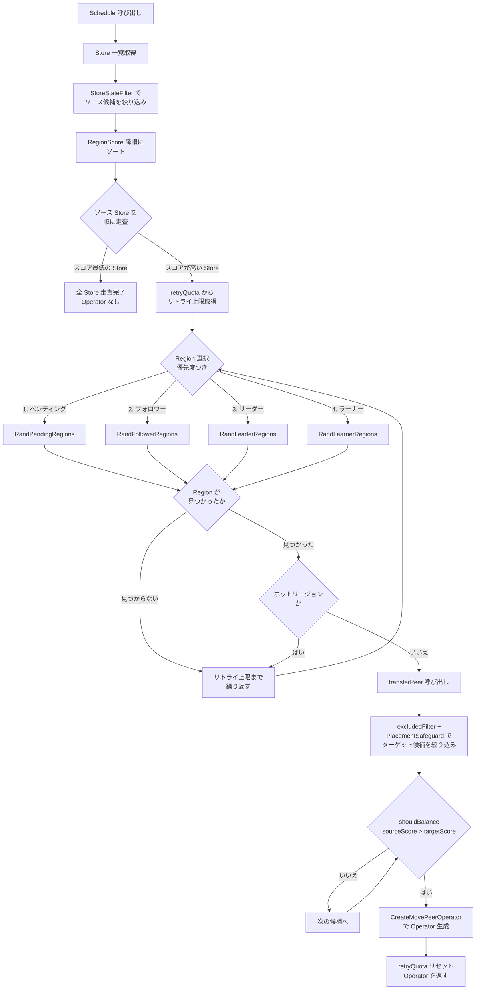

# 第15章 balance-region スケジューラ

> **本章で読むソース**
>
> - [`pkg/schedule/schedulers/balance_region.go`](https://github.com/tikv/pd/blob/v8.5.6/pkg/schedule/schedulers/balance_region.go)
> - [`pkg/core/store.go`](https://github.com/tikv/pd/blob/v8.5.6/pkg/core/store.go)（`RegionScore`）
> - [`pkg/schedule/schedulers/utils.go`](https://github.com/tikv/pd/blob/v8.5.6/pkg/schedule/schedulers/utils.go)（`solver`、`retryQuota`）
> - [`pkg/schedule/filter/region_filters.go`](https://github.com/tikv/pd/blob/v8.5.6/pkg/schedule/filter/region_filters.go)
> - [`pkg/schedule/filter/filters.go`](https://github.com/tikv/pd/blob/v8.5.6/pkg/schedule/filter/filters.go)
> - [`pkg/schedule/operator/create_operator.go`](https://github.com/tikv/pd/blob/v8.5.6/pkg/schedule/operator/create_operator.go)（`CreateMovePeerOperator`）

## この章の狙い

**balance-region スケジューラ**は、クラスタ内の各 Store が保持する Region 数とデータサイズを均等化するスケジューラである。
前章の balance-leader がリーダーの偏りを解消するのに対し、balance-region はデータの偏りそのものを解消する。
本章では、`balanceRegionScheduler` の構造体定義から `Schedule` メソッドの Region 選択ロジック、`transferPeer` による Operator 組み立てまでを読む。
最適化の工夫として、リトライクォータによる指数バックオフを機構レベルで説明する。

## 前提

[第10章](../part03-scheduling/10-coordinator.md)で Coordinator がスケジューラを起動して Operator を投入する流れを読んだ。
[第11章](../part03-scheduling/11-operator-and-step.md)で Operator と Builder による組み立てを読んだ。
[第13章](../part03-scheduling/13-placement-rules.md)で Placement Rules による配置制約を読んだ。
コード引用は tikv/pd のタグ `v8.5.6` に固定する。

## balanceRegionScheduler の構造

`balanceRegionScheduler` は `BaseScheduler` を埋め込み、Store レベルのフィルタとリトライクォータを保持する。

[`pkg/schedule/schedulers/balance_region.go L34-L48`](https://github.com/tikv/pd/blob/v8.5.6/pkg/schedule/schedulers/balance_region.go#L34-L48)

```go
type balanceRegionSchedulerConfig struct {
	baseDefaultSchedulerConfig

	Ranges []keyutil.KeyRange `json:"ranges"`
	// TODO: When we prepare to use Ranges, we will need to implement the ReloadConfig function for this scheduler.
}

type balanceRegionScheduler struct {
	*BaseScheduler
	*retryQuota
	name          string
	conf          *balanceRegionSchedulerConfig
	filters       []filter.Filter
	filterCounter *filter.Counter
}
```

`Ranges` はスケジューリング対象のキー範囲を絞り込む設定であり、省略時はクラスタ全体が対象となる。
`retryQuota` は後述する指数バックオフの仕組みを提供する構造体である。

コンストラクタ `newBalanceRegionScheduler` では、Store レベルのフィルタとして `StoreStateFilter` と `specialUseFilter` の2つを登録する。

[`pkg/schedule/schedulers/balance_region.go L52-L68`](https://github.com/tikv/pd/blob/v8.5.6/pkg/schedule/schedulers/balance_region.go#L52-L68)

```go
func newBalanceRegionScheduler(opController *operator.Controller, conf *balanceRegionSchedulerConfig, opts ...BalanceRegionCreateOption) Scheduler {
	scheduler := &balanceRegionScheduler{
		BaseScheduler: NewBaseScheduler(opController, types.BalanceRegionScheduler, conf),
		retryQuota:    newRetryQuota(),
		name:          types.BalanceRegionScheduler.String(),
		conf:          conf,
	}
	for _, setOption := range opts {
		setOption(scheduler)
	}
	scheduler.filters = []filter.Filter{
		&filter.StoreStateFilter{ActionScope: scheduler.GetName(), MoveRegion: true, OperatorLevel: constant.Medium},
		filter.NewSpecialUseFilter(scheduler.GetName()),
	}
	scheduler.filterCounter = filter.NewCounter(scheduler.GetName())
	return scheduler
}
```

`StoreStateFilter` の `MoveRegion` フラグが `true` に設定されている点が重要である。
このフラグにより、ソース Store のフィルタリングでは `isBusy`、`exceedRemoveLimit`、`tooManySnapshots` が検査される。
ターゲット Store では `isRemoved`、`isRemoving`、`isDown`、`isDisconnected`、`isBusy`、`exceedAddLimit`、`tooManySnapshots`、`tooManyPendingPeers` が検査される。
balance-leader では `TransferLeader` フラグが `true` であり、検査項目が異なる。

## Region スコアの計算

Store ごとの Region の偏りを数値化するのが `RegionScore` メソッドである。
このスコアが高い Store ほど Region を「持ちすぎている」と判定される。

[`pkg/core/store.go L427-L436`](https://github.com/tikv/pd/blob/v8.5.6/pkg/core/store.go#L427-L436)

```go
func (s *StoreInfo) RegionScore(version string, highSpaceRatio, lowSpaceRatio float64, delta int64) float64 {
	switch version {
	case "v2":
		return s.regionScoreV2(delta, lowSpaceRatio)
	case "v1":
		fallthrough
	default:
		return s.regionScoreV1(highSpaceRatio, lowSpaceRatio, delta)
	}
}
```

`version` パラメータにより v1 と v2 のスコア計算式を切り替える。
`delta` は Operator の影響（移動中の Region サイズ）を反映するための仮想的な増減量である。

### v1: 3区間の線形補間

v1 のスコア計算は、ディスクの残容量に応じて3つの区間を使い分ける。

[`pkg/core/store.go L438-L481`](https://github.com/tikv/pd/blob/v8.5.6/pkg/core/store.go#L438-L481)

```go
func (s *StoreInfo) regionScoreV1(highSpaceRatio, lowSpaceRatio float64, delta int64) float64 {
	var score float64
	var amplification float64
	available := float64(s.GetAvailable()) / units.MiB
	used := float64(s.GetUsedSize()) / units.MiB
	capacity := float64(s.GetCapacity()) / units.MiB

	if s.GetRegionSize() == 0 || used == 0 {
		amplification = 1
	} else {
		// because of rocksdb compression, region size is larger than actual used size
		amplification = float64(s.GetRegionSize()) / used
	}

	// highSpaceBound is the lower bound of the high space stage.
	highSpaceBound := (1 - highSpaceRatio) * capacity
	// lowSpaceBound is the upper bound of the low space stage.
	lowSpaceBound := (1 - lowSpaceRatio) * capacity
	if available-float64(delta)/amplification >= highSpaceBound {
		score = float64(s.GetRegionSize() + delta)
	} else if available-float64(delta)/amplification <= lowSpaceBound {
		score = maxScore - (available - float64(delta)/amplification)
	} else {
		// ... (中略) ...
		x1, y1 := (used+available-highSpaceBound)*amplification, (used+available-highSpaceBound)*amplification
		x2, y2 := (used+available-lowSpaceBound)*amplification, maxScore-lowSpaceBound

		k := (y2 - y1) / (x2 - x1)
		b := y1 - k*x1
		score = k*float64(s.GetRegionSize()+delta) + b
	}

	return score / math.Max(s.GetRegionWeight(), minWeight)
}
```

残容量が `highSpaceBound` 以上のとき、スコアは単純に Region の合計サイズとなる。
残容量が `lowSpaceBound` 以下のとき、スコアは `maxScore` から残容量を引いた値となり、残容量が減るほどスコアが急上昇する。
中間区間では、2つの境界点を結ぶ線形関数で連続的に遷移する。
`amplification` は RocksDB の圧縮による Region サイズと実ディスク使用量の比率であり、`delta` を物理サイズに変換するために使われる。
最終的にスコアは `regionWeight` で除算され、ユーザーが Store ごとに設定した重みが反映される。

### v2: 対数関数による平滑化

v2 は対数関数を使い、残容量の減少に対してスコアを滑らかに増加させる。

[`pkg/core/store.go L483-L525`](https://github.com/tikv/pd/blob/v8.5.6/pkg/core/store.go#L483-L525)

```go
func (s *StoreInfo) regionScoreV2(delta int64, lowSpaceRatio float64) float64 {
	A := float64(s.GetAvgAvailable()) / units.GiB
	C := float64(s.GetCapacity()) / units.GiB
	// the used size always be accurate, it only statistics the raftDB|rocksDB|snap directory, so we use it directly.
	U := float64(s.GetUsedSize()) / units.GiB
	// ... (中略) ...
	var (
		K, M float64 = 1, 256 // Experience value to control the weight of the available influence on score
		F    float64 = 50     // Experience value to prevent some nodes from running out of disk space prematurely.
		B            = 1e10
	)
	F = math.Max(F, C*(1-lowSpaceRatio))
	var score float64
	if A >= C || C < 1 {
		score = R
	} else if A > F {
		score = (K + M*(math.Log(C)-math.Log(A-F+1))/(C-A+F-1)) * R
	} else {
		score = (K+M*math.Log(C)/C)*R + B*(F-A)/F
	}
	return score / math.Max(s.GetRegionWeight(), minWeight)
}
```

v2 では `GetAvgAvailable`（移動平均）を使う点が v1 と異なる。
残容量が閾値 `F` を下回ると、`B*(F-A)/F` の項が支配的になり、ディスク枯渇に近い Store のスコアを急激に引き上げる。
この仕組みにより、残容量が少ない Store から優先的に Region が移動される。

## Schedule メソッド: ソース Store の選定

`Schedule` メソッドがスケジューリングのエントリポイントである。
全体の流れは、(1) Store のフィルタリングとスコア順ソート、(2) Region の優先度つきランダム選択、(3) ターゲット Store の選定と Operator 生成、という3段階で構成される。

まず、Store の一覧を取得し、ソース候補とターゲット不適格 Store を振り分ける。

[`pkg/schedule/schedulers/balance_region.go L95-L118`](https://github.com/tikv/pd/blob/v8.5.6/pkg/schedule/schedulers/balance_region.go#L95-L118)

```go
func (s *balanceRegionScheduler) Schedule(cluster sche.SchedulerCluster, dryRun bool) ([]*operator.Operator, []plan.Plan) {
	basePlan := plan.NewBalanceSchedulerPlan()
	defer s.filterCounter.Flush()
	// ... (中略) ...
	stores := cluster.GetStores()
	conf := cluster.GetSchedulerConfig()
	snapshotFilter := filter.NewSnapshotSendFilter(stores, constant.Medium)
	faultTargets := filter.SelectUnavailableTargetStores(stores, s.filters, conf, collector, s.filterCounter)
	sourceStores := filter.SelectSourceStores(stores, s.filters, conf, collector, s.filterCounter)
	opInfluence := s.OpController.GetOpInfluence(cluster.GetBasicCluster())
	s.OpController.GetFastOpInfluence(cluster.GetBasicCluster(), opInfluence)
	kind := constant.NewScheduleKind(constant.RegionKind, constant.BySize)
	solver := newSolver(basePlan, kind, cluster, opInfluence)

	sort.Slice(sourceStores, func(i, j int) bool {
		iOp := solver.getOpInfluence(sourceStores[i].GetID())
		jOp := solver.getOpInfluence(sourceStores[j].GetID())
		return sourceStores[i].RegionScore(conf.GetRegionScoreFormulaVersion(), conf.GetHighSpaceRatio(), conf.GetLowSpaceRatio(), iOp) >
			sourceStores[j].RegionScore(conf.GetRegionScoreFormulaVersion(), conf.GetHighSpaceRatio(), conf.GetLowSpaceRatio(), jOp)
	})
	// ... (中略) ...
}
```

`SelectSourceStores` は `StoreStateFilter` を通過する Store だけを残す。
`SelectUnavailableTargetStores` はターゲットとして不適格な Store（ダウン中、オフライン中など）を先に抽出しておく。
`kind` は `constant.RegionKind` かつ `constant.BySize` に設定される。
balance-leader では `constant.LeaderKind` かつ `constant.ByCount` が使われる点が異なる。

ソース Store は「Region スコア」の降順にソートされる。
ソートの際、実行中 Operator の影響（`opInfluence`）を `delta` として `RegionScore` に渡すことで、すでにスケジュール中の移動を加味したスコアが計算される。

## Region の選択: 優先度つきランダム選択

ソース Store が決まると、その Store から移動する Region を選択する。
選択には明確な優先順位がある。

[`pkg/schedule/schedulers/balance_region.go L146-L175`](https://github.com/tikv/pd/blob/v8.5.6/pkg/schedule/schedulers/balance_region.go#L146-L175)

```go
	for sourceIndex, solver.Source = range sourceStores {
		retryLimit := s.retryQuota.getLimit(solver.Source)
		solver.sourceScore = solver.sourceStoreScore(s.GetName())
		if sourceIndex == len(sourceStores)-1 {
			break
		}
		for range retryLimit {
			// Priority pick the region that has a pending peer.
			// Pending region may mean the disk is overload, remove the pending region firstly.
			solver.Region = filter.SelectOneRegion(cluster.RandPendingRegions(solver.sourceStoreID(), rs), collector,
				append(baseRegionFilters, filter.NewRegionWitnessFilter(solver.sourceStoreID()))...)
			if solver.Region == nil {
				// Then pick the region that has a follower in the source store.
				solver.Region = filter.SelectOneRegion(cluster.RandFollowerRegions(solver.sourceStoreID(), rs), collector,
					append(baseRegionFilters, filter.NewRegionWitnessFilter(solver.sourceStoreID()), pendingFilter)...)
			}
			if solver.Region == nil {
				// Then pick the region has the leader in the source store.
				solver.Region = filter.SelectOneRegion(cluster.RandLeaderRegions(solver.sourceStoreID(), rs), collector,
					append(baseRegionFilters, filter.NewRegionWitnessFilter(solver.sourceStoreID()), pendingFilter)...)
			}
			if solver.Region == nil {
				// Finally, pick learner.
				solver.Region = filter.SelectOneRegion(cluster.RandLearnerRegions(solver.sourceStoreID(), rs), collector,
					append(baseRegionFilters, filter.NewRegionWitnessFilter(solver.sourceStoreID()), pendingFilter)...)
			}
			// ... (中略) ...
		}
```

Region の選択優先度は次のとおりである。

1. **ペンディング Peer を持つ Region**（`RandPendingRegions`）を最優先で選ぶ。ペンディング Peer はディスク過負荷を示唆するため、早期に移動させる。
2. **ソース Store 上のフォロワー Region**（`RandFollowerRegions`）を次に選ぶ。フォロワーの移動はリーダー移動を伴わないため、クライアントへの影響が小さい。
3. **ソース Store 上のリーダー Region**（`RandLeaderRegions`）を選ぶ。リーダーの移動は Peer の追加と削除に加えてリーダー移転を伴うため、コストが高い。
4. **ラーナー Region**（`RandLearnerRegions`）を最後に選ぶ。

いずれの選択でも `SelectOneRegion` により Region レベルのフィルタが適用される。
基本フィルタ群（`baseRegionFilters`）は次の4種である。

- `regionDownFilter`: ダウン Peer を持つ Region を除外する
- `RegionReplicatedFilter`: レプリカ数が Placement Rules を満たしていない Region を除外する
- `SnapshotSenderFilter`: リーダー Store のスナップショット送信制限を超えている Region を除外する
- `affinityFilter`: アフィニティグループにより通常スケジューリングが禁止されている Region を除外する

さらに、通常モード（`rangeCluster` 以外）では `regionEmptyFilter` が追加され、空 Region の移動が抑制される。
ペンディング Region 以外の選択では `pendingFilter`（`regionPendingFilter`）も追加され、ペンディング Peer を持つ Region が二重に選ばれることを防ぐ。

選択された Region がホットリージョンであれば、hot-region スケジューラに任せるためスキップされる。

[`pkg/schedule/schedulers/balance_region.go L177-L185`](https://github.com/tikv/pd/blob/v8.5.6/pkg/schedule/schedulers/balance_region.go#L177-L185)

```go
			// Skip hot regions.
			if cluster.IsRegionHot(solver.Region) {
				log.Debug("region is hot", zap.String("scheduler", s.GetName()), zap.Uint64("region-id", solver.Region.GetID()))
				if collector != nil {
					collector.Collect(plan.SetResource(solver.Region), plan.SetStatus(plan.NewStatus(plan.StatusRegionHot)))
				}
				balanceRegionHotCounter.Inc()
				continue
			}
```

ホットリージョンの除外により、balance-region と hot-region スケジューラの責務が明確に分離される。

## ターゲット Store の選定と Peer 移動

Region が決まると `transferPeer` メソッドでターゲット Store を選び、Operator を組み立てる。

[`pkg/schedule/schedulers/balance_region.go L213-L226`](https://github.com/tikv/pd/blob/v8.5.6/pkg/schedule/schedulers/balance_region.go#L213-L226)

```go
func (s *balanceRegionScheduler) transferPeer(solver *solver, collector *plan.Collector, dstStores []*core.StoreInfo, faultStores []*core.StoreInfo) *operator.Operator {
	excludeTargets := solver.Region.GetStoreIDs()
	for _, store := range faultStores {
		excludeTargets[store.GetID()] = struct{}{}
	}
	// the order of the filters should be sorted by the cost of the cpu overhead.
	// the more expensive the filter is, the later it should be placed.
	conf := solver.GetSchedulerConfig()
	filters := []filter.Filter{
		filter.NewExcludedFilter(s.GetName(), nil, excludeTargets),
		filter.NewPlacementSafeguard(s.GetName(), conf, solver.GetBasicCluster(), solver.GetRuleManager(),
			solver.Region, solver.Source, solver.fit),
	}
	candidates := filter.NewCandidates(s.R, dstStores).FilterTarget(conf, collector, s.filterCounter, filters...)
```

`dstStores` として渡されるのは、Region スコアの降順でソートされたソース Store リストのうち、現在のソース Store より後方にある（スコアが低い）Store である。
ターゲット候補には2段階のフィルタが適用される。

1. **`excludedFilter`**: その Region の Peer がすでに存在する Store と、ターゲット不適格 Store を除外する
2. **`PlacementSafeguard`**: Placement Rules が有効な場合は `ruleFitFilter` で配置制約の悪化を防ぎ、無効な場合は `LocationSafeguard` で分散スコアの低下を防ぐ

フィルタをパスした候補の中から、Region スコアが最も低い Store を選んで移動先とする。

[`pkg/schedule/schedulers/balance_region.go L232-L269`](https://github.com/tikv/pd/blob/v8.5.6/pkg/schedule/schedulers/balance_region.go#L232-L269)

```go
	// candidates are sorted by region score desc, so we pick the last store as target store.
	for i := range candidates.Stores {
		solver.Target = candidates.Stores[len(candidates.Stores)-i-1]
		solver.targetScore = solver.targetStoreScore(s.GetName())
		// ... (中略) ...

		if !solver.shouldBalance(s.GetName()) {
			balanceRegionSkipCounter.Inc()
			// ... (中略) ...
			continue
		}

		oldPeer := solver.Region.GetStorePeer(sourceID)
		newPeer := &metapb.Peer{StoreId: solver.Target.GetID(), Role: oldPeer.Role}
		solver.Step++
		op, err := operator.CreateMovePeerOperator(s.GetName(), solver, solver.Region, operator.OpRegion, oldPeer.GetStoreId(), newPeer)
		// ... (中略) ...
		return op
	}
```

### shouldBalance による均衡判定

ターゲット候補ごとに `shouldBalance` メソッドで移動の妥当性を判定する。

[`pkg/schedule/schedulers/utils.go L151-L169`](https://github.com/tikv/pd/blob/v8.5.6/pkg/schedule/schedulers/utils.go#L151-L169)

```go
func (p *solver) shouldBalance(scheduleName string) bool {
	// ... (中略) ...
	sourceID := p.Source.GetID()
	targetID := p.Target.GetID()
	// Make sure after move, source score is still greater than target score.
	shouldBalance := p.sourceScore > p.targetScore

	// ... (中略) ...
	return shouldBalance
}
```

ソース Store のスコアとターゲット Store のスコアは、`tolerantResource`（許容量）を織り込んで計算される。
`sourceStoreScore` はソース側の `delta` から「許容量」を引いた値でスコアを計算する。
`targetStoreScore` はターゲット側の `delta` に「許容量」を加えた値でスコアを計算する。

[`pkg/schedule/schedulers/utils.go L90-L117`](https://github.com/tikv/pd/blob/v8.5.6/pkg/schedule/schedulers/utils.go#L90-L117)

```go
func (p *solver) sourceStoreScore(scheduleName string) float64 {
	sourceID := p.Source.GetID()
	tolerantResource := p.getTolerantResource()
	influence := p.getOpInfluence(sourceID)
	if influence > 0 {
		influence = -influence
	}
	// ... (中略) ...
	var score float64
	switch p.kind.Resource {
	// ... (中略) ...
	case constant.RegionKind:
		sourceDelta := influence*influenceAmp - tolerantResource
		score = p.Source.RegionScore(p.GetSchedulerConfig().GetRegionScoreFormulaVersion(), p.GetSchedulerConfig().GetHighSpaceRatio(), p.GetSchedulerConfig().GetLowSpaceRatio(), sourceDelta)
	// ... (中略) ...
	}
	return score
}
```

`influenceAmp`（値は5）による増幅は、スケジューリングの振動を抑えるための仕組みである。
実行中 Operator の影響を5倍に増幅することで、同一 Store に対する過剰なスケジューリングを防ぐ。
「許容量」は `averageRegionSize * tolerantSizeRatio` で計算され、移動後もソーススコアがターゲットスコアを上回ることを要求する。

### Operator の組み立て

均衡判定を通過すると、`CreateMovePeerOperator` で Operator を生成する。

[`pkg/schedule/operator/create_operator.go L119-L124`](https://github.com/tikv/pd/blob/v8.5.6/pkg/schedule/operator/create_operator.go#L119-L124)

```go
func CreateMovePeerOperator(desc string, ci sche.SharedCluster, region *core.RegionInfo, kind OpKind, oldStore uint64, peer *metapb.Peer) (*Operator, error) {
	return NewBuilder(desc, ci, region).
		RemovePeer(oldStore).
		AddPeer(peer).
		Build(kind)
}
```

Builder は `RemovePeer`（ソース Store の Peer 削除）と `AddPeer`（ターゲット Store への Peer 追加）を組み合わせて Operator を構築する。
balance-leader の `CreateTransferLeaderOperator` がリーダー権の移転だけを行うのに対し、balance-region はデータのコピーと削除を伴うため、実行コストが高い。

## balance-leader との主な違い

balance-region と balance-leader は同じ `solver` フレームワークを共有するが、いくつかの点で異なる。

- **スコア計算**: balance-leader は `LeaderScore`（リーダー数ベース）を使い、balance-region は `RegionScore`（データサイズと残容量ベース）を使う
- **スケジュール単位**: balance-leader はリーダー権の移転（`TransferLeader`）であり、balance-region は Peer の追加と削除（`MovePeer`）である
- **Region 選択**: balance-leader はリーダー Region のみを対象とするが、balance-region はペンディング、フォロワー、リーダー、ラーナーの4種を優先順位つきで選択する
- **バッチ処理**: balance-leader は1回の `Schedule` 呼び出しで最大4つの Operator を返すが、balance-region は1つのみ返す
- **`influenceAmp`**: balance-region は `RegionKind` 時に Operator の影響を5倍に増幅する。balance-leader の `LeaderKind` では増幅しない

## 最適化の工夫: リトライクォータによる指数バックオフ

balance-region はソース Store ごとにリトライ回数を管理する `retryQuota` を持つ。

[`pkg/schedule/schedulers/utils.go L346-L394`](https://github.com/tikv/pd/blob/v8.5.6/pkg/schedule/schedulers/utils.go#L346-L394)

```go
type retryQuota struct {
	initialLimit int
	minLimit     int
	attenuation  int

	limits map[uint64]int
}

// ... (中略) ...

func (q *retryQuota) getLimit(store *core.StoreInfo) int {
	id := store.GetID()
	if limit, ok := q.limits[id]; ok {
		return limit
	}
	q.limits[id] = q.initialLimit
	return q.initialLimit
}

func (q *retryQuota) resetLimit(store *core.StoreInfo) {
	q.limits[store.GetID()] = q.initialLimit
}

func (q *retryQuota) attenuate(store *core.StoreInfo) {
	newLimit := q.getLimit(store) / q.attenuation
	if newLimit < q.minLimit {
		newLimit = q.minLimit
	}
	q.limits[store.GetID()] = newLimit
}
```

初回のリトライ上限は10回（`defaultMaxRetryLimit`）である。
ある Store からの Region 選択で1回も Operator を生成できなかった場合、`attenuate` によりリトライ上限が半減（`defaultRetryQuotaAttenuation` = 2）する。
Operator の生成に成功すると `resetLimit` で上限が初期値に戻る。
下限は1回（`defaultMinRetryLimit`）であり、完全にスキップされることはない。

この指数バックオフにより、Region の移動先が見つかりにくい Store に対する無駄な探索が抑制される。
Region 数が多いクラスタでは Store の候補数も多くなるため、1 Store あたりの探索回数を適応的に絞ることで `Schedule` メソッドの CPU 消費を抑えられる。

## スケジューリングフローの全体像

以下の図は `Schedule` メソッドの処理の流れを示す。



## まとめ

balance-region スケジューラは、Region スコアに基づいてデータの偏りを検出し、スコアの高い Store から低い Store へ Region の Peer を移動させる。
Region の選択ではペンディング Peer を持つ Region を最優先とし、ディスク過負荷の早期解消を図る。
ターゲット Store の選定では Placement Rules との整合性を検査し、移動後もソーススコアがターゲットスコアを上回ることを `shouldBalance` で保証する。
リトライクォータの指数バックオフにより、移動先が見つかりにくい Store に対する探索コストが適応的に削減される。

## 関連する章

- [第10章 Coordinator とスケジューリングループ](../part03-scheduling/10-coordinator.md): スケジューラの起動と実行ループ
- [第11章 Operator と Step](../part03-scheduling/11-operator-and-step.md): Operator の構造と Builder による組み立て
- [第12章 OperatorController と完了追跡](../part03-scheduling/12-operator-controller.md): 生成された Operator の投入と実行管理
- [第13章 Placement Rules と制約充足](../part03-scheduling/13-placement-rules.md): `PlacementSafeguard` が依拠する配置制約
