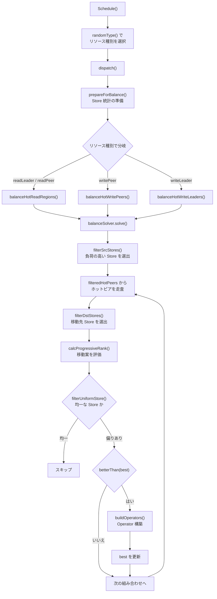
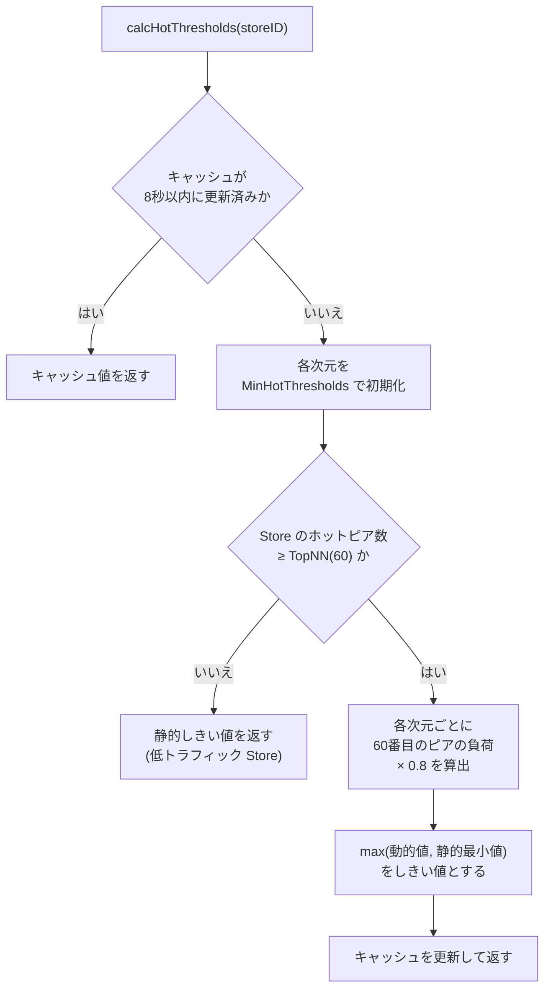

# 第16章 hot-region スケジューラ

> **本章で読むソース**
>
> - [`pkg/schedule/schedulers/hot_region.go`](https://github.com/tikv/pd/blob/v8.5.6/pkg/schedule/schedulers/hot_region.go)
> - [`pkg/schedule/schedulers/hot_region_rank_v2.go`](https://github.com/tikv/pd/blob/v8.5.6/pkg/schedule/schedulers/hot_region_rank_v2.go)
> - [`pkg/schedule/schedulers/hot_region_config.go`](https://github.com/tikv/pd/blob/v8.5.6/pkg/schedule/schedulers/hot_region_config.go)
> - [`pkg/statistics/hot_peer_cache.go`](https://github.com/tikv/pd/blob/v8.5.6/pkg/statistics/hot_peer_cache.go)
> - [`pkg/statistics/hot_peer.go`](https://github.com/tikv/pd/blob/v8.5.6/pkg/statistics/hot_peer.go)
> - [`pkg/statistics/utils/constant.go`](https://github.com/tikv/pd/blob/v8.5.6/pkg/statistics/utils/constant.go)

## この章の狙い

[第15章](15-balance-region.md)の balance-region スケジューラは Region 数やデータサイズの偏りを均す。
対して **hot-region スケジューラ**は、読み書きトラフィックの偏りに着目し、ホットスポットを分散させる。
balance-region が「データ量」の静的な均衡を扱うのに対し、「hot-region」は「負荷」の動的な均衡を扱う。

本章では、ホットリージョンの検出から移動先の決定までを、`hotScheduler` の構造体定義、`balanceSolver` の3重ループ、`rankV2` による解の評価の順に読む。
最適化の工夫として、Store あたりの TopN に基づく適応的しきい値を機構レベルで説明する。

## 前提

[第9章](../part02-metadata/09-region-heartbeat.md)で Region の「ハートビート」が PD に流量統計を運ぶ仕組みを読んだ。
[第10章](../part03-scheduling/10-coordinator.md)で Coordinator がスケジューラを起動して Operator を投入する流れを読んだ。
[第15章](15-balance-region.md)で balance-region スケジューラがデータ量に基づいて Region を移動する仕組みを読んだ。
コード引用は tikv/pd のタグ `v8.5.6` に固定する。

## hotScheduler の構造と Schedule メソッド

`hotScheduler` は **`baseHotScheduler`** を埋め込み、設定と排他ロックを保持する。

[`pkg/schedule/schedulers/hot_region.go L71-L89`](https://github.com/tikv/pd/blob/v8.5.6/pkg/schedule/schedulers/hot_region.go#L71-L89)

```go
type baseHotScheduler struct {
	*BaseScheduler
	// stLoadInfos contain store statistics information by resource type.
	// stLoadInfos is temporary states but exported to API or metrics.
	// Every time `Schedule()` will recalculate it.
	stLoadInfos [resourceTypeLen]map[uint64]*statistics.StoreLoadDetail
	// stHistoryLoads stores the history `stLoadInfos`
	// Every time `Schedule()` will rolling update it.
	stHistoryLoads *statistics.StoreHistoryLoads
	// regionPendings stores regionID -> pendingInfluence,
	// this records regionID which have pending Operator by operation type. During filterHotPeers, the hot peers won't
	// be selected if its owner region is tracked in this attribute.
	regionPendings map[uint64]*pendingInfluence
	// types is the resource types that the scheduler considers.
	types           []resourceType
	r               *rand.Rand
	updateReadTime  time.Time
	updateWriteTime time.Time
}
```

`stLoadInfos` はリソース種別ごとに Store の負荷統計を保持する一時的な状態であり、`Schedule` が呼ばれるたびに再計算される。
`regionPendings` は実行中の Operator が存在する Region を追跡し、同一 Region への重複スケジューリングを防ぐ。

[`pkg/schedule/schedulers/hot_region.go L195-L201`](https://github.com/tikv/pd/blob/v8.5.6/pkg/schedule/schedulers/hot_region.go#L195-L201)

```go
type hotScheduler struct {
	*baseHotScheduler
	syncutil.RWMutex
	// config of hot scheduler
	conf                *hotRegionSchedulerConfig
	searchRevertRegions [resourceTypeLen]bool // Whether to search revert regions.
}
```

`searchRevertRegions` は、移動の副作用を打ち消す **リバート Region** の探索を有効にするかどうかをリソース種別ごとに記録するフラグである。

`Schedule` メソッドはリソース種別をランダムに選択し、`dispatch` に委譲する。

[`pkg/schedule/schedulers/hot_region.go L280-L285`](https://github.com/tikv/pd/blob/v8.5.6/pkg/schedule/schedulers/hot_region.go#L280-L285)

```go
// Schedule implements the Scheduler interface.
func (s *hotScheduler) Schedule(cluster sche.SchedulerCluster, _ bool) ([]*operator.Operator, []plan.Plan) {
	hotSchedulerCounter.Inc()
	typ := s.randomType()
	return s.dispatch(typ, cluster), nil
}
```

リソース種別をランダムに選ぶことで、特定の種別だけが連続して処理される偏りを防ぐ。

## リソース種別と dispatch

**`resourceType`** は4種類の列挙型として定義される。

[`pkg/schedule/schedulers/hot_region.go L1604-L1612`](https://github.com/tikv/pd/blob/v8.5.6/pkg/schedule/schedulers/hot_region.go#L1604-L1612)

```go
type resourceType int

const (
	writePeer resourceType = iota
	writeLeader
	readPeer
	readLeader
	resourceTypeLen
)
```

`writePeer` は書き込みトラフィックの Peer 移動、`writeLeader` は書き込みトラフィックの「リーダー」移転を表す。
`readPeer` と `readLeader` は読み取りトラフィックに対応する。

`dispatch` は選択された「リソース種別」に応じて、`prepareForBalance` で Store 統計を準備したのち分岐する。

[`pkg/schedule/schedulers/hot_region.go L287-L311`](https://github.com/tikv/pd/blob/v8.5.6/pkg/schedule/schedulers/hot_region.go#L287-L311)

```go
func (s *hotScheduler) dispatch(typ resourceType, cluster sche.SchedulerCluster) []*operator.Operator {
	s.Lock()
	defer s.Unlock()
	s.updateHistoryLoadConfig(s.conf.getHistorySampleDuration(), s.conf.getHistorySampleInterval())
	s.prepareForBalance(typ, cluster)
	// isForbidRWType can not be move earlier to support to use api and metrics.
	switch typ {
	case readLeader, readPeer:
		if s.conf.isForbidRWType(utils.Read) {
			return nil
		}
		return s.balanceHotReadRegions(cluster)
	case writePeer:
		if s.conf.isForbidRWType(utils.Write) {
			return nil
		}
		return s.balanceHotWritePeers(cluster)
	case writeLeader:
		if s.conf.isForbidRWType(utils.Write) {
			return nil
		}
		return s.balanceHotWriteLeaders(cluster)
	}
	return nil
}
```

`prepareForBalance` を `isForbidRWType` の前に呼ぶのは、API やメトリクスの表示用に `stLoadInfos` を更新する必要があるためである。

### prepareForBalance による統計の準備

`prepareForBalance` は Store の負荷統計を収集し、ペンディングインフルエンスを反映させる。

[`pkg/schedule/schedulers/hot_region.go L112-L150`](https://github.com/tikv/pd/blob/v8.5.6/pkg/schedule/schedulers/hot_region.go#L112-L150)

```go
func (s *baseHotScheduler) prepareForBalance(typ resourceType, cluster sche.SchedulerCluster) {
	storeInfos := statistics.SummaryStoreInfos(cluster.GetStores())
	s.summaryPendingInfluence(storeInfos)
	storesLoads := cluster.GetStoresLoads()
	isTraceRegionFlow := cluster.GetSchedulerConfig().IsTraceRegionFlow()

	prepare := func(regionStats map[uint64][]*statistics.HotPeerStat, rw utils.RWType, resource constant.ResourceKind) {
		ty := buildResourceType(rw, resource)
		s.stLoadInfos[ty] = statistics.SummaryStoresLoad(
			storeInfos,
			storesLoads,
			s.stHistoryLoads,
			regionStats,
			isTraceRegionFlow,
			rw, resource)
	}
	switch typ {
	case readLeader, readPeer:
		if time.Since(s.updateReadTime) >= statisticsInterval {
			regionRead := cluster.GetHotPeerStats(utils.Read)
			prepare(regionRead, utils.Read, constant.LeaderKind)
			prepare(regionRead, utils.Read, constant.RegionKind)
			s.updateReadTime = time.Now()
		}
	case writeLeader, writePeer:
		if time.Since(s.updateWriteTime) >= statisticsInterval {
			regionWrite := cluster.GetHotPeerStats(utils.Write)
			prepare(regionWrite, utils.Write, constant.LeaderKind)
			prepare(regionWrite, utils.Write, constant.RegionKind)
			s.updateWriteTime = time.Now()
		}
	}
}
```

読み取りと書き込みの統計は `statisticsInterval` ごとに更新される。
読み取り系の「リソース種別」が選ばれた場合でも `LeaderKind` と `RegionKind` の両方を準備する理由は、読み取りのホットリージョン解消に「リーダー」移転と Peer 移動の両方を試みるからである。

## balanceSolver の初期化と3重ループ

読み取り系の分岐を例にとる。
`balanceHotReadRegions` は「リーダー」移転と Peer 移動の2つの `balanceSolver` を生成し、それぞれの解を比較する。

[`pkg/schedule/schedulers/hot_region.go L330-L371`](https://github.com/tikv/pd/blob/v8.5.6/pkg/schedule/schedulers/hot_region.go#L330-L371)

```go
func (s *hotScheduler) balanceHotReadRegions(cluster sche.SchedulerCluster) []*operator.Operator {
	leaderSolver := newBalanceSolver(s, cluster, utils.Read, transferLeader)
	leaderOps := leaderSolver.solve()
	peerSolver := newBalanceSolver(s, cluster, utils.Read, movePeer)
	peerOps := peerSolver.solve()
	if len(leaderOps) == 0 && len(peerOps) == 0 {
		hotSchedulerSkipCounter.Inc()
		return nil
	}
	// ... (中略) ...
	leaderSolver.cur = leaderSolver.best
	if leaderSolver.rank.betterThan(peerSolver.best) {
		if leaderSolver.tryAddPendingInfluence() {
			return leaderOps
		}
		if peerSolver.tryAddPendingInfluence() {
			return peerOps
		}
	} else {
		if peerSolver.tryAddPendingInfluence() {
			return peerOps
		}
		if leaderSolver.tryAddPendingInfluence() {
			return leaderOps
		}
	}
	hotSchedulerSkipCounter.Inc()
	return nil
}
```

「リーダー」移転のコストは Peer 移動より低いため、同等の改善であれば「リーダー」移転が優先される。
`betterThan` で「リーダー」移転の方が優れていると判定された場合、先に `tryAddPendingInfluence` を試みる。
一方が失敗した場合はもう一方にフォールバックする。

### balanceSolver 構造体

**`balanceSolver`** はホットリージョンの移動先を探索するための状態をすべて保持する。

[`pkg/schedule/schedulers/hot_region.go L465-L496`](https://github.com/tikv/pd/blob/v8.5.6/pkg/schedule/schedulers/hot_region.go#L465-L496)

```go
type balanceSolver struct {
	sche.SchedulerCluster
	sche             *hotScheduler
	stLoadDetail     map[uint64]*statistics.StoreLoadDetail
	filteredHotPeers map[uint64][]*statistics.HotPeerStat // storeID -> hotPeers(filtered)
	nthHotPeer       map[uint64][]*statistics.HotPeerStat // storeID -> [dimLen]hotPeers
	rwTy             utils.RWType
	opTy             opType
	resourceTy       resourceType

	cur *solution

	best *solution
	ops  []*operator.Operator

	// maxSrc and minDst are used to calculate the rank.
	maxSrc   *statistics.StoreLoad
	minDst   *statistics.StoreLoad
	rankStep *statistics.StoreLoad

	// firstPriority and secondPriority indicate priority of hot schedule
	// they may be byte(0), key(1), query(2), and always less than dimLen
	firstPriority  int
	secondPriority int

	greatDecRatio float64
	minorDecRatio float64
	maxPeerNum    int
	minHotDegree  int

	rank
}
```

`firstPriority` と `secondPriority` はスケジューリングの優先次元を指定する。
デフォルトの優先次元はリソース種別ごとに異なる。

[`pkg/schedule/schedulers/hot_region_config.go L44-L48`](https://github.com/tikv/pd/blob/v8.5.6/pkg/schedule/schedulers/hot_region_config.go#L44-L48)

```go
var defaultPrioritiesConfig = prioritiesConfig{
	read:        []string{utils.QueryPriority, utils.BytePriority},
	writeLeader: []string{utils.QueryPriority, utils.BytePriority},
	writePeer:   []string{utils.BytePriority, utils.KeyPriority},
}
```

読み取りと write-leader はクエリレートが第1優先、バイトレートが第2優先である。
write-peer はバイトレートが第1優先、キーレートが第2優先となる。

### solution 構造体

**`solution`** はソース Store からターゲット Store への Region 移動案を表す。

[`pkg/schedule/schedulers/hot_region.go L393-L414`](https://github.com/tikv/pd/blob/v8.5.6/pkg/schedule/schedulers/hot_region.go#L393-L414)

```go
type solution struct {
	srcStore     *statistics.StoreLoadDetail
	region       *core.RegionInfo // The region of the main balance effect. Relate mainPeerStat. srcStore -> dstStore
	mainPeerStat *statistics.HotPeerStat

	dstStore       *statistics.StoreLoadDetail
	revertRegion   *core.RegionInfo // The regions to hedge back effects. Relate revertPeerStat. dstStore -> srcStore
	revertPeerStat *statistics.HotPeerStat

	cachedPeersRate []float64

	// progressiveRank measures the contribution for balance.
	// The bigger the rank, the better this solution is.
	// If progressiveRank >= 0, this solution makes thing better.
	// 0 indicates that this is a solution that cannot be used directly, but can be optimized.
	// -1 indicates that this is a non-optimizable solution.
	// See `calcProgressiveRank` for more about progressive rank.
	progressiveRank int64
	// only for rank v2
	firstScore  int
	secondScore int
}
```

`progressiveRank` が大きいほど良い解である。
0以上であれば改善を意味し、-1 は改善の見込みがない解を示す。
`revertRegion` はターゲット Store からソース Store へ逆方向に移動する Region であり、主移動の副作用を相殺するために使われる。

### solve() の3重ループ

`solve` メソッドは、ソース Store、ホットピア、ターゲット Store の3重ループで最良の「solution」を探索する。

[`pkg/schedule/schedulers/hot_region.go L589-L679`](https://github.com/tikv/pd/blob/v8.5.6/pkg/schedule/schedulers/hot_region.go#L589-L679)

```go
func (bs *balanceSolver) solve() []*operator.Operator {
	if !bs.isValid() {
		return nil
	}
	bs.cur = &solution{}
	tryUpdateBestSolution := func() {
		if label, ok := bs.rank.filterUniformStore(); ok {
			bs.skipCounter(label).Inc()
			return
		}
		if bs.rank.isAvailable(bs.cur) && bs.rank.betterThan(bs.best) {
			if !bs.isReadyToBuild() {
				return
			}
			if newOps := bs.buildOperators(); len(newOps) > 0 {
				bs.ops = newOps
				clone := *bs.cur
				bs.best = &clone
			}
		}
	}
	// ... (中略) ...
	for _, srcStore := range bs.filterSrcStores() {
		bs.cur.srcStore = srcStore
		srcStoreID := srcStore.GetID()
		for _, mainPeerStat := range bs.filteredHotPeers[srcStoreID] {
			// ... (中略) ...
			for _, dstStore := range bs.filterDstStores() {
				bs.cur.dstStore = dstStore
				bs.rank.calcProgressiveRank()
				tryUpdateBestSolution()
				// ... (中略) ...
			}
		}
	}
	bs.rank.setSearchRevertRegions()
	return bs.ops
}
```

探索の流れは次のとおりである。

1. `filterSrcStores` で負荷の高いソース Store を選出する
2. 各ソース Store のホットピアを走査する
3. `filterDstStores` で移動先のターゲット Store を選出する
4. `calcProgressiveRank` で移動案を評価する
5. `tryUpdateBestSolution` で最良解を更新する

`tryUpdateBestSolution` 内では、まず `filterUniformStore` で負荷が十分均一な Store をスキップする。
次に `isAvailable` と `betterThan` で現在の解が既知の最良解を上回るかを判定し、上回る場合のみ Operator を構築して `best` を更新する。



## ソース Store の選定

`filterSrcStores` は、ホットピアを持ち、負荷が期待値を `SrcToleranceRatio` 倍以上超えている Store だけを選出する。

[`pkg/schedule/schedulers/hot_region.go L787-L819`](https://github.com/tikv/pd/blob/v8.5.6/pkg/schedule/schedulers/hot_region.go#L787-L819)

```go
func (bs *balanceSolver) filterSrcStores() map[uint64]*statistics.StoreLoadDetail {
	ret := make(map[uint64]*statistics.StoreLoadDetail)
	confSrcToleranceRatio := bs.sche.conf.getSrcToleranceRatio()
	confEnableForTiFlash := bs.sche.conf.getEnableForTiFlash()
	for id, detail := range bs.stLoadDetail {
		srcToleranceRatio := confSrcToleranceRatio
		if detail.IsTiFlash() {
			if !confEnableForTiFlash {
				continue
			}
			if bs.rwTy != utils.Write || bs.opTy != movePeer {
				continue
			}
			srcToleranceRatio += tiflashToleranceRatioCorrection
		}
		if len(detail.HotPeers) == 0 {
			continue
		}

		if !bs.checkSrcByPriorityAndTolerance(detail.LoadPred.Min(), &detail.LoadPred.Expect, srcToleranceRatio) {
			hotSchedulerResultCounter.WithLabelValues("src-store-failed-"+bs.resourceTy.String(), strconv.FormatUint(id, 10)).Inc()
			continue
		}
		if !bs.checkSrcHistoryLoadsByPriorityAndTolerance(&detail.LoadPred.Current, &detail.LoadPred.Expect, srcToleranceRatio) {
			hotSchedulerResultCounter.WithLabelValues("src-store-history-loads-failed-"+bs.resourceTy.String(), strconv.FormatUint(id, 10)).Inc()
			continue
		}

		ret[id] = detail
		hotSchedulerResultCounter.WithLabelValues("src-store-succ-"+bs.resourceTy.String(), strconv.FormatUint(id, 10)).Inc()
	}
	return ret
}
```

`SrcToleranceRatio` のデフォルト値は 1.05 であり、期待値の5%超過を許容する。
この許容幅により、わずかな統計変動でスケジューリングが発生する振動を防ぐ。

TiFlash ノードは書き込みの Peer 移動のみが対象となる。
TiFlash は列指向のストレージエンジンであり、「リーダー」を持たないため、「リーダー」移転や読み取りの移動は意味を持たない。

`checkSrcByPriorityAndTolerance` は予測負荷の下限値(`LoadPred.Min()`)が期待値の `srcToleranceRatio` 倍を超えるかを検査する。
予測の下限値を使うのは、ペンディングインフルエンスの減少分を反映した保守的な判定をするためである。
`checkSrcHistoryLoadsByPriorityAndTolerance` は現在の負荷を履歴負荷と突き合わせ、一時的なスパイクではなく持続的な高負荷であることを確認する。

## ホットピアのフィルタリング

`filterHotPeers` はソース Store のホットピアから、スケジューリング対象を絞り込む。

[`pkg/schedule/schedulers/hot_region.go L838-L881`](https://github.com/tikv/pd/blob/v8.5.6/pkg/schedule/schedulers/hot_region.go#L838-L881)

```go
// filterHotPeers filtered hot peers from statistics.HotPeerStat and deleted the peer if its region is in pending status.
// The returned hotPeer count in controlled by `max-peer-number`.
func (bs *balanceSolver) filterHotPeers(storeLoad *statistics.StoreLoadDetail) []*statistics.HotPeerStat {
	hotPeers := storeLoad.HotPeers
	ret := make([]*statistics.HotPeerStat, 0, len(hotPeers))
	appendItem := func(item *statistics.HotPeerStat) {
		if _, ok := bs.sche.regionPendings[item.ID()]; !ok && !item.IsNeedCoolDownTransferLeader(bs.minHotDegree, bs.rwTy) {
			// no in pending operator and no need cool down after transfer leader
			ret = append(ret, item)
		}
	}

	var firstSort, secondSort []*statistics.HotPeerStat
	if len(hotPeers) >= topnPosition || len(hotPeers) > bs.maxPeerNum {
		firstSort = make([]*statistics.HotPeerStat, len(hotPeers))
		copy(firstSort, hotPeers)
		sort.Slice(firstSort, func(i, j int) bool {
			return firstSort[i].GetLoad(bs.firstPriority) > firstSort[j].GetLoad(bs.firstPriority)
		})
		secondSort = make([]*statistics.HotPeerStat, len(hotPeers))
		copy(secondSort, hotPeers)
		sort.Slice(secondSort, func(i, j int) bool {
			return secondSort[i].GetLoad(bs.secondPriority) > secondSort[j].GetLoad(bs.secondPriority)
		})
	}
	if len(hotPeers) >= topnPosition {
		storeID := storeLoad.GetID()
		bs.nthHotPeer[storeID][bs.firstPriority] = firstSort[topnPosition-1]
		bs.nthHotPeer[storeID][bs.secondPriority] = secondSort[topnPosition-1]
	}
	if len(hotPeers) > bs.maxPeerNum {
		union := bs.sortHotPeers(firstSort, secondSort)
		ret = make([]*statistics.HotPeerStat, 0, len(union))
		for peer := range union {
			appendItem(peer)
		}
		return ret
	}

	for _, peer := range hotPeers {
		appendItem(peer)
	}
	return ret
}
```

フィルタリングには3つの条件がある。

1. `regionPendings` に登録されている Region(実行中 Operator がある Region)を除外する
2. 「リーダー」移転直後のクールダウン期間中のピアを除外する(`IsNeedCoolDownTransferLeader`)
3. ホットピア数が `maxPeerNum`(デフォルト1000)を超える場合、第1優先次元と第2優先次元それぞれの上位をユニオンで取得し、候補数を制限する

ホットピア数が `topnPosition` 以上の場合、各優先次元の N 番目のピアを `nthHotPeer` に記録する。
この値は後述の `rankV2` で、解の品質を相対的に評価する基準として使われる。

## ターゲット Store の選定

`filterDstStores` は、ターゲット Store の候補をフィルタリングする。
ソース Store 側の選定と対称的に、負荷が期待値の `DstToleranceRatio` 倍を下回る Store のみが候補となる。

ターゲット Store の選定では、ソース Store のフィルタリングとは逆方向の検査を行う。
ソースでは「負荷が期待値を超えている」ことを要求するのに対し、ターゲットでは「負荷が期待値を大きく下回っている」ことを要求する。

[`pkg/schedule/schedulers/hot_region.go L957-L1024`](https://github.com/tikv/pd/blob/v8.5.6/pkg/schedule/schedulers/hot_region.go#L957-L1024)

ターゲット Store の候補には、対象 Region が既にレプリカを持つ Store は含まれない。
同一 Region の複数レプリカが同じ Store に配置されることは Placement Rules 上許されないためである。

## progressiveRank による解の評価

`rank` インタフェースは解の評価戦略を抽象化する。
デフォルトの実装は **`rankV2`** である。

[`pkg/schedule/schedulers/hot_region.go L453-L463`](https://github.com/tikv/pd/blob/v8.5.6/pkg/schedule/schedulers/hot_region.go#L453-L463)

### calcProgressiveRank

`calcProgressiveRank` は、ソース Store からターゲット Store への Region 移動がもたらす改善度を **`progressiveRank`** として数値化する。

[`pkg/schedule/schedulers/hot_region_rank_v2.go L201-L240`](https://github.com/tikv/pd/blob/v8.5.6/pkg/schedule/schedulers/hot_region_rank_v2.go#L201-L240)

```go
func (r *rankV2) calcProgressiveRank() {
	r.cur.progressiveRank = -1
	r.cur.calcPeersRate(r.firstPriority, r.secondPriority)
	if r.cur.getPeersRateFromCache(r.firstPriority) < r.getMinRate(r.firstPriority) &&
		r.cur.getPeersRateFromCache(r.secondPriority) < r.getMinRate(r.secondPriority) {
		return
	}

	if r.resourceTy == writeLeader {
		if r.getScoreByPriorities(r.firstPriority, r.firstPriorityRatios) > 0 {
			r.cur.progressiveRank = 3
		}
		return
	}

	firstScore := r.getScoreByPriorities(r.firstPriority, r.firstPriorityRatios)
	secondScore := r.getScoreByPriorities(r.secondPriority, r.secondPriorityRatios)
	r.cur.firstScore, r.cur.secondScore = firstScore, secondScore
	switch {
	case firstScore > 0 && secondScore > 0:
		r.cur.progressiveRank = 4
	case firstScore > 0 && secondScore == 0:
		r.cur.progressiveRank = 3
	case firstScore > 0:
		r.cur.progressiveRank = 2
	case firstScore == 0 && secondScore > 0:
		r.cur.progressiveRank = 1
	case secondScore > 0:
		r.cur.progressiveRank = 0
	}
}
```

「progressiveRank」は -1 から 4 までの値を取る。
各ランクの意味は次のとおりである。

- **ランク 4**: 第1優先次元と第2優先次元の両方で改善する(両スコアが正)
- **ランク 3**: 第1優先次元で改善し、第2優先次元は変化なし
- **ランク 2**: 第1優先次元で改善するが、第2優先次元は悪化する
- **ランク 1**: 第1優先次元は変化せず、第2優先次元で改善する
- **ランク 0**: 第2優先次元で改善するが、直接利用できない候補(最適化可能)
- **ランク -1**: 改善の見込みがない

`writeLeader` の場合はリーダー移転のみであり、データ移動を伴わないため、第1優先次元の改善だけで十分と判定する。

ピアの移動量が `getMinRate`(ランクステップ比率から算出される最小値)を下回る場合、移動効果が小さすぎるため初期値の -1 のまま早期に返る。
ランクステップ比率のデフォルトは バイトレートが0.05、キーレートが0.05、クエリレートが0.05 であり、全 Store の負荷差分の5%未満の移動は無視される。

### filterUniformStore

`filterUniformStore` は、Store 間の負荷が十分均一な場合にスケジューリングをスキップする。

[`pkg/schedule/schedulers/hot_region_rank_v2.go L142-L163`](https://github.com/tikv/pd/blob/v8.5.6/pkg/schedule/schedulers/hot_region_rank_v2.go#L142-L163)

```go
// filterUniformStore filters stores by stddev.
// stddev is the standard deviation of the store's load for all stores.
func (r *rankV2) filterUniformStore() (string, bool) {
	if !r.enableExpectation() {
		return "", false
	}
	// Because region is available for src and dst, so stddev is the same for both, only need to calculate one.
	isUniformFirstPriority, isUniformSecondPriority := r.isUniformFirstPriority(r.cur.srcStore), r.isUniformSecondPriority(r.cur.srcStore)
	if isUniformFirstPriority && isUniformSecondPriority {
		// If both dims are enough uniform, any schedule is unnecessary.
		return "all-dim", true
	}
	if isUniformFirstPriority && (r.cur.progressiveRank == 2 || r.cur.progressiveRank == 3) {
		// If first priority dim is enough uniform, rank 2 is unnecessary and maybe lead to worse balance for second priority dim
		return utils.DimToString(r.firstPriority), true
	}
	if isUniformSecondPriority && r.cur.progressiveRank == 1 {
		// If second priority dim is enough uniform, rank 1 is unnecessary and maybe lead to worse balance for first priority dim
		return utils.DimToString(r.secondPriority), true
	}
	return "", false
}
```

標準偏差に基づく均一性の判定は3つの条件で構成される。

第1優先次元と第2優先次元の両方が均一であれば、スケジューリング自体が不要である。
第1優先次元だけが均一でランクが2か3の場合、第1優先次元の改善は不要であり、移動すると第2優先次元のバランスを崩す可能性があるためスキップする。
第2優先次元だけが均一でランクが1の場合、同様の理由でスキップする。

## HotPeerCache とホットリージョンの判定

**`HotPeerCache`** は、「ハートビート」で報告されたピアの流量統計を蓄積し、ホットリージョンを判定するキャッシュである。

[`pkg/statistics/hot_peer_cache.go L61-L72`](https://github.com/tikv/pd/blob/v8.5.6/pkg/statistics/hot_peer_cache.go#L61-L72)

```go
type HotPeerCache struct {
	kind              utils.RWType
	cluster           *core.BasicCluster
	peersOfStore      map[uint64]*utils.TopN         // storeID -> hot peers
	storesOfRegion    map[uint64]map[uint64]struct{} // regionID -> storeIDs
	regionsOfStore    map[uint64]map[uint64]struct{} // storeID -> regionIDs
	topNTTL           time.Duration
	taskQueue         *chanx.UnboundedChan[func(*HotPeerCache)]
	thresholdsOfStore map[uint64]*thresholds                           // storeID -> thresholds
	metrics           map[uint64][utils.ActionTypeLen]prometheus.Gauge // storeID -> metrics
	lastGCTime        time.Time
}
```

`peersOfStore` は Store ごとにホットピアを TopN 構造で管理する。
`storesOfRegion` は Region から Store への逆引きマップであり、ある Region がどの Store でホットであるかを高速に検索できる。
`thresholdsOfStore` は Store ごとのホット判定しきい値をキャッシュする。

### HotPeerStat とホット判定

**`HotPeerStat`** はピアの流量統計と状態を保持する構造体である。

[`pkg/statistics/hot_peer.go L93-L118`](https://github.com/tikv/pd/blob/v8.5.6/pkg/statistics/hot_peer.go#L93-L118)

```go
type HotPeerStat struct {
	StoreID  uint64 `json:"store_id"`
	RegionID uint64 `json:"region_id"`
	// HotDegree records the times for the region considered as hot spot during each report.
	HotDegree int `json:"hot_degree"`
	// AntiCount used to eliminate some noise when remove region in cache.
	AntiCount int `json:"anti_count"`
	// Loads contains only Kind-related statistics and is DimLen in length.
	Loads []float64 `json:"loads"`
	// rolling statistics contains denoising data, it's DimLen in length.
	rollingLoads []*dimStat
	// stores contains the all peer's storeID in this region.
	stores []uint64
	// actionType is the action type of the region, add, update or remove.
	actionType utils.ActionType
	// isLeader is true means that the region has a leader on this store.
	isLeader bool
	// lastTransferLeaderTime is used to cool down frequent transfer leader.
	lastTransferLeaderTime time.Time
	// If the peer didn't been send by store heartbeat when it is already stored as hot peer stat,
	// we will handle it as cold peer and mark the inCold flag
	inCold bool
	// If the item in storeA is just inherited from storeB,
	// then other store, such as storeC, will be forbidden to inherit from storeA until the item in storeA is hot.
	allowInherited bool
}
```

`HotDegree` はピアが連続してホットと判定された回数を記録する。
値が大きいほど、そのピアが持続的にホットであることを示す。
`AntiCount` はノイズ除去用のカウンタであり、一時的にしきい値を下回ってもすぐにキャッシュから削除されないようにする。
`rollingLoads` はローリングウィンドウで平滑化された負荷値であり、瞬間的なスパイクを除去してホット判定の安定性を高める。

ホット判定は `isHot` メソッドで行う。

[`pkg/statistics/hot_peer.go L193-L197`](https://github.com/tikv/pd/blob/v8.5.6/pkg/statistics/hot_peer.go#L193-L197)

```go
func (stat *HotPeerStat) isHot(thresholds []float64) bool {
	return slice.AnyOf(stat.rollingLoads, func(i int) bool {
		return stat.rollingLoads[i].isLastAverageHot(thresholds[i])
	})
}
```

いずれか1つの次元(バイトレート、キーレート、クエリレート)でローリング平均がしきい値を超えていれば、ホットと判定する。
AND 条件ではなく OR 条件である理由は、特定次元だけに偏った負荷(バイト負荷は低いがクエリ負荷が極端に高い場合など)を見逃さないためである。

### updateHotPeerStat による状態遷移

「ハートビート」を受信するたびに `updateHotPeerStat` がピアの状態を更新する。

[`pkg/statistics/hot_peer_cache.go L441-L499`](https://github.com/tikv/pd/blob/v8.5.6/pkg/statistics/hot_peer_cache.go#L441-L499)

```go
func (f *HotPeerCache) updateHotPeerStat(region *core.RegionInfo, newItem, oldItem *HotPeerStat, deltaLoads []float64, interval time.Duration, source utils.SourceKind) *HotPeerStat {
	regionStats := f.kind.RegionStats()
	// ... (中略) ...
	for i, k := range regionStats {
		newItem.rollingLoads[i].add(deltaLoads[k], interval)
	}

	isFull := newItem.rollingLoads[0].isFull(f.interval())
	if !isFull {
		inheritItem(newItem, oldItem)
	} else {
		if newItem.inCold {
			coldItem(newItem, oldItem)
		} else {
			thresholds := f.calcHotThresholds(newItem.StoreID)
			if f.isOldColdPeer(oldItem, newItem.StoreID) {
				if newItem.isHot(thresholds) {
					initItem(newItem, f.kind.DefaultAntiCount())
				} else {
					newItem.actionType = utils.Remove
				}
			} else {
				if newItem.isHot(thresholds) {
					hotItem(newItem, oldItem, f.kind.DefaultAntiCount())
				} else {
					coldItem(newItem, oldItem)
				}
			}
		}
		newItem.clearLastAverage()
	}
	return newItem
}
```

ローリングウィンドウがまだ満たされていない(`isFull` が false)場合、前回の統計を継承する(`inheritItem`)。
ウィンドウが満たされた後は、`calcHotThresholds` で算出されたしきい値と比較してホット判定を行う。

ホットと判定されたピアは `hotItem` により `HotDegree` が1増加し、`AntiCount` がデフォルト値にリセットされる。
しきい値を下回ったピアは `coldItem` により `HotDegree` が1減少し、`AntiCount` が1減少する。
`AntiCount` が0に達した時点でキャッシュから削除される。
この `AntiCount` の仕組みにより、一時的な負荷低下でピアがすぐにキャッシュから消えることを防ぎ、判定の安定性を確保する。

## 適応的しきい値と TopN

ホットリージョンの判定しきい値は静的に固定されているのではなく、Store ごとの負荷分布に応じて適応的に調整される。
この仕組みが、hot-region スケジューラの工学的に優れた点である。

### 静的な最小しきい値

[`pkg/statistics/utils/constant.go L39-L46`](https://github.com/tikv/pd/blob/v8.5.6/pkg/statistics/utils/constant.go#L39-L46)

```go
var MinHotThresholds = [RegionStatCount]float64{
	RegionReadBytes:     8 * units.KiB,
	RegionReadKeys:      128,
	RegionReadQueryNum:  128,
	RegionWriteBytes:    1 * units.KiB,
	RegionWriteKeys:     32,
	RegionWriteQueryNum: 32,
}
```

`MinHotThresholds` はすべての Store に適用される下限しきい値である。
読み取りバイトレートの下限は 8 KiB/s、書き込みバイトレートの下限は 1 KiB/s と設定されている。

### calcHotThresholds の適応的調整

`calcHotThresholds` は、Store ごとのホットピア分布に基づいてしきい値を動的に引き上げる。

[`pkg/statistics/hot_peer_cache.go L303-L340`](https://github.com/tikv/pd/blob/v8.5.6/pkg/statistics/hot_peer_cache.go#L303-L340)

```go
func (f *HotPeerCache) calcHotThresholds(storeID uint64) []float64 {
	// check whether the thresholds is updated recently
	t, ok := f.thresholdsOfStore[storeID]
	if ok && time.Since(t.updatedTime) <= ThresholdsUpdateInterval {
		return t.rates
	}
	// ... (中略) ...
	// update the thresholds
	f.thresholdsOfStore[storeID] = t
	t.updatedTime = time.Now()
	statKinds := f.kind.RegionStats()
	for dim, kind := range statKinds {
		t.rates[dim] = utils.MinHotThresholds[kind]
	}
	if tn, ok := f.peersOfStore[storeID]; ok {
		t.topNLen = tn.Len()
		if t.topNLen < TopNN {
			return t.rates
		}
		for i := range t.rates {
			t.rates[i] = math.Max(tn.GetTopNMin(i).(*HotPeerStat).GetLoad(i)*HotThresholdRatio, t.rates[i])
		}
	}
	return t.rates
}
```

動作を順に説明する。

まず、キャッシュされたしきい値が `ThresholdsUpdateInterval`(8秒)以内に更新されていれば、再計算せずキャッシュ値を返す。

次に、各次元のしきい値を `MinHotThresholds` で初期化する。

Store 内のホットピア数が `TopNN`(60)未満であれば、静的な最小しきい値をそのまま使う。
ホットピアが60未満の Store はトラフィックが少ないため、低いしきい値でも十分にホットリージョンを検出できる。

ホットピアが60以上の Store では、各次元の TopN の最小値(60番目のピアの負荷)に `HotThresholdRatio`(0.8)を乗じた値と、静的な最小しきい値の大きい方を採用する。



この仕組みにより、2つの問題が同時に解決される。

高トラフィック Store では、静的しきい値のままだと大半の Region がホットと判定され、スケジューラの探索コストが爆発する。
TopN に基づいてしきい値を引き上げることで、本当に突出した Region だけがホットと判定される。

低トラフィック Store では、静的しきい値が下限として機能するため、しきい値がゼロに近づいてノイズをホットと誤判定する事態を防ぐ。

8秒の TTL キャッシュは、`Schedule` が呼ばれるたびにしきい値を再計算するコストを避けるための工夫である。
「ハートビート」の報告間隔(通常10秒から60秒)と比べて十分短いため、負荷変動への追従性は損なわれない。

## ペンディングインフルエンスとゾンビ期間

Operator を発行してから Region の移動が完了するまでには時間がかかる。
その間、ソース Store の負荷は実際にはまだ減少しておらず、ターゲット Store の負荷もまだ増加していない。
「ペンディングインフルエンス」は、この遅延を考慮してスケジューリングの判断を補正する仕組みである。

`summaryPendingInfluence` は、実行中および直近完了した Operator の影響を Store 統計に反映させる。

[`pkg/schedule/schedulers/hot_region.go L156-L189`](https://github.com/tikv/pd/blob/v8.5.6/pkg/schedule/schedulers/hot_region.go#L156-L189)

```go
// summaryPendingInfluence calculate the summary of pending Influence for each store
// and clean the region from regionInfluence if they have ended operator.
// It makes each dim rate or count become `weight` times to the origin value.
func (s *baseHotScheduler) summaryPendingInfluence(storeInfos map[uint64]*statistics.StoreSummaryInfo) {
	for id, p := range s.regionPendings {
		for _, from := range p.froms {
			from := storeInfos[from]
			to := storeInfos[p.to]
			maxZombieDur := p.maxZombieDuration
			weight, needGC := calcPendingInfluence(p.op, maxZombieDur)

			if needGC {
				delete(s.regionPendings, id)
				continue
			}

			if from != nil && weight > 0 {
				from.AddInfluence(&p.origin, -weight)
			}
			if to != nil && weight > 0 {
				to.AddInfluence(&p.origin, weight)
			}
		}
	}
	// ... (中略) ...
}
```

ソース Store には負のインフルエンス(負荷が減る方向)を、ターゲット Store には正のインフルエンス(負荷が増える方向)を加算する。
これにより、実行中 Operator の効果を先取りした負荷予測に基づいてスケジューリングが行われ、過剰なスケジューリングを防ぐ。

`calcPendingInfluence` は Operator の状態に応じて重み付けを行う。

[`pkg/schedule/schedulers/hot_region.go L1559-L1581`](https://github.com/tikv/pd/blob/v8.5.6/pkg/schedule/schedulers/hot_region.go#L1559-L1581)

```go
func calcPendingInfluence(op *operator.Operator, maxZombieDur time.Duration) (weight float64, needGC bool) {
	status := op.CheckAndGetStatus()
	if !operator.IsEndStatus(status) {
		return 1, false
	}

	// TODO: use store statistics update time to make a more accurate estimation
	zombieDur := time.Since(op.GetReachTimeOf(status))
	if zombieDur >= maxZombieDur {
		weight = 0
	} else {
		weight = 1
	}

	needGC = weight == 0
	if status != operator.SUCCESS {
		// CANCELED, REPLACED, TIMEOUT, EXPIRED, etc.
		// The actual weight is 0, but there is still a delay in GC.
		weight = 0
	}
	return
}
```

Operator が実行中であれば重みは1である。
Operator が終了した後も、**ゾンビ期間**(`maxZombieDur`)の間は重み1が維持される。
ゾンビ期間は `MaxZombieRounds`(デフォルト3)に基づいて算出される。

Store の統計更新には遅延があるため、Operator が成功しても Store 統計に反映されるまでタイムラグがある。
「ゾンビ期間」はこのタイムラグの間、インフルエンスを残存させることで、同じ Store への連続的なスケジューリングを抑制する。

Operator が失敗(CANCELED、TIMEOUT など)した場合、実際のデータ移動は起きていないため重みは即座に0となるが、GC までの遅延は残る。

### tooHotNeedSplit

ホットリージョンが Store 全体の負荷の一定割合(`SplitThresholds`、デフォルト 0.2)を超える場合、移動ではなく Region の分割を提案する。

[`pkg/schedule/schedulers/hot_region.go L1674-L1679`](https://github.com/tikv/pd/blob/v8.5.6/pkg/schedule/schedulers/hot_region.go#L1674-L1679)

```go
// tooHotNeedSplit returns true if any dim of the hot region is greater than the store threshold.
func (bs *balanceSolver) tooHotNeedSplit(store *statistics.StoreLoadDetail, region *statistics.HotPeerStat, splitThresholds float64) bool {
	return bs.rank.checkByPriorityAndTolerance(store.LoadPred.Current.Loads, func(i int) bool {
		return region.Loads[i] > store.LoadPred.Current.Loads[i]*splitThresholds
	})
}
```

ある Region が Store 負荷の20%以上を占めている場合、その Region をどの Store に移動しても移動先がホットスポットになる可能性が高い。
このような場合はバケット単位での分割(`splitBucketsByLoad`)が試みられる。

## デフォルト設定値

hot-region スケジューラの主要なデフォルト設定値を示す。

[`pkg/schedule/schedulers/hot_region_config.go L58-L86`](https://github.com/tikv/pd/blob/v8.5.6/pkg/schedule/schedulers/hot_region_config.go#L58-L86)

```go
func initHotRegionScheduleConfig() *hotRegionSchedulerConfig {
	cfg := &hotRegionSchedulerConfig{
		baseDefaultSchedulerConfig: newBaseDefaultSchedulerConfig(),
		hotRegionSchedulerParam: hotRegionSchedulerParam{
			MinHotByteRate:         100,
			MinHotKeyRate:          10,
			MinHotQueryRate:        10,
			MaxZombieRounds:        3,
			MaxPeerNum:             1000,
			ByteRateRankStepRatio:  0.05,
			KeyRateRankStepRatio:   0.05,
			QueryRateRankStepRatio: 0.05,
			CountRankStepRatio:     0.01,
			GreatDecRatio:          0.95,
			MinorDecRatio:          0.99,
			SrcToleranceRatio:      1.05, // Tolerate 5% difference
			DstToleranceRatio:      1.05, // Tolerate 5% difference
			StrictPickingStore:     true,
			EnableForTiFlash:       true,
			RankFormulaVersion:     "v2",
			ForbidRWType:           "none",
			SplitThresholds:        0.2,
			// ... (中略) ...
		},
	}
	cfg.applyPrioritiesConfig(defaultPrioritiesConfig)
	return cfg
}
```

`GreatDecRatio`(0.95)は「大きな改善」を判定する比率であり、移動後の負荷がソース Store の負荷の95%以下になることを要求する。
`MinorDecRatio`(0.99)は「わずかな改善」を判定する比率であり、99%以下であれば最低限の改善と認める。

## まとめ

hot-region スケジューラは、読み書きトラフィックの偏りを検出し、ソース Store、ホットピア、ターゲット Store の3重ループで最適な移動先を探索する。
解の評価には `rankV2` の `progressiveRank`(-1 から 4)を使い、第1優先次元と第2優先次元の改善度を段階的に判定する。
`filterUniformStore` による標準偏差ベースのスキップにより、十分均一な Store への不要なスケジューリングが抑制される。
Store ごとの TopN(60)に基づく適応的しきい値により、高トラフィック Store では本当に突出した Region だけがホットと判定され、低トラフィック Store では静的な下限しきい値が誤判定を防ぐ。
「ペンディングインフルエンス」と「ゾンビ期間」は、Operator 実行中および完了直後の統計遅延を補正し、過剰なスケジューリングの連鎖を防止する。

## 関連する章

- [第9章 Region ハートビートと流量統計](../part02-metadata/09-region-heartbeat.md): 「ハートビート」が運ぶ流量統計の構造
- [第10章 Coordinator とスケジューリングループ](../part03-scheduling/10-coordinator.md): スケジューラの起動と実行ループ
- [第15章 balance-region スケジューラ](15-balance-region.md): データ量に基づく静的均衡との対比
