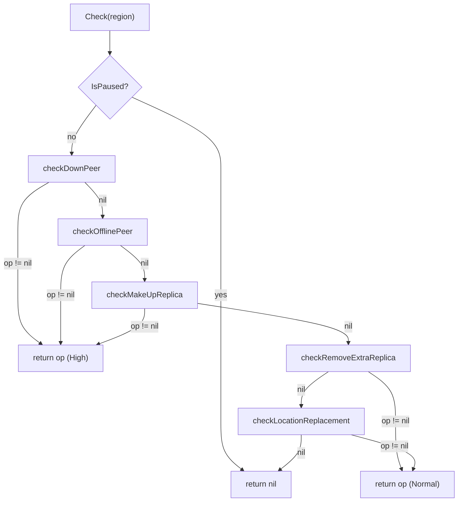
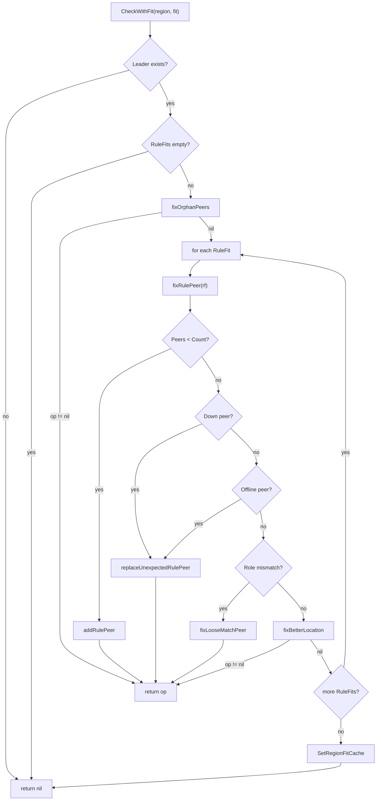

# 第17章 ReplicaChecker と RuleChecker

> **本章で読むソース**
>
> - [`pkg/schedule/checker/checker_controller.go`](https://github.com/tikv/pd/blob/v8.5.6/pkg/schedule/checker/checker_controller.go)
> - [`pkg/schedule/checker/replica_checker.go`](https://github.com/tikv/pd/blob/v8.5.6/pkg/schedule/checker/replica_checker.go)
> - [`pkg/schedule/checker/rule_checker.go`](https://github.com/tikv/pd/blob/v8.5.6/pkg/schedule/checker/rule_checker.go)
> - [`pkg/schedule/checker/replica_strategy.go`](https://github.com/tikv/pd/blob/v8.5.6/pkg/schedule/checker/replica_strategy.go)
> - [`pkg/schedule/placement/fit.go`](https://github.com/tikv/pd/blob/v8.5.6/pkg/schedule/placement/fit.go)

## この章の狙い

Region のレプリカ数や配置が期待と異なる状態を検知し、修復 Operator を生成するのがチェッカーの役割である。
PD には、この修復を担うチェッカーが2つある。
**ReplicaChecker** は `MaxReplicas` 設定だけに基づいてレプリカの過不足を判定する。
**RuleChecker** は Placement Rules のルールセットに基づいて、ロール、ラベル制約、分散度を含めた充足判定を行う。
両者は排他的に動作し、**CheckerController** の `CheckRegion` メソッドが Placement Rules の有効/無効に応じてどちらか一方だけを呼び出す。

本章では、`CheckerController` による振り分けから、各チェッカーの判定フロー、共通の Store 選択ロジックである `ReplicaStrategy` までを読む。
最適化の工夫として、`SelectStoreToAdd` における2段階フィルタリングを機構レベルで説明する。

## 前提

[第11章](../part03-scheduling/11-operator-and-step.md)で Operator と OpStep の構造を読んだ。
[第13章](../part03-scheduling/13-placement-rules.md)で Placement Rules のルール定義と `FitRegion` による充足判定の仕組みを読んだ。
コード引用は tikv/pd のタグ `v8.5.6` に固定する。

---

## 1. CheckerController での振り分け

`Controller` は各種チェッカーのインスタンスを保持する構造体である。

[`pkg/schedule/checker/checker_controller.go L62-L94`](https://github.com/tikv/pd/blob/v8.5.6/pkg/schedule/checker/checker_controller.go#L62-L94)

```go
type Controller struct {
	ctx                     context.Context
	cluster                 sche.CheckerCluster
	conf                    config.CheckerConfigProvider
	opController            *operator.Controller
	learnerChecker          *LearnerChecker
	replicaChecker          *ReplicaChecker
	ruleChecker             *RuleChecker
	splitChecker            *SplitChecker
	mergeChecker            *MergeChecker
	affinityChecker         *AffinityChecker
	jointStateChecker       *JointStateChecker
	priorityInspector       *PriorityInspector
	pendingProcessedRegions *cache.TTLUint64
	suspectKeyRanges        *cache.TTLString
	patrolRegionContext     *PatrolRegionContext
	mu struct {
		syncutil.RWMutex
		duration time.Duration
	}
	interval time.Duration
	workerCount int
	patrolRegionScanLimit int
}
```

`CheckRegion` メソッドは、1つの Region に対してチェッカー群を順に適用し、最初に生成された Operator を返す。

[`pkg/schedule/checker/checker_controller.go L277-L351`](https://github.com/tikv/pd/blob/v8.5.6/pkg/schedule/checker/checker_controller.go#L277-L351)

```go
func (c *Controller) CheckRegion(region *core.RegionInfo) []*operator.Operator {
	opController := c.opController
	if op := c.jointStateChecker.Check(region); op != nil {
		return []*operator.Operator{op}
	}
	if op := c.splitChecker.Check(region); op != nil {
		return []*operator.Operator{op}
	}
	if c.conf.IsPlacementRulesEnabled() {
		skipRuleCheck := c.cluster.GetCheckerConfig().IsPlacementRulesCacheEnabled() &&
			c.cluster.GetRuleManager().IsRegionFitCached(c.cluster, region)
		if skipRuleCheck {
			failpoint.Inject("assertShouldNotCache", func() {
				panic("cached shouldn't be used")
			})
			ruleCheckerGetCacheCounter.Inc()
		} else {
			failpoint.Inject("assertShouldCache", func() {
				panic("cached should be used")
			})
			fit := c.priorityInspector.Inspect(region)
			if op := c.ruleChecker.CheckWithFit(region, fit); op != nil {
				if opController.OperatorCount(operator.OpReplica) < c.conf.GetReplicaScheduleLimit() {
					return []*operator.Operator{op}
				}
				operator.IncOperatorLimitCounter(c.ruleChecker.GetType(), operator.OpReplica)
				c.pendingProcessedRegions.Put(region.GetID(), nil)
			}
		}
	} else {
		if op := c.learnerChecker.Check(region); op != nil {
			return []*operator.Operator{op}
		}
		if op := c.replicaChecker.Check(region); op != nil {
			if opController.OperatorCount(operator.OpReplica) < c.conf.GetReplicaScheduleLimit() {
				return []*operator.Operator{op}
			}
			operator.IncOperatorLimitCounter(c.replicaChecker.GetType(), operator.OpReplica)
			c.pendingProcessedRegions.Put(region.GetID(), nil)
		}
	}
	l := c.cluster.GetRegionLabeler()
	if l.ScheduleDisabled(region) {
		denyCheckersByLabelerCounter.Inc()
		return nil
	}
	if opController.OperatorCount(operator.OpAffinity) < c.conf.GetAffinityScheduleLimit() {
		if ops := c.affinityChecker.Check(region); len(ops) > 0 {
			return ops
		}
	} else {
		operator.IncOperatorLimitCounter(c.affinityChecker.GetType(), operator.OpAffinity)
	}
	if c.mergeChecker != nil {
		allowed := opController.OperatorCount(operator.OpMerge) < c.conf.GetMergeScheduleLimit()
		if !allowed {
			operator.IncOperatorLimitCounter(c.mergeChecker.GetType(), operator.OpMerge)
		} else if ops := c.mergeChecker.Check(region); ops != nil {
			return ops
		}
	}
	return nil
}
```

処理の流れを整理する。

1. `jointStateChecker` と `splitChecker` は、Placement Rules の有効/無効にかかわらず最初に実行される。Joint Consensus の中間状態やルール境界の分割は、レプリカ修復より優先度が高い。
2. `IsPlacementRulesEnabled()` が `true` のとき、「RuleChecker」が呼ばれる。`false` のとき、`LearnerChecker` と「ReplicaChecker」が呼ばれる。この分岐は排他的であり、両方が同時に動くことはない。
3. Placement Rules が有効な場合、`IsRegionFitCached` でキャッシュヒットすればチェックをスキップする。キャッシュミス時は `priorityInspector.Inspect` で `RegionFit` を計算し、`CheckWithFit` に渡す。
4. いずれのチェッカーも、Operator を生成した時点で `ReplicaScheduleLimit` との比較を行う。上限に達していれば Operator を返さず、`pendingProcessedRegions` に Region ID を記録して次回に先送りする。
5. レプリカ修復の後に `affinityChecker` と `mergeChecker` が続く。

## 2. ReplicaChecker

「ReplicaChecker」は `PauseController` を埋め込み、クラスタ情報と設定プロバイダを保持する。

[`pkg/schedule/checker/replica_checker.go L45-L51`](https://github.com/tikv/pd/blob/v8.5.6/pkg/schedule/checker/replica_checker.go#L45-L51)

```go
type ReplicaChecker struct {
	PauseController
	cluster                 sche.CheckerCluster
	conf                    config.CheckerConfigProvider
	pendingProcessedRegions *cache.TTLUint64
	r                       *rand.Rand
}
```

`PauseController` は、管理者が pd-ctl 等でチェッカーを一時停止するための制御を提供する。
`pendingProcessedRegions` は、Store 選択に失敗した Region を一時的に記録し、次回の巡回で再検査するためのキャッシュである。

### Check メソッドの判定順序

`Check` は5つのサブチェックを優先度順に実行し、最初に Operator を返したものを採用する。

[`pkg/schedule/checker/replica_checker.go L74-L104`](https://github.com/tikv/pd/blob/v8.5.6/pkg/schedule/checker/replica_checker.go#L74-L104)

```go
func (c *ReplicaChecker) Check(region *core.RegionInfo) *operator.Operator {
	replicaCheckerCounter.Inc()
	if c.IsPaused() {
		replicaCheckerPausedCounter.Inc()
		return nil
	}
	if op := c.checkDownPeer(region); op != nil {
		replicaCheckerNewOpCounter.Inc()
		op.SetPriorityLevel(constant.High)
		return op
	}
	if op := c.checkOfflinePeer(region); op != nil {
		replicaCheckerNewOpCounter.Inc()
		op.SetPriorityLevel(constant.High)
		return op
	}
	if op := c.checkMakeUpReplica(region); op != nil {
		replicaCheckerNewOpCounter.Inc()
		op.SetPriorityLevel(constant.High)
		return op
	}
	if op := c.checkRemoveExtraReplica(region); op != nil {
		replicaCheckerNewOpCounter.Inc()
		return op
	}
	if op := c.checkLocationReplacement(region); op != nil {
		replicaCheckerNewOpCounter.Inc()
		return op
	}
	return nil
}
```

上から順に、ダウンした Peer の処理、オフライン Store の Peer 処理、レプリカ不足の補充、余剰レプリカの除去、配置改善の5段階である。
最初の3つは `PriorityLevel` が `High` に設定される。
余剰レプリカの除去と配置改善は優先度が設定されないため、デフォルトの `Normal` で実行される。



### checkDownPeer

`checkDownPeer` は、ダウン報告されている Peer のうち、Store のダウン時間が `MaxStoreDownTime` を超えたものを `fixPeer` で修復する。

[`pkg/schedule/checker/replica_checker.go L106-L129`](https://github.com/tikv/pd/blob/v8.5.6/pkg/schedule/checker/replica_checker.go#L106-L129)

```go
func (c *ReplicaChecker) checkDownPeer(region *core.RegionInfo) *operator.Operator {
	if !c.conf.IsRemoveDownReplicaEnabled() {
		return nil
	}
	for _, stats := range region.GetDownPeers() {
		peer := stats.GetPeer()
		if peer == nil {
			continue
		}
		storeID := peer.GetStoreId()
		store := c.cluster.GetStore(storeID)
		if store == nil {
			log.Warn("lost the store, maybe you are recovering the PD cluster", zap.Uint64("store-id", storeID))
			return nil
		}
		if store.DownTime() < c.conf.GetMaxStoreDownTime() {
			continue
		}
		return c.fixPeer(region, storeID, downStatus)
	}
	return nil
}
```

`GetDownPeers()` は Region ハートビートで報告されたダウン Peer のリストを返す。
Store のダウン時間が閾値未満であれば、一時的な障害の可能性があるためスキップする。
閾値を超えた場合にのみ `fixPeer` でレプリカの移動または除去を行う。

### checkOfflinePeer

`checkOfflinePeer` は、Store がオフライン（退役中）状態にある Peer を検出して修復する。

[`pkg/schedule/checker/replica_checker.go L131-L156`](https://github.com/tikv/pd/blob/v8.5.6/pkg/schedule/checker/replica_checker.go#L131-L156)

```go
func (c *ReplicaChecker) checkOfflinePeer(region *core.RegionInfo) *operator.Operator {
	if !c.conf.IsReplaceOfflineReplicaEnabled() {
		return nil
	}
	if len(region.GetLearners()) != 0 {
		return nil
	}
	for _, peer := range region.GetPeers() {
		storeID := peer.GetStoreId()
		store := c.cluster.GetStore(storeID)
		if store == nil {
			log.Warn("lost the store, maybe you are recovering the PD cluster", zap.Uint64("store-id", storeID))
			return nil
		}
		if store.IsUp() {
			continue
		}
		return c.fixPeer(region, storeID, offlineStatus)
	}
	return nil
}
```

Region に Learner が含まれる場合はスキップする。
Learner が存在する Region は Placement Rules 配下で管理されるべきであり、「ReplicaChecker」の単純な `MaxReplicas` ロジックでは適切に扱えないためである。

### checkMakeUpReplica

`checkMakeUpReplica` は、Peer 数が `MaxReplicas` 未満の Region に新しい Peer を追加する。

[`pkg/schedule/checker/replica_checker.go L158-L183`](https://github.com/tikv/pd/blob/v8.5.6/pkg/schedule/checker/replica_checker.go#L158-L183)

```go
func (c *ReplicaChecker) checkMakeUpReplica(region *core.RegionInfo) *operator.Operator {
	if !c.conf.IsMakeUpReplicaEnabled() {
		return nil
	}
	if len(region.GetPeers()) >= c.conf.GetMaxReplicas() {
		return nil
	}
	log.Debug("region has fewer than max replicas", zap.Uint64("region-id", region.GetID()), zap.Int("peers", len(region.GetPeers())))
	regionStores := c.cluster.GetRegionStores(region)
	target, filterByTempState := c.strategy(c.r, region).SelectStoreToAdd(regionStores)
	if target == 0 {
		log.Debug("no store to add replica", zap.Uint64("region-id", region.GetID()))
		replicaCheckerNoTargetStoreCounter.Inc()
		if filterByTempState {
			c.pendingProcessedRegions.Put(region.GetID(), nil)
		}
		return nil
	}
	newPeer := &metapb.Peer{StoreId: target}
	op, err := operator.CreateAddPeerOperator("make-up-replica", c.cluster, region, newPeer, operator.OpReplica)
	if err != nil {
		log.Debug("create make-up-replica operator fail", errs.ZapError(err))
		return nil
	}
	return op
}
```

Store 選択は `ReplicaStrategy.SelectStoreToAdd` に委譲される（詳細は第4節で扱う）。
`filterByTempState` が `true` のときは、Store の一時的な状態（スナップショット送信中など）が原因で候補が見つからなかった場合である。
この Region を `pendingProcessedRegions` に記録しておくことで、一時的状態が解消された後に再検査できる。

### checkRemoveExtraReplica

`checkRemoveExtraReplica` は、Voter 数が `MaxReplicas` を超える Region から余剰 Peer を除去する。

[`pkg/schedule/checker/replica_checker.go L185-L208`](https://github.com/tikv/pd/blob/v8.5.6/pkg/schedule/checker/replica_checker.go#L185-L208)

```go
func (c *ReplicaChecker) checkRemoveExtraReplica(region *core.RegionInfo) *operator.Operator {
	if !c.conf.IsRemoveExtraReplicaEnabled() {
		return nil
	}
	if len(region.GetVoters()) <= c.conf.GetMaxReplicas() {
		return nil
	}
	log.Debug("region has more than max replicas", zap.Uint64("region-id", region.GetID()), zap.Int("peers", len(region.GetPeers())))
	regionStores := c.cluster.GetRegionStores(region)
	old := c.strategy(c.r, region).SelectStoreToRemove(regionStores)
	if old == 0 {
		replicaCheckerNoWorstPeerCounter.Inc()
		c.pendingProcessedRegions.Put(region.GetID(), nil)
		return nil
	}
	op, err := operator.CreateRemovePeerOperator("remove-extra-replica", c.cluster, operator.OpReplica, region, old)
	if err != nil {
		replicaCheckerCreateOpFailedCounter.Inc()
		return nil
	}
	return op
}
```

除去対象の選択は `SelectStoreToRemove` が行う。
ラベルの分散度が最も低い Store（他の Store と同じラベルを持つ Store）が優先的に選ばれる。

### checkLocationReplacement

`checkLocationReplacement` は、レプリカ数は正しいがラベル分散が最適でない場合に、Peer を別の Store へ移動して分散度を改善する。

[`pkg/schedule/checker/replica_checker.go L210-L236`](https://github.com/tikv/pd/blob/v8.5.6/pkg/schedule/checker/replica_checker.go#L210-L236)

```go
func (c *ReplicaChecker) checkLocationReplacement(region *core.RegionInfo) *operator.Operator {
	if !c.conf.IsLocationReplacementEnabled() {
		return nil
	}
	strategy := c.strategy(c.r, region)
	regionStores := c.cluster.GetRegionStores(region)
	oldStore := strategy.SelectStoreToRemove(regionStores)
	if oldStore == 0 {
		replicaCheckerAllRightCounter.Inc()
		return nil
	}
	newStore, _ := strategy.SelectStoreToImprove(regionStores, oldStore)
	if newStore == 0 {
		log.Debug("no better peer", zap.Uint64("region-id", region.GetID()))
		replicaCheckerNotBetterCounter.Inc()
		return nil
	}
	newPeer := &metapb.Peer{StoreId: newStore}
	op, err := operator.CreateMovePeerOperator("move-to-better-location", c.cluster, region, operator.OpReplica, oldStore, newPeer)
	if err != nil {
		replicaCheckerCreateOpFailedCounter.Inc()
		return nil
	}
	return op
}
```

`SelectStoreToRemove` でラベル分散度が最も低い Store を選び、`SelectStoreToImprove` でその Store より分散度の高い代替先を探す。
代替先が見つからなければ現状維持となり、Operator は生成されない。

### fixPeer

`checkDownPeer` と `checkOfflinePeer` は、障害 Peer の修復を `fixPeer` に委譲する。
`fixPeer` は Voter 数が `MaxReplicas` を超えていれば単純に除去し、そうでなければ別の Store へ移動する。

[`pkg/schedule/checker/replica_checker.go L238-L280`](https://github.com/tikv/pd/blob/v8.5.6/pkg/schedule/checker/replica_checker.go#L238-L280)

```go
func (c *ReplicaChecker) fixPeer(region *core.RegionInfo, storeID uint64, status string) *operator.Operator {
	if len(region.GetVoters()) > c.conf.GetMaxReplicas() {
		removeExtra := fmt.Sprintf("remove-extra-%s-replica", status)
		op, err := operator.CreateRemovePeerOperator(removeExtra, c.cluster, operator.OpReplica, region, storeID)
		if err != nil {
			if status == offlineStatus {
				replicaCheckerRemoveExtraOfflineFailedCounter.Inc()
			} else if status == downStatus {
				replicaCheckerRemoveExtraDownFailedCounter.Inc()
			}
			return nil
		}
		return op
	}
	regionStores := c.cluster.GetRegionStores(region)
	target, filterByTempState := c.strategy(c.r, region).SelectStoreToFix(regionStores, storeID)
	if target == 0 {
		if status == offlineStatus {
			replicaCheckerNoStoreOfflineCounter.Inc()
		} else if status == downStatus {
			replicaCheckerNoStoreDownCounter.Inc()
		}
		log.Debug("no best store to add replica", zap.Uint64("region-id", region.GetID()))
		if filterByTempState {
			c.pendingProcessedRegions.Put(region.GetID(), nil)
		}
		return nil
	}
	newPeer := &metapb.Peer{StoreId: target}
	replace := fmt.Sprintf("replace-%s-replica", status)
	op, err := operator.CreateMovePeerOperator(replace, c.cluster, region, operator.OpReplica, storeID, newPeer)
	if err != nil {
		// ... (中略) ...
		return nil
	}
	return op
}
```

Voter 数が `MaxReplicas` を超えていれば、障害 Peer をそのまま除去するだけでレプリカ数は正常に戻る。
超えていない場合は `SelectStoreToFix` で移動先を選び、`CreateMovePeerOperator` で移動 Operator を生成する。
**移動 Operator は内部的に新 Peer の追加と旧 Peer の除去を連続して行う操作であり、レプリカ数が一時的に `MaxReplicas + 1` になる期間が生じる**。

### strategy メソッド

「ReplicaChecker」が Store 選択に使う `ReplicaStrategy` の生成は以下のメソッドで行う。

[`pkg/schedule/checker/replica_checker.go L282-L291`](https://github.com/tikv/pd/blob/v8.5.6/pkg/schedule/checker/replica_checker.go#L282-L291)

```go
func (c *ReplicaChecker) strategy(r *rand.Rand, region *core.RegionInfo) *ReplicaStrategy {
	return &ReplicaStrategy{
		checkerName:    c.Name(),
		cluster:        c.cluster,
		locationLabels: c.conf.GetLocationLabels(),
		isolationLevel: c.conf.GetIsolationLevel(),
		region:         region,
		r:              r,
	}
}
```

`locationLabels` と `isolationLevel` はクラスタ全体の設定から取得される。
「RuleChecker」の `strategy` メソッドとの違いは、後者がルールごとの `LocationLabels` と `LabelConstraints` を使う点である。

## 3. RuleChecker

「RuleChecker」は Placement Rules が有効なときに動作するチェッカーである。
ルールごとに期待される Peer 数、ロール、ラベル制約、Witness 設定を検査し、充足していなければ修復 Operator を生成する。

[`pkg/schedule/checker/rule_checker.go L53-L62`](https://github.com/tikv/pd/blob/v8.5.6/pkg/schedule/checker/rule_checker.go#L53-L62)

```go
type RuleChecker struct {
	PauseController
	cluster                 sche.CheckerCluster
	ruleManager             *placement.RuleManager
	pendingProcessedRegions *cache.TTLUint64
	pendingList             cache.Cache
	switchWitnessCache      *cache.TTLUint64
	record                  *recorder
	r                       *rand.Rand
}
```

`ruleManager` はルールセットの管理と `FitRegion` の実行を担う。
`switchWitnessCache` は Witness と非 Witness の切り替えが頻繁に発生するのを抑止する TTL キャッシュである。
`record` は Leader を一時的に引き受けた Store のカウントを記録し、Leader 移動先の偏りを防ぐ。

### RegionFit と RuleFit

「RuleChecker」の判定は `RegionFit` 構造体を起点とする。
`FitRegion` の結果として得られるこの構造体は、各ルールに対する充足状況と、どのルールにも属さない孤立 Peer を保持する。

[`pkg/schedule/placement/fit.go L31-L37`](https://github.com/tikv/pd/blob/v8.5.6/pkg/schedule/placement/fit.go#L31-L37)

```go
type RegionFit struct {
	RuleFits     []*RuleFit     `json:"rule-fits"`
	OrphanPeers  []*metapb.Peer `json:"orphan-peers"`
	regionStores []*core.StoreInfo
	rules        []*Rule
}
```

`IsSatisfied` は、すべての `RuleFit` が充足し、孤立 Peer がゼロのときに `true` を返す。

[`pkg/schedule/placement/fit.go L84-L94`](https://github.com/tikv/pd/blob/v8.5.6/pkg/schedule/placement/fit.go#L84-L94)

```go
func (f *RegionFit) IsSatisfied() bool {
	if len(f.RuleFits) == 0 {
		return false
	}
	for _, r := range f.RuleFits {
		if !r.IsSatisfied() {
			return false
		}
	}
	return len(f.OrphanPeers) == 0
}
```

個々の `RuleFit` は、ルールとそれに割り当てられた Peer、ロールが異なる Peer、分散度スコアを保持する。

[`pkg/schedule/placement/fit.go L122-L137`](https://github.com/tikv/pd/blob/v8.5.6/pkg/schedule/placement/fit.go#L122-L137)

```go
type RuleFit struct {
	Rule *Rule `json:"rule"`
	Peers []*metapb.Peer `json:"peers"`
	PeersWithDifferentRole []*metapb.Peer `json:"peers-different-role"`
	IsolationScore float64 `json:"isolation-score"`
	WitnessScore   int     `json:"witness-score"`
	stores []*core.StoreInfo
}
```

[`pkg/schedule/placement/fit.go L140-L142`](https://github.com/tikv/pd/blob/v8.5.6/pkg/schedule/placement/fit.go#L140-L142)

```go
func (f *RuleFit) IsSatisfied() bool {
	return len(f.Peers) == f.Rule.Count && len(f.PeersWithDifferentRole) == 0
}
```

`RuleFit` が充足するのは、割り当て Peer 数がルールの `Count` と一致し、ロール不一致の Peer がゼロの場合である。

### Check と CheckWithFit

`Check` は `FitRegion` で `RegionFit` を計算してから `CheckWithFit` に委譲する。
`CheckerController` からは `priorityInspector.Inspect` で事前計算した `RegionFit` を直接 `CheckWithFit` に渡す経路もある。

[`pkg/schedule/checker/rule_checker.go L89-L92`](https://github.com/tikv/pd/blob/v8.5.6/pkg/schedule/checker/rule_checker.go#L89-L92)

```go
func (c *RuleChecker) Check(region *core.RegionInfo) *operator.Operator {
	fit := c.cluster.GetRuleManager().FitRegion(c.cluster, region)
	return c.CheckWithFit(region, fit)
}
```

[`pkg/schedule/checker/rule_checker.go L95-L152`](https://github.com/tikv/pd/blob/v8.5.6/pkg/schedule/checker/rule_checker.go#L95-L152)

```go
func (c *RuleChecker) CheckWithFit(region *core.RegionInfo, fit *placement.RegionFit) (op *operator.Operator) {
	if c.IsPaused() {
		ruleCheckerPausedCounter.Inc()
		return nil
	}
	if region.GetLeader() == nil {
		ruleCheckerRegionNoLeaderCounter.Inc()
		log.Debug("fail to check region", zap.Uint64("region-id", region.GetID()), zap.Error(errRegionNoLeader))
		return
	}
	if fit == nil {
		return
	}
	c.ruleManager.InvalidCache(region.GetID())
	ruleCheckerCounter.Inc()
	c.record.refresh(c.cluster)
	if len(fit.RuleFits) == 0 {
		ruleCheckerNeedSplitCounter.Inc()
		return nil
	}
	op, err := c.fixOrphanPeers(region, fit)
	if err != nil {
		log.Debug("fail to fix orphan peer", errs.ZapError(err))
	} else if op != nil {
		c.pendingList.Remove(region.GetID())
		return op
	}
	for _, rf := range fit.RuleFits {
		op, err := c.fixRulePeer(region, fit, rf)
		if err != nil {
			log.Debug("fail to fix rule peer", zap.String("rule-group", rf.Rule.GroupID), zap.String("rule-id", rf.Rule.ID), errs.ZapError(err))
			continue
		}
		if op != nil {
			c.pendingList.Remove(region.GetID())
			return op
		}
	}
	if c.cluster.GetCheckerConfig().IsPlacementRulesCacheEnabled() {
		if placement.ValidateFit(fit) && placement.ValidateRegion(region) && placement.ValidateStores(fit.GetRegionStores()) {
			c.ruleManager.SetRegionFitCache(region, fit)
			ruleCheckerSetCacheCounter.Inc()
		}
	}
	return nil
}
```

`CheckWithFit` の処理は以下の順序で進む。

1. Leader が存在しない Region や `RegionFit` が nil の場合は何もしない。
2. `RuleFits` が空の場合、Region のキー範囲が複数のルールグループにまたがっている可能性がある。この場合は分割が必要であり、Operator は生成しない。
3. `fixOrphanPeers` で、どのルールにも属さない孤立 Peer を除去または活用する。
4. 各 `RuleFit` に対して `fixRulePeer` を呼び、Peer の不足、ダウン、オフライン、ロール不一致、配置改善を順に検査する。
5. すべてのチェックで修復が不要であれば、「RegionFit」をキャッシュに格納する。次回の巡回で `IsRegionFitCached` がヒットすれば、`FitRegion` の再計算をスキップできる。

### fixRulePeer

`fixRulePeer` は1つの `RuleFit` に対して、Peer 不足、ダウン、オフライン、ロール不一致、配置改善を順に検査する。

[`pkg/schedule/checker/rule_checker.go L165-L201`](https://github.com/tikv/pd/blob/v8.5.6/pkg/schedule/checker/rule_checker.go#L165-L201)

```go
func (c *RuleChecker) fixRulePeer(region *core.RegionInfo, fit *placement.RegionFit, rf *placement.RuleFit) (*operator.Operator, error) {
	if len(rf.Peers) < rf.Rule.Count {
		return c.addRulePeer(region, fit, rf)
	}
	for _, peer := range rf.Peers {
		if c.isDownPeer(region, peer) {
			if c.isStoreDownTimeHitMaxDownTime(peer.GetStoreId()) {
				ruleCheckerReplaceDownCounter.Inc()
				return c.replaceUnexpectedRulePeer(region, rf, fit, peer, downStatus)
			}
			if c.isWitnessEnabled() && core.IsVoter(peer) {
				if witness, ok := c.hasAvailableWitness(region, peer); ok {
					ruleCheckerPromoteWitnessCounter.Inc()
					return operator.CreateNonWitnessPeerOperator("promote-witness-for-down", c.cluster, region, witness)
				}
			}
		}
		if c.isOfflinePeer(peer) {
			ruleCheckerReplaceOfflineCounter.Inc()
			return c.replaceUnexpectedRulePeer(region, rf, fit, peer, offlineStatus)
		}
	}
	for _, peer := range rf.PeersWithDifferentRole {
		op, err := c.fixLooseMatchPeer(region, fit, rf, peer)
		if err != nil {
			return nil, err
		}
		if op != nil {
			return op, nil
		}
	}
	return c.fixBetterLocation(region, rf)
}
```

処理の流れは以下のとおりである。

1. Peer 数がルールの `Count` 未満であれば `addRulePeer` で追加する。
2. Peer 数が足りている場合、ダウンした Peer を検査する。ダウン時間が `MaxStoreDownTime` を超えていれば `replaceUnexpectedRulePeer` で置換する。超えていなくても Witness 機能が有効で利用可能な Witness Peer があれば、Witness を非 Witness に昇格させてダウン Peer の代わりとする。
3. オフライン Store の Peer は即座に `replaceUnexpectedRulePeer` で置換する。
4. `PeersWithDifferentRole`（ルールのロール指定と実際のロールが異なる Peer）がある場合、`fixLooseMatchPeer` でロールを修正する。
5. いずれにも該当しなければ `fixBetterLocation` でラベル分散の改善を試みる。

### addRulePeer

`addRulePeer` は、ルールの `Count` に対して Peer が不足している場合に、新しい Peer を追加する。

[`pkg/schedule/checker/rule_checker.go L203-L240`](https://github.com/tikv/pd/blob/v8.5.6/pkg/schedule/checker/rule_checker.go#L203-L240)

```go
func (c *RuleChecker) addRulePeer(region *core.RegionInfo, fit *placement.RegionFit, rf *placement.RuleFit) (*operator.Operator, error) {
	ruleCheckerAddRulePeerCounter.Inc()
	ruleStores := c.getRuleFitStores(rf)
	isWitness := rf.Rule.IsWitness && c.isWitnessEnabled()
	store, filterByTempState := c.strategy(c.r, region, rf.Rule, isWitness).SelectStoreToAdd(ruleStores)
	if store == 0 {
		ruleCheckerNoStoreAddCounter.Inc()
		c.handleFilterState(region, filterByTempState)
		for _, p := range region.GetPeers() {
			s := c.cluster.GetStore(p.GetStoreId())
			if placement.MatchLabelConstraints(s, rf.Rule.LabelConstraints) {
				oldPeerRuleFit := fit.GetRuleFit(p.GetId())
				if oldPeerRuleFit == nil || !oldPeerRuleFit.IsSatisfied() || oldPeerRuleFit == rf {
					continue
				}
				ruleCheckerNoStoreThenTryReplace.Inc()
				op, err := c.replaceUnexpectedRulePeer(region, oldPeerRuleFit, fit, p, "swap-fit")
				if err != nil {
					return nil, err
				}
				if op != nil {
					return op, nil
				}
			}
		}
		return nil, errNoStoreToAdd
	}
	peer := &metapb.Peer{StoreId: store, Role: rf.Rule.Role.MetaPeerRole(), IsWitness: isWitness}
	op, err := operator.CreateAddPeerOperator("add-rule-peer", c.cluster, region, peer, operator.OpReplica)
	if err != nil {
		return nil, err
	}
	op.SetPriorityLevel(constant.High)
	return op, nil
}
```

`SelectStoreToAdd` で候補 Store が見つかれば、ルールの `Role` と `IsWitness` を反映した Peer を追加する。
候補が見つからない場合のフォールバックが興味深い。
既存の Peer の中からラベル制約を満たす Store を探し、その Peer が属する別のルールの `RuleFit` が充足していれば、その Peer を現在のルールに「奪う」形で `replaceUnexpectedRulePeer` を呼ぶ。
ルール間で Peer を再配分することで、新しい Store を追加できない状況でも全体の充足度を改善する。

### replaceUnexpectedRulePeer

`replaceUnexpectedRulePeer` は、ダウン、オフライン、またはルール不適合の Peer を新しい Store の Peer に置換する。

[`pkg/schedule/checker/rule_checker.go L243-L313`](https://github.com/tikv/pd/blob/v8.5.6/pkg/schedule/checker/rule_checker.go#L243-L313)

```go
func (c *RuleChecker) replaceUnexpectedRulePeer(region *core.RegionInfo, rf *placement.RuleFit, fit *placement.RegionFit, peer *metapb.Peer, status string) (*operator.Operator, error) {
	var fastFailover bool
	if c.isWitnessEnabled() && !c.cluster.GetStore(peer.StoreId).IsTiFlash() {
		if status == "down" {
			fastFailover = true
		} else {
			fastFailover = rf.Rule.IsWitness
		}
	} else {
		fastFailover = false
	}
	ruleStores := c.getRuleFitStores(rf)
	store, filterByTempState := c.strategy(c.r, region, rf.Rule, fastFailover).SelectStoreToFix(ruleStores, peer.GetStoreId())
	if store == 0 {
		ruleCheckerNoStoreReplaceCounter.Inc()
		c.handleFilterState(region, filterByTempState)
		return nil, errNoStoreToReplace
	}
	newPeer := &metapb.Peer{StoreId: store, Role: rf.Rule.Role.MetaPeerRole(), IsWitness: fastFailover}
	var newLeader *metapb.Peer
	if region.GetLeader().GetId() == peer.GetId() {
		minCount := uint64(math.MaxUint64)
		for _, p := range region.GetPeers() {
			count := c.record.getOfflineLeaderCount(p.GetStoreId())
			checkPeerHealth := func() bool {
				if p.GetId() == peer.GetId() {
					return true
				}
				if region.GetDownPeer(p.GetId()) != nil || region.GetPendingPeer(p.GetId()) != nil {
					return false
				}
				return c.allowLeader(fit, p)
			}
			if minCount > count && checkPeerHealth() {
				minCount = count
				newLeader = p
			}
		}
	}
	createOp := func() (*operator.Operator, error) {
		if newLeader != nil && newLeader.GetId() != peer.GetId() {
			return operator.CreateReplaceLeaderPeerOperator("replace-rule-"+status+"-leader-peer", c.cluster, region, operator.OpReplica, peer.StoreId, newPeer, newLeader)
		}
		var desc string
		if fastFailover {
			desc = "fast-replace-rule-" + status + "-peer"
		} else {
			desc = "replace-rule-" + status + "-peer"
		}
		return operator.CreateMovePeerOperator(desc, c.cluster, region, operator.OpReplica, peer.StoreId, newPeer)
	}
	op, err := createOp()
	if err != nil {
		return nil, err
	}
	if newLeader != nil {
		c.record.incOfflineLeaderCount(newLeader.GetStoreId())
	}
	if fastFailover {
		op.SetPriorityLevel(constant.Urgent)
	} else {
		op.SetPriorityLevel(constant.High)
	}
	return op, nil
}
```

この関数には3つの注目点がある。

第一に、`fastFailover` の判定である。
Witness 機能が有効で、対象 Store が TiFlash でない場合、ダウン状態であれば `fastFailover` を `true` にする。
「高速フェイルオーバー」では新しい Peer を Witness として作成し、データ全体のコピーを待たずに Raft グループに参加させる。
この場合、Operator の優先度は `Urgent` に設定される。

第二に、置換対象が Leader である場合の Leader 移転である。
`record.getOfflineLeaderCount` で各 Store が過去に引き受けた一時 Leader の回数を取得し、最小カウントの健全な Peer を新 Leader に選ぶ。
これにより、特定の Store に Leader が集中するのを防ぐ。

第三に、Operator の生成方法の分岐である。
Leader 移転が必要な場合は `CreateReplaceLeaderPeerOperator` を使い、Leader 移転と Peer 置換を1つの Operator にまとめる。
それ以外は `CreateMovePeerOperator` で通常の移動を行う。

### fixLooseMatchPeer

`fixLooseMatchPeer` は、ルールに割り当てられたがロールが一致しない Peer を修正する。

[`pkg/schedule/checker/rule_checker.go L315-L370`](https://github.com/tikv/pd/blob/v8.5.6/pkg/schedule/checker/rule_checker.go#L315-L370)

```go
func (c *RuleChecker) fixLooseMatchPeer(region *core.RegionInfo, fit *placement.RegionFit, rf *placement.RuleFit, peer *metapb.Peer) (*operator.Operator, error) {
	if core.IsLearner(peer) && rf.Rule.Role != placement.Learner {
		ruleCheckerFixPeerRoleCounter.Inc()
		return operator.CreatePromoteLearnerOperator("fix-peer-role", c.cluster, region, peer)
	}
	if region.GetLeader().GetId() != peer.GetId() && rf.Rule.Role == placement.Leader {
		ruleCheckerFixLeaderRoleCounter.Inc()
		if c.allowLeader(fit, peer) {
			return operator.CreateTransferLeaderOperator("fix-leader-role", c.cluster, region, peer.GetStoreId(), []uint64{}, 0)
		}
		ruleCheckerNotAllowLeaderCounter.Inc()
		return nil, errPeerCannotBeLeader
	}
	if region.GetLeader().GetId() == peer.GetId() && rf.Rule.Role == placement.Follower {
		ruleCheckerFixFollowerRoleCounter.Inc()
		for _, p := range region.GetPeers() {
			if c.allowLeader(fit, p) {
				return operator.CreateTransferLeaderOperator("fix-follower-role", c.cluster, region, p.GetStoreId(), []uint64{}, 0)
			}
		}
		ruleCheckerNoNewLeaderCounter.Inc()
		return nil, errNoNewLeader
	}
	if core.IsVoter(peer) && rf.Rule.Role == placement.Learner {
		ruleCheckerDemoteVoterRoleCounter.Inc()
		return operator.CreateDemoteVoterOperator("fix-demote-voter", c.cluster, region, peer)
	}
	if region.GetLeader().GetId() == peer.GetId() && rf.Rule.IsWitness {
		return nil, errPeerCannotBeWitness
	}
	if !core.IsWitness(peer) && rf.Rule.IsWitness && c.isWitnessEnabled() {
		c.switchWitnessCache.UpdateTTL(c.cluster.GetCheckerConfig().GetSwitchWitnessInterval())
		if c.switchWitnessCache.Exists(region.GetID()) {
			ruleCheckerRecentlyPromoteToNonWitnessCounter.Inc()
			return nil, nil
		}
		if len(region.GetPendingPeers()) > 0 {
			ruleCheckerCancelSwitchToWitnessCounter.Inc()
			return nil, nil
		}
		// ... (中略) ...
		return operator.CreateWitnessPeerOperator("fix-witness-peer", c.cluster, region, peer)
	} else if core.IsWitness(peer) && (!rf.Rule.IsWitness || !c.isWitnessEnabled()) {
		// ... (中略) ...
		return operator.CreateNonWitnessPeerOperator("fix-non-witness-peer", c.cluster, region, peer)
	}
	return nil, nil
}
```

ロール不一致のパターンと対応する修復操作を整理する。

- Learner だがルールが Learner 以外を指定：Voter に昇格（`CreatePromoteLearnerOperator`）
- Follower だがルールが Leader を指定：Leader を移転（`CreateTransferLeaderOperator`）
- Leader だがルールが Follower を指定：別の Peer に Leader を移転
- Voter だがルールが Learner を指定：Learner に降格（`CreateDemoteVoterOperator`）
- 非 Witness だがルールが Witness を指定：Witness に切り替え（`CreateWitnessPeerOperator`）。ただし `switchWitnessCache` に記録がある場合や Pending Peer がある場合はスキップし、切り替えの振動を防ぐ
- Witness だがルールが Witness でない（または Witness 機能が無効）：非 Witness に切り替え（`CreateNonWitnessPeerOperator`）

### fixBetterLocation

すべてのルールが充足している場合でも、ラベルの分散度を改善できる余地があれば Peer を移動する。

[`pkg/schedule/checker/rule_checker.go L393-L423`](https://github.com/tikv/pd/blob/v8.5.6/pkg/schedule/checker/rule_checker.go#L393-L423)

```go
func (c *RuleChecker) fixBetterLocation(region *core.RegionInfo, rf *placement.RuleFit) (*operator.Operator, error) {
	if len(rf.Rule.LocationLabels) == 0 {
		return nil, nil
	}
	isWitness := rf.Rule.IsWitness && c.isWitnessEnabled()
	strategy := c.strategy(c.r, region, rf.Rule, isWitness)
	ruleStores := c.getRuleFitStores(rf)
	oldStore := strategy.SelectStoreToRemove(ruleStores)
	if oldStore == 0 {
		return nil, nil
	}
	var coLocationStores []*core.StoreInfo
	regionStores := c.cluster.GetRegionStores(region)
	for _, s := range regionStores {
		if placement.MatchLabelConstraints(s, rf.Rule.LabelConstraints) {
			coLocationStores = append(coLocationStores, s)
		}
	}
	newStore, filterByTempState := strategy.SelectStoreToImprove(coLocationStores, oldStore)
	if newStore == 0 {
		log.Debug("no replacement store", zap.Uint64("region-id", region.GetID()))
		c.handleFilterState(region, filterByTempState)
		return nil, nil
	}
	ruleCheckerMoveToBetterLocationCounter.Inc()
	newPeer := &metapb.Peer{StoreId: newStore, Role: rf.Rule.Role.MetaPeerRole(), IsWitness: isWitness}
	return operator.CreateMovePeerOperator("move-to-better-location", c.cluster, region, operator.OpReplica, oldStore, newPeer)
}
```

「ReplicaChecker」の `checkLocationReplacement` と同じ構造だが、移動先の候補をルールの `LabelConstraints` でフィルタする点が異なる。
ルールが `LocationLabels` を持たない場合は分散度の判定ができないため、即座に `nil` を返す。

### fixOrphanPeers

`fixOrphanPeers` は、どのルールにも割り当てられなかった孤立 Peer を処理する。

[`pkg/schedule/checker/rule_checker.go L425-L568`](https://github.com/tikv/pd/blob/v8.5.6/pkg/schedule/checker/rule_checker.go#L425-L568)

```go
func (c *RuleChecker) fixOrphanPeers(region *core.RegionInfo, fit *placement.RegionFit) (*operator.Operator, error) {
	if len(fit.OrphanPeers) == 0 {
		return nil, nil
	}
	// ... (中略) ...

	var pinDownPeer *metapb.Peer
	hasUnhealthyFit := false
	for _, rf := range fit.RuleFits {
		if !rf.IsSatisfied() {
			hasUnhealthyFit = true
			break
		}
		pinDownPeer, hasUnhealthyFit = checkDownPeer(rf.Peers)
		if hasUnhealthyFit {
			break
		}
	}

	if !hasUnhealthyFit {
		ruleCheckerRemoveOrphanPeerCounter.Inc()
		return operator.CreateRemovePeerOperator("remove-orphan-peer", c.cluster, 0, region, fit.OrphanPeers[0].StoreId)
	}

	// ... (中略) ...
}
```

処理は2つの分岐に分かれる。

すべての `RuleFit` が健全（充足かつダウン Peer なし）であれば、孤立 Peer は単に余剰であり、`CreateRemovePeerOperator` で除去する。

いずれかの `RuleFit` が不健全であれば、孤立 Peer をダウンした Peer の代替として活用する試みを行う。
孤立 Peer がダウン Peer の Store を `Replace` で置き換え可能であれば、ロールに応じた Operator（Leader 移転を含む移動、昇格など）を生成する。
活用できなければ孤立 Peer の除去は見送り、ダウン Peer が回復するのを待つ。

### strategy メソッド

「RuleChecker」の `strategy` メソッドは、ルールごとの `LocationLabels`、`IsolationLevel`、`LabelConstraints` を `ReplicaStrategy` に渡す。

[`pkg/schedule/checker/rule_checker.go L625-L636`](https://github.com/tikv/pd/blob/v8.5.6/pkg/schedule/checker/rule_checker.go#L625-L636)

```go
func (c *RuleChecker) strategy(r *rand.Rand, region *core.RegionInfo, rule *placement.Rule, fastFailover bool) *ReplicaStrategy {
	return &ReplicaStrategy{
		checkerName:    c.Name(),
		cluster:        c.cluster,
		isolationLevel: rule.IsolationLevel,
		locationLabels: rule.LocationLabels,
		region:         region,
		extraFilters:   []filter.Filter{filter.NewLabelConstraintFilter(c.Name(), rule.LabelConstraints)},
		fastFailover:   fastFailover,
		r:              r,
	}
}
```

「ReplicaChecker」の `strategy` がクラスタ全体の `LocationLabels` を使うのに対し、「RuleChecker」はルールの `LocationLabels` を使う。
`extraFilters` に `LabelConstraintFilter` を追加することで、ルールの `LabelConstraints` を満たさない Store を候補から除外する。



## 4. ReplicaStrategy

「ReplicaChecker」と「RuleChecker」は、Store の選択ロジックを共通の `ReplicaStrategy` に委譲する。

[`pkg/schedule/checker/replica_strategy.go L30-L39`](https://github.com/tikv/pd/blob/v8.5.6/pkg/schedule/checker/replica_strategy.go#L30-L39)

```go
type ReplicaStrategy struct {
	r              *rand.Rand
	checkerName    string
	cluster        sche.CheckerCluster
	locationLabels []string
	isolationLevel string
	region         *core.RegionInfo
	extraFilters   []filter.Filter
	fastFailover   bool
}
```

`locationLabels` はラベル分散度の評価に使われる（例：`["zone", "rack", "host"]`）。
`isolationLevel` は最低限の分離レベルを指定し、同一ラベル値の Store への配置を禁止する。

### SelectStoreToAdd と2段階フィルタリング

`SelectStoreToAdd` は、新しい Peer を配置する Store を選択するメソッドである。
**このメソッドは2段階のフィルタリングを行い、Store の一時的な状態による次善の配置を防ぐ**。

[`pkg/schedule/checker/replica_strategy.go L51-L94`](https://github.com/tikv/pd/blob/v8.5.6/pkg/schedule/checker/replica_strategy.go#L51-L94)

```go
func (s *ReplicaStrategy) SelectStoreToAdd(coLocationStores []*core.StoreInfo, extraFilters ...filter.Filter) (uint64, bool) {
	// The selection process uses a two-stage fashion. The first stage
	// ignores the temporary state of the stores and selects the stores
	// with the highest score according to the location label. The second
	// stage considers all temporary states and capacity factors to select
	// the most suitable target.
	//
	// The reason for it is to prevent the non-optimal replica placement due
	// to the short-term state, resulting in redundant scheduling.
	level := constant.High
	if s.fastFailover {
		level = constant.Urgent
	}
	filters := []filter.Filter{
		filter.NewExcludedFilter(s.checkerName, nil, s.region.GetStoreIDs()),
		filter.NewStorageThresholdFilter(s.checkerName),
		filter.NewSpecialUseFilter(s.checkerName),
		&filter.StoreStateFilter{ActionScope: s.checkerName, MoveRegion: true, AllowTemporaryStates: true, OperatorLevel: level},
	}
	if len(s.locationLabels) > 0 && s.isolationLevel != "" {
		filters = append(filters, filter.NewIsolationFilter(s.checkerName, s.isolationLevel, s.locationLabels, coLocationStores))
	}
	if len(extraFilters) > 0 {
		filters = append(filters, extraFilters...)
	}
	if len(s.extraFilters) > 0 {
		filters = append(filters, s.extraFilters...)
	}
	isolationComparer := filter.IsolationComparer(s.locationLabels, coLocationStores)
	strictStateFilter := &filter.StoreStateFilter{ActionScope: s.checkerName, MoveRegion: true, AllowFastFailover: s.fastFailover, OperatorLevel: level}
	targetCandidate := filter.NewCandidates(s.r, s.cluster.GetStores()).
		FilterTarget(s.cluster.GetCheckerConfig(), nil, nil, filters...).
		KeepTheTopStores(isolationComparer, false)
	if targetCandidate.Len() == 0 {
		return 0, false
	}
	target := targetCandidate.FilterTarget(s.cluster.GetCheckerConfig(), nil, nil, strictStateFilter).
		PickTheTopStore(filter.RegionScoreComparer(s.cluster.GetCheckerConfig()), true)
	if target == nil {
		return 0, true
	}
	return target.GetID(), false
}
```

2段階フィルタリングの仕組みを説明する。

第1段階では、`StoreStateFilter` の `AllowTemporaryStates` を `true` に設定する。
これにより、スナップショット送信中、Busy 状態、Pending Peer 過多といった一時的な状態は無視され、Store の恒久的な属性（ラベル、ストレージ容量、特殊用途指定）のみでフィルタされる。
フィルタ後の候補に対して `KeepTheTopStores` を呼び、`isolationComparer` によるラベル分散度が最も高い Store 群だけを残す。
たとえば `locationLabels` が `["zone", "rack", "host"]` で、既存レプリカが `zone=a` にあれば、`zone=b` の Store は `zone=a` の Store より分散度が高いと評価される。

第2段階では、第1段階で残った候補に対して `strictStateFilter`（`AllowTemporaryStates` が `false`）を適用する。
一時的な状態にある Store はここで除外される。
残った候補の中から `RegionScoreComparer` で Region スコアが最も低い（空きが最も大きい）Store を選ぶ。

この2段階方式が防ぐ問題は次のとおりである。
仮に1段階のフィルタリングで一時的状態も考慮すると、分散度が高い Store がたまたま Busy であるために除外され、分散度が低い Store が選ばれることがある。
一時的状態が解消されると、その次善の配置を解消するために再度スケジューリングが必要になる。
2段階方式では、まずラベル分散度で候補を絞り、その中で一時的状態を考慮するため、分散度の高い Store が Busy であれば候補なしとして返し、一時的状態の解消を待つ。
`target` が `nil` のときに第2戻り値が `true` になるのは、一時的状態が原因であることを呼び出し元に通知し、`pendingProcessedRegions` への登録を促すためである。

### SelectStoreToFix

`SelectStoreToFix` は、障害 Peer を別の Store に移動する際の移動先を選択する。

[`pkg/schedule/checker/replica_strategy.go L98-L110`](https://github.com/tikv/pd/blob/v8.5.6/pkg/schedule/checker/replica_strategy.go#L98-L110)

```go
func (s *ReplicaStrategy) SelectStoreToFix(coLocationStores []*core.StoreInfo, old uint64) (uint64, bool) {
	if len(coLocationStores) == 0 {
		return 0, false
	}
	swapStoreToFirst(coLocationStores, old)
	if len(coLocationStores) > 1 {
		coLocationStores = coLocationStores[1:]
	}
	return s.SelectStoreToAdd(coLocationStores)
}
```

障害 Store をスライスの先頭に移動してから除外し、残りの Store を `coLocationStores` として `SelectStoreToAdd` に渡す。
障害 Store を除いた既存レプリカの配置を基準にラベル分散度を評価するため、移動先は障害前の分散度を維持する方向で選ばれる。

### SelectStoreToImprove

`SelectStoreToImprove` は、配置改善のために現在の Store より分散度の高い Store を選択する。

[`pkg/schedule/checker/replica_strategy.go L114-L131`](https://github.com/tikv/pd/blob/v8.5.6/pkg/schedule/checker/replica_strategy.go#L114-L131)

```go
func (s *ReplicaStrategy) SelectStoreToImprove(coLocationStores []*core.StoreInfo, old uint64) (uint64, bool) {
	if len(coLocationStores) == 0 {
		return 0, false
	}
	swapStoreToFirst(coLocationStores, old)
	oldStore := s.cluster.GetStore(old)
	if oldStore == nil {
		return 0, false
	}
	filters := []filter.Filter{
		filter.NewLocationImprover(s.checkerName, s.locationLabels, coLocationStores, oldStore),
	}
	if len(s.locationLabels) > 0 && s.isolationLevel != "" {
		filters = append(filters, filter.NewIsolationFilter(s.checkerName, s.isolationLevel, s.locationLabels, coLocationStores[1:]))
	}
	return s.SelectStoreToAdd(coLocationStores[1:], filters...)
}
```

`LocationImprover` フィルタは、移動先の Store が現在の Store より分散度を改善する場合にのみ通過させる。
改善にならない Store は除外されるため、`SelectStoreToAdd` が結果を返した場合、その Store への移動は分散度の向上を保証する。

### SelectStoreToRemove

`SelectStoreToRemove` は、余剰 Peer の除去や配置改善の際に、どの Store の Peer を除去するかを選択する。

[`pkg/schedule/checker/replica_strategy.go L143-L158`](https://github.com/tikv/pd/blob/v8.5.6/pkg/schedule/checker/replica_strategy.go#L143-L158)

```go
func (s *ReplicaStrategy) SelectStoreToRemove(coLocationStores []*core.StoreInfo) uint64 {
	isolationComparer := filter.IsolationComparer(s.locationLabels, coLocationStores)
	level := constant.High
	if s.fastFailover {
		level = constant.Urgent
	}
	source := filter.NewCandidates(s.r, coLocationStores).
		FilterSource(s.cluster.GetCheckerConfig(), nil, nil, &filter.StoreStateFilter{ActionScope: s.checkerName, MoveRegion: true, OperatorLevel: level}).
		KeepTheTopStores(isolationComparer, true).
		PickTheTopStore(filter.RegionScoreComparer(s.cluster.GetCheckerConfig()), false)
	if source == nil {
		log.Debug("no removable store", zap.Uint64("region-id", s.region.GetID()))
		return 0
	}
	return source.GetID()
}
```

`KeepTheTopStores` の第2引数が `true` であることに注意する。
`SelectStoreToAdd` では `false`（分散度が最も高い Store を残す）だが、`SelectStoreToRemove` では `true`（分散度が最も低い Store を残す）にしている。
分散度が低い Store、つまり他のレプリカと同じラベル値を共有する Store の Peer を優先的に除去する。
除去候補が複数ある場合は `RegionScoreComparer` で Region スコアが最も高い（Region を最も多く保持する）Store を選ぶ。

## まとめ

「ReplicaChecker」と「RuleChecker」は、Region のレプリカ構成を期待状態に維持するチェッカーである。
前者は `MaxReplicas` に基づく単純な数合わせを行い、後者は Placement Rules のルールセットに基づいてロール、ラベル制約、Witness 設定を含む充足判定を行う。
`CheckerController` の `IsPlacementRulesEnabled` 分岐により、両者は排他的に動作する。

両チェッカーは Store 選択を共通の `ReplicaStrategy` に委譲する。
`SelectStoreToAdd` の2段階フィルタリングは、第1段階で一時的状態を無視してラベル分散度の高い候補を絞り込み、第2段階で一時的状態と Region スコアを考慮して最終選択を行う。
一時的に Busy な Store を避けて分散度の低い Store に配置し、後から再配置が必要になるという冗長なスケジューリングを防ぐ仕組みである。

## 関連する章

- [第11章 Operator と Step](../part03-scheduling/11-operator-and-step.md)：チェッカーが生成する Operator の構造と状態遷移
- [第13章 Placement Rules と制約充足](../part03-scheduling/13-placement-rules.md)：`FitRegion` による充足判定と `RegionFit` の構造
- [第18章 MergeChecker と分割と結合](18-merge-checker.md)：同じ `CheckerController` から呼ばれる別のチェッカー
