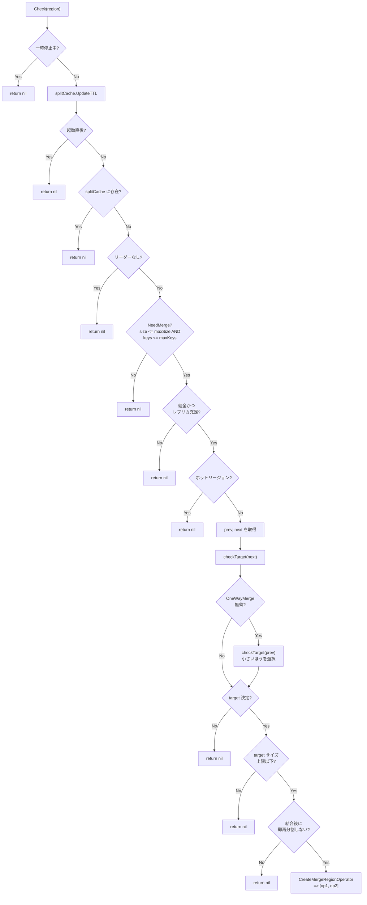

# 第18章 MergeChecker と分割と結合

> **本章で読むソース**
>
> - [`pkg/schedule/checker/merge_checker.go`](https://github.com/tikv/pd/blob/v8.5.6/pkg/schedule/checker/merge_checker.go)
> - [`pkg/schedule/checker/split_checker.go`](https://github.com/tikv/pd/blob/v8.5.6/pkg/schedule/checker/split_checker.go)
> - [`pkg/schedule/checker/joint_state_checker.go`](https://github.com/tikv/pd/blob/v8.5.6/pkg/schedule/checker/joint_state_checker.go)
> - [`pkg/schedule/operator/create_operator.go`](https://github.com/tikv/pd/blob/v8.5.6/pkg/schedule/operator/create_operator.go)

## この章の狙い

Region は分割と結合によって粒度が動的に変わる。
小さすぎる Region が大量に残ると、ハートビートやメタデータの管理コストが膨らむ。
**MergeChecker** は、サイズやキー数が閾値を下回る Region を隣接 Region と結合し、この問題を解消するチェッカーである。

本章では「MergeChecker」の `Check` メソッドの判定フローを中心に読み、結合対象の選定、結合が拒否される条件、Operator の生成までを追う。
あわせて、Placement Rules やラベルの境界で Region を分割する **SplitChecker** と、Joint Consensus の中間状態を解消する **JointStateChecker** を読む。
最適化の工夫として、分割直後の結合を TTL キャッシュで抑止し、分割と結合の振動を防ぐ仕組みを機構レベルで説明する。

## 前提

[第10章](../part03-scheduling/10-coordinator.md)で、チェッカーの巡回ループが Region ごとに `Check` を呼ぶ流れを読んだ。
[第11章](../part03-scheduling/11-operator-and-step.md)で、Operator と OpStep の構造を読んだ。
[第13章](../part03-scheduling/13-placement-rules.md)で、Placement Rules による制約充足の仕組みを読んだ。
コード引用は tikv/pd のタグ `v8.5.6` に固定する。

## MergeChecker の構造

「MergeChecker」は `PauseController` を埋め込み、クラスタ情報と設定プロバイダ、分割済み Region の TTL キャッシュ、起動時刻を保持する。

[`pkg/schedule/checker/merge_checker.go L53-L59`](https://github.com/tikv/pd/blob/v8.5.6/pkg/schedule/checker/merge_checker.go#L53-L59)

```go
type MergeChecker struct {
	PauseController
	cluster    sche.CheckerCluster
	conf       config.CheckerConfigProvider
	splitCache *cache.TTLUint64
	startTime  time.Time // it's used to judge whether server recently start.
}
```

`splitCache` は `cache.TTLUint64` 型の TTL 付きキャッシュであり、分割された Region の ID を一定期間保持する。
コンストラクタで TTL を `conf.GetSplitMergeInterval()` に設定し、分割直後の Region が即座に結合されることを防ぐ。

[`pkg/schedule/checker/merge_checker.go L62-L70`](https://github.com/tikv/pd/blob/v8.5.6/pkg/schedule/checker/merge_checker.go#L62-L70)

```go
func NewMergeChecker(ctx context.Context, cluster sche.CheckerCluster, conf config.CheckerConfigProvider) *MergeChecker {
	splitCache := cache.NewIDTTL(ctx, gcInterval, conf.GetSplitMergeInterval())
	return &MergeChecker{
		cluster:    cluster,
		conf:       conf,
		splitCache: splitCache,
		startTime:  time.Now(),
	}
}
```

二つの定数 `maxTargetRegionSize`(500 MB) と `maxTargetRegionFactor`(4) は、結合先 Region の上限サイズを決める際に使われる。

[`pkg/schedule/checker/merge_checker.go L38-L41`](https://github.com/tikv/pd/blob/v8.5.6/pkg/schedule/checker/merge_checker.go#L38-L41)

```go
const (
	maxTargetRegionSize   = 500
	maxTargetRegionFactor = 4
)
```

## Check メソッドの処理フロー

`Check` は一つの Region を受け取り、結合すべきかを判定する。
判定は多段のフィルタで構成され、すべてを通過した Region だけが結合 Operator の生成に進む。
以下にフロー全体を順に読む。

### ステップ1: 一時停止と起動直後のスキップ

チェッカーが一時停止中の場合、何もしない。

[`pkg/schedule/checker/merge_checker.go L86-L92`](https://github.com/tikv/pd/blob/v8.5.6/pkg/schedule/checker/merge_checker.go#L86-L92)

```go
func (c *MergeChecker) Check(region *core.RegionInfo) []*operator.Operator {
	mergeCheckerCounter.Inc()

	if c.IsPaused() {
		mergeCheckerPausedCounter.Inc()
		return nil
	}
```

次に `splitCache` の TTL を現在の設定値に更新する。
設定が動的に変更された場合にも追従するためである。

PD が起動してから `SplitMergeInterval` が経過していなければ、すべての Region をスキップする。
起動直後は Region のサイズ情報が不正確な場合があり、誤った結合を防ぐ。

[`pkg/schedule/checker/merge_checker.go L94-L102`](https://github.com/tikv/pd/blob/v8.5.6/pkg/schedule/checker/merge_checker.go#L94-L102)

```go
	// update the split cache.
	// It must be called before the following merge checker logic.
	c.splitCache.UpdateTTL(c.conf.GetSplitMergeInterval())

	expireTime := c.startTime.Add(c.conf.GetSplitMergeInterval())
	if time.Now().Before(expireTime) {
		mergeCheckerRecentlyStartCounter.Inc()
		return nil
	}
```

### ステップ2: 分割直後の Region をスキップ

`splitCache` に登録されている Region は、最近分割されたばかりなのでスキップする。
この仕組みは後述する最適化の節で詳しく説明する。

[`pkg/schedule/checker/merge_checker.go L104-L107`](https://github.com/tikv/pd/blob/v8.5.6/pkg/schedule/checker/merge_checker.go#L104-L107)

```go
	if c.splitCache.Exists(region.GetID()) {
		mergeCheckerRecentlySplitCounter.Inc()
		return nil
	}
```

### ステップ3: Region の健全性とサイズの判定

リーダーが存在しない Region はメタデータのロード中と判断してスキップする。

[`pkg/schedule/checker/merge_checker.go L109-L113`](https://github.com/tikv/pd/blob/v8.5.6/pkg/schedule/checker/merge_checker.go#L109-L113)

```go
	// when pd just started, it will load region meta from region storage,
	if region.GetLeader() == nil {
		mergeCheckerNoLeaderCounter.Inc()
		return nil
	}
```

Region のサイズとキー数が結合閾値を超えていれば、結合の必要はない。
`NeedMerge` は、サイズが `max-merge-region-size` 以下かつキー数が `max-merge-region-keys` 以下のときに `true` を返す。

[`pkg/schedule/checker/merge_checker.go L115-L119`](https://github.com/tikv/pd/blob/v8.5.6/pkg/schedule/checker/merge_checker.go#L115-L119)

```go
	// region is not small enough
	if !region.NeedMerge(int64(c.conf.GetMaxMergeRegionSize()), int64(c.conf.GetMaxMergeRegionKeys())) {
		mergeCheckerNoNeedCounter.Inc()
		return nil
	}
```

`NeedMerge` の実装はシンプルな閾値比較である。

[`pkg/core/region.go L334-L337`](https://github.com/tikv/pd/blob/v8.5.6/pkg/core/region.go#L334-L337)

```go
// NeedMerge returns true if size is less than merge size and keys is less than mergeKeys.
func (r *RegionInfo) NeedMerge(mergeSize int64, mergeKeys int64) bool {
	return r.GetApproximateSize() <= mergeSize && r.GetApproximateKeys() <= mergeKeys
}
```

ダウンしたピアやペンディングピアを持つ Region、レプリカ数が設定に満たない Region は健全でないためスキップする。
ホットリージョンもスキップ対象であり、負荷の高い Region を結合してさらに負荷を集中させることを避ける。

[`pkg/schedule/checker/merge_checker.go L121-L136`](https://github.com/tikv/pd/blob/v8.5.6/pkg/schedule/checker/merge_checker.go#L121-L136)

```go
	// skip region has down peers or pending peers
	if !filter.IsRegionHealthy(region) {
		mergeCheckerUnhealthyRegionCounter.Inc()
		return nil
	}

	if !filter.IsRegionReplicated(c.cluster, region) {
		mergeCheckerAbnormalReplicaCounter.Inc()
		return nil
	}

	// skip hot region
	if c.cluster.IsRegionHot(region) {
		mergeCheckerHotRegionCounter.Inc()
		return nil
	}
```

### ステップ4: 隣接 Region から結合先を選定

ソース Region の前後の隣接 Region を取得し、`checkTarget` で結合先として適格かを判定する。

[`pkg/schedule/checker/merge_checker.go L138-L148`](https://github.com/tikv/pd/blob/v8.5.6/pkg/schedule/checker/merge_checker.go#L138-L148)

```go
	prev, next := c.cluster.GetAdjacentRegions(region)

	var target *core.RegionInfo
	if c.checkTarget(region, next) {
		target = next
	}
	if !c.conf.IsOneWayMergeEnabled() && c.checkTarget(region, prev) { // allow a region can be merged by two ways.
		if target == nil || prev.GetApproximateSize() < next.GetApproximateSize() { // pick smaller
			target = prev
		}
	}
```

まず `next`(後方の隣接 Region) を候補にする。
`IsOneWayMergeEnabled` が `false` の場合(デフォルト)、`prev`(前方の隣接 Region) も候補にする。
両方が候補になった場合、サイズが小さいほうを選ぶ。
結合後のデータ移動量を最小化するための選択である。

### ステップ5: 結合先サイズの上限チェック

結合先 Region が大きすぎる場合、結合を拒否する。
上限は `regionMaxSize * maxTargetRegionFactor`(デフォルトではリージョン最大サイズの4倍) と `maxTargetRegionSize`(500 MB) の大きいほうである。

[`pkg/schedule/checker/merge_checker.go L155-L163`](https://github.com/tikv/pd/blob/v8.5.6/pkg/schedule/checker/merge_checker.go#L155-L163)

```go
	regionMaxSize := c.cluster.GetStoreConfig().GetRegionMaxSize()
	maxTargetRegionSizeThreshold := int64(float64(regionMaxSize) * float64(maxTargetRegionFactor))
	if maxTargetRegionSizeThreshold < maxTargetRegionSize {
		maxTargetRegionSizeThreshold = maxTargetRegionSize
	}
	if target.GetApproximateSize() > maxTargetRegionSizeThreshold {
		mergeCheckerTargetTooLargeCounter.Inc()
		return nil
	}
```

### ステップ6: 結合後の再分割チェック

結合後のサイズやキー数が `regionSplitSize` を超える場合、結合しても即座に再分割される。
`CheckRegionSize` と `CheckRegionKeys` は、結合後のサイズを `regionSplitSize` で割った余り(最小の分割 Region サイズ)が `max-merge-region-size` 以下にならないかを検査する。
余りが閾値以下なら、分割後に再び結合対象となり、分割と結合が振動するためエラーを返す。

[`pkg/schedule/checker/merge_checker.go L164-L174`](https://github.com/tikv/pd/blob/v8.5.6/pkg/schedule/checker/merge_checker.go#L164-L174)

```go
	if err := c.cluster.GetStoreConfig().CheckRegionSize(uint64(target.GetApproximateSize()+region.GetApproximateSize()),
		c.conf.GetMaxMergeRegionSize()); err != nil {
		mergeCheckerSplitSizeAfterMergeCounter.Inc()
		return nil
	}

	if err := c.cluster.GetStoreConfig().CheckRegionKeys(uint64(target.GetApproximateKeys()+region.GetApproximateKeys()),
		c.conf.GetMaxMergeRegionKeys()); err != nil {
		mergeCheckerSplitKeysAfterMergeCounter.Inc()
		return nil
	}
```

`CheckRegionSize` の実装を見ると、結合後のサイズが `regionMaxSize` 未満ならそもそも分割は起きないため即座に成功する。
`regionMaxSize` 以上の場合に、`regionSplitSize` で割った余りが `mergeSize` 以下かを検査する。

[`pkg/schedule/config/store_config.go L164-L182`](https://github.com/tikv/pd/blob/v8.5.6/pkg/schedule/config/store_config.go#L164-L182)

```go
func (c *StoreConfig) CheckRegionSize(size, mergeSize uint64) error {
	// the merged region will not be split if it's size less than region max size.
	if size < c.GetRegionMaxSize() {
		return nil
	}
	// ... (中略) ...
	// the smallest of the split regions can not be merge again, so it's size should less merge size.
	if smallSize := size % regionSplitSize; smallSize <= mergeSize && smallSize != 0 {
		// ... (中略) ...
		return errs.ErrCheckerMergeAgain.FastGenByArgs("the smallest region of the split regions is less than max-merge-region-size, " +
			"it will be merged again")
	}
	return nil
}
```

### ステップ7: Operator の生成

すべてのフィルタを通過した場合、`CreateMergeRegionOperator` で結合 Operator を生成する。

[`pkg/schedule/checker/merge_checker.go L176-L189`](https://github.com/tikv/pd/blob/v8.5.6/pkg/schedule/checker/merge_checker.go#L176-L189)

```go
	log.Debug("try to merge region",
		logutil.ZapRedactStringer("from", core.RegionToHexMeta(region.GetMeta())),
		logutil.ZapRedactStringer("to", core.RegionToHexMeta(target.GetMeta())))
	ops, err := operator.CreateMergeRegionOperator("merge-region", c.cluster, region, target, operator.OpMerge)
	if err != nil {
		log.Warn("create merge region operator failed", errs.ZapError(err))
		return nil
	}
	mergeCheckerNewOpCounter.Inc()
	if region.GetApproximateSize() > target.GetApproximateSize() ||
		region.GetApproximateKeys() > target.GetApproximateKeys() {
		mergeCheckerLargerSourceCounter.Inc()
	}
	return ops
```

ソースのほうがターゲットより大きい場合は `mergeCheckerLargerSourceCounter` をインクリメントし、モニタリングに活用する。

## checkTarget: 隣接 Region の適格性判定

`checkTarget` は隣接 Region が結合先として適格かを検査する。
判定項目は次のとおりである。

[`pkg/schedule/checker/merge_checker.go L192-L229`](https://github.com/tikv/pd/blob/v8.5.6/pkg/schedule/checker/merge_checker.go#L192-L229)

```go
func (c *MergeChecker) checkTarget(region, adjacent *core.RegionInfo) bool {
	if adjacent == nil {
		mergeCheckerAdjNotExistCounter.Inc()
		return false
	}

	if c.splitCache.Exists(adjacent.GetID()) {
		mergeCheckerAdjRecentlySplitCounter.Inc()
		return false
	}

	if c.cluster.IsRegionHot(adjacent) {
		mergeCheckerAdjRegionHotCounter.Inc()
		return false
	}

	if !AllowMerge(c.cluster, region, adjacent) {
		mergeCheckerAdjDisallowMergeCounter.Inc()
		return false
	}

	if !checkPeerStore(c.cluster, region, adjacent) {
		mergeCheckerAdjAbnormalPeerStoreCounter.Inc()
		return false
	}

	if !filter.IsRegionHealthy(adjacent) {
		mergeCheckerAdjSpecialPeerCounter.Inc()
		return false
	}

	if !filter.IsRegionReplicated(c.cluster, adjacent) {
		mergeCheckerAdjAbnormalReplicaCounter.Inc()
		return false
	}

	return true
}
```

1. 隣接 Region が存在しない(Region Tree の端)場合は不適格
2. 隣接 Region が最近分割されたばかりなら不適格
3. 隣接 Region がホットリージョンなら不適格
4. `AllowMerge` が `false` なら不適格(Placement Rules やラベル境界との衝突、テーブル境界をまたぐ場合)
5. `checkPeerStore` が `false` なら不適格(オフライン中の Store に関する問題)
6. 隣接 Region が健全でなければ不適格
7. 隣接 Region のレプリカ数が不足していれば不適格

## AllowMerge: 結合の許可判定

`AllowMerge` は、二つの Region が結合可能かをキータイプ、Placement Rules、ラベルの三つの観点から判定する。

[`pkg/schedule/checker/merge_checker.go L232-L279`](https://github.com/tikv/pd/blob/v8.5.6/pkg/schedule/checker/merge_checker.go#L232-L279)

```go
func AllowMerge(cluster sche.SharedCluster, region, adjacent *core.RegionInfo) bool {
	var start, end []byte
	if bytes.Equal(region.GetEndKey(), adjacent.GetStartKey()) && len(region.GetEndKey()) != 0 {
		start, end = region.GetStartKey(), adjacent.GetEndKey()
	} else if bytes.Equal(adjacent.GetEndKey(), region.GetStartKey()) && len(adjacent.GetEndKey()) != 0 {
		start, end = adjacent.GetStartKey(), region.GetEndKey()
	} else {
		return false
	}

	// ... (中略) ...

	if cluster.GetSharedConfig().IsPlacementRulesEnabled() {
		cl, ok := cluster.(interface{ GetRuleManager() *placement.RuleManager })
		if !ok || len(cl.GetRuleManager().GetSplitKeys(start, end)) > 0 {
			return false
		}
	}

	if cl, ok := cluster.(interface{ GetRegionLabeler() *labeler.RegionLabeler }); ok {
		l := cl.GetRegionLabeler()
		if len(l.GetSplitKeys(start, end)) > 0 {
			return false
		}
		if l.GetRegionLabel(region, mergeOptionLabel) == mergeOptionValueDeny || l.GetRegionLabel(adjacent, mergeOptionLabel) == mergeOptionValueDeny {
			return false
		}
	}

	policy := cluster.GetSharedConfig().GetKeyType()
	switch policy {
	case constant.Table:
		if cluster.GetSharedConfig().IsCrossTableMergeEnabled() {
			return true
		}
		return isTableIDSame(region, adjacent)
	case constant.Raw:
		return true
	case constant.Txn:
		return true
	default:
		return isTableIDSame(region, adjacent)
	}
}
```

処理の流れは次のとおりである。

1. **隣接性の検証**: 二つの Region のキー範囲が連続しているかを確認する。`region.EndKey == adjacent.StartKey` または `adjacent.EndKey == region.StartKey` のいずれかが成り立たなければ、結合できない。
2. **Placement Rules の境界**: 結合後のキー範囲 `[start, end)` の内部に `RuleManager.GetSplitKeys` が返すスプリットキーがあれば、Placement Rules の境界をまたぐため結合を拒否する。
3. **ラベルの境界と deny 指定**: `RegionLabeler.GetSplitKeys` が返すスプリットキーがあれば拒否する。さらに、どちらかの Region に `merge_option=deny` ラベルが付いていれば拒否する。
4. **キータイプによるテーブル境界の判定**: キータイプが `Table` の場合、`IsCrossTableMergeEnabled` が `false` なら異なるテーブル ID の Region 同士は結合できない。`Raw` と `Txn` モードでは常に許可する。

## checkPeerStore: オフライン Store の考慮

`checkPeerStore` は、隣接 Region にオフライン(解体中) Store 上のピアが存在し、かつソース Region にはその Store 上のピアがない場合に `false` を返す。
結合によってソース Region のデータがオフライン Store に移動すると、Store の解体処理が遅延するためである。

[`pkg/schedule/checker/merge_checker.go L288-L300`](https://github.com/tikv/pd/blob/v8.5.6/pkg/schedule/checker/merge_checker.go#L288-L300)

```go
func checkPeerStore(cluster sche.SharedCluster, region, adjacent *core.RegionInfo) bool {
	regionStoreIDs := region.GetStoreIDs()
	for _, peer := range adjacent.GetPeers() {
		storeID := peer.GetStoreId()
		store := cluster.GetStore(storeID)
		if store == nil || store.IsRemoving() {
			if _, ok := regionStoreIDs[storeID]; !ok {
				return false
			}
		}
	}
	return true
}
```

## RecordRegionSplit: 分割通知の受け入れ

外部から分割イベントを受け取り、分割された Region の ID を TTL キャッシュに登録するメソッドである。

[`pkg/schedule/checker/merge_checker.go L79-L83`](https://github.com/tikv/pd/blob/v8.5.6/pkg/schedule/checker/merge_checker.go#L79-L83)

```go
func (c *MergeChecker) RecordRegionSplit(regionIDs []uint64) {
	for _, regionID := range regionIDs {
		c.splitCache.PutWithTTL(regionID, nil, c.conf.GetSplitMergeInterval())
	}
}
```

## MergeChecker の判定フロー(図解)

以下の Mermaid 図は、`Check` メソッドの判定フロー全体を示す。



## CreateMergeRegionOperator: 結合 Operator の生成

`CreateMergeRegionOperator` は、ソース Region をターゲット Region に結合する Operator のペアを生成する。

[`pkg/schedule/operator/create_operator.go L179-L221`](https://github.com/tikv/pd/blob/v8.5.6/pkg/schedule/operator/create_operator.go#L179-L221)

```go
func CreateMergeRegionOperator(desc string, ci sche.SharedCluster, source *core.RegionInfo, target *core.RegionInfo, kind OpKind) ([]*Operator, error) {
	if core.IsInJointState(source.GetPeers()...) || core.IsInJointState(target.GetPeers()...) {
		return nil, errors.Errorf("cannot merge regions which are in joint state")
	}

	var steps []OpStep
	if !isRegionMatch(source, target) {
		peers := make(map[uint64]*metapb.Peer)
		for _, p := range target.GetPeers() {
			peers[p.GetStoreId()] = &metapb.Peer{
				StoreId:   p.GetStoreId(),
				Role:      p.GetRole(),
				IsWitness: p.GetIsWitness(),
			}
		}
		matchOp, err := NewBuilder("", ci, source).
			SetPeers(peers).
			Build(kind)
		if err != nil {
			return nil, err
		}

		steps = append(steps, matchOp.steps...)
		kind = matchOp.Kind()
	}

	steps = append(steps, MergeRegion{
		FromRegion: source.GetMeta(),
		ToRegion:   target.GetMeta(),
		IsPassive:  false,
	})

	brief := fmt.Sprintf("merge: region %v to %v", source.GetID(), target.GetID())
	op1 := NewOperator(desc, brief, source.GetID(), source.GetRegionEpoch(), kind, source.GetApproximateSize(), steps...)
	op2 := NewOperator(desc, brief, target.GetID(), target.GetRegionEpoch(), kind, target.GetApproximateSize(), MergeRegion{
		FromRegion: source.GetMeta(),
		ToRegion:   target.GetMeta(),
		IsPassive:  true,
	})
	op2.Sync(op1)

	return []*Operator{op1, op2}, nil
}
```

処理は次の手順で進む。

1. ソースとターゲットのいずれかが Joint Consensus 状態にある場合、結合できないためエラーを返す。
2. ソースとターゲットのピア構成が一致しない場合(`isRegionMatch` が `false`)、まずソースのピアをターゲットと同じ Store 配置に揃える OpStep 列を生成する。Raft の結合プロトコルは、両 Region のピアが同じ Store 集合に存在することを要求するためである。
3. `MergeRegion` ステップを追加する。ソース側は `IsPassive=false`(能動的に結合を開始する側)、ターゲット側は `IsPassive=true`(受動的に結合される側) となる。
4. 二つの Operator (`op1` がソース用、`op2` がターゲット用) を生成し、`op2.Sync(op1)` で進行を同期する。

## SplitChecker: ルールとラベルによる分割判定

「SplitChecker」は、Region のキー範囲が Placement Rules またはラベルの境界をまたいでいる場合に、分割 Operator を生成するチェッカーである。

[`pkg/schedule/checker/split_checker.go L29-L35`](https://github.com/tikv/pd/blob/v8.5.6/pkg/schedule/checker/split_checker.go#L29-L35)

```go
type SplitChecker struct {
	PauseController
	cluster     sche.CheckerCluster
	ruleManager *placement.RuleManager
	labeler     *labeler.RegionLabeler
}
```

`Check` メソッドの処理は簡潔である。

[`pkg/schedule/checker/split_checker.go L51-L81`](https://github.com/tikv/pd/blob/v8.5.6/pkg/schedule/checker/split_checker.go#L51-L81)

```go
func (c *SplitChecker) Check(region *core.RegionInfo) *operator.Operator {
	splitCheckerCounter.Inc()

	if c.IsPaused() {
		splitCheckerPausedCounter.Inc()
		return nil
	}

	start, end := region.GetStartKey(), region.GetEndKey()
	// ... (中略) ...
	desc := "labeler-split-region"
	keys := c.labeler.GetSplitKeys(start, end)

	if len(keys) == 0 && c.cluster.GetCheckerConfig().IsPlacementRulesEnabled() {
		desc = "rule-split-region"
		keys = c.ruleManager.GetSplitKeys(start, end)
	}

	if len(keys) == 0 {
		return nil
	}

	op, err := operator.CreateSplitRegionOperator(desc, region, 0, pdpb.CheckPolicy_USEKEY, keys)
	if err != nil {
		log.Debug("create split region operator failed", errs.ZapError(err))
		return nil
	}
	return op
}
```

まずラベラーの分割キーを調べ、見つからなければ Placement Rules の分割キーを調べる。
分割キーが見つかった場合、`CreateSplitRegionOperator` で `SplitRegion` ステップを持つ Operator を生成する。
ラベラーのキーと Placement Rules のキーを別々に処理する設計は、分割の理由をログやメトリクスで区別しやすくするためだとコメントに記されている。

## JointStateChecker: Joint Consensus の中間状態を解消

「JointStateChecker」は、Region のピアが Joint Consensus の中間状態(`IncomingVoter` や `DemotingVoter`)にある場合に、その状態を解消する Operator を生成する。

[`pkg/schedule/checker/joint_state_checker.go L27-L31`](https://github.com/tikv/pd/blob/v8.5.6/pkg/schedule/checker/joint_state_checker.go#L27-L31)

```go
type JointStateChecker struct {
	PauseController
	cluster sche.CheckerCluster
}
```

`Check` メソッドは、`core.IsInJointState` でピアの状態を判定し、Joint 状態であれば `CreateLeaveJointStateOperator` を呼ぶ。

[`pkg/schedule/checker/joint_state_checker.go L40-L62`](https://github.com/tikv/pd/blob/v8.5.6/pkg/schedule/checker/joint_state_checker.go#L40-L62)

```go
func (c *JointStateChecker) Check(region *core.RegionInfo) *operator.Operator {
	jointCheckCounter.Inc()
	if c.IsPaused() {
		jointCheckerPausedCounter.Inc()
		return nil
	}
	if !core.IsInJointState(region.GetPeers()...) {
		return nil
	}
	op, err := operator.CreateLeaveJointStateOperator(operator.OpDescLeaveJointState, c.cluster, region)
	if err != nil {
		jointCheckerFailedCounter.Inc()
		log.Debug("fail to create leave joint state operator", errs.ZapError(err))
		return nil
	} else if op != nil {
		jointCheckerNewOpCounter.Inc()
		if op.Len() > 1 {
			jointCheckerTransferLeaderCounter.Inc()
		}
		op.SetPriorityLevel(constant.High)
	}
	return op
}
```

`IsInJointState` は、ピアの中に `IncomingVoter` または `DemotingVoter` のロールを持つものがあれば `true` を返す。

[`pkg/core/peer.go L56-L66`](https://github.com/tikv/pd/blob/v8.5.6/pkg/core/peer.go#L56-L66)

```go
func IsInJointState(peers ...*metapb.Peer) bool {
	for _, peer := range peers {
		switch peer.GetRole() {
		case metapb.PeerRole_IncomingVoter, metapb.PeerRole_DemotingVoter:
			return true
		default:
		}
	}
	return false
}
```

生成された Operator は `constant.High` の優先度が設定される。
Joint 状態はメンバシップ変更の途中であるため、早急に解消しなければ後続の操作がブロックされる。

## 最適化の工夫: TTL キャッシュによる分割と結合の振動防止

Region の分割と結合が互いを打ち消し合うように繰り返される現象は、分割と結合の振動と呼ばれる。
たとえば、あるデータ量の少ない Region が結合された直後にサイズ閾値を超えて分割され、分割後に再び小さくなって結合対象となる、という循環が起きうる。

「MergeChecker」はこの振動を二つの仕組みで防いでいる。

第一に、`splitCache` が分割された Region の ID を `SplitMergeInterval`(デフォルトは1時間)の間キャッシュし、その期間中は結合判定をスキップする。
`RecordRegionSplit` でキャッシュに登録し、`Check` の冒頭で `splitCache.Exists` を呼んで存在すればスキップする。
ソース Region だけでなく、`checkTarget` でも隣接 Region の ID がキャッシュに存在するかを検査しているため、分割直後の Region が結合先として選ばれることもない。
この TTL 方式によりタイマー管理のスレッドを別途持つ必要がなく、キャッシュの GC は `gcInterval`(1分)ごとに自動で行われる。

第二に、ステップ6で述べた `CheckRegionSize` と `CheckRegionKeys` が、結合後のサイズを `regionSplitSize` で割った余りを検査する。
結合後の最小分割 Region のサイズが `max-merge-region-size` 以下になる場合、その分割 Region は再び結合対象になるため結合を拒否する。
この算術的な先読みにより、TTL が切れた後も振動を構造的に防止できる。

## まとめ

「MergeChecker」は、サイズやキー数が閾値を下回る Region を隣接 Region と結合して、Region 数の膨張を抑制する。
判定は多段のフィルタで構成され、分割直後の冷却期間、ホットリージョンの除外、Placement Rules やテーブル境界の尊重、オフライン Store の保護、結合後の再分割の先読みといった条件をすべて通過した場合にのみ Operator を生成する。

「SplitChecker」は Placement Rules やラベルの境界で Region を分割し、「JointStateChecker」は Joint Consensus の中間状態を速やかに解消する。
これら三つのチェッカーが協調することで、Region の粒度と配置の整合性が維持される。

## 関連する章

- [第10章 Coordinator とスケジューリングループ](../part03-scheduling/10-coordinator.md): チェッカーの巡回ループから `Check` が呼ばれる流れ
- [第11章 Operator と Step](../part03-scheduling/11-operator-and-step.md): `MergeRegion` ステップを含む Operator の構造と状態遷移
- [第13章 Placement Rules と制約充足](../part03-scheduling/13-placement-rules.md): `AllowMerge` で参照される Placement Rules の分割キー
- [第17章 ReplicaChecker と RuleChecker](17-replica-and-rule-checker.md): Region の健全性とレプリカ充足を検査する他のチェッカー
