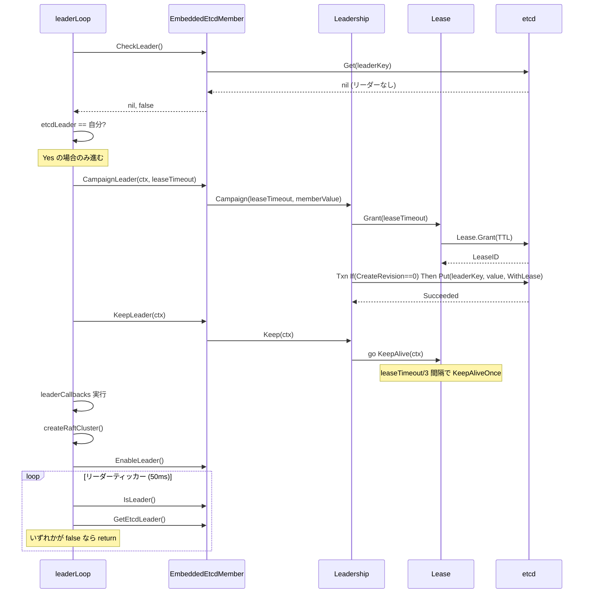
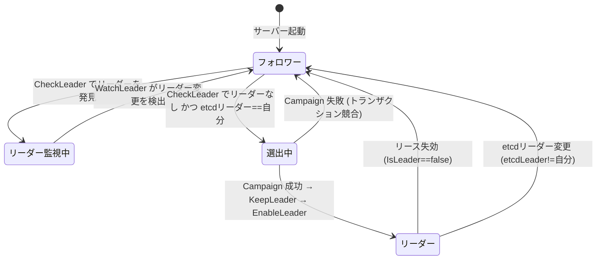

# 第19章 etcd とリーダー選出

> **本章で読むソース**
>
> - [`pkg/member/member.go`](https://github.com/tikv/pd/blob/v8.5.6/pkg/member/member.go)
> - [`pkg/member/election_leader.go`](https://github.com/tikv/pd/blob/v8.5.6/pkg/member/election_leader.go)
> - [`pkg/election/leadership.go`](https://github.com/tikv/pd/blob/v8.5.6/pkg/election/leadership.go)
> - [`pkg/election/lease.go`](https://github.com/tikv/pd/blob/v8.5.6/pkg/election/lease.go)
> - [`server/server.go`](https://github.com/tikv/pd/blob/v8.5.6/server/server.go)
> - [`server/grpc_service.go`](https://github.com/tikv/pd/blob/v8.5.6/server/grpc_service.go)

## この章の狙い

PD クラスタは1台のリーダーと複数のフォロワーで構成される。
TSO の発行やスケジューリング指示の生成はリーダーだけが行うため、リーダー選出の仕組みは PD の可用性を支える土台である。
本章では、組み込み etcd の起動からリーダー選出ループ、リースの維持と退任までを、ソースコードを追って読む。
最適化の工夫として、メタデータ用と選出用で etcd クライアントを分離する設計を機構レベルで説明する。

## 前提

[第2章](../part00-overview/02-server-architecture.md)で述べたとおり、PD サーバーは組み込み etcd を内蔵し、クラスタの状態を etcd に保存する。
PD クラスタは Raft ベースの etcd クラスタの上に構築されており、etcd の Raft リーダーとは別に、PD 独自の**リーダーキー**を etcd 上に書き込むことで PD のリーダーを決定する。
[第4章](../part01-tso/04-tso-and-global-allocator.md)の TSO 発行も、リーダーであることが前提条件である。
本章のコード引用はすべて tikv/pd のタグ `v8.5.6` に固定する。

## 組み込み etcd の起動

PD サーバーの起動時に `startEtcd` が呼ばれ、`embed.StartEtcd` で組み込み etcd を起動する。
`ReadyNotify` チャネルを待って etcd が利用可能になったあと、`startClient` と `initMember` を順に呼ぶ。

[`server/server.go L328-L370`](https://github.com/tikv/pd/blob/v8.5.6/server/server.go#L328-L370)

```go
func (s *Server) startEtcd(ctx context.Context) error {
	newCtx, cancel := context.WithTimeout(ctx, EtcdStartTimeout)
	defer cancel()

	etcd, err := embed.StartEtcd(s.etcdCfg)
	if err != nil {
		return errs.ErrStartEtcd.Wrap(err).GenWithStackByCause()
	}
	// ... (中略) ...
	select {
	// Wait etcd until it is ready to use
	case <-etcd.Server.ReadyNotify():
	case <-newCtx.Done():
		return errs.ErrCancelStartEtcd.FastGenByArgs()
	}

	// Start the etcd and HTTP clients, then init the member.
	err = s.startClient()
	if err != nil {
		return err
	}
	err = s.initMember(newCtx, etcd)
	// ... (中略) ...
}
```

### 2つの etcd クライアント

`startClient` は etcd クライアントを2つ生成する。
1つはメタデータ全般の読み書き用（`s.client`）、もう1つはリーダー選出専用（`s.electionClient`）である。

[`server/server.go L382-L404`](https://github.com/tikv/pd/blob/v8.5.6/server/server.go#L382-L404)

```go
func (s *Server) startClient() error {
	// ... (中略) ...
	/* Starting two different etcd clients here is to avoid the throttling. */
	// This etcd client will be used to access the etcd cluster to read and write all kinds of meta data.
	s.client, err = etcdutil.CreateEtcdClient(tlsConfig, etcdCfg.AdvertiseClientUrls, etcdutil.ServerEtcdClientPurpose, true)
	if err != nil {
		return errs.ErrNewEtcdClient.Wrap(err).GenWithStackByCause()
	}
	// This etcd client will only be used to read and write the election-related data, such as leader key.
	s.electionClient, err = etcdutil.CreateEtcdClient(tlsConfig, etcdCfg.AdvertiseClientUrls, etcdutil.ElectionEtcdClientPurpose, false)
	if err != nil {
		return errs.ErrNewEtcdClient.Wrap(err).GenWithStackByCause()
	}
	s.httpClient = etcdutil.CreateHTTPClient(tlsConfig)
	return nil
}
```

この分離の意義は後述する「etcd クライアント分離による選出の安定化」で説明する。

### initMember

`initMember` は etcd のメンバー一覧を取得し、自身の etcd サーバー ID を使って `member.NewMember` を呼ぶ。
引数には選出専用の `s.electionClient` を渡す。

[`server/server.go L406-L427`](https://github.com/tikv/pd/blob/v8.5.6/server/server.go#L406-L427)

```go
func (s *Server) initMember(ctx context.Context, etcd *embed.Etcd) error {
	// ... (中略) ...
	etcdServerID := uint64(etcd.Server.ID())
	// ... (中略) ...
	s.member = member.NewMember(etcd, s.electionClient, etcdServerID)
	return nil
}
```

## EmbeddedEtcdMember とリーダーパス

**`EmbeddedEtcdMember`** はリーダー選出にかかわる状態をまとめた構造体である。
`leadership` がリースの管理を、`leader` が現在のリーダー情報を、`etcd` が組み込み etcd への参照を保持する。

[`pkg/member/member.go L53-L68`](https://github.com/tikv/pd/blob/v8.5.6/pkg/member/member.go#L53-L68)

```go
type EmbeddedEtcdMember struct {
	leadership *election.Leadership
	leader     atomic.Value // stored as *pdpb.Member
	// etcd and cluster information.
	etcd     *embed.Etcd
	client   *clientv3.Client
	id       uint64       // etcd server id.
	member   *pdpb.Member // current PD's info.
	rootPath string
	// memberValue is the serialized string of `member`. It will be saved in
	// etcd leader key when the PD node is successfully elected as the PD leader
	// of the cluster. Every write will use it to check PD leadership.
	memberValue string
	// lastLeaderUpdatedTime is the last time when the leader is updated.
	lastLeaderUpdatedTime atomic.Value
}
```

`InitMemberInfo` がリーダーパスを設定し、「Leadership」を生成する。
リーダーパスは `rootPath + "/leader"` であり、この etcd キーにリーダーの情報が書き込まれる。

[`pkg/member/member.go L334-L353`](https://github.com/tikv/pd/blob/v8.5.6/pkg/member/member.go#L334-L353)

```go
func (m *EmbeddedEtcdMember) InitMemberInfo(advertiseClientUrls, advertisePeerUrls, name string, rootPath string) {
	leader := &pdpb.Member{
		Name:       name,
		MemberId:   m.ID(),
		ClientUrls: strings.Split(advertiseClientUrls, ","),
		PeerUrls:   strings.Split(advertisePeerUrls, ","),
	}

	data, err := leader.Marshal()
	if err != nil {
		// can't fail, so panic here.
		log.Fatal("marshal pd leader meet error", zap.Stringer("pd-leader", leader), errs.ZapError(errs.ErrMarshalLeader, err))
	}
	m.member = leader
	m.memberValue = string(data)
	m.rootPath = rootPath
	m.leadership = election.NewLeadership(m.client, m.GetLeaderPath(), "leader election")
	log.Info("member joining election", zap.Stringer("member-info", m.member), zap.String("root-path", m.rootPath))
}
```

`memberValue` は `pdpb.Member` をシリアライズした文字列であり、リーダーキーの値として etcd に書き込まれる。

## Leadership とリース

### Leadership 構造体

**`Leadership`** はリーダー選出のリースと監視を管理する構造体である。

[`pkg/election/leadership.go L57-L77`](https://github.com/tikv/pd/blob/v8.5.6/pkg/election/leadership.go#L57-L77)

```go
type Leadership struct {
	// purpose is used to show what this election for
	purpose string
	// The lease which is used to get this leadership
	lease  atomic.Value // stored as *lease
	client *clientv3.Client
	// leaderKey and leaderValue are key-value pair in etcd
	leaderKey   string
	leaderValue string

	keepAliveCtx            context.Context
	keepAliveCancelFunc     context.CancelFunc
	keepAliveCancelFuncLock syncutil.Mutex
	// campaignTimes is used to record the campaign times of the leader within `campaignTimesRecordTimeout`.
	// It is ordered by time to prevent the leader from campaigning too frequently.
	campaignTimes []time.Time
	// primaryWatch is for the primary watch only,
	// which is used to reuse `Watch` interface in `Leadership`.
	primaryWatch atomic.Bool
}
```

`leaderKey` がリーダーパス（etcd のキー）、`leaderValue` がそこに書き込む値（シリアライズした `pdpb.Member`）である。
`lease` は etcd の**リース**を保持し、リーダーキーの有効期間を制御する。
`campaignTimes` は直近の選出試行回数を記録し、過剰な選出の繰り返しを防ぐ。

### Lease 構造体

**`Lease`** は etcd のリースを薄く包んだ構造体である。

[`pkg/election/lease.go L38-L49`](https://github.com/tikv/pd/blob/v8.5.6/pkg/election/lease.go#L38-L49)

```go
type Lease struct {
	// purpose is used to show what this election for
	Purpose string
	// etcd client and lease
	client *clientv3.Client
	lease  clientv3.Lease
	ID     atomic.Value // store as clientv3.LeaseID
	// leaseTimeout and expireTime are used to control the lease's lifetime
	leaseTimeout time.Duration
	expireTime   atomic.Value
}
```

`Grant` で etcd からリースを取得し、`expireTime` に有効期限を設定する。

[`pkg/election/lease.go L61-L80`](https://github.com/tikv/pd/blob/v8.5.6/pkg/election/lease.go#L61-L80)

```go
func (l *Lease) Grant(leaseTimeout int64) error {
	// ... (中略) ...
	leaseResp, err := l.lease.Grant(ctx, leaseTimeout)
	// ... (中略) ...
	l.ID.Store(leaseResp.ID)
	l.leaseTimeout = time.Duration(leaseTimeout) * time.Second
	l.expireTime.Store(start.Add(time.Duration(leaseResp.TTL) * time.Second))
	return nil
}
```

`IsExpired` は `expireTime` と現在時刻を比較してリースの有効性を判定する。

[`pkg/election/lease.go L104-L109`](https://github.com/tikv/pd/blob/v8.5.6/pkg/election/lease.go#L104-L109)

```go
func (l *Lease) IsExpired() bool {
	if l == nil || l.expireTime.Load() == nil {
		return true
	}
	return time.Now().After(l.expireTime.Load().(time.Time))
}
```

### Campaign: etcd トランザクションによるリーダー獲得

`Leadership.Campaign` が選出の中核である。
リースを `Grant` で取得したあと、etcd のトランザクションで「リーダーキーの `CreateRevision` が 0（キーが存在しない）」という条件付きで `Put` を実行する。
この条件により、同時に複数のノードが選出を試みても、最初に書き込んだ1台だけが成功する。

[`pkg/election/leadership.go L166-L208`](https://github.com/tikv/pd/blob/v8.5.6/pkg/election/leadership.go#L166-L208)

```go
func (ls *Leadership) Campaign(leaseTimeout int64, leaderData string, cmps ...clientv3.Cmp) error {
	ls.leaderValue = leaderData
	// Create a new lease to campaign
	newLease := NewLease(ls.client, ls.purpose)
	ls.SetLease(newLease)
	// ... (中略) ...
	if err := newLease.Grant(leaseTimeout); err != nil {
		return err
	}
	finalCmps := make([]clientv3.Cmp, 0, len(cmps)+1)
	finalCmps = append(finalCmps, cmps...)
	// The leader key must not exist, so the CreateRevision is 0.
	finalCmps = append(finalCmps, clientv3.Compare(clientv3.CreateRevision(ls.leaderKey), "=", 0))
	resp, err := kv.NewSlowLogTxn(ls.client).
		If(finalCmps...).
		Then(clientv3.OpPut(ls.leaderKey, leaderData, clientv3.WithLease(newLease.ID.Load().(clientv3.LeaseID)))).
		Commit()
	// ... (中略) ...
	if !resp.Succeeded {
		newLease.Close()
		return errs.ErrEtcdTxnConflict.FastGenByArgs()
	}
	log.Info("write leaderData to leaderPath ok", zap.String("leader-key", ls.leaderKey), zap.String("purpose", ls.purpose))
	return nil
}
```

`Put` にはリース ID を付与する（`clientv3.WithLease`）。
リースが失効するとキーが自動削除されるため、リーダーが故障した場合に手動の削除なしで再選出が始まる。

### リースの維持: KeepAlive

`Leadership.Keep` はバックグラウンドの goroutine でリースの KeepAlive を開始する。

[`pkg/election/leadership.go L211-L219`](https://github.com/tikv/pd/blob/v8.5.6/pkg/election/leadership.go#L211-L219)

```go
func (ls *Leadership) Keep(ctx context.Context) {
	if ls == nil {
		return
	}
	ls.keepAliveCancelFuncLock.Lock()
	ls.keepAliveCtx, ls.keepAliveCancelFunc = context.WithCancel(ctx)
	ls.keepAliveCancelFuncLock.Unlock()
	go ls.GetLease().KeepAlive(ls.keepAliveCtx)
}
```

`Lease.KeepAlive` は `keepAliveWorker` からの更新を受信し、`expireTime` を延長する。

[`pkg/election/lease.go L112-L156`](https://github.com/tikv/pd/blob/v8.5.6/pkg/election/lease.go#L112-L156)

```go
func (l *Lease) KeepAlive(ctx context.Context) {
	// ... (中略) ...
	ctx, cancel := context.WithCancel(ctx)
	defer cancel()
	timeCh := l.keepAliveWorker(ctx, l.leaseTimeout/3)
	// ... (中略) ...
	timer := time.NewTimer(l.leaseTimeout)
	defer timer.Stop()
	for {
		select {
		case t := <-timeCh:
			if t.After(maxExpire) {
				maxExpire = t
				// ... (中略) ...
				l.expireTime.Store(t)
			}
			// ... (中略) ...
			timer.Reset(l.leaseTimeout)
		case <-timer.C:
			log.Info("keep alive lease too slow", zap.Duration("timeout-duration", l.leaseTimeout), /* ... */)
			return
		case <-ctx.Done():
			return
		}
	}
}
```

`keepAliveWorker` は `leaseTimeout/3` の間隔で `KeepAliveOnce` を呼ぶ。
リースの有効期間が仮に3秒なら、1秒ごとに更新を試みる計算になる。

[`pkg/election/lease.go L159-L210`](https://github.com/tikv/pd/blob/v8.5.6/pkg/election/lease.go#L159-L210)

```go
func (l *Lease) keepAliveWorker(ctx context.Context, interval time.Duration) <-chan time.Time {
	ch := make(chan time.Time)

	go func() {
		// ... (中略) ...
		ticker := time.NewTicker(interval)
		defer ticker.Stop()
		// ... (中略) ...
		for {
			start := time.Now()
			// ... (中略) ...
			go func(start time.Time) {
				// ... (中略) ...
				res, err := l.lease.KeepAliveOnce(ctx1, leaseID)
				if err != nil {
					log.Warn("lease keep alive failed", zap.String("purpose", l.Purpose), zap.Time("start", start), errs.ZapError(err))
					return
				}
				if res.TTL > 0 {
					expire := start.Add(time.Duration(res.TTL) * time.Second)
					select {
					case ch <- expire:
					case <-ctx.Done():
					}
				}
			}(start)

			select {
			case <-ctx.Done():
				return
			case <-ticker.C:
				// ... (中略) ...
			}
		}
	}()

	return ch
}
```

`KeepAliveOnce` が成功すると、応答の TTL から新しい有効期限を計算して `ch` に送る。
`KeepAlive` 側はこれを受け取って `expireTime` を延長する。
`leaseTimeout` 以内に1回も更新が届かなければ、タイマーが発火して `KeepAlive` は終了する。

### リーダーシップの検証: Check と IsLeader

`Leadership.Check` はリースが有効かどうかを返す。

[`pkg/election/leadership.go L222-L224`](https://github.com/tikv/pd/blob/v8.5.6/pkg/election/leadership.go#L222-L224)

```go
func (ls *Leadership) Check() bool {
	return ls != nil && ls.GetLease() != nil && !ls.GetLease().IsExpired()
}
```

`EmbeddedEtcdMember.IsLeader` はリースの有効性に加えて、メモリ上のリーダー ID が自分自身と一致するかを確認する。
両方の条件が成り立つときだけ `true` を返す。

[`pkg/member/member.go L114-L117`](https://github.com/tikv/pd/blob/v8.5.6/pkg/member/member.go#L114-L117)

```go
func (m *EmbeddedEtcdMember) IsLeader() bool {
	return m.leadership.Check() && m.GetLeader().GetMemberId() == m.member.GetMemberId()
}
```

## リーダー選出ループ

### startServerLoop

サーバーの起動時に `startServerLoop` が呼ばれ、4つの goroutine が起動する。

[`server/server.go L659-L670`](https://github.com/tikv/pd/blob/v8.5.6/server/server.go#L659-L670)

```go
func (s *Server) startServerLoop(ctx context.Context) {
	s.serverLoopCtx, s.serverLoopCancel = context.WithCancel(ctx)
	s.serverLoopWg.Add(4)
	go s.leaderLoop()
	go s.etcdLeaderLoop()
	go s.serverMetricsLoop()
	go s.encryptionKeyManagerLoop()
	// ... (中略) ...
}
```

`leaderLoop` が PD リーダー選出のメインループ、`etcdLeaderLoop` が etcd リーダーの優先度調整を担う。

### leaderLoop の全体構造

`leaderLoop` は無限ループで以下の処理を繰り返す。

1. `CheckLeader` で etcd からリーダー情報を読む
2. 他のノードがリーダーなら `WatchLeader` でリーダーキーの変更を監視し、変更があるまでブロックする
3. リーダーがいない場合、etcd の Raft リーダーが自分自身であれば `campaignLeader` を呼ぶ
4. etcd の Raft リーダーが自分でなければ、200ms スリープして次のループに回る

[`server/server.go L1619-L1695`](https://github.com/tikv/pd/blob/v8.5.6/server/server.go#L1619-L1695)

```go
func (s *Server) leaderLoop() {
	defer logutil.LogPanic()
	defer s.serverLoopWg.Done()

	for {
		if s.IsClosed() {
			log.Info(fmt.Sprintf("server is closed, return %s leader loop", s.mode))
			return
		}

		leader, checkAgain := s.member.CheckLeader()
		// ... (中略) ...
		if checkAgain {
			continue
		}
		if leader != nil {
			// ... (中略) ...
			log.Info("start to watch pd leader", zap.Stringer("pd-leader", leader))
			// WatchLeader will keep looping and never return unless the PD leader has changed.
			leader.Watch(s.serverLoopCtx)
			// ... (中略) ...
			log.Info("pd leader has changed, try to re-campaign a pd leader")
		}

		// To make sure the etcd leader and PD leader are on the same server.
		etcdLeader := s.member.GetEtcdLeader()
		if etcdLeader != s.member.ID() {
			// ... (中略) ...
			log.Info("skip campaigning of pd leader and check later",
				zap.String("server-name", s.Name()),
				zap.Uint64("etcd-leader-id", etcdLeader),
				zap.Uint64("member-id", s.member.ID()))
			time.Sleep(200 * time.Millisecond)
			continue
		}
		s.campaignLeader()
	}
}
```

etcd の Raft リーダーと PD リーダーを同じサーバーに揃える設計になっている。
etcd の Raft リーダーでないノードは選出に参加せず、待機する。
リーダーが長期間不在の場合は `MoveEtcdLeader` で自身を etcd リーダーに移動させ、次のループで選出を試みる。

### CheckLeader

`CheckLeader` は etcd からリーダーキーを読み、3つのケースに分岐する。

[`pkg/member/member.go L232-L269`](https://github.com/tikv/pd/blob/v8.5.6/pkg/member/member.go#L232-L269)

```go
func (m *EmbeddedEtcdMember) CheckLeader() (ElectionLeader, bool) {
	if err := m.PreCheckLeader(); err != nil {
		log.Warn("failed to pass pre-check, check pd leader later", errs.ZapError(err))
		time.Sleep(checkFailBackoffDuration)
		return nil, true
	}

	leader, revision, err := m.getPersistentLeader()
	if err != nil {
		log.Warn("getting pd leader meets error", errs.ZapError(err))
		time.Sleep(checkFailBackoffDuration)
		return nil, true
	}
	if leader == nil {
		// no leader yet
		return nil, false
	}

	if m.IsSameLeader(leader) {
		// oh, we are already a PD leader, which indicates we may meet something wrong
		// in previous CampaignLeader. We should delete the leadership and campaign again.
		log.Warn("the pd leader has not changed, delete and campaign again", zap.Stringer("old-pd-leader", leader))
		// Delete the leader itself and let others start a new election again.
		if err = m.leadership.DeleteLeaderKey(); err != nil {
			log.Error("deleting pd leader key meets error", errs.ZapError(err))
			time.Sleep(checkFailBackoffDuration)
			return nil, true
		}
		// Return nil and false to make sure the campaign will start immediately.
		return nil, false
	}

	return &EmbeddedEtcdLeader{
		wrapper:  m,
		member:   leader,
		revision: revision,
	}, false
}
```

`PreCheckLeader` は etcd の Raft リーダー ID が 0 でないことを確認する事前チェックである。

[`pkg/member/member.go L209-L214`](https://github.com/tikv/pd/blob/v8.5.6/pkg/member/member.go#L209-L214)

```go
func (m *EmbeddedEtcdMember) PreCheckLeader() error {
	if m.GetEtcdLeader() == 0 {
		return errs.ErrEtcdLeaderNotFound
	}
	return nil
}
```

リーダーキーに自分自身が書き込まれている場合は、前回の `campaignLeader` で異常が起きた可能性がある。
このときはリーダーキーを削除して再選出に持ち込む。

### WatchLeader

フォロワーがリーダーの存在を確認したあと、`WatchLeader` でリーダーキーの変更を監視する。

[`pkg/member/member.go L272-L276`](https://github.com/tikv/pd/blob/v8.5.6/pkg/member/member.go#L272-L276)

```go
func (m *EmbeddedEtcdMember) WatchLeader(ctx context.Context, leader *pdpb.Member, revision int64) {
	m.setLeader(leader)
	m.leadership.Watch(ctx, revision)
	m.unsetLeader()
}
```

`setLeader` でメモリ上にリーダー情報を保持し、`Leadership.Watch` で etcd の watchChan を監視する。
リーダーキーの DELETE イベントを受信すると `Watch` は return し、`unsetLeader` でリーダー情報をクリアする。
その後 `leaderLoop` の先頭に戻り、再び `CheckLeader` から始まる。

`Leadership.Watch` はリーダーキーの DELETE だけでなく、etcd との接続が長時間途絶えた場合（`watchLoopUnhealthyTimeout` = 60秒）にも return する。

## リーダーになるまで

### CampaignLeader

`EmbeddedEtcdMember.CampaignLeader` は選出の試行回数を管理し、`Leadership.Campaign` に委譲する。

[`pkg/member/member.go L186-L201`](https://github.com/tikv/pd/blob/v8.5.6/pkg/member/member.go#L186-L201)

```go
func (m *EmbeddedEtcdMember) CampaignLeader(ctx context.Context, leaseTimeout int64) error {
	m.leadership.AddCampaignTimes()
	// ... (中略) ...
	if m.leadership.GetCampaignTimesNum() > campaignLeaderFrequencyTimes {
		if err := m.ResignEtcdLeader(ctx, m.Name(), ""); err != nil {
			return err
		}
		m.leadership.ResetCampaignTimes()
		return errs.ErrLeaderFrequentlyChange.FastGenByArgs(m.Name(), m.GetLeaderPath())
	}

	return m.leadership.Campaign(leaseTimeout, m.MemberValue())
}
```

`campaignLeaderFrequencyTimes` は定数 3 である[^freq]。
5分以内（`campaignTimesRecordTimeout`）に3回を超えて選出を試みると、そのノードは etcd リーダーを他のメンバーに譲り渡す。
あるノードが選出に成功しても維持できずにすぐ退任する状況が繰り返されている場合、別のノードにリーダーを移すことで安定化を図る設計である。

[^freq]: `campaignLeaderFrequencyTimes` は `pkg/member/member.go` の L47 で定義されている。

### ResignEtcdLeader

`ResignEtcdLeader` は etcd のメンバー一覧から自分以外をランダムに選び、`MoveLeader` で etcd リーダーを移動させる。

[`pkg/member/member.go L355-L382`](https://github.com/tikv/pd/blob/v8.5.6/pkg/member/member.go#L355-L382)

```go
func (m *EmbeddedEtcdMember) ResignEtcdLeader(ctx context.Context, from string, nextEtcdLeader string) error {
	// ... (中略) ...
	var etcdLeaderIDs []uint64
	res, err := etcdutil.ListEtcdMembers(ctx, m.client)
	if err != nil {
		return err
	}

	// Do nothing when I am the only member of cluster.
	if len(res.Members) == 1 && res.Members[0].ID == m.id && nextEtcdLeader == "" {
		return nil
	}

	for _, member := range res.Members {
		if (nextEtcdLeader == "" && member.ID != m.id) || (nextEtcdLeader != "" && member.Name == nextEtcdLeader) {
			etcdLeaderIDs = append(etcdLeaderIDs, member.GetID())
		}
	}
	// ... (中略) ...
	r := rand.New(rand.NewSource(time.Now().UnixNano()))
	nextEtcdLeaderID := etcdLeaderIDs[r.Intn(len(etcdLeaderIDs))]
	return m.MoveEtcdLeader(ctx, m.ID(), nextEtcdLeaderID)
}
```

クラスタのメンバーが自分1台だけの場合は何もしない。

### campaignLeader: リーダーとして稼働する

`leaderLoop` から呼ばれる `campaignLeader` が、リーダーとしての一連の処理を実行する。

[`server/server.go L1697-L1811`](https://github.com/tikv/pd/blob/v8.5.6/server/server.go#L1697-L1811)

```go
func (s *Server) campaignLeader() {
	log.Info(fmt.Sprintf("start to campaign %s leader", s.mode), zap.String("campaign-leader-name", s.Name()))
	if err := s.member.CampaignLeader(s.ctx, s.cfg.LeaderLease); err != nil {
		// ... (中略) ...
		return
	}

	// Start keepalive the leadership and enable TSO service.
	// ... (中略) ...
	ctx, cancel := context.WithCancel(s.serverLoopCtx)
	var resetLeaderOnce sync.Once
	defer resetLeaderOnce.Do(func() {
		cancel()
		s.member.ResetLeader()
	})

	// maintain the PD leadership, after this, TSO can be service.
	s.member.KeepLeader(ctx)
	log.Info(fmt.Sprintf("campaign %s leader ok", s.mode), zap.String("campaign-leader-name", s.Name()))
	// ... (中略) ...

	log.Info("triggering the leader callback functions")
	for _, cb := range s.leaderCallbacks {
		if err := cb(ctx); err != nil {
			log.Error("failed to execute leader callback function", errs.ZapError(err))
			return
		}
	}

	// Try to create raft cluster.
	if err := s.createRaftCluster(); err != nil {
		log.Error("failed to create raft cluster", errs.ZapError(err))
		return
	}
	defer s.stopRaftCluster()
	// ... (中略) ...
	// EnableLeader to accept the remaining service, such as GetStore, GetRegion.
	s.member.EnableLeader()
	// ... (中略) ...
```

処理の流れは以下のとおりである。

1. `CampaignLeader` でリースを取得し、リーダーキーを etcd に書き込む
2. `KeepLeader` でリースの維持を開始する
3. `leaderCallbacks` を実行する（TSO の初期化など）
4. `createRaftCluster` で Region のスケジューリングを開始する
5. `EnableLeader` で自身をリーダーとして有効にする

`EnableLeader` のあとにリーダーティッカーループに入る。

```go
	leaderTicker := time.NewTicker(constant.LeaderTickInterval)
	defer leaderTicker.Stop()

	for {
		select {
		case <-leaderTicker.C:
			if !s.member.IsLeader() {
				log.Info("no longer a leader because lease has expired, pd leader will step down")
				return
			}
			// ... (中略) ...
			etcdLeader := s.member.GetEtcdLeader()
			if etcdLeader != s.member.ID() {
				log.Info("etcd leader changed, resigns pd leadership", zap.String("old-pd-leader-name", s.Name()))
				return
			}
		case <-ctx.Done():
			// Server is closed and it should return nil.
			log.Info("server is closed")
			return
		}
	}
```

`LeaderTickInterval` は 50ms である。
50ms ごとに2つの条件を検査する。

- `IsLeader()` が `false`（リースが失効した、またはリーダー情報が一致しない）
- etcd の Raft リーダーが自分以外に変わった

いずれかの条件が成立すると `campaignLeader` は return し、`leaderLoop` の先頭に戻って再び `CheckLeader` から始まる。

## リーダーの退任と再選出

リーダーが退任する経路は3つある。

1. **リースの失効**：KeepAlive が `leaseTimeout` 以内に更新できなければ、`expireTime` を過ぎた時点で `IsExpired` が `true` を返す。リーダーティッカーの `IsLeader()` チェックで検出される。リースに紐づくリーダーキーは etcd が自動削除する。
2. **etcd リーダーの変更**：etcd の Raft リーダーが他のノードに移ると、リーダーティッカーの `etcdLeader != s.member.ID()` で検出される。PD リーダーと etcd リーダーを同一サーバーに保つための退任である。
3. **古いリーダーの自己削除**：`CheckLeader` でリーダーキーに自分自身が残っていた場合、`DeleteLeaderKey` で削除して再選出に移行する。

いずれの場合も、`campaignLeader` が return したあと `leaderLoop` の先頭に戻り、再び `CheckLeader` から選出プロセスが始まる。

## etcdLeaderLoop と優先度の調整

`etcdLeaderLoop` は `LeaderPriorityCheckInterval` の間隔で `CheckPriority` を呼ぶ。

[`server/server.go L1813-L1832`](https://github.com/tikv/pd/blob/v8.5.6/server/server.go#L1813-L1832)

```go
func (s *Server) etcdLeaderLoop() {
	defer logutil.LogPanic()
	defer s.serverLoopWg.Done()

	ctx, cancel := context.WithCancel(s.serverLoopCtx)
	defer cancel()
	ticker := time.NewTicker(s.cfg.LeaderPriorityCheckInterval.Duration)
	defer ticker.Stop()
	for {
		select {
		case <-ticker.C:
			s.member.CheckPriority(ctx)
			// Note: we reset the ticker here to support updating configuration dynamically.
			ticker.Reset(s.cfg.LeaderPriorityCheckInterval.Duration)
		case <-ctx.Done():
			log.Info("server is closed, exit etcd leader loop")
			return
		}
	}
}
```

`CheckPriority` は自分の優先度が現在の etcd リーダーより高ければ `MoveEtcdLeader` で自分に移動させる。
この仕組みにより、運用者が `pd-ctl` で特定ノードの優先度を高く設定すれば、そのノードが etcd リーダーになり、連動して PD リーダーにもなる。

## フォロワーのリクエスト処理

フォロワーがクライアントから gRPC リクエストを受けた場合、`unaryFollowerMiddleware` で処理する。

[`server/grpc_service.go L248-L265`](https://github.com/tikv/pd/blob/v8.5.6/server/grpc_service.go#L248-L265)

```go
func (s *GrpcServer) unaryFollowerMiddleware(ctx context.Context, req request, fn forwardFn, allowFollower *bool) (rsp any, err error) {
	// ... (中略) ...
	forwardedHost := grpcutil.GetForwardedHost(ctx)
	if !s.isLocalRequest(forwardedHost) {
		client, err := s.getDelegateClient(ctx, forwardedHost)
		if err != nil {
			return nil, err
		}
		ctx = grpcutil.ResetForwardContext(ctx)
		return fn(ctx, client)
	}
	if err := s.validateRoleInRequest(ctx, req.GetHeader(), allowFollower); err != nil {
		return nil, err
	}
	return nil, nil
}
```

`validateRoleInRequest` はリーダーでなければエラーを返す。

[`server/grpc_service.go L2422-L2440`](https://github.com/tikv/pd/blob/v8.5.6/server/grpc_service.go#L2422-L2440)

```go
func (s *GrpcServer) validateRoleInRequest(ctx context.Context, header *pdpb.RequestHeader, allowFollower *bool) error {
	if s.IsClosed() {
		return ErrNotStarted
	}
	if !s.member.IsLeader() {
		if allowFollower == nil {
			return ErrNotLeader
		}
		if !grpcutil.IsFollowerHandleEnabled(ctx) {
			return ErrFollowerHandlingNotAllowed
		}
		*allowFollower = true
	}
	// ... (中略) ...
}
```

フォロワーへのリクエストは、フォワーディングが有効な場合はリーダーに転送される。
フォワーディングが無効な場合はエラー（`ErrNotLeader`）を返し、クライアント側でリーダーに接続し直す。

## etcd クライアント分離による選出の安定化

`startClient` のコメントに `Starting two different etcd clients here is to avoid the throttling.` とある。
メタデータの読み書き（Store 情報、Region 情報、設定など）と選出関連の操作（リーダーキーの書き込み、リースの KeepAlive、Watch）を同じ etcd クライアントで行うと、メタデータ操作の負荷が etcd クライアントのスロットリングに引っかかり、選出の KeepAlive が遅延する可能性がある。

PD はこの問題を、etcd クライアントを2つに分けることで回避する。
`s.client` はメタデータ専用、`s.electionClient` は選出専用であり、`initMember` で `EmbeddedEtcdMember` に渡されるのは `s.electionClient` だけである。
「Leadership」の `Campaign`、`Keep`（KeepAlive）、`Watch` はすべてこの選出専用クライアントを通じて etcd にアクセスする。

メタデータの書き込みが急増しても、選出用クライアントのスロットルは影響を受けない。
リーダーのリースが維持されている限り、PD クラスタ全体のサービスは継続する。
この分離により、高負荷時でもリーダー選出の安定性が保たれる。

### KeepAlive 間隔の設計

`keepAliveWorker` は `leaseTimeout/3` の間隔で `KeepAliveOnce` を呼ぶ。
リースの有効期間に対して3分の1の間隔を取ることで、1回の KeepAlive 失敗がリースの即時失効につながることを防ぐ。
2回連続で失敗しても、3回目までに成功すればリースは維持される計算になる。

## リーダー選出のシーケンス

以下のシーケンス図に、フォロワーからリーダーになるまでの流れを示す。



以下の状態遷移図に、PD サーバーの状態遷移を示す。



## まとめ

PD は組み込み etcd 上にリーダーキーを書き込むことでリーダーを決定する。
`Leadership.Campaign` が etcd のトランザクション（`CreateRevision == 0` 条件付き Put）でリーダーキーを排他的に獲得し、リース付きのキーで障害時の自動解放を実現する。

`leaderLoop` は `CheckLeader` でリーダーの有無を確認し、フォロワーなら `WatchLeader` で監視、リーダー不在かつ etcd リーダーなら `campaignLeader` で選出を試みる。
リーダーになったあとは 50ms 間隔のティッカーでリースの有効性と etcd リーダーの一致を検査し、いずれかが崩れれば退任する。

etcd クライアントをメタデータ用と選出用に分離することで、高負荷時のスロットリングが選出に波及することを防ぎ、リーダーシップの安定性を確保している。

## 関連する章

- [サーバーアーキテクチャ](../part00-overview/02-server-architecture.md): PD サーバーの起動と組み込み etcd の位置付けを読む。
- [TSO の仕組みと GlobalAllocator](../part01-tso/04-tso-and-global-allocator.md): リーダーだけが TSO を発行する仕組みを読む。
- [ストレージ層（etcd と LevelDB）](20-storage.md): リーダーキー以外のデータが etcd にどう保存されるかを読む。
