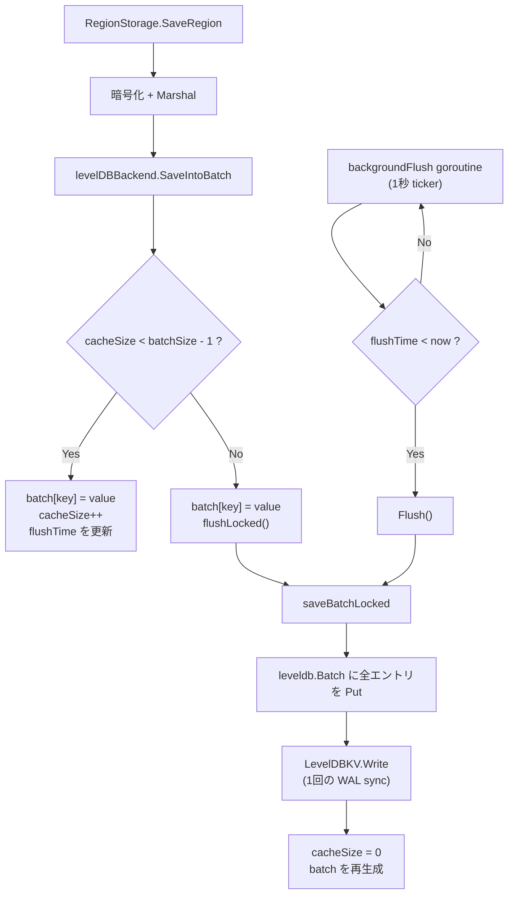
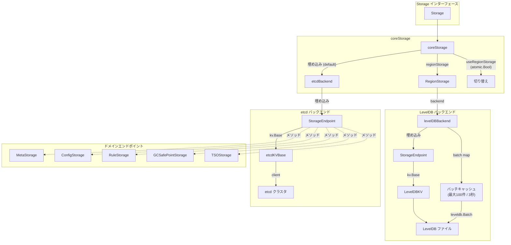

# 第20章 ストレージ層（etcd と LevelDB）

> **本章で読むソース**
>
> - [`pkg/storage/storage.go`](https://github.com/tikv/pd/blob/v8.5.6/pkg/storage/storage.go)
> - [`pkg/storage/etcd_backend.go`](https://github.com/tikv/pd/blob/v8.5.6/pkg/storage/etcd_backend.go)
> - [`pkg/storage/leveldb_backend.go`](https://github.com/tikv/pd/blob/v8.5.6/pkg/storage/leveldb_backend.go)
> - [`pkg/storage/region_storage.go`](https://github.com/tikv/pd/blob/v8.5.6/pkg/storage/region_storage.go)
> - [`pkg/storage/kv/kv.go`](https://github.com/tikv/pd/blob/v8.5.6/pkg/storage/kv/kv.go)
> - [`pkg/storage/kv/etcd_kv.go`](https://github.com/tikv/pd/blob/v8.5.6/pkg/storage/kv/etcd_kv.go)
> - [`pkg/storage/kv/levedb_kv.go`](https://github.com/tikv/pd/blob/v8.5.6/pkg/storage/kv/levedb_kv.go)
> - [`pkg/storage/endpoint/endpoint.go`](https://github.com/tikv/pd/blob/v8.5.6/pkg/storage/endpoint/endpoint.go)
> - [`pkg/storage/endpoint/meta.go`](https://github.com/tikv/pd/blob/v8.5.6/pkg/storage/endpoint/meta.go)
> - [`pkg/storage/endpoint/util.go`](https://github.com/tikv/pd/blob/v8.5.6/pkg/storage/endpoint/util.go)
> - [`pkg/utils/keypath/key_path.go`](https://github.com/tikv/pd/blob/v8.5.6/pkg/utils/keypath/key_path.go)

## この章の狙い

PD が保持するクラスタメタデータは、大きく2種類のバックエンドに書き分けられている。
クラスタ全体で共有が必要な設定や Store 情報は etcd に保存し、件数が多くサイズも大きい Region メタデータはローカルの LevelDB に保存する。
本章では、この2層構造を支える `Storage` インターフェース、`kv.Base` 抽象、etcd バックエンドと LevelDB バックエンドの実装、そしてそれらを統合する `coreStorage` を読む。
LevelDB バックエンドが採用するバッチ書き込みの最適化を機構レベルで説明する。

## 前提

[第2章](../part00-overview/02-server-architecture.md)で PD サーバーが etcd を組み込んで起動する構成を読んだ。
[第8章](../part02-metadata/08-region-and-region-tree.md)で Region メタデータの構造を読んだ。
[第9章](../part02-metadata/09-region-heartbeat.md)で Region ハートビートによりメタデータが更新される流れを読んだ。
本章はこれらのメタデータが永続化される先であるストレージ層に焦点を当てる。
コード引用は tikv/pd のタグ `v8.5.6` に固定する。

---

## Storage インターフェース

PD のストレージ層の入り口は **`Storage`** インターフェースである。
`kv.Base`（後述）と 14 のドメイン固有エンドポイントインターフェースを埋め込んだ合成インターフェースとして定義されている。

[`pkg/storage/storage.go L32-L50`](https://github.com/tikv/pd/blob/v8.5.6/pkg/storage/storage.go#L32-L50)

```go
type Storage interface {
	// Introducing the kv.Base here is to provide
	// the basic key-value read/write ability for the Storage.
	kv.Base
	endpoint.ServiceMiddlewareStorage
	endpoint.ConfigStorage
	endpoint.MetaStorage
	endpoint.RuleStorage
	endpoint.ReplicationStatusStorage
	endpoint.GCSafePointStorage
	endpoint.MinResolvedTSStorage
	endpoint.ExternalTSStorage
	endpoint.SafePointV2Storage
	endpoint.KeyspaceStorage
	endpoint.ResourceGroupStorage
	endpoint.TSOStorage
	endpoint.KeyspaceGroupStorage
	endpoint.AffinityStorage
}
```

`kv.Base` が汎用のキーバリュー読み書きを提供し、その上にドメインごとのストレージ操作（Config、Rule、GCSafePoint、TSO など）が載る構造である。
呼び出し側は `Storage` インターフェースだけを受け取れば、バックエンドが etcd なのか LevelDB なのかを意識する必要がない。

## kv.Base と kv.Txn

ストレージ層の最下位にある抽象は **`kv.Txn`** と **`kv.Base`** の2つである。

[`pkg/storage/kv/kv.go L21-L26`](https://github.com/tikv/pd/blob/v8.5.6/pkg/storage/kv/kv.go#L21-L26)

```go
type Txn interface {
	Save(key, value string) error
	Remove(key string) error
	Load(key string) (string, error)
	LoadRange(key, endKey string, limit int) (keys []string, values []string, err error)
}
```

「Txn」は `Save`、`Remove`、`Load`、`LoadRange` の4操作を束ねる。
これらの操作を複数まとめてアトミックに実行するための単位である。

[`pkg/storage/kv/kv.go L28-L45`](https://github.com/tikv/pd/blob/v8.5.6/pkg/storage/kv/kv.go#L28-L45)

```go
type Base interface {
	Txn
	// RunInTxn runs the user provided function in a Transaction.
	// If user provided function f returns a non-nil error, then
	// transaction will not be committed, the same error will be
	// returned by RunInTxn.
	// Otherwise, it returns the error occurred during the
	// transaction.
	// Note that transaction are not committed until RunInTxn returns nil.
	// Note:
	// 1. Load and LoadRange operations provides only stale read.
	// Values saved/ removed during transaction will not be immediately
	// observable in the same transaction.
	// 2. Only when storage is etcd, does RunInTxn checks that
	// values loaded during transaction has not been modified before commit.
	RunInTxn(ctx context.Context, f func(txn Txn) error) error
}
```

「Base」は「Txn」を埋め込み、`RunInTxn` を追加したインターフェースである。
`RunInTxn` はユーザーが渡した関数をトランザクション内で実行し、関数が nil を返した場合にのみコミットする。
コメントに記されているとおり、楽観的同時実行制御（ロード時に読んだ値がコミット時まで変更されていないことの検証）は etcd バックエンドでのみ行われる。

## etcd バックエンド

### etcdBackend の構造

**`etcdBackend`** は etcd をバックエンドに使うストレージ実装である。
構造体自体はきわめて薄く、`StorageEndpoint`（後述）を埋め込むだけで成り立っている。

[`pkg/storage/etcd_backend.go L25-L37`](https://github.com/tikv/pd/blob/v8.5.6/pkg/storage/etcd_backend.go#L25-L37)

```go
type etcdBackend struct {
	*endpoint.StorageEndpoint
}

// newEtcdBackend is used to create a new etcd backend.
func newEtcdBackend(client *clientv3.Client, rootPath string) *etcdBackend {
	return &etcdBackend{
		endpoint.NewStorageEndpoint(
			kv.NewEtcdKVBase(client, rootPath),
			nil,
		),
	}
}
```

`NewEtcdKVBase` が `kv.Base` の実装を生成し、それを `StorageEndpoint` で包み、さらに `etcdBackend` が包む。
暗号化キーマネージャには `nil` を渡している。etcd バックエンドでは Region 以外のメタデータを扱うため、Region 固有の暗号化は不要だからである。

### etcdKVBase のキー操作

**`etcdKVBase`** は etcd クライアントと `rootPath` を保持し、すべてのキーに `rootPath` を前置して etcd を操作する。

[`pkg/storage/kv/etcd_kv.go L45-L48`](https://github.com/tikv/pd/blob/v8.5.6/pkg/storage/kv/etcd_kv.go#L45-L48)

```go
type etcdKVBase struct {
	client   *clientv3.Client
	rootPath string
}
```

`Save` と `Remove` は **`SlowLogTxn`** を経由して etcd に書き込む。
`SlowLogTxn` は etcd のトランザクションをラップし、1秒を超えた遅いトランザクションをログに記録する仕組みである。

### etcdTxn による楽観的同時実行制御

`RunInTxn` は **`etcdTxn`** を生成し、ユーザー関数を実行したあとにコミットする。

[`pkg/storage/kv/etcd_kv.go L217-L227`](https://github.com/tikv/pd/blob/v8.5.6/pkg/storage/kv/etcd_kv.go#L217-L227)

```go
func (kv *etcdKVBase) RunInTxn(ctx context.Context, f func(txn Txn) error) error {
	txn := &etcdTxn{
		kv:  kv,
		ctx: ctx,
	}
	err := f(txn)
	if err != nil {
		return err
	}
	return txn.commit()
}
```

「etcdTxn」は `conditions`（etcd の `Compare`）と `operations`（`OpPut`、`OpDelete`）を蓄積する。
`Load` を呼ぶと、読んだ値に対して `Compare` 条件が追加され、コミット時に値が変わっていないことを検証する。
`Save` や `Remove` を呼ぶと、対応する操作が `operations` に追加される。

コミット処理は etcd の `If/Then` パターンで条件と操作を一括適用する。

[`pkg/storage/kv/etcd_kv.go L292-L308`](https://github.com/tikv/pd/blob/v8.5.6/pkg/storage/kv/etcd_kv.go#L292-L308)

```go
func (txn *etcdTxn) commit() error {
	failpoint.Inject("slowTxn", func() {
		time.Sleep(10 * time.Second)
	})
	// Using slowLogTxn to commit transaction.
	slowLogTxn := NewSlowLogTxnWithContext(txn.ctx, txn.kv.client)
	slowLogTxn.If(txn.conditions...)
	slowLogTxn.Then(txn.operations...)
	resp, err := slowLogTxn.Commit()
	if err != nil {
		return err
	}
	if !resp.Succeeded {
		return errs.ErrEtcdTxnConflict.FastGenByArgs()
	}
	return nil
}
```

`If` に渡された条件がすべて成立すれば `Then` の操作が実行され、一つでも不成立なら `resp.Succeeded` が `false` となり `ErrEtcdTxnConflict` を返す。
ロックを取らずにリトライで解決する楽観的同時実行制御であり、PD の Placement Rules 保存や Keyspace 操作で使われている。

## LevelDB バックエンド

### levelDBBackend の構造

**`levelDBBackend`** は Region メタデータの永続化に使われるバックエンドである。
etcd に数十万件の Region を保存するとメモリと通信量が問題になるため、ローカルの LevelDB に書き分ける設計を採っている。

[`pkg/storage/leveldb_backend.go L32-L54`](https://github.com/tikv/pd/blob/v8.5.6/pkg/storage/leveldb_backend.go#L32-L54)

```go
const (
	// defaultFlushRate is the default interval to flush the data into the local storage.
	defaultFlushRate = 3 * time.Second
	// defaultBatchSize is the default batch size to save the data to the local storage.
	defaultBatchSize = 100
	// defaultDirtyFlushTick
	defaultDirtyFlushTick = time.Second
)

type levelDBBackend struct {
	*endpoint.StorageEndpoint
	ekm       *encryption.Manager
	mu        syncutil.RWMutex
	batch     map[string][]byte
	batchSize int
	cacheSize int
	flushRate time.Duration
	flushTime time.Time
	ctx       context.Context
	cancel    context.CancelFunc
}
```

`batch` フィールドがインメモリのバッチキャッシュであり、`batchSize`（100）と `flushRate`（3秒）がフラッシュの閾値を定める。
`cacheSize` は現在キャッシュに溜まっているエントリ数を追跡する。

コンストラクタでは `LevelDBKV` を生成し、バックグラウンドフラッシュの goroutine を起動する。

[`pkg/storage/leveldb_backend.go L56-L77`](https://github.com/tikv/pd/blob/v8.5.6/pkg/storage/leveldb_backend.go#L56-L77)

```go
func newLevelDBBackend(
	ctx context.Context,
	filePath string,
	ekm *encryption.Manager,
) (*levelDBBackend, error) {
	levelDB, err := kv.NewLevelDBKV(filePath)
	if err != nil {
		return nil, err
	}
	lb := &levelDBBackend{
		StorageEndpoint: endpoint.NewStorageEndpoint(levelDB, ekm),
		ekm:             ekm,
		batchSize:       defaultBatchSize,
		flushRate:       defaultFlushRate,
		batch:           make(map[string][]byte, defaultBatchSize),
		flushTime:       time.Now().Add(defaultFlushRate),
	}
	lb.ctx, lb.cancel = context.WithCancel(ctx)
	go lb.backgroundFlush()
	return lb, nil
}
```

### バッチ書き込みの最適化

Region ハートビートは大規模クラスタで毎秒数千件に達する。
ハートビートごとに1回ずつ LevelDB に `Put` すると、書き込みのたびに WAL の sync が発生し、ディスク I/O がボトルネックになる。
「levelDBBackend」はこの問題を、インメモリの `batch` マップに書き込みを蓄積し、一定件数または一定時間が経過したら `leveldb.Batch` で一括書き込みする仕組みで解決している。

**`SaveIntoBatch`** はキーと値を `batch` マップに追加し、キャッシュが `batchSize - 1`（99件）に達していなければ `flushTime` を更新して戻る。
99件に達していた場合は、100件目を追加してから即座にフラッシュする。

[`pkg/storage/leveldb_backend.go L112-L124`](https://github.com/tikv/pd/blob/v8.5.6/pkg/storage/leveldb_backend.go#L112-L124)

```go
func (lb *levelDBBackend) SaveIntoBatch(key string, value []byte) error {
	lb.mu.Lock()
	defer lb.mu.Unlock()
	if lb.cacheSize < lb.batchSize-1 {
		lb.batch[key] = value
		lb.cacheSize++

		lb.flushTime = time.Now().Add(lb.flushRate)
		return nil
	}
	lb.batch[key] = value
	return lb.flushLocked()
}
```

フラッシュは `saveBatchLocked` が `leveldb.Batch` を構築して書き込み、その後にキャッシュをクリアする。

[`pkg/storage/leveldb_backend.go L133-L151`](https://github.com/tikv/pd/blob/v8.5.6/pkg/storage/leveldb_backend.go#L133-L151)

```go
func (lb *levelDBBackend) flushLocked() error {
	if err := lb.saveBatchLocked(); err != nil {
		return err
	}
	lb.cacheSize = 0
	lb.batch = make(map[string][]byte, lb.batchSize)
	return nil
}

func (lb *levelDBBackend) saveBatchLocked() error {
	batch := new(leveldb.Batch)
	for key, value := range lb.batch {
		batch.Put([]byte(key), value)
	}
	if err := lb.Base.(*kv.LevelDBKV).Write(batch, nil); err != nil {
		return errs.ErrLevelDBWrite.Wrap(err).GenWithStackByCause()
	}
	return nil
}
```

`leveldb.Batch` は複数の Put 操作を1回の WAL 書き込みにまとめるため、100件分のディスク sync を1回に償却できる。

### バックグラウンドフラッシュ

バッチが100件に達する前でも、3秒以上データが滞留しないように、**`backgroundFlush`** goroutine が定期的にフラッシュを試みる。

[`pkg/storage/leveldb_backend.go L79-L107`](https://github.com/tikv/pd/blob/v8.5.6/pkg/storage/leveldb_backend.go#L79-L107)

```go
func (lb *levelDBBackend) backgroundFlush() {
	defer logutil.LogPanic()

	var (
		isFlush bool
		err     error
	)
	ticker := time.NewTicker(defaultDirtyFlushTick)
	defer ticker.Stop()
	for {
		select {
		case <-ticker.C:
			lb.mu.RLock()
			isFlush = lb.flushTime.Before(time.Now())
			// ... (中略) ...
			lb.mu.RUnlock()
			if !isFlush {
				continue
			}
			if err = lb.Flush(); err != nil {
				log.Error("flush data meet error", errs.ZapError(err))
			}
		case <-lb.ctx.Done():
			return
		}
	}
}
```

ticker は1秒間隔で起動し、`flushTime`（最後の `SaveIntoBatch` から3秒後）を過ぎていればフラッシュを実行する。
コンテキストがキャンセルされると goroutine は終了する。

以下の図にバッチ書き込みの全体フローを示す。



## coreStorage によるバックエンドの切り替え

**`coreStorage`** は etcd バックエンドと LevelDB バックエンドを組み合わせ、Region 操作だけを LevelDB に振り分ける構造体である。

[`pkg/storage/storage.go L86-L105`](https://github.com/tikv/pd/blob/v8.5.6/pkg/storage/storage.go#L86-L105)

```go
type coreStorage struct {
	Storage
	regionStorage endpoint.RegionStorage

	useRegionStorage atomic.Bool
	regionLoaded     regionSource
	mu               syncutil.RWMutex
}

func NewCoreStorage(defaultStorage Storage, regionStorage endpoint.RegionStorage) Storage {
	return &coreStorage{
		Storage:       defaultStorage,
		regionStorage: regionStorage,
		regionLoaded:  unloaded,
	}
}
```

`Storage`（通常は etcd バックエンド）を埋め込み、Region 操作のみを `regionStorage`（通常は LevelDB バックエンド）に委譲する。
`useRegionStorage` は `atomic.Bool` であり、ロックなしで安全に読み書きできる。

### TrySwitchRegionStorage

**`TrySwitchRegionStorage`** は Region ストレージの切り替えを行う。
リーダー選出後に LevelDB への切り替えが行われ、リーダーを失ったときに etcd へ戻される。

[`pkg/storage/storage.go L121-L137`](https://github.com/tikv/pd/blob/v8.5.6/pkg/storage/storage.go#L121-L137)

```go
func TrySwitchRegionStorage(s Storage, useLocalRegionStorage bool) endpoint.RegionStorage {
	ps, ok := s.(*coreStorage)
	if !ok {
		return nil
	}

	if useLocalRegionStorage {
		ps.useRegionStorage.Store(true)
		return ps.regionStorage
	}
	ps.useRegionStorage.Store(false)
	return ps.Storage
}
```

### TryLoadRegionsOnce

**`TryLoadRegionsOnce`** は LevelDB からの Region ロードを1回だけ実行する。
`regionLoaded` フィールドが `unloaded` のときだけロードを行い、以後は再ロードしない。
ミューテックスで保護されているため、同時に複数の goroutine がロードを開始することはない。

[`pkg/storage/storage.go L141-L165`](https://github.com/tikv/pd/blob/v8.5.6/pkg/storage/storage.go#L141-L165)

```go
func TryLoadRegionsOnce(ctx context.Context, s Storage, f func(region *core.RegionInfo) []*core.RegionInfo) error {
	ps, ok := s.(*coreStorage)
	if !ok {
		return s.LoadRegions(ctx, f)
	}

	ps.mu.Lock()
	defer ps.mu.Unlock()

	if !ps.useRegionStorage.Load() {
		err := ps.Storage.LoadRegions(ctx, f)
		if err == nil {
			ps.regionLoaded = fromEtcd
		}
		return err
	}

	if ps.regionLoaded == unloaded {
		if err := ps.regionStorage.LoadRegions(ctx, f); err != nil {
			return err
		}
		ps.regionLoaded = fromLeveldb
	}
	return nil
}
```

`SaveRegion` などの Region 操作は `useRegionStorage` フラグに応じて委譲先を切り替える。

[`pkg/storage/storage.go L184-L189`](https://github.com/tikv/pd/blob/v8.5.6/pkg/storage/storage.go#L184-L189)

```go
func (ps *coreStorage) SaveRegion(region *metapb.Region) error {
	if ps.useRegionStorage.Load() {
		return ps.regionStorage.SaveRegion(region)
	}
	return ps.Storage.SaveRegion(region)
}
```

## RegionStorage

**`RegionStorage`** は `levelDBBackend` を包み、`endpoint.RegionStorage` インターフェースの実装を提供する構造体である。

[`pkg/storage/region_storage.go L32-L35`](https://github.com/tikv/pd/blob/v8.5.6/pkg/storage/region_storage.go#L32-L35)

```go
type RegionStorage struct {
	kv.Base
	backend *levelDBBackend
}
```

`SaveRegion` では、Region を暗号化してから `SaveIntoBatch` を呼ぶ。
`StorageEndpoint` のデフォルト実装（`Save` を直接呼ぶ）とは異なり、バッチキャッシュ経由で書き込む点が「RegionStorage」の役割である。

[`pkg/storage/region_storage.go L55-L65`](https://github.com/tikv/pd/blob/v8.5.6/pkg/storage/region_storage.go#L55-L65)

```go
func (s *RegionStorage) SaveRegion(region *metapb.Region) error {
	encryptedRegion, err := encryption.EncryptRegion(region, s.backend.ekm)
	if err != nil {
		return err
	}
	value, err := proto.Marshal(encryptedRegion)
	if err != nil {
		return errs.ErrProtoMarshal.Wrap(err).GenWithStackByCause()
	}
	return s.backend.SaveIntoBatch(keypath.RegionPath(region.GetId()), value)
}
```

暗号化は `encryption.EncryptRegion` が担う。
`levelDBBackend` が `encryption.Manager` を保持しており、読み込み時の `DecryptRegion` と対になる。

## StorageEndpoint とドメインエンドポイント

### StorageEndpoint

**`StorageEndpoint`** は `kv.Base` と `encryption.Manager` を埋め込み、すべてのドメイン固有エンドポイントのメソッドが定義される基盤構造体である。

[`pkg/storage/endpoint/endpoint.go L25-L40`](https://github.com/tikv/pd/blob/v8.5.6/pkg/storage/endpoint/endpoint.go#L25-L40)

```go
type StorageEndpoint struct {
	kv.Base
	encryptionKeyManager *encryption.Manager
}

func NewStorageEndpoint(
	kvBase kv.Base,
	encryptionKeyManager *encryption.Manager,
) *StorageEndpoint {
	return &StorageEndpoint{
		kvBase,
		encryptionKeyManager,
	}
}
```

`etcdBackend` と `levelDBBackend` の両方がこの「StorageEndpoint」を埋め込む。
バックエンドの違いは `kv.Base` の具象型（`etcdKVBase` か `LevelDBKV` か）の違いとして吸収される。

### シリアライズのパターン

ドメインエンドポイントは、データ形式に応じて2つのシリアライズパターンを使い分ける。

**Protocol Buffers 形式**：`loadProto` と `saveProto` を使う。
クラスタメタ（`LoadMeta`、`SaveMeta`）、Store メタ（`LoadStoreMeta`、`SaveStoreMeta`）、Region（`LoadRegion`、`SaveRegion`）がこのパターンに該当する。

**JSON 形式**：`saveJSON` を使う。
Config（`SaveConfig`）、ServiceMiddleware（`SaveServiceMiddlewareConfig`）、GCSafePoint 関連がこのパターンに該当する。

### トランザクションベースの操作

Placement Rules のように複数キーをアトミックに更新する操作は `kv.Txn` を引数に受け取る。

[`pkg/storage/endpoint/rule.go L48-L49`](https://github.com/tikv/pd/blob/v8.5.6/pkg/storage/endpoint/rule.go#L48-L49)

```go
func (*StorageEndpoint) SaveRule(txn kv.Txn, ruleKey string, rule any) error {
	return saveJSONInTxn(txn, keypath.RuleKeyPath(ruleKey), rule)
```

呼び出し側が `RunInTxn` でトランザクションを開始し、その中で `SaveRule` や `DeleteRule` を呼ぶ。
etcd バックエンドでは楽観的同時実行制御が効くため、他の PD ノードと競合した場合は `ErrEtcdTxnConflict` で失敗する。

バッチ操作が etcd の1トランザクションあたりの上限（`MaxEtcdTxnOps`）を超える場合は、`RunBatchOpInTxn` が自動的にバッチを分割する。

[`pkg/storage/endpoint/util.go L87-L106`](https://github.com/tikv/pd/blob/v8.5.6/pkg/storage/endpoint/util.go#L87-L106)

```go
func RunBatchOpInTxn(ctx context.Context, storage TxnStorage, batch []func(kv.Txn) error) error {
	for start := 0; start < len(batch); start += etcdutil.MaxEtcdTxnOps {
		end := start + etcdutil.MaxEtcdTxnOps
		if end > len(batch) {
			end = len(batch)
		}
		err := storage.RunInTxn(ctx, func(txn kv.Txn) (err error) {
			for _, op := range batch[start:end] {
				if err = op(txn); err != nil {
					return err
				}
			}
			return nil
		})
		if err != nil {
			return err
		}
	}
	return nil
}
```

## キーパス設計

etcd と LevelDB に保存されるキーのパスは **`keypath`** パッケージで定義されている。
定数として `"raft"`（クラスタメタ）、`"config"`、`"rules"`、`"rule_group"` などが定義され、各関数がこれらを組み合わせてパスを生成する。

### RegionPath の事前割り当て最適化

Region メタデータのキーパスを生成する `RegionPath` は、PD で最も頻繁に呼ばれるパス生成関数の一つである。
この関数は `strings.Builder` の `Grow` を使い、必要なバッファサイズを事前に割り当てている。

[`pkg/utils/keypath/key_path.go L168-L189`](https://github.com/tikv/pd/blob/v8.5.6/pkg/utils/keypath/key_path.go#L168-L189)

```go
func RegionPath(regionID uint64) string {
	var buf strings.Builder
	buf.Grow(len(regionPathPrefix) + 1 + keyLen) // Preallocate memory

	buf.WriteString(regionPathPrefix)
	buf.WriteString("/")
	s := strconv.FormatUint(regionID, 10)
	b := make([]byte, keyLen)
	copy(b, s)
	if len(s) < keyLen {
		diff := keyLen - len(s)
		copy(b[diff:], s)
		for i := range diff {
			b[i] = '0'
		}
	} else if len(s) > keyLen {
		copy(b, s[len(s)-keyLen:])
	}
	buf.Write(b)

	return buf.String()
}
```

`Grow(len(regionPathPrefix) + 1 + keyLen)` により、`strings.Builder` は内部バッファを1回だけ確保する。
`regionPathPrefix` は `"raft/r"`（6バイト）、区切りの `"/"`（1バイト）、`keyLen` は 20 なので、合計 27 バイトを事前に割り当てる。
Region ID は20桁のゼロ埋めで固定長にされるため、`"raft/r/00000000000000000001"` のようなパスが生成される。

固定長のゼロ埋めを使うことで、LevelDB 上のキーが辞書順で Region ID の昇順に並ぶ。
`LoadRange` で範囲スキャンする際に、この順序が効率的な走査を可能にしている。

Store のパスも同様に `StorePath` で `"raft/s/{20桁ゼロ埋めID}"` の形式で生成される。

## LoadRegions の動的 rangeLimit

`LoadRegions` は Region メタデータを一括ロードする関数で、gRPC のメッセージサイズ上限（4MB）への対策として動的な `rangeLimit` を採用している。

[`pkg/storage/endpoint/meta.go L172-L221`](https://github.com/tikv/pd/blob/v8.5.6/pkg/storage/endpoint/meta.go#L172-L221)

```go
func (se *StorageEndpoint) LoadRegions(ctx context.Context, f func(region *core.RegionInfo) []*core.RegionInfo) error {
	nextID := uint64(0)
	endKey := keypath.RegionPath(math.MaxUint64)

	// Since the region key may be very long, using a larger rangeLimit will cause
	// the message packet to exceed the grpc message size limit (4MB). Here we use
	// a variable rangeLimit to work around.
	rangeLimit := MaxKVRangeLimit
	for {
		// ... (中略) ...
		startKey := keypath.RegionPath(nextID)
		_, res, err := se.LoadRange(startKey, endKey, rangeLimit)
		if err != nil {
			if rangeLimit /= 2; rangeLimit >= MinKVRangeLimit {
				continue
			}
			return err
		}
		// ... (中略) ...
		for _, r := range res {
			region := &metapb.Region{}
			if err := region.Unmarshal([]byte(r)); err != nil {
				return errs.ErrProtoUnmarshal.Wrap(err).GenWithStackByArgs()
			}
			if err = encryption.DecryptRegion(region, se.encryptionKeyManager); err != nil {
				return err
			}

			nextID = region.GetId() + 1
			overlaps := f(core.NewRegionInfo(region, nil, core.SetSource(core.Storage)))
			for _, item := range overlaps {
				if err := se.DeleteRegion(item.GetMeta()); err != nil {
					return err
				}
			}
		}

		if len(res) < rangeLimit {
			return nil
		}
	}
}
```

初期値は `MaxKVRangeLimit`（10000）で開始し、`LoadRange` がエラーを返した場合に半分に縮小する。
`MinKVRangeLimit`（100）未満になるまで縮小を続け、それでもエラーなら呼び出し元にエラーを返す。
Region のメタデータサイズが大きい場合でも、レスポンスが 4MB を超えない範囲に自動調整される。

ロード中に重複する Region が検出された場合は、コールバック `f` の戻り値（`overlaps`）として返され、ストレージから削除される。

## 全体アーキテクチャ

以下の図にストレージ層の全体構造を示す。



## まとめ

PD のストレージ層は、`kv.Base` を抽象として etcd バックエンドと LevelDB バックエンドを統一的に扱う。
`coreStorage` が `useRegionStorage` フラグにより Region 操作の委譲先を切り替え、etcd には設定や Store 情報を、LevelDB には Region メタデータを書き分ける。

LevelDB バックエンドのバッチ書き込み最適化は、Region ハートビートごとの個別書き込みをインメモリの `batch` マップに蓄積し、100件または3秒の閾値で `leveldb.Batch` による一括書き込みに変換する。
これにより、ディスク sync の回数を最大100分の1に償却できる。

`RegionPath` の `strings.Builder` による事前割り当ては、頻繁なパス生成においてメモリアロケーション回数を1回に抑える。

etcd バックエンドでは `etcdTxn` が `If/Then` パターンによる楽観的同時実行制御を提供し、複数ノード間のメタデータ更新の一貫性を保証する。

## 関連する章

- [第2章 サーバーアーキテクチャ](../part00-overview/02-server-architecture.md)：PD サーバーが etcd を組み込む構成。
- [第5章 タイムスタンプの永続化と安全性](../part01-tso/05-tso-persistence.md)：TSO の永続化が `TSOStorage` エンドポイントを経由する仕組み。
- [第8章 Region メタデータと RegionTree](../part02-metadata/08-region-and-region-tree.md)：ストレージからロードされた Region がインメモリの RegionTree に格納される流れ。
- [第9章 Region ハートビートと統計収集](../part02-metadata/09-region-heartbeat.md)：ハートビートで更新された Region メタデータが `SaveRegion` で永続化される流れ。
- [第13章 Placement Rules と制約充足](../part03-scheduling/13-placement-rules.md)：Placement Rules の保存に `RuleStorage` と `kv.Txn` が使われる仕組み。
- [第19章 etcd とリーダー選出](../part05-ha-ops/19-etcd-and-leader-election.md)：リーダー選出後に `TrySwitchRegionStorage` で LevelDB への切り替えが行われる流れ。
