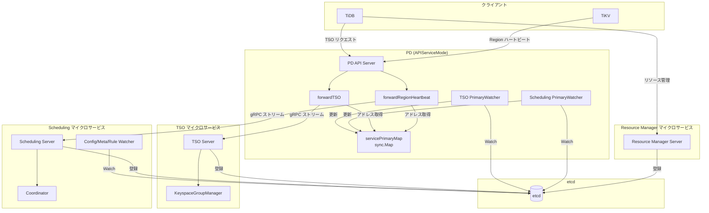
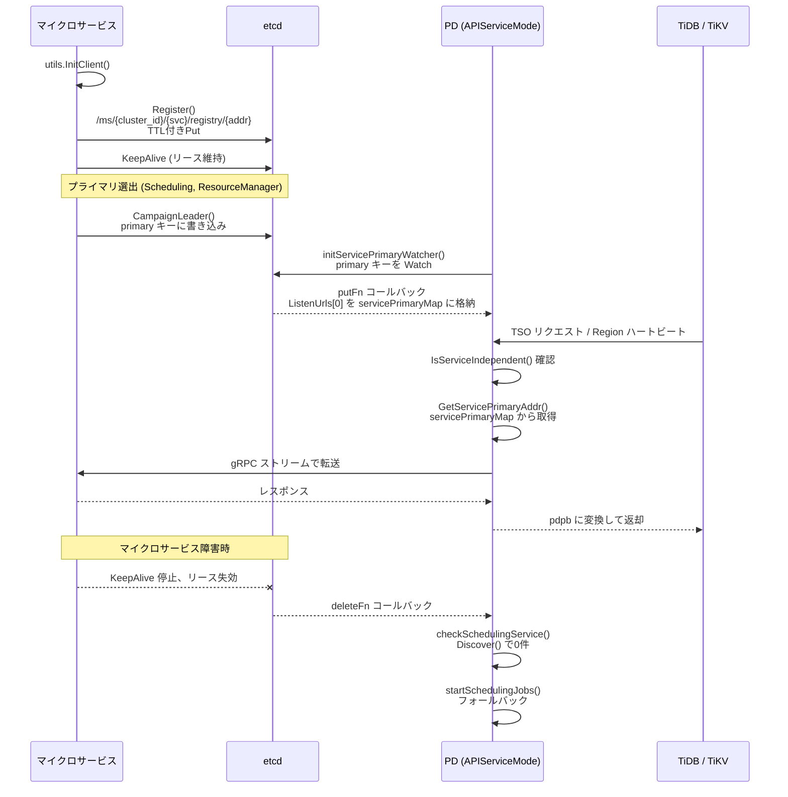

# 第21章 マイクロサービスアーキテクチャ

> **本章で読むソース**
>
> - [`server/server.go`](https://github.com/tikv/pd/blob/v8.5.6/server/server.go)
> - [`server/forward.go`](https://github.com/tikv/pd/blob/v8.5.6/server/forward.go)
> - [`server/grpc_service.go`](https://github.com/tikv/pd/blob/v8.5.6/server/grpc_service.go)
> - [`server/cluster/cluster.go`](https://github.com/tikv/pd/blob/v8.5.6/server/cluster/cluster.go)
> - [`pkg/mcs/tso/server/server.go`](https://github.com/tikv/pd/blob/v8.5.6/pkg/mcs/tso/server/server.go)
> - [`pkg/mcs/scheduling/server/server.go`](https://github.com/tikv/pd/blob/v8.5.6/pkg/mcs/scheduling/server/server.go)
> - [`pkg/mcs/resourcemanager/server/server.go`](https://github.com/tikv/pd/blob/v8.5.6/pkg/mcs/resourcemanager/server/server.go)
> - [`pkg/mcs/discovery/discover.go`](https://github.com/tikv/pd/blob/v8.5.6/pkg/mcs/discovery/discover.go)
> - [`pkg/mcs/discovery/register.go`](https://github.com/tikv/pd/blob/v8.5.6/pkg/mcs/discovery/register.go)
> - [`pkg/mcs/discovery/registry_entry.go`](https://github.com/tikv/pd/blob/v8.5.6/pkg/mcs/discovery/registry_entry.go)
> - [`pkg/mcs/utils/util.go`](https://github.com/tikv/pd/blob/v8.5.6/pkg/mcs/utils/util.go)
> - [`pkg/mcs/utils/constant/constant.go`](https://github.com/tikv/pd/blob/v8.5.6/pkg/mcs/utils/constant/constant.go)
> - [`pkg/utils/keypath/key_path.go`](https://github.com/tikv/pd/blob/v8.5.6/pkg/utils/keypath/key_path.go)

## この章の狙い

PD は単一プロセスで TSO 発行、スケジューリング、メタデータ管理のすべてを担う。
クラスタが大規模になると TSO 発行の遅延やスケジューリングの負荷が PD のボトルネックになる。
PD v7 以降では、TSO やスケジューリングを独立したプロセスに切り出す**マイクロサービスモード**が導入された。
本章では、PD のサービスモードの切り替え、3つのマイクロサービスの起動と選出、etcd を介したサービスディスカバリ、PD から各マイクロサービスへのリクエスト転送の仕組みを読む。
最適化として gRPC 接続プーリングと TSO ストリームプーリングの機構を説明する。

## 前提

[第2章](../part00-overview/02-server-architecture.md)で PD サーバーの起動シーケンスと etcd の組み込みを読んだ。
[第4章](../part01-tso/04-tso-and-global-allocator.md)で TSO の発行フローを読んだ。
[第6章](../part01-tso/06-local-tso-and-microservice.md)で KeyspaceGroupManager によるマイクロサービス TSO の概要を読んだ。
[第10章](../part03-scheduling/10-coordinator.md)で Coordinator によるスケジューリングループを読んだ。
[第19章](../part05-ha-ops/19-etcd-and-leader-election.md)で etcd を使ったリーダー選出を読んだ。
コード引用は tikv/pd のタグ `v8.5.6` に固定する。

---

## サービスモードの定義

PD サーバーには2つの動作モードがある。

[`server/server.go L104-L107`](https://github.com/tikv/pd/blob/v8.5.6/server/server.go#L104-L107)

```go
// PDMode represents that server is in PD mode.
PDMode = "PD"
// APIServiceMode represents that server is in API service mode.
APIServiceMode = "API Service"
```

**PDMode** は従来の動作モードであり、PD が TSO 発行からスケジューリングまですべてを単一プロセスで実行する。
**APIServiceMode** は、PD が API サーバーとしてのみ動作し、TSO 発行やスケジューリングの処理を外部のマイクロサービスへ委譲するモードである。

「APIServiceMode」では、TiDB や TiKV からの TSO リクエストや Region ハートビートを PD が受け取り、該当するマイクロサービスへ gRPC ストリーム経由で転送する。
マイクロサービスが見つからない場合は PD 内部にフォールバックする仕組みも備える。

## pkg/mcs/ の構成

マイクロサービスの実装は `pkg/mcs/` 配下に置かれている。
3つの独立したサービスと、共通基盤から構成される。

```
pkg/mcs/
├── tso/server/             TSO マイクロサービス
├── scheduling/server/      Scheduling マイクロサービス
├── resourcemanager/server/ Resource Manager マイクロサービス
├── server/                 BaseServer（共通基盤）
├── discovery/              サービス登録と発見
└── utils/                  InitClient, Register 等の共通ユーティリティ
```

サービス名は定数として一元管理されている。

[`pkg/mcs/utils/constant/constant.go L59-L67`](https://github.com/tikv/pd/blob/v8.5.6/pkg/mcs/utils/constant/constant.go#L59-L67)

```go
MicroserviceRootPath = "/ms"
// ...
TSOServiceName = "tso"
// ...
ResourceManagerServiceName = "resource_manager"
// ...
SchedulingServiceName = "scheduling"
```

これらの定数は etcd のキーパス生成やサービスディスカバリで一貫して使われる。

## TSO マイクロサービス

TSO マイクロサービスは TSO 発行に特化したプロセスであり、PD 本体から分離して水平スケールできる。

### Server 構造体

[`pkg/mcs/tso/server/server.go L64-L87`](https://github.com/tikv/pd/blob/v8.5.6/pkg/mcs/tso/server/server.go#L64-L87)

```go
type Server struct {
	*server.BaseServer
	diagnosticspb.DiagnosticsServer

	// Server state. 0 is not running, 1 is running.
	isRunning int64

	serverLoopCtx    context.Context
	serverLoopCancel func()
	serverLoopWg     sync.WaitGroup

	cfg *Config

	service              *Service
	keyspaceGroupManager *tso.KeyspaceGroupManager

	tsoProtoFactory *tsoutil.TSOProtoFactory

	// for service registry
	serviceID       *discovery.ServiceRegistryEntry
	serviceRegister *discovery.ServiceRegister
}
```

`BaseServer` を埋め込むことで、etcd クライアントの管理やリスナーの初期化といった共通機能を継承する。
TSO 固有の部分は `keyspaceGroupManager` であり、各キースペースグループに対して TSO アロケータを管理する。

### 起動シーケンス

`Run()` で TSO サーバーの起動処理が始まる。

[`pkg/mcs/tso/server/server.go L148-L163`](https://github.com/tikv/pd/blob/v8.5.6/pkg/mcs/tso/server/server.go#L148-L163)

```go
func (s *Server) Run() (err error) {
	go systimemon.StartMonitor(s.Context(), time.Now, func() {
		log.Error("system time jumps backward", errs.ZapError(errs.ErrIncorrectSystemTime))
		timeJumpBackCounter.Inc()
	})

	if err = utils.InitClient(s); err != nil {
		return err
	}

	if s.serviceID, s.serviceRegister, err = utils.Register(s, constant.TSOServiceName); err != nil {
		return err
	}

	return s.startServer()
}
```

`systimemon.StartMonitor` がシステム時刻の逆行を監視する。
TSO は単調増加が保証されなければならないため、時刻ジャンプの検知はこのサービスに固有の処理である。
`utils.InitClient` で etcd クライアントを初期化し、`utils.Register` で etcd にサービスエントリを登録する（詳細は後述のサービスディスカバリ節で読む）。

`startServer()` では `KeyspaceGroupManager` を初期化して TSO アロケータ群を起動し、gRPC サーバーと HTTP サーバーを立ち上げる。

[`pkg/mcs/tso/server/server.go L351-L392`](https://github.com/tikv/pd/blob/v8.5.6/pkg/mcs/tso/server/server.go#L351-L392)

```go
func (s *Server) startServer() (err error) {
	// ... (中略) ...
	s.serverLoopCtx, s.serverLoopCancel = context.WithCancel(s.Context())
	legacySvcRootPath := keypath.LegacyRootPath()
	tsoSvcRootPath := keypath.TSOSvcRootPath()
	s.keyspaceGroupManager = tso.NewKeyspaceGroupManager(
		s.serverLoopCtx, s.serviceID, s.GetClient(), s.GetHTTPClient(),
		s.cfg.AdvertiseListenAddr, legacySvcRootPath, tsoSvcRootPath, s.cfg)
	if err := s.keyspaceGroupManager.Initialize(); err != nil {
		return err
	}

	s.tsoProtoFactory = &tsoutil.TSOProtoFactory{}
	s.service = &Service{Server: s}

	if err := s.InitListener(s.GetTLSConfig(), s.cfg.ListenAddr); err != nil {
		return err
	}

	serverReadyChan := make(chan struct{})
	defer close(serverReadyChan)
	s.serverLoopWg.Add(1)
	go utils.StartGRPCAndHTTPServers(s, serverReadyChan, s.GetListener())
	<-serverReadyChan
	// ... (中略) ...
	atomic.StoreInt64(&s.isRunning, 1)
	return nil
}
```

TSO サーバーは Scheduling サーバーと異なり `Participant` によるプライマリ選出ループを持たない。
プライマリ選出は `KeyspaceGroupManager` が各キースペースグループ単位で行う（第6章参照）。

## Scheduling マイクロサービス

Scheduling マイクロサービスは Region のスケジューリングに特化したプロセスである。
複数インスタンスを起動し、プライマリ選出で1台がアクティブになる構成を取る。

### Server 構造体

[`pkg/mcs/scheduling/server/server.go L79-L117`](https://github.com/tikv/pd/blob/v8.5.6/pkg/mcs/scheduling/server/server.go#L79-L117)

```go
type Server struct {
	*server.BaseServer
	diagnosticspb.DiagnosticsServer

	// Server state. 0 is not running, 1 is running.
	isRunning int64

	serverLoopCtx    context.Context
	serverLoopCancel func()
	serverLoopWg     sync.WaitGroup

	cfg           *config.Config
	persistConfig *config.PersistConfig
	basicCluster  *core.BasicCluster

	// for the primary election of scheduling
	participant *member.Participant

	service           *Service
	checkMembershipCh chan struct{}

	// primaryCallbacks will be called after the server becomes leader.
	primaryCallbacks     []func(context.Context) error
	primaryExitCallbacks []func()

	// for service registry
	serviceID       *discovery.ServiceRegistryEntry
	serviceRegister *discovery.ServiceRegister

	cluster   *Cluster
	hbStreams *hbstream.HeartbeatStreams
	storage   *endpoint.StorageEndpoint

	// for watching the PD meta info updates that are related to the scheduling.
	configWatcher   *config.Watcher
	ruleWatcher     *rule.Watcher
	metaWatcher     *meta.Watcher
	affinityWatcher *affinity.Watcher
}
```

TSO サーバーとの大きな違いは `participant` フィールドと各種 Watcher の存在である。
`participant` は etcd リースを使ったプライマリ選出を担い、Watcher 群は PD が etcd に書き込んだメタデータを Watch して Scheduling サービスのインメモリ状態に反映する。

### 起動シーケンスとプライマリ選出

`Run()` は TSO サーバーと同じパターンで `InitClient`、`Register`、`startServer` の順に呼び出す。

[`pkg/mcs/scheduling/server/server.go L156-L166`](https://github.com/tikv/pd/blob/v8.5.6/pkg/mcs/scheduling/server/server.go#L156-L166)

```go
func (s *Server) Run() (err error) {
	if err = utils.InitClient(s); err != nil {
		return err
	}

	if s.serviceID, s.serviceRegister, err = utils.Register(s, constant.SchedulingServiceName); err != nil {
		return err
	}

	return s.startServer()
}
```

`startServer()` で `Participant` を生成し、プライマリ選出ループを開始する。

[`pkg/mcs/scheduling/server/server.go L449-L488`](https://github.com/tikv/pd/blob/v8.5.6/pkg/mcs/scheduling/server/server.go#L449-L488)

```go
func (s *Server) startServer() (err error) {
	// ... (中略) ...
	s.participant = member.NewParticipant(s.GetClient(), constant.SchedulingServiceName)
	p := &schedulingpb.Participant{
		Name:       uniqueName,
		Id:         uniqueID,
		ListenUrls: []string{s.cfg.GetAdvertiseListenAddr()},
	}
	s.participant.InitInfo(p, keypath.SchedulingSvcRootPath(), constant.PrimaryKey, "primary election")

	s.service = &Service{Server: s}
	s.AddServiceReadyCallback(s.startCluster)
	s.AddServiceExitCallback(s.stopCluster)
	// ... (中略) ...
	s.startServerLoop()
	// ... (中略) ...
	atomic.StoreInt64(&s.isRunning, 1)
	return nil
}
```

`AddServiceReadyCallback(s.startCluster)` により、プライマリに当選した直後に `startCluster` が呼ばれる。

### プライマリ選出ループ

`primaryElectionLoop()` は etcd 上でプライマリの座を競うループである。

[`pkg/mcs/scheduling/server/server.go L235-L274`](https://github.com/tikv/pd/blob/v8.5.6/pkg/mcs/scheduling/server/server.go#L235-L274)

```go
func (s *Server) primaryElectionLoop() {
	defer logutil.LogPanic()
	defer s.serverLoopWg.Done()

	for {
		select {
		case <-s.serverLoopCtx.Done():
			log.Info("server is closed, exit primary election loop")
			return
		default:
		}

		primary, checkAgain := s.participant.CheckLeader()
		if checkAgain {
			continue
		}
		if primary != nil {
			log.Info("start to watch the primary", zap.Stringer("scheduling-primary", primary))
			primary.Watch(s.serverLoopCtx)
			log.Info("the scheduling primary has changed, try to re-campaign a primary")
		}
		// ... (中略) ...
		s.campaignLeader()
	}
}
```

`CheckLeader()` で現在のプライマリを確認し、プライマリが存在すれば `Watch` でその変更を待つ。
プライマリが不在であれば `campaignLeader()` で自身が立候補する。
この構造は第19章で読んだ PD リーダー選出と同じパターンである。

### campaignLeader からクラスタ起動まで

`campaignLeader()` は etcd の `CampaignLeader` でリーダー選出に勝利すると、`primaryCallbacks` に登録された `startCluster` を呼び出す。

[`pkg/mcs/scheduling/server/server.go L276-L348`](https://github.com/tikv/pd/blob/v8.5.6/pkg/mcs/scheduling/server/server.go#L276-L348)

```go
func (s *Server) campaignLeader() {
	// ... (中略) ...
	if err := s.participant.CampaignLeader(s.Context(), s.cfg.LeaderLease); err != nil {
		// ... (中略) ...
		return
	}

	ctx, cancel := context.WithCancel(s.serverLoopCtx)
	var resetLeaderOnce sync.Once
	defer resetLeaderOnce.Do(func() {
		cancel()
		s.participant.ResetLeader()
		// ... (中略) ...
	})

	s.participant.KeepLeader(ctx)
	// ... (中略) ...
	for _, cb := range s.primaryCallbacks {
		if err := cb(ctx); err != nil {
			log.Error("failed to trigger the primary callback functions", errs.ZapError(err))
			return
		}
	}
	// ... (中略) ...
	lease, err := utils.KeepExpectedPrimaryAlive(ctx, s.GetClient(), exitPrimary,
		s.cfg.LeaderLease, s.participant.GetLeaderPath(), s.participant.MemberValue(), constant.SchedulingServiceName)
	// ... (中略) ...
	s.participant.EnableLeader()
	// ... (中略) ...
}
```

`KeepExpectedPrimaryAlive` は etcd リースを維持し続け、リースが失効するかプライマリが交代するまでループする。

`startCluster()` が呼ばれると、PD の etcd から Region メタデータや設定を Watch して Scheduling サービスのインメモリ状態を構築する。

[`pkg/mcs/scheduling/server/server.go L490-L516`](https://github.com/tikv/pd/blob/v8.5.6/pkg/mcs/scheduling/server/server.go#L490-L516)

```go
func (s *Server) startCluster(context.Context) error {
	s.basicCluster = core.NewBasicCluster()
	s.storage = endpoint.NewStorageEndpoint(kv.NewMemoryKV(), nil)
	err := s.startMetaConfWatcher()
	if err != nil {
		return err
	}
	s.hbStreams = hbstream.NewHeartbeatStreams(s.Context(), constant.SchedulingServiceName, s.basicCluster)
	s.cluster, err = NewCluster(s.Context(), s.persistConfig, s.storage, s.basicCluster, s.hbStreams, s.checkMembershipCh)
	if err != nil {
		return err
	}
	s.configWatcher.SetSchedulersController(s.cluster.GetCoordinator().GetSchedulersController())
	err = s.startRuleWatcher()
	if err != nil {
		return err
	}
	s.affinityWatcher, err = affinity.NewWatcher(s.Context(), s.GetClient(), s.cluster.GetAffinityManager())
	if err != nil {
		return err
	}
	s.cluster.StartBackgroundJobs()
	return nil
}
```

ストレージには `kv.NewMemoryKV()` を使う。
Scheduling サービスは自前では永続化を行わず、PD の etcd をソースオブトゥルースとして Watcher 経由で読み取るためである。
`NewCluster` で Coordinator を含むクラスタオブジェクトを構築し、`StartBackgroundJobs()` でスケジューリングループを開始する。

## Resource Manager マイクロサービス

Resource Manager はリソースグループの管理と流量制御を担うマイクロサービスである。

[`pkg/mcs/resourcemanager/server/server.go L58-L81`](https://github.com/tikv/pd/blob/v8.5.6/pkg/mcs/resourcemanager/server/server.go#L58-L81)

```go
type Server struct {
	*server.BaseServer
	diagnosticspb.DiagnosticsServer
	// Server state. 0 is not running, 1 is running.
	isRunning int64

	serverLoopCtx    context.Context
	serverLoopCancel func()
	serverLoopWg     sync.WaitGroup

	cfg *Config

	// for the primary election of resource manager
	participant *member.Participant

	service *Service

	// primaryCallbacks will be called after the server becomes leader.
	primaryCallbacks []func(context.Context) error

	// for service registry
	serviceID       *discovery.ServiceRegistryEntry
	serviceRegister *discovery.ServiceRegister
}
```

構造体の構成は Scheduling サーバーに近い。
`BaseServer` の埋め込み、`Participant` によるプライマリ選出、`serviceRegister` による etcd 登録という三点は3つのマイクロサービスすべてで共通する。

`Run()` の呼び出しパターンも同一である。

[`pkg/mcs/resourcemanager/server/server.go L110-L120`](https://github.com/tikv/pd/blob/v8.5.6/pkg/mcs/resourcemanager/server/server.go#L110-L120)

```go
func (s *Server) Run() (err error) {
	if err = utils.InitClient(s); err != nil {
		return err
	}

	if s.serviceID, s.serviceRegister, err = utils.Register(s, constant.ResourceManagerServiceName); err != nil {
		return err
	}

	return s.startServer()
}
```

`startServer()` で `Participant` を初期化してプライマリ選出ループに入り、gRPC と HTTP サーバーを起動する。

[`pkg/mcs/resourcemanager/server/server.go L302-L345`](https://github.com/tikv/pd/blob/v8.5.6/pkg/mcs/resourcemanager/server/server.go#L302-L345)

```go
func (s *Server) startServer() (err error) {
	// ... (中略) ...
	s.participant = member.NewParticipant(s.GetClient(), constant.ResourceManagerServiceName)
	p := &resource_manager.Participant{
		Name:       uniqueName,
		Id:         uniqueID,
		ListenUrls: []string{s.cfg.GetAdvertiseListenAddr()},
	}
	s.participant.InitInfo(p, keypath.ResourceManagerSvcRootPath(), constant.PrimaryKey, "primary election")
	// ... (中略) ...
	s.startServerLoop()

	atomic.StoreInt64(&s.isRunning, 1)
	return nil
}
```

3つのマイクロサービスの起動パターンを比較すると、次の点が見える。
TSO サーバーだけが `Participant` を使わず、`KeyspaceGroupManager` 内部でキースペースグループ単位のプライマリ選出を行う。
Scheduling と Resource Manager は `Participant` を使いサービス全体で1台のプライマリを選出する。

## サービスディスカバリ

マイクロサービスが起動すると、自身の情報を etcd に登録する。
PD はその etcd キーを Watch してマイクロサービスのアドレスを取得する。

### ServiceRegistryEntry

etcd に登録するエントリの型は `ServiceRegistryEntry` である。

[`pkg/mcs/discovery/registry_entry.go L25-L34`](https://github.com/tikv/pd/blob/v8.5.6/pkg/mcs/discovery/registry_entry.go#L25-L34)

```go
type ServiceRegistryEntry struct {
	Name           string `json:"name"`
	ServiceAddr    string `json:"service-addr"`
	Version        string `json:"version"`
	GitHash        string `json:"git-hash"`
	DeployPath     string `json:"deploy-path"`
	StartTimestamp int64  `json:"start-timestamp"`
}
```

### etcd への登録

`utils.Register` が登録処理の入り口である。

[`pkg/mcs/utils/util.go L265-L294`](https://github.com/tikv/pd/blob/v8.5.6/pkg/mcs/utils/util.go#L265-L294)

```go
func Register(s server, serviceName string) (*discovery.ServiceRegistryEntry, *discovery.ServiceRegister, error) {
	if err := endpoint.InitClusterIDForMs(s.Context(), s.GetEtcdClient()); err != nil {
		return nil, nil, err
	}
	// ... (中略) ...
	serviceID := &discovery.ServiceRegistryEntry{
		ServiceAddr:    s.GetAdvertiseListenAddr(),
		Version:        versioninfo.PDReleaseVersion,
		GitHash:        versioninfo.PDGitHash,
		DeployPath:     deployPath,
		StartTimestamp: s.StartTimestamp(),
		Name:           s.Name(),
	}
	serializedEntry, err := serviceID.Serialize()
	if err != nil {
		return nil, nil, err
	}
	serviceRegister := discovery.NewServiceRegister(s.Context(), s.GetEtcdClient(),
		serviceName, s.GetAdvertiseListenAddr(), serializedEntry,
		discovery.DefaultLeaseInSeconds)
	if err := serviceRegister.Register(); err != nil {
		// ... (中略) ...
		return nil, nil, err
	}
	return serviceID, serviceRegister, nil
}
```

`ServiceRegistryEntry` を生成して JSON にシリアライズし、`NewServiceRegister` に渡す。

### etcd キーパスの構造

登録先のキーパスは `keypath.RegistryPath` で生成する。

[`pkg/utils/keypath/key_path.go L449-L452`](https://github.com/tikv/pd/blob/v8.5.6/pkg/utils/keypath/key_path.go#L449-L452)

```go
func RegistryPath(serviceName, serviceAddr string) string {
	return strings.Join([]string{constant.MicroserviceRootPath,
		strconv.FormatUint(ClusterID(), 10), serviceName, registryKey, serviceAddr}, "/")
}
```

生成されるパスは `/ms/{cluster_id}/{service_name}/registry/{service_addr}` の形式である。
たとえば TSO サービスが `10.0.0.1:3379` で起動した場合、キーは `/ms/12345/tso/registry/10.0.0.1:3379` になる。

### ServiceRegister によるリース管理

**`ServiceRegister`** は TTL 付きで etcd にエントリを Put し、`KeepAlive` でリースを維持する。

[`pkg/mcs/discovery/register.go L34-L41`](https://github.com/tikv/pd/blob/v8.5.6/pkg/mcs/discovery/register.go#L34-L41)

```go
type ServiceRegister struct {
	ctx    context.Context
	cancel context.CancelFunc
	cli    *clientv3.Client
	key    string
	value  string
	ttl    int64
}
```

[`pkg/mcs/discovery/register.go L58-L86`](https://github.com/tikv/pd/blob/v8.5.6/pkg/mcs/discovery/register.go#L58-L86)

```go
func (sr *ServiceRegister) Register() error {
	id, err := sr.putWithTTL()
	if err != nil {
		sr.cancel()
		return fmt.Errorf("put the key with lease %s failed: %v", sr.key, err)
	}
	kresp, err := sr.cli.KeepAlive(sr.ctx, id)
	if err != nil {
		sr.cancel()
		return fmt.Errorf("keepalive failed: %v", err)
	}
	go func() {
		defer logutil.LogPanic()
		for {
			select {
			case <-sr.ctx.Done():
				log.Info("exit register process", zap.String("key", sr.key))
				return
			case _, ok := <-kresp:
				if !ok {
					log.Error("keep alive failed", zap.String("key", sr.key))
					kresp = sr.renewKeepalive()
				}
			}
		}
	}()

	return nil
}
```

`putWithTTL` で TTL（デフォルト5秒）付きのリースを取得して Put する。
その後 `KeepAlive` のゴルーチンがリースを定期的に更新し続ける。
マイクロサービスのプロセスが異常終了した場合、リースが失効して etcd からエントリが自動的に削除される。

`Deregister()` はコンテキストをキャンセルして KeepAlive を停止し、etcd からキーを削除する。

[`pkg/mcs/discovery/register.go L119-L125`](https://github.com/tikv/pd/blob/v8.5.6/pkg/mcs/discovery/register.go#L119-L125)

```go
func (sr *ServiceRegister) Deregister() error {
	sr.cancel()
	ctx, cancel := context.WithTimeout(context.Background(), time.Duration(sr.ttl)*time.Second)
	defer cancel()
	_, err := sr.cli.Delete(ctx, sr.key)
	return err
}
```

### Discover 関数

etcd からサービスエントリを検索する関数は `Discover` である。

[`pkg/mcs/discovery/discover.go L30-L44`](https://github.com/tikv/pd/blob/v8.5.6/pkg/mcs/discovery/discover.go#L30-L44)

```go
func Discover(cli *clientv3.Client, serviceName string) ([]string, error) {
	key := keypath.ServicePath(serviceName)
	endKey := clientv3.GetPrefixRangeEnd(key)

	withRange := clientv3.WithRange(endKey)
	resp, err := etcdutil.EtcdKVGet(cli, key, withRange)
	if err != nil {
		return nil, err
	}
	values := make([]string, 0, len(resp.Kvs))
	for _, item := range resp.Kvs {
		values = append(values, string(item.Value))
	}
	return values, nil
}
```

`keypath.ServicePath` がプレフィクス `/ms/{cluster_id}/{service_name}/registry/` を生成し、そのプレフィクスで範囲検索してすべてのエントリを取得する。

## プライマリウォッチャー

PD サーバー（「APIServiceMode」時）は、各マイクロサービスのプライマリアドレスを etcd Watch で追跡する。

[`server/server.go L2024-L2030`](https://github.com/tikv/pd/blob/v8.5.6/server/server.go#L2024-L2030)

```go
func (s *Server) initTSOPrimaryWatcher() {
	serviceName := constant.TSOServiceName
	tsoRootPath := keypath.TSOSvcRootPath()
	tsoServicePrimaryKey := keypath.KeyspaceGroupPrimaryPath(tsoRootPath, constant.DefaultKeyspaceGroupID)
	s.tsoPrimaryWatcher = s.initServicePrimaryWatcher(serviceName, tsoServicePrimaryKey)
	s.tsoPrimaryWatcher.StartWatchLoop()
}
```

[`server/server.go L2032-L2037`](https://github.com/tikv/pd/blob/v8.5.6/server/server.go#L2032-L2037)

```go
func (s *Server) initSchedulingPrimaryWatcher() {
	serviceName := constant.SchedulingServiceName
	primaryKey := keypath.SchedulingPrimaryPath()
	s.schedulingPrimaryWatcher = s.initServicePrimaryWatcher(serviceName, primaryKey)
	s.schedulingPrimaryWatcher.StartWatchLoop()
}
```

どちらも `initServicePrimaryWatcher` を共通で呼び出す。

[`server/server.go L2039-L2076`](https://github.com/tikv/pd/blob/v8.5.6/server/server.go#L2039-L2076)

```go
func (s *Server) initServicePrimaryWatcher(serviceName string, primaryKey string) *etcdutil.LoopWatcher {
	putFn := func(kv *mvccpb.KeyValue) error {
		primary := member.NewParticipantByService(serviceName)
		if err := proto.Unmarshal(kv.Value, primary); err != nil {
			return err
		}
		listenUrls := primary.GetListenUrls()
		if len(listenUrls) > 0 {
			s.servicePrimaryMap.Store(serviceName, listenUrls[0])
			log.Info("update service primary", zap.String("service-name", serviceName), zap.String("primary", listenUrls[0]))
		}
		return nil
	}
	deleteFn := func(*mvccpb.KeyValue) error {
		// ... (中略) ...
		s.servicePrimaryMap.Delete(serviceName)
		return nil
	}
	name := fmt.Sprintf("%s-primary-watcher", serviceName)
	return etcdutil.NewLoopWatcher(
		s.serverLoopCtx,
		&s.serverLoopWg,
		s.client,
		name,
		primaryKey,
		func([]*clientv3.Event) error { return nil },
		putFn,
		deleteFn,
		func([]*clientv3.Event) error { return nil },
		false, /* withPrefix */
	)
}
```

`putFn` では、マイクロサービスのプライマリが書き込んだ Protobuf エントリをデシリアライズし、`ListenUrls[0]` を `servicePrimaryMap`（`sync.Map`）に格納する。
`deleteFn` ではエントリを削除する。
PD はこの `servicePrimaryMap` を参照して、リクエストの転送先を決定する。

`GetServicePrimaryAddr` は `servicePrimaryMap` からアドレスを取得する。
まだ登録されていない場合は 100ms 間隔で最大25回リトライする。

[`server/server.go L2000-L2016`](https://github.com/tikv/pd/blob/v8.5.6/server/server.go#L2000-L2016)

```go
func (s *Server) GetServicePrimaryAddr(ctx context.Context, serviceName string) (string, bool) {
	ticker := time.NewTicker(retryIntervalGetServicePrimary)
	defer ticker.Stop()
	for range maxRetryTimesGetServicePrimary {
		if v, ok := s.servicePrimaryMap.Load(serviceName); ok {
			return v.(string), true
		}
		select {
		case <-s.ctx.Done():
			return "", false
		case <-ctx.Done():
			return "", false
		case <-ticker.C:
		}
	}
	return "", false
}
```

最大リトライ回数は25、間隔は100ms であるため、最長で約2.5秒待つ。
PD クライアントのデフォルトタイムアウトを超えないよう、この上限が設定されている。

## サービス独立判定とフォールバック

PD は `RaftCluster` 内でマイクロサービスの存在を定期的に確認し、見つかれば「サービス独立」フラグを立ててフォワーディングモードに切り替える。

[`server/cluster/cluster.go L439-L457`](https://github.com/tikv/pd/blob/v8.5.6/server/cluster/cluster.go#L439-L457)

```go
func (c *RaftCluster) checkSchedulingService() {
	if c.isAPIServiceMode {
		servers, err := discovery.Discover(c.etcdClient, constant.SchedulingServiceName)
		if c.opt.GetMicroServiceConfig().IsSchedulingFallbackEnabled() && (err != nil || len(servers) == 0) {
			c.startSchedulingJobs(c, c.hbstreams)
			c.UnsetServiceIndependent(constant.SchedulingServiceName)
		} else {
			if c.stopSchedulingJobs() || c.coordinator == nil {
				c.initCoordinator(c.ctx, c, c.hbstreams)
			}
			if !c.IsServiceIndependent(constant.SchedulingServiceName) {
				c.SetServiceIndependent(constant.SchedulingServiceName)
			}
		}
	} else {
		c.startSchedulingJobs(c, c.hbstreams)
		c.UnsetServiceIndependent(constant.SchedulingServiceName)
	}
}
```

「APIServiceMode」のとき、etcd から Scheduling サービスのエントリを検索する。
サービスが見つかれば `SetServiceIndependent` でフラグを立て、PD 内部のスケジューリングジョブは停止する。
**サービスが見つからなければ PD 内部でスケジューリングジョブを起動するフォールバックを行う。**
マイクロサービスの障害時もクラスタ運用を継続するための仕組みである。

TSO についても同様の判定がある。

[`server/cluster/cluster.go L460-L489`](https://github.com/tikv/pd/blob/v8.5.6/server/cluster/cluster.go#L460-L489)

```go
func (c *RaftCluster) checkTSOService() {
	if c.isAPIServiceMode {
		if IsTSODynamicSwitchingEnabled {
			servers, err := discovery.Discover(c.etcdClient, constant.TSOServiceName)
			if err != nil || len(servers) == 0 {
				if err := c.startTSOJobsIfNeeded(); err != nil {
					log.Error("failed to start TSO jobs", errs.ZapError(err))
					return
				}
				log.Info("TSO is provided by PD")
				c.UnsetServiceIndependent(constant.TSOServiceName)
			} else {
				// ... (中略) ...
				if !c.IsServiceIndependent(constant.TSOServiceName) {
					log.Info("TSO is provided by TSO server")
					c.SetServiceIndependent(constant.TSOServiceName)
				}
			}
		}
		return
	}
	// ... (中略) ...
}
```

TSO サービスが見つからなければ PD 自身が TSO を発行する。
ログ出力 `"TSO is provided by PD"` と `"TSO is provided by TSO server"` が、どちらのモードで動作しているかを示す。

## TSO リクエストのフォワーディング

「APIServiceMode」で TSO サービスが独立しているとき、TiDB/TiKV からの TSO リクエストは PD を経由して TSO マイクロサービスに転送される。

### 分岐点

gRPC の `Tso()` メソッドが転送と内部処理の分岐点になる。

[`server/grpc_service.go L532-L534`](https://github.com/tikv/pd/blob/v8.5.6/server/grpc_service.go#L532-L534)

```go
if s.IsServiceIndependent(constant.TSOServiceName) {
	return s.forwardTSO(stream)
}
```

`IsServiceIndependent` が true なら `forwardTSO` を呼び出す。

### forwardTSO

`forwardTSO` は TSO マイクロサービスへの gRPC ストリームを確立し、クライアントからのリクエストを転送するループである。

[`server/forward.go L88-L145`](https://github.com/tikv/pd/blob/v8.5.6/server/forward.go#L88-L145)

```go
func (s *GrpcServer) forwardTSO(stream pdpb.PD_TsoServer) error {
	var (
		server            = &tsoServer{stream: stream}
		forwardStream     tsopb.TSO_TsoClient
		forwardCtx        context.Context
		cancelForward     context.CancelFunc
		tsoStreamErr      error
		lastForwardedHost string
	)
	defer func() {
		s.concurrentTSOProxyStreamings.Add(-1)
		// ... (中略) ...
	}()

	maxConcurrentTSOProxyStreamings := int32(s.GetMaxConcurrentTSOProxyStreamings())
	if maxConcurrentTSOProxyStreamings >= 0 {
		if newCount := s.concurrentTSOProxyStreamings.Add(1); newCount > maxConcurrentTSOProxyStreamings {
			return errors.WithStack(ErrMaxCountTSOProxyRoutinesExceeded)
		}
	}
	// ... (中略) ...
	for {
		// ... (中略) ...
		request, err := server.recv(s.GetTSOProxyRecvFromClientTimeout())
		// ... (中略) ...
		forwardCtx, cancelForward, forwardStream, lastForwardedHost, tsoStreamErr, err = s.handleTSOForwarding(forwardCtx, forwardStream, stream, server, request, tsDeadlineCh, lastForwardedHost, cancelForward)
		// ... (中略) ...
	}
}
```

`concurrentTSOProxyStreamings` のカウンタで同時転送ストリーム数を制限している。
ループ内で `handleTSOForwarding` を呼び出し、プライマリアドレスの取得、ストリームの確立、リクエストの送信とレスポンスの変換を行う。

### handleTSOForwarding

[`server/forward.go L147-L213`](https://github.com/tikv/pd/blob/v8.5.6/server/forward.go#L147-L213)

```go
func (s *GrpcServer) handleTSOForwarding(forwardCtx context.Context, forwardStream tsopb.TSO_TsoClient, /* ... */) (/* ... */) {
	forwardedHost, ok := s.GetServicePrimaryAddr(stream.Context(), constant.TSOServiceName)
	if !ok || len(forwardedHost) == 0 {
		return forwardCtx, cancelForward, forwardStream, lastForwardedHost, errors.WithStack(ErrNotFoundTSOAddr), nil
	}
	if forwardStream == nil || lastForwardedHost != forwardedHost {
		// ... (中略) ...
		clientConn, err := s.getDelegateClient(s.ctx, forwardedHost)
		// ... (中略) ...
		forwardStream, forwardCtx, cancelForward, err = createTSOForwardStream(stream.Context(), clientConn)
		// ... (中略) ...
		lastForwardedHost = forwardedHost
	}

	tsopbResp, err := s.forwardTSORequestWithDeadLine(forwardCtx, cancelForward, forwardStream, request, tsDeadlineCh)
	// ... (中略) ...
	response := &pdpb.TsoResponse{
		Header: &pdpb.ResponseHeader{
			ClusterId: tsopbResp.GetHeader().GetClusterId(),
			Error:     pdpbErr,
		},
		Count:     tsopbResp.GetCount(),
		Timestamp: tsopbResp.GetTimestamp(),
	}
	// ... (中略) ...
}
```

プライマリのアドレスが変わった場合は既存ストリームを破棄して新しいストリームを作り直す。
レスポンスは `tsopb.TsoResponse` から `pdpb.TsoResponse` に変換して返す。
クライアント（TiDB/TiKV）は PD の pdpb プロトコルで通信しているため、この変換が必要になる。

## Region ハートビートのフォワーディング

Region ハートビートも同様に、Scheduling マイクロサービスが独立しているとき転送される。

[`server/grpc_service.go L1370-L1451`](https://github.com/tikv/pd/blob/v8.5.6/server/grpc_service.go#L1370-L1451)

```go
if rc.IsServiceIndependent(constant.SchedulingServiceName) {
	// ... (中略) ...
	forwardedSchedulingHost, ok := s.GetServicePrimaryAddr(stream.Context(), constant.SchedulingServiceName)
	// ... (中略) ...
	if forwardSchedulingStream == nil || lastForwardedSchedulingHost != forwardedSchedulingHost {
		// ... (中略) ...
		client, err := s.getDelegateClient(s.ctx, forwardedSchedulingHost)
		// ... (中略) ...
		forwardSchedulingStream, _, cancel, err = createRegionHeartbeatSchedulingStream(stream.Context(), client)
		// ... (中略) ...
		go forwardRegionHeartbeatToScheduling(rc, forwardSchedulingStream, server, forwardErrCh)
	}
	schedulingpbReq := &schedulingpb.RegionHeartbeatRequest{
		Header: &schedulingpb.RequestHeader{
			ClusterId: request.GetHeader().GetClusterId(),
			SenderId:  request.GetHeader().GetSenderId(),
		},
		Region:          request.GetRegion(),
		Leader:          request.GetLeader(),
		DownPeers:       request.GetDownPeers(),
		PendingPeers:    request.GetPendingPeers(),
		BytesWritten:    request.GetBytesWritten(),
		BytesRead:       request.GetBytesRead(),
		// ... (中略) ...
	}
	if err := forwardSchedulingStream.Send(schedulingpbReq); err != nil {
		// ... (中略) ...
	}
	// ... (中略) ...
}
```

`pdpb.RegionHeartbeatRequest` を `schedulingpb.RegionHeartbeatRequest` に変換して送信する。
レスポンスは `forwardRegionHeartbeatToScheduling` ゴルーチンが受信し、`schedulingpb` から `pdpb` に変換してクライアントへ返す。

[`server/forward.go L270-L325`](https://github.com/tikv/pd/blob/v8.5.6/server/forward.go#L270-L325)

```go
func forwardRegionHeartbeatToScheduling(rc *cluster.RaftCluster, forwardStream schedulingpb.Scheduling_RegionHeartbeatClient, server *heartbeatServer, errCh chan error) {
	defer logutil.LogPanic()
	defer close(errCh)
	for {
		resp, err := forwardStream.Recv()
		// ... (中略) ...
		response := &pdpb.RegionHeartbeatResponse{
			Header: &pdpb.ResponseHeader{
				ClusterId: resp.GetHeader().GetClusterId(),
				Error:     pdpbErr,
			},
			ChangePeer:      resp.GetChangePeer(),
			TransferLeader:  resp.GetTransferLeader(),
			RegionId:        resp.GetRegionId(),
			RegionEpoch:     resp.GetRegionEpoch(),
			TargetPeer:      resp.GetTargetPeer(),
			Merge:           resp.GetMerge(),
			SplitRegion:     resp.GetSplitRegion(),
			ChangePeerV2:    resp.GetChangePeerV2(),
			SwitchWitnesses: resp.GetSwitchWitnesses(),
		}

		if err := server.Send(response); err != nil {
			errCh <- errors.WithStack(err)
			return
		}
	}
}
```

Scheduling サービスからの Operator（`ChangePeer`、`TransferLeader`、`Merge` など）が、そのまま TiKV へ返される。

## 最適化の工夫

### gRPC 接続プーリング

`getDelegateClient` は `sync.Map` の `LoadOrStore` パターンでマイクロサービスへの gRPC 接続をキャッシュする。

[`server/forward.go L368-L394`](https://github.com/tikv/pd/blob/v8.5.6/server/forward.go#L368-L394)

```go
func (s *GrpcServer) getDelegateClient(ctx context.Context, forwardedHost string) (*grpc.ClientConn, error) {
	client, ok := s.clientConns.Load(forwardedHost)
	if ok {
		// Mostly, the connection is already established, and return it directly.
		return client.(*grpc.ClientConn), nil
	}

	tlsConfig, err := s.GetTLSConfig().ToClientTLSConfig()
	if err != nil {
		return nil, err
	}
	ctxTimeout, cancel := context.WithTimeout(ctx, defaultGRPCDialTimeout)
	defer cancel()
	newConn, err := grpcutil.GetClientConn(ctxTimeout, forwardedHost, tlsConfig)
	if err != nil {
		return nil, err
	}
	conn, loaded := s.clientConns.LoadOrStore(forwardedHost, newConn)
	if !loaded {
		return newConn, nil
	}
	// Loaded a connection created/stored by another goroutine, so close the one we created
	newConn.Close()
	return conn.(*grpc.ClientConn), nil
}
```

`clientConns`（`sync.Map`）に対して `Load` で既存接続を探し、なければ新しい接続を生成して `LoadOrStore` する。
複数のゴルーチンが同時に接続を生成した場合、先に Store した接続だけが残り、負けた側の接続は即座に Close される。
この方式では排他ロックを取らないため、大量のリクエストが到着しても接続確立のスループットが落ちない。

### TSO ストリームプーリング

`getTSOForwardStream` は RLock から Lock へのダブルチェックパターンで TSO クライアントストリームをプールする。

[`server/forward.go L495-L531`](https://github.com/tikv/pd/blob/v8.5.6/server/forward.go#L495-L531)

```go
func (s *GrpcServer) getTSOForwardStream(forwardedHost string) (*streamWrapper, error) {
	s.tsoClientPool.RLock()
	forwardStream, ok := s.tsoClientPool.clients[forwardedHost]
	s.tsoClientPool.RUnlock()
	if ok {
		// This is the common case to return here
		return forwardStream, nil
	}

	s.tsoClientPool.Lock()
	defer s.tsoClientPool.Unlock()

	// Double check after entering the critical section
	forwardStream, ok = s.tsoClientPool.clients[forwardedHost]
	if ok {
		return forwardStream, nil
	}

	// Now let's create the client connection and the forward stream
	client, err := s.getDelegateClient(s.ctx, forwardedHost)
	if err != nil {
		return nil, err
	}
	// ... (中略) ...
	tsoClient, err := tsopb.NewTSOClient(client).Tso(ctx)
	// ... (中略) ...
	forwardStream = &streamWrapper{
		TSO_TsoClient: tsoClient,
	}
	s.tsoClientPool.clients[forwardedHost] = forwardStream
	return forwardStream, nil
}
```

ほとんどのリクエストは RLock の Read パスだけで完了する。
ストリームがまだ存在しない場合だけ Lock を取り、再確認してから新しいストリームを生成する。
gRPC ストリームの確立はコストが高いため、このプーリングによってスループットの劣化を防いでいる。

## 全体構成図



## サービスディスカバリのフロー



## まとめ

PD のマイクロサービスアーキテクチャは、TSO 発行とスケジューリングという2つの負荷を独立プロセスに分離する仕組みである。

3つのマイクロサービス（TSO、Scheduling、Resource Manager）はいずれも `BaseServer` を埋め込み、etcd への登録とリース維持に `ServiceRegister` を使う。
TSO サーバーは `KeyspaceGroupManager` が内部でプライマリ選出を行い、Scheduling と Resource Manager は `Participant` でサービス単位のプライマリ選出を行う。

PD は「APIServiceMode」時にプライマリウォッチャーで各マイクロサービスのアドレスを追跡し、TSO リクエストと Region ハートビートを gRPC ストリーム経由で転送する。
マイクロサービスが見つからない場合は PD 自身にフォールバックして処理を続行する。

gRPC 接続のプーリング（`LoadOrStore` パターン）と TSO ストリームのプーリング（RLock/Lock ダブルチェック）が、フォワーディングのオーバーヘッドを抑えている。

## 関連する章

- [第2章 サーバーアーキテクチャ](../part00-overview/02-server-architecture.md): PD サーバーの起動シーケンス
- [第4章 TSO の仕組みと GlobalAllocator](../part01-tso/04-tso-and-global-allocator.md): TSO の発行フロー
- [第6章 Local TSO とマイクロサービス化](../part01-tso/06-local-tso-and-microservice.md): KeyspaceGroupManager の詳細
- [第10章 Coordinator とスケジューリングループ](../part03-scheduling/10-coordinator.md): Coordinator の動作
- [第19章 etcd とリーダー選出](../part05-ha-ops/19-etcd-and-leader-election.md): Participant によるリーダー選出の仕組み
- [第22章 PD Client とサービスディスカバリ](../part05-ha-ops/22-pd-client.md): クライアント側のサービスディスカバリ
