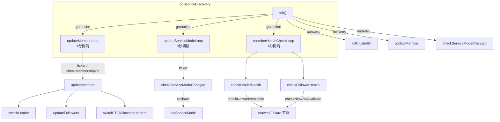
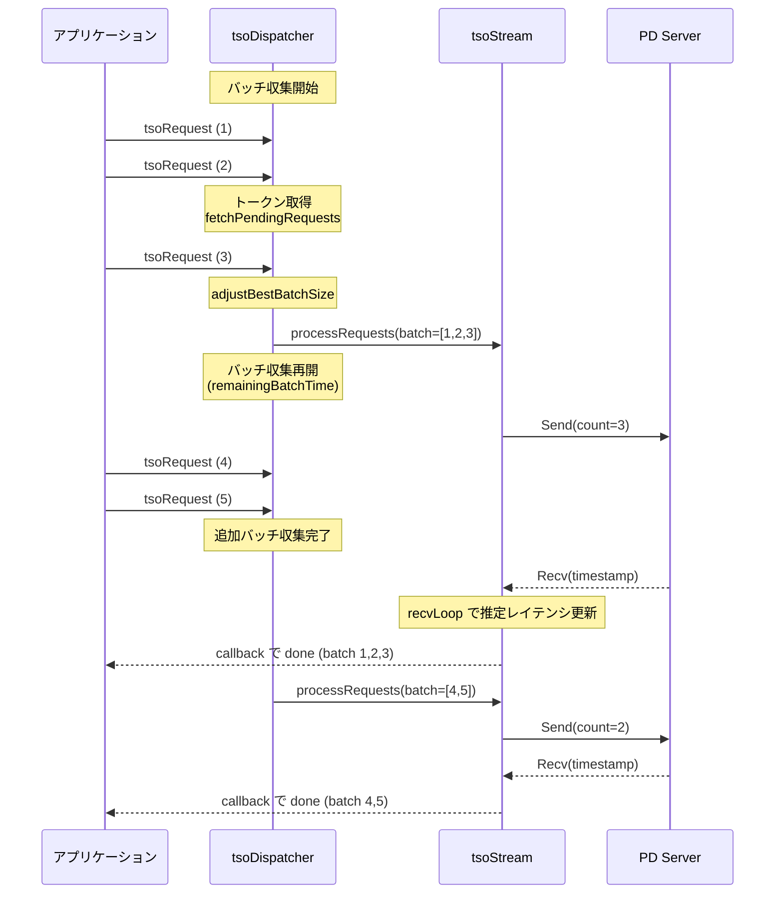
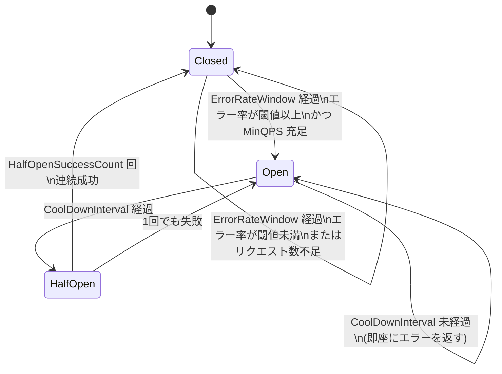

# 第22章 PD Client とサービスディスカバリ

> **本章で読むソース**
>
> - [`client/client.go`](https://github.com/tikv/pd/blob/v8.5.6/client/client.go)
> - [`client/pd_service_discovery.go`](https://github.com/tikv/pd/blob/v8.5.6/client/pd_service_discovery.go)
> - [`client/tso_client.go`](https://github.com/tikv/pd/blob/v8.5.6/client/tso_client.go)
> - [`client/tso_dispatcher.go`](https://github.com/tikv/pd/blob/v8.5.6/client/tso_dispatcher.go)
> - [`client/tso_stream.go`](https://github.com/tikv/pd/blob/v8.5.6/client/tso_stream.go)
> - [`client/tso_batch_controller.go`](https://github.com/tikv/pd/blob/v8.5.6/client/tso_batch_controller.go)
> - [`client/tso_request.go`](https://github.com/tikv/pd/blob/v8.5.6/client/tso_request.go)
> - [`client/circuitbreaker/circuit_breaker.go`](https://github.com/tikv/pd/blob/v8.5.6/client/circuitbreaker/circuit_breaker.go)

## この章の狙い

[第3章](../part00-overview/03-relationship-with-tidb-tikv.md)では、PD Client の外向きインタフェースと接続管理の概要を確認した。
本章では、クライアント内部の実装に踏み込み、サービスモードの切り替え、フォロワーフォワーディング、TSO バッチ処理パイプライン、サーキットブレーカーの各機構を読む。
最適化の工夫として、並行 RPC の推定レイテンシに基づくバッチ収集時間の制御を機構レベルで説明する。

## 前提

[第3章](../part00-overview/03-relationship-with-tidb-tikv.md)で `Client` インタフェースと `pdServiceDiscovery` の概要を読んだ。
[第4章](../part01-tso/04-tso-and-global-allocator.md)で TSO の64ビット表現とサーバー側の採番処理を読んだ。
[第6章](../part01-tso/06-local-tso-and-microservice.md)で TSO マイクロサービスモードの存在を確認した。
本章はこれらの基盤の上で、クライアント側の内部実装を読む。
コード引用は tikv/pd のタグ `v8.5.6` に固定する。

---

## Client インタフェースとサービスモード

### client 構造体の構成

第3章で確認したとおり、`Client` インタフェースの実装体は `client` 構造体である。

[`client/client.go L220-L237`](https://github.com/tikv/pd/blob/v8.5.6/client/client.go#L220-L237)

```go
type client struct {
	keyspaceID      uint32
	svrUrls         []string
	pdSvcDiscovery  *pdServiceDiscovery
	tokenDispatcher *tokenDispatcher

	// For service mode switching.
	serviceModeKeeper

	// For internal usage.
	updateTokenConnectionCh chan struct{}

	ctx    context.Context
	cancel context.CancelFunc
	wg     sync.WaitGroup
	tlsCfg *tls.Config
	option *option
}
```

`pdSvcDiscovery` がサービスディスカバリ、**`serviceModeKeeper`** がサービスモードの切り替えを管理する。
`tokenDispatcher` はリソーストークンの配布を担うが、本章では扱わない。

### serviceModeKeeper の役割

**`serviceModeKeeper`** は、PD が TSO を自ら発行する **`PD_SVC_MODE`** と、独立した TSO マイクロサービスへ委譲する **`API_SVC_MODE`** の切り替えを管理する。

[`client/client.go L198-L218`](https://github.com/tikv/pd/blob/v8.5.6/client/client.go#L198-L218)

```go
type serviceModeKeeper struct {
	sync.RWMutex
	serviceMode     pdpb.ServiceMode
	tsoClient       *tsoClient
	tsoSvcDiscovery ServiceDiscovery
}

func (k *serviceModeKeeper) close() {
	k.Lock()
	defer k.Unlock()
	switch k.serviceMode {
	case pdpb.ServiceMode_API_SVC_MODE:
		k.tsoSvcDiscovery.Close()
		fallthrough
	case pdpb.ServiceMode_PD_SVC_MODE:
		k.tsoClient.close()
	case pdpb.ServiceMode_UNKNOWN_SVC_MODE:
	}
}
```

`tsoClient` が TSO の取得を担い、`tsoSvcDiscovery` は「API_SVC_MODE」時のみ使われる TSO 専用のサービスディスカバリである。
`close` メソッドは「API_SVC_MODE」では `tsoSvcDiscovery` と `tsoClient` の両方を閉じ、「PD_SVC_MODE」では `tsoClient` だけを閉じる。

### setServiceMode と TSO クライアントの再生成

サービスモードの切り替えは `setServiceMode` が入り口となる。

[`client/client.go L526-L547`](https://github.com/tikv/pd/blob/v8.5.6/client/client.go#L526-L547)

```go
func (c *client) setServiceMode(newMode pdpb.ServiceMode) {
	c.Lock()
	defer c.Unlock()

	if c.option.useTSOServerProxy {
		newMode = pdpb.ServiceMode_PD_SVC_MODE
	}

	if newMode == c.serviceMode {
		return
	}
	log.Info("[pd] changing service mode",
		zap.String("old-mode", c.serviceMode.String()),
		zap.String("new-mode", newMode.String()))
	c.resetTSOClientLocked(newMode)
	oldMode := c.serviceMode
	c.serviceMode = newMode
	// ... (中略) ...
}
```

TSO サーバープロキシが有効な場合は常に「PD_SVC_MODE」を使う。
モードが変わった場合、`resetTSOClientLocked` で TSO クライアントを再生成する。

[`client/client.go L550-L594`](https://github.com/tikv/pd/blob/v8.5.6/client/client.go#L550-L594)

```go
func (c *client) resetTSOClientLocked(mode pdpb.ServiceMode) {
	var (
		newTSOCli          *tsoClient
		newTSOSvcDiscovery ServiceDiscovery
	)
	switch mode {
	case pdpb.ServiceMode_PD_SVC_MODE:
		newTSOCli = newTSOClient(c.ctx, c.option,
			c.pdSvcDiscovery, &pdTSOStreamBuilderFactory{})
	case pdpb.ServiceMode_API_SVC_MODE:
		newTSOSvcDiscovery = newTSOServiceDiscovery(
			c.ctx, MetaStorageClient(c), c.pdSvcDiscovery,
			c.keyspaceID, c.tlsCfg, c.option)
		newTSOCli = newTSOClient(c.ctx, c.option,
			newTSOSvcDiscovery, &tsoTSOStreamBuilderFactory{})
		// ... (中略) ...
	}
	newTSOCli.setup()
	oldTSOClient := c.tsoClient
	c.tsoClient = newTSOCli
	oldTSOClient.close()
	// ... (中略) ...
}
```

「PD_SVC_MODE」では `pdTSOStreamBuilderFactory` を使い、PD リーダーへの gRPC ストリームで TSO を取得する。
「API_SVC_MODE」では `tsoTSOStreamBuilderFactory` と専用の `tsoServiceDiscovery` を使い、TSO マイクロサービスに接続する。
新しいクライアントの `setup` を完了してから古いクライアントを閉じることで、切り替え中の TSO 要求の断絶を最小化している。

---

## pdServiceDiscovery の実装

### ServiceDiscovery インタフェース

**`ServiceDiscovery`** は、PD クラスタのメンバー管理と接続管理を抽象化するインタフェースである。

[`client/pd_service_discovery.go L74-L124`](https://github.com/tikv/pd/blob/v8.5.6/client/pd_service_discovery.go#L74-L124)

```go
type ServiceDiscovery interface {
	Init() error
	Close()
	GetClusterID() uint64
	GetKeyspaceID() uint32
	GetKeyspaceGroupID() uint32
	GetServiceURLs() []string
	GetServingEndpointClientConn() *grpc.ClientConn
	GetClientConns() *sync.Map
	GetServingURL() string
	GetBackupURLs() []string
	GetServiceClient() ServiceClient
	GetAllServiceClients() []ServiceClient
	GetOrCreateGRPCConn(url string) (*grpc.ClientConn, error)
	ScheduleCheckMemberChanged()
	CheckMemberChanged() error
	AddServingURLSwitchedCallback(callbacks ...func())
	AddServiceURLsSwitchedCallback(callbacks ...func())
}
```

`GetServiceClient` がリーダーの「ServiceClient」を返し、リーダーが利用不可の場合はフォワーディング可能なフォロワーを返す。
`ScheduleCheckMemberChanged` はメンバー変更の確認を非同期にスケジュールし、`CheckMemberChanged` は同期的に確認する。

### pdServiceDiscovery の構造体

「pdServiceDiscovery」の構造体は第3章で確認した[^ch3]。
主要なフィールドを改めて示す。

[^ch3]: [第3章](../part00-overview/03-relationship-with-tidb-tikv.md)の「サービスディスカバリ」節を参照。

[`client/pd_service_discovery.go L404-L449`](https://github.com/tikv/pd/blob/v8.5.6/client/pd_service_discovery.go#L404-L449)

```go
type pdServiceDiscovery struct {
	isInitialized bool

	urls atomic.Value // Store as []string
	leader atomic.Value // Store as pdServiceClient
	followers sync.Map // Store as map[string]pdServiceClient
	all               atomic.Value // Store as []pdServiceClient
	apiCandidateNodes [apiKindCount]*pdServiceBalancer
	followerURLs atomic.Value // Store as []string

	clusterID uint64
	clientConns sync.Map // Store as map[string]*grpc.ClientConn

	serviceModeUpdateCb func(pdpb.ServiceMode)
	leaderSwitchedCbs []func()
	membersChangedCbs []func()
	// ... (中略) ...
	checkMembershipCh chan struct{}
	// ... (中略) ...
}
```

`leader` はリーダーの「ServiceClient」を `atomic.Value` で保持し、ロックなしで読み取れる。
`followers` はフォロワーを `sync.Map` で管理する。
**`apiCandidateNodes`** は API の種類ごとにフォロワーをラウンドロビンで選択する「pdServiceBalancer」の配列である。
`checkMembershipCh` は `ScheduleCheckMemberChanged` がメンバー更新をトリガするためのチャネルである。

### Init の処理フロー

`Init` メソッドは、クラスタ ID の取得、メンバー情報の更新、サービスモードの確認を順に行い、3つのバックグラウンドゴルーチンを起動する。

[`client/pd_service_discovery.go L486-L522`](https://github.com/tikv/pd/blob/v8.5.6/client/pd_service_discovery.go#L486-L522)

```go
func (c *pdServiceDiscovery) Init() error {
	if c.isInitialized {
		return nil
	}

	if err := c.initRetry(c.initClusterID); err != nil {
		c.cancel()
		return err
	}
	if err := c.initRetry(c.updateMember); err != nil {
		c.cancel()
		return err
	}
	log.Info("[pd] init cluster id", zap.Uint64("cluster-id", c.clusterID))
	// ... (中略) ...
	if err := c.initRetry(c.checkServiceModeChanged); err != nil {
		c.cancel()
		return err
	}

	c.wg.Add(3)
	go c.updateMemberLoop()
	go c.updateServiceModeLoop()
	go c.memberHealthCheckLoop()

	c.isInitialized = true
	return nil
}
```

`initRetry` は各初期化ステップを `maxRetryTimes` 回まで1秒間隔でリトライする。
初期化の順序には依存関係がある。
`initClusterID` でクラスタ ID を確定させたあとでなければ、`updateMember` のレスポンス検証でクラスタ ID の一致を確認できない。
`updateMember` でリーダーを発見したあとでなければ、`checkServiceModeChanged` でリーダーにサービスモードを問い合わせることができない。

### updateMemberLoop によるメンバー情報の定期更新

**`updateMemberLoop`** は1分間隔（`memberUpdateInterval`）でメンバー情報を更新するバックグラウンドゴルーチンである。

[`client/pd_service_discovery.go L541-L565`](https://github.com/tikv/pd/blob/v8.5.6/client/pd_service_discovery.go#L541-L565)

```go
func (c *pdServiceDiscovery) updateMemberLoop() {
	defer c.wg.Done()

	ctx, cancel := context.WithCancel(c.ctx)
	defer cancel()
	ticker := time.NewTicker(memberUpdateInterval)
	defer ticker.Stop()

	bo := retry.InitialBackoffer(updateMemberBackOffBaseTime, updateMemberMaxBackoffTime, updateMemberTimeout)
	for {
		select {
		case <-ctx.Done():
			log.Info("[pd] exit member loop due to context canceled")
			return
		case <-ticker.C:
		case <-c.checkMembershipCh:
		}
		// ... (中略) ...
		if err := bo.Exec(ctx, c.updateMember); err != nil {
			log.Warn("[pd] failed to update member",
				zap.Strings("urls", c.GetServiceURLs()), errs.ZapError(err))
		}
	}
}
```

更新はタイマーによる定期実行に加えて、`checkMembershipCh` を通じたオンデマンドのトリガにも対応する。
`ScheduleCheckMemberChanged` がこのチャネルにシグナルを送ることで、RPC エラー発生時に即座にメンバー更新を起動できる。
`retry.Backoffer` は更新失敗時に指数バックオフを適用し、PD への過剰なリクエストを防ぐ。
初期バックオフは20ミリ秒（`updateMemberBackOffBaseTime`）、上限は100ミリ秒（`updateMemberMaxBackoffTime`）、全体のタイムアウトは1秒（`updateMemberTimeout`）である。

### updateMember によるリーダーの発見と切り替え

`updateMember` は既知の全 PD URL を順に試し、`GetMembers` RPC でメンバー一覧を取得する。
この処理は第3章で読んだため、ここでは要点だけ述べる[^update-member]。

[^update-member]: [第3章](../part00-overview/03-relationship-with-tidb-tikv.md)のコード引用 `pd_service_discovery.go L893-L939` を参照。

`GetMembers` の応答にはリーダーの URL が含まれる。
クラスタ ID の一致を検証したあと、`updateServiceClient` が `switchLeader` と `updateFollowers` を呼び出す。
`switchLeader` はリーダーの URL が変わった場合に gRPC 接続を取得し、`leader` フィールドを `atomic.Value` で更新する。
切り替え完了後、TSO アロケータリーダーの更新コールバックとリーダー切り替えコールバックを順に実行する。

### memberHealthCheckLoop による死活確認

**`memberHealthCheckLoop`** は1秒ごとにリーダーとフォロワーの死活を確認する。

[`client/pd_service_discovery.go L596-L614`](https://github.com/tikv/pd/blob/v8.5.6/client/pd_service_discovery.go#L596-L614)

```go
func (c *pdServiceDiscovery) memberHealthCheckLoop() {
	defer c.wg.Done()

	memberCheckLoopCtx, memberCheckLoopCancel := context.WithCancel(c.ctx)
	defer memberCheckLoopCancel()

	ticker := time.NewTicker(MemberHealthCheckInterval)
	defer ticker.Stop()

	for {
		select {
		case <-c.ctx.Done():
			return
		case <-ticker.C:
			c.checkLeaderHealth(memberCheckLoopCtx)
			c.checkFollowerHealth(memberCheckLoopCtx)
		}
	}
}
```

`checkLeaderHealth` と `checkFollowerHealth` はそれぞれ gRPC の Health Check プロトコルを使い、ノードの到達可能性を確認する。

[`client/pd_service_discovery.go L616-L635`](https://github.com/tikv/pd/blob/v8.5.6/client/pd_service_discovery.go#L616-L635)

```go
func (c *pdServiceDiscovery) checkLeaderHealth(ctx context.Context) {
	ctx, cancel := context.WithTimeout(ctx, c.option.timeout)
	defer cancel()
	leader := c.getLeaderServiceClient()
	leader.checkNetworkAvailable(ctx)
}

func (c *pdServiceDiscovery) checkFollowerHealth(ctx context.Context) {
	c.followers.Range(func(_, value any) bool {
		ctx, cancel := context.WithTimeout(ctx, MemberHealthCheckInterval/3)
		defer cancel()
		serviceClient := value.(*pdServiceClient)
		serviceClient.checkNetworkAvailable(ctx)
		return true
	})
	for _, balancer := range c.apiCandidateNodes {
		balancer.check()
	}
}
```

リーダーのヘルスチェックはクライアント全体のタイムアウト設定を使う。
フォロワーのヘルスチェックはリーダーの確認を遅延させないよう、`MemberHealthCheckInterval` の3分の1でタイムアウトする。
確認後、`apiCandidateNodes` の各バランサに `check` を呼んで利用可能フラグを更新する。



---

## ServiceClient とフォロワーフォワーディング

### pdServiceClient 構造体

**`pdServiceClient`** は、個々の PD ノードへの gRPC 接続を保持する「ServiceClient」の実装である。

[`client/pd_service_discovery.go L151-L158`](https://github.com/tikv/pd/blob/v8.5.6/client/pd_service_discovery.go#L151-L158)

```go
type pdServiceClient struct {
	url       string
	conn      *grpc.ClientConn
	isLeader  bool
	leaderURL string

	networkFailure atomic.Bool
}
```

`isLeader` は自身がリーダーかどうかを示す。
`leaderURL` はフォロワーの場合にリーダーの URL を保持し、フォワーディング先の特定に使う。
**`networkFailure`** はヘルスチェックの結果を `atomic.Bool` で保持し、ロックなしで参照できる。

### ネットワーク可用性の確認

`Available` メソッドは `networkFailure` が `false` の場合に `true` を返す。

[`client/pd_service_discovery.go L204-L209`](https://github.com/tikv/pd/blob/v8.5.6/client/pd_service_discovery.go#L204-L209)

```go
func (c *pdServiceClient) Available() bool {
	if c == nil {
		return false
	}
	return !c.networkFailure.Load()
}
```

ヘルスチェックの結果は `checkNetworkAvailable` が更新する。

[`client/pd_service_discovery.go L211-L229`](https://github.com/tikv/pd/blob/v8.5.6/client/pd_service_discovery.go#L211-L229)

```go
func (c *pdServiceClient) checkNetworkAvailable(ctx context.Context) {
	if c == nil || c.conn == nil {
		return
	}
	healthCli := healthpb.NewHealthClient(c.conn)
	resp, err := healthCli.Check(ctx, &healthpb.HealthCheckRequest{Service: ""})
	// ... (中略) ...
	rpcErr, ok := status.FromError(err)
	if (ok && isNetworkError(rpcErr.Code())) || resp.GetStatus() != healthpb.HealthCheckResponse_SERVING {
		c.networkFailure.Store(true)
	} else {
		c.networkFailure.Store(false)
	}
}
```

gRPC の Health Check プロトコルでノードの状態を確認し、ネットワークエラーまたは非 SERVING 状態であれば `networkFailure` を `true` に設定する。

### BuildGRPCTargetContext によるフォワーディング

フォロワーの「pdServiceClient」は、リーダーへのフォワーディング用コンテキストを生成できる。

[`client/pd_service_discovery.go L185-L193`](https://github.com/tikv/pd/blob/v8.5.6/client/pd_service_discovery.go#L185-L193)

```go
func (c *pdServiceClient) BuildGRPCTargetContext(ctx context.Context, toLeader bool) context.Context {
	if c == nil || c.isLeader {
		return ctx
	}
	if toLeader {
		return grpcutil.BuildForwardContext(ctx, c.leaderURL)
	}
	return grpcutil.BuildFollowerHandleContext(ctx)
}
```

自身がリーダーの場合はコンテキストをそのまま返す。
フォロワーの場合、`toLeader` が `true` なら `ForwardContext` にリーダーの URL を付与し、PD フォロワーがリクエストをリーダーへ転送する。
`toLeader` が `false` なら `FollowerHandleContext` を設定し、フォロワー自身がリクエストを処理する（Region 読み取りなど）。

### GetServiceClient によるフォールバック

`GetServiceClient` はリーダーの「ServiceClient」を返すが、リーダーの `Available` が `false` でフォワーディングが有効な場合、フォロワーにフォールバックする。

[`client/pd_service_discovery.go L752-L764`](https://github.com/tikv/pd/blob/v8.5.6/client/pd_service_discovery.go#L752-L764)

```go
func (c *pdServiceDiscovery) GetServiceClient() ServiceClient {
	leaderClient := c.getLeaderServiceClient()
	if c.option.enableForwarding && !leaderClient.Available() {
		if followerClient := c.getServiceClientByKind(forwardAPIKind); followerClient != nil {
			log.Debug("[pd] use follower client", zap.String("url", followerClient.GetURL()))
			return followerClient
		}
	}
	if leaderClient == nil {
		return nil
	}
	return leaderClient
}
```

`enableForwarding` が有効かつリーダーが利用不可のとき、`getServiceClientByKind` でフォワーディング用バランサからフォロワーを取得する。
フォロワーも利用不可であればリーダーをそのまま返し、呼び出し元でエラーを処理させる。

### pdServiceBalancer によるラウンドロビン

**`pdServiceBalancer`** はフォロワーを循環リストで管理し、ラウンドロビンで選択するロードバランサである。

[`client/pd_service_discovery.go L311-L324`](https://github.com/tikv/pd/blob/v8.5.6/client/pd_service_discovery.go#L311-L324)

```go
type pdServiceBalancer struct {
	mu        sync.Mutex
	now       *pdServiceBalancerNode
	totalNode int
	errFn     errFn
}
```

`set` メソッドはクライアントの配列から循環リストを構築する。

[`client/pd_service_discovery.go L332-L353`](https://github.com/tikv/pd/blob/v8.5.6/client/pd_service_discovery.go#L332-L353)

```go
func (c *pdServiceBalancer) set(clients []ServiceClient) {
	c.mu.Lock()
	defer c.mu.Unlock()
	if len(clients) == 0 {
		return
	}
	c.totalNode = len(clients)
	head := &pdServiceBalancerNode{
		pdServiceAPIClient: newPDServiceAPIClient(clients[c.totalNode-1], c.errFn).(*pdServiceAPIClient),
	}
	head.next = head
	last := head
	for i := c.totalNode - 2; i >= 0; i-- {
		next := &pdServiceBalancerNode{
			pdServiceAPIClient: newPDServiceAPIClient(clients[i], c.errFn).(*pdServiceAPIClient),
			next:               head,
		}
		head = next
		last.next = head
	}
	c.now = head
}
```

配列の末尾から順にノードを作成し、`next` ポインタで循環リストを形成する。
`get` メソッドは `now` の位置から順に `Available` なノードを探し、見つかったノードを返してポインタを次へ進める。

[`client/pd_service_discovery.go L368-L384`](https://github.com/tikv/pd/blob/v8.5.6/client/pd_service_discovery.go#L368-L384)

```go
func (c *pdServiceBalancer) get() (ret ServiceClient) {
	c.mu.Lock()
	defer c.mu.Unlock()
	i := 0
	if c.now == nil {
		return nil
	}
	for ; i < c.totalNode; i++ {
		if c.now.Available() {
			ret = c.now
			c.next()
			return
		}
		c.next()
	}
	return
}
```

全ノードを巡回しても `Available` なノードがなければ `nil` を返す。
この仕組みにより、ヘルスチェックで「networkFailure」が `true` になったフォロワーは自動的にスキップされる。

---

## TSO クライアントのバッチ処理パイプライン

### tsoClient の構造

**`tsoClient`** は TSO の取得を担うクライアントであり、DC ロケーションごとに「tsoDispatcher」を管理する。

[`client/tso_client.go L62-L83`](https://github.com/tikv/pd/blob/v8.5.6/client/tso_client.go#L62-L83)

```go
type tsoClient struct {
	ctx    context.Context
	cancel context.CancelFunc
	wg     sync.WaitGroup
	option *option

	svcDiscovery ServiceDiscovery
	tsoStreamBuilderFactory
	tsoAllocators sync.Map // Store as map[string]string
	tsoAllocServingURLSwitchedCallback []func()
	// ... (中略) ...
}
```

`tsoStreamBuilderFactory` がサービスモードに応じた gRPC ストリームの生成方法を決定する。
「tsoClient」のコンストラクタは **`tsoReqPool`**（`sync.Pool`）を初期化し、`tsoRequest` オブジェクトの割り当てを使い回すことで GC 圧力を低減する。

### dispatchRequest によるリクエストの投入

`GetTS` の呼び出しは `GetTSAsync` から `dispatchTSORequestWithRetry` を経て `dispatchRequest` に至る。
第3章で確認した `dispatchTSORequestWithRetry` がリトライ制御を担い、最終的に `dispatchRequest` が「tsoDispatcher」のチャネルにリクエストを投入する。

[`client/tso_client.go L659-L698`](https://github.com/tikv/pd/blob/v8.5.6/client/tso_client.go#L659-L698)

```go
func (c *tsoClient) dispatchRequest(request *tsoRequest) (bool, error) {
	dispatcher, ok := c.getTSODispatcher(request.dcLocation)
	if !ok {
		err := errs.ErrClientGetTSO.FastGenByArgs(fmt.Sprintf(
			"unknown dc-location %s to the client", request.dcLocation))
		// ... (中略) ...
		return true, err
	}
	// ... (中略) ...
	select {
	case <-request.requestCtx.Done():
		return false, request.requestCtx.Err()
	case <-request.clientCtx.Done():
		return false, request.clientCtx.Err()
	case <-c.ctx.Done():
		return true, c.ctx.Err()
	default:
		dispatcher.push(request)
	}
	// ... (中略) ...
	return false, nil
}
```

`default` 分岐で `dispatcher.push` を呼び、リクエストをディスパッチャのチャネルに非同期で投入する。
`c.ctx.Done()` の場合だけ `retryable = true` を返す。
TSO クライアントがサービスモード切り替えで閉じられた場合、新しいクライアントでリトライできるためである。

### tsoDispatcher のメインループ

**`tsoDispatcher`** は TSO リクエストのバッチ処理を行うゴルーチンである。

[`client/tso_dispatcher.go L77-L101`](https://github.com/tikv/pd/blob/v8.5.6/client/tso_dispatcher.go#L77-L101)

```go
type tsoDispatcher struct {
	ctx    context.Context
	cancel context.CancelFunc
	dc     string

	provider tsoServiceProvider
	connectionCtxs *sync.Map
	tsoRequestCh   chan *tsoRequest
	tsDeadlineCh   chan *deadline
	latestTSOInfo  atomic.Pointer[tsoInfo]
	batchBufferPool *sync.Pool

	tokenCh                  chan struct{}
	lastCheckConcurrencyTime time.Time
	tokenCount               int
	rpcConcurrency           int

	updateConnectionCtxsCh chan struct{}
}
```

**`tsoRequestCh`** がリクエストの入力チャネルである。
**`tokenCh`** はセマフォの役割を果たし、同時に処理する RPC 数を制御する。
**`batchBufferPool`** は `tsoBatchController` オブジェクトを `sync.Pool` で使い回すためのプールである。

メインループ `handleDispatcher`（[`client/tso_dispatcher.go L187-L424`](https://github.com/tikv/pd/blob/v8.5.6/client/tso_dispatcher.go#L187-L424)）の処理は次の流れで進む。

1. `fetchPendingRequests` でチャネルからリクエストをバッチ収集する
2. `adjustBestBatchSize` で動的にバッチサイズを最適化する
3. `chooseStream` で送信先の gRPC ストリームを選択する
4. 並行 RPC が有効な場合、追加のバッチ収集時間を設ける
5. `processRequests` でバッチを送信する

### fetchPendingRequests によるバッチ収集

**`tsoBatchController`** がバッチ収集のロジックを担う。

[`client/tso_batch_controller.go L26-L45`](https://github.com/tikv/pd/blob/v8.5.6/client/tso_batch_controller.go#L26-L45)

```go
type tsoBatchController struct {
	maxBatchSize int
	bestBatchSize int

	collectedRequests     []*tsoRequest
	collectedRequestCount int

	extraBatchingStartTime time.Time
}

func newTSOBatchController(maxBatchSize int) *tsoBatchController {
	return &tsoBatchController{
		maxBatchSize:  maxBatchSize,
		bestBatchSize: 8,
		collectedRequests:     make([]*tsoRequest, maxBatchSize+1),
		collectedRequestCount: 0,
	}
}
```

**`bestBatchSize`** は初期値8から動的に調整される目標バッチサイズである。

`fetchPendingRequests` はトークンと先頭リクエストの両方が揃うのを待ち、その後に追加のバッチ収集を行う。

[`client/tso_batch_controller.go L51-L104`](https://github.com/tikv/pd/blob/v8.5.6/client/tso_batch_controller.go#L51-L104)

```go
func (tbc *tsoBatchController) fetchPendingRequests(ctx context.Context,
	tsoRequestCh <-chan *tsoRequest, tokenCh chan struct{},
	maxBatchWaitInterval time.Duration) (errRet error) {
	var tokenAcquired bool
	defer func() {
		if errRet != nil {
			if tokenAcquired {
				tokenCh <- struct{}{}
			}
			tbc.finishCollectedRequests(0, 0, 0, invalidStreamID, errRet)
		}
	}()

	tbc.collectedRequestCount = 0
	for {
		// ... (中略) ...
		select {
		case <-ctx.Done():
			return ctx.Err()
		case req := <-tsoRequestCh:
			tbc.pushRequest(req)
			continue
		case <-tokenCh:
			tokenAcquired = true
		}

		if tbc.collectedRequestCount == 0 {
			select {
			case <-ctx.Done():
				return ctx.Err()
			case firstRequest := <-tsoRequestCh:
				tbc.pushRequest(firstRequest)
			}
		}

		break
	}
	// ... (中略) ...
}
```

まずトークンとリクエストの到着を並行で待つ。
トークンが先に到着した場合、先頭リクエストの到着まで追加で待つ。
リクエストが先に到着した場合、トークンの到着まで後続リクエストの収集を続ける。

両方が揃ったあと、非ブロッキングでチャネルからリクエストを取り出し、さらに「bestBatchSize」まで `maxBatchWaitInterval`（既定1ミリ秒）だけ待機して追加収集を行う。

### adjustBestBatchSize による動的バッチサイズ調整

[`client/tso_batch_controller.go L201-L212`](https://github.com/tikv/pd/blob/v8.5.6/client/tso_batch_controller.go#L201-L212)

```go
func (tbc *tsoBatchController) adjustBestBatchSize() {
	metrics.TSOBestBatchSize.Observe(float64(tbc.bestBatchSize))
	length := tbc.collectedRequestCount
	if length < tbc.bestBatchSize && tbc.bestBatchSize > 1 {
		tbc.bestBatchSize--
	} else if length > tbc.bestBatchSize+4 &&
		tbc.bestBatchSize < tbc.maxBatchSize {
		tbc.bestBatchSize++
	}
}
```

AIAD（Additive Increase, Adaptive Decrease）アルゴリズムで「bestBatchSize」を調整する。
収集数が「bestBatchSize」に満たない場合、待機時間が長すぎるため「bestBatchSize」を1減らす。
収集数が「bestBatchSize」+ 4 を超えた場合、まだ余裕があるため「bestBatchSize」を1増やす。
マージン4を設けることで、一時的な負荷の揺らぎによる振動を抑制している。

### chooseStream によるストリーム選択

[`client/tso_dispatcher.go L528-L539`](https://github.com/tikv/pd/blob/v8.5.6/client/tso_dispatcher.go#L528-L539)

```go
func chooseStream(connectionCtxs *sync.Map) (connectionCtx *tsoConnectionContext) {
	idx := 0
	connectionCtxs.Range(func(_, cc any) bool {
		j := rand.Intn(idx + 1)
		if j < 1 {
			connectionCtx = cc.(*tsoConnectionContext)
		}
		idx++
		return true
	})
	return connectionCtx
}
```

リザーバサンプリングで `sync.Map` 内の接続からランダムに1つを選択する。
TSO フォロワープロキシが無効の場合は接続が1つだけなので、実質的にその接続が常に選ばれる。
フォロワープロキシが有効な場合は複数の接続が存在し、ランダム選択で負荷を分散する。

### tsoStream と非同期送受信

**`tsoStream`** は gRPC ストリーム上で TSO リクエストの送信と受信を非同期化する。

[`client/tso_stream.go L202-L224`](https://github.com/tikv/pd/blob/v8.5.6/client/tso_stream.go#L202-L224)

```go
type tsoStream struct {
	serverURL string
	stream grpcTSOStreamAdapter
	streamID string

	pendingRequests chan batchedRequests

	cancel context.CancelFunc
	wg     sync.WaitGroup

	state          atomic.Int32
	stoppedWithErr atomic.Pointer[error]

	estimatedLatencyMicros atomic.Uint64

	ongoingRequestCountGauge prometheus.Gauge
	ongoingRequests          atomic.Int32
}
```

**`pendingRequests`** は送信済みだが応答待ちのリクエストバッチを保持するチャネルである（容量64）。
`processRequests`（[`client/tso_stream.go L271-L322`](https://github.com/tikv/pd/blob/v8.5.6/client/tso_stream.go#L271-L322)）が Send を行い、バッチ情報を `pendingRequests` に投入する。
別ゴルーチンの `recvLoop` が Recv でレスポンスを受け取り、`pendingRequests` から対応するバッチを取り出してコールバックを呼ぶ。

**`estimatedLatencyMicros`** は後述する並行 RPC の最適化で参照される推定レイテンシである。

`recvLoop`（[`client/tso_stream.go L324-L400`](https://github.com/tikv/pd/blob/v8.5.6/client/tso_stream.go#L324-L400)）はレスポンスのレイテンシを低域フィルタ（RC フィルタ）で平滑化し、「estimatedLatencyMicros」を更新する。

```go
	const (
		filterCutoffFreq                float64 = 1.0
		filterNewSampleWeightUpperbound float64 = 0.2
	)
	filter := newRCFilter(filterCutoffFreq, filterNewSampleWeightUpperbound)

	updateEstimatedLatency := func(sampleTime time.Time, latency time.Duration) {
		if latency < 0 {
			return
		}
		currentSample := math.Log(float64(latency.Microseconds()))
		filteredValue := filter.update(sampleTime, currentSample)
		micros := math.Exp(filteredValue)
		s.estimatedLatencyMicros.Store(uint64(micros))
	}
```

レイテンシの対数を取ってからフィルタを適用し、結果を指数関数で戻す。
レイテンシの分布は右に裾が長いため、対数空間でフィルタリングすることで外れ値の影響を抑えている。

---

## 並行 RPC と推定レイテンシによるバッチ収集の最適化

`handleDispatcher` のメインループには、RPC のレイテンシを活用してバッチ処理のスループットを向上させる仕組みがある。

### tokenCh によるセマフォ制御

「tokenCh」はバッファ付きチャネルで、セマフォとして機能する。
バッチの送信前にトークンを取得し、レスポンスの受信後にトークンを返却する。
`rpcConcurrency` の設定値に応じてトークン数を調整し、同時に処理する RPC の本数を制御する。

### 推定レイテンシに基づく追加バッチ収集

並行 RPC が有効な場合、`handleDispatcher` はストリーム選択後にバッチ収集を続ける区間を設ける。
`handleDispatcher`（[`client/tso_dispatcher.go L187-L424`](https://github.com/tikv/pd/blob/v8.5.6/client/tso_dispatcher.go#L187-L424)）から該当部分を抜粋する。

```go
		if td.isConcurrentRPCEnabled() {
			estimatedLatency := stream.EstimatedRPCLatency()
			goalBatchTime := estimatedLatency / time.Duration(td.rpcConcurrency)
			// ... (中略) ...
			waitTimerStart := time.Now()
			remainingBatchTime := goalBatchTime - waitTimerStart.Sub(currentBatchStartTime)
			if remainingBatchTime > 0 && !noDelay {
				// ... (中略) ...
				batchingTimer.Reset(remainingBatchTime)
				err = batchController.fetchRequestsWithTimer(ctx, td.tsoRequestCh, batchingTimer)
				// ... (中略) ...
			}
		}
```

追加収集時間の目標は `estimatedLatency / rpcConcurrency` である。
たとえば推定レイテンシが10ミリ秒で並行度が2の場合、目標バッチ時間は5ミリ秒になる。
最初のバッチ収集開始からの経過時間を差し引いた残り時間だけ、追加のリクエスト収集を行う。

この設計の効果を図示する。



RPC の応答を待つあいだに次のバッチを準備することで、パイプライン化を実現する。
推定レイテンシが大きいほど追加収集時間が長くなり、バッチが大きくなる。
RPC 1回あたりのリクエスト数が増えるため、RPC のオーバーヘッドをリクエスト間で償却し、スループットが向上する。
「tsoReqPool」と「batchBufferPool」の `sync.Pool` がオブジェクト割り当てのコストを抑え、高スループット時の GC 圧力を低減する。

---

## サーキットブレーカー

### CircuitBreaker の構造と設定

**`CircuitBreaker`** は、障害が続くサービスへのリクエストを一時的に遮断し、回復を待つための仕組みである。

[`client/circuitbreaker/circuit_breaker.go L43-L54`](https://github.com/tikv/pd/blob/v8.5.6/client/circuitbreaker/circuit_breaker.go#L43-L54)

```go
type Settings struct {
	ErrorRateThresholdPct uint32
	MinQPSForOpen         uint32
	ErrorRateWindow       time.Duration
	CoolDownInterval      time.Duration
	HalfOpenSuccessCount  uint32
}
```

[`client/circuitbreaker/circuit_breaker.go L66-L77`](https://github.com/tikv/pd/blob/v8.5.6/client/circuitbreaker/circuit_breaker.go#L66-L77)

```go
type CircuitBreaker struct {
	config *Settings
	name   string

	sync.RWMutex
	state *State

	successCounter  prometheus.Counter
	errorCounter    prometheus.Counter
	overloadCounter prometheus.Counter
	fastFailCounter prometheus.Counter
}
```

**`ErrorRateThresholdPct`** はサーキットブレーカーをトリップさせるエラー率の閾値（パーセント）である。
**`ErrorRateWindow`** はエラー率を評価する時間窓であり、**`MinQPSForOpen`** はこの窓内で最低限必要な QPS を定める。
**`CoolDownInterval`** は Open 状態の持続時間、**`HalfOpenSuccessCount`** は HalfOpen から Closed へ遷移するために必要な連続成功回数である。

### Execute メソッド

[`client/circuitbreaker/circuit_breaker.go L146-L166`](https://github.com/tikv/pd/blob/v8.5.6/client/circuitbreaker/circuit_breaker.go#L146-L166)

```go
func (cb *CircuitBreaker) Execute(call func() (Overloading, error)) error {
	state, err := cb.onRequest()
	if err != nil {
		cb.fastFailCounter.Inc()
		return err
	}

	defer func() {
		e := recover()
		if e != nil {
			cb.emitMetric(Yes, err)
			cb.onResult(state, Yes)
			panic(e)
		}
	}()

	overloaded, err := call()
	cb.emitMetric(overloaded, err)
	cb.onResult(state, overloaded)
	return err
}
```

`Execute` は関数をラップして呼び出す。
呼び出し前に `onRequest` で状態遷移を評価し、Open 状態であればリクエストを実行せずエラーを返す（fast-fail）。
呼び出し後は `onResult` で成功か過負荷かを記録する。
パニックが発生した場合もエラーとして記録したあとでパニックを再送出する。

### 状態遷移

「CircuitBreaker」は3つの状態を持つ。



**Closed** 状態ではすべてのリクエストを通過させ、`ErrorRateWindow` が経過するとエラー率を評価する。
エラー率が「ErrorRateThresholdPct」以上で、かつリクエスト数が「MinQPSForOpen」 x 「ErrorRateWindow」の秒数以上であれば、**Open** 状態に遷移する。

「Open」状態ではすべてのリクエストを即座に `ErrCircuitBreakerOpen` で拒否する。
`CoolDownInterval` が経過すると **HalfOpen** 状態に遷移する。

「HalfOpen」状態では少数のプローブリクエストを通過させる。
「HalfOpenSuccessCount」回連続で成功すれば「Closed」に戻る。
1回でも失敗すれば再び「Open」に戻り、クールダウンを待つ。

[`client/circuitbreaker/circuit_breaker.go L243-L313`](https://github.com/tikv/pd/blob/v8.5.6/client/circuitbreaker/circuit_breaker.go#L243-L313)

```go
func (s *State) onRequest(cb *CircuitBreaker) (*State, error) {
	var now = time.Now()
	switch s.stateType {
	case StateClosed:
		if now.After(s.end) {
			if s.cb.config.ErrorRateThresholdPct > 0 {
				total := s.failureCount + s.successCount
				if total > 0 {
					observedErrorRatePct := s.failureCount * 100 / total
					if total >= uint32(s.cb.config.ErrorRateWindow.Seconds())*s.cb.config.MinQPSForOpen &&
						observedErrorRatePct >= s.cb.config.ErrorRateThresholdPct {
						return cb.newState(now, StateOpen), errs.ErrCircuitBreakerOpen
					}
				}
			}
			return cb.newState(now, StateClosed), nil
		}
		return s, nil
	case StateOpen:
		// ... (中略) ...
		if now.After(s.end) {
			return cb.newState(now, StateHalfOpen), nil
		} else {
			return s, errs.ErrCircuitBreakerOpen
		}
	case StateHalfOpen:
		// ... (中略) ...
		if s.failureCount > 0 {
			return cb.newState(now, StateOpen), errs.ErrCircuitBreakerOpen
		} else if s.successCount == s.cb.config.HalfOpenSuccessCount {
			return cb.newState(now, StateClosed), nil
		} else if s.pendingCount < s.cb.config.HalfOpenSuccessCount {
			s.pendingCount++
			return s, nil
		} else {
			return s, errs.ErrCircuitBreakerOpen
		}
	}
	// ... (中略) ...
}
```

すべての状態遷移は `onRequest` の中で起きる。
時間の経過やリクエスト結果の蓄積を評価するタイミングが、次のリクエストが来た瞬間に統一されている。
この設計により、バックグラウンドタイマーを持たずに状態遷移を実現でき、実装がシンプルに保たれる。

---

## まとめ

PD Client は `client` 構造体を中心に、サービスディスカバリ、サービスモード管理、TSO バッチ処理の3層で構成される。

「pdServiceDiscovery」は3つのバックグラウンドゴルーチン（メンバー更新、サービスモード確認、ヘルスチェック）でクラスタの変化を追跡する。
リーダーが利用不可の場合、「pdServiceBalancer」がラウンドロビンでフォロワーを選び、gRPC コンテキストにフォワーディング情報を付与してリーダーへ転送する。

TSO のバッチ処理パイプラインは、「tsoDispatcher」がチャネルからリクエストを収集し、「tsoStream」の非同期送受信でパイプライン化する。
並行 RPC が有効な場合、推定レイテンシを `rpcConcurrency` で割った時間だけ追加バッチ収集を行い、RPC の応答待ち時間中に次のバッチを準備する。
「tsoBatchController」の AIAD アルゴリズムが目標バッチサイズを動的に調整し、「tsoReqPool」と「batchBufferPool」の `sync.Pool` がオブジェクト割り当てのコストを抑える。

「CircuitBreaker」はリクエスト評価時に状態遷移を行う設計により、バックグラウンドタイマーなしで Closed、Open、HalfOpen の3状態を管理する。

## 関連する章

- [第3章 TiDB、TiKV との関係](../part00-overview/03-relationship-with-tidb-tikv.md): PD Client の外向きインタフェースと gRPC ハンドラの処理
- [第4章 TSO の仕組みと GlobalAllocator](../part01-tso/04-tso-and-global-allocator.md): サーバー側の TSO 採番処理
- [第6章 Local TSO とマイクロサービス化](../part01-tso/06-local-tso-and-microservice.md): TSO マイクロサービスモードの設計
- [第19章 etcd とリーダー選出](19-etcd-and-leader-election.md): PD リーダーの選出とサービスディスカバリの前提
- [第21章 マイクロサービスアーキテクチャ](21-microservice.md): API_SVC_MODE の全体像
