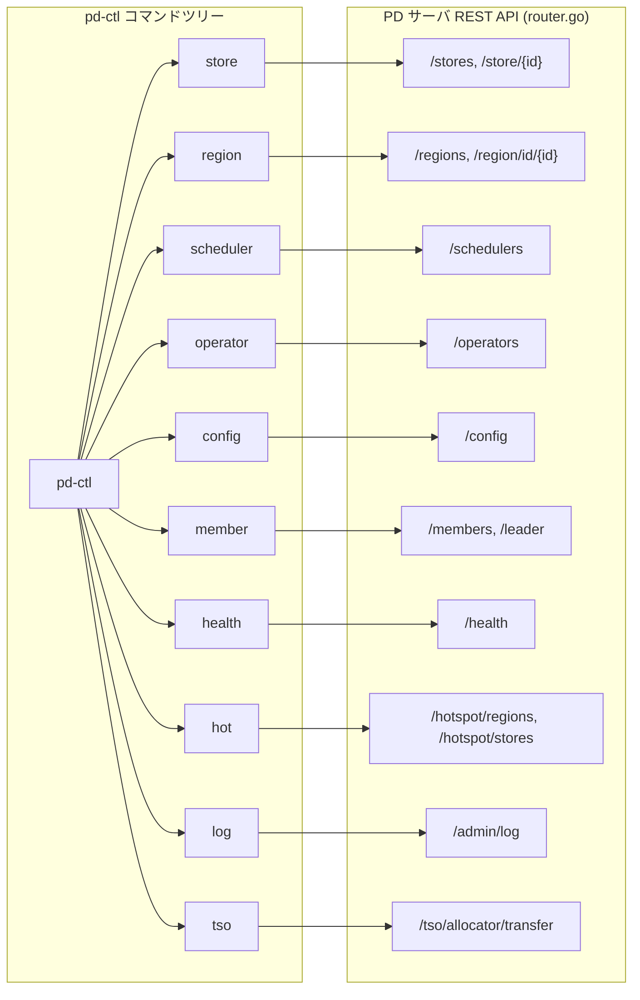

# 第23章 pd-ctl と運用

> **本章で読むソース**
>
> - [`tools/pd-ctl/main.go`](https://github.com/tikv/pd/blob/v8.5.6/tools/pd-ctl/main.go)
> - [`tools/pd-ctl/pdctl/ctl.go`](https://github.com/tikv/pd/blob/v8.5.6/tools/pd-ctl/pdctl/ctl.go)
> - [`tools/pd-ctl/pdctl/command/global.go`](https://github.com/tikv/pd/blob/v8.5.6/tools/pd-ctl/pdctl/command/global.go)
> - [`tools/pd-ctl/pdctl/command/store_command.go`](https://github.com/tikv/pd/blob/v8.5.6/tools/pd-ctl/pdctl/command/store_command.go)
> - [`tools/pd-ctl/pdctl/command/region_command.go`](https://github.com/tikv/pd/blob/v8.5.6/tools/pd-ctl/pdctl/command/region_command.go)
> - [`tools/pd-ctl/pdctl/command/scheduler.go`](https://github.com/tikv/pd/blob/v8.5.6/tools/pd-ctl/pdctl/command/scheduler.go)
> - [`tools/pd-ctl/pdctl/command/operator.go`](https://github.com/tikv/pd/blob/v8.5.6/tools/pd-ctl/pdctl/command/operator.go)
> - [`tools/pd-ctl/pdctl/command/config_command.go`](https://github.com/tikv/pd/blob/v8.5.6/tools/pd-ctl/pdctl/command/config_command.go)
> - [`tools/pd-ctl/pdctl/command/member_command.go`](https://github.com/tikv/pd/blob/v8.5.6/tools/pd-ctl/pdctl/command/member_command.go)
> - [`tools/pd-ctl/pdctl/command/health_command.go`](https://github.com/tikv/pd/blob/v8.5.6/tools/pd-ctl/pdctl/command/health_command.go)
> - [`tools/pd-ctl/pdctl/command/log_command.go`](https://github.com/tikv/pd/blob/v8.5.6/tools/pd-ctl/pdctl/command/log_command.go)
> - [`server/api/router.go`](https://github.com/tikv/pd/blob/v8.5.6/server/api/router.go)
> - [`tools/pd-recover/main.go`](https://github.com/tikv/pd/blob/v8.5.6/tools/pd-recover/main.go)

## この章の狙い

PD クラスタを運用するには、Store の状態確認、スケジューラの追加と削除、設定の変更といった操作が必要になる。
**pd-ctl** はこれらの操作を提供するコマンドラインツールであり、PD サーバの REST API を呼び出すクライアントとして実装されている。

本章では pd-ctl の起動からコマンド登録、HTTP 通信基盤、主要コマンド群の実装を読む。
pd-ctl の各コマンドが PD サーバのどの API エンドポイントに対応するかを Mermaid 図で整理する。
運用支援の仕組みとして、ログレベルの動的変更、**pd-recover** によるクラスタ復旧、**pd-simulator** を読む。
最適化の工夫として、複数の PD エンドポイントを順に試行する `tryURLs` のフェイルオーバー機構を説明する。

## 前提

[第10章](../part03-scheduling/10-coordinator.md)で、Coordinator がスケジューラとチェッカーを管理する構造を読んだ。
[第11章](../part03-scheduling/11-operator-and-step.md)で、Operator と OpStep の構造を読んだ。
コード引用は tikv/pd のタグ `v8.5.6` に固定する。

## pd-ctl の起動とコマンド登録

### エントリーポイント

pd-ctl のエントリーポイントは `tools/pd-ctl/main.go` の `main` 関数である。
環境変数 `PD_ADDR` が設定されていれば、その値を `-u` フラグとしてコマンドライン引数に追加する。
シグナルハンドリングでは `SIGTERM` を正常終了（exit code 0）として扱い、それ以外のシグナルでは exit code 1 で終了する。

[`tools/pd-ctl/main.go L29-L67`](https://github.com/tikv/pd/blob/v8.5.6/tools/pd-ctl/main.go#L29-L67)

```go
func main() {
	pdAddr := os.Getenv("PD_ADDR")
	if pdAddr != "" {
		os.Args = append(os.Args, "-u", pdAddr)
	}

	sc := make(chan os.Signal, 1)
	signal.Notify(sc,
		syscall.SIGHUP,
		syscall.SIGINT,
		syscall.SIGTERM,
		syscall.SIGQUIT)

	go func() {
		sig := <-sc
		fmt.Printf("\nGot signal [%v] to exit.\n", sig)
		switch sig {
		case syscall.SIGTERM:
			os.Exit(0)
		default:
			os.Exit(1)
		}
		// ... (中略) ...
	}()

	log.SetLevel(zapcore.FatalLevel)
	// ... (中略) ...
	pdctl.MainStart(append(os.Args[1:], inputs...))
}
```

最終行で `pdctl.MainStart` を呼び出し、コマンドの解析と実行に進む。

### GetRootCmd によるコマンドツリーの構築

`pdctl.GetRootCmd` はルートの `cobra.Command` を生成し、すべてのサブコマンドを登録する。
`PersistentFlags` として `-u`（PD アドレス）、`--cacert`、`--cert`、`--key`（TLS 関連）の4つのフラグを定義する。

[`tools/pd-ctl/pdctl/ctl.go L37-L79`](https://github.com/tikv/pd/blob/v8.5.6/tools/pd-ctl/pdctl/ctl.go#L37-L79)

```go
func GetRootCmd() *cobra.Command {
	rootCmd := &cobra.Command{
		Use:               "pd-ctl",
		Short:             "Placement Driver control",
		PersistentPreRunE: command.RequireHTTPSClient,
		SilenceErrors:     true,
	}

	rootCmd.PersistentFlags().StringP("pd", "u", "http://127.0.0.1:2379", "address of PD")
	rootCmd.PersistentFlags().String("cacert", "", "path of file that contains list of trusted SSL CAs")
	rootCmd.PersistentFlags().String("cert", "", "path of file that contains X509 certificate in PEM format")
	rootCmd.PersistentFlags().String("key", "", "path of file that contains X509 key in PEM format")

	rootCmd.Flags().ParseErrorsWhitelist.UnknownFlags = true

	rootCmd.AddCommand(
		command.NewConfigCommand(),
		command.NewRegionCommand(),
		command.NewStoreCommand(),
		command.NewStoresCommand(),
		command.NewMemberCommand(),
		command.NewExitCommand(),
		command.NewLabelCommand(),
		command.NewPingCommand(),
		command.NewOperatorCommand(),
		command.NewSchedulerCommand(),
		command.NewTSOCommand(),
		command.NewHotSpotCommand(),
		command.NewClusterCommand(),
		command.NewHealthCommand(),
		command.NewLogCommand(),
		// ... (中略) ...
	)

	return rootCmd
}
```

`PersistentPreRunE` に `command.RequireHTTPSClient` を設定しているため、TLS フラグが指定された場合はすべてのサブコマンドの実行前に HTTPS クライアントが初期化される。

### MainStart と REPL モード

`MainStart` は引数を受け取り、`-i` フラグが指定されている場合は REPL（対話）モードに入る。
REPL モードでは readline ライブラリによるコマンド補完とヒストリ保存が提供される。

[`tools/pd-ctl/pdctl/ctl.go L83-L111`](https://github.com/tikv/pd/blob/v8.5.6/tools/pd-ctl/pdctl/ctl.go#L83-L111)

```go
func MainStart(args []string) {
	rootCmd := GetRootCmd()

	rootCmd.Flags().BoolP("interact", "i", false, "Run pdctl with readline.")
	rootCmd.Flags().BoolP("version", "V", false, "Print version information and exit.")
	// ... (中略) ...

	rootCmd.Run = func(cmd *cobra.Command, _ []string) {
		if v, err := cmd.Flags().GetBool("version"); err == nil && v {
			versioninfo.Print()
			return
		}
		if v, err := cmd.Flags().GetBool("interact"); err == nil && v {
			readlineCompleter := readline.NewPrefixCompleter(genCompleter(cmd)...)
			loop(cmd.PersistentFlags(), readlineCompleter)
		}
	}

	rootCmd.SetArgs(args)
	rootCmd.ParseFlags(args)
	rootCmd.SetOut(os.Stdout)
	rootCmd.SetErr(os.Stderr)

	if err := rootCmd.Execute(); err != nil {
		rootCmd.Println(err)
		os.Exit(1)
	}
}
```

`-i` なしで実行した場合は、cobra の通常のコマンド解析が走り、一回限りのコマンド実行で終了する。

## HTTP 通信基盤

pd-ctl は PD サーバの REST API を HTTP で呼び出す。
通信の基盤は `tools/pd-ctl/pdctl/command/global.go` に集約されている。

### PDCli と initNewPDClient

**PDCli** はパッケージ変数として宣言された PD HTTP クライアントである。
`health` コマンドのように `PDCli.GetHealthStatus` を直接呼ぶコマンドが存在する。

[`tools/pd-ctl/pdctl/command/global.go L54-L55`](https://github.com/tikv/pd/blob/v8.5.6/tools/pd-ctl/pdctl/command/global.go#L54-L55)

```go
// PDCli is a pd HTTP client
var PDCli pd.Client
```

`initNewPDClient` は、接続先のクラスタ ID が変わった場合やクライアントが未初期化の場合に、新しいクライアントを生成する。

[`tools/pd-ctl/pdctl/command/global.go L96-L105`](https://github.com/tikv/pd/blob/v8.5.6/tools/pd-ctl/pdctl/command/global.go#L96-L105)

```go
func initNewPDClient(cmd *cobra.Command, opts ...pd.ClientOption) error {
	if should, err := shouldInitPDClient(cmd); !should || err != nil {
		return err
	}
	if PDCli != nil {
		PDCli.Close()
	}
	PDCli = pd.NewClient(PDControlCallerID, getEndpoints(cmd), opts...).WithCallerID(PDControlCallerID)
	return nil
}
```

既存のクライアントがあれば `Close` してから新しいクライアントを生成する。
`PDControlCallerID`（値は `"pd-ctl"`）がリクエストの呼び出し元識別子として設定される。

### doRequest と tryURLs

多くのコマンドは `doRequest` 関数を通じて HTTP リクエストを送信する。
`doRequest` は `-u` フラグからエンドポイントの一覧を取得し、`tryURLs` で順に試行する。

[`tools/pd-ctl/pdctl/command/global.go L160-L173`](https://github.com/tikv/pd/blob/v8.5.6/tools/pd-ctl/pdctl/command/global.go#L160-L173)

```go
func doRequest(cmd *cobra.Command, prefix string, method string, customHeader http.Header,
	opts ...BodyOption) (string, error) {
	b := &bodyOption{}
	for _, o := range opts {
		o(b)
	}
	var resp string

	endpoints := getEndpoints(cmd)
	err := tryURLs(cmd, endpoints, func(endpoint string) error {
		return do(endpoint, prefix, method, &resp, customHeader, b)
	})
	return resp, err
}
```

`getEndpoints` はフラグの値をカンマで分割してエンドポイントのスライスを返す。
`tryURLs` の詳細は「最適化の工夫」の節で説明する。

### checkURL のスキーム寛容性

`checkURL` は、ユーザが入力した URL にスキームがない場合に `http` を補完する。
`pd` や `tikv` といったスキームが指定された場合も `http` に置き換える。

[`tools/pd-ctl/pdctl/command/global.go L340-L357`](https://github.com/tikv/pd/blob/v8.5.6/tools/pd-ctl/pdctl/command/global.go#L340-L357)

```go
func checkURL(endpoint string) (string, error) {
	if j := strings.Index(endpoint, "//"); j == -1 {
		endpoint = "//" + endpoint
	}
	var u *url.URL
	u, err := url.Parse(endpoint)
	if err != nil {
		return "", errors.Errorf("address format is wrong, should like 'http://127.0.0.1:2379' or '127.0.0.1:2379'")
	}
	// tolerate some schemes that will be used by users, the TiKV SDK
	// use 'tikv' as the scheme, it is really confused if we do not
	// support it by pd-ctl
	if u.Scheme == "" || u.Scheme == "pd" || u.Scheme == "tikv" {
		u.Scheme = "http"
	}

	return u.String(), nil
}
```

TiKV SDK が `tikv://` スキームを使うため、pd-ctl でもそのアドレスをそのまま受け取れるようにしている。

## 主要コマンド群

pd-ctl のコマンドはそれぞれ REST API のパスプレフィクスを定数として持ち、`doRequest` で HTTP リクエストを送信する。
以下に主要なコマンドの構造を読む。

### store コマンド

`store` コマンドは Store の一覧表示、個別表示、削除、ラベル設定、ウェイト設定、レート制限を扱う。
パスプレフィクスとして `pd/api/v1/stores` と `pd/api/v1/store/%v` を定義する。

[`tools/pd-ctl/pdctl/command/store_command.go L33-L39`](https://github.com/tikv/pd/blob/v8.5.6/tools/pd-ctl/pdctl/command/store_command.go#L33-L39)

```go
var (
	storesPrefix       = "pd/api/v1/stores"
	storesLimitPrefix  = "pd/api/v1/stores/limit"
	storePrefix        = "pd/api/v1/store/%v"
	storeUpStatePrefix = "pd/api/v1/store/%v/state?state=Up"
	maxStoreLimit      = float64(200)
)
```

`NewStoreCommand` はサブコマンドとして `delete`、`cancel-delete`、`label`、`weight`、`limit`、`remove-tombstone`、`limit-scene`、`check` を登録する。
引数なしで実行すると全 Store の一覧が表示され、Store ID を引数に渡すと個別の Store 情報が表示される。

[`tools/pd-ctl/pdctl/command/store_command.go L42-L59`](https://github.com/tikv/pd/blob/v8.5.6/tools/pd-ctl/pdctl/command/store_command.go#L42-L59)

```go
func NewStoreCommand() *cobra.Command {
	s := &cobra.Command{
		Use:   `store [command] [flags]`,
		Short: "manipulate or query stores",
		Run:   showStoreCommandFunc,
	}
	s.AddCommand(NewDeleteStoreCommand())
	s.AddCommand(NewCancelDeleteStoreCommand())
	s.AddCommand(NewLabelStoreCommand())
	s.AddCommand(NewSetStoreWeightCommand())
	s.AddCommand(NewStoreLimitCommand())
	s.AddCommand(NewRemoveTombStoneCommand())
	s.AddCommand(NewStoreLimitSceneCommand())
	s.AddCommand(NewStoreCheckCommand())
	s.Flags().String("jq", "", "jq query")
	s.Flags().StringSlice("state", nil, "state filter")
	return s
}
```

`--jq` フラグで結果を jq クエリでフィルタリングでき、`--state` フラグで Store の状態（Up、Offline、Tombstone 等）を絞り込める。

### region コマンド

`region` コマンドは Region の状態表示を中心に、多数のサブコマンドを持つ。
パスプレフィクスは `pd/api/v1/regions` を基点として、フロー順、バージョン順、サイズ順などの API パスを定数として定義する。

[`tools/pd-ctl/pdctl/command/region_command.go L34-L53`](https://github.com/tikv/pd/blob/v8.5.6/tools/pd-ctl/pdctl/command/region_command.go#L34-L53)

```go
var (
	regionsPrefix           = "pd/api/v1/regions"
	regionsStorePrefix      = "pd/api/v1/regions/store"
	regionsCheckPrefix      = "pd/api/v1/regions/check"
	regionsWriteFlowPrefix  = "pd/api/v1/regions/writeflow"
	regionsReadFlowPrefix   = "pd/api/v1/regions/readflow"
	// ... (中略) ...
	regionIDPrefix          = "pd/api/v1/region/id"
	regionKeyPrefix         = "pd/api/v1/region/key"
)
```

`NewRegionCommand` は `topread`、`topwrite`、`topconfver`、`topversion`、`topsize`、`topkeys`、`topcpu`、`scan` などのサブコマンドを登録する。
これらのコマンドにより、書き込みフローが多い Region、バージョンが高い Region、サイズが大きい Region をランキング形式で確認できる。

[`tools/pd-ctl/pdctl/command/region_command.go L56-L137`](https://github.com/tikv/pd/blob/v8.5.6/tools/pd-ctl/pdctl/command/region_command.go#L56-L137)

```go
func NewRegionCommand() *cobra.Command {
	r := &cobra.Command{
		Use:   `region <region_id> [--jq="<query string>"]`,
		Short: "show the region status",
		Run:   showRegionCommandFunc,
	}
	r.AddCommand(NewRegionWithKeyCommand())
	r.AddCommand(NewRegionWithCheckCommand())
	r.AddCommand(NewRegionWithSiblingCommand())
	r.AddCommand(NewRegionWithStoreCommand())
	r.AddCommand(NewRegionWithKeyspaceCommand())
	r.AddCommand(NewRegionsByKeysCommand())
	r.AddCommand(NewRangesWithRangeHolesCommand())

	topRead := &cobra.Command{
		Use:   `topread [byte|query] <limit> [--jq="<query string>"]`,
		Short: "show regions with top read flow or query",
		Run:   showTopReadRegions,
	}
	// ... (中略) ...
	return r
}
```

### scheduler コマンド

`scheduler` コマンドはスケジューラの表示、追加、削除、一時停止、再開、設定、診断を扱う。

[`tools/pd-ctl/pdctl/command/scheduler.go L31-L37`](https://github.com/tikv/pd/blob/v8.5.6/tools/pd-ctl/pdctl/command/scheduler.go#L31-L37)

```go
var (
	schedulersPrefix          = "pd/api/v1/schedulers"
	schedulerConfigPrefix     = "pd/api/v1/scheduler-config"
	schedulerDiagnosticPrefix = "pd/api/v1/schedulers/diagnostic"
	evictLeaderSchedulerName  = "evict-leader-scheduler"
	grantLeaderSchedulerName  = "grant-leader-scheduler"
)
```

`NewAddSchedulerCommand` は追加可能なスケジューラごとにサブコマンドを持つ。
`grant-leader-scheduler`、`evict-leader-scheduler`、`balance-leader-scheduler`、`balance-region-scheduler`、`hot-region-scheduler` など約20種のスケジューラを追加できる。

[`tools/pd-ctl/pdctl/command/scheduler.go L141-L167`](https://github.com/tikv/pd/blob/v8.5.6/tools/pd-ctl/pdctl/command/scheduler.go#L141-L167)

```go
func NewAddSchedulerCommand() *cobra.Command {
	c := &cobra.Command{
		Use:   "add <scheduler>",
		Short: "add a scheduler",
	}
	c.AddCommand(NewGrantLeaderSchedulerCommand())
	c.AddCommand(NewEvictLeaderSchedulerCommand())
	c.AddCommand(NewShuffleLeaderSchedulerCommand())
	c.AddCommand(NewShuffleRegionSchedulerCommand())
	c.AddCommand(NewShuffleHotRegionSchedulerCommand())
	c.AddCommand(NewScatterRangeSchedulerCommand())
	// ... (中略) ...
	c.AddCommand(NewBalanceRangeSchedulerCommand())
	return c
}
```

### operator コマンド

`operator` コマンドは Operator の表示、チェック、追加、削除、履歴の参照を扱う。

[`tools/pd-ctl/pdctl/command/operator.go L26-L28`](https://github.com/tikv/pd/blob/v8.5.6/tools/pd-ctl/pdctl/command/operator.go#L26-L28)

```go
var (
	operatorsPrefix = "pd/api/v1/operators"
	// ... (中略) ...
)
```

`NewAddOperatorCommand` は手動 Operator の追加に使う。
`transfer-leader`、`transfer-region`、`transfer-peer`、`add-peer`、`add-learner`、`remove-peer`、`merge-region`、`split-region`、`scatter-region` の9つのサブコマンドが登録される。

[`tools/pd-ctl/pdctl/command/operator.go L122-L137`](https://github.com/tikv/pd/blob/v8.5.6/tools/pd-ctl/pdctl/command/operator.go#L122-L137)

```go
func NewAddOperatorCommand() *cobra.Command {
	c := &cobra.Command{
		Use:   "add <operator>",
		Short: "add an operator",
	}
	c.AddCommand(NewTransferLeaderCommand())
	c.AddCommand(NewTransferRegionCommand())
	c.AddCommand(NewTransferPeerCommand())
	c.AddCommand(NewAddPeerCommand())
	c.AddCommand(NewAddLearnerCommand())
	c.AddCommand(NewRemovePeerCommand())
	c.AddCommand(NewMergeRegionCommand())
	c.AddCommand(NewSplitRegionCommand())
	c.AddCommand(NewScatterRegionCommand())
	return c
}
```

### config コマンド

`config` コマンドは PD の各種設定の表示と変更を扱う。
パスプレフィクスは `pd/api/v1/config` を基点に、`schedule`、`replicate`、`label-property`、`cluster-version`、`replication-mode` などの個別パスを定義する。

[`tools/pd-ctl/pdctl/command/config_command.go L36-L53`](https://github.com/tikv/pd/blob/v8.5.6/tools/pd-ctl/pdctl/command/config_command.go#L36-L53)

```go
const (
	configPrefix                  = "pd/api/v1/config"
	schedulePrefix                = "pd/api/v1/config/schedule"
	replicatePrefix               = "pd/api/v1/config/replicate"
	labelPropertyPrefix           = "pd/api/v1/config/label-property"
	clusterVersionPrefix          = "pd/api/v1/config/cluster-version"
	rulesPrefix                   = "pd/api/v1/config/rules"
	// ... (中略) ...
	replicationModePrefix         = "pd/api/v1/config/replication-mode"
	// ... (中略) ...
)
```

`NewConfigCommand` は `show`、`set`、`delete`、`placement-rules`、`affinity` の5つのサブコマンドを登録する。
`config show` はスケジュール設定とレプリケーション設定を表示し、`config set` で個別のパラメータを変更できる。

### member コマンド

`member` コマンドは PD クラスタのメンバー管理を扱う。
メンバー一覧の表示、リーダーの確認、リーダーシップの放棄（resign）、リーダーシップの移譲（transfer）、メンバーの削除が可能である。

[`tools/pd-ctl/pdctl/command/member_command.go L27-L29`](https://github.com/tikv/pd/blob/v8.5.6/tools/pd-ctl/pdctl/command/member_command.go#L27-L29)

```go
var (
	membersPrefix      = "pd/api/v1/members"
	leaderMemberPrefix = "pd/api/v1/leader"
)
```

`NewMemberCommand` は `leader`、`delete`、`leader_priority` のサブコマンドを登録する。
`leader_priority` は etcd リーダー選出の優先度を設定するサブコマンドである。

[`tools/pd-ctl/pdctl/command/member_command.go L32-L47`](https://github.com/tikv/pd/blob/v8.5.6/tools/pd-ctl/pdctl/command/member_command.go#L32-L47)

```go
func NewMemberCommand() *cobra.Command {
	m := &cobra.Command{
		Use:   "member [leader|delete|leader_priority]",
		Short: "show the pd member status",
		Run:   showMemberCommandFunc,
	}
	m.AddCommand(NewLeaderMemberCommand())
	m.AddCommand(NewDeleteMemberCommand())

	m.AddCommand(&cobra.Command{
		Use:   "leader_priority <member_name> <priority>",
		Short: "set the member's priority to be elected as etcd leader",
		Run:   setLeaderPriorityFunc,
	})
	return m
}
```

### health コマンド

`health` コマンドは PD クラスタ内の全ノードのヘルスステータスを表示する。
他のコマンドと異なり、`PersistentPreRunE` で `requirePDClient` を呼び出し、「PDCli」の `GetHealthStatus` メソッドを直接使用する。

[`tools/pd-ctl/pdctl/command/health_command.go L22-L39`](https://github.com/tikv/pd/blob/v8.5.6/tools/pd-ctl/pdctl/command/health_command.go#L22-L39)

```go
func NewHealthCommand() *cobra.Command {
	m := &cobra.Command{
		Use:               "health",
		Short:             "show all node's health information of the PD cluster",
		PersistentPreRunE: requirePDClient,
		Run:               showHealthCommandFunc,
	}
	return m
}

func showHealthCommandFunc(cmd *cobra.Command, _ []string) {
	health, err := PDCli.GetHealthStatus(cmd.Context())
	if err != nil {
		cmd.Println(err)
		return
	}
	jsonPrint(cmd, health)
}
```

多くのコマンドが `doRequest` で HTTP リクエストを直接組み立てるのに対し、「health」コマンドは PD HTTP クライアントライブラリの型付きメソッドを使う。
この違いは、pd-ctl が歴史的に `dialClient`（素の `http.Client`）で通信していた設計から、PD HTTP クライアントライブラリへの移行が段階的に進んでいることを示している。

## pd-ctl コマンドと REST API の対応

pd-ctl の各コマンドは PD サーバの REST API エンドポイントに1対1で対応する。
以下の図は主要なコマンドとそのサーバ側ハンドラ登録の対応を示す。



サーバ側の `createRouter`（`server/api/router.go`）では、各ハンドラが `registerFunc` で登録される。
一例として、Operator 関連のエンドポイント登録を示す。

[`server/api/router.go L133-L139`](https://github.com/tikv/pd/blob/v8.5.6/server/api/router.go#L133-L139)

```go
operatorHandler := newOperatorHandler(handler, rd)
registerFunc(apiRouter, "/operators", operatorHandler.GetOperators, setMethods(http.MethodGet), setAuditBackend(prometheus))
registerFunc(apiRouter, "/operators", operatorHandler.CreateOperator, setMethods(http.MethodPost), setAuditBackend(localLog, prometheus))
registerFunc(apiRouter, "/operators", operatorHandler.DeleteOperators, setMethods(http.MethodDelete), setAuditBackend(localLog, prometheus))
registerFunc(apiRouter, "/operators/records", operatorHandler.GetOperatorRecords, setMethods(http.MethodGet), setAuditBackend(prometheus))
registerFunc(apiRouter, "/operators/{region_id}", operatorHandler.GetOperatorsByRegion, setMethods(http.MethodGet), setAuditBackend(prometheus))
registerFunc(apiRouter, "/operators/{region_id}", operatorHandler.DeleteOperatorByRegion, setMethods(http.MethodDelete), setAuditBackend(localLog, prometheus))
```

同じパス `/operators` に対して HTTP メソッド（GET、POST、DELETE）で操作を分けている。
`setAuditBackend` で監査ログの記録先を指定し、状態を変更する POST や DELETE には `localLog`（ローカル監査ログ）を付与している。

スケジューラ、設定、Store、Region、メンバー、ヘルスチェックも同様のパターンで登録されている[^1]。

[^1]: `router.go` の L145-L149（scheduler）、L162-L176（config）、L216-L223（store）、L246-L248（region）、L291-L295（member）、L333-L335（health）、L324-L325（log）にそれぞれ登録がある。

## 運用支援の仕組み

### ログレベルの動的変更

`log` コマンドは PD サーバのログレベルをオンラインで変更する。
引数にログレベル（`fatal`、`error`、`warn`、`info`、`debug`）を渡す。
第2引数に特定のノードのアドレスを渡すと、そのノードだけのログレベルを変更できる。

[`tools/pd-ctl/pdctl/command/log_command.go L40-L74`](https://github.com/tikv/pd/blob/v8.5.6/tools/pd-ctl/pdctl/command/log_command.go#L40-L74)

```go
func logCommandFunc(cmd *cobra.Command, args []string) {
	// ... (中略) ...
	if len(args) == 2 {
		url, err := checkURL(args[1])
		if err != nil {
			cmd.Printf("Failed to parse address %v: %s\n", args[1], err)
			return
		}
		_, err = doRequestSingleEndpoint(cmd, url, logPrefix, http.MethodPost, http.Header{"Content-Type": {"application/json"}, apiutil.PDAllowFollowerHandleHeader: {"true"}},
			WithBody(bytes.NewBuffer(data)))
		// ... (中略) ...
	} else {
		_, err = doRequest(cmd, logPrefix, http.MethodPost, http.Header{"Content-Type": {"application/json"}},
			WithBody(bytes.NewBuffer(data)))
		// ... (中略) ...
	}
	cmd.Println("Success!")
}
```

特定ノードへのリクエストでは `PDAllowFollowerHandleHeader` を `"true"` に設定している。
通常、PD の書き込み API はリーダーノードのみが処理するが、このヘッダを設定することで follower ノードに直接ログレベル変更を送れる。
ログレベルはノードローカルの設定であり、Raft の合意を必要としないためである。

### pd-recover によるクラスタ復旧

**pd-recover** は、PD クラスタが全損した場合に etcd のデータを直接操作してクラスタを復旧するツールである。
`--cluster-id` と `--alloc-id` を指定して新しい PD クラスタ上で実行するか、`--from-old-member` で既存メンバーから復旧するかの2つのモードを持つ。

新規クラスタへの復旧では、etcd にクラスタ ID、割当済み ID、クラスタメタデータ、Raft ブートストラップ時刻を書き込む。
これらの操作は etcd のトランザクションとして原子的に実行される。

[`tools/pd-recover/main.go L112-L160`](https://github.com/tikv/pd/blob/v8.5.6/tools/pd-recover/main.go#L112-L160)

```go
func recoverFromNewPDCluster(client *clientv3.Client, clusterID, allocID uint64) {
	// ... (中略) ...
	var ops []clientv3.Op
	// recover cluster_id
	ops = append(ops, clientv3.OpPut(pdClusterIDPath, string(typeutil.Uint64ToBytes(clusterID))))
	// recover alloc_id
	allocIDPath := path.Join(rootPath, "alloc_id")
	ops = append(ops, clientv3.OpPut(allocIDPath, string(typeutil.Uint64ToBytes(allocID))))

	// recover bootstrap
	// recover meta of cluster
	clusterMeta := metapb.Cluster{Id: clusterID}
	clusterValue, err := clusterMeta.Marshal()
	if err != nil {
		exitErr(err)
	}
	ops = append(ops, clientv3.OpPut(clusterRootPath, string(clusterValue)))

	// set raft bootstrap time
	nano := time.Now().UnixNano()
	timeData := typeutil.Uint64ToBytes(uint64(nano))
	ops = append(ops, clientv3.OpPut(raftBootstrapTimeKey, string(timeData)))

	// the new pd cluster should not bootstrapped by tikv
	bootstrapCmp := clientv3.Compare(clientv3.CreateRevision(clusterRootPath), "=", 0)
	resp, err := client.Txn(ctx).If(bootstrapCmp).Then(ops...).Commit()
	// ... (中略) ...
}
```

`bootstrapCmp` によって、対象クラスタがまだブートストラップされていないことを条件にトランザクションを実行する。
既にブートストラップ済みのクラスタに対して誤って復旧操作を実行することを防ぐ安全装置である。

既存メンバーからの復旧（`recoverFromOldMember`）では、現在の `alloc_id` に `allocIDSafeGuard`（1億）を加算して ID の衝突を防ぐ。

[`tools/pd-recover/main.go L52-L53`](https://github.com/tikv/pd/blob/v8.5.6/tools/pd-recover/main.go#L52-L53)

```go
	allocIDSafeGuard = 100000000
```

この値は、復旧中に TiKV が使用した ID と衝突しないように十分大きなマージンを確保するためのものである。

### pd-simulator の概要

**pd-simulator** は、実際の TiKV ノードを起動せずに PD のスケジューリングをシミュレーションするツールである。
`tools/pd-simulator/main.go` に実装されており、設定ファイル（TOML 形式）で Store 数やケース名を指定して、スケジューラの動作を検証できる。
本番環境に投入する前にスケジューラの設定変更がどのような影響を与えるかを事前に確認する用途に使われる。

## 最適化の工夫: tryURLs のエンドポイントフェイルオーバー

pd-ctl の通信基盤における最適化は、`tryURLs` 関数による複数エンドポイントのフェイルオーバーである。

PD はクラスタ構成で動作するため、リーダーの切り替わりやノード障害により、特定のエンドポイントが一時的に応答しなくなることがある。
`tryURLs` は、ユーザが `-u` フラグにカンマ区切りで指定した複数のエンドポイントを順に試行し、1つが失敗しても次のエンドポイントへフォールバックする。

[`tools/pd-ctl/pdctl/command/global.go L221-L239`](https://github.com/tikv/pd/blob/v8.5.6/tools/pd-ctl/pdctl/command/global.go#L221-L239)

```go
// tryURLs issues requests to each URL and tries next one if there
// is an error
func tryURLs(cmd *cobra.Command, endpoints []string, f DoFunc) error {
	var err error
	for _, endpoint := range endpoints {
		endpoint, err = checkURL(endpoint)
		if err != nil {
			cmd.Println(err.Error())
			os.Exit(1)
		}
		err = f(endpoint)
		if err != nil {
			continue
		}
		break
	}
	if len(endpoints) > 1 && err != nil {
		err = errors.Errorf("after trying all endpoints, no endpoint is available, the last error we met: %s", err)
	}
	return err
}
```

処理の流れは単純である。
エンドポイントのスライスを先頭から順に走査し、各エンドポイントに対して `checkURL` でスキームを正規化してからコールバック `f` を実行する。
`f` がエラーを返した場合は `continue` で次のエンドポイントに進み、成功した場合は `break` でループを抜ける。
すべてのエンドポイントが失敗した場合は、最後のエラーをまとめたメッセージを返す。

この仕組みにより、利用者は `pd-ctl -u http://pd1:2379,http://pd2:2379,http://pd3:2379 store` のように複数の PD アドレスを指定できる。
リーダーが pd1 から pd2 に切り替わった場合でも、pd1 への接続失敗後に pd2 へ自動的にフォールバックし、コマンドが成功する。
pd-ctl の可用性が PD クラスタの可用性と同等になる設計である。

## まとめ

pd-ctl は cobra ベースのコマンドラインツールであり、PD サーバの REST API を HTTP で呼び出す薄いクライアントとして実装されている。
各コマンドは `pd/api/v1/` 以下の API パスを定数として持ち、`doRequest` と `tryURLs` を通じてリクエストを送信する。
`tryURLs` による複数エンドポイントのフェイルオーバーにより、PD クラスタのリーダー切り替わり時にも運用操作が中断しない。

pd-recover は etcd のデータを直接操作してクラスタを復旧する非常手段であり、トランザクションによる原子的な書き込みと `allocIDSafeGuard` による ID 衝突防止が安全装置として組み込まれている。

## 関連する章

- [第10章 Coordinator](../part03-scheduling/10-coordinator.md): pd-ctl の `scheduler` コマンドで追加されるスケジューラの管理構造を読んだ。
- [第11章 Operator と OpStep](../part03-scheduling/11-operator-and-step.md): pd-ctl の `operator` コマンドで生成される Operator の構造を読んだ。
