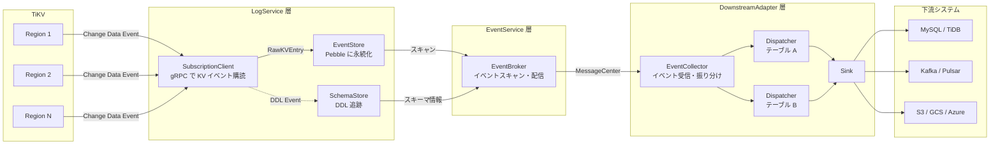

# 第1章 TiCDC とは何か

> **本章で読むソース**
>
> - [`cmd/cdc/main.go`](https://github.com/pingcap/ticdc/blob/v8.5.6/cmd/cdc/main.go)
> - [`cmd/cdc/server/server.go`](https://github.com/pingcap/ticdc/blob/v8.5.6/cmd/cdc/server/server.go)
> - [`server/server.go`](https://github.com/pingcap/ticdc/blob/v8.5.6/server/server.go)
> - [`pkg/config/server.go`](https://github.com/pingcap/ticdc/blob/v8.5.6/pkg/config/server.go)
> - [`pkg/config/changefeed.go`](https://github.com/pingcap/ticdc/blob/v8.5.6/pkg/config/changefeed.go)
> - [`pkg/config/sink_protocol.go`](https://github.com/pingcap/ticdc/blob/v8.5.6/pkg/config/sink_protocol.go)
> - [`pkg/version/version.go`](https://github.com/pingcap/ticdc/blob/v8.5.6/pkg/version/version.go)
> - [`pkg/eventservice/event_service.go`](https://github.com/pingcap/ticdc/blob/v8.5.6/pkg/eventservice/event_service.go)
> - [`pkg/eventservice/event_broker.go`](https://github.com/pingcap/ticdc/blob/v8.5.6/pkg/eventservice/event_broker.go)
> - [`logservice/eventstore/event_store.go`](https://github.com/pingcap/ticdc/blob/v8.5.6/logservice/eventstore/event_store.go)
> - [`logservice/logpuller/subscription_client.go`](https://github.com/pingcap/ticdc/blob/v8.5.6/logservice/logpuller/subscription_client.go)
> - [`logservice/schemastore/schema_store.go`](https://github.com/pingcap/ticdc/blob/v8.5.6/logservice/schemastore/schema_store.go)
> - [`downstreamadapter/sink/sink.go`](https://github.com/pingcap/ticdc/blob/v8.5.6/downstreamadapter/sink/sink.go)
> - [`downstreamadapter/dispatcher/event_dispatcher.go`](https://github.com/pingcap/ticdc/blob/v8.5.6/downstreamadapter/dispatcher/event_dispatcher.go)
> - [`downstreamadapter/eventcollector/event_collector.go`](https://github.com/pingcap/ticdc/blob/v8.5.6/downstreamadapter/eventcollector/event_collector.go)

## この章の狙い

TiCDC がどのようなソフトウェアであり、TiDB エコシステムの中でどの役割を担うかを示す。
そのうえで、ソースコードのディレクトリ構造からデータフローの3層構造を読み取り、後続の章で深く読む対象の全体地図を提示する。

## 前提

TiDB クラスタの基礎構成（TiDB、TiKV、PD）と、TiKV が MVCC で KV データを管理することを理解していれば十分である。

## TiCDC の役割

**TiCDC**（TiDB Change Data Capture）は、TiDB クラスタで発生したデータ変更を下流システムへリアルタイムに複製するコンポーネントである。
TiKV の各 Region が生成する KV Change Log（Raft ログに基づく変更イベント）を購読し、行レベルの変更イベントに変換して下流へ配信する。

README にはその目標が次のように記されている。

[`README.md L5`](https://github.com/pingcap/ticdc/blob/v8.5.6/README.md#L5)

```text
TiCDC pulls change logs from TiDB clusters and pushes them to downstream systems, such as MySQL, TiDB, Kafka, Pulsar, and Object Storages (e.g., S3).
```

v8.5.4 以降、TiCDC は旧リポジトリ tiflow から独立した専用リポジトリ（`pingcap/ticdc`）へ移行し、アーキテクチャを全面的に刷新した。
旧アーキテクチャとの互換性を保ちつつ、新アーキテクチャへの切り替えは `--newarch` フラグで制御する。

[`pkg/config/server.go L90-L93`](https://github.com/pingcap/ticdc/blob/v8.5.6/pkg/config/server.go#L90-L93)

```go
var defaultServerConfig = &ServerConfig{
	Newarch:       false,
	Addr:          "127.0.0.1:8300",
	AdvertiseAddr: "",
```

新アーキテクチャが掲げる設計目標は4つある。

[`README.md L7-L10`](https://github.com/pingcap/ticdc/blob/v8.5.6/README.md#L7-L10)

```text
* **Better scalability**. E.g. support over 1 million tables.
* **More efficiency**. Use less machine resource to support large volume.
* **Better maintainability**. E.g. simpler and human readable code, clear code module, and open to extensions.
* **Cloud native architecture**. We want to design a new architecture from the ground to support the cloud.
```

100万テーブル規模のスケーラビリティ、リソース効率、保守性、クラウドネイティブ設計の4点が、旧アーキテクチャからの刷新動機である。

## Changefeed とテーブル単位の複製

TiCDC における複製の単位は **Changefeed** である。
Changefeed は、上流の TiDB クラスタから下流のシステムへデータを流す1本のパイプラインを表す。

「Changefeed」の状態は `FeedState` 型で定義されており、通常稼働（`normal`）、保留（`pending`）、失敗（`failed`）、停止（`stopped`）、除去（`removed`）、完了（`finished`）、警告（`warning`）の7つがある。

[`pkg/config/changefeed.go L49-L59`](https://github.com/pingcap/ticdc/blob/v8.5.6/pkg/config/changefeed.go#L49-L59)

```go
const (
	StateNormal   FeedState = "normal"
	StatePending  FeedState = "pending"
	StateFailed   FeedState = "failed"
	StateStopped  FeedState = "stopped"
	StateRemoved  FeedState = "removed"
	StateFinished FeedState = "finished"
	StateWarning  FeedState = "warning"
	// StateUnInitialized is used for the changefeed that has not been initialized
	// it only exists in memory for a short time and will not be persisted to storage
	StateUnInitialized FeedState = ""
)
```

Changefeed の内部では、テーブルごとに **Dispatcher** が割り当てられる。
Dispatcher はテーブル単位のイベントを受け取り、Sink を介して下流に書き込む。

[`downstreamadapter/dispatcher/event_dispatcher.go L35-L49`](https://github.com/pingcap/ticdc/blob/v8.5.6/downstreamadapter/dispatcher/event_dispatcher.go#L35-L49)

```go
// EventDispatcher is the dispatcher to flush events to the downstream
type EventDispatcher struct {
	*BasicDispatcher
	// BootstrapState stores a bootstrap state
	// when state is BootstrapNotStarted, it will send bootstrap messages
	// only for simple protocol
	BootstrapState bootstrapState
	redoEnable     bool
	// redoGlobalTs is updated by the maintainer. Events with a commit-ts greater than redoGlobalTs are cached until the redo log catches up.
	redoGlobalTs *atomic.Uint64
	// cacheEvents is used to store events with a commit-ts greater than redoGlobalTs
	cacheEvents struct {
		sync.Mutex
		events chan cacheEvents
	}
}
```

コメントにあるとおり、1つの Changefeed 内の全 Dispatcher は同一の Sink を共有する。

## 対応する下流システム

TiCDC が対応する下流は、Sink のファクトリ関数 `sink.New` で一覧できる。
URI のスキームによって生成する Sink の種類を切り替える。

[`downstreamadapter/sink/sink.go L44-L62`](https://github.com/pingcap/ticdc/blob/v8.5.6/downstreamadapter/sink/sink.go#L44-L62)

```go
func New(ctx context.Context, cfg *config.ChangefeedConfig, changefeedID common.ChangeFeedID) (Sink, error) {
	sinkURI, err := url.Parse(cfg.SinkURI)
	if err != nil {
		return nil, errors.WrapError(errors.ErrSinkURIInvalid, err)
	}
	scheme := config.GetScheme(sinkURI)
	switch scheme {
	case config.MySQLScheme, config.MySQLSSLScheme, config.TiDBScheme, config.TiDBSSLScheme:
		return mysql.New(ctx, changefeedID, cfg, sinkURI)
	case config.KafkaScheme, config.KafkaSSLScheme:
		return kafka.New(ctx, changefeedID, sinkURI, cfg.SinkConfig)
	case config.PulsarScheme, config.PulsarSSLScheme, config.PulsarHTTPScheme, config.PulsarHTTPSScheme:
		return pulsar.New(ctx, changefeedID, sinkURI, cfg.SinkConfig)
	case config.S3Scheme, config.FileScheme, config.GCSScheme, config.GSScheme, config.AzblobScheme, config.AzureScheme, config.CloudStorageNoopScheme:
		return cloudstorage.New(ctx, changefeedID, sinkURI, cfg.SinkConfig, cfg.EnableTableAcrossNodes, nil)
	case config.BlackHoleScheme:
		return blackhole.New()
	}
	return nil, errors.ErrSinkURIInvalid.GenWithStackByArgs(sinkURI)
}
```

スキーム定数は `sink_protocol.go` で定義されている。

[`pkg/config/sink_protocol.go L109-L146`](https://github.com/pingcap/ticdc/blob/v8.5.6/pkg/config/sink_protocol.go#L109-L146)

```go
const (
	KafkaScheme            = "kafka"
	KafkaSSLScheme         = "kafka+ssl"
	// ... (中略) ...
	MySQLScheme            = "mysql"
	MySQLSSLScheme         = "mysql+ssl"
	TiDBScheme             = "tidb"
	TiDBSSLScheme          = "tidb+ssl"
	S3Scheme               = "s3"
	FileScheme             = "file"
	GCSScheme              = "gcs"
	// ... (中略) ...
	PulsarScheme           = "pulsar"
	PulsarSSLScheme        = "pulsar+ssl"
	PulsarHTTPScheme       = "pulsar+http"
	PulsarHTTPSScheme      = "pulsar+https"
)
```

整理すると、対応する下流は次の4カテゴリである。

- **MySQL 互換データベース**（MySQL、TiDB）
- **メッセージキュー**（Kafka、Pulsar）
- **クラウドストレージ**（S3、GCS、Azure Blob Storage、ローカルファイル）
- **BlackHole**（テスト用。データを破棄する）

## エントリーポイントと起動フロー

TiCDC のバイナリは `cmd/cdc/main.go` から始まる。
cobra のコマンドツリーに `server`、`cli`、`version`、`redo` の4つのサブコマンドを登録している。

[`cmd/cdc/main.go L40-L56`](https://github.com/pingcap/ticdc/blob/v8.5.6/cmd/cdc/main.go#L40-L56)

```go
func main() {
	cmd := NewCmd()

	cmd.SetOut(os.Stdout)
	cmd.SetErr(os.Stderr)

	cmd.AddCommand(server.NewCmdServer())
	cmd.AddCommand(cli.NewCmdCli())
	cmd.AddCommand(version.NewCmdVersion())
	cmd.AddCommand(redo.NewCmdRedo())

	setNewCollationEnabled()
	if err := cmd.Execute(); err != nil {
		cmd.PrintErrln(err)
		os.Exit(1)
	}
}
```

`cdc server` サブコマンドを実行すると、`cmd/cdc/server/server.go` の `run` メソッドが呼ばれる。
バージョン情報をログに出力したあと、`server.New` でサーバーインスタンスを生成し、`svr.Run(ctx)` で起動する。

[`cmd/cdc/server/server.go L125-L137`](https://github.com/pingcap/ticdc/blob/v8.5.6/cmd/cdc/server/server.go#L125-L137)

```go
	version.LogVersionInfo("Change Data Capture (CDC)")
	metrics.BuildInfo.WithLabelValues(version.ReleaseVersion, version.GitHash, version.BuildTS, kerneltype.Name()).Set(1)
	log.Info("The TiCDC release version", zap.String("ReleaseVersion", version.ReleaseVersion))

	util.LogHTTPProxies()
	metrics.RecordGoRuntimeSettings()
	svr, err := server.New(o.serverConfig, o.pdEndpoints)
	if err != nil {
		log.Error("create cdc server failed", zap.Error(err))
		return errors.Trace(err)
	}
	log.Info("TiCDC(new arch) server created",
		zap.Strings("pd", o.pdEndpoints), zap.Stringer("config", o.serverConfig))
```

バージョン情報はビルド時に埋め込まれるリンカ変数で管理されている。

[`pkg/version/version.go L26-L32`](https://github.com/pingcap/ticdc/blob/v8.5.6/pkg/version/version.go#L26-L32)

```go
var (
	ReleaseVersion = "None"
	BuildTS        = "None"
	GitHash        = "None"
	GitBranch      = "None"
	GoVersion      = "None"
)
```

## サーバーのモジュール構成

`server/server.go` の `server` 構造体が、TiCDC の中核であるサーバープロセスを表す。
コメントに記されたとおり、モジュールは起動順に4つの層に分かれる。

[`server/server.go L62-L82`](https://github.com/pingcap/ticdc/blob/v8.5.6/server/server.go#L62-L82)

```go
// server represents the main TiCDC server with carefully orchestrated module lifecycle management.
//
// Module Startup Order (dependencies flow from top to bottom):
// 1. preServices    - Foundation services (PDClock, MessageCenter, etc.)
// 2. networkModules - Network infrastructure (TCP, HTTP, gRPC servers)
// 3. nodeModules    - Node management (NodeManager, Elector)
// 4. subModules     - Business logic (SchemaStore, MaintainerManager, etc.)
//
// Module Shutdown Order (reverse of startup to ensure clean teardown, except for preServices):
// 1. preServices    - in parallel, cuz it's not depended on other modules
// 2. subModules     - Business logic modules stop first
// 3. nodeModules    - Node management stops second
// 4. networkModules - Network services stop third
//
// Rationale for this ordering:
// - preServices provide foundational capabilities (time, messaging) needed by all other modules
// - networkModules must start early to accept external connections and API requests
// - nodeModules handle cluster membership and leadership, required before business logic
// - subModules contain the core CDC business logic and depend on all above layers
// - Shutdown reverses this order to prevent dependency violations and ensure graceful cleanup
```

1. **preServices**（基盤サービス）：PDClock、MessageCenter、EventCollector、HeartbeatCollector、DispatcherOrchestrator、KeyspaceManager
2. **networkModules**（ネットワーク基盤）：TCP、HTTP、gRPC サーバー
3. **nodeModules**（ノード管理）：NodeManager、Elector
4. **subModules**（ビジネスロジック）：SubscriptionClient、SchemaStore、EventStore、MaintainerManager、EventService

`initialize` メソッドで、これらのモジュールが順に生成される。

[`server/server.go L218-L224`](https://github.com/pingcap/ticdc/blob/v8.5.6/server/server.go#L218-L224)

```go
	c.subModules = []common.SubModule{
		subscriptionClient,
		schemaStore,
		eventStore,
		maintainer.NewMaintainerManager(c.info, conf.Debug.Scheduler),
		eventService,
	}
```

## データフローの3層構造

TiCDC 新アーキテクチャのデータフローは、大きく3つの層に分かれる。

1. **LogService 層**（`logservice/` パッケージ）
2. **EventService 層**（`pkg/eventservice/` パッケージ）
3. **DownstreamAdapter 層**（`downstreamadapter/` パッケージ）

以下で、各層の役割とコード上の対応を示す。

### LogService 層：TiKV から変更ログを収集する

LogService 層は3つの主要コンポーネントで構成される。

**SubscriptionClient** は TiKV の各ストアに対して gRPC で Change Data イベントを購読する。
Region 単位でイベントフィードを開き、KV 変更イベントと ResolvedTs イベントを受信する。

[`logservice/logpuller/subscription_client.go L166-L183`](https://github.com/pingcap/ticdc/blob/v8.5.6/logservice/logpuller/subscription_client.go#L166-L183)

```go
// subscriptionClient is used to subscribe events of table ranges from TiKV.
// All exported Methods are thread-safe.
type SubscriptionClient interface {
	common.SubModule
	// allocate a unique id for the subscription
	AllocSubscriptionID() SubscriptionID
	// subscribe a table span
	Subscribe(
		subID SubscriptionID,
		span heartbeatpb.TableSpan,
		startTs uint64,
		consumeKVEvents func(raw []common.RawKVEntry, wakeCallback func()) bool,
		advanceResolvedTs func(ts uint64),
		advanceInterval int64,
		bdrMode bool,
	)
	// unsubscribe a table span
	Unsubscribe(subID SubscriptionID)
}
```

**EventStore** は SubscriptionClient から受信した KV イベントを Pebble に永続化する。
複数の Pebble インスタンスを並列に使い、書き込みスループットを確保する。

[`logservice/eventstore/event_store.go L202-L207`](https://github.com/pingcap/ticdc/blob/v8.5.6/logservice/eventstore/event_store.go#L202-L207)

```go
type eventStore struct {
	pdClock   pdutil.Clock
	subClient logpuller.SubscriptionClient

	dbs            []*pebble.DB
	chs            []*chann.UnlimitedChannel[eventWithCallback, uint64]
```

イベントデータは zstd で圧縮される場合もあり、圧縮の有無はサイズ閾値で制御される。

[`logservice/eventstore/event_store.go L237-L241`](https://github.com/pingcap/ticdc/blob/v8.5.6/logservice/eventstore/event_store.go#L237-L241)

```go
	// compressionThreshold is the size in bytes above which a value will be compressed.
	compressionThreshold int
	// enableZstdCompression controls whether to enable zstd compression for large values.
	enableZstdCompression bool
}
```

**SchemaStore** は TiDB の DDL 変更を追跡し、テーブルスキーマのバージョン管理を行う。
EventService がイベントを行レベルの変更に変換する際に、対応するテーブル定義を SchemaStore から取得する。

[`logservice/schemastore/schema_store.go L41-L65`](https://github.com/pingcap/ticdc/blob/v8.5.6/logservice/schemastore/schema_store.go#L41-L65)

```go
type SchemaStore interface {
	common.SubModule

	GetAllPhysicalTables(keyspaceMeta common.KeyspaceMeta, snapTs uint64, filter filter.Filter) ([]commonEvent.Table, error)

	RegisterTable(keyspaceMeta common.KeyspaceMeta, tableID int64, startTs uint64) error

	UnregisterTable(keyspaceMeta common.KeyspaceMeta, tableID int64) error

	// GetTableInfo return table info with the largest version <= ts
	GetTableInfo(keyspaceMeta common.KeyspaceMeta, tableID int64, ts uint64) (*common.TableInfo, error)

	// ... (中略) ...

	FetchTableDDLEvents(keyspaceMeta common.KeyspaceMeta, dispatcherID common.DispatcherID, tableID int64, tableFilter filter.Filter, start, end uint64) ([]commonEvent.DDLEvent, error)

	FetchTableTriggerDDLEvents(keyspaceMeta common.KeyspaceMeta, dispatcherID common.DispatcherID, tableFilter filter.Filter, start uint64, limit int) ([]commonEvent.DDLEvent, uint64, error)

	// RegisterKeyspace register a keyspace to fetch table ddl
	RegisterKeyspace(ctx context.Context, keyspaceMeta common.KeyspaceMeta) error
}
```

### EventService 層：イベントを Dispatcher へ配信する

**EventService** は EventStore と SchemaStore を入力として受け取り、下流の Dispatcher へイベントを配信するブローカーの役割を果たす。
TiDB クラスタごとに1つの `eventBroker` を持ち、Dispatcher の登録と解除を管理する。

[`pkg/eventservice/event_service.go L72-L83`](https://github.com/pingcap/ticdc/blob/v8.5.6/pkg/eventservice/event_service.go#L72-L83)

```go
type eventService struct {
	mc          messaging.MessageCenter
	eventStore  eventstore.EventStore
	schemaStore schemastore.SchemaStore
	// clusterID -> eventBroker
	brokers map[uint64]*eventBroker

	// TODO: use a better way to cache the acceptorInfos
	dispatcherInfoChan  chan DispatcherInfo
	dispatcherHeartbeat chan *DispatcherHeartBeatWithServerID
}
```

`eventBroker` は EventStore からイベントをスキャンし、MessageCenter 経由で各 Dispatcher にイベントを送信する。

[`pkg/eventservice/event_broker.go L59-L68`](https://github.com/pingcap/ticdc/blob/v8.5.6/pkg/eventservice/event_broker.go#L59-L68)

```go
// eventBroker get event from the eventStore, and send the event to the dispatchers.
// Every TiDB cluster has a eventBroker.
// All span subscriptions and dispatchers of the TiDB cluster are managed by the eventBroker.
type eventBroker struct {
	// tidbClusterID is the ID of the TiDB cluster this eventStore belongs to.
	tidbClusterID uint64
	// eventStore is the source of the events, eventBroker get the events from the eventStore.
	eventStore  eventstore.EventStore
	schemaStore schemastore.SchemaStore
	mounter     event.Mounter
```

### DownstreamAdapter 層：下流への書き込み

**EventCollector** は EventService から MessageCenter 経由でイベントを受信し、DynStream を使って対応する Dispatcher へ振り分ける。

[`downstreamadapter/eventcollector/event_collector.go L44-L46`](https://github.com/pingcap/ticdc/blob/v8.5.6/downstreamadapter/eventcollector/event_collector.go#L44-L46)

```go
// DispatcherMessage is the message send to EventService.
type DispatcherMessage struct {
	Message *messaging.TargetMessage
```

各 **Dispatcher** はテーブル単位でイベントを受け取り、共有された Sink インスタンスを通じて下流に書き込む。
Sink インターフェースは DML イベントの追加とブロッキングイベント（DDL など）の書き込みを分離している。

[`downstreamadapter/sink/sink.go L31-L42`](https://github.com/pingcap/ticdc/blob/v8.5.6/downstreamadapter/sink/sink.go#L31-L42)

```go
type Sink interface {
	SinkType() common.SinkType
	IsNormal() bool

	AddDMLEvent(event *commonEvent.DMLEvent)
	WriteBlockEvent(event commonEvent.BlockEvent) error
	AddCheckpointTs(ts uint64)

	SetTableSchemaStore(tableSchemaStore *commonEvent.TableSchemaStore)
	Close(removeChangefeed bool)
	Run(ctx context.Context) error
}
```

## データフロー全体像

以下の図は、TiKV の KV Change Log が下流システムに到達するまでのデータフローを示す。



## サーバー設定の構造

`ServerConfig` 構造体は、TiCDC サーバーの全設定を保持する。
特筆すべきフィールドを以下に挙げる。

[`pkg/config/server.go L136-L168`](https://github.com/pingcap/ticdc/blob/v8.5.6/pkg/config/server.go#L136-L168)

```go
type ServerConfig struct {
	Newarch       bool   `toml:"newarch" json:"newarch"`
	Addr          string `toml:"addr" json:"addr"`
	AdvertiseAddr string `toml:"advertise-addr" json:"advertise-addr"`

	// ... (中略) ...

	DataDir string `toml:"data-dir" json:"data-dir"`

	GcTTL int64  `toml:"gc-ttl" json:"gc-ttl"`
	TZ    string `toml:"tz" json:"tz"`

	CaptureSessionTTL int `toml:"capture-session-ttl" json:"capture-session-ttl"`

	// ... (中略) ...

	Sorter    *SorterConfig        `toml:"sorter" json:"sorter"`
	Security  *security.Credential `toml:"security" json:"security"`
	KVClient  *KVClientConfig      `toml:"kv-client" json:"kv-client"`
	Debug     *DebugConfig         `toml:"debug" json:"debug"`
	ClusterID string               `toml:"cluster-id" json:"cluster-id"`
}
```

- `Newarch`：新アーキテクチャモードの有効化フラグ
- `DataDir`：EventStore（Pebble）のデータディレクトリ
- `GcTTL`：GC セーフポイントの TTL（デフォルト24時間）
- `CaptureSessionTTL`：etcd セッションの TTL（デフォルト10秒）
- `ClusterID`：TiCDC クラスタの識別子

グローバル設定は `atomic.Value` で保持され、`GetGlobalServerConfig` でどのゴルーチンからもロックなしに読み取れる。

[`pkg/config/server.go L298-L305`](https://github.com/pingcap/ticdc/blob/v8.5.6/pkg/config/server.go#L298-L305)

```go
var globalServerConfig atomic.Value

// GetGlobalServerConfig returns the global configuration for this server.
// It should store configuration from command line and configuration file.
// Other parts of the system can read the global configuration use this function.
func GetGlobalServerConfig() *ServerConfig {
	return globalServerConfig.Load().(*ServerConfig)
}
```

## 高速化の工夫：Pebble 分散書き込み

EventStore は、受信した KV イベントを Pebble に書き込む際に、複数の Pebble インスタンスを並列に利用する。
デフォルトで4つの DB インスタンスを作成し、各インスタンスに2つの書き込みワーカーを割り当てる。

[`logservice/eventstore/event_store.go L243-L247`](https://github.com/pingcap/ticdc/blob/v8.5.6/logservice/eventstore/event_store.go#L243-L247)

```go
const (
	dataDir             = "event_store"
	dbCount             = 4
	writeWorkerNumPerDB = 2
)
```

1つの Pebble インスタンスでは書き込みが直列化されるため、書き込みスループットがボトルネックになりやすい。
複数インスタンスに分散させることで、この直列化ボトルネックを回避している。

加えて、大きな値には zstd 圧縮を適用することで、ディスク I/O 量を削減している[^1]。

[^1]: 圧縮の閾値と有効化は `eventStore` 構造体の `compressionThreshold` と `enableZstdCompression` フィールドで制御される。

## まとめ

TiCDC は TiKV の KV Change Log を購読し、行レベルの変更イベントとして下流に配信する CDC コンポーネントである。
v8.5.4 以降の新アーキテクチャでは、データフローが LogService、EventService、DownstreamAdapter の3層に分離されている。

- LogService 層が TiKV からイベントを収集し、Pebble に永続化する
- EventService 層がイベントをスキャンし、MessageCenter 経由で Dispatcher に配信する
- DownstreamAdapter 層が Dispatcher と Sink を通じて、MySQL、Kafka、Pulsar、クラウドストレージの各下流にデータを書き込む

後続の章では、各層の内部構造を詳しく読み解いていく。

## 関連する章

- [第2章 サーバーアーキテクチャ](02-server-architecture.md)（サーバーのモジュール構成と起動シーケンス）
- [第12章 Coordinator と Changefeed 管理](../part03-scheduling/12-coordinator.md)（クラスタ全体の Changefeed スケジューリング）
- [第13章 Maintainer とテーブルスケジューリング](../part03-scheduling/13-maintainer.md)（Changefeed 内のテーブル割り当て）
