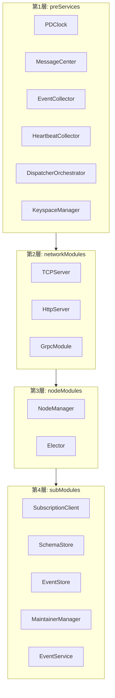
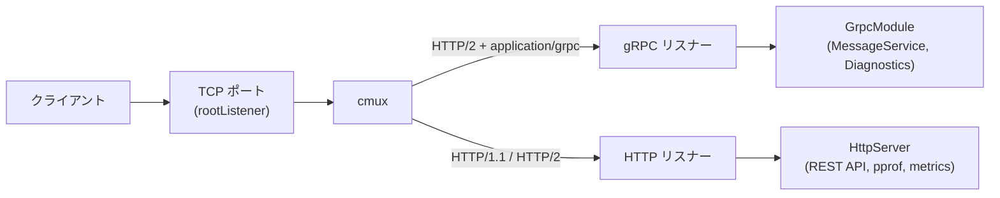

# 第2章 サーバーアーキテクチャ

> **本章で読むソース**
>
> - [`server/server.go`](https://github.com/pingcap/ticdc/blob/v8.5.6/server/server.go)
> - [`server/server_prepare.go`](https://github.com/pingcap/ticdc/blob/v8.5.6/server/server_prepare.go)
> - [`server/module_http.go`](https://github.com/pingcap/ticdc/blob/v8.5.6/server/module_http.go)
> - [`server/module_grpc.go`](https://github.com/pingcap/ticdc/blob/v8.5.6/server/module_grpc.go)
> - [`server/module_election.go`](https://github.com/pingcap/ticdc/blob/v8.5.6/server/module_election.go)
> - [`server/watcher/module_node_manager.go`](https://github.com/pingcap/ticdc/blob/v8.5.6/server/watcher/module_node_manager.go)
> - [`pkg/tcpserver/tcp_server.go`](https://github.com/pingcap/ticdc/blob/v8.5.6/pkg/tcpserver/tcp_server.go)
> - [`pkg/node/node.go`](https://github.com/pingcap/ticdc/blob/v8.5.6/pkg/node/node.go)
> - [`pkg/common/context/app_context.go`](https://github.com/pingcap/ticdc/blob/v8.5.6/pkg/common/context/app_context.go)
> - [`cmd/cdc/main.go`](https://github.com/pingcap/ticdc/blob/v8.5.6/cmd/cdc/main.go)
> - [`cmd/cdc/server/server.go`](https://github.com/pingcap/ticdc/blob/v8.5.6/cmd/cdc/server/server.go)
> - [`api/http.go`](https://github.com/pingcap/ticdc/blob/v8.5.6/api/http.go)

## この章の狙い

TiCDC のプロセスが `cdc server` コマンドで起動してから、各サブモジュールが稼働するまでの流れを追う。
`server` 構造体のフィールド構成、4層に分かれたモジュールのライフサイクル、TCP/gRPC/HTTP の3つのリスナーの多重化、etcd ベースのノード管理と選挙の仕組みを読み解く。

## 前提

- TiCDC の全体像（第1章）を把握していること。
- etcd のリース(lease)とセッションの基本概念を知っていること。
- Go の `errgroup` によるゴルーチン管理を理解していること。

## エントリーポイント

TiCDC バイナリのエントリーポイントは `cmd/cdc/main.go` の `main` 関数である。

[`cmd/cdc/main.go` L40-L56](https://github.com/pingcap/ticdc/blob/v8.5.6/cmd/cdc/main.go#L40-L56)

```go
func main() {
	cmd := NewCmd()

	cmd.SetOut(os.Stdout)
	cmd.SetErr(os.Stderr)

	cmd.AddCommand(server.NewCmdServer())
	cmd.AddCommand(cli.NewCmdCli())
	cmd.AddCommand(version.NewCmdVersion())
	cmd.AddCommand(redo.NewCmdRedo())

	setNewCollationEnabled()
	if err := cmd.Execute(); err != nil {
		cmd.PrintErrln(err)
		os.Exit(1)
	}
}
```

cobra のルートコマンドに `server`、`cli`、`version`、`redo` の4つのサブコマンドを登録し、`cmd.Execute()` で実行する。
サーバーモードでは `server.NewCmdServer()` が返すコマンドが使われる。

`NewCmdServer` は新アーキテクチャ(newarch)の有効/無効を判定し、有効であれば `server.New` でサーバーを生成して `Run` を呼ぶ。

[`cmd/cdc/server/server.go` L360-L385](https://github.com/pingcap/ticdc/blob/v8.5.6/cmd/cdc/server/server.go#L360-L385)

```go
func NewCmdServer() *cobra.Command {
	o := newOptions()

	command := &cobra.Command{
		Use:   "server",
		Short: "Start a TiCDC server",
		Args:  cobra.NoArgs,
		RunE: func(cmd *cobra.Command, args []string) error {
			if isNewArchEnabled(o) {
				log.Info("Running TiCDC server in new architecture")
				err := o.complete(cmd)
				// ... (中略) ...
				err = o.run(cmd)
				cobra.CheckErr(err)
				return nil
			}
			log.Info("Running TiCDC server in old architecture")
			return runTiFlowServer(o, cmd)
		},
	}
	// ... (中略) ...
	return command
}
```

`isNewArchEnabled` はコマンドラインフラグ(`--newarch`)、環境変数(`TICDC_NEWARCH`)、設定ファイルの3つを順に確認し、いずれかが `true` なら新アーキテクチャで起動する。
本章では新アーキテクチャ側のコードパスを追う。

## server 構造体のフィールド構成

サーバーの中核は `server/server.go` に定義された `server` 構造体である。

[`server/server.go` L82-L138](https://github.com/pingcap/ticdc/blob/v8.5.6/server/server.go#L82-L138)

```go
type server struct {
	mu sync.Mutex

	info *node.Info

	liveness api.Liveness

	pdClient      pd.Client
	pdAPIClient   pdutil.PDAPIClient
	pdEndpoints   []string
	coordinatorMu sync.Mutex

	coordinator tiserver.Coordinator

	upstreamManager *upstream.Manager

	session *concurrency.Session

	security *security.Credential

	EtcdClient etcd.CDCEtcdClient

	PDClock pdutil.Clock

	tcpServer tcpserver.TCPServer

	preServices    []common.Closeable
	networkModules []common.SubModule
	nodeModules    []common.SubModule
	subModules     []common.SubModule

	closed atomic.Bool
}
```

フィールドは大きく4つの役割に分かれる。

- **外部接続**: `pdClient`、`pdAPIClient`、`EtcdClient` は PD と etcd への接続を保持する。`session` は etcd のリースに紐づくセッションであり、ノードの生存確認に使われる。
- **自ノード情報**: `info` はノード ID、アドバタイズアドレス、バージョン等を保持する `node.Info` 構造体へのポインタである。
- **モジュール管理**: `preServices`、`networkModules`、`nodeModules`、`subModules` の4つのスライスが起動順序に対応する。
- **Coordinator**: `coordinator` フィールドは、このノードが Coordinator に選出された場合にのみセットされる。

## 4層のモジュールライフサイクル

ソースコード冒頭のコメントに、起動とシャットダウンの順序が明記されている。

[`server/server.go` L62-L81](https://github.com/pingcap/ticdc/blob/v8.5.6/server/server.go#L62-L81)

```go
// Module Startup Order (dependencies flow from top to bottom):
// 1. preServices    - Foundation services (PDClock, MessageCenter, etc.)
// 2. networkModules - Network infrastructure (TCP, HTTP, gRPC servers)
// 3. nodeModules    - Node management (NodeManager, Elector)
// 4. subModules     - Business logic (SchemaStore, MaintainerManager, etc.)
//
// Module Shutdown Order (reverse of startup to ensure clean teardown, except for preServices):
// 1. preServices    - in parallel, cuz it's not depended on other modules
// 2. subModules     - Business logic modules stop first
// 3. nodeModules    - Node management stops second
// 4. networkModules - Network services stop third
```

以下の図はこの4層の依存関係と各層に属するモジュールを示す。



起動は上から下へ、シャットダウンは下から上へ進む。
ただし `preServices` だけは例外で、シャットダウン時は他の層と並行して停止する。
`preServices` は他のモジュールから依存されているが、逆に他のモジュールに依存していないため、並行停止しても安全である。

## 起動シーケンス

### prepare: 外部接続の確立

`Run` メソッドは最初に `initialize` を呼び、`initialize` は `prepare` と `setPreServices` を順に実行する。

`prepare` メソッドは PD クライアント、etcd クライアント、etcd セッションを生成し、データディレクトリの初期化とメモリ上限の設定を行う。

[`server/server_prepare.go` L48-L141](https://github.com/pingcap/ticdc/blob/v8.5.6/server/server_prepare.go#L48-L141)

```go
func (c *server) prepare(ctx context.Context) error {
	conf := config.GetGlobalServerConfig()
	grpcTLSOption, err := conf.Security.ToGRPCDialOption()
	// ... (中略) ...
	c.pdClient, err = pdopt.NewClientWithContext(
		ctx, c.pdEndpoints, conf.Security.PDSecurityOption(),
		pdopt.WithCustomTimeoutOption(10*time.Second),
		// ... (中略) ...
	)
	// ... (中略) ...
	cdcEtcdClient, err := etcd.NewCDCEtcdClient(ctx, etcdCli, conf.ClusterID)
	// ... (中略) ...
	c.EtcdClient = cdcEtcdClient
	// ... (中略) ...
	c.info = node.NewInfo(conf.AdvertiseAddr, deployPath)
	c.session = session
	return nil
}
```

`node.NewInfo` はノード ID として UUID を生成する。
このノード ID はプロセスの再起動ごとに変わる[^node-id]。

[^node-id]: `node.NewInfo` 内で `uuid.New()` を呼ぶ実装のため、永続化されていない。コメントにも「TODO: Get id from disk after restart」と記されている。

[`pkg/node/node.go` L59-L68](https://github.com/pingcap/ticdc/blob/v8.5.6/pkg/node/node.go#L59-L68)

```go
func NewInfo(addr string, deployPath string) *Info {
	return &Info{
		ID:             NewID(),
		AdvertiseAddr:  addr,
		Version:        version.ReleaseVersion,
		GitHash:        version.GitHash,
		DeployPath:     deployPath,
		StartTimestamp: time.Now().Unix(),
	}
}
```

### setPreServices: 基盤サービスの起動

`setPreServices` は第1層のサービスを順に生成して起動する。

[`server/server.go` L239-L283](https://github.com/pingcap/ticdc/blob/v8.5.6/server/server.go#L239-L283)

```go
func (c *server) setPreServices(ctx context.Context) error {
	appctx.SetID(c.info.ID.String())

	c.PDClock, err = pdutil.NewClock(ctx, c.pdClient)
	// ... (中略) ...
	c.PDClock.Run(ctx)
	appctx.SetService(appctx.DefaultPDClock, c.PDClock)
	c.preServices = append(c.preServices, c.PDClock)

	mcCfg := config.NewDefaultMessageCenterConfig(c.info.AdvertiseAddr)
	messageCenter := messaging.NewMessageCenter(ctx, c.info.ID, mcCfg, c.security)
	messageCenter.Run(ctx)
	appctx.SetService(appctx.MessageCenter, messageCenter)
	c.preServices = append(c.preServices, messageCenter)

	ec := eventcollector.New(c.info.ID)
	ec.Run(ctx)
	appctx.SetService(appctx.EventCollector, ec)
	c.preServices = append(c.preServices, ec)

	hc := dispatchermanager.NewHeartBeatCollector(c.info.ID)
	hc.Run(ctx)
	appctx.SetService(appctx.HeartbeatCollector, hc)
	c.preServices = append(c.preServices, hc)

	dispatcherOrchestrator := dispatcherorchestrator.New()
	dispatcherOrchestrator.Run()
	appctx.SetService(appctx.DispatcherOrchestrator, dispatcherOrchestrator)
	c.preServices = append(c.preServices, dispatcherOrchestrator)

	keyspaceManager := keyspace.NewManager(c.pdEndpoints)
	appctx.SetService(appctx.KeyspaceManager, keyspaceManager)
	c.preServices = append(c.preServices, keyspaceManager)
	// ... (中略) ...
}
```

各サービスは生成後すぐに `appctx.SetService` でグローバルコンテキストに登録される。
グローバルコンテキスト(`AppContext`)は `sync.Map` ベースのサービスロケーターであり、任意のモジュールが名前を指定して他のサービスを取得できる。

[`pkg/common/context/app_context.go` L61-L65](https://github.com/pingcap/ticdc/blob/v8.5.6/pkg/common/context/app_context.go#L61-L65)

```go
func SetService[T any](name string, t T) { GetGlobalContext().serviceMap.Store(name, t) }
func GetService[T any](name string) T {
	v, _ := GetGlobalContext().serviceMap.Load(name)
	return v.(T)
}
```

各 preService の役割は以下のとおりである。

- **PDClock**: PD から取得したタイムスタンプに基づく論理時計。TSO (Timestamp Oracle) のローカルキャッシュとして機能する。
- **MessageCenter**: ノード間メッセージングの中核。ローカル宛てのメッセージは Go チャネルで、リモート宛ては gRPC ストリーミングで配送する。
- **EventCollector**: Dispatcher から EventService へのイベント購読を集約する。
- **HeartbeatCollector**: Dispatcher Manager からのハートビートを集約する。
- **DispatcherOrchestrator**: Dispatcher の生成と破棄を管理する。
- **KeyspaceManager**: TiDB のキースペース(マルチテナント用の名前空間)を管理する。

### initialize: モジュールスライスの組み立て

`initialize` は `prepare` と `setPreServices` の完了後、第2層から第4層のモジュールをスライスに格納する。

[`server/server.go` L207-L235](https://github.com/pingcap/ticdc/blob/v8.5.6/server/server.go#L207-L235)

```go
	c.networkModules = []common.SubModule{
		c.tcpServer,
		NewHttpServer(c, c.tcpServer.HTTP1Listener()),
		NewGrpcServer(c.tcpServer.GrpcListener()),
	}

	c.nodeModules = []common.SubModule{
		nodeManager,
		NewElector(c),
	}

	c.subModules = []common.SubModule{
		subscriptionClient,
		schemaStore,
		eventStore,
		maintainer.NewMaintainerManager(c.info, conf.Debug.Scheduler),
		eventService,
	}
```

### Run: errgroup による並行起動

`Run` メソッドは `initialize` 完了後、`errgroup` を使って各層のモジュールを並行に起動する。

[`server/server.go` L286-L356](https://github.com/pingcap/ticdc/blob/v8.5.6/server/server.go#L286-L356)

```go
func (c *server) Run(ctx context.Context) error {
	c.mu.Lock()
	defer c.mu.Unlock()

	err := c.initialize(ctx)
	// ... (中略) ...
	eg, egctx := errgroup.WithContext(ctx)
	for _, sub := range c.networkModules {
		func(m common.SubModule) {
			eg.Go(func() error {
				// ... (中略) ...
				return m.Run(egctx)
			})
		}(sub)
	}

	g, gctx := errgroup.WithContext(egctx)
	for _, sub := range c.nodeModules {
		func(m common.SubModule) {
			g.Go(func() error {
				// ... (中略) ...
				return m.Run(gctx)
			})
		}(sub)
	}

	err = c.validCheck(gctx)
	// ... (中略) ...

	for _, sub := range c.subModules {
		func(m common.SubModule) {
			g.Go(func() error {
				// ... (中略) ...
				return m.Run(gctx)
			})
		}(sub)
	}

	err = c.registerNodeToEtcd(gctx)
	// ... (中略) ...
}
```

起動シーケンスには2つの `errgroup` が入れ子になっている。
外側の `eg` は `networkModules` を管理し、内側の `g` は `nodeModules` と `subModules` を管理する。
`networkModules` のコンテキスト(`egctx`)が `nodeModules`/`subModules` のコンテキスト(`gctx`)の親になるため、ネットワーク層が停止すれば上位層も自動的にキャンセルされる。

`nodeModules` の起動後、`subModules` の起動前に `validCheck` が挿入されている。
これは旧アーキテクチャの Capture が残っていないことを確認するチェックであり、互換性の問題を防ぐ。

[`server/server.go` L362-L388](https://github.com/pingcap/ticdc/blob/v8.5.6/server/server.go#L362-L388)

```go
func (c *server) validCheck(ctx context.Context) error {
	for {
		select {
		case <-ctx.Done():
			return errors.Trace(ctx.Err())
		default:
			_, captureInfos, err := c.EtcdClient.GetCaptures(ctx)
			// ... (中略) ...
			oldArchCaptureRunning := false
			for _, captureInfo := range captureInfos {
				if !captureInfo.IsNewArch {
					// ... (中略) ...
					oldArchCaptureRunning = true
					break
				}
			}
			if !oldArchCaptureRunning {
				return nil
			}
			time.Sleep(oldArchCheckInterval)
		}
	}
}
```

全モジュールの起動が完了したのち、`registerNodeToEtcd` で自ノードの情報を etcd に書き込む。
etcd への登録はモジュール起動後に行うため、他のノードがこのノードを発見した時点ではすべてのサービスが稼働している。

## TCP/gRPC/HTTP の3つのリスナー

TiCDC は単一の TCP ポートで gRPC と HTTP の両方のトラフィックを処理する。
これを実現しているのが `TCPServer` であり、内部で cmux (Connection Multiplexer) を使ってプロトコルを判別する。

[`pkg/tcpserver/tcp_server.go` L74-L107](https://github.com/pingcap/ticdc/blob/v8.5.6/pkg/tcpserver/tcp_server.go#L74-L107)

```go
func NewTCPServer(address string, credentials *security.Credential) (TCPServer, error) {
	lis, err := net.Listen("tcp", address)
	// ... (中略) ...
	server.mux = cmux.New(server.rootListener)
	server.mux.SetReadTimeout(cmuxReadTimeout)

	server.grpcListener = server.mux.MatchWithWriters(
		cmux.HTTP2MatchHeaderFieldSendSettings("content-type", "application/grpc"))
	server.http1Listener = server.mux.Match(cmux.HTTP1Fast(), cmux.HTTP2())

	return server, nil
}
```

cmux は受信した接続の最初のバイト列を読み、gRPC (HTTP/2 + `content-type: application/grpc`) であれば `grpcListener` に、HTTP/1.1 または通常の HTTP/2 であれば `http1Listener` にルーティングする。



TLS が有効な場合、`rootListener` を `tls.NewListener` でラップする処理が `NewTCPServer` 内で行われるため、gRPC と HTTP の個別モジュール側で TLS を意識する必要がない。

### gRPC サーバー

`GrpcModule` は cmux から得た gRPC リスナー上で `grpc.Server` を起動する。

[`server/module_grpc.go` L39-L64](https://github.com/pingcap/ticdc/blob/v8.5.6/server/module_grpc.go#L39-L64)

```go
func NewGrpcServer(lis net.Listener) common.SubModule {
	option := []grpc.ServerOption{
		grpc.MaxRecvMsgSize(256 * 1024 * 1024), // 256MB
	}

	kaep := keepalive.EnforcementPolicy{
		MinTime:             20 * time.Second,
		PermitWithoutStream: true,
	}

	kasp := keepalive.ServerParameters{
		Time:    1 * time.Minute,
		Timeout: 1 * time.Minute,
	}

	option = append(option, grpc.KeepaliveEnforcementPolicy(kaep), grpc.KeepaliveParams(kasp))

	grpcServer := grpc.NewServer(option...)
	proto.RegisterMessageServiceServer(grpcServer,
		messaging.NewMessageCenterServer(
			appcontext.GetService[messaging.MessageCenter](appcontext.MessageCenter)))
	diagSvc := sysutil.NewDiagnosticsServer(config.GetGlobalServerConfig().LogFile)
	diagnosticspb.RegisterDiagnosticsServer(grpcServer, diagSvc)
	// ... (中略) ...
}
```

登録されるサービスは2つである。
`MessageService` は MessageCenter のサーバー側エンドポイントで、ノード間メッセージング(イベントとコマンド)の受信を担う。
`DiagnosticsServer` はログファイルの取得などの診断機能を提供する。

受信メッセージサイズの上限が 256MB に設定されている点は、大量のイベントデータを一括で送信するユースケースに対応するためと考えられる。

### HTTP サーバー

`HttpServer` は gin フレームワークを使い、REST API、pprof、Prometheus メトリクスのエンドポイントを提供する。

[`server/module_http.go` L44-L72](https://github.com/pingcap/ticdc/blob/v8.5.6/server/module_http.go#L44-L72)

```go
func NewHttpServer(c *server, lis net.Listener) common.SubModule {
	lis = netutil.LimitListener(lis, maxHTTPConnection)
	// ... (中略) ...
	router := gin.New()
	router.Use(gin.RecoveryWithWriter(logWritter))
	api.RegisterRoutes(router, c, registry)

	return &HttpServer{
		listener: lis,
		server: &http.Server{
			Handler:      router,
			ReadTimeout:  httpConnectionTimeout,
			WriteTimeout: httpConnectionTimeout,
		},
	}
}
```

`netutil.LimitListener` で同時接続数を 1000 に制限している。
`api.RegisterRoutes` は v1 API、v2 API、pprof、Prometheus メトリクスのルートを一括で登録する。

[`api/http.go` L30-L55](https://github.com/pingcap/ticdc/blob/v8.5.6/api/http.go#L30-L55)

```go
func RegisterRoutes(
	router *gin.Engine,
	server server.Server,
	registry prometheus.Gatherer,
) {
	v2.RegisterOpenAPIV2Routes(router, v2.NewOpenAPIV2(server))
	v1.RegisterOpenAPIV1Routes(router, v1.NewOpenAPIV1(server))
	router.GET("/config", func(c *gin.Context) {
		c.JSON(http.StatusOK, config.GetGlobalServerConfig())
	})
	// pprof debug API
	pprofGroup := router.Group("/debug/pprof/")
	// ... (中略) ...
	// Promtheus metrics API
	prometheus.DefaultGatherer = registry
	router.Any("/metrics", gin.WrapH(promhttp.Handler()))
}
```

v2 API は Changefeed の CRUD、ヘルスチェック、Capture 一覧、TSO クエリ等を提供する。
Coordinator 宛ての操作(Changefeed 作成など)は `ForwardToCoordinatorMiddleware` によって Coordinator ノードへ転送される。

## ノード管理

### NodeManager と etcd ウォッチ

**NodeManager** はクラスタ内の全ノードを追跡するモジュールである。
etcd に格納された Capture 情報をウォッチし、ノードの参加と離脱を検知する。

[`server/watcher/module_node_manager.go` L40-L55](https://github.com/pingcap/ticdc/blob/v8.5.6/server/watcher/module_node_manager.go#L40-L55)

```go
type NodeManager struct {
	session       *concurrency.Session
	etcdClient    etcd.CDCEtcdClient
	coordinatorID atomic.Value
	nodes         atomic.Pointer[map[node.ID]*node.Info]

	nodeChangeHandlers struct {
		sync.RWMutex
		m map[node.ID]NodeChangeHandler
	}

	ownerChangeHandlers struct {
		sync.RWMutex
		m map[string]OwnerChangeHandler
	}
}
```

`nodes` フィールドは `atomic.Pointer` で保護されたノードのマップであり、ロックなしで読み取れる。
変更ハンドラは2種類ある。`NodeChangeHandler` はノードの参加/離脱時に呼ばれ、`OwnerChangeHandler` は Coordinator (Owner) の変更時に呼ばれる。

`Run` メソッドは `EtcdWatcher` を使って etcd のキーを監視する。

[`server/watcher/module_node_manager.go` L161-L172](https://github.com/pingcap/ticdc/blob/v8.5.6/server/watcher/module_node_manager.go#L161-L172)

```go
func (c *NodeManager) Run(ctx context.Context) error {
	cfg := config.GetGlobalServerConfig()
	watcher := NewEtcdWatcher(c.etcdClient,
		c.session,
		etcd.BaseKey(c.etcdClient.GetClusterID())+"/__cdc_meta__/capture",
		"capture-manager")

	return watcher.RunEtcdWorker(ctx, c,
		orchestrator.NewGlobalState(c.etcdClient.GetClusterID(),
			cfg.CaptureSessionTTL), time.Millisecond*50)
}
```

ウォッチ対象のキープレフィックスは `/<cluster-id>/__cdc_meta__/capture` であり、各ノードの `CaptureInfo` がこの配下に格納される。
`RunEtcdWorker` は etcd のウォッチイベントを 50ms 間隔でポーリングし、変更があれば `NodeManager.Tick` を呼ぶ。

`Tick` メソッドは現在のノードマップと etcd から得たノードマップを比較し、差分があればハンドラを呼び出す。

[`server/watcher/module_node_manager.go` L83-L141](https://github.com/pingcap/ticdc/blob/v8.5.6/server/watcher/module_node_manager.go#L83-L141)

```go
func (c *NodeManager) Tick(
	_ context.Context,
	raw orchestrator.ReactorState,
) (orchestrator.ReactorState, error) {
	state := raw.(*orchestrator.GlobalReactorState)
	changed := false
	allNodes := make(map[node.ID]*node.Info, len(state.Captures))
	oldMap := *c.nodes.Load()
	// ... (中略) ...
	for _, info := range oldMap {
		if _, exist := state.Captures[config.CaptureID(info.ID)]; !exist {
			changed = true
		}
	}

	for _, capture := range state.Captures {
		if _, exist := oldMap[node.ID(capture.ID)]; !exist {
			changed = true
		}
		allNodes[node.ID(capture.ID)] = node.CaptureInfoToNodeInfo(capture)
	}
	c.nodes.Store(&allNodes)

	if changed {
		// ... (中略) ...
		for _, handler := range c.nodeChangeHandlers.m {
			handler(allNodes)
		}
	}
	// ... (中略) ...
}
```

サーバーの初期化時に、MessageCenter の `OnNodeChanges` メソッドが NodeChangeHandler として登録される。

[`server/server.go` L181-L184](https://github.com/pingcap/ticdc/blob/v8.5.6/server/server.go#L181-L184)

```go
	nodeManager := watcher.NewNodeManager(c.session, c.EtcdClient)
	nodeManager.RegisterNodeChangeHandler(
		appctx.MessageCenter,
		appctx.GetService[messaging.MessageCenter](appctx.MessageCenter).OnNodeChanges)
```

ノードが参加するとMessageCenter は自動的に gRPC ストリーミング接続を確立し、ノードが離脱すると接続を閉じる。

### Elector: Coordinator と LogCoordinator の選出

**Elector** は etcd の `concurrency.Election` を使い、Coordinator と LogCoordinator の2つのリーダー選挙を並行して実行する。

[`server/module_election.go` L37-L62](https://github.com/pingcap/ticdc/blob/v8.5.6/server/module_election.go#L37-L62)

```go
type elector struct {
	election    *concurrency.Election
	logElection *concurrency.Election
	svr         *server
}

func NewElector(server *server) common.SubModule {
	election := concurrency.NewElection(server.session,
		etcd.CaptureOwnerKey(server.EtcdClient.GetClusterID()))
	logElection := concurrency.NewElection(server.session,
		etcd.LogCoordinatorKey(server.EtcdClient.GetClusterID()))
	return &elector{
		election:    election,
		logElection: logElection,
		svr:         server,
	}
}

func (e *elector) Run(ctx context.Context) error {
	g, ctx := errgroup.WithContext(ctx)
	g.Go(func() error { return e.campaignCoordinator(ctx) })
	g.Go(func() error { return e.campaignLogCoordinator(ctx) })
	return g.Wait()
}
```

選挙キーはクラスタ ID から導出され、Coordinator と LogCoordinator で異なるキーを使う。
2つの選挙は独立して進むため、同じノードが両方のリーダーになることもあれば、別々のノードがそれぞれのリーダーになることもある。

`campaignCoordinator` は選挙に勝利すると `coordinator.New` で Coordinator を生成し、`Run` で稼働させる。

[`server/module_election.go` L68-L141](https://github.com/pingcap/ticdc/blob/v8.5.6/server/module_election.go#L68-L141)

```go
func (e *elector) campaignCoordinator(ctx context.Context) error {
	rl := rate.NewLimiter(rate.Every(time.Second), 1)
	nodeID := string(e.svr.info.ID)
	for {
		// ... (中略) ...
		err := rl.Wait(ctx)
		// ... (中略) ...
		if e.svr.liveness.Load() == api.LivenessCaptureStopping {
			return nil
		}
		err = e.election.Campaign(ctx, nodeID)
		// ... (中略) ...

		co := coordinator.New(
			e.svr.info,
			e.svr.pdClient,
			changefeed.NewEtcdBackend(e.svr.EtcdClient),
			e.svr.EtcdClient.GetGCServiceID(),
			coordinatorVersion,
			10000,
			time.Minute,
		)
		e.svr.setCoordinator(co)
		err = co.Run(ctx)
		e.svr.coordinator.Stop()
		e.svr.setCoordinator(nil)
		// ... (中略) ...
	}
}
```

選出ループには `rate.NewLimiter` が適用されており、毎秒1回に制限されている。
etcd への選挙リクエストが高頻度で発行されることを防ぐ工夫である。

Coordinator が終了すると `resign` で選挙キーを明け渡し、ループの先頭に戻って再度選挙に参加する。
SIGTERM 受信時(`LivenessCaptureStopping`)は自発的に辞任して終了する。

## グローバルコンテキスト (AppContext) によるサービスロケーション

TiCDC のモジュール間依存は `AppContext` と呼ばれるグローバルなサービスロケーターで解決される。

[`pkg/common/context/app_context.go` L26-L41](https://github.com/pingcap/ticdc/blob/v8.5.6/pkg/common/context/app_context.go#L26-L41)

```go
const (
	MessageCenter           = "MessageCenter"
	EventCollector          = "EventCollector"
	HeartbeatCollector      = "HeartbeatCollector"
	SubscriptionClient      = "SubscriptionClient"
	SchemaStore             = "SchemaStore"
	EventStore              = "EventStore"
	EventService            = "EventService"
	DispatcherDynamicStream = "DispatcherDynamicStream"
	MaintainerManager       = "MaintainerManager"
	DispatcherOrchestrator  = "DispatcherOrchestrator"
	DefaultPDClock          = "PDClock-0"
	PDAPIClient             = "PDAPIClient"
	RegionCache             = "RegionCache"
	KeyspaceManager         = "keyspaceManager"
)
```

モジュールは起動時に `SetService` で自身を登録し、他のモジュールは `GetService` で依存先を取得する。
Coordinator の生成時に MessageCenter や NodeManager を取得する箇所がその典型例である。

[`coordinator/coordinator.go` L109-L140](https://github.com/pingcap/ticdc/blob/v8.5.6/coordinator/coordinator.go#L109-L140)

```go
	mc := appcontext.GetService[messaging.MessageCenter](appcontext.MessageCenter)
	// ... (中略) ...
	nodeManager := appcontext.GetService[*watcher.NodeManager](watcher.NodeManagerName)
```

この方式により、コンストラクタに大量の依存を引数として渡す必要がなくなる。
一方で、型安全性はジェネリクスの型パラメータに依存しており、登録名の不一致は実行時にパニックを引き起こす。

## シャットダウンシーケンス

`Close` メソッドは起動と逆順にモジュールを停止する。

[`server/server.go` L418-L481](https://github.com/pingcap/ticdc/blob/v8.5.6/server/server.go#L418-L481)

```go
func (c *server) Close(ctx context.Context) {
	if !c.closed.CompareAndSwap(false, true) {
		return
	}
	// ... (中略) ...
	o, _ := c.GetCoordinator()
	if o != nil {
		o.Stop()
	}

	var closeGroup sync.WaitGroup
	closeGroup.Add(1)
	go func() {
		defer closeGroup.Done()
		c.closePreServices()
	}()

	for i := len(c.subModules) - 1; i >= 0; i-- {
		m := c.subModules[i]
		// ... (中略) ...
		m.Close(ctx)
	}

	for _, m := range c.nodeModules {
		m.Close(ctx)
	}

	for _, nm := range c.networkModules {
		nm.Close(ctx)
	}

	// delete server info from etcd
	// ... (中略) ...
	c.EtcdClient.DeleteCaptureInfo(timeoutCtx, string(c.info.ID))
	// ... (中略) ...
	closeGroup.Wait()
}
```

`subModules` は逆順で閉じられる。
EventService が EventStore に依存しているため、EventService(スライス末尾)を先に停止してから EventStore を停止する必要がある。
`preServices` は他のモジュールから依存されている側であるため、`subModules`/`nodeModules`/`networkModules` と並行して停止しても、停止順の制約に違反しない。

`preServices` の停止には 15 秒のタイムアウトが設けられている。

[`server/server.go` L483-L499](https://github.com/pingcap/ticdc/blob/v8.5.6/server/server.go#L483-L499)

```go
func (c *server) closePreServices() {
	closeCtx, cancel := context.WithTimeout(context.Background(), closeServiceTimeout)
	defer cancel()
	done := make(chan struct{})
	go func() {
		for idx := len(c.preServices) - 1; idx >= 0; idx-- {
			c.preServices[idx].Close()
		}
		close(done)
	}()
	select {
	case <-done:
	case <-closeCtx.Done():
		log.Warn("service close operation timed out", zap.Error(closeCtx.Err()))
	}
}
```

全体のシャットダウンには別途 30 秒の `GracefulShutdownTimeout` が設けられており、モジュールが応答しない場合でもプロセスが無限にハングすることを防ぐ。

## 高速化の工夫: cmux による単一ポート多重化

TiCDC は cmux を使い、単一の TCP ポートで gRPC と HTTP の両方を処理する。
ポートを分けた場合と比べて、運用上のポート管理が単純化されるだけでなく、TLS ハンドシェイクの処理も一箇所に集約できる。

cmux はコネクションの先頭バイトだけを読んでプロトコルを判定するため、追加のラウンドトリップは発生しない。
`MatchWithWriters` を使った gRPC の判定では、HTTP/2 の SETTINGS フレームを送信しながらマッチングを行うことで、クライアントが HTTP/2 ネゴシエーション中にタイムアウトすることを防いでいる。

[`pkg/tcpserver/tcp_server.go` L102-L104](https://github.com/pingcap/ticdc/blob/v8.5.6/pkg/tcpserver/tcp_server.go#L102-L104)

```go
	server.grpcListener = server.mux.MatchWithWriters(
		cmux.HTTP2MatchHeaderFieldSendSettings("content-type", "application/grpc"))
	server.http1Listener = server.mux.Match(cmux.HTTP1Fast(), cmux.HTTP2())
```

`HTTP2MatchHeaderFieldSendSettings` は通常の `MatchHTTP2HeaderField` と異なり、マッチング中にクライアントへ HTTP/2 SETTINGS フレームを送信する。
gRPC クライアントは接続直後に SETTINGS フレームの受信を期待するため、この送信を行わないと接続がハングする可能性がある。
この工夫により、cmux による多重化と gRPC の接続確立を両立させている。

## まとめ

TiCDC サーバーは4層のモジュール(preServices、networkModules、nodeModules、subModules)を順序制約に従って起動し、逆順で停止する。
各モジュールは `AppContext` というグローバルなサービスロケーターを通じて相互に参照し合う。
ネットワーク層は cmux で単一ポートを gRPC と HTTP に多重化し、ノード管理は etcd のウォッチによってクラスタメンバーシップを維持する。
リーダー選出は Coordinator と LogCoordinator の2系統が独立して動作し、選出されたノードがクラスタ全体の制御を担う。

## 関連する章

- 第1章: TiCDC の全体像(概要と主要コンポーネントの役割)
- 第3章以降: Coordinator、Maintainer、EventStore 等の個別モジュールの詳細
