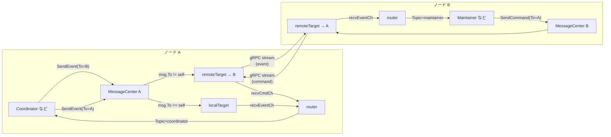

# 第3章 メッセージングとノード間通信

> **本章で読むソース**
>
> - [`pkg/messaging/message_center.go`](https://github.com/pingcap/ticdc/blob/v8.5.6/pkg/messaging/message_center.go)
> - [`pkg/messaging/message.go`](https://github.com/pingcap/ticdc/blob/v8.5.6/pkg/messaging/message.go)
> - [`pkg/messaging/router.go`](https://github.com/pingcap/ticdc/blob/v8.5.6/pkg/messaging/router.go)
> - [`pkg/messaging/remote_target.go`](https://github.com/pingcap/ticdc/blob/v8.5.6/pkg/messaging/remote_target.go)
> - [`pkg/messaging/local_target.go`](https://github.com/pingcap/ticdc/blob/v8.5.6/pkg/messaging/local_target.go)
> - [`pkg/messaging/stream.go`](https://github.com/pingcap/ticdc/blob/v8.5.6/pkg/messaging/stream.go)
> - [`pkg/messaging/topic.go`](https://github.com/pingcap/ticdc/blob/v8.5.6/pkg/messaging/topic.go)
> - [`pkg/messaging/proto/message.proto`](https://github.com/pingcap/ticdc/blob/v8.5.6/pkg/messaging/proto/message.proto)
> - [`pkg/config/messging.go`](https://github.com/pingcap/ticdc/blob/v8.5.6/pkg/config/messging.go)

## この章の狙い

第2章では TiCDC のサーバーアーキテクチャを俯瞰した。
TiCDC のクラスタは複数ノードで構成され、Coordinator、Maintainer、EventService、Dispatcher など多くのコンポーネントがノードをまたいで協調する。
この協調を支えるのが `pkg/messaging` パッケージの **MessageCenter** である。

本章では、MessageCenter がどのようにメッセージを送受信し、ローカルとリモートの宛先を透過的に扱い、gRPC ストリームで複数ノードをつなぐのかを読む。

## 前提

Go の goroutine と channel、gRPC の双方向ストリーミング（bidirectional streaming）の基本を前提とする。
protobuf によるシリアライズについては一般論として扱う。

## MessageCenter のインターフェイス

MessageCenter は3つの責務を持つ。
メッセージの送信、メッセージの受信、そしてクラスタのノード変更への追従である。
これらはインターフェイスとして分離されている。

[`pkg/messaging/message_center.go` L44-L50](https://github.com/pingcap/ticdc/blob/v8.5.6/pkg/messaging/message_center.go#L44-L50)

```go
type MessageCenter interface {
	MessageSender
	MessageReceiver
	// OnNodeChanges is called when the nodes in the cluster are changed. The message center should update the target list.
	OnNodeChanges(map[node.ID]*node.Info)
	Close()
}
```

送信側の `MessageSender` は、イベントとコマンドの2系統を区別する。

[`pkg/messaging/message_center.go` L55-L59](https://github.com/pingcap/ticdc/blob/v8.5.6/pkg/messaging/message_center.go#L55-L59)

```go
type MessageSender interface {
	SendEvent(msg *TargetMessage) error
	SendCommand(cmd *TargetMessage) error
	IsReadyToSend(target node.ID) bool
}
```

受信側の `MessageReceiver` は、Topic 文字列にハンドラを登録する形をとる。

[`pkg/messaging/message_center.go` L62-L65](https://github.com/pingcap/ticdc/blob/v8.5.6/pkg/messaging/message_center.go#L62-L65)

```go
type MessageReceiver interface {
	RegisterHandler(topic string, handler MessageHandler)
	DeRegisterHandler(topic string)
}
```

この設計により、送信元は宛先ノードの ID だけを指定すればよく、宛先がローカルかリモートかを意識しない。
受信側は Topic を鍵にしてハンドラを差し替えられるため、コンポーネントの起動順に依存しない疎結合が実現する。

## messageCenter の内部構造

実装構造体 `messageCenter` は、ローカルターゲット1つとリモートターゲットの集合を保持する。

[`pkg/messaging/message_center.go` L77-L103](https://github.com/pingcap/ticdc/blob/v8.5.6/pkg/messaging/message_center.go#L77-L103)

```go
type messageCenter struct {
	id       node.ID
	addr     string
	cfg      *config.MessageCenterConfig
	security *security.Credential
	localTarget *localMessageTarget
	remoteTargets struct {
		sync.RWMutex
		m map[node.ID]*remoteMessageTarget
	}
	// ... (中略) ...
	router     *router
	receiveEventCh chan *TargetMessage
	receiveCmdCh   chan *TargetMessage
	// ... (中略) ...
}
```

`receiveEventCh` と `receiveCmdCh` は、ローカルからもリモートからも書き込まれる集約チャネルである。
すべての受信メッセージがこの2本のチャネルに合流し、`router` が Topic に基づいてハンドラへ振り分ける。

チャネルサイズはデフォルトで 16K メッセージに設定される。

[`pkg/config/messging.go` L17-L18](https://github.com/pingcap/ticdc/blob/v8.5.6/pkg/config/messging.go#L17-L18)

```go
const (
	defaultCacheSize = 1024 * 16 // 16K messages
)
```

## メッセージ型と IOType

ノード間で交換されるメッセージの種別は **IOType** という整数列挙で表現される。
40種類を超える型が定義されており、大きく4つのカテゴリに分かれる。

[`pkg/messaging/message.go` L54-L107](https://github.com/pingcap/ticdc/blob/v8.5.6/pkg/messaging/message.go#L54-L107)

```go
const (
	TypeInvalid IOType = 0
	// LogService related
	TypeBatchDMLEvent    IOType = 1
	TypeDDLEvent         IOType = 2
	// ... (中略) ...

	// EventCollector related
	TypeHeartBeatRequest            IOType = 13
	TypeHeartBeatResponse           IOType = 14
	TypeScheduleDispatcherRequest   IOType = 15
	// ... (中略) ...

	// Coordinator related
	TypeCoordinatorBootstrapRequest      IOType = 24
	TypeCoordinatorBootstrapResponse     IOType = 25
	// ... (中略) ...

	TypeMessageHandShake IOType = 36
)
```

- **LogService 関連**（1-7）: DML バッチ、DDL、ResolvedTs など、変更イベントの配信に使う
- **EventCollector 関連**（13-23）: ハートビート、Dispatcher スケジュール、チェックポイント管理など
- **Coordinator 関連**（24-35, 37-41）: ブートストラップ、Maintainer の追加と削除、チェックサム検証など
- **ハンドシェイク**（36）: gRPC ストリーム確立時の接続初期化に使う

個々のメッセージペイロードは **IOTypeT** インターフェイスに従う。
`Marshal` と `Unmarshal` の2メソッドだけを要求する設計で、protobuf 生成型をそのまま差し込める。

[`pkg/messaging/message.go` L302-L305](https://github.com/pingcap/ticdc/blob/v8.5.6/pkg/messaging/message.go#L302-L305)

```go
type IOTypeT interface {
	Unmarshal(data []byte) error
	Marshal() (data []byte, err error)
}
```

受信時のデシリアライズは `decodeIOType` 関数が `IOType` 値で分岐し、対応する protobuf 構造体を生成してからバイト列をデコードする。

[`pkg/messaging/message.go` L307-L312](https://github.com/pingcap/ticdc/blob/v8.5.6/pkg/messaging/message.go#L307-L312)

```go
func decodeIOType(ioType IOType, value []byte) (IOTypeT, error) {
	var m IOTypeT
	switch ioType {
	case TypeBatchDMLEvent:
		m = &commonEvent.BatchDMLEvent{}
	case TypeDDLEvent:
```

## TargetMessage の構造

送信するメッセージは **TargetMessage** 構造体に包まれる。

[`pkg/messaging/message.go` L402-L415](https://github.com/pingcap/ticdc/blob/v8.5.6/pkg/messaging/message.go#L402-L415)

```go
type TargetMessage struct {
	From     node.ID
	To       node.ID
	Epoch    uint64
	Sequence uint64
	Topic    string
	Type     IOType
	Message  []IOTypeT
	CreateAt int64
	Group uint64
}
```

`From` と `To` がノード ID、`Topic` がルーティング先のコンポーネント名、`Type` がペイロードの種別、`Message` がペイロード本体のスライスである。
`Message` がスライスなのは、1つの `TargetMessage` に同型の複数ペイロードをまとめて載せられるようにするためである。

`Group` フィールドは、受信側が同じグループのメッセージを同一 goroutine で処理できるように振り分けるためのヒントである。

## Topic ベースのルーティング

受信メッセージの振り分けは **router** が担う。
`router` は Topic 文字列から `MessageHandler` へのマップを持ち、チャネルから取り出したメッセージを対応するハンドラに渡す。

[`pkg/messaging/router.go` L26-L37](https://github.com/pingcap/ticdc/blob/v8.5.6/pkg/messaging/router.go#L26-L37)

```go
type MessageHandler func(ctx context.Context, msg *TargetMessage) error

type router struct {
	mu       sync.RWMutex
	handlers map[string]MessageHandler
}

func newRouter() *router {
	return &router{
		handlers: make(map[string]MessageHandler),
	}
}
```

`runDispatch` はイベントチャネルまたはコマンドチャネルから1件ずつメッセージを取り出し、Topic に対応するハンドラを呼ぶ。
該当するハンドラがなければメッセージを捨てる。

[`pkg/messaging/router.go` L51-L68](https://github.com/pingcap/ticdc/blob/v8.5.6/pkg/messaging/router.go#L51-L68)

```go
func (r *router) runDispatch(ctx context.Context, out <-chan *TargetMessage) {
	lastSlowLogTime := time.Now()
	for {
		select {
		case <-ctx.Done():
			log.Info("router: close, since context done")
			return
		case msg := <-out:
			r.mu.RLock()
			handler, ok := r.handlers[msg.Topic]
			r.mu.RUnlock()
			if !ok {
				log.Debug("no handler for message, drop it", zap.Any("msg", msg))
				continue
			}
			start := time.Now()
			err := handler(ctx, msg)
```

`runDispatch` は `Run` メソッドの中でイベント用とコマンド用の2本の goroutine として起動される。

[`pkg/messaging/message_center.go` L140-L148](https://github.com/pingcap/ticdc/blob/v8.5.6/pkg/messaging/message_center.go#L140-L148)

```go
mc.g.Go(func() error {
	mc.router.runDispatch(ctx, mc.receiveEventCh)
	return nil
})

mc.g.Go(func() error {
	mc.router.runDispatch(ctx, mc.receiveCmdCh)
	return nil
})
```

Topic はコンポーネントごとに固定文字列として定義されている。

[`pkg/messaging/topic.go` L18-L41](https://github.com/pingcap/ticdc/blob/v8.5.6/pkg/messaging/topic.go#L18-L41)

```go
const (
	EventServiceTopic            = "EventServiceTopic"
	EventStoreTopic              = "event-store"
	LogCoordinatorTopic          = "log-coordinator"
	LogCoordinatorClientTopic    = "log-coordinator-client"
	EventCollectorTopic          = "event-collector"
	RedoEventCollectorTopic      = "redo-event-collector"
	CoordinatorTopic             = "coordinator"
	MaintainerManagerTopic       = "maintainer-manager"
	MaintainerTopic              = "maintainer"
	HeartbeatCollectorTopic      = "heartbeat-collector"
	DispatcherManagerManagerTopic = "dispatcher-manager-manager"
)
```

Coordinator、Maintainer、EventService などの各コンポーネントが起動時に自身の Topic でハンドラを登録し、他ノードからのメッセージを受け取る。

## ローカルターゲット

宛先が自ノードの場合、メッセージは gRPC を経由せず Go のチャネルに直接投入される。
この経路を担うのが **localMessageTarget** である。

[`pkg/messaging/local_target.go` L28-L40](https://github.com/pingcap/ticdc/blob/v8.5.6/pkg/messaging/local_target.go#L28-L40)

```go
type localMessageTarget struct {
	localId  node.ID
	sequence atomic.Uint64
	recvEventCh chan *TargetMessage
	recvCmdCh   chan *TargetMessage
	sendEventCounter   prometheus.Counter
	dropMessageCounter prometheus.Counter
	sendCmdCounter     prometheus.Counter
}
```

`sendMsgToChan` がチャネルへの書き込みを行う。
チャネルが満杯のときはブロックせず、`ErrorTypeMessageCongested` エラーを即座に返す。

[`pkg/messaging/local_target.go` L80-L94](https://github.com/pingcap/ticdc/blob/v8.5.6/pkg/messaging/local_target.go#L80-L94)

```go
func (s *localMessageTarget) sendMsgToChan(ch chan *TargetMessage, msg ...*TargetMessage) error {
	for i, m := range msg {
		m.To = s.localId
		m.From = s.localId
		m.Sequence = s.sequence.Add(1)
		select {
		case ch <- m:
		default:
			remains := len(msg) - i
			s.dropMessageCounter.Add(float64(remains))
			return AppError{Type: ErrorTypeMessageCongested, Reason: "Send message is congested"}
		}
	}
	return nil
}
```

ローカルターゲットが保持する `recvEventCh` と `recvCmdCh` は、`messageCenter` の `receiveEventCh` と `receiveCmdCh` そのものである。
コンストラクタで同じチャネルを渡しているため、ローカルメッセージはシリアライズもネットワーク転送もなく router に到達する。

[`pkg/messaging/message_center.go` L111-L119](https://github.com/pingcap/ticdc/blob/v8.5.6/pkg/messaging/message_center.go#L111-L119)

```go
receiveEventCh := make(chan *TargetMessage, cfg.CacheChannelSize)
receiveCmdCh := make(chan *TargetMessage, cfg.CacheChannelSize)

mc := &messageCenter{
	id:             id,
	// ... (中略) ...
	localTarget:    newLocalMessageTarget(id, receiveEventCh, receiveCmdCh),
	receiveEventCh: receiveEventCh,
	receiveCmdCh:   receiveCmdCh,
```

## リモートターゲットと gRPC ストリーム

宛先が他ノードの場合は **remoteMessageTarget** が通信を担う。
リモートターゲットは1つの gRPC 接続上にイベント用とコマンド用の2本の双方向ストリームを維持する。

[`pkg/messaging/remote_target.go` L57-L102](https://github.com/pingcap/ticdc/blob/v8.5.6/pkg/messaging/remote_target.go#L57-L102)

```go
type remoteMessageTarget struct {
	messageCenterID node.ID
	localAddr       string
	targetId        node.ID
	targetAddr      string
	security        *security.Credential

	streams sync.Map // string(streamType) -> *streamSession

	conn struct {
		sync.RWMutex
		c *grpc.ClientConn
	}

	sendEventCh chan *proto.Message
	sendCmdCh   chan *proto.Message

	recvEventCh chan *TargetMessage
	recvCmdCh   chan *TargetMessage
	// ... (中略) ...
	isInitiator bool
}
```

`sendEventCh` と `sendCmdCh` はシリアライズ済みの `proto.Message` を送信 goroutine に渡すためのバッファチャネルである。
`recvEventCh` と `recvCmdCh` は `messageCenter` の集約チャネルへの参照で、受信した `TargetMessage` をそのまま書き込む。

ワイヤ上のメッセージ形式は protobuf で定義される。

[`pkg/messaging/proto/message.proto` L5-L16](https://github.com/pingcap/ticdc/blob/v8.5.6/pkg/messaging/proto/message.proto#L5-L16)

```protobuf
message Message {
    int32 type = 1;
    string from = 2;
    string to = 3;
    string topic = 4;
    repeated bytes payload = 5;
}
```

`payload` が `repeated bytes` である点が重要である。
1つの `proto.Message` に複数のペイロードをまとめて載せられるため、同じ型のメッセージを1回の gRPC 送信にバッチ化できる。

gRPC サービス定義は双方向ストリーミングの `streamMessages` RPC 1つだけである。

[`pkg/messaging/proto/message.proto` L18-L20](https://github.com/pingcap/ticdc/blob/v8.5.6/pkg/messaging/proto/message.proto#L18-L20)

```protobuf
service MessageService {
    rpc streamMessages(stream Message) returns (stream Message);
}
```

## 接続の確立とハンドシェイク

2ノード間で接続を確立する側は一方に固定される。
アドレスの辞書順比較で、アドレスが小さい側が接続を開始する（`isInitiator`）。

[`pkg/messaging/remote_target.go` L178-L179](https://github.com/pingcap/ticdc/blob/v8.5.6/pkg/messaging/remote_target.go#L178-L179)

```go
	shouldInitiate := localAddr < targetAddr
```

この規則により、A-B 間の接続は常に一方からしか張られず、重複接続が生じない。

接続開始側はイベント用とコマンド用の2つのストリームを開き、それぞれでハンドシェイクメッセージを送る。

[`pkg/messaging/remote_target.go` L328-L348](https://github.com/pingcap/ticdc/blob/v8.5.6/pkg/messaging/remote_target.go#L328-L348)

```go
		handshake := &HandshakeMessage{
			Version:    1,
			Timestamp:  time.Now().Unix(),
			StreamType: streamType,
		}

		hsBytes, err := handshake.Marshal()
		// ... (中略) ...

		msg := &proto.Message{
			From:    string(s.messageCenterID),
			To:      string(s.targetId),
			Type:    int32(TypeMessageHandShake),
			Payload: [][]byte{hsBytes},
		}

		if err := gs.Send(msg); err != nil {
```

受信側の gRPC サーバーは、最初のメッセージをハンドシェイクとして処理し、`StreamType` フィールドでイベント用かコマンド用かを判別する。

[`pkg/messaging/message_center.go` L426-L442](https://github.com/pingcap/ticdc/blob/v8.5.6/pkg/messaging/message_center.go#L426-L442)

```go
func (s *grpcServer) handleConnect(stream proto.MessageService_StreamMessagesServer) error {
	msg, err := stream.Recv()
	if err != nil {
		return err
	}

	if msg.Type != int32(TypeMessageHandShake) {
		log.Panic("Received unexpected message type, should be handshake",
			// ... (中略) ...
		)
	}

	handshake := &HandshakeMessage{}
	if err := handshake.Unmarshal(msg.Payload[0]); err != nil {
		log.Warn("failed to unmarshal handshake message", zap.Error(err))
		return err
	}
```

ハンドシェイク後、受信側は `handleIncomingStream` を呼んでストリームセッションを登録し、送受信ループを開始する。

## 送信と受信のループ

各ストリームに対して送信用と受信用の2つの goroutine が起動される。

[`pkg/messaging/remote_target.go` L468-L482](https://github.com/pingcap/ticdc/blob/v8.5.6/pkg/messaging/remote_target.go#L468-L482)

```go
func (s *remoteMessageTarget) run(eg *errgroup.Group, ctx context.Context, streamType string) {
	eg.Go(func() error {
		return s.runReceiveMessages(ctx, streamType)
	})
	eg.Go(func() error {
		return s.runSendMessages(ctx, streamType)
	})
	// ... (中略) ...
}
```

送信ループ（`runSendMessages`）は、`sendEventCh` または `sendCmdCh` からシリアライズ済みの `proto.Message` を取り出し、gRPC ストリームに書き込む。

[`pkg/messaging/remote_target.go` L530-L557](https://github.com/pingcap/ticdc/blob/v8.5.6/pkg/messaging/remote_target.go#L530-L557)

```go
	sendCh := s.sendEventCh
	if streamType == streamTypeCommand {
		sendCh = s.sendCmdCh
	}
	for {
		select {
		case <-ctx.Done():
			return ctx.Err()
		case msg := <-sendCh:
			// ... (中略) ...
			if err := gs.Send(msg); err != nil {
				// ... (中略) ...
				return err
			}
		}
	}
```

受信ループ（`runReceiveMessages`）は gRPC ストリームからメッセージを読み取り、ペイロードを `decodeIOType` でデシリアライズして `TargetMessage` に組み立て、集約チャネルに投入する。

[`pkg/messaging/remote_target.go` L616-L658](https://github.com/pingcap/ticdc/blob/v8.5.6/pkg/messaging/remote_target.go#L616-L658)

```go
func (s *remoteMessageTarget) handleIncomingMessage(ctx context.Context, stream grpcStream, ch chan *TargetMessage) error {
	for {
		// ... (中略) ...
		message, err := stream.Recv()
		// ... (中略) ...
		mt := IOType(message.Type)
		targetMsg := &TargetMessage{
			From:  node.ID(message.From),
			To:    node.ID(message.To),
			Topic: message.Topic,
			Type:  mt,
		}

		for _, payload := range message.Payload {
			msg, err := decodeIOType(mt, payload)
			// ... (中略) ...
			targetMsg.Message = append(targetMsg.Message, msg)
		}

		ch <- targetMsg
	}
}
```

## SendEvent の分岐

`messageCenter.SendEvent` は、宛先ノード ID が自ノードならローカルターゲット、他ノードならリモートターゲットを選んでメッセージを渡す。

[`pkg/messaging/message_center.go` L274-L304](https://github.com/pingcap/ticdc/blob/v8.5.6/pkg/messaging/message_center.go#L274-L304)

```go
func (mc *messageCenter) SendEvent(msg *TargetMessage) error {
	if msg == nil {
		return nil
	}
	// ... (中略) ...
	if msg.To == mc.id {
		return mc.localTarget.sendEvent(msg)
	}

	mc.remoteTargets.RLock()
	target, ok := mc.remoteTargets.m[msg.To]
	mc.remoteTargets.RUnlock()
	if !ok {
		return pkgerror.AppError{Type: pkgerror.ErrorTypeTargetNotFound,
			Reason: fmt.Sprintf("Target %s not found", msg.To)}
	}
	return target.sendEvent(msg)
}
```

リモートターゲットの `sendEvent` は、`sendEventCh` への書き込みを試みる。
チャネルが満杯の場合はブロックせず、`ErrorTypeMessageCongested` を返す。

[`pkg/messaging/remote_target.go` L117-L137](https://github.com/pingcap/ticdc/blob/v8.5.6/pkg/messaging/remote_target.go#L117-L137)

```go
func (s *remoteMessageTarget) sendEvent(msg ...*TargetMessage) error {
	// ... (中略) ...
	protoMsg := s.newMessage(msg...)

	select {
	case <-s.ctx.Done():
		// ... (中略) ...
	case s.sendEventCh <- protoMsg:
		s.sendEventCounter.Add(float64(len(msg)))
		return nil
	default:
		s.congestedEventErrorCounter.Inc()
		return AppError{Type: ErrorTypeMessageCongested, ...}
	}
}
```

この非ブロッキング設計により、下流が遅れても送信側の goroutine がブロックされることはない。
呼び出し元は `ErrorTypeMessageCongested` を受け取ったらリトライするか、メッセージを破棄する判断を自身で行う。

## ノード変更の追従と再接続

クラスタのメンバーシップが変わると、`OnNodeChanges` が呼ばれて通知チャネルに新しいノードリストを投入する。

[`pkg/messaging/message_center.go` L199-L202](https://github.com/pingcap/ticdc/blob/v8.5.6/pkg/messaging/message_center.go#L199-L202)

```go
func (mc *messageCenter) OnNodeChanges(activeNode map[node.ID]*node.Info) {
	mc.notifyCh <- activeNode
	log.Info("notify node changes", zap.Any("activeNode", activeNode))
}
```

`checkRemoteTarget` ループがこの通知を受け取り、新しいノードにはリモートターゲットを追加し、消えたノードのリモートターゲットは削除する。
同時に、既存のリモートターゲットにエラーが蓄積していれば接続をリセットする。

[`pkg/messaging/message_center.go` L164-L189](https://github.com/pingcap/ticdc/blob/v8.5.6/pkg/messaging/message_center.go#L164-L189)

```go
func (mc *messageCenter) checkRemoteTarget(ctx context.Context) {
	ticker := time.NewTicker(messageCenterCheckInterval)
	defer ticker.Stop()
	for {
		select {
		case <-ctx.Done():
			return
		case <-ticker.C:
			mc.remoteTargets.RLock()
			for _, target := range mc.remoteTargets.m {
				if err := target.getErr(); err != nil {
					// ... (中略) ...
					target.resetConnect()
				}
			}
			mc.remoteTargets.RUnlock()
		case activeNode := <-mc.notifyCh:
			mc.handleNodeChanges(activeNode)
		}
	}
}
```

## メッセージフローの全体像

以下の図は、ノード A のコンポーネント（Coordinator など）がノード B のコンポーネント（Maintainer など）へイベントを送り、応答としてコマンドが戻る流れを示す。



ローカル宛のメッセージは gRPC を迂回してチャネルに直接入る。
リモート宛のメッセージはイベントとコマンドが別ストリームで運ばれ、受信側の集約チャネルに合流してから router が Topic で振り分ける。

## 高速化の工夫: イベントとコマンドのストリーム分離

MessageCenter はイベントとコマンドを別々の gRPC ストリームで送受信する。
これは単なる論理的な分類ではなく、性能上の意図がある。

イベント（DML バッチ、ResolvedTs）はデータ量が大きく高頻度で流れる。
コマンド（ハートビート応答、スケジュール指示）は小さいが遅延に敏感である。
両者を同一ストリームに混ぜると、大量のイベントがコマンドの送信を遅延させる head-of-line blocking が発生しうる。

ストリーム分離はこの問題を防ぐ。
送信チャネルもイベント用（`sendEventCh`）とコマンド用（`sendCmdCh`）に分かれており、送信 goroutine もストリームごとに独立して動く。

[`pkg/messaging/remote_target.go` L38-L48](https://github.com/pingcap/ticdc/blob/v8.5.6/pkg/messaging/remote_target.go#L38-L48)

```go
const (
	reconnectInterval = 2 * time.Second
	streamTypeEvent   = "event"
	streamTypeCommand = "command"

	eventRecvCh   = "eventRecvCh"
	commandRecvCh = "commandRecvCh"

	eventSendCh   = "eventSendCh"
	commandSendCh = "commandSendCh"
)
```

受信側でも `receiveEventCh` と `receiveCmdCh` が分離され、router の `runDispatch` がそれぞれ専用の goroutine で処理する。
イベントの処理が遅れてもコマンドの配信には影響しない。

## 高速化の工夫: ペイロードバッチと非ブロッキング送信

`proto.Message` の `payload` フィールドは `repeated bytes` であるため、同一型の複数メッセージを1回の gRPC `Send` で送信できる。
`newMessage` メソッドは複数の `TargetMessage` を受け取り、全ペイロードを1つの `proto.Message` に詰める。

[`pkg/messaging/remote_target.go` L663-L690](https://github.com/pingcap/ticdc/blob/v8.5.6/pkg/messaging/remote_target.go#L663-L690)

```go
func (s *remoteMessageTarget) newMessage(msg ...*TargetMessage) *proto.Message {
	msgBytes := make([][]byte, 0, len(msg))
	for _, tm := range msg {
		for _, im := range tm.Message {
			buf, err := im.Marshal()
			// ... (中略) ...
			msgBytes = append(msgBytes, buf)
		}
	}
	protoMsg := &proto.Message{
		From:    string(s.messageCenterID),
		To:      string(s.targetId),
		Topic:   string(msg[0].Topic),
		Type:    int32(msg[0].Type),
		Payload: msgBytes,
	}
	return protoMsg
}
```

送信側は `select` の `default` 節でチャネル書き込みを試みるため、チャネルが満杯ならブロックせず即座にエラーを返す。
これにより、下流の輻輳が送信側の goroutine を止めることはなく、呼び出し元がバックプレッシャーを自身の戦略で処理できる。

## まとめ

MessageCenter は TiCDC クラスタのノード間通信を一手に担う中央ハブである。
ローカル宛はチャネル直接投入、リモート宛は gRPC 双方向ストリームという経路の違いを `SendEvent` と `SendCommand` の裏に隠し、呼び出し元にはノード ID と Topic の指定だけを求める。

受信側は Topic ベースの router がメッセージをコンポーネントに振り分け、コンポーネントの登録と解除で動的にルーティングを変更できる。
イベントとコマンドを別ストリームに分離して head-of-line blocking を防ぎ、ペイロードの `repeated bytes` でバッチ送信を可能にし、非ブロッキングの送信チャネルでバックプレッシャーを呼び出し元に委ねる設計が、高スループットと低遅延の両立を支えている。

## 関連する章

- 第2章「サーバーアーキテクチャ」: MessageCenter がサーバー起動時にどう初期化されるか
- 第7章「EventService とイベント配信」: EventService が MessageCenter を通じてイベントを Dispatcher へ送る流れ
- 第8章「Dispatcher と EventCollector」: EventCollector が MessageCenter からイベントを受け取る仕組み
- 第12章「Coordinator と Changefeed 管理」: Coordinator が MessageCenter を通じて Maintainer と通信するハートビートの詳細
- 第13章「Maintainer とテーブルスケジューリング」: Maintainer が MessageCenter 経由で Dispatcher のスケジュールを指示する流れ
