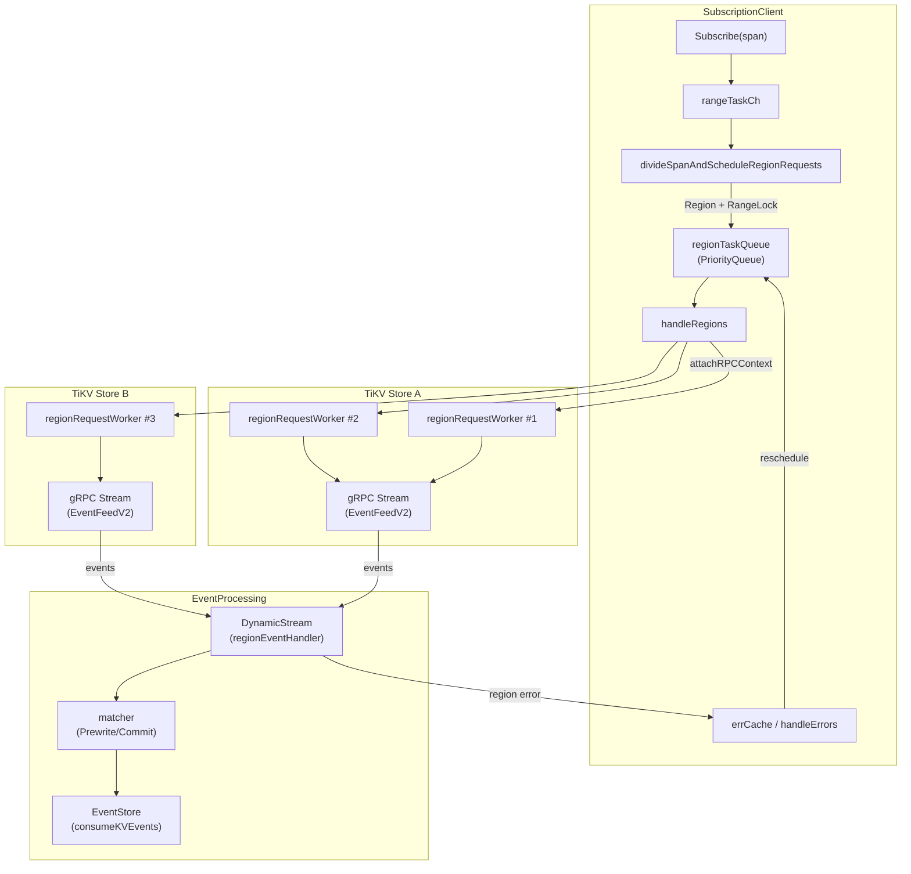

# 第4章 LogPuller と TiKV Change Feed

> **本章で読むソース**
>
> - [`logservice/logpuller/subscription_client.go`](https://github.com/pingcap/ticdc/blob/v8.5.6/logservice/logpuller/subscription_client.go)
> - [`logservice/logpuller/region_request_worker.go`](https://github.com/pingcap/ticdc/blob/v8.5.6/logservice/logpuller/region_request_worker.go)
> - [`logservice/logpuller/region_event_handler.go`](https://github.com/pingcap/ticdc/blob/v8.5.6/logservice/logpuller/region_event_handler.go)
> - [`logservice/logpuller/region_state.go`](https://github.com/pingcap/ticdc/blob/v8.5.6/logservice/logpuller/region_state.go)
> - [`logservice/logpuller/grpc_conn.go`](https://github.com/pingcap/ticdc/blob/v8.5.6/logservice/logpuller/grpc_conn.go)
> - [`logservice/logpuller/region_req_cache.go`](https://github.com/pingcap/ticdc/blob/v8.5.6/logservice/logpuller/region_req_cache.go)
> - [`logservice/logpuller/priority_queue.go`](https://github.com/pingcap/ticdc/blob/v8.5.6/logservice/logpuller/priority_queue.go)
> - [`logservice/logpuller/txn_matcher.go`](https://github.com/pingcap/ticdc/blob/v8.5.6/logservice/logpuller/txn_matcher.go)
> - [`logservice/logpuller/priority_task.go`](https://github.com/pingcap/ticdc/blob/v8.5.6/logservice/logpuller/priority_task.go)

## この章の狙い

TiCDC の変更データキャプチャは、TiKV が公開する **Change Data API**(gRPC ストリーム)から Region 単位の KV イベントを受信するところから始まる。
この受信層を担うのが `logpuller` パッケージである。

本章では、テーブルスパンの購読要求が TiKV の Region 単位のリクエストに変換される過程、gRPC ストリーム上のイベント受信とディスパッチ、トランザクションの Prewrite/Commit マッチング、ResolvedTs の集約、そして障害時の再購読までを読む。

## 前提

- TiKV は Region ごとに Raft リーダーがデータを管理する。
  変更データの購読も Region リーダーに対して行う。
- TiKV が公開する `ChangeData.EventFeedV2` gRPC ストリームは、1本のストリームに複数 Region の購読を多重化できる(**Stream Multiplexing**)。
- TiCDC がキャプチャしたい範囲は「テーブルスパン」(キーの範囲)で表されるが、1つのスパンが複数の Region にまたがることがある。

## 全体のアーキテクチャ



## SubscriptionClient のインタフェースと初期化

`SubscriptionClient` は、テーブルスパン単位の購読を管理するインタフェースである。

[`logservice/logpuller/subscription_client.go` L166-L183](https://github.com/pingcap/ticdc/blob/v8.5.6/logservice/logpuller/subscription_client.go#L166-L183)

```go
type SubscriptionClient interface {
	common.SubModule
	// allocate a unique id for the subscription
	AllocSubscriptionID() SubscriptionID
	// subscribe a table span
	Subscribe(
		subID SubscriptionID,
		span heartbeatpb.TableSpan,
		startTs uint64,
		consumeKVEvents func(raw []common.RawKVEntry, wakeCallback func()) bool,
		advanceResolvedTs func(ts uint64),
		advanceInterval int64,
		bdrMode bool,
	)
	// unsubscribe a table span
	Unsubscribe(subID SubscriptionID)
}
```

`Subscribe` の引数のうち、`consumeKVEvents` と `advanceResolvedTs` は EventStore が渡すコールバックである。
LogPuller が TiKV から受信したイベントをデコードし、これらのコールバック経由で EventStore に通知する。

実装の `subscriptionClient` は初期化時に DynamicStream を構築する。

[`logservice/logpuller/subscription_client.go` L254-L266](https://github.com/pingcap/ticdc/blob/v8.5.6/logservice/logpuller/subscription_client.go#L254-L266)

```go
option := dynstream.NewOption()
option.BatchCount = 1024
option.UseBuffer = true
option.EnableMemoryControl = true
ds := dynstream.NewParallelDynamicStream(
	"log-puller",
	&regionEventHandler{subClient: subClient},
	option,
)
ds.Start()
subClient.ds = ds
subClient.cond = sync.NewCond(&subClient.mu)
```

`BatchCount = 1024` は、TiKV から受信した KV エントリのバッチサイズ上限を指定する。
`UseBuffer = true` は、`regionEventHandler.Handle` 内部で DynamicStream の `RemovePath` を呼ぶパスがあるためデッドロック回避に必要となる[^deadlock-note]。
`EnableMemoryControl = true` はメモリ使用量の制御を有効にし、1 サブスクリプションあたり最大 1 GB のペンディングサイズを許容する。

[^deadlock-note]: コード中のコメント(L256-L258)に経緯が記されている。`Handle` から `RemovePath` を呼ぶと、`RemovePath` がイベントチャネルへ送信するため、`UseBuffer = false` ではデッドロックが発生する。

## 購読の開始: スパンから Region へ

### Subscribe の処理

`Subscribe` はテーブルスパンを受け取り、`subscribedSpan` を作成して `rangeTaskCh` にタスクを送信する。

[`logservice/logpuller/subscription_client.go` L351-L381](https://github.com/pingcap/ticdc/blob/v8.5.6/logservice/logpuller/subscription_client.go#L351-L381)

```go
func (s *subscriptionClient) Subscribe(
	subID SubscriptionID,
	span heartbeatpb.TableSpan,
	startTs uint64,
	// ... (中略) ...
) {
	// ... (中略) ...
	rt := s.newSubscribedSpan(subID, span, startTs, consumeKVEvents, advanceResolvedTs, advanceInterval, bdrMode)
	s.totalSpans.Lock()
	s.totalSpans.spanMap[subID] = rt
	s.totalSpans.Unlock()

	areaSetting := dynstream.NewAreaSettingsWithMaxPendingSize(1*1024*1024*1024, dynstream.MemoryControlForPuller, "logPuller") // 1GB
	s.ds.AddPath(rt.subID, rt, areaSetting)

	select {
	case <-s.ctx.Done():
		log.Warn("subscribes span failed, the subscription client has closed")
	case s.rangeTaskCh <- rangeTask{span: span, subscribedSpan: rt, filterLoop: rt.filterLoop, priority: TaskLowPrior}:
	}
}
```

`subscribedSpan` はスパン全体の状態を保持する構造体で、`rangeLock`(Region 範囲ロック)、KV イベントのキャッシュ、ResolvedTs を持つ。

[`logservice/logpuller/subscription_client.go` L109-L146](https://github.com/pingcap/ticdc/blob/v8.5.6/logservice/logpuller/subscription_client.go#L109-L146)

```go
type subscribedSpan struct {
	subID   SubscriptionID
	startTs uint64
	filterLoop bool

	span heartbeatpb.TableSpan
	rangeLock *regionlock.RangeLock

	consumeKVEvents func(events []common.RawKVEntry, wakeCallback func()) bool
	advanceResolvedTs func(ts uint64)
	advanceInterval int64
	kvEventsCache []common.RawKVEntry
	// ... (中略) ...
	resolvedTs        atomic.Uint64
}
```

### スパンの Region 分割

`handleRangeTasks` ゴルーチンが `rangeTaskCh` からタスクを取り出し、`divideSpanAndScheduleRegionRequests` で PD からリージョン情報をロードする。

[`logservice/logpuller/subscription_client.go` L694-L708](https://github.com/pingcap/ticdc/blob/v8.5.6/logservice/logpuller/subscription_client.go#L694-L708)

```go
func (s *subscriptionClient) handleRangeTasks(ctx context.Context) error {
	g, ctx := errgroup.WithContext(ctx)
	g.SetLimit(1024)
	for {
		select {
		case <-ctx.Done():
			return ctx.Err()
		case task := <-s.rangeTaskCh:
			g.Go(func() error {
				return s.divideSpanAndScheduleRegionRequests(ctx, task.span, task.subscribedSpan, task.filterLoop, task.priority)
			})
		}
	}
}
```

同時実行数を 1024 に制限している点が重要である。
これにより、大量のスパン購読が一度に来ても PD への負荷を抑制できる。

`divideSpanAndScheduleRegionRequests` は PD の `BatchLoadRegionsWithKeyRange` を呼び出し、返された Region メタデータと購読スパンの交差部分を求め、Region 単位のリクエストに変換する。

[`logservice/logpuller/subscription_client.go` L738-L793](https://github.com/pingcap/ticdc/blob/v8.5.6/logservice/logpuller/subscription_client.go#L738-L793)

```go
backoff := tikv.NewBackoffer(ctx, tikvRequestMaxBackoff)
regions, err := s.regionCache.BatchLoadRegionsWithKeyRange(backoff, nextSpan.StartKey, nextSpan.EndKey, limit)
// ... (中略) ...
regionMetas = regionlock.CutRegionsLeftCoverSpan(regionMetas, nextSpan)
// ... (中略) ...
for _, regionMeta := range regionMetas {
	// ... (中略) ...
	intersectSpan := common.GetIntersectSpan(subscribedSpan.span, regionSpan)
	// ... (中略) ...
	verID := tikv.NewRegionVerID(regionMeta.Id, regionMeta.RegionEpoch.ConfVer, regionMeta.RegionEpoch.Version)
	regionInfo := newRegionInfo(verID, intersectSpan, nil, subscribedSpan, filterLoop)
	s.scheduleRegionRequest(ctx, regionInfo, taskType)
	// ... (中略) ...
}
```

一度にロードする Region 数は `limit = 1024` で制限される。
ロード結果が購読スパンの末端に達していなければ、`nextSpan.StartKey` を更新してループが続く。

### RangeLock による重複防止

Region リクエストをスケジュールする前に、`rangeLock.LockRange` で同一キー範囲の重複購読を防ぐ。

[`logservice/logpuller/subscription_client.go` L798-L817](https://github.com/pingcap/ticdc/blob/v8.5.6/logservice/logpuller/subscription_client.go#L798-L817)

```go
func (s *subscriptionClient) scheduleRegionRequest(ctx context.Context, region regionInfo, priority TaskType) {
	lockRangeResult := region.subscribedSpan.rangeLock.LockRange(
		ctx, region.span.StartKey, region.span.EndKey, region.verID.GetID(), region.verID.GetVer())

	if lockRangeResult.Status == regionlock.LockRangeStatusWait {
		lockRangeResult = lockRangeResult.WaitFn()
	}

	switch lockRangeResult.Status {
	case regionlock.LockRangeStatusSuccess:
		region.lockedRangeState = lockRangeResult.LockedRangeState
		s.regionTaskQueue.Push(NewRegionPriorityTask(priority, region, s.pdClock.CurrentTS()))
	case regionlock.LockRangeStatusStale:
		for _, r := range lockRangeResult.RetryRanges {
			s.scheduleRangeRequest(ctx, r, region.subscribedSpan, region.filterLoop, priority)
		}
	default:
		return
	}
}
```

ロックが `LockRangeStatusStale` を返した場合、古い Region 情報で購読を試みたことを意味する。
この場合、`RetryRanges` として返された新しい範囲で再度スパン分割からやり直す。

## PriorityQueue による Region タスクの優先度制御

Region 単位のリクエストは `PriorityQueue`(ヒープベースの優先度付きキュー)に投入される。

[`logservice/logpuller/priority_queue.go` L26-L39](https://github.com/pingcap/ticdc/blob/v8.5.6/logservice/logpuller/priority_queue.go#L26-L39)

```go
type PriorityQueue struct {
	mu   sync.Mutex
	heap *heap.Heap[PriorityTask]
	signal chan struct{}
}
```

`Push` はノンブロッキング、`Pop` はシグナルチャネルを使ったブロッキング操作である。

タスクの優先度は `regionPriorityTask.Priority()` で計算される。

[`logservice/logpuller/priority_task.go` L82-L106](https://github.com/pingcap/ticdc/blob/v8.5.6/logservice/logpuller/priority_task.go#L82-L106)

```go
func (pt *regionPriorityTask) Priority() int {
	basePriority := 0
	switch pt.taskType {
	case TaskHighPrior:
		basePriority = highPriorityBase // 0
	case TaskLowPrior:
		basePriority = lowPriorityBase  // 86400 (1日)
	}

	waitTime := time.Since(pt.createTime)
	timeBonus := int(waitTime.Seconds())

	resolvedTsLag := oracle.GetTimeFromTS(pt.currentTs).Sub(oracle.GetTimeFromTS(pt.regionInfo.subscribedSpan.resolvedTs.Load()))
	resolvedTsLagPenalty := int(resolvedTsLag.Seconds())

	priority := basePriority - timeBonus + resolvedTsLagPenalty
	// ... (中略) ...
	return priority
}
```

優先度の計算は3つの要素で構成される。

1. **ベース優先度**: エラーによる再購読(`TaskHighPrior`)は 0、新規購読(`TaskLowPrior`)は 86400(1日分の秒数)
2. **待ち時間ボーナス**: キューで待った時間(秒)を減算し、長く待ったタスクの優先度を上げる
3. **ResolvedTs 遅延ペナルティ**: 現在時刻と ResolvedTs の差(秒)を加算し、遅延が大きいスパンの優先度を下げる

障害復旧のためのリクエストは新規購読より優先されつつ、ResolvedTs が大きく遅延しているスパンは後回しにされる。

## gRPC 接続と Region リクエストの送信

### gRPC 接続の確立

TiKV との接続は `Connect` 関数で確立される。

[`logservice/logpuller/grpc_conn.go` L115-L128](https://github.com/pingcap/ticdc/blob/v8.5.6/logservice/logpuller/grpc_conn.go#L115-L128)

```go
func Connect(ctx context.Context, credential *security.Credential, target string) (*ConnAndClient, error) {
	clientConn, err := createGRPCConn(ctx, credential, target)
	if err != nil {
		return nil, err
	}

	rpc := cdcpb.NewChangeDataClient(clientConn)
	ctx = getContextFromFeatures(ctx, []string{rpcMetaFeatureStreamMultiplexing})
	client, err := rpc.EventFeedV2(ctx)
	return &ConnAndClient{
		Conn:   clientConn,
		Client: client,
	}, err
}
```

gRPC メタデータに `stream-multiplexing` フィーチャーフラグを設定する。
これにより、TiKV は同一ストリーム上で `RequestId` ごとに ResolvedTs をバケット化して送信する。

[`logservice/logpuller/grpc_conn.go` L48-L57](https://github.com/pingcap/ticdc/blob/v8.5.6/logservice/logpuller/grpc_conn.go#L48-L57)

```go
// this feature supports these interactions with TiKV sides:
// 1. in one GRPC stream, TiKV will merge resolved timestamps into several buckets based on
//    `RequestId`s. For example, region 100 and 101 have been subscribed twice with `RequestId`
//    1 and 2, TiKV will sends a ResolvedTs message
//    [{"RequestId": 1, "regions": [100, 101]}, {"RequestId": 2, "regions": [100, 101]}]
//    to the TiCDC client.
// 2. TiCDC can deregister all regions with a same request ID by specifying the `RequestId`.
rpcMetaFeatureStreamMultiplexing string = "stream-multiplexing"
```

gRPC 接続のチューニングパラメーターは以下のとおりである。

[`logservice/logpuller/grpc_conn.go` L41-L44](https://github.com/pingcap/ticdc/blob/v8.5.6/logservice/logpuller/grpc_conn.go#L41-L44)

```go
const (
	grpcInitialWindowSize     = (1 << 16) - 1
	grpcInitialConnWindowSize = 1 << 23
	grpcMaxCallRecvMsgSize    = 1 << 28
```

受信メッセージの最大サイズは 256 MB (`1 << 28`) に設定されている。

### handleRegions: Store ごとのワーカー割り当て

`handleRegions` ゴルーチンは `PriorityQueue` からタスクを取り出し、Region リーダーのアドレスを解決して、対応する Store のワーカーにリクエストを振り分ける。

[`logservice/logpuller/subscription_client.go` L552-L648](https://github.com/pingcap/ticdc/blob/v8.5.6/logservice/logpuller/subscription_client.go#L552-L648)

```go
func (s *subscriptionClient) handleRegions(ctx context.Context, eg *errgroup.Group) error {
	getStore := func(storeAddr string) *requestedStore {
		var rs *requestedStore
		if v, ok := s.stores.Load(storeAddr); ok {
			rs = v.(*requestedStore)
			return rs
		}
		rs = &requestedStore{storeAddr: storeAddr}
		s.stores.Store(storeAddr, rs)
		// ... (中略) ...
		for i := uint(0); i < s.config.RegionRequestWorkerPerStore; i++ {
			requestWorker := newRegionRequestWorker(ctx, s, s.credential, eg, rs, perWorkerQueueSize)
			// ... (中略) ...
		}
		return rs
	}
	// ... (中略) ...
	for {
		regionTask, err := s.regionTaskQueue.Pop(ctx)
		// ... (中略) ...
		region, ok := s.attachRPCContextForRegion(ctx, region)
		if !ok {
			continue
		}
		store := getStore(region.rpcCtx.Addr)
		worker := store.getRequestWorker()
		// ... (中略) ...
	}
}
```

初めて見る Store アドレスに対しては、設定に従い複数の `regionRequestWorker` を生成する。
各 Store の `requestedStore` は `nextWorker` カウンタでラウンドロビンにワーカーを選択する。

[`logservice/logpuller/subscription_client.go` L542-L548](https://github.com/pingcap/ticdc/blob/v8.5.6/logservice/logpuller/subscription_client.go#L542-L548)

```go
func (rs *requestedStore) getRequestWorker() *regionRequestWorker {
	rs.requestWorkers.RLock()
	defer rs.requestWorkers.RUnlock()
	index := rs.nextWorker.Add(1) % uint32(len(rs.requestWorkers.s))
	return rs.requestWorkers.s[index]
}
```

### regionRequestWorker: gRPC ストリームの運用

各ワーカーは専用のゴルーチンで動作し、gRPC ストリームの確立、リクエスト送信、イベント受信を行う。

[`logservice/logpuller/region_request_worker.go` L101-L147](https://github.com/pingcap/ticdc/blob/v8.5.6/logservice/logpuller/region_request_worker.go#L101-L147)

```go
g.Go(func() error {
	for {
		if err := waitForPreFetching(); err != nil {
			return err
		}
		var regionErr error
		if err := version.CheckStoreVersion(ctx, worker.client.pd); err != nil {
			// ... (中略) ...
		} else {
			if canceled := worker.run(ctx, credential); canceled {
				return nil
			}
			regionErr = &sendRequestToStoreErr{}
		}
		for subID, m := range worker.clearRegionStates() {
			for _, state := range m {
				state.markStopped(regionErr)
				// ... (中略) ...
			}
		}
		for _, region := range worker.clearPendingRegions() {
			// ... (中略) ...
			client.onRegionFail(newRegionErrorInfo(region, regionErr))
		}
		if err := util.Hang(ctx, time.Second); err != nil {
			return err
		}
	}
})
```

ワーカーは最初のリクエストが `requestCache` に到着するまでブロックする(`waitForPreFetching`)。
こうすることで、リクエストがないのにオフラインの Store へ接続を試み続ける事態を回避する。

`run` メソッドでは2つのゴルーチンを起動する。

[`logservice/logpuller/region_request_worker.go` L190-L194](https://github.com/pingcap/ticdc/blob/v8.5.6/logservice/logpuller/region_request_worker.go#L190-L194)

```go
g.Go(func() error {
	return s.receiveAndDispatchChangeEvents(conn)
})
g.Go(func() error { return s.processRegionSendTask(gctx, conn) })
```

- `receiveAndDispatchChangeEvents`: gRPC ストリームからイベントを受信し、DynamicStream にディスパッチする
- `processRegionSendTask`: `requestCache` から Region リクエストを取り出して gRPC ストリームに送信する

### Region リクエストの構築

[`logservice/logpuller/region_request_worker.go` L422-L434](https://github.com/pingcap/ticdc/blob/v8.5.6/logservice/logpuller/region_request_worker.go#L422-L434)

```go
func (s *regionRequestWorker) createRegionRequest(region regionInfo) *cdcpb.ChangeDataRequest {
	return &cdcpb.ChangeDataRequest{
		Header:       &cdcpb.Header{ClusterId: s.client.clusterID, TicdcVersion: version.ReleaseSemver()},
		RegionId:     region.verID.GetID(),
		RequestId:    uint64(region.subscribedSpan.subID),
		RegionEpoch:  region.rpcCtx.Meta.RegionEpoch,
		CheckpointTs: region.resolvedTs(),
		StartKey:     region.span.StartKey,
		EndKey:       region.span.EndKey,
		ExtraOp:      kvrpcpb.ExtraOp_ReadOldValue,
		FilterLoop:   region.filterLoop,
	}
}
```

`RequestId` にサブスクリプション ID を設定することで、TiKV は同一 `RequestId` の Region をまとめて ResolvedTs を返せる。
`CheckpointTs` は当該 Region の最後の ResolvedTs であり、TiKV はこの時刻以降のイベントのみ送信する。
`ExtraOp_ReadOldValue` は旧値の読み取りを要求するフラグで、CDC のダウンストリーム(MySQL の DELETE 文など)で必要となる。

## requestCache: フロー制御付きリクエスト管理

Region リクエストのライフサイクルは `requestCache` で管理される。

[`logservice/logpuller/region_req_cache.go` L52-L76](https://github.com/pingcap/ticdc/blob/v8.5.6/logservice/logpuller/region_req_cache.go#L52-L76)

```go
type requestCache struct {
	pendingQueue chan regionReq
	sentRequests struct {
		sync.RWMutex
		regionReqs map[SubscriptionID]map[uint64]regionReq
	}
	pendingCount atomic.Int64
	maxPendingCount int64
	spaceAvailable chan struct{}
	lastCheckStaleRequestTime atomic.Time
}
```

リクエストは以下の状態遷移を取る。

1. `add`: `pendingQueue` にエンキューし、`pendingCount` をインクリメント
2. `pop`: キューから取り出す(`pendingCount` は変更しない)
3. `markSent`: 送信済みとして `sentRequests` マップに登録
4. `resolve`: Region の初期化完了時に `sentRequests` から削除し、`pendingCount` をデクリメント

`pendingCount` はフロー制御のためのスロットカウンタとして機能する。
`add` は `pendingCount >= maxPendingCount` のとき `spaceAvailable` チャネルでブロックし、バックプレッシャーを実現する。

[`logservice/logpuller/region_req_cache.go` L96-L138](https://github.com/pingcap/ticdc/blob/v8.5.6/logservice/logpuller/region_req_cache.go#L96-L138)

```go
func (c *requestCache) add(ctx context.Context, region regionInfo, force bool) (bool, error) {
	// ... (中略) ...
	for {
		current := c.pendingCount.Load()
		if current < c.maxPendingCount || force {
			// ... (中略) ...
			select {
			case c.pendingQueue <- req:
				c.pendingCount.Inc()
				return true, nil
			// ... (中略) ...
			}
		}
		select {
		case <-c.spaceAvailable:
			continue
		case <-ctx.Done():
			return false, ctx.Err()
		}
	}
}
```

`force = true` のときはフロー制御を無視する。
障害復旧やテーブル停止の特殊リクエストで使われる。

## イベントの受信とディスパッチ

### gRPC ストリームからのイベント受信

`receiveAndDispatchChangeEvents` は gRPC ストリームからイベントを受信し、種類に応じて DynamicStream にプッシュする。

[`logservice/logpuller/region_request_worker.go` L210-L231](https://github.com/pingcap/ticdc/blob/v8.5.6/logservice/logpuller/region_request_worker.go#L210-L231)

```go
func (s *regionRequestWorker) receiveAndDispatchChangeEvents(conn *ConnAndClient) error {
	for {
		changeEvent, err := conn.Client.Recv()
		if err != nil {
			// ... (中略) ...
			return errors.Trace(err)
		}
		if len(changeEvent.Events) > 0 {
			s.dispatchRegionChangeEvents(changeEvent.Events)
		}
		if changeEvent.ResolvedTs != nil {
			s.dispatchResolvedTsEvent(changeEvent.ResolvedTs)
		}
	}
}
```

受信イベントは2種類に分かれる。

- **Events**: KV の変更イベント(Prewrite、Commit、Committed、Rollback、Initialized)、Region エラー
- **ResolvedTs**: 複数 Region の ResolvedTs をバッチで通知

### ResolvedTs イベントのバッチ分割

ResolvedTs イベントは1メッセージに数千の Region ID を含むことがある。
メモリの急増を防ぐため、1024 件ごとにバッチ分割して DynamicStream に送信する。

[`logservice/logpuller/region_request_worker.go` L300-L331](https://github.com/pingcap/ticdc/blob/v8.5.6/logservice/logpuller/region_request_worker.go#L300-L331)

```go
const resolvedTsStateBatchSize = 1024
resolvedStates := make([]*regionFeedState, 0, resolvedTsStateBatchSize)
flush := func() {
	if len(resolvedStates) == 0 {
		return
	}
	states := resolvedStates
	s.client.pushRegionEventToDS(subscriptionID, regionEvent{
		resolvedTs: resolvedTsEvent.Ts,
		states:     states,
	})
	resolvedStates = make([]*regionFeedState, 0, resolvedTsStateBatchSize)
}
for _, regionID := range resolvedTsEvent.Regions {
	if state := s.getRegionState(subscriptionID, regionID); state != nil {
		resolvedStates = append(resolvedStates, state)
		if len(resolvedStates) >= resolvedTsStateBatchSize {
			flush()
		}
		continue
	}
	// ... (中略) ...
}
flush()
```

### メモリ制御によるバックプレッシャー

DynamicStream へのプッシュはメモリ制御による一時停止に対応している。

[`logservice/logpuller/subscription_client.go` L405-L424](https://github.com/pingcap/ticdc/blob/v8.5.6/logservice/logpuller/subscription_client.go#L405-L424)

```go
func (s *subscriptionClient) pushRegionEventToDS(subID SubscriptionID, event regionEvent) {
	// fast path
	if !s.paused.Load() {
		s.ds.Push(subID, event)
		return
	}
	// slow path: wait until paused is false
	s.mu.Lock()
	for s.paused.Load() {
		select {
		case <-s.ctx.Done():
			s.mu.Unlock()
			return
		default:
			s.cond.Wait()
		}
	}
	s.mu.Unlock()
	s.ds.Push(subID, event)
}
```

DynamicStream がメモリ上限に達すると `PauseArea` フィードバックを送り、`paused` フラグが `true` になる。
gRPC 受信側は `cond.Wait()` でブロックされ、TiKV からのイベント受信が自然に止まる。
メモリが解放されると `ResumeArea` フィードバックで `paused` が `false` に戻り、`cond.Broadcast()` で受信が再開される。

## Region イベントの処理

### regionEventHandler.Handle

DynamicStream のハンドラである `regionEventHandler` は、バッチされた `regionEvent` を受け取り、種類に応じて処理する。

[`logservice/logpuller/region_event_handler.go` L88-L166](https://github.com/pingcap/ticdc/blob/v8.5.6/logservice/logpuller/region_event_handler.go#L88-L166)

```go
func (h *regionEventHandler) Handle(span *subscribedSpan, events ...regionEvent) bool {
	// ... (中略) ...
	newResolvedTs := uint64(0)
	for _, event := range events {
		if len(event.states) == 1 && event.states[0].isStale() {
			hasError = true
			h.handleRegionError(event.states[0])
			continue
		}
		if event.entries != nil {
			hasEntries = true
			handleEventEntries(span, event.mustFirstState(), event.entries)
		} else if event.resolvedTs != 0 {
			hasResolved = true
			for _, state := range event.states {
				resolvedTs := handleResolvedTs(span, state, event.resolvedTs)
				if resolvedTs > newResolvedTs {
					newResolvedTs = resolvedTs
				}
			}
		}
	}
	// ... (中略) ...
	if len(span.kvEventsCache) > 0 {
		await := span.consumeKVEvents(span.kvEventsCache, func() {
			span.clearKVEventsCache()
			tryAdvanceResolvedTs()
			h.subClient.wakeSubscription(span.subID)
		})
		if !await {
			span.clearKVEventsCache()
			tryAdvanceResolvedTs()
		}
		return await
	}
	// ... (中略) ...
}
```

処理は3つの分岐で構成される。

1. **stale な状態**: Region エラーとして処理し、再購読をスケジュール
2. **entries**: KV エントリの処理(`handleEventEntries`)
3. **resolvedTs**: ResolvedTs の更新(`handleResolvedTs`)

KV エントリが存在する場合は `consumeKVEvents` コールバック(EventStore が提供する)を呼ぶ。
コールバックが `true`(await)を返した場合、ハンドラも `true` を返して DynamicStream に「このパスの処理を一時停止せよ」と伝える。
EventStore がイベントの書き込みを完了すると `wakeCallback` を呼び、`wakeSubscription` 経由で DynamicStream を再開させる。

### KV イベントの種類と処理

`handleEventEntries` は TiKV から届く5種類のイベントを処理する。

[`logservice/logpuller/region_event_handler.go` L253-L348](https://github.com/pingcap/ticdc/blob/v8.5.6/logservice/logpuller/region_event_handler.go#L253-L348)

```go
for _, entry := range entries.Entries.GetEntries() {
	switch entry.Type {
	case cdcpb.Event_INITIALIZED:
		state.setInitialized()
		for _, cachedEvent := range state.matcher.matchCachedRow(true) {
			span.kvEventsCache = append(span.kvEventsCache, assembleRowEvent(regionID, cachedEvent))
		}
		state.matcher.matchCachedRollbackRow(true)
	case cdcpb.Event_COMMITTED:
		// ... CommitTs の検証後、直接 kvEventsCache に追加 ...
		span.kvEventsCache = append(span.kvEventsCache, assembleRowEvent(regionID, entry))
	case cdcpb.Event_PREWRITE:
		state.matcher.putPrewriteRow(entry)
	case cdcpb.Event_COMMIT:
		if !state.matcher.matchRow(entry, state.isInitialized()) {
			if !state.isInitialized() {
				state.matcher.cacheCommitRow(entry)
				continue
			}
			log.Fatal("prewrite not match", /* ... */)
		}
		// ... stale イベントのフィルタリング、CommitTs の検証後 ...
		span.kvEventsCache = append(span.kvEventsCache, assembleRowEvent(regionID, entry))
	case cdcpb.Event_ROLLBACK:
		if !state.isInitialized() {
			state.matcher.cacheRollbackRow(entry)
			continue
		}
		state.matcher.rollbackRow(entry)
	}
}
```

各イベントの意味は以下のとおりである。

- **INITIALIZED**: Region の初期スキャン完了。初期化前にキャッシュしていた Commit/Rollback イベントをマッチして処理する
- **COMMITTED**: コミット済みの行。Value と OldValue がすでに含まれているため、直接 `kvEventsCache` に追加する
- **PREWRITE**: 2フェーズコミットの第1段階。`matcher` に Value と OldValue をキャッシュする
- **COMMIT**: 2フェーズコミットの第2段階。`matcher` で対応する PREWRITE を探し、Value と OldValue を紐付ける
- **ROLLBACK**: トランザクションのロールバック。`matcher` から対応する PREWRITE を削除する

### matcher: Prewrite と Commit のマッチング

TiKV は 2フェーズコミットプロトコルに従い、PREWRITE と COMMIT を別々のイベントとして送信する。
`matcher` は `(startTs, key)` をキーにした map で PREWRITE のペイロード(Value、OldValue)を保持し、COMMIT イベント到着時にマッチングする。

[`logservice/logpuller/txn_matcher.go` L45-L57](https://github.com/pingcap/ticdc/blob/v8.5.6/logservice/logpuller/txn_matcher.go#L45-L57)

```go
type matcher struct {
	unmatchedValue   map[matchKey]*cdcpb.Event_Row
	cachedCommit     []*cdcpb.Event_Row
	cachedRollback   []*cdcpb.Event_Row
	lastPrewriteTime time.Time
}
```

PREWRITE イベントの登録時、TiKV がトランザクションハートビートにより送信する偽の PREWRITE(Value が空)を除外する。

[`logservice/logpuller/txn_matcher.go` L59-L85](https://github.com/pingcap/ticdc/blob/v8.5.6/logservice/logpuller/txn_matcher.go#L59-L85)

```go
func (m *matcher) putPrewriteRow(row *cdcpb.Event_Row) {
	key := newMatchKey(row)
	if old, exist := m.unmatchedValue[key]; exist {
		if len(row.GetValue()) == 0 {
			return
		}
		if row.Generation < old.Generation {
			return
		}
	}
	// ... (中略) ...
	m.unmatchedValue[key] = row
}
```

Pipelined DML トランザクション[^pipelined-dml]では、同一キーに対して複数回の PREWRITE が到着することがある。
`Generation` フィールドを比較し、より新しい世代のみを保持する。

[^pipelined-dml]: Pipelined DML は TiDB v8.x で導入された最適化で、大量の DML を分割してパイプライン的にコミットする。各分割に対して世代番号(`Generation`)が振られる。

## ResolvedTs の集約

### Region 単位の ResolvedTs 更新

`handleResolvedTs` は Region ごとの ResolvedTs を更新し、スパン全体の ResolvedTs を計算する。

[`logservice/logpuller/region_event_handler.go` L350-L419](https://github.com/pingcap/ticdc/blob/v8.5.6/logservice/logpuller/region_event_handler.go#L350-L419)

```go
func handleResolvedTs(span *subscribedSpan, state *regionFeedState, resolvedTs uint64) uint64 {
	if state.isStale() || !state.isInitialized() {
		return 0
	}
	state.matcher.tryCleanUnmatchedValue()
	// ... (中略) ...
	state.updateResolvedTs(resolvedTs)

	ts := uint64(0)
	shouldAdvance := false
	if span.advanceInterval == 0 {
		span.rangeLock.UpdateLockedRangeStateHeap(state.region.lockedRangeState)
		ts = span.rangeLock.GetHeapMinTs()
		shouldAdvance = true
	} else {
		now := time.Now().UnixMilli()
		lastAdvance := span.lastAdvanceTime.Load()
		if now-lastAdvance >= span.advanceInterval && span.lastAdvanceTime.CompareAndSwap(lastAdvance, now) {
			ts = span.rangeLock.ResolvedTs()
			shouldAdvance = true
		}
	}
	// ... (中略) ...
}
```

テーブルスパンは複数の Region にまたがるため、スパン全体の ResolvedTs は全 Region の ResolvedTs の最小値となる。

ResolvedTs の計算方法は `advanceInterval` の値で2つに分かれる。

- **`advanceInterval == 0`**: ヒープベースの最小値計算(`GetHeapMinTs`)。ResolvedTs イベントを受信するたびに即座に計算する
- **`advanceInterval > 0`**(デフォルト 100ms): `rangeLock.ResolvedTs()` で B-Tree を走査して最小値を求める。インターバル未満の呼び出しはスキップする

Region 数が極端に多い場合(50万 Region など)、`advanceInterval = 0` のヒープ方式は Region ごとに `UpdateLockedRangeStateHeap` を呼ぶためオーバーヘッドが生じうる。
通常はインターバルベースの方式で、計算頻度を抑制している。

## Region の障害検出と再購読

### エラーハンドリング

Region エラーは `onRegionFail` から `errCache` を経由して `handleErrors` で処理される。

[`logservice/logpuller/subscription_client.go` L519-L528](https://github.com/pingcap/ticdc/blob/v8.5.6/logservice/logpuller/subscription_client.go#L519-L528)

```go
func (s *subscriptionClient) onRegionFail(errInfo regionErrorInfo) {
	if errInfo.subscribedSpan.rangeLock.UnlockRange(
		errInfo.span.StartKey, errInfo.span.EndKey,
		errInfo.verID.GetID(), errInfo.verID.GetVer(), errInfo.resolvedTs()) {
		s.onTableDrained(errInfo.subscribedSpan)
		return
	}
	s.errCache.add(errInfo)
}
```

まず `RangeLock.UnlockRange` で範囲ロックを解放する。
`UnlockRange` が `true` を返した場合、テーブル全体の購読が停止されたことを意味し、`onTableDrained` でクリーンアップする。

`doHandleError` ではエラーの種類に応じて再購読戦略を決定する。

[`logservice/logpuller/subscription_client.go` L845-L926](https://github.com/pingcap/ticdc/blob/v8.5.6/logservice/logpuller/subscription_client.go#L845-L926)

```go
switch eerr := err.(type) {
case *eventError:
	innerErr := eerr.err
	if notLeader := innerErr.GetNotLeader(); notLeader != nil {
		metricFeedNotLeaderCounter.Inc()
		s.regionCache.UpdateLeader(errInfo.verID, notLeader.GetLeader(), errInfo.rpcCtx.AccessIdx)
		s.scheduleRegionRequest(ctx, errInfo.regionInfo, TaskHighPrior)
		return nil
	}
	if innerErr.GetEpochNotMatch() != nil {
		metricFeedEpochNotMatchCounter.Inc()
		s.scheduleRangeRequest(ctx, errInfo.span, errInfo.subscribedSpan, errInfo.filterLoop, TaskHighPrior)
		return nil
	}
	// ... (中略) ...
}
```

エラーの種類と対処は以下のとおりである。

| エラー | 対処 |
|---|---|
| NotLeader | リージョンキャッシュのリーダー情報を更新し、同一 Region で `TaskHighPrior` 再購読 |
| EpochNotMatch | Region の分割/マージが発生。スパンから再分割して再購読 |
| RegionNotFound | スパンから再分割して再購読 |
| Congested / ServerIsBusy | 同一 Region で `TaskLowPrior` 再購読(バックオフ) |
| DuplicateRequest | 致命的エラーとして返す |
| RPCCtxUnavailable | スパンから再分割して再購読 |
| sendRequestToStoreErr | 同一 Region で `TaskHighPrior` 再購読 |

NotLeader の場合は PD に問い合わせず、エラーメッセージに含まれる新リーダー情報でリージョンキャッシュを即座に更新する。
EpochNotMatch は Region の分割やマージが発生した可能性があるため、スパン分割からやり直す。
Congested と ServerIsBusy は一時的な負荷によるエラーであり、`TaskLowPrior` でスケジュールすることで優先度を下げたバックオフを行う。

### ロック解決

TiKV 上の未コミットトランザクションのロックが ResolvedTs の前進を阻む場合、ロック解決が必要になる。

`runResolveLockChecker` は 2秒(`resolveLockTickInterval`)ごとに全サブスクリプションを走査し、ResolvedTs が 4秒(`resolveLockFence`)以上前進していない Region を検出する。

[`logservice/logpuller/subscription_client.go` L939-L950](https://github.com/pingcap/ticdc/blob/v8.5.6/logservice/logpuller/subscription_client.go#L939-L950)

```go
getResolvedTargetTs := func(subSpan *subscribedSpan, currentTime time.Time) uint64 {
	resolvedTsUpdated := time.Unix(subSpan.resolvedTsUpdated.Load(), 0)
	if !subSpan.initialized.Load() || time.Since(resolvedTsUpdated) < resolveLockFence {
		return 0
	}
	resolvedTs := subSpan.resolvedTs.Load()
	resolvedTime := oracle.GetTimeFromTS(resolvedTs)
	if currentTime.Sub(resolvedTime) < resolveLockFence {
		return 0
	}
	return oracle.GoTimeToTS(resolvedTime.Add(resolveLockFence))
}
```

ロック解決は同一 Region に対して 10秒(`resolveLockMinInterval`)以内に重複実行されないよう、`resolveLastRun` マップで制御される。

[`logservice/logpuller/subscription_client.go` L999-L1010](https://github.com/pingcap/ticdc/blob/v8.5.6/logservice/logpuller/subscription_client.go#L999-L1010)

```go
doResolve := func(keyspaceID uint32, regionID uint64, state *regionlock.LockedRangeState, targetTs uint64) {
	if state.ResolvedTs.Load() > targetTs || !state.Initialized.Load() {
		return
	}
	lastRun, ok := resolveLastRun[regionID]
	if ok {
		if time.Since(lastRun) < resolveLockMinInterval {
			return
		}
	}
	// ... (中略) ...
}
```

## 高速化の工夫: Stream Multiplexing と requestCache のフロー制御

### Stream Multiplexing

従来の TiCDC(EventFeedV1)では、Region ごとに個別の gRPC ストリームを張る必要があった。
v8.5.6 の LogPuller は `EventFeedV2` と `stream-multiplexing` フィーチャーフラグにより、1つの gRPC ストリームに複数の Region 購読を多重化する。

この設計により、TiKV Store あたりのコネクション数が大幅に削減される。
また、TiKV は同一 `RequestId` に属する Region の ResolvedTs を1つのメッセージにまとめて送信できるため、ネットワーク上の ResolvedTs メッセージ数も削減される。

### requestCache のスロット制御

`requestCache` は `pendingCount` アトミックカウンタでスロット数を管理し、TiKV への同時リクエスト数を制限する。
`spaceAvailable` チャネルによる通知でビジーウェイトを避けつつ、スロットが空くと即座にリクエストを送信する。

[`logservice/logpuller/region_req_cache.go` L316-L338](https://github.com/pingcap/ticdc/blob/v8.5.6/logservice/logpuller/region_req_cache.go#L316-L338)

```go
func (c *requestCache) markDone() {
	for {
		old := c.pendingCount.Load()
		if old == 0 {
			break
		} else if old < 0 {
			if c.pendingCount.CompareAndSwap(old, 0) {
				break
			}
		} else {
			if c.pendingCount.CompareAndSwap(old, old-1) {
				break
			}
		}
	}
	select {
	case c.spaceAvailable <- struct{}{}:
	default:
	}
}
```

CAS ループで `pendingCount` をデクリメントし、負の値にならないよう保護している。
加えて、定期的な `clearStaleRequest` でカウンタと実際のリクエスト数の乖離を検出し、スロットのリークを是正する。

## まとめ

LogPuller の処理は、テーブルスパンの購読要求を Region 単位に分割し、TiKV の各 Store に gRPC ストリーム経由で送信するところから始まる。
受信したイベントは DynamicStream で多重化処理され、`matcher` による Prewrite/Commit のマッチングを経て `RawKVEntry` に変換される。

Region エラーの検出から再購読までのパスは、エラーの種類(NotLeader、EpochNotMatch、ServerIsBusy など)に応じて適切な粒度で再スケジュールされる。
`PriorityQueue` は障害復旧リクエストを優先しつつ、ResolvedTs の遅延が大きいスパンには低い優先度を与えることで、システム全体の復旧効率を高めている。

## 関連する章

- 第3章: EventStore(LogPuller が渡すイベントの永続化先)
- 第5章: SchemaStore(DDL 変更の追跡)
