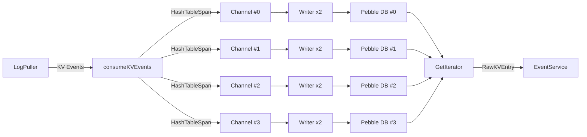
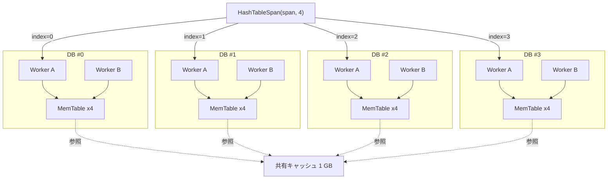

# 第5章 EventStore と Pebble

> **本章で読むソース**
>
> - [`logservice/eventstore/event_store.go`](https://github.com/pingcap/ticdc/blob/v8.5.6/logservice/eventstore/event_store.go)
> - [`logservice/eventstore/pebble.go`](https://github.com/pingcap/ticdc/blob/v8.5.6/logservice/eventstore/pebble.go)
> - [`logservice/eventstore/format.go`](https://github.com/pingcap/ticdc/blob/v8.5.6/logservice/eventstore/format.go)
> - [`logservice/eventstore/gc.go`](https://github.com/pingcap/ticdc/blob/v8.5.6/logservice/eventstore/gc.go)

## この章の狙い

第4章で読んだ LogPuller は、TiKV から変更イベントを受信して下流に流す。
受信したイベントは一時的にメモリ上を流れるだけでは済まない。
EventService が Dispatcher へイベントを配信するとき、対象の時間範囲を指定してスキャンする必要があるからである。

**EventStore** は、LogPuller が取得した変更イベントを Pebble DB に永続化し、時間範囲を指定したイテレータで読み出す層である。

## 前提

CockroachDB が開発した LSM-tree ストレージエンジン **Pebble** の基本を前提とする。
Pebble は LevelDB/RocksDB 互換の API を持ち、`Batch` による一括書き込み、`Iterator` による範囲スキャン、`DeleteRange` による範囲削除を提供する。
第4章の LogPuller が TiKV からイベントを引き込む仕組みも前提とする。

## EventStore のインターフェイスと構造

### インターフェイス

EventStore のインターフェイスは5つのメソッドで構成される。

[`logservice/eventstore/event_store.go` L72-L94](https://github.com/pingcap/ticdc/blob/v8.5.6/logservice/eventstore/event_store.go#L72-L94)

```go
type EventStore interface {
	common.SubModule
	RegisterDispatcher(
		changefeedID common.ChangeFeedID,
		dispatcherID common.DispatcherID,
		span *heartbeatpb.TableSpan,
		startTS uint64,
		notifier ResolvedTsNotifier,
		onlyReuse bool, bdrMode bool,
	) bool
	UnregisterDispatcher(changefeedID common.ChangeFeedID, dispatcherID common.DispatcherID)
	UpdateDispatcherCheckpointTs(dispatcherID common.DispatcherID, checkpointTs uint64)
	GetIterator(dispatcherID common.DispatcherID, dataRange common.DataRange) EventIterator
	GetLogCoordinatorNodeID() node.ID
}
```

`RegisterDispatcher` は Dispatcher がイベント購読を開始するときに呼ばれ、TiKV へのサブスクリプションを作成する。
`UpdateDispatcherCheckpointTs` は Dispatcher が処理済み位置を報告するたびに呼ばれ、GC の起点になる。
`GetIterator` は `(CommitTsStart, CommitTsEnd]` の半開区間でイベントをスキャンするイテレータを返す。

### 実装構造体

[`logservice/eventstore/event_store.go` L202-L247](https://github.com/pingcap/ticdc/blob/v8.5.6/logservice/eventstore/event_store.go#L202-L247)

```go
type eventStore struct {
	pdClock   pdutil.Clock
	subClient logpuller.SubscriptionClient
	dbs            []*pebble.DB
	chs            []*chann.UnlimitedChannel[eventWithCallback, uint64]
	writeTaskPools []*writeTaskPool
	gcManager *gcManager
	// ...
	dispatcherMeta struct {
		sync.RWMutex
		dispatcherStats map[common.DispatcherID]*dispatcherStat
		tableStats      map[int64]subscriptionStats
	}
	decoderPool           *sync.Pool
	compressionThreshold  int
	enableZstdCompression bool
}

const (
	dataDir             = "event_store"
	dbCount             = 4
	writeWorkerNumPerDB = 2
)
```

注目すべきフィールドを整理する。

- **`dbs`**：4つの Pebble DB インスタンスの配列。書き込み並列度を上げるために複数インスタンスに分散する。
- **`chs`**：DB ごとに1本ずつ用意された無制限チャネル（`UnlimitedChannel`）。LogPuller から受信したイベントがここに投入される。
- **`writeTaskPools`**：DB ごとの書き込みワーカープール。各プールが `writeWorkerNumPerDB = 2` 本のワーカー goroutine を持つ。
- **`gcManager`**：消費済みイベントの削除とコンパクションを管理する。
- **`dispatcherMeta`**：Dispatcher ごとの統計情報（`dispatcherStats`）と、テーブルごとのサブスクリプション情報（`tableStats`）を `RWMutex` で保護する。
- **`decoderPool`**：zstd デコーダの `sync.Pool`。読み出し時に圧縮解除するために使う。

定数 `dbCount = 4` と `writeWorkerNumPerDB = 2` により、合計8本の書き込みワーカーが並列に動作する。

## Pebble DB の構成

### DB インスタンスの作成

`createPebbleDBs` は共有キャッシュと共有テーブルキャッシュを作成し、4つの DB インスタンスに渡す。

[`logservice/eventstore/pebble.go` L77-L117](https://github.com/pingcap/ticdc/blob/v8.5.6/logservice/eventstore/pebble.go#L77-L117)

```go
func createPebbleDBs(rootDir string, dbNum int) []*pebble.DB {
	cache := pebble.NewCache(cacheSize)
	tableCache := pebble.NewTableCache(cache, dbNum, int(cache.MaxSize()))
	dbs := make([]*pebble.DB, dbNum)
	for i := 0; i < dbNum; i++ {
		opts := newPebbleOptions(dbNum)
		opts.Cache = cache
		opts.TableCache = tableCache
		opts.EventListener = &pebble.EventListener{
			// CompactionEnd, FlushEnd, WriteStallBegin/End でメトリクス記録
			// ...
		}
		db, err := pebble.Open(fmt.Sprintf("%s/%04d", rootDir, i), opts)
		// ...
		dbs[i] = db
	}
	return dbs
}
```

4つの DB インスタンスが `0000` から `0003` のサブディレクトリに作られる。
キャッシュ（1 GB）は全インスタンスで共有するため、メモリ消費が DB 数に比例して増えることはない。
各 DB には `EventListener` が設定され、コンパクション時間、フラッシュ時間、Write Stall の発生回数と持続時間がメトリクスとして記録される。

### Pebble オプション

[`logservice/eventstore/pebble.go` L31-L75](https://github.com/pingcap/ticdc/blob/v8.5.6/logservice/eventstore/pebble.go#L31-L75)

```go
const (
	cacheSize         = 1 << 30  // 1GB
	memTableTotalSize = 1 << 30  // 1GB
	memTableSize      = 64 << 20 // 64MB
)

func newPebbleOptions(dbNum int) *pebble.Options {
	opts := &pebble.Options{
		DisableWAL: true,                                      // WAL 無効
		MaxConcurrentCompactions: func() int { return 6 },
		L0CompactionThreshold:     20,
		L0StopWritesThreshold: math.MaxInt32,                  // L0 書き込み停止を実質無効化
		MemTableSize:                memTableSize,
		Levels: make([]pebble.LevelOptions, 7),
	}
	for i := 0; i < len(opts.Levels); i++ {
		l := &opts.Levels[i]
		l.BlockSize = 32 << 10       // 32KB
		l.FilterPolicy = bloom.FilterPolicy(10)  // Bloom フィルタ
		l.TargetFileSize = 64 << 20  // 64MB
		l.Compression = pebble.SnappyCompression // Snappy 圧縮
		l.EnsureDefaults()
	}
	opts.Levels[6].FilterPolicy = nil  // L6 は Bloom フィルタなし
	// ...
}
```

設定のポイントを整理する。

- **WAL 無効化** (`DisableWAL: true`)：EventStore のデータは TiKV から再取得できるため、クラッシュ耐性のための WAL は不要である。書き込み I/O を削減する。
- **Bloom フィルタ** (`bloom.FilterPolicy(10)`)：L0 から L5 まで全レベルに設定する。L6（最下層）は全データが格納されるためフィルタを外している。
- **Snappy 圧縮**：全レベルで Snappy 圧縮を使い、ディスク使用量を抑える。これは Pebble の SSTable レベルの圧縮であり、後述する zstd によるイベント値の圧縮とは別の層である。
- **L0 書き込み停止の抑制** (`L0StopWritesThreshold: math.MaxInt32`)：L0 の SSTable 数が増えても書き込みを止めない。
- **MemTable**：各 DB が `memTableTotalSize / dbNum / memTableSize` 個の MemTable を保持できる。`dbNum = 4` のとき、DB あたり4個になる。

## キーフォーマット

### DML 順序型と圧縮型

[`logservice/eventstore/format.go` L26-L39](https://github.com/pingcap/ticdc/blob/v8.5.6/logservice/eventstore/format.go#L26-L39)

```go
type DMLOrder uint16
const (
	DMLOrderDelete DMLOrder = iota + 1
	DMLOrderUpdate
	DMLOrderInsert
)

type CompressionType uint16
const (
	CompressionNone CompressionType = iota
	CompressionZSTD
)
```

**DMLOrder** は Delete < Update < Insert の順序を定義する。
同一トランザクション内で Delete、Update、Insert の順にスキャンされるよう、キーのソート順に組み込まれる。

**CompressionType** はイベント値の圧縮方式を示す。
この型情報をキー自体に埋め込むことで、読み出し時に値の先頭を解析せずとも圧縮方式を判定できる。

2つの型は16ビット整数の上位8ビット（DML 順序）と下位8ビット（圧縮方式）にパックされる[^bitmask]。

[^bitmask]: `dmlOrderMask = 0xFF00`、`compressionMask = 0x00FF` として `format.go` L41-L46 で定義されている。

### EncodeKeyPrefix

`EncodeKeyPrefix` は範囲スキャンの境界を構成するプレフィックスを生成する。

[`logservice/eventstore/format.go` L50-L77](https://github.com/pingcap/ticdc/blob/v8.5.6/logservice/eventstore/format.go#L50-L77)

```go
func EncodeKeyPrefix(uniqueID uint64, tableID int64, CRTs uint64, startTs ...uint64) []byte {
	keySize := 8 + 8 + 8  // uniqueID, tableID, CRTs
	if len(startTs) > 0 {
		keySize += 8
	}
	buf := make([]byte, 0, keySize)
	uint64Buf := [8]byte{}
	binary.BigEndian.PutUint64(uint64Buf[:], uniqueID)
	buf = append(buf, uint64Buf[:]...)
	binary.BigEndian.PutUint64(uint64Buf[:], uint64(tableID))
	buf = append(buf, uint64Buf[:]...)
	binary.BigEndian.PutUint64(uint64Buf[:], CRTs)
	buf = append(buf, uint64Buf[:]...)
	// startTs は省略可能
	// ...
	return buf
}
```

フォーマットは `[uniqueID | tableID | CRTs | (startTs)]` の並びで、各フィールドはビッグエンディアンの8バイト固定長である。
ビッグエンディアンを使う理由は、Pebble のバイト列比較による辞書順ソートが、そのまま各フィールドの数値順になるためである。

### EncodeKey

`EncodeKey` は個々のイベントを書き込むときのフルキーを構成する。

[`logservice/eventstore/format.go` L80-L108](https://github.com/pingcap/ticdc/blob/v8.5.6/logservice/eventstore/format.go#L80-L108)

```go
func EncodeKey(uniqueID uint64, tableID int64, event *common.RawKVEntry, compressionType CompressionType) []byte {
	length := 8 + 8 + 8 + 8 + 1 + 1 + len(event.Key)
	buf := make([]byte, 0, length)
	// uniqueID, tableID, CRTs, startTs を順にビッグエンディアンで書き込み
	// ...
	dmlOrder := getDMLOrder(event)
	combinedOrder := uint16(compressionType) | (uint16(dmlOrder) << dmlOrderShift)
	binary.BigEndian.PutUint16(uint64Buf[:], combinedOrder)
	buf = append(buf, uint64Buf[:2]...)
	return append(buf, event.Key...)
}
```

フルキーの構造は次のとおりである。

| オフセット | サイズ | フィールド |
|---|---|---|
| 0 | 8 bytes | uniqueID（サブスクリプション ID） |
| 8 | 8 bytes | tableID |
| 16 | 8 bytes | CRTs（コミットタイムスタンプ） |
| 24 | 8 bytes | startTs（開始タイムスタンプ） |
| 32 | 2 bytes | DMLOrder (上位8ビット) + CompressionType (下位8ビット) |
| 34 | 可変 | Key（元のキー） |

先頭に `uniqueID` と `tableID` を置くことで、サブスクリプションとテーブルの単位でプレフィックススキャンが可能になる。
`CRTs` がその次に来るため、同一テーブル内でコミット順にソートされる。

`DecodeKeyMetas` はオフセット 32-34 の2バイトから DML 順序と圧縮方式を取り出す。

[`logservice/eventstore/format.go` L111-L114](https://github.com/pingcap/ticdc/blob/v8.5.6/logservice/eventstore/format.go#L111-L114)

```go
func DecodeKeyMetas(key []byte) (DMLOrder, CompressionType) {
	combinedOrder := binary.BigEndian.Uint16(key[32:34])
	return DMLOrder((combinedOrder & dmlOrderMask) >> dmlOrderShift), CompressionType(combinedOrder & compressionMask)
}
```

## イベントの書き込みフロー

### コンストラクタでの初期化

`New` 関数は Pebble DB の作成、チャネルとワーカープールの初期化、GC マネージャの起動を行う。

[`logservice/eventstore/event_store.go` L249-L296](https://github.com/pingcap/ticdc/blob/v8.5.6/logservice/eventstore/event_store.go#L249-L296)

```go
func New(root string, subClient logpuller.SubscriptionClient) EventStore {
	dbPath := fmt.Sprintf("%s/%s", root, dataDir)
	err := os.RemoveAll(dbPath)  // 起動時に既存データを削除
	// ...
	store := &eventStore{
		dbs:            createPebbleDBs(dbPath, dbCount),
		chs:            make([]*chann.UnlimitedChannel[eventWithCallback, uint64], 0, dbCount),
		writeTaskPools: make([]*writeTaskPool, 0, dbCount),
		// ...
	}
	store.gcManager = newGCManager(store.dbs, deleteDataRange, compactDataRange)
	for i := 0; i < dbCount; i++ {
		store.chs = append(store.chs, chann.NewUnlimitedChannel[eventWithCallback, uint64](nil, eventWithCallbackSizer))
		store.writeTaskPools = append(store.writeTaskPools, newWriteTaskPool(store, store.dbs[i], i, store.chs[i], writeWorkerNumPerDB))
	}
	// ...
}
```

起動時に `os.RemoveAll(dbPath)` で既存データを削除している。
EventStore のデータは TiKV から再取得できるため、ノード再起動時にゼロから再構築する設計である。
DB ごとにチャネルとワーカープールを1対1で対応づけ、チャネルは `UnlimitedChannel`（無制限バッファ付き）で書き込みが遅れても送信側がブロックしない。

### RegisterDispatcher と consumeKVEvents

`RegisterDispatcher` はサブスクリプションを作成し、TiKV からのイベント受信を開始する。
テーブルスパンのハッシュ値から対応する DB インデックスが決定される。

[`logservice/eventstore/event_store.go` L568-L618](https://github.com/pingcap/ticdc/blob/v8.5.6/logservice/eventstore/event_store.go#L568-L618)

```go
	chIndex := common.HashTableSpan(dispatcherSpan, len(e.chs))
	subStat := &subscriptionStat{
		subID:     e.subClient.AllocSubscriptionID(),
		tableSpan: dispatcherSpan,
		dbIndex:   chIndex,
		eventCh:   e.chs[chIndex],
	}
	subStat.checkpointTs.Store(startTs)
	subStat.resolvedTs.Store(startTs)
	// ...
	consumeKVEvents := func(kvs []common.RawKVEntry, finishCallback func()) bool {
		maxCommitTs := uint64(0)
		for _, kv := range kvs {
			if kv.CRTs > maxCommitTs {
				maxCommitTs = kv.CRTs
			}
		}
		subStat.eventCh.Push(eventWithCallback{
			subID: subStat.subID, tableID: subStat.tableSpan.TableID,
			kvs: kvs, currentResolvedTs: subStat.resolvedTs.Load(),
			callback: finishCallback,
		})
		return true
	}
```

`common.HashTableSpan` がテーブルスパンを `len(e.chs)` (= 4) で割ってインデックスを決める。
同一テーブルのイベントは同じ DB に書き込まれるため、テーブル単位の範囲スキャンが単一 DB で完結する。

`consumeKVEvents` クロージャは LogPuller から呼ばれるコールバックである。
バッチ内の最大 commitTs を記録し、イベントをチャネルに投入する。

### writeTaskPool による並列書き込み

[`logservice/eventstore/event_store.go` L316-L363](https://github.com/pingcap/ticdc/blob/v8.5.6/logservice/eventstore/event_store.go#L316-L363)

```go
func (p *writeTaskPool) run(ctx context.Context) {
	p.store.wg.Add(p.workerNum)
	for i := 0; i < p.workerNum; i++ {
		go func(workerID int) {
			encoder, _ := zstd.NewWriter(nil, zstd.WithEncoderLevel(zstd.SpeedFastest))
			defer encoder.Close()
			buffer := make([]eventWithCallback, 0, 128)
			for {
				events, ok := p.dataCh.GetMultipleNoGroup(buffer)
				if !ok { return }
				p.store.writeEvents(p.db, events, encoder, &compressionBuf)
				for idx := range events {
					events[idx].callback()
				}
				buffer = buffer[:0]
			}
		}(i)
	}
}
```

各ワーカーは独自の zstd エンコーダ（`SpeedFastest` レベル）と圧縮バッファを持つ。
`GetMultipleNoGroup` でチャネルから複数イベントをまとめて取り出し、`writeEvents` でバッチ書き込みする。
書き込み完了後に各イベントの `callback()` を呼び、LogPuller に完了を通知する。

### writeEvents によるバッチ書き込み

[`logservice/eventstore/event_store.go` L1281-L1354](https://github.com/pingcap/ticdc/blob/v8.5.6/logservice/eventstore/event_store.go#L1281-L1354)

```go
func (e *eventStore) writeEvents(db *pebble.DB, events []eventWithCallback,
	encoder *zstd.Encoder, compressionBuf *[]byte) error {
	batch := db.NewBatch()
	defer batch.Close()
	for _, event := range events {
		for _, kv := range event.kvs {
			if kv.CRTs <= event.currentResolvedTs {
				continue  // 消費済みイベントをスキップ
			}
			compressionType := CompressionNone
			rawValue := kv.Encode()
			value := rawValue
			if e.enableZstdCompression && len(rawValue) > e.compressionThreshold {
				value = encoder.EncodeAll(rawValue, dstBuf)
				compressionType = CompressionZSTD
			}
			key := EncodeKey(uint64(event.subID), event.tableID, &kv, compressionType)
			batch.Set(key, value, pebble.NoSync)
		}
	}
	return batch.Commit(pebble.NoSync)
}
```

処理の流れは3段階ある。

1. `commitTs <= resolvedTs` のイベントはスキップする。すでに消費済みの古いイベントを書き込んでも意味がない。
2. zstd 圧縮が有効かつ値のサイズが閾値を超える場合、`encoder.EncodeAll` で圧縮する。圧縮方式は `EncodeKey` でキーに埋め込まれる。
3. `batch.Commit(pebble.NoSync)` で一括コミットする。`pebble.NoSync` は fsync を省略するフラグで、WAL 無効化と同じくデータ再取得可能という前提に基づく。

## データフローの全体像

LogPuller から Pebble DB への書き込み、EventService への読み出しまでの流れを図に示す。



`HashTableSpan` がテーブルスパンに応じてイベントを4つのチャネルに振り分ける。
各チャネルから2本のワーカーがイベントを取り出し、対応する Pebble DB に書き込む。
読み出し時は `GetIterator` が Dispatcher に紐づく DB を特定し、イテレータを返す。

## イベントの読み出しフロー

### GetIterator

`GetIterator` は Dispatcher の登録情報からサブスクリプションを特定し、Pebble のイテレータを構成する。

[`logservice/eventstore/event_store.go` L776-L914](https://github.com/pingcap/ticdc/blob/v8.5.6/logservice/eventstore/event_store.go#L776-L914)

```go
func (e *eventStore) GetIterator(dispatcherID common.DispatcherID, dataRange common.DataRange) EventIterator {
	stat, ok := e.dispatcherMeta.dispatcherStats[dispatcherID]
	// ...
	// pendingSubStat を優先して使用（スパンが Dispatcher により近いため）
	db := tryGetDB(stat.pendingSubStat, false)
	if db == nil {
		db = tryGetDB(stat.subStat, stat.removingSubStat == nil)
	}
	// ...
	// (startTs, endTs] を Pebble の [startTs+1, endTs+1) に変換
	start := EncodeKeyPrefix(uint64(subStat.subID), stat.tableSpan.TableID, dataRange.CommitTsStart+1)
	end := EncodeKeyPrefix(uint64(subStat.subID), stat.tableSpan.TableID, dataRange.CommitTsEnd+1)
	iter, _ := db.NewIter(&pebble.IterOptions{LowerBound: start, UpperBound: end})
	// ...
}
```

範囲変換がポイントである。
API の `(CommitTsStart, CommitTsEnd]`（開始を含まない半開区間）を Pebble のイテレータ区間 `[CommitTsStart+1, CommitTsEnd+1)` に変換する。
Pebble のイテレータは `[LowerBound, UpperBound)` の左閉右開区間なので、+1 することで排他的な開始点と包含的な終了点を正しく表現する。

`LastScannedTxnStartTs` が指定されている場合は、前回スキャン済みのトランザクションの直後から再開するために `startTs` もプレフィックスに含める（L878-L879）。

Dispatcher は最大3つのサブスクリプション状態を持ちうる。
`pendingSubStat`（スパンが変わった場合の新しいサブスクリプション）、`subStat`（現行）、`removingSubStat`（削除待ち）である。
`pendingSubStat` のスパンが Dispatcher のスパンにより近いため優先的に使われ、データが揃ったら `subStat` と入れ替わる。

### eventStoreIter.Next()

[`logservice/eventstore/event_store.go` L1375-L1440](https://github.com/pingcap/ticdc/blob/v8.5.6/logservice/eventstore/event_store.go#L1375-L1440)

```go
func (iter *eventStoreIter) Next() (*common.RawKVEntry, bool) {
	rawKV := &common.RawKVEntry{}
	for {
		if !iter.innerIter.Valid() { return nil, false }
		key := iter.innerIter.Key()
		value := iter.innerIter.Value()
		_, compressionType := DecodeKeyMetas(key)
		if compressionType == CompressionZSTD {
			decodedValue, _ = iter.decoder.DecodeAll(value, dst)
		} else {
			decodedValue = value
		}
		rawKV.Decode(decodedValue)
		if !iter.needCheckSpan { break }
		// スパン外のキーを読み飛ばす
		comparableKey := common.ToComparableKey(rawKV.Key)
		if bytes.Compare(comparableKey, iter.tableSpan.StartKey) >= 0 &&
			bytes.Compare(comparableKey, iter.tableSpan.EndKey) <= 0 { break }
		iter.innerIter.Next()
	}
	isNewTxn := iter.prevCommitTs == 0 || (rawKV.StartTs != iter.prevStartTs || rawKV.CRTs != iter.prevCommitTs)
	iter.prevCommitTs = rawKV.CRTs
	iter.prevStartTs = rawKV.StartTs
	iter.innerIter.Next()
	return rawKV, isNewTxn
}
```

処理のポイントは3つある。

1. **透過的な圧縮解除**：キーのオフセット 32-34 から `CompressionType` を読み取り、ZSTD であればデコーダで解凍する。呼び出し側は圧縮の有無を意識しない。
2. **スパンフィルタリング**：サブスクリプションのスパンと Dispatcher のスパンが一致しない場合（データ共有時）、`needCheckSpan` が `true` になる。キーがスパン外であれば読み飛ばす。
3. **トランザクション境界の検出**：`startTs` と `commitTs` の組が前のエントリと異なれば `isNewTxn = true` を返す。呼び出し側はこのフラグでトランザクション単位の処理を行う。

`Close()` はイテレータを閉じ、zstd デコーダを `sync.Pool` に返却して、読み取った行数を返す。

[`logservice/eventstore/event_store.go` L1442-L1457](https://github.com/pingcap/ticdc/blob/v8.5.6/logservice/eventstore/event_store.go#L1442-L1457)

```go
func (iter *eventStoreIter) Close() (int64, error) {
	err := iter.innerIter.Close()
	iter.decoderPool.Put(iter.decoder)
	iter.innerIter = nil
	return iter.rowCount, err
}
```

## GC の仕組み

### チェックポイント更新と GC アイテムの生成

`UpdateDispatcherCheckpointTs` は Dispatcher が処理済みタイムスタンプを報告するたびに呼ばれる。

[`logservice/eventstore/event_store.go` L682-L774](https://github.com/pingcap/ticdc/blob/v8.5.6/logservice/eventstore/event_store.go#L682-L774)

```go
func (e *eventStore) UpdateDispatcherCheckpointTs(dispatcherID common.DispatcherID, checkpointTs uint64) {
	// ...
	updateSubStatCheckpoint := func(subStat *subscriptionStat) {
		// 全購読者のチェックポイントの最小値を計算
		var newCheckpointTs uint64
		for id := range subscribersData.subscribers {
			if newCheckpointTs == 0 || dispatcherStat.checkpointTs < newCheckpointTs {
				newCheckpointTs = dispatcherStat.checkpointTs
			}
		}
		// resolvedTs で上限を制約
		if newCheckpointTs > subStat.resolvedTs.Load() {
			newCheckpointTs = resolvedTs
		}
		oldCheckpointTs := subStat.checkpointTs.Load()
		// DML を受信済みの場合のみ GC アイテムを追加
		if lastReceiveDMLTime >= oldCheckpointPhysicalTime.UnixMilli() {
			e.gcManager.addGCItem(subStat.dbIndex, uint64(subStat.subID),
				subStat.tableSpan.TableID, oldCheckpointTs, newCheckpointTs)
		}
		subStat.checkpointTs.Store(newCheckpointTs)
	}
	updateSubStatCheckpoint(dispatcherStat.subStat)
	updateSubStatCheckpoint(dispatcherStat.pendingSubStat)
	updateSubStatCheckpoint(dispatcherStat.removingSubStat)
}
```

サブスクリプションに紐づく全 Dispatcher のチェックポイントの最小値が、新しいチェックポイントになる。
複数の Dispatcher が同じサブスクリプションを共有する場合、最も遅い Dispatcher に合わせる必要がある。
新チェックポイントは `resolvedTs` で上限が制約される。

`lastReceiveDMLTime` のチェックは最適化である。
チェックポイント区間に DML イベントが届いていなければ、削除するデータが存在しないため `addGCItem` をスキップする。

### gcManager の構造

[`logservice/eventstore/gc.go` L33-L62](https://github.com/pingcap/ticdc/blob/v8.5.6/logservice/eventstore/gc.go#L33-L62)

```go
type gcRangeItem struct {
	dbIndex     int
	uniqueKeyID uint64
	tableID     int64
	startTs     uint64
	endTs       uint64
}

type gcManager struct {
	mu            sync.Mutex
	dbs           []*pebble.DB
	ranges        []gcRangeItem
	compactRanges map[compactItemKey]*compactState
	deleteDataRange  deleteDataRangeFunc
	compactDataRange compactDataRangeFunc
}
```

`addGCItem` は Mutex で保護されたスライスにアイテムを追加するだけの軽量な操作である（L78-L88）。

### 削除とコンパクションの二段構成

`gcManager.run()` は2つの goroutine を起動する。

[`logservice/eventstore/gc.go` L98-L209](https://github.com/pingcap/ticdc/blob/v8.5.6/logservice/eventstore/gc.go#L98-L209)

```go
func (d *gcManager) run(ctx context.Context) error {
	wg.Add(2)
	go func() {  // 削除 goroutine
		deleteTicker := time.NewTicker(50 * time.Millisecond)
		for {
			ranges := d.fetchAllGCItems()
			ranges, _ = mergeDeleteRanges(ranges)
			d.doGCJob(ranges)
			d.updateCompactRanges(ranges)
		}
	}()
	go func() {  // コンパクション goroutine
		compactTicker := time.NewTicker(10 * time.Minute)
		for {
			d.doCompaction()
		}
	}()
}
```

**削除 goroutine**（50 ms 周期）は、蓄積された GC アイテムを取り出し、`mergeDeleteRanges` で統合してから Pebble の `DeleteRange` を発行する。
**コンパクション goroutine**（10分周期）は、削除済みの範囲に対して手動コンパクションを実行する。
Pebble はコールドな範囲（書き込みのない範囲）を自動的にはコンパクションしないため、削除によって生じた空き領域を回収するには手動コンパクションが必要になる。

### mergeDeleteRanges による統合

削除 goroutine がブロックされて GC アイテムが蓄積された場合、`mergeDeleteRanges` が隣接または重複する範囲を統合する。

[`logservice/eventstore/gc.go` L223-L277](https://github.com/pingcap/ticdc/blob/v8.5.6/logservice/eventstore/gc.go#L223-L277)

```go
func mergeDeleteRanges(ranges []gcRangeItem) ([]gcRangeItem, int) {
	if len(ranges) < 2 { return ranges, 0 }
	// 重複キーがなければソート不要（通常時のファストパス）
	seen := make(map[compactItemKey]struct{}, len(ranges))
	for _, r := range ranges {
		key := compactItemKey{dbIndex: r.dbIndex, uniqueKeyID: r.uniqueKeyID, tableID: r.tableID}
		if _, ok := seen[key]; ok { hasDuplicateKey = true; break }
		seen[key] = struct{}{}
	}
	if !hasDuplicateKey { return ranges, 0 }
	// (dbIndex, uniqueKeyID, tableID, startTs) でソートし、隣接範囲を統合
	sort.Slice(ranges, func(i, j int) bool { /* ... */ })
	out := ranges[:0]
	cur := ranges[0]
	for _, r := range ranges[1:] {
		if sameKey && r.startTs <= cur.endTs {
			cur.endTs = max(cur.endTs, r.endTs)
			continue
		}
		out = append(out, cur)
		cur = r
	}
	out = append(out, cur)
	return out, originalCount - len(out)
}
```

通常時は `(dbIndex, uniqueKeyID, tableID)` の重複がなく、ソートせずにそのまま返す。
重複がある場合のみソートして走査し、同一キーで `r.startTs <= cur.endTs` の範囲を `cur.endTs = max(cur.endTs, r.endTs)` で統合する。

### 範囲削除の実体

[`logservice/eventstore/format.go` L126-L131](https://github.com/pingcap/ticdc/blob/v8.5.6/logservice/eventstore/format.go#L126-L131)

```go
func deleteDataRange(db *pebble.DB, uniqueKeyID uint64, tableID int64, startTs uint64, endTs uint64) error {
	start := EncodeKeyPrefix(uniqueKeyID, tableID, startTs)
	end := EncodeKeyPrefix(uniqueKeyID, tableID, endTs)
	return db.DeleteRange(start, end, pebble.NoSync)
}
```

Pebble の `DeleteRange` は論理削除であり、対象範囲に削除マーカー（tombstone）を書き込むだけである。
実際のディスク領域の回収はコンパクションで行われる。

### 手動コンパクション

[`logservice/eventstore/gc.go` L296-L323](https://github.com/pingcap/ticdc/blob/v8.5.6/logservice/eventstore/gc.go#L296-L323)

```go
func (d *gcManager) doCompaction() {
	d.mu.Lock()
	for key, state := range d.compactRanges {
		if !state.compacted {
			toCompact[key] = state.endTs
			state.compacted = true
		}
	}
	d.mu.Unlock()
	for key, endTs := range toCompact {
		d.compactDataRange(d.dbs[key.dbIndex], key.uniqueKeyID, key.tableID, 0, endTs)
	}
}
```

コンパクション範囲は `0` から `endTs` まで、最古のデータから直近の削除済み位置までを一括で対象とする。
`compacted` フラグにより同じ範囲を繰り返しコンパクションすることを防ぎ、新しい削除で `endTs` が更新されるとフラグがリセットされる。

## 不要サブスクリプションのクリーンアップ

Dispatcher が登録解除されても、サブスクリプションはすぐには破棄されない。
データ共有のために、同一テーブルの別の Dispatcher が後から登録される可能性があるためである。

`cleanObsoleteSubscriptions` は10秒周期で idle 状態のサブスクリプションを監視し、残存寿命が尽きたら破棄する。

[`logservice/eventstore/event_store.go` L1024-L1088](https://github.com/pingcap/ticdc/blob/v8.5.6/logservice/eventstore/event_store.go#L1024-L1088)

```go
func (e *eventStore) cleanObsoleteSubscriptionsOnce(deltaMs int64) {
	for tableID, subStats := range e.dispatcherMeta.tableStats {
		for subID, subStat := range subStats {
			if len(subData.subscribers) != 0 { continue }
			remainingMs := subStat.remainingLifetimeMs.Load()
			remainingMs -= deltaMs
			subStat.remainingLifetimeMs.Store(remainingMs)
			if remainingMs != 0 { continue }
			obsoleteSubs = append(obsoleteSubs, /* ... */)
		}
	}
	for _, sub := range obsoleteSubs {
		e.subClient.Unsubscribe(sub.subID)
		deleteDataRange(e.dbs[sub.dbIndex], uint64(sub.subID), sub.tableID, 0, math.MaxUint64)
	}
}
```

購読者がいないサブスクリプションの `remainingLifetimeMs` を10秒ごとに減算し、0に達したら TiKV へのサブスクリプションを解除する。
同時に `deleteDataRange(db, ..., 0, math.MaxUint64)` でそのサブスクリプションの全データを Pebble から削除する。

## 最適化の工夫：複数 DB インスタンスによる書き込み並列化

EventStore の書き込み性能を支える設計は、4つの Pebble DB インスタンスと各2本のワーカーによる並列書き込みである。

LSM-tree ベースのストレージでは、MemTable への書き込みがシリアライズポイントになりやすい。
単一の Pebble DB に全テーブルのイベントを集約すると、MemTable のフラッシュ待ちが書き込みスループットの上限を決めてしまう。



設計のポイントをまとめる。

- **DB 分割**：`HashTableSpan` によりテーブルスパン単位で4つの DB に振り分ける。DB ごとに独立した MemTable と LSM-tree を持つため、書き込みロックが競合しない。
- **DB あたり2ワーカー**：一方がバッチコミット中にもう一方がチャネルからの取り出しと zstd 圧縮を進められる。
- **共有キャッシュ**：1 GB のブロックキャッシュを4 DB で共有する。DB 分割によるメモリ効率の低下を防ぐ。
- **WAL 無効化**：EventStore のデータは TiKV から再取得可能であり、fsync を省略して書き込みレイテンシを削減する。
- **zstd 圧縮**：閾値を超える大きな値を `SpeedFastest` レベルで圧縮する。圧縮方式をキーに埋め込むことで、読み出し時に値のヘッダ解析なしに圧縮方式を判定できる。
- **GC 範囲のマージ**：`mergeDeleteRanges` が隣接する削除範囲を統合し、`DeleteRange` の呼び出し回数を削減する。

## まとめ

EventStore は LogPuller と EventService の間に位置する永続化層であり、4つの Pebble DB インスタンスに変更イベントを書き込み、時間範囲を指定したイテレータで読み出す。

キーフォーマットは `[uniqueID | tableID | CRTs | startTs | DMLOrder+CompressionType | Key]` で、ビッグエンディアンの固定長フィールドにより Pebble のバイト列比較がそのまま時刻順スキャンになる。
書き込みは `HashTableSpan` によるテーブル単位の DB 分割と、DB あたり2本のワーカーで並列化される。
GC は `UpdateDispatcherCheckpointTs` から `gcManager` へ削除範囲が渡され、50 ms 周期の削除と10分周期の手動コンパクションの二段構成で実行される。

## 関連する章

- **第4章**（LogPuller）：EventStore に流し込むイベントの取得元。`consumeKVEvents` コールバックが両者の接続点になる。
- **第7章**（EventService）：EventStore の `GetIterator` を呼び出してイベントを読み出し、Dispatcher へ配信する。
- **第6章**（SchemaStore）：DDL イベントのスキーマ情報を管理する。EventStore が DML イベントを扱うのに対し、SchemaStore は DDL イベントを扱う。
