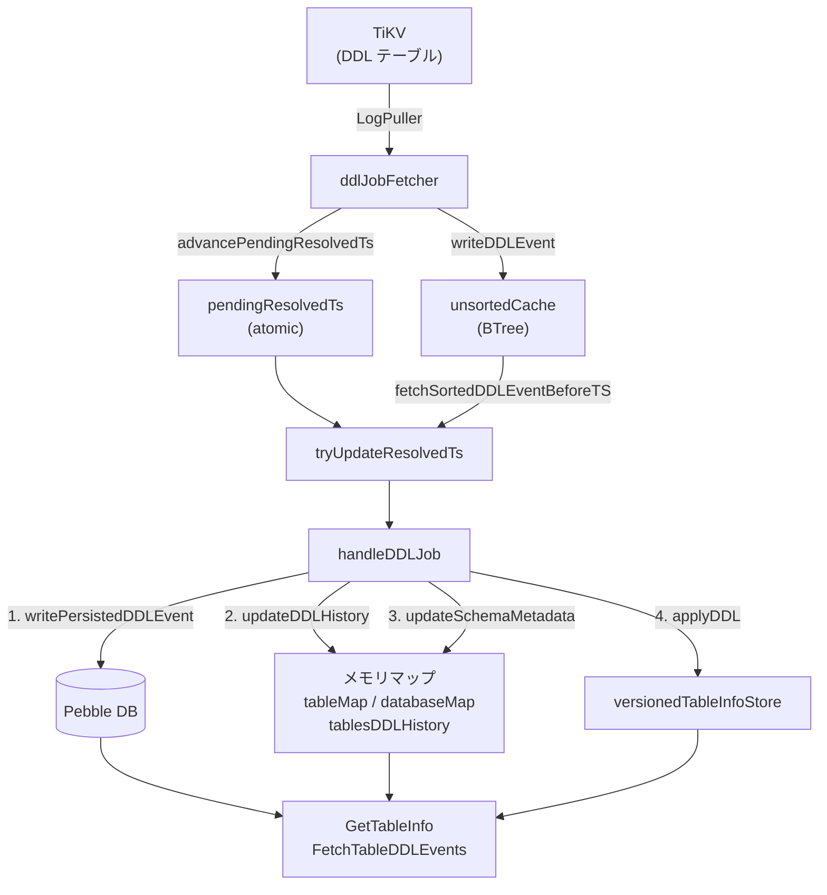

# 第6章 SchemaStore と DDL 追跡

> **本章で読むソース**
>
> - [`logservice/schemastore/schema_store.go`](https://github.com/pingcap/ticdc/blob/v8.5.6/logservice/schemastore/schema_store.go)
> - [`logservice/schemastore/persist_storage.go`](https://github.com/pingcap/ticdc/blob/v8.5.6/logservice/schemastore/persist_storage.go)
> - [`logservice/schemastore/persist_storage_ddl_handlers.go`](https://github.com/pingcap/ticdc/blob/v8.5.6/logservice/schemastore/persist_storage_ddl_handlers.go)
> - [`logservice/schemastore/multi_version.go`](https://github.com/pingcap/ticdc/blob/v8.5.6/logservice/schemastore/multi_version.go)
> - [`logservice/schemastore/ddl_job_fetcher.go`](https://github.com/pingcap/ticdc/blob/v8.5.6/logservice/schemastore/ddl_job_fetcher.go)
> - [`logservice/schemastore/gc_keeper.go`](https://github.com/pingcap/ticdc/blob/v8.5.6/logservice/schemastore/gc_keeper.go)
> - [`logservice/schemastore/disk_format.go`](https://github.com/pingcap/ticdc/blob/v8.5.6/logservice/schemastore/disk_format.go)
> - [`logservice/schemastore/unsorted_cache.go`](https://github.com/pingcap/ticdc/blob/v8.5.6/logservice/schemastore/unsorted_cache.go)
> - [`logservice/schemastore/types.go`](https://github.com/pingcap/ticdc/blob/v8.5.6/logservice/schemastore/types.go)

## この章の狙い

TiCDC が変更データを下流へ伝送するには、各イベントがどのテーブルのどのカラムに属するのかを知る必要がある。
上流の TiDB ではスキーマが DDL によって時々刻々変化するため、TiCDC は DDL の履歴を追跡し、任意のタイムスタンプにおけるテーブル定義を復元できなければならない。
この責務を担うのが **SchemaStore** である。

本章では、SchemaStore が DDL ジョブをどのように取得し、永続化し、マルチバージョンのスキーマ情報として管理するかを読む。

## 前提

TiDB の DDL ジョブモデル(`model.Job`)と、TiKV のタイムスタンプ体系(TSO)の基本を前提とする。
Pebble(CockroachDB 由来の LSM-tree ストレージエンジン)については、KV ストアとしての基本操作(Get、Set、Iterator、Snapshot)を前提とする。

## SchemaStore のインターフェイス

SchemaStore は `common.SubModule` を埋め込んだインターフェイスとして定義される。

[`logservice/schemastore/schema_store.go` L41-L65](https://github.com/pingcap/ticdc/blob/v8.5.6/logservice/schemastore/schema_store.go#L41-L65)

```go
type SchemaStore interface {
	common.SubModule

	GetAllPhysicalTables(keyspaceMeta common.KeyspaceMeta, snapTs uint64, filter filter.Filter) ([]commonEvent.Table, error)

	RegisterTable(keyspaceMeta common.KeyspaceMeta, tableID int64, startTs uint64) error

	UnregisterTable(keyspaceMeta common.KeyspaceMeta, tableID int64) error

	// GetTableInfo return table info with the largest version <= ts
	GetTableInfo(keyspaceMeta common.KeyspaceMeta, tableID int64, ts uint64) (*common.TableInfo, error)

	// TODO: how to respect tableFilter
	GetTableDDLEventState(keyspaceMeta common.KeyspaceMeta, tableID int64) (DDLEventState, error)

	// FetchTableDDLEvents returns the next ddl events which finishedTs are within the range (start, end]
	// The caller must ensure end <= current resolvedTs
	// TODO: add a parameter limit
	FetchTableDDLEvents(keyspaceMeta common.KeyspaceMeta, dispatcherID common.DispatcherID, tableID int64, tableFilter filter.Filter, start, end uint64) ([]commonEvent.DDLEvent, error)

	FetchTableTriggerDDLEvents(keyspaceMeta common.KeyspaceMeta, dispatcherID common.DispatcherID, tableFilter filter.Filter, start uint64, limit int) ([]commonEvent.DDLEvent, uint64, error)

	// RegisterKeyspace register a keyspace to fetch table ddl
	RegisterKeyspace(ctx context.Context, keyspaceMeta common.KeyspaceMeta) error
}
```

メソッドは大きく3つのカテゴリに分かれる。

- **テーブル情報の取得**：`GetTableInfo` は指定タイムスタンプ以下で最大のバージョンを返す。`GetAllPhysicalTables` はスナップショット時点の全物理テーブルを列挙する。
- **DDL イベントの取得**：`FetchTableDDLEvents` は特定テーブルの DDL 履歴を、`FetchTableTriggerDDLEvents` はテーブル構成を変えるトリガ系 DDL(CREATE TABLE、DROP TABLE など)を返す。
- **登録管理**：`RegisterTable` と `UnregisterTable` は Dispatcher がテーブルの購読を開始、終了するときに呼ばれる。`RegisterKeyspace` はキースペース単位で DDL の追跡を開始する。

いずれのメソッドも第一引数に `KeyspaceMeta` を取る。
TiDB のマルチテナント機能(キースペース)に対応するためである。

## keyspaceSchemaStore の全体構成

外部に公開される `schemaStore` 構造体は、キースペースごとの **keyspaceSchemaStore** をマップで保持する薄いラッパーである。
実際のスキーマ管理は `keyspaceSchemaStore` が担う。

[`logservice/schemastore/schema_store.go` L72-L99](https://github.com/pingcap/ticdc/blob/v8.5.6/logservice/schemastore/schema_store.go#L72-L99)

```go
type keyspaceSchemaStore struct {
	cancel        context.CancelFunc
	ddlJobFetcher *ddlJobFetcher
	gcKeeper      *schemaStoreGCKeeper
	pdClock       pdutil.Clock

	// store unresolved ddl event in memory, it is thread safe
	unsortedCache *ddlCache

	// store ddl event and other metadata on disk, it is thread safe
	dataStorage *persistentStorage

	notifyCh chan any

	// pendingResolvedTs is the largest resolvedTs the pending ddl events
	pendingResolvedTs atomic.Uint64
	// resolvedTs is the largest resolvedTs of all applied ddl events
	// Invariant: resolvedTs >= pendingResolvedTs
	resolvedTs atomic.Uint64

	// the following two fields are used to filter out duplicate ddl events
	// they will just be updated and read by a single goroutine, so no lock is needed

	// max finishedTs of all applied ddl events
	finishedDDLTs uint64
	// max schemaVersion of all applied ddl events
	schemaVersion int64
}
```

この構造体のフィールドが、SchemaStore の処理パイプライン全体を表している。
以下の図にデータの流れを示す。



DDL ジョブは TiKV から `ddlJobFetcher` 経由で取得され、まず `unsortedCache` に蓄積される。
`tryUpdateResolvedTs` がキャッシュからソート済みのイベントを取り出し、`handleDDLJob` を通じて Pebble への永続化とメモリ上のマップ更新を行う。
Dispatcher からの問い合わせ(`GetTableInfo` など)は、永続化済みのデータとメモリ上のバージョンチェーンから応答する。

## DDL ジョブの取得

**ddlJobFetcher** は TiKV の DDL 関連テーブルを LogPuller 経由で購読し、DDL ジョブを取得する。

[`logservice/schemastore/ddl_job_fetcher.go` L41-L61](https://github.com/pingcap/ticdc/blob/v8.5.6/logservice/schemastore/ddl_job_fetcher.go#L41-L61)

```go
type ddlJobFetcher struct {
	ctx               context.Context
	subClient         logpuller.SubscriptionClient
	resolvedTsTracker struct {
		sync.Mutex
		resolvedTsItemMap map[logpuller.SubscriptionID]*resolvedTsItem
		resolvedTsHeap    *heap.Heap[*resolvedTsItem]
	}

	// cacheDDLEvent and advanceResolvedTs may be called concurrently
	cacheDDLEvent     func(ddlEvent DDLJobWithCommitTs)
	advanceResolvedTs func(resolvedTS uint64)

	kvStorage kv.Storage
	// ... (中略) ...
}
```

購読対象は `tidb_ddl_job` テーブルと `tidb_ddl_history` テーブルの2つである。
`run` メソッドでそれぞれのテーブルスパンに対してサブスクリプションを作成する。

[`logservice/schemastore/ddl_job_fetcher.go` L85-L103](https://github.com/pingcap/ticdc/blob/v8.5.6/logservice/schemastore/ddl_job_fetcher.go#L85-L103)

```go
func (p *ddlJobFetcher) run(startTs uint64) error {
	spans, err := getAllDDLSpan(p.keyspaceID)
	if err != nil {
		return err
	}
	for _, span := range spans {
		subID := p.subClient.AllocSubscriptionID()
		item := &resolvedTsItem{
			resolvedTs: 0,
		}
		p.resolvedTsTracker.resolvedTsItemMap[subID] = item
		p.resolvedTsTracker.resolvedTsHeap.AddOrUpdate(item)
		advanceSubSpanResolvedTs := func(ts uint64) {
			p.tryAdvanceResolvedTs(subID, ts)
		}
		p.subClient.Subscribe(subID, span, startTs, p.input, advanceSubSpanResolvedTs, 0, ddlPullerFilterLoop)
	}
	return nil
}
```

各サブスクリプションは独立した resolvedTs を持つ。
`resolvedTsTracker` は最小ヒープで全サブスクリプションの resolvedTs を追跡し、最小値だけを上位に通知する。

[`logservice/schemastore/ddl_job_fetcher.go` L105-L128](https://github.com/pingcap/ticdc/blob/v8.5.6/logservice/schemastore/ddl_job_fetcher.go#L105-L128)

```go
func (p *ddlJobFetcher) tryAdvanceResolvedTs(subID logpuller.SubscriptionID, newResolvedTs uint64) {
	p.resolvedTsTracker.Lock()
	defer p.resolvedTsTracker.Unlock()
	item, ok := p.resolvedTsTracker.resolvedTsItemMap[subID]
	// ... (中略) ...
	item.resolvedTs = newResolvedTs
	p.resolvedTsTracker.resolvedTsHeap.AddOrUpdate(item)

	minResolvedTsItem, ok := p.resolvedTsTracker.resolvedTsHeap.PeekTop()
	if !ok || minResolvedTsItem.resolvedTs == math.MaxUint64 {
		log.Panic("should not happen")
	}
	p.advanceResolvedTs(minResolvedTsItem.resolvedTs)
}
```

受信した KV エントリは `input` コールバックで DDL ジョブにパースされ、`cacheDDLEvent`(実体は `keyspaceSchemaStore.writeDDLEvent`)に渡される。

[`logservice/schemastore/ddl_job_fetcher.go` L130-L148](https://github.com/pingcap/ticdc/blob/v8.5.6/logservice/schemastore/ddl_job_fetcher.go#L130-L148)

```go
func (p *ddlJobFetcher) input(kvs []common.RawKVEntry, _ func()) bool {
	for _, entry := range kvs {
		job, err := p.unmarshalDDL(&entry)
		if err != nil {
			log.Fatal("unmarshal ddl failed", zap.Any("entry", entry), zap.Error(err))
		}
		if job == nil {
			continue
		}
		p.cacheDDLEvent(DDLJobWithCommitTs{
			Job:      job,
			CommitTs: entry.CRTs,
		})
	}
	return false
}
```

`writeDDLEvent` はシステムスキーマの DDL を除外したうえで、イベントを `unsortedCache` に投入する。
「unsortedCache」は BTree を内部に持ち、CommitTs 順にイベントをソートして保持する。

[`logservice/schemastore/unsorted_cache.go` L24-L28](https://github.com/pingcap/ticdc/blob/v8.5.6/logservice/schemastore/unsorted_cache.go#L24-L28)

```go
type ddlCache struct {
	mutex sync.Mutex
	// ordered by FinishedTs
	ddlEvents *btree.BTreeG[DDLJobWithCommitTs]
}
```

## DDL の適用フロー

`keyspaceSchemaStore` の初期化時に起動されるゴルーチンが、50ms 周期または通知チャネル経由で `tryUpdateResolvedTs` を呼ぶ。

[`logservice/schemastore/schema_store.go` L571-L584](https://github.com/pingcap/ticdc/blob/v8.5.6/logservice/schemastore/schema_store.go#L571-L584)

```go
go func(ctx context.Context, schemaStore *keyspaceSchemaStore) {
	ticker := time.NewTicker(50 * time.Millisecond)
	defer ticker.Stop()
	for {
		select {
		case <-ctx.Done():
			return
		case <-ticker.C:
			schemaStore.tryUpdateResolvedTs()
		case <-schemaStore.notifyCh:
			schemaStore.tryUpdateResolvedTs()
		}
	}
}(storeCtx, store)
```

`tryUpdateResolvedTs` は3つの処理を行う。
まず `unsortedCache` から `pendingResolvedTs` 以下のイベントをソート済みで取り出す。
次に各イベントを重複チェックしたうえで `handleDDLJob` に渡す。
最後に `resolvedTs` を更新する。

[`logservice/schemastore/schema_store.go` L103-L166](https://github.com/pingcap/ticdc/blob/v8.5.6/logservice/schemastore/schema_store.go#L103-L166)

```go
func (s *keyspaceSchemaStore) tryUpdateResolvedTs() {
	pendingTs := s.pendingResolvedTs.Load()
	// ... (中略: メトリクス計算) ...
	if pendingTs <= s.resolvedTs.Load() {
		return
	}
	resolvedEvents := s.unsortedCache.fetchSortedDDLEventBeforeTS(pendingTs)
	for _, event := range resolvedEvents {
		if event.Job.BinlogInfo.SchemaVersion == 0 {
			// ... (中略: SchemaVersion 0 のイベントをスキップ) ...
			continue
		}
		if event.Job.BinlogInfo.FinishedTS <= s.finishedDDLTs {
			// ... (中略: 適用済みイベントをスキップ) ...
			continue
		}
		// ... (中略: ログ出力) ...
		s.schemaVersion = event.Job.BinlogInfo.SchemaVersion
		s.finishedDDLTs = event.Job.BinlogInfo.FinishedTS

		s.dataStorage.handleDDLJob(event.Job)
	}
	s.resolvedTs.Store(pendingTs)
	s.dataStorage.updateUpperBound(UpperBoundMeta{
		FinishedDDLTs: s.finishedDDLTs,
		SchemaVersion: s.schemaVersion,
		ResolvedTs:    pendingTs,
	})
}
```

重複排除は `finishedDDLTs` と `schemaVersion` の2つのフィールドで行われる。
`FinishedTS` が既に適用済みの最大値以下、または `SchemaVersion` が 0 のイベントは無視される。
これらのフィールドは単一のゴルーチンからのみ更新されるため、ロック不要である。

`resolvedTs` の更新は、全イベントを Pebble に書き込んだ後に行われる。
新しいテーブルの登録時にディスクから DDL 履歴を読み込むため、この順序を逆にすると未永続化のイベントが欠落する可能性がある。

## DDL ハンドラの Strategy パターン

`handleDDLJob` は DDL の種類ごとに異なる処理を実行する。
種類ごとの振る舞いは **persistStorageDDLHandler** 構造体に関数フィールドとしてまとめられ、`allDDLHandlers` マップで DDL タイプから引ける。

[`logservice/schemastore/persist_storage_ddl_handlers.go` L95-L118](https://github.com/pingcap/ticdc/blob/v8.5.6/logservice/schemastore/persist_storage_ddl_handlers.go#L95-L118)

```go
type persistStorageDDLHandler struct {
	buildPersistedDDLEventFunc func(args buildPersistedDDLEventFuncArgs) PersistedDDLEvent
	updateDDLHistoryFunc       func(args updateDDLHistoryFuncArgs) []uint64
	updateFullTableInfoFunc    func(args updateFullTableInfoFuncArgs)
	updateSchemaMetadataFunc   func(args updateSchemaMetadataFuncArgs)
	iterateEventTablesFunc     func(event *PersistedDDLEvent, apply func(tableIDs ...int64))
	extractTableInfoFunc       func(event *PersistedDDLEvent, tableID int64) (*common.TableInfo, bool)
	buildDDLEventFunc          func(rawEvent *PersistedDDLEvent, tableFilter filter.Filter, tableID int64) (commonEvent.DDLEvent, bool, error)
}
```

`handleDDLJob` は4つのフェーズを順に実行する。

[`logservice/schemastore/persist_storage.go` L693-L775](https://github.com/pingcap/ticdc/blob/v8.5.6/logservice/schemastore/persist_storage.go#L693-L775)

```go
func (p *persistentStorage) handleDDLJob(job *model.Job) error {
	p.mu.Lock()
	if shouldSkipDDL(job, p.tableMap) {
		p.mu.Unlock()
		return nil
	}
	// ... (中略: FULLTEXT INDEX / HYBRID INDEX の ActionType 補正) ...
	handler, ok := allDDLHandlers[job.Type]
	// ... (中略: 未知の DDL 型のスキップ) ...
	ddlEvent := handler.buildPersistedDDLEventFunc(/* ... */)
	p.mu.Unlock()
	// ... (中略: ExchangeTablePartition の特殊処理) ...

	// フェーズ 1: ディスクへの永続化
	writePersistedDDLEvent(p.db, &ddlEvent)

	p.mu.Lock()
	defer p.mu.Unlock()
	// フェーズ 2: DDL 履歴の更新
	p.tableTriggerDDLHistory = handler.updateDDLHistoryFunc(/* ... */)

	// フェーズ 3: スキーマメタデータの更新
	handler.updateSchemaMetadataFunc(/* ... */)

	// フェーズ 4: versionedTableInfoStore への適用
	handler.iterateEventTablesFunc(&ddlEvent, func(tableIDs ...int64) {
		for _, tableID := range tableIDs {
			if store, ok := p.tableInfoStoreMap[tableID]; ok {
				store.applyDDL(&ddlEvent)
			}
		}
	})
	return nil
}
```

フェーズ1(ディスク書き込み)がフェーズ2(メモリ更新)より先に実行される点が重要である。
他のゴルーチンが `tablesDDLHistory` を参照してディスクから DDL イベントを読むため、履歴にタイムスタンプが載る時点ではディスク上にデータが存在していなければならない。

`allDDLHandlers` には 30 種類以上の DDL タイプが登録されている[^ddl-handlers]。
CREATE TABLE、DROP TABLE、RENAME TABLE といった構造変更から、ADD COLUMN、MODIFY COLUMN といったカラム操作、さらにパーティション操作(ADD/DROP/TRUNCATE/REORGANIZE PARTITION)まで網羅される。

[^ddl-handlers]: `allDDLHandlers` マップは `persist_storage_ddl_handlers.go` の L120-L481 に定義されている。

## 永続化ストレージのディスクフォーマット

**persistentStorage** は Pebble をバックエンドとして、スナップショットデータ、DDL ジョブ、メタデータの3種類を保存する。

[`logservice/schemastore/disk_format.go` L34-L53](https://github.com/pingcap/ticdc/blob/v8.5.6/logservice/schemastore/disk_format.go#L34-L53)

```go
// Data format:
//  1. snapshot data
//     {prefix11}{snapshot_ts}{table_id} -> table info and schema id
//     {prefix12}{snapshot_ts}{schema_id} -> database info
//  2. ddl jobs
//     {prefix21}{finished_ddl_ts} -> ddl job
//     NOTE: {finished_ddl_ts} must be unique
//  3. metadata
//     {key31} -> {snapshot_ts}
//     {key32} -> {max_finished_ddl_ts}{schema_version}{resolved_ts}

const (
	snapshotSchemaKeyPrefix    = "ss_"
	snapshotTableKeyPrefix     = "st_"
	snapshotPartitionKeyPrefix = "sp_"
	ddlKeyPrefix               = "ds_"
)
```

すべてのキーでタイムスタンプと ID をビッグエンディアンでエンコードする。
Pebble のキー比較は辞書順であるため、ビッグエンディアンにより数値の大小関係がそのまま辞書順に一致する。
この設計により、タイムスタンプ範囲の Iterator スキャンが効率的に行える。

メタデータの `UpperBoundMeta` はディスク上のデータの有効範囲を表す。

[`logservice/schemastore/types.go` L100-L104](https://github.com/pingcap/ticdc/blob/v8.5.6/logservice/schemastore/types.go#L100-L104)

```go
type UpperBoundMeta struct {
	FinishedDDLTs uint64 `msg:"finished_ddl_ts"`
	SchemaVersion int64  `msg:"schema_version"`
	ResolvedTs    uint64 `msg:"resolved_ts"`
}
```

ディスク上の有効データは、スナップショット時点(`gcTs`)のテーブル情報と、`(gcTs, FinishedDDLTs]` 区間の DDL ジョブで構成される。
再起動時は `ResolvedTs` 以降の DDL ジョブを改めて TiKV から取得する。

`persistentStorage` の初期化には2つの経路がある。
ディスク上のデータが再利用可能であればそのまま読み込み、そうでなければ TiKV の KV スナップショットからスキーマ情報を取得して Pebble に書き込む。

[`logservice/schemastore/persist_storage.go` L173-L214](https://github.com/pingcap/ticdc/blob/v8.5.6/logservice/schemastore/persist_storage.go#L173-L214)

```go
func (p *persistentStorage) initialize(gcSafePoint uint64) error {
	dbPath := fmt.Sprintf("%s/%s/%d", p.rootDir, dataDir, p.keyspaceID)
	// FIXME: currently we don't try to reuse data at restart
	if err := os.RemoveAll(dbPath); err != nil {
		log.Panic("fail to remove path", zap.String("dbPath", dbPath), zap.Error(err))
	}

	isDataReusable := false
	if exists(dbPath) {
		isDataReusable = true
		db := openDB(dbPath)
		gcTs, err := readGcTs(db)
		if err != nil {
			isDataReusable = false
		}
		// ... (中略: gcSafePoint と resolvedTs の検証) ...
		if isDataReusable {
			p.db = db
			p.gcTs = gcTs
			p.upperBound = upperBound
			p.initializeFromDisk()
		} else {
			_ = db.Close()
		}
	}
	if !isDataReusable {
		p.initializeFromKVStorage(dbPath, gcSafePoint)
	}
	return nil
}
```

現時点の実装では再起動時にディスクデータを必ず削除しているため、常に KV スナップショットからの初期化が走る[^fixme-reuse]。

[^fixme-reuse]: `persist_storage.go` L177 の `os.RemoveAll` に FIXME コメントがある。将来のリリースでディスクデータの再利用が有効になる可能性がある。

## マルチバージョンスキーマ管理

Dispatcher が `GetTableInfo(tableID, ts)` を呼ぶと、指定タイムスタンプにおけるテーブル定義が返される。
この時点指定の検索を支えるのが **versionedTableInfoStore** である。

[`logservice/schemastore/multi_version.go` L33-L50](https://github.com/pingcap/ticdc/blob/v8.5.6/logservice/schemastore/multi_version.go#L33-L50)

```go
type versionedTableInfoStore struct {
	mu sync.Mutex

	tableID int64

	// ordered by ts
	infos []*tableInfoItem

	deleteVersion uint64

	initialized bool

	pendingDDLs []PersistedDDLEvent

	// used to indicate whether the table info build is ready
	// must wait on it before reading table info from store
	readyToRead chan struct{}
}
```

`infos` スライスはタイムスタンプ昇順に `tableInfoItem`(バージョンと `TableInfo` のペア)を保持する。
`deleteVersion` はテーブルが削除されたタイムスタンプであり、初期値は `math.MaxUint64` である。

`getTableInfo` は二分探索で目的のバージョンを特定する。

[`logservice/schemastore/multi_version.go` L103-L132](https://github.com/pingcap/ticdc/blob/v8.5.6/logservice/schemastore/multi_version.go#L103-L132)

```go
func (v *versionedTableInfoStore) getTableInfo(ts uint64) (*common.TableInfo, error) {
	v.mu.Lock()
	defer v.mu.Unlock()
	// ... (中略: 初期化チェック) ...
	if ts >= v.deleteVersion {
		return nil, &TableDeletedError{}
	}

	target := sort.Search(len(v.infos), func(i int) bool {
		return v.infos[i].Version > ts
	})
	if target == 0 {
		// ... (中略: エラー処理) ...
		return nil, errors.New("no version found")
	}
	return v.infos[target-1].Info, nil
}
```

`sort.Search` は `Version > ts` となる最小のインデックスを返す。
その1つ前の要素が「`ts` 以下で最大のバージョン」に該当する。
スライスは常にソート済みであるため、検索は O(log n) で完了する。

新しい DDL が適用されると、`doApplyDDL` がバージョンチェーンの末尾にエントリを追加する。

[`logservice/schemastore/multi_version.go` L193-L218](https://github.com/pingcap/ticdc/blob/v8.5.6/logservice/schemastore/multi_version.go#L193-L218)

```go
func (v *versionedTableInfoStore) doApplyDDL(event *PersistedDDLEvent) {
	if len(v.infos) != 0 && event.FinishedTs <= v.infos[len(v.infos)-1].Version {
		log.Warn("already applied ddl, ignore it.",
			// ... (中略) ...
		return
	}
	ddlType := model.ActionType(event.Type)
	handler, ok := allDDLHandlers[ddlType]
	// ... (中略) ...
	tableInfo, deleted := handler.extractTableInfoFunc(event, v.tableID)
	if tableInfo != nil {
		if ddlType == model.ActionRecoverTable {
			v.deleteVersion = math.MaxUint64
		} else {
			assertNonDeleted(v)
		}
		v.infos = append(v.infos, &tableInfoItem{Version: event.FinishedTs, Info: tableInfo})
	} else if deleted {
		v.deleteVersion = event.FinishedTs
	}
}
```

DDL ハンドラの `extractTableInfoFunc` が、そのイベントからテーブル情報を抽出するか、テーブルが削除されたことを示す。
`RecoverTable`(テーブル復旧)の場合は `deleteVersion` をリセットし、テーブルの再利用を可能にする。

`versionedTableInfoStore` はテーブルの `RegisterTable` 時にオンデマンドで構築される。
構築中に到着した DDL は `pendingDDLs` にバッファされ、初期化完了時にまとめて適用される。
`readyToRead` チャネルの close がその完了シグナルとなる。

## GC の仕組み

SchemaStore の GC は、ディスク上の古いスナップショットと DDL 履歴、メモリ上の履歴データの3層で行われる。

`persistentStorage` は 5 分間隔で PD から GC セーフポイントを取得し、`doGc` を実行する。

[`logservice/schemastore/persist_storage.go` L574-L614](https://github.com/pingcap/ticdc/blob/v8.5.6/logservice/schemastore/persist_storage.go#L574-L614)

```go
func (p *persistentStorage) doGc(gcTs uint64) {
	p.mu.Lock()
	if gcTs > p.upperBound.ResolvedTs {
		log.Warn("gc safe point is larger than resolvedTs, ignore it",
			// ... (中略) ...
	}
	if gcTs <= p.gcTs {
		p.mu.Unlock()
		return
	}
	oldGcTs := p.gcTs
	p.mu.Unlock()
	// ... (中略: GC 無効設定のチェック) ...

	// 新しいスナップショットを書き込む
	_, _, _, err := persistSchemaSnapshot(p.db, p.kvStorage, gcTs, false)
	// ... (中略: エラー処理) ...

	// メモリ上の古いデータを削除
	p.cleanObsoleteDataInMemory(gcTs)

	// ディスク上の古いデータを削除
	cleanObsoleteData(p.db, oldGcTs, gcTs)
}
```

GC の手順は次のとおりである。

1. 新しい GC 時点のスナップショットを TiKV から取得して Pebble に書き込む。
2. メモリ上の `tablesDDLHistory` と `tableTriggerDDLHistory` から、GC 時点以前のエントリを切り詰める。`versionedTableInfoStore` では GC 時点より前のバージョンを削除するが、直前の1バージョンは保持する。GC 時点以降の参照に応答するためである。
3. ディスク上の古いスナップショットと DDL ジョブを `DeleteRange` で一括削除する。

この順序(スナップショット書き込み、メモリ削除、ディスク削除)は安全性のために固定されている。
新スナップショットが書かれる前にディスク上の古いデータを消すと、障害時にデータを復元できなくなる。

SchemaStore が必要とするデータを TiDB の GC が先に回収してしまう事態を防ぐため、**schemaStoreGCKeeper** が PD に GC バリアを設定する。

[`logservice/schemastore/gc_keeper.go` L65-L86](https://github.com/pingcap/ticdc/blob/v8.5.6/logservice/schemastore/gc_keeper.go#L65-L86)

```go
func (k *schemaStoreGCKeeper) refreshWithTs(ctx context.Context, ts uint64) error {
	// EnsureChangefeedStartTsSafety is defined in terms of changefeed startTs: it
	// keeps "startTs - 1" readable, not startTs itself.
	//
	// Schema store needs the snapshot at ts to stay readable, and it pulls
	// incremental DDLs starting from ts. So ts itself must not be
	// collected yet. To express that requirement with the helper's startTs
	// convention, schema store passes ts + 1 here.
	startTs := ts
	if startTs != math.MaxUint64 {
		startTs++
	}
	return gc.EnsureChangefeedStartTsSafety(
		ctx,
		k.pdCli,
		k.gcServiceIDTag,
		k.keyspaceMeta.ID,
		k.gcServiceIDParts,
		defaultGcServiceTTL,
		startTs,
	)
}
```

`gcKeeper` は 10 秒間隔で `resolvedTs` を取得し、その値で GC バリアを更新する。
SchemaStore の `resolvedTs` が進むにつれてバリアも前進するため、不要になった古いデータの GC は妨げない。

[`logservice/schemastore/gc_keeper.go` L98-L116](https://github.com/pingcap/ticdc/blob/v8.5.6/logservice/schemastore/gc_keeper.go#L98-L116)

```go
func (k *schemaStoreGCKeeper) run(ctx context.Context, resolvedTsGetter func() uint64) {
	ticker := time.NewTicker(schemaStoreGCRefreshInterval)
	go func() {
		defer ticker.Stop()
		for {
			select {
			case <-ctx.Done():
				return
			case <-ticker.C:
				if err := k.refresh(ctx, resolvedTsGetter()); err != nil {
					log.Warn("refresh schema store gc safepoint failed",
						// ... (中略) ...
				}
			}
		}
	}()
}
```

## 最適化の工夫: WAL 無効化と BTree キャッシュ

SchemaStore の Pebble は WAL(Write-Ahead Log)を無効にして運用されている。

[`logservice/schemastore/persist_storage.go` L116-L137](https://github.com/pingcap/ticdc/blob/v8.5.6/logservice/schemastore/persist_storage.go#L116-L137)

```go
func openDB(dbPath string) *pebble.DB {
	opts := &pebble.Options{
		DisableWAL:   true,
		MemTableSize: 8 << 20,
	}
	opts.Levels = make([]pebble.LevelOptions, 7)
	for i := 0; i < len(opts.Levels); i++ {
		l := &opts.Levels[i]
		l.BlockSize = 64 << 10       // 64 KB
		l.IndexBlockSize = 256 << 10 // 256 KB
		l.FilterPolicy = bloom.FilterPolicy(10)
		l.FilterType = pebble.TableFilter
		l.TargetFileSize = 8 << 20 // 8 MB
		l.Compression = pebble.SnappyCompression
		l.EnsureDefaults()
	}
	// ... (中略) ...
}
```

WAL を無効にできる理由は、SchemaStore のデータが TiKV のスナップショットと DDL 履歴から再構築可能だからである。
プロセスがクラッシュしても、再起動時に `initializeFromKVStorage` が TiKV から最新のスキーマ情報を取得し直す。
WAL を書かないことで、DDL イベントの書き込みごとの I/O コストが削減される。

ブルームフィルタ(10 ビット)はポイントルックアップの高速化に寄与する。
`readPersistedDDLEvent` や `readTableInfoInKVSnap` は特定のキーを直接 Get するため、ブルームフィルタにより不要な SSTable の読み込みを回避できる。

もう1つの工夫は、未ソートの DDL イベントを BTree(`btree.BTreeG`)でキャッシュしている点である。
DDL イベントは複数のサブスクリプションから非同期に到着するため、到着順がタイムスタンプ順とは限らない。
BTree に格納することで、挿入が O(log n)、ソート済み走査が O(n) で行える。
`fetchSortedDDLEventBeforeTS` は BTree を昇順に走査し、指定タイムスタンプ以下のイベントを一括で取り出して削除する。

[`logservice/schemastore/unsorted_cache.go` L53-L71](https://github.com/pingcap/ticdc/blob/v8.5.6/logservice/schemastore/unsorted_cache.go#L53-L71)

```go
func (c *ddlCache) fetchSortedDDLEventBeforeTS(ts uint64) []DDLJobWithCommitTs {
	c.mutex.Lock()
	defer c.mutex.Unlock()
	events := make([]DDLJobWithCommitTs, 0)
	c.ddlEvents.Ascend(func(event DDLJobWithCommitTs) bool {
		if event.CommitTs <= ts {
			events = append(events, event)
			return true
		}
		return false
	})
	for _, event := range events {
		c.ddlEvents.Delete(event)
	}
	// ... (中略) ...
	return events
}
```

## まとめ

SchemaStore は DDL ジョブの取得、永続化、マルチバージョン管理、GC を一貫したパイプラインで処理する。
`ddlJobFetcher` が TiKV から DDL を取得し、BTree キャッシュを経由して `tryUpdateResolvedTs` がソート済みイベントを適用する。
適用された DDL は Pebble に永続化されると同時に、メモリ上のバージョンチェーンに反映される。
Dispatcher は任意のタイムスタンプを指定して、その時点のテーブル定義を O(log n) で取得できる。

## 関連する章

EventService が Dispatcher にイベントを配信する際、各イベントのスキーマ情報は SchemaStore の `GetTableInfo` から取得される。
EventService の詳細は第5章で扱う。
