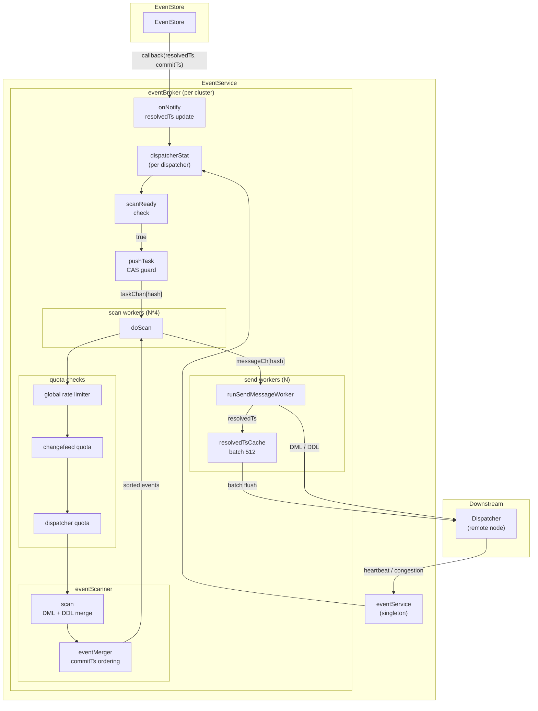

# 第7章 EventService とイベント配信

> **本章で読むソース**
>
> - [`pkg/eventservice/event_service.go`](https://github.com/pingcap/ticdc/blob/v8.5.6/pkg/eventservice/event_service.go)
> - [`pkg/eventservice/event_broker.go`](https://github.com/pingcap/ticdc/blob/v8.5.6/pkg/eventservice/event_broker.go)
> - [`pkg/eventservice/event_scanner.go`](https://github.com/pingcap/ticdc/blob/v8.5.6/pkg/eventservice/event_scanner.go)
> - [`pkg/eventservice/dispatcher_stat.go`](https://github.com/pingcap/ticdc/blob/v8.5.6/pkg/eventservice/dispatcher_stat.go)
> - [`pkg/eventservice/metrics_collector.go`](https://github.com/pingcap/ticdc/blob/v8.5.6/pkg/eventservice/metrics_collector.go)

## この章の狙い

EventStore は TiKV からの変更イベントを Pebble に蓄積する。
Dispatcher はそのイベントを受け取り、下流の MySQL や Kafka へ書き込む。
この2つを直結すると、複数の Changefeed が同一テーブルを購読するケースや、Dispatcher の処理速度に差がある状況を扱えない。

**EventService** は EventStore と Dispatcher の間に立ち、イベントの読み出し、時系列整列、配信、背圧制御を一手に引き受ける中間層である。
本章では、EventService を構成する3つの主要構造体（`eventService`、`eventBroker`、`dispatcherStat`）と、走査ロジックを担う `eventScanner` の実装を読み、イベントがどのように EventStore から Dispatcher へ届くかを追う。

## 前提

第3章で読んだ MessageCenter の送受信モデル、第5章の EventStore のイテレータインターフェイス、第6章の SchemaStore の DDL 取得 API を前提とする。
Go の `sync.Map` と `errgroup` の基本を想定する。

## EventService の構造

`eventService` はシステム全体でシングルトンとして動作する。
EventStore、SchemaStore、MessageCenter の3つへの参照を保持し、TiDB クラスタごとに `eventBroker` を生成して管理する。

[`pkg/eventservice/event_service.go` L72-L82](https://github.com/pingcap/ticdc/blob/v8.5.6/pkg/eventservice/event_service.go#L72-L82)

```go
type eventService struct {
	mc          messaging.MessageCenter
	eventStore  eventstore.EventStore
	schemaStore schemastore.SchemaStore
	// clusterID -> eventBroker
	brokers map[uint64]*eventBroker

	// TODO: use a better way to cache the acceptorInfos
	dispatcherInfoChan  chan DispatcherInfo
	dispatcherHeartbeat chan *DispatcherHeartBeatWithServerID
}
```

`brokers` マップの鍵は TiDB クラスタ ID である。
マルチクラスタ構成では、クラスタごとに独立した `eventBroker` がイベント配信を担う。

### メッセージの受信とディスパッチ

EventService は起動時に MessageCenter へハンドラを登録する。

[`pkg/eventservice/event_service.go` L84-L96](https://github.com/pingcap/ticdc/blob/v8.5.6/pkg/eventservice/event_service.go#L84-L96)

```go
func New(eventStore eventstore.EventStore, schemaStore schemastore.SchemaStore) common.SubModule {
	mc := appcontext.GetService[messaging.MessageCenter](appcontext.MessageCenter)
	es := &eventService{
		mc:                  mc,
		eventStore:          eventStore,
		schemaStore:         schemaStore,
		brokers:             make(map[uint64]*eventBroker),
		dispatcherInfoChan:  make(chan DispatcherInfo, 32),
		dispatcherHeartbeat: make(chan *DispatcherHeartBeatWithServerID, 32),
	}
	es.mc.RegisterHandler(messaging.EventServiceTopic, es.handleMessage)
	return es
}
```

受信メッセージは `handleMessage` で3種類に分岐する。

[`pkg/eventservice/event_service.go` L145-L178](https://github.com/pingcap/ticdc/blob/v8.5.6/pkg/eventservice/event_service.go#L145-L178)

```go
func (s *eventService) handleMessage(ctx context.Context, msg *messaging.TargetMessage) error {
	switch msg.Type {
	case messaging.TypeDispatcherRequest:
		infos := msgToDispatcherInfo(msg)
		for _, info := range infos {
			// ... (中略) ...
			case s.dispatcherInfoChan <- info:
			}
		}
	case messaging.TypeDispatcherHeartbeat:
		// ... (中略) ...
		case s.dispatcherHeartbeat <- &DispatcherHeartBeatWithServerID{
			serverID:  msg.From.String(),
			heartbeat: heartbeat,
		}:
		}
	case messaging.TypeCongestionControl:
		// ... (中略) ...
		s.handleCongestionControl(msg.From, m)
	}
	return nil
}
```

- **TypeDispatcherRequest**: Dispatcher の登録、解除、リセットの要求。`dispatcherInfoChan` に投入される。
- **TypeDispatcherHeartbeat**: Dispatcher からの進捗報告。`dispatcherHeartbeat` チャネルに投入される。
- **TypeCongestionControl**: メモリクォータの通知。背圧制御に使われる。

### イベントループ

`Run` メソッドは上記2つのチャネルから読み取り、アクションを実行する単一の goroutine ループである。

[`pkg/eventservice/event_service.go` L102-L134](https://github.com/pingcap/ticdc/blob/v8.5.6/pkg/eventservice/event_service.go#L102-L134)

```go
func (s *eventService) Run(ctx context.Context) error {
	// ... (中略) ...
	for {
		select {
		case <-ctx.Done():
			return nil
		case <-ticker.C:
			dispatcherChanSize.Set(float64(len(s.dispatcherInfoChan)))
			heartbeatChanSize.Set(float64(len(s.dispatcherHeartbeat)))
		case info := <-s.dispatcherInfoChan:
			switch info.GetActionType() {
			case eventpb.ActionType_ACTION_TYPE_REGISTER:
				s.registerDispatcher(ctx, info)
			case eventpb.ActionType_ACTION_TYPE_REMOVE:
				s.deregisterDispatcher(info)
			case eventpb.ActionType_ACTION_TYPE_RESET:
				s.resetDispatcher(info)
			}
		case heartbeat := <-s.dispatcherHeartbeat:
			s.handleDispatcherHeartbeat(heartbeat)
		}
	}
}
```

Dispatcher の登録要求が到着すると、対応する TiDB クラスタ ID から `eventBroker` を検索し、存在しなければ新規に作成する。

[`pkg/eventservice/event_service.go` L181-L194](https://github.com/pingcap/ticdc/blob/v8.5.6/pkg/eventservice/event_service.go#L181-L194)

```go
func (s *eventService) registerDispatcher(ctx context.Context, info DispatcherInfo) {
	clusterID := info.GetClusterID()
	c, ok := s.brokers[clusterID]
	if !ok {
		c = newEventBroker(ctx, clusterID, s.eventStore, s.schemaStore, s.mc, info.GetTimezone(), info.GetIntegrity())
		s.brokers[clusterID] = c
	}
	err := c.addDispatcher(info)
	// ... (中略) ...
}
```

## EventBroker の構造

**EventBroker** は1つの TiDB クラスタに対応し、すべての Dispatcher と Changefeed の状態を管理する。
EventStore からのイベント取得、走査ワーカーの駆動、送信ワーカーによるメッセージ配信を統括する。

[`pkg/eventservice/event_broker.go` L59-L96](https://github.com/pingcap/ticdc/blob/v8.5.6/pkg/eventservice/event_broker.go#L59-L96)

```go
type eventBroker struct {
	tidbClusterID uint64
	eventStore  eventstore.EventStore
	schemaStore schemastore.SchemaStore
	mounter     event.Mounter
	msgSender messaging.MessageSender
	pdClock   pdutil.Clock

	changefeedMap sync.Map // common.ChangeFeedID -> *changefeedStatus
	dispatchers sync.Map
	tableTriggerDispatchers sync.Map

	taskChan []chan scanTask
	messageCh     []chan *wrapEvent
	redoMessageCh []chan *wrapEvent

	cancel context.CancelFunc
	g      *errgroup.Group

	scanRateLimiter  *rate.Limiter
	scanLimitInBytes uint64
}
```

構造体の主要なフィールドは次の3群に分かれる。

- **データソース群**: `eventStore`、`schemaStore`、`mounter` がイベントの取得とデコードを担う。
- **Dispatcher 管理群**: `dispatchers`（通常テーブル用）と `tableTriggerDispatchers`（DDL 用）が `sync.Map` で全 Dispatcher の状態を保持する。`changefeedMap` は Changefeed 単位の集約状態を保持する。
- **ワーカーチャネル群**: `taskChan` が走査タスク、`messageCh` と `redoMessageCh` が送信メッセージのキューである。

### ワーカーの起動

`newEventBroker` は走査ワーカーと送信ワーカーを `errgroup` で並列起動する。

[`pkg/eventservice/event_broker.go` L98-L185](https://github.com/pingcap/ticdc/blob/v8.5.6/pkg/eventservice/event_broker.go#L98-L185)

```go
func newEventBroker(
	ctx context.Context,
	id uint64,
	// ... (中略) ...
) *eventBroker {
	sendMessageWorkerCount := config.DefaultBasicEventHandlerConcurrency
	scanWorkerCount := config.DefaultBasicEventHandlerConcurrency * 4

	// ... (中略) ...
	for i := 0; i < sendMessageWorkerCount; i++ {
		c.messageCh[i] = make(chan *wrapEvent, sendMessageQueueSize)
		g.Go(func() error {
			return c.runSendMessageWorker(ctx, i, messaging.EventCollectorTopic)
		})
		c.redoMessageCh[i] = make(chan *wrapEvent, sendMessageQueueSize)
		g.Go(func() error {
			return c.runSendMessageWorker(ctx, i, messaging.RedoEventCollectorTopic)
		})
	}

	for i := 0; i < scanWorkerCount; i++ {
		taskChan := make(chan scanTask, scanTaskQueueSize)
		c.taskChan[i] = taskChan
		g.Go(func() error {
			return c.runScanWorker(ctx, taskChan)
		})
	}
	// ... (中略) ...
}
```

走査ワーカー数は送信ワーカー数の4倍に設定される。
走査は EventStore のイテレータを開いてディスク I/O を伴うため、送信より多くの並列度を確保する設計である。

さらに、次の3つのバックグラウンド goroutine が起動する。

- `tickTableTriggerDispatchers`: 50ms 間隔で DDL 用 Dispatcher をポーリングし、DDL イベントを送信する。
- `logUninitializedDispatchers`: 1分間隔で未初期化の Dispatcher を検出してログに記録する。
- `reportDispatcherStatToStore`: 10秒間隔で Dispatcher の checkpointTs を EventStore に報告し、非アクティブな Dispatcher を除去する。

## Dispatcher の登録と通知モデル

### addDispatcher による登録

Dispatcher の登録処理は `addDispatcher` メソッドに集約される。
通常テーブル用の Dispatcher は EventStore へサブスクリプションを登録し、コールバックを設定する。

[`pkg/eventservice/event_broker.go` L923-L960](https://github.com/pingcap/ticdc/blob/v8.5.6/pkg/eventservice/event_broker.go#L923-L960)

```go
func (c *eventBroker) addDispatcher(info DispatcherInfo) error {
	// ... (中略) ...
	dispatcher := newDispatcherStat(info, uint64(len(c.taskChan)), uint64(len(c.messageCh)), nil, status)
	// ... (中略) ...
	success := c.eventStore.RegisterDispatcher(
		changefeedID,
		id,
		span,
		info.GetStartTs(),
		func(resolvedTs uint64, latestCommitTs uint64) {
			d := dispatcherPtr.Load()
			if d.isRemoved.Load() {
				return
			}
			c.onNotify(d, resolvedTs, latestCommitTs)
		},
		info.IsOnlyReuse(),
		info.GetBdrMode(),
	)
	// ... (中略) ...
}
```

登録時に渡すコールバック関数が、EventStore からの通知を受けるエントリポイントとなる。
EventStore が新しい resolvedTs や DML を受け取るたびに、このコールバックが呼ばれる。

### onNotify による走査タスクの投入

コールバック内で呼ばれる `onNotify` は、resolvedTs の更新判定と走査タスクの投入を行う。

[`pkg/eventservice/event_broker.go` L878-L887](https://github.com/pingcap/ticdc/blob/v8.5.6/pkg/eventservice/event_broker.go#L878-L887)

```go
func (c *eventBroker) onNotify(d *dispatcherStat, resolvedTs uint64, commitTs uint64) {
	if d.onResolvedTs(resolvedTs) {
		d.lastReceivedResolvedTsTime.Store(time.Now())
		updateMetricEventStoreOutputResolved(d.info.GetMode())
		d.onLatestCommitTs(commitTs)
		if c.scanReady(d) {
			c.pushTask(d, true)
		}
	}
}
```

`onResolvedTs` は単調増加を保証するアトミック更新であり、古い resolvedTs による重複通知を防ぐ。
`scanReady` が `true` を返した場合にのみ、走査タスクが `taskChan` に投入される。

### pushTask による排他的タスク投入

`pushTask` は `isTaskScanning` フラグの CAS 操作により、同一 Dispatcher に対して走査タスクが1つだけ実行されることを保証する。

[`pkg/eventservice/event_broker.go` L889-L909](https://github.com/pingcap/ticdc/blob/v8.5.6/pkg/eventservice/event_broker.go#L889-L909)

```go
func (c *eventBroker) pushTask(d *dispatcherStat, force bool) {
	if d.isRemoved.Load() {
		return
	}
	if !d.isTaskScanning.CompareAndSwap(false, true) {
		return
	}
	if force {
		c.taskChan[d.scanWorkerIndex] <- d
	} else {
		timer := time.NewTimer(time.Millisecond * 10)
		select {
		case c.taskChan[d.scanWorkerIndex] <- d:
		case <-timer.C:
			d.isTaskScanning.Store(false)
		}
	}
}
```

`force` が `false` の場合は 10ms のタイムアウトを設け、チャネルが満杯ならタスクを破棄する。
走査タスクを失ってもデータ欠損にはならない。次の resolvedTs 通知で再度タスクが生成されるためである。

## DispatcherStat による進捗追跡

**DispatcherStat** は個々の Dispatcher の状態を保持する構造体である。
走査範囲の決定、送信済み resolvedTs の管理、メモリクォータの追跡を担う。

[`pkg/eventservice/dispatcher_stat.go` L44-L132](https://github.com/pingcap/ticdc/blob/v8.5.6/pkg/eventservice/dispatcher_stat.go#L44-L132)

```go
type dispatcherStat struct {
	id common.DispatcherID
	changefeedStat *changefeedStatus
	scanWorkerIndex int
	messageWorkerIndex int
	info               DispatcherInfo
	filter             filter.Filter
	startTs uint64
	startTableInfo *common.TableInfo
	epoch uint64

	seq atomic.Uint64
	handshakeLock sync.Mutex

	// ... (中略) ...

	receivedResolvedTs atomic.Uint64
	eventStoreCommitTs atomic.Uint64
	checkpointTs atomic.Uint64
	sentResolvedTs atomic.Uint64

	lastScannedCommitTs atomic.Uint64
	lastScannedStartTs  atomic.Uint64

	isRemoved atomic.Bool
	isTaskScanning atomic.Bool
}
```

重要なタイムスタンプフィールドの関係は次のとおりである。

- **receivedResolvedTs**: EventStore から通知された最新の resolvedTs。走査対象範囲の上限を決める。
- **sentResolvedTs**: Dispatcher に送信済みの resolvedTs。走査対象範囲の下限を決める。
- **eventStoreCommitTs**: EventStore から通知された最新の DML commitTs。新規イベントの有無の判定に使う。
- **checkpointTs**: Dispatcher がハートビートで報告してきた checkpointTs。EventStore の GC に使う。
- **lastScannedCommitTs / lastScannedStartTs**: 前回の走査で最後に処理したトランザクションの commitTs と startTs。次の走査範囲の起点となる。

### 走査範囲の決定

`getDataRange` メソッドは、上記のタイムスタンプから走査すべきデータ範囲を算出する。

[`pkg/eventservice/dispatcher_stat.go` L239-L257](https://github.com/pingcap/ticdc/blob/v8.5.6/pkg/eventservice/dispatcher_stat.go#L239-L257)

```go
func (a *dispatcherStat) getDataRange() (common.DataRange, bool) {
	lastTxnCommitTs := a.lastScannedCommitTs.Load()
	lastTxnStartTs := a.lastScannedStartTs.Load()

	resolvedTs := a.receivedResolvedTs.Load()
	if lastTxnCommitTs >= resolvedTs {
		return common.DataRange{}, false
	}
	r := common.DataRange{
		Span:                  a.info.GetTableSpan(),
		CommitTsStart:         lastTxnCommitTs,
		CommitTsEnd:           resolvedTs,
		LastScannedTxnStartTs: lastTxnStartTs,
	}
	return r, true
}
```

`lastTxnCommitTs >= resolvedTs` の場合は、前回の走査から resolvedTs が進んでいないため走査不要と判定する。

### ワーカーへの振り分け

Dispatcher ごとの `scanWorkerIndex` と `messageWorkerIndex` は、Dispatcher ID のハッシュ値で決まる。

[`pkg/eventservice/dispatcher_stat.go` L145-L146](https://github.com/pingcap/ticdc/blob/v8.5.6/pkg/eventservice/dispatcher_stat.go#L145-L146)

```go
	dispStat := &dispatcherStat{
		// ... (中略) ...
		scanWorkerIndex:    (common.GID)(id).Hash(scanWorkerCount),
		messageWorkerIndex: (common.GID)(id).Hash(messageWorkerCount),
```

同一の Dispatcher は常に同じ走査ワーカーと送信ワーカーに割り当てられる。
この固定割り当てにより、1つの Dispatcher のイベント順序が保証される。

## EventScanner の走査ロジック

**EventScanner** は EventStore と SchemaStore から DML と DDL を読み出し、commitTs 順に整列して返す。
EventBroker の `doScan` メソッドから1回の走査ごとに生成される、使い捨てのオブジェクトである。

[`pkg/eventservice/event_scanner.go` L59-L79](https://github.com/pingcap/ticdc/blob/v8.5.6/pkg/eventservice/event_scanner.go#L59-L79)

```go
type eventScanner struct {
	eventGetter  eventGetter
	schemaGetter schemaGetter
	mounter      event.Mounter
	mode         int64
}

func newEventScanner(
	eventStore eventstore.EventStore,
	schemaStore schemastore.SchemaStore,
	mounter event.Mounter,
	mode int64,
) *eventScanner {
	return &eventScanner{
		eventGetter:  eventStore,
		schemaGetter: schemaStore,
		mounter:      mounter,
		mode:         mode,
	}
}
```

### scan メソッドの全体像

`scan` メソッドは、DDL の事前取得、DML イテレータの取得、イベントのマージという3段階で動作する。

[`pkg/eventservice/event_scanner.go` L114-L145](https://github.com/pingcap/ticdc/blob/v8.5.6/pkg/eventservice/event_scanner.go#L114-L145)

```go
func (s *eventScanner) scan(
	ctx context.Context,
	dispatcherStat *dispatcherStat,
	dataRange common.DataRange,
	limit scanLimit,
) (int64, []event.Event, bool, error) {
	sess := newSession(ctx, dispatcherStat, dataRange, limit)
	defer sess.recordMetrics()

	// Fetch DDL events
	start := time.Now()
	events, err := s.fetchDDLEvents(dispatcherStat, dataRange)
	if err != nil {
		return 0, nil, false, err
	}
	// ... (中略) ...

	iter := s.eventGetter.GetIterator(dispatcherStat.info.GetID(), dataRange)
	if iter == nil {
		resolved := event.NewResolvedEvent(dataRange.CommitTsEnd, dispatcherStat.id, dispatcherStat.epoch)
		events = append(events, resolved)
		sess.appendEvents(events)
		return 0, sess.events, false, nil
	}
	defer s.closeIterator(iter)

	merger := newEventMerger(events)
	interrupted, err := s.scanAndMergeEvents(sess, merger, iter)
	return sess.eventBytes, sess.events, interrupted, err
}
```

イテレータが `nil`（対象範囲にイベントが存在しない場合）の場合は、DDL イベントと resolvedTs だけを返す。
イベントが存在する場合は、`eventMerger` が DML と DDL を commitTs 順にマージする。

### DML と DDL のマージ

`eventMerger` は、DDL イベントのリストを保持し、DML の commitTs と比較しながら正しい順序で挿入する。

[`pkg/eventservice/event_scanner.go` L510-L527](https://github.com/pingcap/ticdc/blob/v8.5.6/pkg/eventservice/event_scanner.go#L510-L527)

```go
func (m *eventMerger) mergeWithPrecedingDDLs(batchDML *event.BatchDMLEvent) []event.Event {
	if batchDML == nil || batchDML.DMLCount() == 0 {
		return nil
	}

	commitTs := batchDML.GetCommitTs()
	var events []event.Event
	for m.ddlIndex < len(m.ddlEvents) && m.ddlEvents[m.ddlIndex].GetCommitTs() < commitTs {
		events = append(events, m.ddlEvents[m.ddlIndex])
		m.ddlIndex++
	}

	events = append(events, batchDML)

	m.lastBatchDMLCommitTs = commitTs
	return events
}
```

同じ commitTs を持つ DML と DDL がある場合、DML が先に配置される。
DDL は `commitTs < dmlCommitTs` の条件でのみ DML の前に挿入されるためである。
この順序付けにより、DDL の適用前に同じトランザクションの DML が下流に到達することが保証される。

### 走査の中断

走査は、処理バイト数が上限に達した場合に中断される。
ただし、中断が許される条件は限定的である。

[`pkg/eventservice/event_scanner.go` L592-L605](https://github.com/pingcap/ticdc/blob/v8.5.6/pkg/eventservice/event_scanner.go#L592-L605)

```go
func (m *eventMerger) canInterrupt(newCommitTs uint64, currentBatchDML *event.BatchDMLEvent) bool {
	currentDMLCommitTs := uint64(0)
	if len(currentBatchDML.DMLEvents) > 0 {
		currentDMLCommitTs = currentBatchDML.GetCommitTs()
	}

	if currentDMLCommitTs != newCommitTs {
		return true
	}

	return !m.hasDDLAtCommitTs(newCommitTs)
}
```

中断可能な条件は次の2つのいずれかである。

1. 新しいイベントの commitTs が現在のバッチの commitTs と異なる（トランザクション境界にいる）。
2. commitTs が同じでも、その commitTs に DDL イベントが存在しない。

同じ commitTs に DML と DDL が共存する場合は、すべてをアトミックに処理するまで中断できない。
これにより、DDL の適用と同一トランザクションの DML が分断されることを防ぐ。

## 背圧制御と送信

### 多段のメモリクォータ

EventBroker の `doScan` メソッドは、走査の実行前に3段階のクォータチェックを行う。

[`pkg/eventservice/event_broker.go` L597-L628](https://github.com/pingcap/ticdc/blob/v8.5.6/pkg/eventservice/event_broker.go#L597-L628)

```go
	// 1. Global rate limiter
	if !c.scanRateLimiter.AllowN(time.Now(), int(task.lastScanBytes.Load())) {
		// ... skip scan ...
		return
	}

	// ... (中略) ...

	// 2. Changefeed-level memory quota
	available := item.(*atomic.Uint64)
	if available.Load() < c.scanLimitInBytes {
		task.resetScanLimit()
	}

	sl := c.calculateScanLimit(task)
	ok = allocQuota(available, uint64(sl.maxDMLBytes))
	if !ok {
		// ... skip scan and send signal resolvedTs ...
		return
	}

	// 3. Dispatcher-level memory quota
	if uint64(sl.maxDMLBytes) > task.availableMemoryQuota.Load() {
		// ... skip scan and send signal resolvedTs ...
		return
	}
```

第1段階はグローバルなレートリミッタ（`rate.Limiter`）であり、全 Dispatcher の走査バイト数の合計を制限する。
第2段階は Changefeed レベルのメモリクォータで、下流ノードから `CongestionControl` メッセージで通知される利用可能メモリ量に基づく。
第3段階は個別の Dispatcher レベルのメモリクォータである。

いずれかのクォータが不足した場合、走査はスキップされる。
このとき、`sendSignalResolvedTs` で resolvedTs だけを送信し、Dispatcher 側でのタイムアウトを防ぐ。

### クォータの割り当てと返却

Changefeed レベルのクォータは CAS ループで割り当てられる。

[`pkg/eventservice/event_broker.go` L696-L710](https://github.com/pingcap/ticdc/blob/v8.5.6/pkg/eventservice/event_broker.go#L696-L710)

```go
func allocQuota(quota *atomic.Uint64, nBytes uint64) bool {
	for {
		available := quota.Load()
		if available < nBytes {
			return false
		}
		if quota.CompareAndSwap(available, available-nBytes) {
			return true
		}
	}
}

func releaseQuota(quota *atomic.Uint64, nBytes uint64) {
	quota.Add(nBytes)
}
```

走査で実際に読み取ったバイト数が割り当て量より少なかった場合、差分は `releaseQuota` で返却される。

[`pkg/eventservice/event_broker.go` L632-L636](https://github.com/pingcap/ticdc/blob/v8.5.6/pkg/eventservice/event_broker.go#L632-L636)

```go
	if scannedBytes < 0 {
		releaseQuota(available, uint64(sl.maxDMLBytes))
	} else if scannedBytes >= 0 && scannedBytes < sl.maxDMLBytes {
		releaseQuota(available, uint64(sl.maxDMLBytes-scannedBytes))
	}
```

走査エラー時（`scannedBytes < 0`）は割り当て全量を返却する。

### 送信ワーカーと ResolvedTs のバッチ化

送信ワーカー（`runSendMessageWorker`）は、チャネルからイベントを読み取り、MessageCenter 経由で Dispatcher へ送信する。

[`pkg/eventservice/event_broker.go` L712-L762](https://github.com/pingcap/ticdc/blob/v8.5.6/pkg/eventservice/event_broker.go#L712-L762)

```go
func (c *eventBroker) runSendMessageWorker(ctx context.Context, workerIndex int, topic string) error {
	ticker := time.NewTicker(defaultFlushResolvedTsInterval)
	defer ticker.Stop()

	resolvedTsCacheMap := make(map[node.ID]*resolvedTsCache)
	messageCh := c.getMessageCh(workerIndex, topic == messaging.RedoEventCollectorTopic)
	batchM := make([]*wrapEvent, 0, defaultMaxBatchSize)
	for {
		select {
		case <-ctx.Done():
			return context.Cause(ctx)
		case m := <-messageCh:
			batchM = append(batchM, m)
		LOOP:
			for {
				select {
				case moreM := <-messageCh:
					batchM = append(batchM, moreM)
					if len(batchM) > defaultMaxBatchSize {
						break LOOP
					}
				default:
					break LOOP
				}
			}
			for _, m = range batchM {
				if m.msgType == event.TypeResolvedEvent {
					c.handleResolvedTs(ctx, resolvedTsCacheMap, m, workerIndex, topic)
					continue
				}
				c.flushResolvedTs(ctx, resolvedTsCacheMap[m.serverID], m.serverID, workerIndex, topic)
				c.sendMsg(ctx, tMsg, m.postSendFunc)
				m.reset()
			}
			batchM = batchM[:0]
		case <-ticker.C:
			for serverID, cache := range resolvedTsCacheMap {
				c.flushResolvedTs(ctx, cache, serverID, workerIndex, topic)
			}
		}
	}
}
```

DML や DDL イベントはチャネルから取り出すたびに即座に送信する。
一方、resolvedTs イベントは `resolvedTsCache` に蓄積し、キャッシュが満杯になるか 25ms のタイマーが発火したタイミングでバッチ送信する。

[`pkg/eventservice/dispatcher_stat.go` L387-L420](https://github.com/pingcap/ticdc/blob/v8.5.6/pkg/eventservice/dispatcher_stat.go#L387-L420)

```go
type resolvedTsCache struct {
	cache []pevent.ResolvedEvent
	len int
	limit int
}

func newResolvedTsCache(limit int) *resolvedTsCache {
	return &resolvedTsCache{
		cache: make([]pevent.ResolvedEvent, limit),
		limit: limit,
	}
}

func (c *resolvedTsCache) add(e pevent.ResolvedEvent) {
	c.cache[c.len] = e
	c.len++
}

func (c *resolvedTsCache) isFull() bool {
	return c.len >= c.limit
}
```

キャッシュサイズは 512 エントリに固定される[^1]。

[^1]: `resolvedTsCacheSize = 512` は `event_broker.go` L43 で定義されている。

DML 送信の前に `flushResolvedTs` を呼ぶことで、resolvedTs と DML の順序関係が保たれる。
resolvedTs が DML より後に到着する保証がなければ、Dispatcher 側で「resolvedTs まで全イベント受信済み」という判定が壊れるためである。

### 輻輳時のリトライとメッセージの破棄

`sendMsg` メソッドは、MessageCenter への送信が輻輳（congested）エラーを返した場合に 10ms の待機後にリトライする。

[`pkg/eventservice/event_broker.go` L794-L829](https://github.com/pingcap/ticdc/blob/v8.5.6/pkg/eventservice/event_broker.go#L794-L829)

```go
func (c *eventBroker) sendMsg(ctx context.Context, tMsg *messaging.TargetMessage, postSendMsg func()) {
	// ... (中略) ...
	for {
		err := c.msgSender.SendEvent(tMsg)
		if err != nil {
			if strings.Contains(err.Error(), "congested") {
				time.Sleep(congestedRetryInterval)
				continue
			} else {
				log.Info("send message failed, drop it", zap.Error(err))
				return
			}
		}
		// ... (中略) ...
	}
}
```

輻輳以外のエラー（ネットワーク断など）ではメッセージを破棄する。
Dispatcher 側はイベントの連続性を seq 番号で検証しており、欠損を検出するとリセット要求を送る。
EventBroker はリセット要求を受けて Dispatcher の状態を再構築するため、破棄したメッセージは再送される。

## イベント配信フロー

以下の Mermaid 図は、EventStore からの通知が Dispatcher へ届くまでの全体フローを示す。



## 高速化の工夫: ResolvedTs のバッチ送信とオブジェクトプール

EventService は高頻度で resolvedTs イベントを生成する。
Dispatcher ごとに個別の resolvedTs メッセージを送ると、MessageCenter のスループットがボトルネックになる。

この問題に対し、EventBroker は2つの最適化を組み合わせている。

第1の最適化は、resolvedTs のバッチ送信である。
送信ワーカーは resolvedTs イベントを即座に送信せず、宛先ノードごとの `resolvedTsCache`（512エントリの固定長配列）に蓄積する。
キャッシュが満杯になるか、25ms のタイマーが発火したタイミングで `BatchResolvedEvent` として一括送信する。
これにより、MessageCenter への送信回数を最大 512 分の 1 に削減できる。

キャッシュの実装は固定長配列にインデックスを持たせる素朴な方式であり、動的なメモリ割り当てを回避している。

[`pkg/eventservice/dispatcher_stat.go` L404-L407](https://github.com/pingcap/ticdc/blob/v8.5.6/pkg/eventservice/dispatcher_stat.go#L404-L407)

```go
func (c *resolvedTsCache) add(e pevent.ResolvedEvent) {
	c.cache[c.len] = e
	c.len++
}
```

第2の最適化は、`wrapEvent` のオブジェクトプールである。

[`pkg/eventservice/dispatcher_stat.go` L291-L295](https://github.com/pingcap/ticdc/blob/v8.5.6/pkg/eventservice/dispatcher_stat.go#L291-L295)

```go
var wrapEventPool = sync.Pool{
	New: func() interface{} {
		return &wrapEvent{}
	},
}
```

走査ワーカーから送信ワーカーへの中間表現である `wrapEvent` は `sync.Pool` から取得し、送信後に `reset` して返却する。

[`pkg/eventservice/dispatcher_stat.go` L321-L328](https://github.com/pingcap/ticdc/blob/v8.5.6/pkg/eventservice/dispatcher_stat.go#L321-L328)

```go
func (w *wrapEvent) reset() {
	w.e = nil
	w.postSendFunc = nil
	w.resolvedTsEvent = zeroResolvedEvent
	w.serverID = ""
	w.msgType = -1
	wrapEventPool.Put(w)
}
```

イベント配信では大量の `wrapEvent` が生成と破棄を繰り返すため、プールによる再利用は GC 圧力の軽減に直結する。

これら2つの最適化により、EventService は高頻度のタイムスタンプ更新とイベント配信を低いメモリ割り当てコストで実現している。

## まとめ

EventService は、EventStore と Dispatcher の間に位置するイベント配信の中間層である。
`eventService` がメッセージの受信と Dispatcher の登録を管理し、`eventBroker` がクラスタ単位で走査ワーカーと送信ワーカーを駆動する。
`eventScanner` は EventStore と SchemaStore から DML と DDL を commitTs 順に整列して読み出し、`dispatcherStat` が各 Dispatcher の進捗を追跡して走査範囲を決定する。

背圧制御は3段階のメモリクォータ（グローバルレートリミッタ、Changefeed レベル、Dispatcher レベル）で実現され、下流の処理速度に応じて走査量を動的に調整する。
送信側では resolvedTs のバッチ化と `wrapEvent` のオブジェクトプールにより、高頻度のイベント配信に伴うオーバーヘッドを抑えている。

## 関連する章

- 第3章: MessageCenter のメッセージ送受信モデル。EventService はこの上に構築されている。
- 第5章: EventStore のイテレータ。EventScanner が走査に使うデータ取得元。
- 第6章: SchemaStore の DDL 取得 API。EventScanner が DDL イベントの取得に使う。
- 第8章: Dispatcher と EventCollector。EventService が送信したイベントの受信側。
