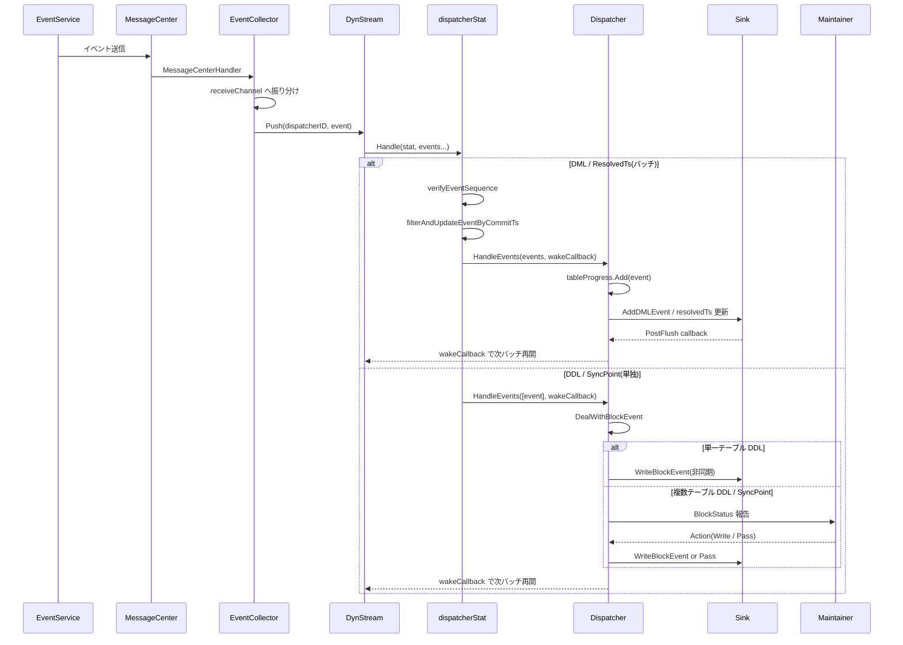

# 第8章 Dispatcher と EventCollector

> **本章で読むソース**
>
> - [`downstreamadapter/dispatcher/basic_dispatcher.go`](https://github.com/pingcap/ticdc/blob/v8.5.6/downstreamadapter/dispatcher/basic_dispatcher.go)
> - [`downstreamadapter/dispatcher/event_dispatcher.go`](https://github.com/pingcap/ticdc/blob/v8.5.6/downstreamadapter/dispatcher/event_dispatcher.go)
> - [`downstreamadapter/dispatcher/table_progress.go`](https://github.com/pingcap/ticdc/blob/v8.5.6/downstreamadapter/dispatcher/table_progress.go)
> - [`downstreamadapter/dispatcher/block_event_executor.go`](https://github.com/pingcap/ticdc/blob/v8.5.6/downstreamadapter/dispatcher/block_event_executor.go)
> - [`downstreamadapter/dispatcher/helper.go`](https://github.com/pingcap/ticdc/blob/v8.5.6/downstreamadapter/dispatcher/helper.go)
> - [`downstreamadapter/dispatcher/basic_dispatcher_info.go`](https://github.com/pingcap/ticdc/blob/v8.5.6/downstreamadapter/dispatcher/basic_dispatcher_info.go)
> - [`downstreamadapter/eventcollector/event_collector.go`](https://github.com/pingcap/ticdc/blob/v8.5.6/downstreamadapter/eventcollector/event_collector.go)
> - [`downstreamadapter/eventcollector/helper.go`](https://github.com/pingcap/ticdc/blob/v8.5.6/downstreamadapter/eventcollector/helper.go)
> - [`downstreamadapter/eventcollector/dispatcher_stat.go`](https://github.com/pingcap/ticdc/blob/v8.5.6/downstreamadapter/eventcollector/dispatcher_stat.go)
> - [`downstreamadapter/dispatchermanager/dispatcher_manager.go`](https://github.com/pingcap/ticdc/blob/v8.5.6/downstreamadapter/dispatchermanager/dispatcher_manager.go)

## この章の狙い

第7章で読んだ EventService は、EventStore からイベントを読み出して配信する中間層だった。
本章では、その配信先である **Dispatcher** と、EventService からのイベントを各 Dispatcher へルーティングする **EventCollector** の実装を読む。

Dispatcher はテーブル単位でイベントを受信し、Sink へ渡す。
DML イベントはバッチで効率的に処理する一方、DDL イベントやSyncPoint イベントは Maintainer との協調を経て順序を保証する必要がある。
この2種類のイベントをどう区別し、どう制御するかが、Dispatcher の設計の核となる。

## 前提

第7章の EventService によるイベント配信モデル、第3章の MessageCenter によるノード間メッセージング、DynStream のパス単位バッチ処理モデルを前提とする。
Go の `sync.Map`、`atomic`、`container/list` の基本を想定する。

## Dispatcher のインターフェイス

Dispatcher は2段の抽象で定義されている。
下位の **DispatcherService** インターフェイスはイベント処理に必要な情報提供とハンドリングを定義し、上位の **Dispatcher** インターフェイスは DispatcherService を埋め込んだうえでライフサイクル管理とブロックイベント処理を加える。

[`downstreamadapter/dispatcher/basic_dispatcher.go` L37-L55](https://github.com/pingcap/ticdc/blob/v8.5.6/downstreamadapter/dispatcher/basic_dispatcher.go#L37-L55)

```go
type DispatcherService interface {
	GetId() common.DispatcherID
	GetMode() int64
	GetStartTs() uint64
	// ... (中略) ...
	GetResolvedTs() uint64
	GetCheckpointTs() uint64
	HandleEvents(events []DispatcherEvent, wakeCallback func()) (block bool)
	IsOutputRawChangeEvent() bool
}
```

[`downstreamadapter/dispatcher/basic_dispatcher.go` L60-L83](https://github.com/pingcap/ticdc/blob/v8.5.6/downstreamadapter/dispatcher/basic_dispatcher.go#L60-L83)

```go
type Dispatcher interface {
	DispatcherService
	GetSchemaID() int64
	HandleDispatcherStatus(*heartbeatpb.DispatcherStatus) (await bool)
	HandleError(err error)
	// ... (中略) ...
	DealWithBlockEvent(event commonEvent.BlockEvent)
	TryClose() (w heartbeatpb.Watermark, ok bool)
	Remove()
}
```

`HandleEvents` はイベントのバッチ処理を担い、戻り値 `block` が `true` のとき DynStream は次のバッチの送出を保留する。
`DealWithBlockEvent` は DDL や SyncPoint を Maintainer と協調しながら処理する。
`TryClose` と `Remove` は2段階の削除プロトコルを構成し、Sink 内のイベントを安全にフラッシュしてから削除する。

## BasicDispatcher の構造

**BasicDispatcher** は Dispatcher インターフェイスの共通実装であり、EventDispatcher と RedoDispatcher の双方がこれを埋め込む。

[`downstreamadapter/dispatcher/basic_dispatcher.go` L116-L216](https://github.com/pingcap/ticdc/blob/v8.5.6/downstreamadapter/dispatcher/basic_dispatcher.go#L116-L216)

```go
type BasicDispatcher struct {
	id       common.DispatcherID
	schemaID int64

	tableSpan       *heartbeatpb.TableSpan
	isCompleteTable bool

	startTs uint64
	// ... (中略) ...
	sink sink.Sink

	resolvedTs uint64

	blockEventStatus BlockEventStatus

	tableProgress *TableProgress

	resendTaskMap *ResendTaskMap

	// ... (中略) ...
	duringHandleEvents atomic.Bool

	seq  uint64
	mode int64
}
```

主要なフィールドの役割を整理する。

- **tableSpan**: この Dispatcher が担当するテーブルの範囲。1テーブル全体を扱うか分割された一部(span)かを `isCompleteTable` で区別する。
- **sink**: 全 Dispatcher が共有する Sink への参照。DML や DDL の書き込み先となる。
- **resolvedTs**: EventService から受信した最新の ResolvedTs。checkpointTs の算出に使う。
- **blockEventStatus**: 現在保留中の DDL や SyncPoint イベントとそのブロック状態を保持する。
- **tableProgress**: Sink に送出済みだが下流フラッシュが未完了のイベントを追跡する。checkpointTs の算出に使う。
- **resendTaskMap**: Maintainer への DDL 報告メッセージを定期的に再送するタスクを管理する。メッセージ喪失への対策となる。

### SharedInfo による設定の共有

Changefeed 内の全 Dispatcher は、タイムゾーン、フィルタ設定、SyncPoint 設定などの共通パラメータを個別に持たず、**SharedInfo** 構造体を通じて共有する。

[`downstreamadapter/dispatcher/basic_dispatcher_info.go` L32-L75](https://github.com/pingcap/ticdc/blob/v8.5.6/downstreamadapter/dispatcher/basic_dispatcher_info.go#L32-L75)

```go
type SharedInfo struct {
	changefeedID         common.ChangeFeedID
	timezone             string
	bdrMode              bool
	outputRawChangeEvent bool
	integrityConfig      *eventpb.IntegrityConfig
	filterConfig         *eventpb.FilterConfig
	syncPointConfig      *syncpoint.SyncPointConfig
	txnAtomicity         config.AtomicityLevel
	enableSplittableCheck bool
	statusesChan          chan TableSpanStatusWithSeq
	blockStatusesChan     chan *heartbeatpb.TableSpanBlockStatus
	blockExecutor         *blockEventExecutor
	errCh                 chan error
	metricHandleDDLHis    prometheus.Observer
}
```

`statusesChan` と `blockStatusesChan` は全 Dispatcher が書き込み、DispatcherManager が読み取る共有チャネルである。
`blockExecutor` は DDL 実行を DynStream のゴルーチンから分離するためのワーカープールであり、後述する。

## EventDispatcher

**EventDispatcher** は BasicDispatcher を埋め込み、通常のテーブルイベント処理を担う具象型である。

[`downstreamadapter/dispatcher/event_dispatcher.go` L35-L49](https://github.com/pingcap/ticdc/blob/v8.5.6/downstreamadapter/dispatcher/event_dispatcher.go#L35-L49)

```go
type EventDispatcher struct {
	*BasicDispatcher
	BootstrapState bootstrapState
	redoEnable     bool
	redoGlobalTs   *atomic.Uint64
	cacheEvents struct {
		sync.Mutex
		events chan cacheEvents
	}
}
```

Redo ログが有効な場合、`redoGlobalTs` より大きい commitTs を持つイベントは `cacheEvents` に退避される。
`HandleEvents` でこの判定が行われる。

[`downstreamadapter/dispatcher/event_dispatcher.go` L135-L143](https://github.com/pingcap/ticdc/blob/v8.5.6/downstreamadapter/dispatcher/event_dispatcher.go#L135-L143)

```go
func (d *EventDispatcher) HandleEvents(dispatcherEvents []DispatcherEvent, wakeCallback func()) bool {
	if d.redoEnable && len(dispatcherEvents) > 0 &&
		d.redoGlobalTs.Load() < dispatcherEvents[len(dispatcherEvents)-1].Event.GetCommitTs() {
		d.cache(dispatcherEvents, wakeCallback)
		return true
	}
	return d.handleEvents(dispatcherEvents, wakeCallback)
}
```

Redo ログが追いついていなければバッチ末尾の commitTs で判定し、キャッシュに退避して `block = true` を返す。
Redo の resolvedTs が進んだとき `HandleCacheEvents` が呼ばれ、退避されたイベントが再度処理される。

## EventCollector

**EventCollector** は EventService と Dispatcher の間に立ち、インスタンス単位でイベントをルーティングする中継層である。

[`downstreamadapter/eventcollector/event_collector.go` L105-L147](https://github.com/pingcap/ticdc/blob/v8.5.6/downstreamadapter/eventcollector/event_collector.go#L105-L147)

```go
type EventCollector struct {
	serverId      node.ID
	dispatcherMap sync.Map
	changefeedMap sync.Map

	mc messaging.MessageCenter
	// ... (中略) ...
	receiveChannels     []chan *messaging.TargetMessage
	redoReceiveChannels []chan *messaging.TargetMessage
	ds  dynstream.DynamicStream[common.GID, common.DispatcherID, dispatcher.DispatcherEvent,
		*dispatcherStat, *EventsHandler]
	redoDs dynstream.DynamicStream[common.GID, common.DispatcherID, dispatcher.DispatcherEvent,
		*dispatcherStat, *EventsHandler]
	// ... (中略) ...
}
```

`ds` と `redoDs` はそれぞれ通常モードと Redo モードの DynStream インスタンスである。
EventService から届いたメッセージは `receiveChannels` で並列に受信され、DynStream へ投入される。

### メッセージの受信とルーティング

EventCollector は起動時に MessageCenter へ2つのハンドラを登録する。

[`downstreamadapter/eventcollector/event_collector.go` L179-L181](https://github.com/pingcap/ticdc/blob/v8.5.6/downstreamadapter/eventcollector/event_collector.go#L179-L181)

```go
eventCollector.mc.RegisterHandler(messaging.EventCollectorTopic, eventCollector.MessageCenterHandler)
eventCollector.mc.RegisterHandler(messaging.RedoEventCollectorTopic, eventCollector.RedoMessageCenterHandler)
```

`MessageCenterHandler` はメッセージの種類を判別する。
LogService イベント(DML、DDL、ResolvedTs)であれば、メッセージのグループ ID を使ってハッシュ分散し `receiveChannels` へ振り分ける。

[`downstreamadapter/eventcollector/event_collector.go` L495-L509](https://github.com/pingcap/ticdc/blob/v8.5.6/downstreamadapter/eventcollector/event_collector.go#L495-L509)

```go
func (c *EventCollector) MessageCenterHandler(_ context.Context,
	targetMessage *messaging.TargetMessage) error {
	// ... (中略) ...
	if targetMessage.Type.IsLogServiceEvent() {
		c.receiveChannels[targetMessage.GetGroup()%
			uint64(len(c.receiveChannels))] <- targetMessage
		return nil
	}
	// ... (中略) ...
}
```

各 `receiveChannel` は専用ゴルーチンの `runDispatchMessage` で消費される。
ここでイベントを `DispatcherEvent` に包んで DynStream の `Push` に渡す。

[`downstreamadapter/eventcollector/event_collector.go` L549-L566](https://github.com/pingcap/ticdc/blob/v8.5.6/downstreamadapter/eventcollector/event_collector.go#L549-L566)

```go
for _, msg := range targetMessage.Message {
	switch e := msg.(type) {
	case event.Event:
		switch e.GetType() {
		case event.TypeBatchResolvedEvent:
			events := e.(*event.BatchResolvedEvent).Events
			from := &targetMessage.From
			// ... (中略) ...
			for _, resolvedEvent := range events {
				ds.Push(resolvedEvent.DispatcherID,
					dispatcher.NewDispatcherEvent(from, resolvedEvent))
				// ... (中略) ...
			}
		default:
			// ... (中略) ...
			ds.Push(e.GetDispatcherID(), dispatcherEvent)
		}
	}
}
```

DynStream は DispatcherID をパスとしてイベントを振り分け、`EventsHandler.Handle` を呼び出す。

### Dispatcher の登録と削除

Dispatcher を EventCollector に登録すると、DynStream にパスが追加され、EventService への登録メッセージが送信される。

[`downstreamadapter/eventcollector/event_collector.go` L247-L276](https://github.com/pingcap/ticdc/blob/v8.5.6/downstreamadapter/eventcollector/event_collector.go#L247-L276)

```go
func (c *EventCollector) PrepareAddDispatcher(
	target dispatcher.DispatcherService,
	memoryQuota uint64,
	readyCallback func(),
) {
	// ... (中略) ...
	stat := newDispatcherStat(target, c, readyCallback)
	c.dispatcherMap.Store(target.GetId(), stat)
	// ... (中略) ...
	ds := c.getDynamicStream(target.GetMode())
	areaSetting := dynstream.NewAreaSettingsWithMaxPendingSize(memoryQuota,
		dynstream.MemoryControlForEventCollector, "eventCollector")
	err := ds.AddPath(target.GetId(), stat, areaSetting)
	// ... (中略) ...
	stat.run()
}
```

`stat.run()` はローカル EventService への登録メッセージを送信する。
削除時は `RemoveDispatcher` が DynStream からパスを除去し、EventService に対しても削除メッセージを送る。

## DynStream によるイベントのバッチ制御

EventCollector の DynStream は `EventsHandler` でイベントの型ごとにバッチ制御を定義する。

[`downstreamadapter/eventcollector/helper.go` L114-L126](https://github.com/pingcap/ticdc/blob/v8.5.6/downstreamadapter/eventcollector/helper.go#L114-L126)

```go
const (
	DataGroupResolvedTsOrDML = iota + 1
	DataGroupDDL
	DataGroupSyncPoint
	DataGroupHandshake
	DataGroupReady
	DataGroupNotReusable
	DataGroupDrop
)
```

[`downstreamadapter/eventcollector/helper.go` L127-L151](https://github.com/pingcap/ticdc/blob/v8.5.6/downstreamadapter/eventcollector/helper.go#L127-L151)

```go
func (h *EventsHandler) GetType(event dispatcher.DispatcherEvent) dynstream.EventType {
	switch event.GetType() {
	case commonEvent.TypeResolvedEvent:
		return dynstream.EventType{DataGroup: DataGroupResolvedTsOrDML,
			Property: dynstream.PeriodicSignal, Droppable: true}
	case commonEvent.TypeDMLEvent:
		return dynstream.EventType{DataGroup: DataGroupResolvedTsOrDML,
			Property: dynstream.BatchableData, Droppable: true}
	// ... (中略) ...
	case commonEvent.TypeDDLEvent:
		return dynstream.EventType{DataGroup: DataGroupDDL,
			Property: dynstream.NonBatchable, Droppable: true}
	case commonEvent.TypeSyncPointEvent:
		return dynstream.EventType{DataGroup: DataGroupSyncPoint,
			Property: dynstream.NonBatchable, Droppable: true}
	// ... (中略) ...
	}
}
```

DML と ResolvedTs は同じ `DataGroupResolvedTsOrDML` に属し、バッチ処理される。
DDL と SyncPoint はそれぞれ別の DataGroup かつ `NonBatchable` であるため、必ず単独で `Handle` に渡される。
この分離により、DML のバッチサイズを大きく保ちつつ、DDL は単独処理の保証を DynStream 側で実現している。

## イベント処理の全体フロー

以下の Mermaid 図は、EventService から下流への書き込みまでのイベントの流れを示す。



## handleEvents の詳細

BasicDispatcher の `handleEvents` は、DynStream から渡されたイベントバッチを種別ごとに処理する。

[`downstreamadapter/dispatcher/basic_dispatcher.go` L412-L419](https://github.com/pingcap/ticdc/blob/v8.5.6/downstreamadapter/dispatcher/basic_dispatcher.go#L412-L419)

```go
func (d *BasicDispatcher) handleEvents(dispatcherEvents []DispatcherEvent,
	wakeCallback func()) bool {
	if d.GetRemovingStatus() {
		log.Warn("dispatcher is removing", zap.Any("id", d.id))
		return true
	}
	d.duringHandleEvents.Store(true)
	defer d.duringHandleEvents.Store(false)
```

`duringHandleEvents` フラグは、イベント処理中に `TryClose` が呼ばれた場合の早期削除を防ぐ。
`tableProgress` が一時的に空になるタイミングで `TryClose` が `true` を返してしまうことを防止する。

DML イベントはバッチ末尾に `PostFlushFunc` を設定する。

[`downstreamadapter/dispatcher/basic_dispatcher.go` L480-L489](https://github.com/pingcap/ticdc/blob/v8.5.6/downstreamadapter/dispatcher/basic_dispatcher.go#L480-L489)

```go
dml.ReplicatingTs = d.creationPDTs
dml.AddPostFlushFunc(func() {
	if d.tableProgress.Empty() {
		dmlWakeOnce.Do(wakeCallback)
	}
})
dmlEvents = append(dmlEvents, dml)
```

`creationPDTs` は Dispatcher 生成時の PD タイムスタンプである。
MySQL Sink では、この値より前の commitTs を持つ DML を `REPLACE INTO` で書き込み、重複キーエラーを回避する。
ノード再起動やテーブルのスケジュール移動によって同一 DML を二重に受信する可能性があるためである。

`PostFlushFunc` のコールバックは、`tableProgress` が空(全イベントのフラッシュ完了)のときだけ `wakeCallback` を呼ぶ。
`sync.Once` により、バッチ内の複数 DML が同時にフラッシュ完了しても `wakeCallback` は一度だけ実行される。

DDL イベントは必ず単独で届き、`DealWithBlockEvent` に委譲される。

[`downstreamadapter/dispatcher/basic_dispatcher.go` L491-L535](https://github.com/pingcap/ticdc/blob/v8.5.6/downstreamadapter/dispatcher/basic_dispatcher.go#L491-L535)

```go
case commonEvent.TypeDDLEvent:
	if len(dispatcherEvents) != 1 {
		log.Panic("ddl event should only be singly handled",
			zap.Stringer("dispatcherID", d.id))
	}
	// ... (中略) ...
	ddl.AddPostFlushFunc(func() {
		if d.tableSchemaStore != nil {
			d.tableSchemaStore.AddEvent(ddl)
		}
		wakeCallback()
		// ... (中略) ...
	})
	d.DealWithBlockEvent(ddl)
```

ResolvedTs の更新は全 DML を Sink に追加した後に行う。
順序を逆にすると、`tableProgress` が空の状態で resolvedTs が先に更新され、checkpointTs が不正に進んでしまう。

[`downstreamadapter/dispatcher/basic_dispatcher.go` L570-L578](https://github.com/pingcap/ticdc/blob/v8.5.6/downstreamadapter/dispatcher/basic_dispatcher.go#L570-L578)

```go
if len(dmlEvents) > 0 {
	d.AddDMLEventsToSink(dmlEvents)
}
if latestResolvedTs > 0 {
	atomic.StoreUint64(&d.resolvedTs, latestResolvedTs)
}
return block
```

## DDL イベントの特殊処理

### ブロック判定

DDL イベントが他の Dispatcher をブロックする必要があるかどうかは `shouldBlock` で判定する。

[`downstreamadapter/dispatcher/basic_dispatcher.go` L706-L732](https://github.com/pingcap/ticdc/blob/v8.5.6/downstreamadapter/dispatcher/basic_dispatcher.go#L706-L732)

```go
func (d *BasicDispatcher) shouldBlock(event commonEvent.BlockEvent) bool {
	switch event.GetType() {
	case commonEvent.TypeDDLEvent:
		ddlEvent := event.(*commonEvent.DDLEvent)
		if ddlEvent.BlockedTables == nil {
			return false
		}
		switch ddlEvent.GetBlockedTables().InfluenceType {
		case commonEvent.InfluenceTypeNormal:
			if len(ddlEvent.GetBlockedTables().TableIDs) > 1 {
				return true
			}
			if !d.isCompleteTable {
				return true
			}
			return false
		case commonEvent.InfluenceTypeDB, commonEvent.InfluenceTypeAll:
			return true
		}
	case commonEvent.TypeSyncPointEvent:
		return true
	}
	return false
}
```

判定基準は3つある。
複数テーブルに影響する DDL(InfluenceTypeNormal で TableIDs が2以上)は常にブロックする。
DB レベルや全体レベルの DDL(InfluenceTypeDB、InfluenceTypeAll)も常にブロックする。
テーブルが span 分割されている場合は、単一テーブル DDL でもブロックが必要となる。同じテーブルの他の span を持つ Dispatcher と同期をとるためである。

### DealWithBlockEvent

`DealWithBlockEvent` はブロックの要否に応じて処理を分岐する。

[`downstreamadapter/dispatcher/basic_dispatcher.go` L737-L819](https://github.com/pingcap/ticdc/blob/v8.5.6/downstreamadapter/dispatcher/basic_dispatcher.go#L737-L819)

```go
func (d *BasicDispatcher) DealWithBlockEvent(event commonEvent.BlockEvent) {
	if !d.shouldBlock(event) {
		d.sharedInfo.GetBlockEventExecutor().Submit(d, func() {
			// ... (中略) ...
			err := d.AddBlockEventToSink(event)
			// ... (中略) ...
			if noNeedAddAndDrop {
				return
			}
			// テーブル追加・削除を Maintainer に報告
			message := &heartbeatpb.TableSpanBlockStatus{
				// ... (中略) ...
			}
			d.resendTaskMap.Set(identifier, newResendTask(message, d, /* ... */))
			d.sharedInfo.blockStatusesChan <- message
		})
	} else {
		// ... ブロックイベント報告 ...
		d.reportBlockedEventToMaintainer(event)
	}
}
```

ブロック不要な DDL は `blockEventExecutor` に投入して非同期に Sink へ書き込む。
テーブルの追加や削除を伴う場合は、書き込み完了後に Maintainer へ報告し、ResendTask を登録してメッセージ喪失に備える。

ブロックが必要な DDL は `reportBlockedEventToMaintainer` で Maintainer に報告し、Maintainer からの Action(Write または Pass)を待つ。

[`downstreamadapter/dispatcher/basic_dispatcher.go` L916-L943](https://github.com/pingcap/ticdc/blob/v8.5.6/downstreamadapter/dispatcher/basic_dispatcher.go#L916-L943)

```go
func (d *BasicDispatcher) reportBlockedEventToMaintainer(event commonEvent.BlockEvent) {
	// ... (中略) ...
	d.blockEventStatus.setBlockEvent(event, heartbeatpb.BlockStage_WAITING)
	message := &heartbeatpb.TableSpanBlockStatus{
		ID: d.id.ToPB(),
		State: &heartbeatpb.State{
			IsBlocked:         true,
			BlockTs:           event.GetCommitTs(),
			BlockTables:       event.GetBlockedTables().ToPB(),
			NeedDroppedTables: event.GetNeedDroppedTables().ToPB(),
			NeedAddedTables:   commonEvent.ToTablesPB(event.GetNeedAddedTables()),
			// ... (中略) ...
			Stage:             heartbeatpb.BlockStage_WAITING,
		},
	}
	// ... (中略) ...
	d.resendTaskMap.Set(identifier, newResendTask(message, d, nil))
	d.sharedInfo.blockStatusesChan <- message
}
```

### Maintainer からの応答処理

Maintainer からの Action は `HandleDispatcherStatus` で処理される。
DynStream を介して DispatcherStatusHandler が呼び出し、最終的にこのメソッドに到達する。

[`downstreamadapter/dispatcher/basic_dispatcher.go` L591-L673](https://github.com/pingcap/ticdc/blob/v8.5.6/downstreamadapter/dispatcher/basic_dispatcher.go#L591-L673)

```go
func (d *BasicDispatcher) HandleDispatcherStatus(
	dispatcherStatus *heartbeatpb.DispatcherStatus) (await bool) {
	// Step1: ACK の処理
	ack := dispatcherStatus.GetAck()
	if ack != nil {
		identifier := BlockEventIdentifier{
			CommitTs: ack.CommitTs, IsSyncPoint: ack.IsSyncPoint,
		}
		d.cancelResendTask(identifier)
	}

	// Step2: Action の処理
	action := dispatcherStatus.GetAction()
	if action != nil {
		// ... (中略) ...
		if d.blockEventStatus.actionMatchs(action) {
			d.blockEventStatus.updateBlockStage(heartbeatpb.BlockStage_WRITING)
			// ... (中略) ...
			if action.Action == heartbeatpb.Action_Write {
				d.sharedInfo.GetBlockEventExecutor().Submit(d, func() {
					d.ExecuteBlockEventDDL(pendingEvent, actionCommitTs, actionIsSyncPoint)
				})
				return true
			} else {
				d.PassBlockEventToSink(pendingEvent)
			}
		}
	}
	return false
}
```

Action_Write のとき、DDL の実行は `blockEventExecutor` に委譲される。
DDL の実行は下流への IO を伴うため、DynStream のハンドラゴルーチン上で直接実行すると他のイベント処理を阻害する。
`await = true` を返すことで、DynStream は DDL 実行完了後に `Wake` で再開される。

Action_Pass のときは、DDL を下流に書き込まず `tableProgress` の更新のみ行う。
他の Dispatcher が既にその DDL を下流に書き込んでおり、自身は進捗だけを進めればよい場合にこの経路をとる。

## BlockEventExecutor

**BlockEventExecutor** は DDL やSyncPoint の Sink 書き込みを非同期に実行する固定サイズのワーカープールである。

[`downstreamadapter/dispatcher/block_event_executor.go` L22-L44](https://github.com/pingcap/ticdc/blob/v8.5.6/downstreamadapter/dispatcher/block_event_executor.go#L22-L44)

```go
const blockEventWorkerCount = 8

type blockEventExecutor struct {
	ready           *chann.UnlimitedChannel[common.DispatcherID, any]
	inUseDispatcher sync.Map
	mu              sync.Mutex
	tasks           map[common.DispatcherID][]*blockEventTask
	wg              sync.WaitGroup
}
```

`Submit` はタスクを Dispatcher ごとのキューに追加し、`ready` チャネルに DispatcherID を投入する。

[`downstreamadapter/dispatcher/block_event_executor.go` L88-L96](https://github.com/pingcap/ticdc/blob/v8.5.6/downstreamadapter/dispatcher/block_event_executor.go#L88-L96)

```go
func (e *blockEventExecutor) Submit(dispatcher *BasicDispatcher, f func()) {
	dispatcherID := dispatcher.id
	e.mu.Lock()
	defer e.mu.Unlock()
	e.tasks[dispatcherID] = append(e.tasks[dispatcherID], &blockEventTask{f: f})
	e.ready.Push(dispatcherID)
}
```

8つのワーカーが `ready` チャネルから DispatcherID を取り出し、対応するタスクを実行する。
同一 Dispatcher のタスクは `inUseDispatcher` マップで排他制御され、直列に実行される。
別の Dispatcher のタスクを処理中のワーカーがあれば、任意のワーカーが空き次第処理を引き受ける。

この設計の意図は、特定のワーカーに Dispatcher を固定的にハッシュ割り当てした場合に生じるヘッドオブラインブロッキングの回避である。
`ADD INDEX` のような長時間 DDL が特定ワーカーを占有すると、同じワーカーに割り当てられた他の Dispatcher が全て停止する。
固定割り当てを避け、任意のワーカーが任意の Dispatcher を処理できる設計にすることで、この問題を解消している。

## TableProgress による進捗管理

**TableProgress** は、Sink に投入済みだが下流フラッシュが未完了のイベントのタイムスタンプを追跡する。
checkpointTs の算出と、Dispatcher 削除の安全性判定に使う。

[`downstreamadapter/dispatcher/table_progress.go` L35-L49](https://github.com/pingcap/ticdc/blob/v8.5.6/downstreamadapter/dispatcher/table_progress.go#L35-L49)

```go
type TableProgress struct {
	rwMutex     sync.RWMutex
	list        *list.List
	elemMap     map[Ts]*ElementList
	maxCommitTs uint64
	lastSyncedTs uint64
	cumulateEventSize int64
	lastQueryTime     time.Time
}
```

内部はダブルリンクリスト(`container/list`)と、タイムスタンプペア `Ts{startTs, commitTs}` をキーとするマップの組み合わせである。
リストは挿入順(commitTs の昇順)を保ち、マップは O(1) の削除を可能にする。

### イベントの追加と削除

`Add` はイベントのタイムスタンプをリスト末尾に追加し、`PostFlushFunc` として `Remove` を登録する。

[`downstreamadapter/dispatcher/table_progress.go` L97-L113](https://github.com/pingcap/ticdc/blob/v8.5.6/downstreamadapter/dispatcher/table_progress.go#L97-L113)

```go
func (p *TableProgress) Add(event commonEvent.FlushableEvent) {
	commitTs := event.GetCommitTs()
	ts := Ts{startTs: event.GetStartTs(), commitTs: commitTs}
	p.rwMutex.Lock()
	defer p.rwMutex.Unlock()
	elem := p.list.PushBack(ts)
	if _, ok := p.elemMap[ts]; !ok {
		p.elemMap[ts] = &ElementList{}
	}
	p.elemMap[ts].Push(elem)
	p.maxCommitTs = commitTs
	event.PushFrontFlushFunc(func() {
		p.Remove(event)
	})
}
```

Sink がイベントのフラッシュを完了すると `PostFlushFunc` チェーンが実行され、`Remove` が呼ばれる。
トランザクション分割(Splitting Txn)では同一 `(startTs, commitTs)` ペアのイベントが複数存在しうるため、`ElementList` で複数要素を管理する。

### checkpointTs の算出

[`downstreamadapter/dispatcher/table_progress.go` L174-L185](https://github.com/pingcap/ticdc/blob/v8.5.6/downstreamadapter/dispatcher/table_progress.go#L174-L185)

```go
func (p *TableProgress) GetCheckpointTs() (uint64, bool) {
	p.rwMutex.RLock()
	defer p.rwMutex.RUnlock()
	if p.list.Len() == 0 {
		if p.maxCommitTs == 0 {
			return 0, true
		}
		return p.maxCommitTs - 1, true
	}
	return p.list.Front().Value.(Ts).commitTs - 1, false
}
```

checkpointTs は「最も古い未フラッシュイベントの commitTs - 1」として算出される。
未フラッシュイベントがなければ `maxCommitTs - 1` を返す。
BasicDispatcher の `GetCheckpointTs` はこの値と `resolvedTs` を組み合わせ、最終的な checkpointTs を決定する。

[`downstreamadapter/dispatcher/basic_dispatcher.go` L348-L360](https://github.com/pingcap/ticdc/blob/v8.5.6/downstreamadapter/dispatcher/basic_dispatcher.go#L348-L360)

```go
func (d *BasicDispatcher) GetCheckpointTs() uint64 {
	checkpointTs, isEmpty := d.tableProgress.GetCheckpointTs()
	if checkpointTs == 0 {
		return d.GetResolvedTs()
	}
	if isEmpty {
		return max(checkpointTs, d.GetResolvedTs())
	}
	return checkpointTs
}
```

`tableProgress` が空のとき、resolvedTs の方が大きければそちらを採用する。
全イベントのフラッシュが完了している状態では、checkpointTs は resolvedTs まで進められる。

## DispatcherManager

**DispatcherManager** は Changefeed ごとに1つ存在し、その Changefeed に属する全 Dispatcher を管理する。

[`downstreamadapter/dispatchermanager/dispatcher_manager.go` L63-L100](https://github.com/pingcap/ticdc/blob/v8.5.6/downstreamadapter/dispatchermanager/dispatcher_manager.go#L63-L100)

```go
type DispatcherManager struct {
	ctx          context.Context
	changefeedID common.ChangeFeedID
	// ... (中略) ...
	tableTriggerEventDispatcher *dispatcher.EventDispatcher
	dispatcherMap               *DispatcherMap[*dispatcher.EventDispatcher]
	currentOperatorMap          sync.Map
	schemaIDToDispatchers       *dispatcher.SchemaIDToDispatchers
	// ... (中略) ...
	sink      sink.Sink
	RedoEnable bool
	redoSink   *redo.Sink
	redoGlobalTs atomic.Uint64
	// ... (中略) ...
	sharedInfo *dispatcher.SharedInfo
}
```

DispatcherManager は以下の責務を持つ。

1. **Sink の初期化と管理**: Changefeed ごとに1つの Sink インスタンスを生成し、全 Dispatcher で共有する。
2. **Dispatcher の生成と削除**: Maintainer からのスケジュール要求に応じて EventDispatcher を生成し、EventCollector に登録する。
3. **ハートビートの収集と送信**: 全 Dispatcher の進捗を定期的に集約し、Maintainer へ報告する。
4. **ブロックステータスの転送**: DDL 処理で発生したブロックステータスを Maintainer へ転送する。
5. **エラーの収集と報告**: Dispatcher や Sink から発生したエラーを Maintainer へ通知する。

### Dispatcher の一括生成

`newEventDispatchers` は複数の Dispatcher をバッチで生成する。
MySQL Sink の場合、DDL クラッシュリカバリ情報の取得をバッチ化することで、下流への問い合わせ回数を削減する。

[`downstreamadapter/dispatchermanager/dispatcher_manager.go` L399-L499](https://github.com/pingcap/ticdc/blob/v8.5.6/downstreamadapter/dispatchermanager/dispatcher_manager.go#L399-L499)

```go
func (e *DispatcherManager) newEventDispatchers(
	infos map[common.DispatcherID]dispatcherCreateInfo, removeDDLTs bool) error {
	// ... (中略) ...
	newStartTsList, skipSyncpointAtStartTsList, skipDMLAsStartTsList, err :=
		e.getTableRecoveryInfoFromMysqlSink(tableIds, startTsList, removeDDLTs)
	// ... (中略) ...
	for idx, id := range dispatcherIds {
		d := dispatcher.NewEventDispatcher(
			id, tableSpans[idx], uint64(newStartTsList[idx]), schemaIds[idx],
			e.schemaIDToDispatchers,
			skipSyncpointAtStartTsList[idx], skipDMLAsStartTs,
			currentPdTs, e.sink, e.sharedInfo, e.RedoEnable, &e.redoGlobalTs,
		)
		// ... (中略) ...
		appcontext.GetService[*eventcollector.EventCollector](
			appcontext.EventCollector).AddDispatcher(d, e.sinkQuota)
		// ... (中略) ...
	}
	return nil
}
```

Table Trigger Event Dispatcher は DDL Span を担当する特殊な Dispatcher であり、Changefeed につき1つだけ存在する。
DDL と SyncPoint の処理を集約する役割を持ち、EventCollector への登録は `InitalizeTableTriggerEventDispatcher` で SchemaStore の初期化が完了してから行う。

### ハートビートの集約

`aggregateDispatcherHeartbeats` は全 Dispatcher の checkpointTs と resolvedTs を走査し、最小値を Changefeed 全体の watermark として Maintainer へ報告する。

[`downstreamadapter/dispatchermanager/dispatcher_manager.go` L752-L776](https://github.com/pingcap/ticdc/blob/v8.5.6/downstreamadapter/dispatchermanager/dispatcher_manager.go#L752-L776)

```go
seq := e.dispatcherMap.ForEach(
	func(id common.DispatcherID, dispatcherItem *dispatcher.EventDispatcher) {
		dispatcherCount++
		status, cleanMap, watermark := getDispatcherStatus(
			id, dispatcherItem, needCompleteStatus)
		// ... (中略) ...
		if watermark != nil {
			message.Watermark.Update(*watermark)
		}
		// ... (中略) ...
	})
message.Watermark.Seq = seq
e.latestWatermark.Set(message.Watermark)
```

## 高速化の工夫: DML と ResolvedTs の同一 DataGroup バッチ処理

EventCollector の `EventsHandler` は DML と ResolvedTs を同一の `DataGroupResolvedTsOrDML` に分類し、DynStream によるバッチ処理を可能にしている。
ResolvedTs イベントは高頻度で発生するため、DML と別の DataGroup に分けてしまうと、ResolvedTs の到着のたびにバッチが分断され、DML のバッチサイズが小さくなる。
Sink のバッチ書き込み効率は、1回あたりのイベント数に依存する。
バッチが小さいと Sink 側で十分なバッチを形成できず、スループットが低下する。

DML を `BatchableData`、ResolvedTs を `PeriodicSignal` としたうえで同一 DataGroup にまとめることで、DynStream は ResolvedTs でバッチを分断せず、DML を可能な限り大きなバッチで `Handle` に渡す。
DDL と SyncPoint を別の DataGroup かつ `NonBatchable` にすることで、これらのイベントは単独で処理される保証を維持している。

この分類設計により、高頻度の ResolvedTs がスループットを阻害することなく、DDL の単独処理保証も両立している。

## まとめ

Dispatcher はテーブル(span)単位でイベントを受け取り、Sink へ渡すパイプラインの末端である。
EventCollector が EventService からのイベントを受信し、DynStream を介して DispatcherID ごとにルーティングする。
DML と ResolvedTs はバッチ処理され、DDL と SyncPoint は単独で処理される。

DDL の処理は、影響範囲に応じて自律実行(単一テーブル)と Maintainer 協調(複数テーブル)に分かれる。
BlockEventExecutor が DDL 実行を DynStream のゴルーチンから分離し、長時間 DDL による他 Dispatcher の阻害を防ぐ。
TableProgress は未フラッシュイベントをリストとマップで追跡し、O(1) の checkpointTs 算出と安全な Dispatcher 削除を支える。

## 関連する章

- 第7章 EventService とイベント配信: EventCollector へイベントを送出する上流の仕組み
- 第9章(予定) Sink: Dispatcher から受け取ったイベントを下流 MySQL や Kafka に書き込む
- 第3章 MessageCenter: ノード間メッセージングの基盤
