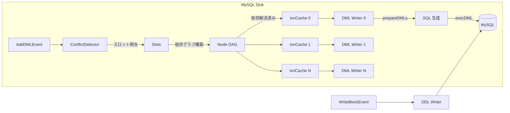
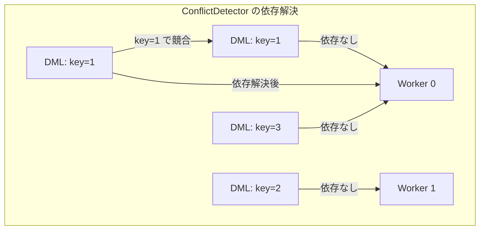

# 第9章 MySQL Sink

> **本章で読むソース**
>
> - [`downstreamadapter/sink/sink.go`](https://github.com/pingcap/ticdc/blob/v8.5.6/downstreamadapter/sink/sink.go)
> - [`downstreamadapter/sink/mysql/sink.go`](https://github.com/pingcap/ticdc/blob/v8.5.6/downstreamadapter/sink/mysql/sink.go)
> - [`downstreamadapter/sink/mysql/causality/conflict_detector.go`](https://github.com/pingcap/ticdc/blob/v8.5.6/downstreamadapter/sink/mysql/causality/conflict_detector.go)
> - [`downstreamadapter/sink/mysql/causality/node.go`](https://github.com/pingcap/ticdc/blob/v8.5.6/downstreamadapter/sink/mysql/causality/node.go)
> - [`downstreamadapter/sink/mysql/causality/slot.go`](https://github.com/pingcap/ticdc/blob/v8.5.6/downstreamadapter/sink/mysql/causality/slot.go)
> - [`downstreamadapter/sink/mysql/causality/helper.go`](https://github.com/pingcap/ticdc/blob/v8.5.6/downstreamadapter/sink/mysql/causality/helper.go)
> - [`pkg/sink/mysql/mysql_writer.go`](https://github.com/pingcap/ticdc/blob/v8.5.6/pkg/sink/mysql/mysql_writer.go)
> - [`pkg/sink/mysql/mysql_writer_dml.go`](https://github.com/pingcap/ticdc/blob/v8.5.6/pkg/sink/mysql/mysql_writer_dml.go)
> - [`pkg/sink/mysql/sql_builder.go`](https://github.com/pingcap/ticdc/blob/v8.5.6/pkg/sink/mysql/sql_builder.go)
> - [`pkg/sink/mysql/config.go`](https://github.com/pingcap/ticdc/blob/v8.5.6/pkg/sink/mysql/config.go)
> - [`pkg/sink/sqlmodel/multi_row.go`](https://github.com/pingcap/ticdc/blob/v8.5.6/pkg/sink/sqlmodel/multi_row.go)
> - [`pkg/sink/sqlmodel/row_change.go`](https://github.com/pingcap/ticdc/blob/v8.5.6/pkg/sink/sqlmodel/row_change.go)

## この章の狙い

EventService が Dispatcher へ配信した DML/DDL イベントは、最終的に下流データベースへ書き込まれる。
本章では MySQL 互換データベースへの書き込みを担う **MySQL Sink** の実装を読む。

MySQL Sink はイベントの受け取りから SQL 実行までを一本のパイプラインとして処理する。
その中核は、同一キーを変更するトランザクション間の依存関係を解析して並行実行可能なグループに振り分ける **ConflictDetector**（因果律解析器）と、複数行の変更を1本の SQL にまとめて実行する **バッチ DML** の仕組みにある。
本章では Sink インタフェースの設計から始め、因果律解析、SQL 生成、トランザクション実行の順にパイプライン全体を追う。

## 前提

第7章の EventService によるイベント配信と、第8章の Dispatcher による下流分配の仕組みを前提とする。
Go の `database/sql` パッケージによるトランザクション操作の基本を想定する。

## Sink インタフェース

TiCDC は MySQL、Kafka、Pulsar、Cloud Storage など複数の下流に対応する。
すべての下流実装は共通の `Sink` インタフェースを実装する。

[`downstreamadapter/sink/sink.go` L31-L42](https://github.com/pingcap/ticdc/blob/v8.5.6/downstreamadapter/sink/sink.go#L31-L42)

```go
type Sink interface {
	SinkType() common.SinkType
	IsNormal() bool

	AddDMLEvent(event *commonEvent.DMLEvent)
	WriteBlockEvent(event commonEvent.BlockEvent) error
	AddCheckpointTs(ts uint64)

	SetTableSchemaStore(tableSchemaStore *commonEvent.TableSchemaStore)
	Close(removeChangefeed bool)
	Run(ctx context.Context) error
}
```

`AddDMLEvent` は非同期にイベントを投入する。
`WriteBlockEvent` は DDL やシンクポイントのようにブロッキングで実行が必要なイベントを処理する。
`Run` がメインループを起動し、投入されたイベントの消費を開始する。

ファクトリ関数 `New` は sink URI のスキームに基づいて具象型を選択する。
`mysql://`、`tidb://` およびそれらの SSL 版が MySQL Sink に分岐する。

[`downstreamadapter/sink/sink.go` L44-L52](https://github.com/pingcap/ticdc/blob/v8.5.6/downstreamadapter/sink/sink.go#L44-L52)

```go
func New(ctx context.Context, cfg *config.ChangefeedConfig, changefeedID common.ChangeFeedID) (Sink, error) {
	sinkURI, err := url.Parse(cfg.SinkURI)
	// ... (中略) ...
	switch scheme {
	case config.MySQLScheme, config.MySQLSSLScheme, config.TiDBScheme, config.TiDBSSLScheme:
		return mysql.New(ctx, changefeedID, cfg, sinkURI)
```

## MySQL Sink の構造

### Sink 構造体

MySQL Sink の `Sink` 構造体は、DML 用の Writer 配列、DDL 用の Writer、因果律解析器を保持する。

[`downstreamadapter/sink/mysql/sink.go` L44-L59](https://github.com/pingcap/ticdc/blob/v8.5.6/downstreamadapter/sink/mysql/sink.go#L44-L59)

```go
type Sink struct {
	changefeedID common.ChangeFeedID

	dmlWriter []*mysql.Writer
	ddlWriter *mysql.Writer

	db         *sql.DB
	statistics *metrics.Statistics

	conflictDetector *causality.ConflictDetector

	isNormal   *atomic.Bool
	maxTxnRows int
	bdrMode    bool
}
```

`dmlWriter` は `Config.WorkerCount` の数だけ生成される。
下流が TiDB の場合のデフォルトは 64、MySQL の場合は 16 である[^worker-count]。

[^worker-count]: [`pkg/sink/mysql/config.go` L47-L49](https://github.com/pingcap/ticdc/blob/v8.5.6/pkg/sink/mysql/config.go#L47-L49) の `DefaultTiDBWorkerCount = 64`、`DefaultMySQLWorkerCount = 16` で定義される。

### 初期化

`NewMySQLSink` は Writer 配列と ConflictDetector を生成する。
ConflictDetector のスロット数はデフォルトで 16,384（`16 * 1024`）である。

[`downstreamadapter/sink/mysql/sink.go` L90-L119](https://github.com/pingcap/ticdc/blob/v8.5.6/downstreamadapter/sink/mysql/sink.go#L90-L119)

```go
func NewMySQLSink(
	ctx context.Context,
	changefeedID common.ChangeFeedID,
	cfg *mysql.Config,
	db *sql.DB,
	bdrMode bool,
) *Sink {
	stat := metrics.NewStatistics(changefeedID, "TxnSink")
	result := &Sink{
		changefeedID: changefeedID,
		db:           db,
		dmlWriter:    make([]*mysql.Writer, cfg.WorkerCount),
		statistics:   stat,
		conflictDetector: causality.New(defaultConflictDetectorSlots,
			causality.TxnCacheOption{
				Count:         cfg.WorkerCount,
				Size:          1024,
				BlockStrategy: causality.BlockStrategyWaitEmpty,
			},
			changefeedID),
		isNormal:   atomic.NewBool(true),
		maxTxnRows: cfg.MaxTxnRow,
		bdrMode:    bdrMode,
	}
	for i := 0; i < len(result.dmlWriter); i++ {
		result.dmlWriter[i] = mysql.NewWriter(ctx, i, db, cfg, changefeedID, stat)
	}
	result.ddlWriter = mysql.NewWriter(ctx, len(result.dmlWriter), db, cfg, changefeedID, stat)
	return result
}
```

ConflictDetector には Worker 数と同じ数の `txnCache` が作られ、各 Worker が対応するキャッシュからイベントを取り出す。
`BlockStrategyWaitEmpty` は、キャッシュが上限に達したとき、すべてのイベントが消費されるまで新規追加をブロックする戦略である。

### パイプライン全体像



## イベントの受け取りと振り分け

### DML イベントの投入

`AddDMLEvent` は ConflictDetector にイベントを渡すだけで、即座に戻る。

[`downstreamadapter/sink/mysql/sink.go` L229-L231](https://github.com/pingcap/ticdc/blob/v8.5.6/downstreamadapter/sink/mysql/sink.go#L229-L231)

```go
func (s *Sink) AddDMLEvent(event *commonEvent.DMLEvent) {
	s.conflictDetector.Add(event)
}
```

### DDL イベントの処理

DDL やシンクポイントは `WriteBlockEvent` で同期的に実行される。
BDR モード（双方向レプリケーション）では、Primary ロール以外の TiDB から来た DDL を無視する。

[`downstreamadapter/sink/mysql/sink.go` L233-L258](https://github.com/pingcap/ticdc/blob/v8.5.6/downstreamadapter/sink/mysql/sink.go#L233-L258)

```go
func (s *Sink) WriteBlockEvent(event commonEvent.BlockEvent) error {
	var err error
	switch event.GetType() {
	case commonEvent.TypeDDLEvent:
		ddl := event.(*commonEvent.DDLEvent)
		if s.bdrMode && ddl.BDRMode != string(ast.BDRRolePrimary) {
			break
		}
		err = s.ddlWriter.FlushDDLEvent(ddl)
	case commonEvent.TypeSyncPointEvent:
		err = s.ddlWriter.FlushSyncPointEvent(event.(*commonEvent.SyncPointEvent))
	// ... (中略) ...
	}
	if err != nil {
		s.isNormal.Store(false)
		return errors.Trace(err)
	}
	event.PostFlush()
	return nil
}
```

## ConflictDetector（因果律解析）

同一テーブル内の DML イベントを複数の Worker で並行実行するには、同じ行を変更するイベント同士の実行順序を保証しなければならない。
ConflictDetector は、イベントが触れる行のキーをハッシュ化し、依存グラフ（DAG）を構築することでこの制約を満たす。

### 競合キーの生成

イベントに含まれる各行の主キー/ユニークキーの値から FNV-1a ハッシュを計算し、競合キーのセットを生成する。

[`downstreamadapter/sink/mysql/causality/helper.go` L30-L59](https://github.com/pingcap/ticdc/blob/v8.5.6/downstreamadapter/sink/mysql/causality/helper.go#L30-L59)

```go
func ConflictKeys(event *commonEvent.DMLEvent) []uint64 {
	if event.Len() == 0 {
		return nil
	}

	hashRes := make(map[uint64]struct{}, event.Len())
	hasher := fnv.New32a()

	for {
		row, ok := event.GetNextRow()
		if !ok {
			event.Rewind()
			break
		}
		keys := genRowKeys(row, event.TableInfo, event.DispatcherID)
		for _, key := range keys {
			if n, err := hasher.Write(key); n != len(key) || err != nil {
				log.Panic("transaction key hash fail")
			}
			hashRes[uint64(hasher.Sum32())] = struct{}{}
			hasher.Reset()
		}
	}
	// ... (中略) ...
	return keys
}
```

UPDATE 行の場合、変更前の `PreRow` と変更後の `Row` の両方についてインデックス列から鍵を生成する。
主キーもユニークキーも持たないテーブルでは Dispatcher ID をそのまま鍵に使うため、同一 Dispatcher 内のすべての行が直列実行になる。

### Slots によるスロットベースの競合検出

`Slots` は `numSlots` 個のスロットを持つ配列で、各スロットはそのハッシュ値に対応する最新の Node を保持する。

[`downstreamadapter/sink/mysql/causality/slot.go` L30-L33](https://github.com/pingcap/ticdc/blob/v8.5.6/downstreamadapter/sink/mysql/causality/slot.go#L30-L33)

```go
type Slots struct {
	slots    []slot
	numSlots uint64
}
```

新しいイベントが追加されると、`Slots.Add` はイベントの各ハッシュ値に対応するスロットをロックし、そこに既存の Node があれば依存関係として記録する。

[`downstreamadapter/sink/mysql/causality/slot.go` L61-L101](https://github.com/pingcap/ticdc/blob/v8.5.6/downstreamadapter/sink/mysql/causality/slot.go#L61-L101)

```go
func (s *Slots) Add(elem *Node) {
	hashes := elem.sortedDedupKeysHash
	dependencyNodes := make(map[int64]*Node, len(hashes))

	var lastSlot uint64 = math.MaxUint64
	for _, hash := range hashes {
		slotIdx := getSlot(hash, s.numSlots)
		if lastSlot != slotIdx {
			s.slots[slotIdx].mu.Lock()
			lastSlot = slotIdx
		}

		if prevNode, ok := s.slots[slotIdx].nodes[hash]; ok {
			prevID := prevNode.nodeID()
			dependencyNodes[prevID] = prevNode
		}
		s.slots[slotIdx].nodes[hash] = elem
	}

	elem.dependOn(dependencyNodes)
	// ... (中略: unlock) ...
}
```

デッドロックを防ぐため、ハッシュ値はスロットインデックス順にソート済みの状態で保持される。
`sortAndDedupHashes` がソートと重複除去を行う。

[`downstreamadapter/sink/mysql/causality/slot.go` L129-L157](https://github.com/pingcap/ticdc/blob/v8.5.6/downstreamadapter/sink/mysql/causality/slot.go#L129-L157)

```go
func sortAndDedupHashes(hashes []uint64, numSlots uint64) []uint64 {
	if len(hashes) == 0 {
		return nil
	}
	sort.Slice(hashes, func(i, j int) bool {
		return hashes[i]%numSlots < hashes[j]%numSlots
	})
	// Dedup hashes
	// ... (中略) ...
	return hashes
}
```

### Node と依存グラフ

各 DML イベントは1つの `Node` として表現される。
Node はイベントが触れるキーのハッシュ値（`sortedDedupKeysHash`）と、依存元への参照（`dependers`）を B-Tree で保持する。

[`downstreamadapter/sink/mysql/causality/node.go` L47-L83](https://github.com/pingcap/ticdc/blob/v8.5.6/downstreamadapter/sink/mysql/causality/node.go#L47-L83)

```go
type Node struct {
	id                  int64
	sortedDedupKeysHash []uint64

	TrySendToTxnCache func(id cacheID) bool
	RandCacheID func() cacheID
	OnNotified func(callback func())

	totalDependencies    int32
	removedDependencies  int32
	resolvedDependencies int32
	resolvedList         []int64

	mu sync.Mutex

	assignedTo cacheID
	removed    bool
	dependers *btree.BTreeG[*Node]
}
```

B-Tree を使う理由は、競合するトランザクションを到着順にアンブロックするためである。
順序なしの集合を使った場合より、下流で観測される順序の乱れが少なくなる。

### 依存の解決とキャッシュへの振り分け

`dependOn` が依存関係を構築した後、`maybeResolve` が呼ばれる。
すべての依存が解消されたとき、`tryResolve` が振り分け先を決定する。

[`downstreamadapter/sink/mysql/causality/node.go` L206-L245](https://github.com/pingcap/ticdc/blob/v8.5.6/downstreamadapter/sink/mysql/causality/node.go#L206-L245)

```go
func (n *Node) tryResolve() (int64, bool) {
	if n.totalDependencies == 0 {
		return assignedToAny, true
	}

	removedDependencies := atomic.LoadInt32(&n.removedDependencies)
	if removedDependencies == n.totalDependencies {
		return assignedToAny, true
	}

	resolvedDependencies := atomic.LoadInt32(&n.resolvedDependencies)
	if resolvedDependencies == n.totalDependencies {
		firstDep := atomic.LoadInt64(&n.resolvedList[0])
		// ... (中略) ...
		if !hasDiffDep && firstDep != unassigned {
			return firstDep, true
		}
	}

	return unassigned, false
}
```

解決のロジックは3つのケースに分かれる。

1. 依存が1つもない場合、任意のキャッシュに割り当てられる（ラウンドロビン）。
2. すべての依存先が同一キャッシュに割り当てられている場合、同じキャッシュに送り込まれて直列実行される。
3. 依存先が異なるキャッシュに分散している場合、すべての依存先 Node が `remove` されるまで待つ。

`remove` はトランザクション実行完了後に `PostFlush` コールバックから呼ばれる。
Node が削除されると、その Node に依存するすべての後続 Node が再評価される。

[`downstreamadapter/sink/mysql/causality/node.go` L134-L149](https://github.com/pingcap/ticdc/blob/v8.5.6/downstreamadapter/sink/mysql/causality/node.go#L134-L149)

```go
func (n *Node) remove() {
	n.mu.Lock()
	defer n.mu.Unlock()

	n.removed = true
	if n.dependers != nil {
		n.dependers.Ascend(func(node *Node) bool {
			atomic.AddInt32(&node.removedDependencies, 1)
			node.OnNotified(node.maybeResolve)
			return true
		})
		n.dependers.Clear(true)
		n.dependers = nil
	}
}
```

## DML Writer のメインループ

`Run` は ConflictDetector と全 DML Writer を `errgroup` で並行起動する。

[`downstreamadapter/sink/mysql/sink.go` L121-L135](https://github.com/pingcap/ticdc/blob/v8.5.6/downstreamadapter/sink/mysql/sink.go#L121-L135)

```go
func (s *Sink) Run(ctx context.Context) error {
	g, ctx := errgroup.WithContext(ctx)
	g.Go(func() error {
		return s.conflictDetector.Run(ctx)
	})
	for idx := range s.dmlWriter {
		g.Go(func() error {
			defer s.conflictDetector.CloseNotifiedNodes()
			return s.runDMLWriter(ctx, idx)
		})
	}
	err := g.Wait()
	s.isNormal.Store(false)
	return err
}
```

各 Writer のメインループ `runDMLWriter` は、対応する `txnCache` からイベントをバッチ取得し、`maxTxnRows`（デフォルト 256）を超えない範囲でまとめて `Flush` する。

[`downstreamadapter/sink/mysql/sink.go` L155-L204](https://github.com/pingcap/ticdc/blob/v8.5.6/downstreamadapter/sink/mysql/sink.go#L155-L204)

```go
	inputCh := s.conflictDetector.GetOutChByCacheID(idx)
	writer := s.dmlWriter[idx]

	totalStart := time.Now()
	buffer := make([]*commonEvent.DMLEvent, 0, s.maxTxnRows)
	for {
		select {
		case <-ctx.Done():
			return errors.Trace(ctx.Err())
		default:
			txnEvents, ok := inputCh.GetMultipleNoGroup(buffer)
			// ... (中略) ...
			flushEvent := func(beginIndex, endIndex int, rowCount int32) error {
				workerHandledRows.Add(float64(rowCount))
				err := writer.Flush(txnEvents[beginIndex:endIndex])
				// ... (中略) ...
				return nil
			}

			beginIndex, rowCount := 0, txnEvents[0].Len()
			for i := 1; i < len(txnEvents); i++ {
				if rowCount+txnEvents[i].Len() > int32(s.maxTxnRows) {
					if err := flushEvent(beginIndex, i, rowCount); err != nil {
						return errors.Trace(err)
					}
					beginIndex, rowCount = i, txnEvents[i].Len()
				} else {
					rowCount += txnEvents[i].Len()
				}
			}
			if err := flushEvent(beginIndex, len(txnEvents), rowCount); err != nil {
				return errors.Trace(err)
			}
```

行数の累積が `maxTxnRows` を超えた地点で区切り、`Flush` を呼ぶ。
これにより1回の下流トランザクションに含まれる行数が制御される。

## SQL 生成

### Writer.Flush の全体フロー

`Writer.Flush` はイベント群を SQL 文字列に変換し、下流へ実行する。

[`pkg/sink/mysql/mysql_writer.go` L182-L225](https://github.com/pingcap/ticdc/blob/v8.5.6/pkg/sink/mysql/mysql_writer.go#L182-L225)

```go
func (w *Writer) Flush(events []*commonEvent.DMLEvent) error {
	w.updateIsInErrorCausedSafeMode()

	dmls, err := w.prepareDMLs(events)
	defer dmlsPool.Put(dmls)
	if err != nil {
		return errors.Trace(err)
	}
	if dmls.rowCount == 0 {
		return nil
	}

	if !w.cfg.DryRun {
		err = w.execDMLWithMaxRetries(dmls)
		if w.checkIsDuplicateEntryError(err) {
			log.Info("Meet Duplicate Entry Error, retry the dmls in safemode", zap.Error(err))
			for _, event := range events {
				event.Rewind()
			}
			dmls, err = w.prepareDMLs(events)
			// ... (中略) ...
			err = w.execDMLWithMaxRetries(dmls)
		}
	}
	// ... (中略) ...
	for _, event := range events {
		event.PostFlush()
	}
	return nil
}
```

`Duplicate entry` エラーが発生した場合、**セーフモード**（INSERT を REPLACE に変換する方式）に切り替えてリトライする。
セーフモードは一定時間（デフォルト5秒）維持される。

### prepareDMLs: バッチ SQL 生成の判断

`prepareDMLs` はイベント群をテーブル ID ごとにグループ化し、バッチ SQL 生成が可能かどうかを判定する。

[`pkg/sink/mysql/mysql_writer_dml.go` L87-L128](https://github.com/pingcap/ticdc/blob/v8.5.6/pkg/sink/mysql/mysql_writer_dml.go#L87-L128)

```go
func (w *Writer) prepareDMLs(events []*commonEvent.DMLEvent) (*preparedDMLs, error) {
	dmls := dmlsPool.Get().(*preparedDMLs)
	dmls.reset()
	// ... (中略: メトリクス計算) ...

	eventsGroupSortedByUpdateTs := groupEventsByTable(events)

	for _, sortedEventGroups := range eventsGroupSortedByUpdateTs {
		for _, eventsInGroup := range sortedEventGroups {
			tableInfo := eventsInGroup[0].TableInfo
			if !w.shouldGenBatchSQL(tableInfo, eventsInGroup) {
				queryList, argsList, rowTypesList = w.generateNormalSQLs(eventsInGroup)
			} else {
				queryList, argsList, rowTypesList = w.generateBatchSQL(eventsInGroup)
			}
			// ... (中略) ...
		}
	}
	return dmls, nil
}
```

バッチ SQL の生成条件は `shouldGenBatchSQL` で判定される。
主キーまたは NOT NULL ユニークキーを持ち、ハンドルキーに仮想生成列がなく、行が2行以上あり、全イベントのセーフモード状態が統一されている場合にバッチ化される。

[`pkg/sink/mysql/mysql_writer_dml.go` L137-L165](https://github.com/pingcap/ticdc/blob/v8.5.6/pkg/sink/mysql/mysql_writer_dml.go#L137-L165)

```go
func (w *Writer) shouldGenBatchSQL(tableInfo *common.TableInfo, events []*commonEvent.DMLEvent) bool {
	if !w.cfg.BatchDMLEnable {
		return false
	}
	if !tableInfo.HasPKOrNotNullUK {
		return false
	}
	// ... (中略: 仮想生成列チェック) ...
	if len(events) == 1 && events[0].Len() == 1 {
		return false
	}
	return allRowInSameSafeMode(w.cfg.SafeMode, events)
}
```

### 単一行の SQL ビルダー

バッチ化されない場合、各行に対して個別の SQL が生成される。

#### INSERT / REPLACE

`buildInsert` はテーブル情報にキャッシュされた SQL テンプレートを取得する。
セーフモードでは `REPLACE INTO`、通常時は `INSERT INTO` を使い分ける。

[`pkg/sink/mysql/sql_builder.go` L154-L176](https://github.com/pingcap/ticdc/blob/v8.5.6/pkg/sink/mysql/sql_builder.go#L154-L176)

```go
func buildInsert(
	tableInfo *common.TableInfo,
	row commonEvent.RowChange,
	inSafeMode bool,
) (string, []interface{}) {
	args := getArgs(&row.Row, tableInfo)
	if len(args) == 0 {
		return "", nil
	}

	var sql string
	if inSafeMode {
		sql = tableInfo.GetPreReplaceSQL()
	} else {
		sql = tableInfo.GetPreInsertSQL()
	}
	// ... (中略) ...
	return sql, args
}
```

#### DELETE

`buildDelete` は WHERE 句をハンドルキー列で組み立てる。
ハンドルキーがなければ、仮想生成列を除くすべての列を WHERE 句に使う。

[`pkg/sink/mysql/sql_builder.go` L180-L208](https://github.com/pingcap/ticdc/blob/v8.5.6/pkg/sink/mysql/sql_builder.go#L180-L208)

```go
func buildDelete(tableInfo *common.TableInfo, row commonEvent.RowChange) (string, []interface{}) {
	var builder strings.Builder
	quoteTable := tableInfo.TableName.QuoteString()
	builder.WriteString("DELETE FROM ")
	builder.WriteString(quoteTable)
	builder.WriteString(" WHERE ")

	colNames, whereArgs := whereSlice(&row.PreRow, tableInfo)
	// ... (中略) ...
	builder.WriteString(" LIMIT 1")
	sql := builder.String()
	return sql, args
}
```

`LIMIT 1` は意図しない複数行削除を防ぐ安全装置である。

#### UPDATE

`buildUpdate` は SET 句に変更後の全列値を、WHERE 句にハンドルキーの変更前値を配置する。

[`pkg/sink/mysql/sql_builder.go` L210-L245](https://github.com/pingcap/ticdc/blob/v8.5.6/pkg/sink/mysql/sql_builder.go#L210-L245)

```go
func buildUpdate(tableInfo *common.TableInfo, row commonEvent.RowChange) (string, []interface{}) {
	var builder strings.Builder
	// ... (中略) ...
	builder.WriteString(tableInfo.GetPreUpdateSQL())

	args := getArgs(&row.Row, tableInfo)
	// ... (中略) ...
	whereColNames, whereArgs := whereSlice(&row.PreRow, tableInfo)
	// ... (中略) ...
	builder.WriteString(" LIMIT 1")
	sql := builder.String()
	return sql, args
}
```

### バッチ SQL 生成

バッチ化の場合、行を種別（INSERT、UPDATE、DELETE）でグループ化し、種別ごとに複数行を1本の SQL にまとめる。
`batchSingleTxnDmls` は DELETE、UPDATE、INSERT の順に SQL を生成する。

[`pkg/sink/mysql/mysql_writer_dml.go` L839-L897](https://github.com/pingcap/ticdc/blob/v8.5.6/pkg/sink/mysql/mysql_writer_dml.go#L839-L897)

```go
func (w *Writer) batchSingleTxnDmls(
	rows []*commonEvent.RowChange,
	tableInfo *common.TableInfo,
	inSafeMode bool,
) (sqls []string, values [][]interface{}, rowTypes []common.RowType) {
	insertRows, updateRows, deleteRows := w.groupRowsByType(rows, tableInfo)

	if len(deleteRows) > 0 {
		for _, rows := range deleteRows {
			sql, value := sqlmodel.GenDeleteSQL(w.cfg.whereClause, rows...)
			// ... (中略) ...
		}
	}
	if len(updateRows) > 0 {
		if w.cfg.IsTiDB {
			for _, rows := range updateRows {
				s, v, rowType := w.genUpdateSQL(rows...)
				// ... (中略) ...
			}
		} else {
			// MySQL では行ごとに個別の UPDATE を生成する
			for _, rows := range updateRows {
				for _, row := range rows {
					sql, value := row.GenSQL(sqlmodel.DMLUpdate)
					// ... (中略) ...
				}
			}
		}
	}
	if len(insertRows) > 0 {
		for _, rows := range insertRows {
			if inSafeMode {
				sql, value := sqlmodel.GenInsertSQL(sqlmodel.DMLReplace, rows...)
				// ... (中略) ...
			} else {
				sql, value := sqlmodel.GenInsertSQL(sqlmodel.DMLInsert, rows...)
				// ... (中略) ...
			}
		}
	}
	return
}
```

DELETE の順序が先なのは、主キーの衝突を避けるためである。
古いキー値を先に削除してから新しい値を挿入すれば、`Duplicate entry` エラーを回避できる。

UPDATE のバッチ化は TiDB の場合にのみ有効になる[^tidb-update]。

[^tidb-update]: TiDB と MySQL では UPDATE 文のセマンティクスに差異がある。TiDB のドキュメントにある互換性の注記に従い、MySQL 下流ではバッチ UPDATE を使わない。

#### 複数行 DELETE（v2 方式）

デフォルトの `whereClause = "v2"` では、`(col1, col2) IN ((?,?),(?,?))` 形式のタプル IN を使う。

[`pkg/sink/sqlmodel/multi_row.go` L220-L272](https://github.com/pingcap/ticdc/blob/v8.5.6/pkg/sink/sqlmodel/multi_row.go#L220-L272)

```go
func genDeleteSQLV2(changes ...*RowChange) (string, []interface{}) {
	// ... (中略) ...
	buf.WriteString("DELETE FROM ")
	buf.WriteString(first.targetTable.QuoteString())
	buf.WriteString(" WHERE (")

	whereColumns, _ := first.whereColumnsAndValues()
	for i, column := range whereColumns {
		// ... (中略) ...
	}
	buf.WriteString(" IN (")
	// ... (中略) ...
	return buf.String(), args
}
```

WHERE 列に NULL 値が含まれる場合は v1（`(... ) OR (... )` 形式）にフォールバックする。
NULL は IN タプルのマッチングで意図通りに動作しないためである。

#### 複数行 INSERT

`GenInsertSQL` は複数行の値を1つの `INSERT INTO ... VALUES (...),(...),(...)`にまとめる。
セーフモードでは `REPLACE INTO` に置き換わる。

[`pkg/sink/sqlmodel/multi_row.go` L104-L146](https://github.com/pingcap/ticdc/blob/v8.5.6/pkg/sink/sqlmodel/multi_row.go#L104-L146)

```go
func GenInsertSQL(tp DMLType, changes ...*RowChange) (string, []interface{}) {
	// ... (中略) ...
	first := changes[0]

	var buf strings.Builder
	buf.Grow(1024)
	if tp == DMLReplace {
		buf.WriteString("REPLACE INTO ")
	} else {
		buf.WriteString("INSERT INTO ")
	}
	buf.WriteString(first.targetTable.QuoteString())
	buf.WriteString(" (")
	// ... (中略: カラム名列挙) ...
	buf.WriteString(") VALUES ")
	holder := valuesHolder(columnNum)
	for i := range changes {
		if i > 0 {
			buf.WriteString(",")
		}
		buf.WriteString(holder)
	}
	// ... (中略) ...
	return buf.String(), args
}
```

## トランザクションの実行

### 実行方式の選択

`execDMLWithMaxRetries` はリトライロジックを含む実行関数である。
実行方式は2種類ある。

[`pkg/sink/mysql/mysql_writer_dml.go` L675-L698](https://github.com/pingcap/ticdc/blob/v8.5.6/pkg/sink/mysql/mysql_writer_dml.go#L675-L698)

```go
		if fallbackToSeqWay || !w.cfg.MultiStmtEnable {
			tx, err := w.db.BeginTx(w.ctx, nil)
			if err != nil {
				return 0, 0, errors.Trace(err)
			}

			err = w.sequenceExecute(dmls, tx, writeTimeout)
			if err != nil {
				return 0, 0, err
			}

			if err = tx.Commit(); err != nil {
				return 0, 0, err
			}
		} else {
			err := w.multiStmtExecute(dmls, writeTimeout)
			if err != nil {
				log.Warn("multiStmtExecute failed, fallback to sequence way", zap.Error(err))
				fallbackToSeqWay = true
				return 0, 0, err
			}
		}
```

1. **マルチステートメント方式**（デフォルト）: 複数の SQL 文をセミコロンで結合し、`BEGIN;` と `COMMIT;` で囲んだ単一の文字列として `conn.ExecContext` で実行する。1 RTT で済む。
2. **シーケンシャル方式**: `BeginTx` でトランザクションを開始し、個別に `ExecContext` を呼ぶ。DML のサイズが `max_allowed_packet` を超える場合や、マルチステートメントが失敗した場合のフォールバックとして使われる。

[`pkg/sink/mysql/mysql_writer_dml.go` L778-L807](https://github.com/pingcap/ticdc/blob/v8.5.6/pkg/sink/mysql/mysql_writer_dml.go#L778-L807)

```go
func (w *Writer) multiStmtExecute(
	dmls *preparedDMLs, writeTimeout time.Duration,
) error {
	// ... (中略) ...
	multiStmtSQL := strings.Join(dmls.sqls, ";")
	multiStmtSQLWithTxn := "BEGIN;" + multiStmtSQL + ";COMMIT;"

	// ... (中略) ...
	// conn.ExecContext only use one RTT, while db.Begin + tx.ExecContext + db.Commit need three RTTs.
	_, err = conn.ExecContext(ctx, multiStmtSQLWithTxn, multiStmtArgs...)
	// ... (中略) ...
	return nil
}
```

### Prepared Statement キャッシュ

シーケンシャル方式では、LRU キャッシュ（容量 16,384）で Prepared Statement を再利用する。

[`pkg/sink/mysql/mysql_writer_dml.go` L740-L750](https://github.com/pingcap/ticdc/blob/v8.5.6/pkg/sink/mysql/mysql_writer_dml.go#L740-L750)

```go
		if w.cfg.CachePrepStmts {
			if stmt, ok := w.stmtCache.Get(query); ok {
				prepStmt = stmt.(*sql.Stmt)
			} else if stmt, err := w.db.Prepare(query); err == nil {
				prepStmt = stmt
				w.stmtCache.Add(query, stmt)
			} else {
				w.stmtCache.RemoveOldest()
			}
		}
```

特に下流が TiDB の場合、同一テンプレートの SQL を繰り返し実行するパターンでパース/プラン生成のコストを削減する効果が大きい。

## 高速化の工夫: 因果律ベースの並行 DML 実行

MySQL Sink の最大の最適化は、因果律解析による DML の並行実行である。

素朴な実装では、すべての DML を単一スレッドで直列に実行するか、テーブル単位で分割するかのどちらかになる。
前者はスループットが低く、後者はホットテーブルがボトルネックになる。

ConflictDetector はテーブル内の DML をさらに細かい粒度で分析する。
同じ主キーを変更する DML は依存関係があるため直列化が必要だが、異なる主キーを変更する DML は安全に並行実行できる。
この区別をハッシュベースのスロット競合検出で行い、競合しないイベントを異なる Worker に振り分ける。



この仕組みにより、ホットテーブルであっても、行レベルで競合しない範囲では複数 Worker による並行書き込みが可能になる。
依存先がすべて同一 Worker に割り当てられている場合はそのまま同じ Worker に送られるため、キャッシュと接続の局所性も保たれる。

加えて、マルチステートメント方式（1 RTT で複数 SQL を実行）とバッチ DML（複数行を1文の INSERT/DELETE にまとめる）の組み合わせにより、ネットワークラウンドトリップと SQL パースのオーバーヘッドをさらに削減する。

## まとめ

MySQL Sink は Sink インタフェースの MySQL 実装であり、DML イベントの受け取りから SQL 実行までをパイプラインとして処理する。
ConflictDetector が行レベルの因果律解析で並行実行可能なイベントを振り分け、Writer がバッチ SQL 生成とマルチステートメント実行で下流への書き込みを高速化する。
セーフモード（REPLACE INTO への切り替え）と Duplicate Entry 検出によるリトライが、障害時のデータ一貫性を保証する仕組みとして組み込まれている。

## 関連する章

- **第7章 EventService**: MySQL Sink が消費するイベントの配信元。
- **第8章 Dispatcher**: イベントをテーブル単位で振り分け、Sink に投入する。
- **第10章 Kafka Sink**: メッセージキュー向けの Sink 実装。MySQL Sink と共通の Sink インタフェースを実装する。
