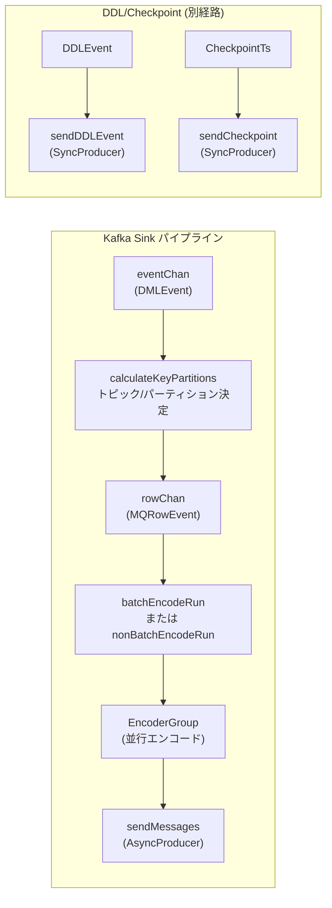
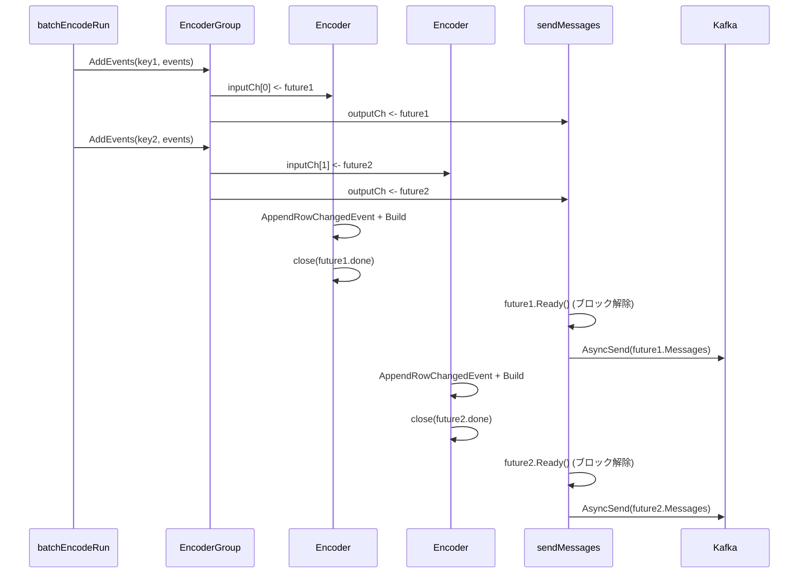

# 第10章 Kafka Sink とコーデック

> **本章で読むソース**
>
> - [`downstreamadapter/sink/kafka/sink.go`](https://github.com/pingcap/ticdc/blob/v8.5.6/downstreamadapter/sink/kafka/sink.go)
> - [`downstreamadapter/sink/kafka/helper.go`](https://github.com/pingcap/ticdc/blob/v8.5.6/downstreamadapter/sink/kafka/helper.go)
> - [`downstreamadapter/sink/eventrouter/event_router.go`](https://github.com/pingcap/ticdc/blob/v8.5.6/downstreamadapter/sink/eventrouter/event_router.go)
> - [`downstreamadapter/sink/eventrouter/partition/generator.go`](https://github.com/pingcap/ticdc/blob/v8.5.6/downstreamadapter/sink/eventrouter/partition/generator.go)
> - [`downstreamadapter/sink/eventrouter/topic/topic.go`](https://github.com/pingcap/ticdc/blob/v8.5.6/downstreamadapter/sink/eventrouter/topic/topic.go)
> - [`downstreamadapter/sink/eventrouter/topic/expression.go`](https://github.com/pingcap/ticdc/blob/v8.5.6/downstreamadapter/sink/eventrouter/topic/expression.go)
> - [`downstreamadapter/sink/topicmanager/kafka_topic_manager.go`](https://github.com/pingcap/ticdc/blob/v8.5.6/downstreamadapter/sink/topicmanager/kafka_topic_manager.go)
> - [`pkg/sink/codec/encoder_group.go`](https://github.com/pingcap/ticdc/blob/v8.5.6/pkg/sink/codec/encoder_group.go)
> - [`pkg/sink/codec/builder.go`](https://github.com/pingcap/ticdc/blob/v8.5.6/pkg/sink/codec/builder.go)
> - [`pkg/sink/codec/common/encoder.go`](https://github.com/pingcap/ticdc/blob/v8.5.6/pkg/sink/codec/common/encoder.go)
> - [`pkg/sink/codec/common/message.go`](https://github.com/pingcap/ticdc/blob/v8.5.6/pkg/sink/codec/common/message.go)
> - [`pkg/sink/codec/open/encoder.go`](https://github.com/pingcap/ticdc/blob/v8.5.6/pkg/sink/codec/open/encoder.go)
> - [`pkg/sink/codec/open/codec.go`](https://github.com/pingcap/ticdc/blob/v8.5.6/pkg/sink/codec/open/codec.go)
> - [`pkg/sink/codec/open/message.go`](https://github.com/pingcap/ticdc/blob/v8.5.6/pkg/sink/codec/open/message.go)
> - [`pkg/sink/kafka/factory.go`](https://github.com/pingcap/ticdc/blob/v8.5.6/pkg/sink/kafka/factory.go)
> - [`pkg/sink/kafka/sarama_async_producer.go`](https://github.com/pingcap/ticdc/blob/v8.5.6/pkg/sink/kafka/sarama_async_producer.go)

## この章の狙い

TiCDC が Kafka にデータを送り届けるまでには、テーブルの変更イベントをトピックとパーティションに振り分け、プロトコルに従ってバイト列にエンコードし、Kafka プロデューサーに渡すという一連の工程がある。
本章では、この工程を担う **Kafka Sink** の内部構造を読み、EventRouter によるルーティング、コーデックによるエンコード、そしてメッセージ送信までのパイプラインを追う。

## 前提

- Kafka の基本概念(トピック、パーティション、プロデューサー)を理解していること。
- 上流から `DMLEvent` や `DDLEvent` が Sink に渡される流れは、前章までで扱っている。
- TiCDC は Kafka クライアントとして Sarama ライブラリを使う。

## Kafka Sink のパイプライン全体像

Kafka Sink は DML イベントを4つのゴルーチンで並行処理する。



DML はイベントチャネルからパーティション決定、エンコード、送信と一方向に流れる。
DDL とチェックポイントは SyncProducer で同期的に送信する別経路である。

## sink 構造体と初期化

`sink` 構造体は Kafka Sink の中心であり、プロデューサー、ルーティング、エンコードの各コンポーネントを保持する。

[`downstreamadapter/sink/kafka/sink.go` L42-L64](https://github.com/pingcap/ticdc/blob/v8.5.6/downstreamadapter/sink/kafka/sink.go#L42-L64)

```go
type sink struct {
	changefeedID commonType.ChangeFeedID

	dmlProducer      kafka.AsyncProducer
	ddlProducer      kafka.SyncProducer
	metricsCollector kafka.MetricsCollector

	comp       components
	statistics *metrics.Statistics

	protocol      config.Protocol
	partitionRule helper.DDLDispatchRule

	checkpointChan   chan uint64
	tableSchemaStore *commonEvent.TableSchemaStore

	eventChan *chann.UnlimitedChannel[*commonEvent.DMLEvent, any]
	rowChan   *chann.UnlimitedChannel[*commonEvent.MQRowEvent, any]

	isNormal *atomic.Bool
	ctx      context.Context
}
```

**dmlProducer** は非同期プロデューサー、**ddlProducer** は同期プロデューサーである。
DML は大量に発生するため非同期で送り、DDL はスキーマの整合性を保つため同期で送る。

`eventChan` と `rowChan` はパイプラインのステージ間をつなぐ無制限チャネルである。
`eventChan` にはテーブル単位の `DMLEvent` が投入され、`rowChan` にはトピックとパーティションが決定済みの行単位イベント `MQRowEvent` が流れる。

## components: 協調する部品群

`components` 構造体が Sink の内部部品をまとめている。

[`downstreamadapter/sink/kafka/helper.go` L33-L41](https://github.com/pingcap/ticdc/blob/v8.5.6/downstreamadapter/sink/kafka/helper.go#L33-L41)

```go
type components struct {
	encoderGroup   codec.EncoderGroup
	encoder        common.EventEncoder
	columnSelector *columnselector.ColumnSelectors
	eventRouter    *eventrouter.EventRouter
	topicManager   topicmanager.TopicManager
	adminClient    kafka.ClusterAdminClient
	factory        kafka.Factory
}
```

初期化処理 `newKafkaSinkComponentWithFactory` は、プロトコルの解析から始まり、EventRouter、EncoderGroup、TopicManager を順に構築する。

[`downstreamadapter/sink/kafka/helper.go` L52-L129](https://github.com/pingcap/ticdc/blob/v8.5.6/downstreamadapter/sink/kafka/helper.go#L52-L129)

```go
func newKafkaSinkComponentWithFactory(ctx context.Context,
	changefeedID commonType.ChangeFeedID,
	sinkURI *url.URL,
	sinkConfig *config.SinkConfig,
	factoryCreator kafka.FactoryCreator,
) (components, config.Protocol, error) {
	// ... (中略) ...
	kafkaComponent.eventRouter, err = eventrouter.NewEventRouter(
		sinkConfig, topic, false, protocol == config.ProtocolAvro)
	// ... (中略) ...
	kafkaComponent.encoderGroup, err = codec.NewEncoderGroup(ctx, sinkConfig, encoderConfig, changefeedID)
	// ... (中略) ...
	kafkaComponent.topicManager, err = topicmanager.GetTopicManagerAndTryCreateTopic(
		ctx, changefeedID, topic,
		options.DeriveTopicConfig(), kafkaComponent.adminClient,
	)
	// ... (中略) ...
}
```

最後の行では、デフォルトトピックの自動作成も行う。
Kafka のブローカー側で `auto.create.topics.enable` が有効であっても、TiCDC 側で作成することでパーティション数やレプリケーションファクターを制御する。

## EventRouter: トピックとパーティションの決定

### ルールの構造

EventRouter は、設定ファイルのディスパッチルール群をコンパイルしたものである。
各ルールはテーブルフィルタ、トピック生成器、パーティション生成器の3要素で構成される。

[`downstreamadapter/sink/eventrouter/event_router.go` L28-L39](https://github.com/pingcap/ticdc/blob/v8.5.6/downstreamadapter/sink/eventrouter/event_router.go#L28-L39)

```go
type Rule struct {
	partitionDispatcher partition.Generator
	topicGenerator      topic.Generator
	tableFilter.Filter
}

type EventRouter struct {
	defaultTopic string
	rules        []Rule
}
```

ルールの末尾には必ずワイルドカード `*.*` が追加されるため、どのテーブルも必ずいずれかのルールにマッチする。

[`downstreamadapter/sink/eventrouter/event_router.go` L48-L52](https://github.com/pingcap/ticdc/blob/v8.5.6/downstreamadapter/sink/eventrouter/event_router.go#L48-L52)

```go
ruleConfigs := append(sinkConfig.DispatchRules, &config.DispatchRule{
	Matcher:       []string{"*.*"},
	PartitionRule: "default",
	TopicRule:     "",
})
```

### トピック生成器

トピック生成器には静的と動的の2種類がある。

[`downstreamadapter/sink/eventrouter/topic/topic.go` L70-L88](https://github.com/pingcap/ticdc/blob/v8.5.6/downstreamadapter/sink/eventrouter/topic/topic.go#L70-L88)

```go
func GetTopicGenerator(
	rule string, defaultTopic string, isPulsar bool, isAvro bool,
) (Generator, error) {
	if rule == "" {
		return newStaticTopic(defaultTopic), nil
	}
	if isHardCode(rule) {
		return newStaticTopic(rule), nil
	}
	topicExpr := Expression(rule)
	err := validateTopicExpression(topicExpr, isPulsar, isAvro)
	if err != nil {
		return nil, err
	}
	return newDynamicTopicGenerator(topicExpr), nil
}
```

**StaticTopicGenerator** はすべてのイベントを固定のトピックに送る。
**DynamicTopicGenerator** はトピック式(例: `prefix_{schema}_{table}`)を持ち、スキーマ名とテーブル名を埋め込んでトピック名を生成する。

トピック式内のプレースホルダ `{schema}` と `{table}` は正規表現で置換される。
Kafka のトピック名に使えない文字はアンダースコアに変換し、長さが249文字を超える場合は切り詰める。

[`downstreamadapter/sink/eventrouter/topic/expression.go` L114-L136](https://github.com/pingcap/ticdc/blob/v8.5.6/downstreamadapter/sink/eventrouter/topic/expression.go#L114-L136)

```go
func (e Expression) Substitute(schema, table string) string {
	replacedSchema := kafkaForbidRE.ReplaceAllString(schema, "_")
	replacedTable := kafkaForbidRE.ReplaceAllString(table, "_")

	topicExpr := string(e)
	topicName := schemaRE.ReplaceAllString(topicExpr, replacedSchema)
	topicName = tableRE.ReplaceAllString(topicName, replacedTable)

	if len(topicName) > kafkaTopicNameMaxLength {
		return topicName[:kafkaTopicNameMaxLength]
	} else if topicName == "." {
		return "_"
	} else if topicName == ".." {
		return "__"
	} else {
		return topicName
	}
}
```

### パーティション生成器

パーティション生成器は `Generator` インタフェースを実装し、行イベントからパーティションインデックスとキーを返す。

[`downstreamadapter/sink/eventrouter/partition/generator.go` L25-L29](https://github.com/pingcap/ticdc/blob/v8.5.6/downstreamadapter/sink/eventrouter/partition/generator.go#L25-L29)

```go
type Generator interface {
	GeneratePartitionIndexAndKey(row *commonEvent.RowChange, partitionNum int32,
		tableInfo *common.TableInfo, commitTs uint64) (int32, string, error)
}
```

実装は5種類ある。

- **TablePartitionGenerator** (`default` / `table`): スキーマ名とテーブル名のハッシュでパーティションを決める。同じテーブルのイベントは必ず同じパーティションに入るため、テーブル内の順序が保証される。
- **TsPartitionGenerator** (`ts`): `commitTs` の剰余でパーティションを決める。高スループットを優先し、順序保証はない。
- **IndexValuePartitionGenerator** (`index-value`): ハンドルキーまたは指定インデックスの値のハッシュで振り分ける。同一行の更新は同じパーティションに入るため、行レベルの順序を保証する。
- **ColumnsPartitionGenerator** (`columns`): 指定カラムの値のハッシュで振り分ける。
- **KeyPartitionGenerator**: Pulsar 専用。固定のパーティションキーを返す。

TablePartitionGenerator の実装を見ると、ハッシュ計算にはスキーマ名とテーブル名のバイト列を使う。

[`downstreamadapter/sink/eventrouter/partition/table.go` L38-L50](https://github.com/pingcap/ticdc/blob/v8.5.6/downstreamadapter/sink/eventrouter/partition/table.go#L38-L50)

```go
func (t *TablePartitionGenerator) GeneratePartitionIndexAndKey(
	row *commonEvent.RowChange, partitionNum int32,
	tableInfo *common.TableInfo, commitTs uint64,
) (int32, string, error) {
	t.lock.Lock()
	defer t.lock.Unlock()
	t.hasher.Reset()
	t.hasher.Write([]byte(tableInfo.GetSchemaName()), []byte(tableInfo.GetTableName()))
	return int32(t.hasher.Sum32() % uint32(partitionNum)), tableInfo.TableName.String(), nil
}
```

IndexValuePartitionGenerator は、ハンドルキー(主キーまたは NOT NULL ユニークキー)のカラム値をハッシュに含める。
指定インデックスがある場合はそのカラム値を使う。

[`downstreamadapter/sink/eventrouter/partition/index_value.go` L42-L89](https://github.com/pingcap/ticdc/blob/v8.5.6/downstreamadapter/sink/eventrouter/partition/index_value.go#L42-L89)

```go
func (r *IndexValuePartitionGenerator) GeneratePartitionIndexAndKey(
	row *commonEvent.RowChange, partitionNum int32, tableInfo *common.TableInfo, _ uint64,
) (int32, string, error) {
	r.lock.Lock()
	defer r.lock.Unlock()
	r.hasher.Reset()
	r.hasher.Write([]byte(tableInfo.GetSchemaName()), []byte(tableInfo.GetTableName()))

	rowData := row.Row
	if rowData.IsEmpty() {
		rowData = row.PreRow
	}

	if r.IndexName == "" {
		for idx, col := range tableInfo.GetColumns() {
			// ... ハンドルキーのカラム値をハッシュに追加 ...
		}
	} else {
		names, offsets, ok := tableInfo.IndexByName(r.IndexName)
		// ... 指定インデックスのカラム値をハッシュに追加 ...
	}

	sum32 := r.hasher.Sum32()
	return int32(sum32 % uint32(partitionNum)), strconv.FormatInt(int64(sum32), 10), nil
}
```

DELETE イベントの場合は `row.Row` が空になるため、`row.PreRow`(変更前の値)から値を取得する。
この分岐がないと、DELETE 時にパーティションが正しく決まらない。

## TopicManager: トピックの自動作成とパーティション数の管理

TopicManager はトピックのパーティション数をキャッシュし、必要に応じてトピックを自動作成する。

[`downstreamadapter/sink/topicmanager/kafka_topic_manager.go` L100-L115](https://github.com/pingcap/ticdc/blob/v8.5.6/downstreamadapter/sink/topicmanager/kafka_topic_manager.go#L100-L115)

```go
func (m *kafkaTopicManager) GetPartitionNum(
	ctx context.Context, topic string,
) (int32, error) {
	if partitions, ok := m.topics.Load(topic); ok {
		return partitions.(int32), nil
	}
	partitionNum, err := m.CreateTopicAndWaitUntilVisible(ctx, topic)
	if err != nil {
		return 0, errors.Trace(err)
	}
	return partitionNum, nil
}
```

`sync.Map` にキャッシュがあればそれを返し、なければ `CreateTopicAndWaitUntilVisible` でトピックを作成してからパーティション数を返す。

トピック作成後は `waitUntilTopicVisible` でリトライ付きのメタデータ取得を行い、全ブローカーにトピック情報が行き渡るまで待つ[^wait-visible]。

[^wait-visible]: Kafka ではトピック作成後、すべてのブローカーがメタデータを更新するまでに数秒かかる場合がある。Apache Kafka の公式 AdminClient の JavaDoc にもこの注意が記載されている。

バックグラウンドのゴルーチンは10分間隔でメタデータをリフレッシュし、パーティション数の変更を検出する。

[`downstreamadapter/sink/topicmanager/kafka_topic_manager.go` L31-L37](https://github.com/pingcap/ticdc/blob/v8.5.6/downstreamadapter/sink/topicmanager/kafka_topic_manager.go#L31-L37)

```go
const (
	metaRefreshInterval = 10 * time.Minute
)
```

## パーティション決定からエンコードまでの流れ

### calculateKeyPartitions: トピックとパーティションの解決

DML イベントは `AddDMLEvent` 経由で `eventChan` に投入される。
`calculateKeyPartitions` はこのチャネルからイベントを受け取り、EventRouter でトピックとパーティションを決定し、行単位の `MQRowEvent` に分解して `rowChan` に流す。

[`downstreamadapter/sink/kafka/sink.go` L199-L271](https://github.com/pingcap/ticdc/blob/v8.5.6/downstreamadapter/sink/kafka/sink.go#L199-L271)

```go
func (s *sink) calculateKeyPartitions(ctx context.Context) error {
	for {
		// ... (中略) ...
		event, ok := s.eventChan.Get()
		// ... (中略) ...
		topic := s.comp.eventRouter.GetTopicForRowChange(schema, table)
		partitionNum, err := s.comp.topicManager.GetPartitionNum(ctx, topic)
		// ... (中略) ...
		partitionGenerator := s.comp.eventRouter.GetPartitionGenerator(schema, table)

		for {
			row, ok := event.GetNextRow()
			if !ok {
				event.Rewind()
				break
			}
			index, key, err := partitionGenerator.GeneratePartitionIndexAndKey(
				&row, partitionNum, event.TableInfo, event.CommitTs)
			// ... (中略) ...
			events = append(events, &commonEvent.MQRowEvent{
				Key: commonEvent.TopicPartitionKey{
					Topic:          topic,
					Partition:      index,
					PartitionKey:   key,
					TotalPartition: partitionNum,
				},
				RowEvent: commonEvent.RowEvent{ /* ... */ },
			})
		}
		s.rowChan.Push(events...)
	}
}
```

1つの `DMLEvent` は複数行を含むことがあるため、`GetNextRow` で行を1つずつ取り出す。
各行について `GeneratePartitionIndexAndKey` を呼び、`TopicPartitionKey`(トピック名、パーティション番号、パーティションキー)を付与する。

コールバックの設計にも工夫がある。
トランザクション完了コールバック(`PostTxnFlushed`)は、すべての行の送信が完了した時点で一度だけ呼ぶ必要がある。
`toRowCallback` は `atomic.Uint64` のカウンタで呼び出し回数を追跡し、最後の行のコールバックでまとめて発火する。

[`downstreamadapter/sink/kafka/sink.go` L222-L232](https://github.com/pingcap/ticdc/blob/v8.5.6/downstreamadapter/sink/kafka/sink.go#L222-L232)

```go
toRowCallback := func(postTxnFlushed []func(), totalCount uint64) func() {
	var calledCount atomic.Uint64
	return func() {
		if calledCount.Inc() == totalCount {
			for _, callback := range postTxnFlushed {
				callback()
			}
		}
	}
}
```

### バッチエンコードと非バッチエンコード

プロトコルによって、エンコードをバッチで行うか逐次で行うかが分かれる。

[`downstreamadapter/sink/kafka/sink.go` L183-L189](https://github.com/pingcap/ticdc/blob/v8.5.6/downstreamadapter/sink/kafka/sink.go#L183-L189)

```go
g.Go(func() error {
	if s.protocol.IsBatchEncode() {
		return s.batchEncodeRun(ctx)
	}
	return s.nonBatchEncodeRun(ctx)
})
```

非バッチモードでは、`rowChan` から1つずつイベントを取り出して `EncoderGroup.AddEvents` に渡す。

バッチモードでは、`rowChan` から最大2048件を一括取得し、`TopicPartitionKey` でグループ化してから `AddEvents` に渡す。

[`downstreamadapter/sink/kafka/sink.go` L37-L39](https://github.com/pingcap/ticdc/blob/v8.5.6/downstreamadapter/sink/kafka/sink.go#L37-L39)

```go
const (
	batchSize = 2048
)
```

[`downstreamadapter/sink/kafka/sink.go` L351-L360](https://github.com/pingcap/ticdc/blob/v8.5.6/downstreamadapter/sink/kafka/sink.go#L351-L360)

```go
func (s *sink) group(msgs []*commonEvent.MQRowEvent) map[commonEvent.TopicPartitionKey][]*commonEvent.RowEvent {
	groupedMsgs := make(map[commonEvent.TopicPartitionKey][]*commonEvent.RowEvent)
	for _, msg := range msgs {
		if _, ok := groupedMsgs[msg.Key]; !ok {
			groupedMsgs[msg.Key] = make([]*commonEvent.RowEvent, 0)
		}
		groupedMsgs[msg.Key] = append(groupedMsgs[msg.Key], &msg.RowEvent)
	}
	return groupedMsgs
}
```

同じトピックとパーティションに向かうイベントをまとめることで、EncoderGroup に一括で渡せる。

## EncoderGroup: 並行エンコードの仕組み

EncoderGroup は複数のエンコーダーを並行に動かし、エンコード処理をスケールさせる。

[`pkg/sink/codec/encoder_group.go` L49-L63](https://github.com/pingcap/ticdc/blob/v8.5.6/pkg/sink/codec/encoder_group.go#L49-L63)

```go
type encoderGroup struct {
	changefeedID commonType.ChangeFeedID
	concurrency int
	inputCh []chan *future
	index   uint64

	rowEventEncoders []common.EventEncoder
	outputCh chan *future
	bootstrapWorker *bootstrapWorker
}
```

`concurrency` の数だけエンコーダーと入力チャネルが作られる。
`AddEvents` はアトミックカウンタでラウンドロビンに入力チャネルを選び、`future` を投入する。

[`pkg/sink/codec/encoder_group.go` L173-L201](https://github.com/pingcap/ticdc/blob/v8.5.6/pkg/sink/codec/encoder_group.go#L173-L201)

```go
func (g *encoderGroup) AddEvents(
	ctx context.Context, key commonEvent.TopicPartitionKey,
	events ...*commonEvent.RowEvent,
) error {
	// ... (中略) ...
	future := newFuture(key, events...)
	index := atomic.AddUint64(&g.index, 1) % uint64(g.concurrency)
	select {
	case <-ctx.Done():
		return errors.Trace(ctx.Err())
	case g.inputCh[index] <- future:
	}
	select {
	case <-ctx.Done():
		return errors.Trace(ctx.Err())
	case g.outputCh <- future:
	}
	return nil
}
```

`future` は入力チャネルと出力チャネルの両方に投入される。
入力チャネル側のゴルーチン(`runEncoder`)がエンコードを実行し、完了すると `future.done` を close する。
出力チャネル側のゴルーチン(`sendMessages`)は `future.Ready` で完了を待ってからメッセージを送信する。

[`pkg/sink/codec/encoder_group.go` L142-L171](https://github.com/pingcap/ticdc/blob/v8.5.6/pkg/sink/codec/encoder_group.go#L142-L171)

```go
func (g *encoderGroup) runEncoder(ctx context.Context, idx int) error {
	inputCh := g.inputCh[idx]
	// ... (中略) ...
	for {
		select {
		case <-ctx.Done():
			return nil
		// ... (中略) ...
		case future := <-inputCh:
			for _, event := range future.events {
				err := g.rowEventEncoders[idx].AppendRowChangedEvent(ctx, future.Key.Topic, event)
				if err != nil {
					return errors.Trace(err)
				}
			}
			future.Messages = g.rowEventEncoders[idx].Build()
			// ... (中略) ...
			close(future.done)
		}
	}
}
```

`AppendRowChangedEvent` でイベントをバッファに追加し、`Build` でメッセージを生成する。
`future.done` を close することで、出力側の `Ready` がブロック解除される。
この設計により、エンコードと送信をパイプライン化しつつ、順序を保証している。

## コーデックアーキテクチャ

### EventEncoder インタフェース

すべてのコーデックは `EventEncoder` インタフェースを実装する。

[`pkg/sink/codec/common/encoder.go` L24-L36](https://github.com/pingcap/ticdc/blob/v8.5.6/pkg/sink/codec/common/encoder.go#L24-L36)

```go
type EventEncoder interface {
	EncodeCheckpointEvent(ts uint64) (*Message, error)
	EncodeDDLEvent(e *commonEvent.DDLEvent) (*Message, error)
	AppendRowChangedEvent(context.Context, string, *commonEvent.RowEvent) error
	Build() []*Message
	Clean()
}
```

`AppendRowChangedEvent` と `Build` の2段階 API は、バッチエンコードのためのインタフェースである。
`AppendRowChangedEvent` がイベントを内部バッファに蓄積し、`Build` がバッファの中身をまとめて `Message` に変換する。

### プロトコルの選択

`NewEventEncoder` がプロトコル設定に応じてエンコーダーを生成する。

[`pkg/sink/codec/builder.go` L34-L49](https://github.com/pingcap/ticdc/blob/v8.5.6/pkg/sink/codec/builder.go#L34-L49)

```go
func NewEventEncoder(ctx context.Context, cfg *common.Config) (common.EventEncoder, error) {
	switch cfg.Protocol {
	case config.ProtocolDefault, config.ProtocolOpen:
		return open.NewBatchEncoder(ctx, cfg)
	case config.ProtocolAvro:
		return avro.NewAvroEncoder(ctx, cfg)
	case config.ProtocolCanalJSON:
		return canal.NewJSONRowEventEncoder(ctx, cfg)
	case config.ProtocolDebezium:
		return debezium.NewBatchEncoder(cfg, config.GetGlobalServerConfig().ClusterID), nil
	case config.ProtocolSimple:
		return simple.NewEncoder(ctx, cfg)
	default:
		return nil, errors.ErrSinkUnknownProtocol.GenWithStackByArgs(cfg.Protocol)
	}
}
```

TiCDC は Open Protocol、Canal JSON、Avro、Debezium、Simple の5種類のプロトコルをサポートする。

### Message 構造体

エンコード結果は `Message` 構造体として表現される。

[`pkg/sink/codec/common/message.go` L43-L53](https://github.com/pingcap/ticdc/blob/v8.5.6/pkg/sink/codec/common/message.go#L43-L53)

```go
type Message struct {
	Key       []byte
	Value     []byte
	rowsCount int
	Callback  func()
	PartitionKey *string
	LogInfo *MessageLogInfo
}
```

`Key` と `Value` はそれぞれ Kafka メッセージのキーと値に対応する。
`rowsCount` はバッチに含まれる行数を記録しており、メトリクス計算に使われる。
メッセージサイズの計算には Sarama のオーバーヘッド定数 `MaxRecordOverhead` が加算される。

[`pkg/sink/codec/common/message.go` L26-L27](https://github.com/pingcap/ticdc/blob/v8.5.6/pkg/sink/codec/common/message.go#L26-L27)

```go
const MaxRecordOverhead = 5*binary.MaxVarintLen32 + binary.MaxVarintLen64 + 1
```

## Open Protocol のエンコード形式

Open Protocol は TiCDC 独自のバイナリバッチ形式であり、1つの Kafka メッセージに複数の行変更をパックする。

### メッセージのバイナリレイアウト

Key 側と Value 側はそれぞれ以下のレイアウトを持つ。

```text
Key:   [version:8B] [keyLen1:8B] [key1] [keyLen2:8B] [key2] ...
Value: [valueLen1:8B] [value1] [valueLen2:8B] [value2] ...
```

`version` は先頭8バイトのビッグエンディアン整数で、現在は `1` 固定である。

[`pkg/sink/codec/open/encoder.go` L32-L33](https://github.com/pingcap/ticdc/blob/v8.5.6/pkg/sink/codec/open/encoder.go#L32-L33)

```go
const (
	batchVersion1 uint64 = 1
)
```

### Key の JSON 構造

各行の Key は JSON オブジェクトである。

[`pkg/sink/codec/open/message.go` L28-L40](https://github.com/pingcap/ticdc/blob/v8.5.6/pkg/sink/codec/open/message.go#L28-L40)

```go
type messageKey struct {
	Ts        uint64             `json:"ts"`
	Schema    string             `json:"scm,omitempty"`
	Table     string             `json:"tbl,omitempty"`
	RowID     int64              `json:"rid,omitempty"`
	Partition *int64             `json:"ptn,omitempty"`
	Type      common.MessageType `json:"t"`
	OnlyHandleKey bool           `json:"ohk,omitempty"`
	ClaimCheckLocation string   `json:"ccl,omitempty"`
}
```

`ts` は commitTs、`scm` はスキーマ名、`tbl` はテーブル名、`t` はメッセージタイプ(行変更=1、DDL=2、Resolved=3)である。
パーティションテーブルの場合は `ptn` にテーブル ID が入る。

### Value の JSON 構造

Value は変更の種類に応じて異なるフィールドを持つ。

[`pkg/sink/codec/open/codec.go` L64-L97](https://github.com/pingcap/ticdc/blob/v8.5.6/pkg/sink/codec/open/codec.go#L64-L97)

```go
if e.IsDelete() {
	// ... {"d": {カラム名: {t, f, v}, ...}}
} else if e.IsInsert() {
	// ... {"u": {カラム名: {t, f, v}, ...}}
} else if e.IsUpdate() {
	// ... {"u": {新しい値}, "p": {古い値}}
}
```

- INSERT: `"u"` フィールドに新しいカラム値を格納する。
- DELETE: `"d"` フィールドに削除前のカラム値を格納する。
- UPDATE: `"u"` に新しい値、`"p"` に古い値を格納する。`OnlyOutputUpdatedColumns` が有効な場合、`"p"` には変更されたカラムのみが含まれる。

各カラムは `column` 構造体で表される。

[`pkg/sink/codec/open/message.go` L51-L57](https://github.com/pingcap/ticdc/blob/v8.5.6/pkg/sink/codec/open/message.go#L51-L57)

```go
type column struct {
	Type byte   `json:"t"`
	WhereHandle *bool  `json:"h,omitempty"`
	Flag        uint64 `json:"f"`
	Value       any    `json:"v"`
}
```

`t` は MySQL のカラム型、`f` はカラムフラグ(主キー、ユニークキー、NULL 可能など)のビットマスクである。

### カラムフラグ

カラムフラグはビットフィールドで、カラムの属性を下流に伝える。

[`pkg/sink/codec/open/message.go` L80-L108](https://github.com/pingcap/ticdc/blob/v8.5.6/pkg/sink/codec/open/message.go#L80-L108)

```go
const (
	binaryFlag          uint64 = 1 << iota // charset が binary
	handleKeyFlag                          // ハンドルキーカラム
	generatedColumnFlag                    // 生成カラム
	primaryKeyFlag                         // 主キー
	uniqueKeyFlag                          // ユニークキー
	multipleKeyFlag                        // 複合キー
	nullableFlag                           // NULL 許容
	unsignedFlag                           // 符号なし整数
)
```

MySQL 標準ではインデックスの先頭カラムにのみフラグが付くが、TiCDC は複合インデックスの全カラムにフラグを付与する。
下流が行の一意性を判断する際に、インデックスを構成するカラムの完全な情報が得られるようにするためである。

[`pkg/sink/codec/open/message.go` L181-L201](https://github.com/pingcap/ticdc/blob/v8.5.6/pkg/sink/codec/open/message.go#L181-L201)

```go
for _, idxInfo := range tableInfo.GetIndices() {
	for _, idxCol := range idxInfo.Columns {
		flag := result[idxCol.Name.O]
		if idxInfo.Primary {
			flag |= primaryKeyFlag
		} else if idxInfo.Unique {
			flag |= uniqueKeyFlag
		}
		if len(idxInfo.Columns) > 1 {
			flag |= multipleKeyFlag
		}
		// ... (中略) ...
		result[idxCol.Name.O] = flag
	}
}
```

### バッチ化の判断

Open Protocol のエンコーダーは `pushMessage` でメッセージをバッチに追加する。
バッチの区切りは、メッセージサイズが `MaxMessageBytes` を超えるか、行数が `MaxBatchSize` に達した時点で行われる。

[`pkg/sink/codec/open/encoder.go` L177](https://github.com/pingcap/ticdc/blob/v8.5.6/pkg/sink/codec/open/encoder.go#L177)

```go
if len(d.messages) == 0 ||
	d.messages[len(d.messages)-1].Length()+length > d.config.MaxMessageBytes ||
	d.messages[len(d.messages)-1].GetRowsCount() >= d.config.MaxBatchSize {
```

この条件のいずれかに該当すると新しい `Message` が作られ、そうでなければ既存メッセージの Key と Value にバイト列が追記される。

### 大きなメッセージの処理

1行のエンコード結果が `MaxMessageBytes` を超える場合、2つの対処がある。

1. **Claim Check**: メッセージ本体を外部ストレージ(S3 など)に書き出し、Kafka にはその参照(ファイル名)だけを送る。
2. **Handle Key Only**: ハンドルキーカラムのみをエンコードして縮小する。

[`pkg/sink/codec/open/encoder.go` L98-L150](https://github.com/pingcap/ticdc/blob/v8.5.6/pkg/sink/codec/open/encoder.go#L98-L150)

```go
if length > d.config.MaxMessageBytes {
	if d.config.LargeMessageHandle.Disabled() {
		// ... エラーを返す ...
	}
	if d.config.LargeMessageHandle.EnableClaimCheck() {
		// 外部ストレージに書き出し、参照メッセージを生成
		// ... (中略) ...
	}
	if d.config.LargeMessageHandle.HandleKeyOnly() {
		// ハンドルキーカラムのみで再エンコード
		// ... (中略) ...
	}
}
```

どちらの方式でも、Key の `ohk` フィールドや `ccl` フィールドで下流に情報を伝える。

## メッセージの送信

### DML メッセージの非同期送信

`sendMessages` は EncoderGroup の出力チャネルからエンコード済みメッセージを受け取り、非同期プロデューサーに渡す。

[`downstreamadapter/sink/kafka/sink.go` L362-L411](https://github.com/pingcap/ticdc/blob/v8.5.6/downstreamadapter/sink/kafka/sink.go#L362-L411)

```go
func (s *sink) sendMessages(ctx context.Context) error {
	// ... (中略) ...
	for {
		select {
		// ... (中略) ...
		case <-ticker.C:
			s.dmlProducer.Heartbeat()
		case future, ok := <-outCh:
			// ... (中略) ...
			if err = future.Ready(ctx); err != nil {
				return err
			}
			for _, message := range future.Messages {
				// ... (中略) ...
				if err = s.dmlProducer.AsyncSend(
					ctx, future.Key.Topic, future.Key.Partition, message); err != nil {
					return err
				}
				// ... (中略) ...
			}
		}
	}
}
```

`future.Ready` でエンコード完了を待ち、`AsyncSend` でメッセージを Kafka に送る。
5秒間隔のハートビートは、ブローカーとの接続維持のためである。

### 非同期プロデューサーのコールバック処理

Sarama の非同期プロデューサーは、送信成功と失敗をそれぞれ `Successes` チャネルと `Errors` チャネルで通知する。
`AsyncRunCallback` がこれらのチャネルを監視する。

[`pkg/sink/kafka/sarama_async_producer.go` L96-L137](https://github.com/pingcap/ticdc/blob/v8.5.6/pkg/sink/kafka/sarama_async_producer.go#L96-L137)

```go
func (p *saramaAsyncProducer) AsyncRunCallback(ctx context.Context) error {
	defer p.closed.Store(true)
	for {
		select {
		// ... (中略) ...
		case ack := <-p.producer.Successes():
			if ack != nil {
				switch meta := ack.Metadata.(type) {
				case *messageMetadata:
					if meta != nil && meta.callback != nil {
						meta.callback()
					}
				}
			}
		case err := <-p.producer.Errors():
			if err == nil {
				return nil
			}
			return p.handleProducerError(err)
		}
	}
}
```

送信成功時にメッセージに付与された `callback` を呼ぶ。
このコールバックが、先述の `toRowCallback` で生成された関数であり、すべての行の送信が完了すると `PostTxnFlushed` が発火する。

### DDL メッセージの同期送信

DDL は同期プロデューサーで送信する。
プロトコルによって全パーティションへのブロードキャストか、パーティション0への単一送信かが分かれる。

[`downstreamadapter/sink/kafka/sink.go` L436-L444](https://github.com/pingcap/ticdc/blob/v8.5.6/downstreamadapter/sink/kafka/sink.go#L436-L444)

```go
if s.partitionRule == helper.PartitionAll {
	err = s.statistics.RecordDDLExecution(func() (string, error) {
		return ddlType, s.ddlProducer.SendMessages(topic, partitionNum, message)
	})
} else {
	err = s.statistics.RecordDDLExecution(func() (string, error) {
		return ddlType, s.ddlProducer.SendMessage(topic, 0, message)
	})
}
```

Open Protocol、Avro、Debezium、Simple ではすべてのパーティションに DDL を送信する(`PartitionAll`)。
Canal JSON では互換性のためパーティション0にのみ送信する(`PartitionZero`)。

[`downstreamadapter/sink/helper/helper.go` L38-L45](https://github.com/pingcap/ticdc/blob/v8.5.6/downstreamadapter/sink/helper/helper.go#L38-L45)

```go
func GetDDLDispatchRule(protocol config.Protocol) DDLDispatchRule {
	switch protocol {
	case config.ProtocolCanal, config.ProtocolCanalJSON:
		return PartitionZero
	default:
	}
	return PartitionAll
}
```

### チェックポイントの送信

チェックポイントメッセージは、レプリケーションの進捗を下流に通知するために定期的に送信される。
アクティブなテーブルが使用しているすべてのトピックの全パーティションにブロードキャストする。

[`downstreamadapter/sink/kafka/sink.go` L506-L532](https://github.com/pingcap/ticdc/blob/v8.5.6/downstreamadapter/sink/kafka/sink.go#L506-L532)

```go
if len(tableNames) == 0 {
	topic := s.comp.eventRouter.GetDefaultTopic()
	partitionNum, err = s.comp.topicManager.GetPartitionNum(ctx, topic)
	// ... デフォルトトピックに送信 ...
} else {
	topics := s.comp.eventRouter.GetActiveTopics(tableNames)
	for _, topic := range topics {
		partitionNum, err = s.comp.topicManager.GetPartitionNum(ctx, topic)
		// ... 各トピックに送信 ...
	}
}
```

テーブルがない場合でもデフォルトトピックに送信することで、下流の消費者が進捗を追跡できる。

## 最適化の工夫: EncoderGroup のパイプライン並行化

Kafka Sink のスループットの鍵は、エンコード処理のパイプライン化にある。

EncoderGroup は `future` を介した非同期パイプラインを構成する。
`AddEvents` の時点で `future` が入力チャネルと出力チャネルの両方に投入されるため、エンコードと送信が並行に進行する。



ラウンドロビンの振り分けにより、エンコード負荷は `concurrency` 個のゴルーチンに分散される。
出力チャネルからの消費順は投入順と一致するため、同一パーティションへのメッセージの送信順序が保証される。

`future` の `done` チャネルの設計も効率に寄与する。
Go の channel close はゼロコストの通知であり、エンコード完了を `sync.WaitGroup` や mutex で待つより軽量である。

## まとめ

Kafka Sink は4つのゴルーチン(パーティション決定、エンコード駆動、エンコーダー群、メッセージ送信)のパイプラインで DML イベントを処理する。
EventRouter がテーブルフィルタとトピック式でトピックを決定し、5種類のパーティション生成器で行をパーティションに振り分ける。
エンコードは `EventEncoder` インタフェースにより Open Protocol、Canal JSON、Avro、Debezium、Simple の5つのプロトコルを差し替え可能にしている。
EncoderGroup の `future` ベースのパイプラインがエンコードと送信を並行化し、スループットを確保する。

## 関連する章

- 第9章: Dispatcher と Sink のインタフェース(Sink に DML/DDL が渡されるまでの流れ)
- 第11章: MySQL Sink(リレーショナル DB への書き込み経路との比較)
