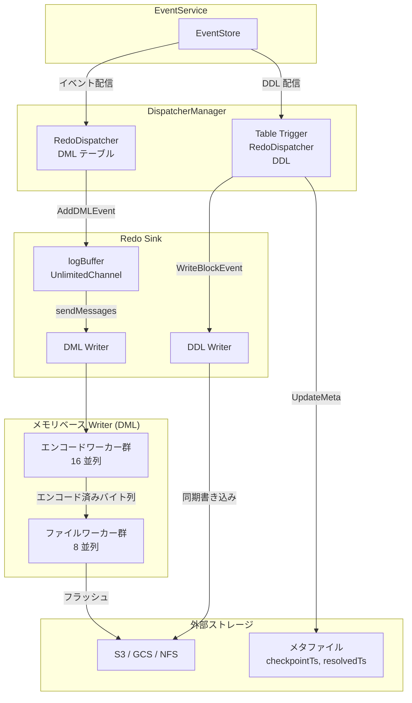

# 第11章 Redo ログと耐障害性

> **本章で読むソース**
>
> - [`pkg/redo/config.go`](https://github.com/pingcap/ticdc/blob/v8.5.6/pkg/redo/config.go)
> - [`pkg/redo/writer/writer.go`](https://github.com/pingcap/ticdc/blob/v8.5.6/pkg/redo/writer/writer.go)
> - [`pkg/redo/writer/factory/factory.go`](https://github.com/pingcap/ticdc/blob/v8.5.6/pkg/redo/writer/factory/factory.go)
> - [`pkg/redo/writer/memory/mem_log_writer.go`](https://github.com/pingcap/ticdc/blob/v8.5.6/pkg/redo/writer/memory/mem_log_writer.go)
> - [`pkg/redo/writer/memory/encoding_worker.go`](https://github.com/pingcap/ticdc/blob/v8.5.6/pkg/redo/writer/memory/encoding_worker.go)
> - [`pkg/redo/writer/memory/file_worker.go`](https://github.com/pingcap/ticdc/blob/v8.5.6/pkg/redo/writer/memory/file_worker.go)
> - [`pkg/redo/writer/file/file.go`](https://github.com/pingcap/ticdc/blob/v8.5.6/pkg/redo/writer/file/file.go)
> - [`pkg/redo/codec/codec.go`](https://github.com/pingcap/ticdc/blob/v8.5.6/pkg/redo/codec/codec.go)
> - [`pkg/redo/reader/reader.go`](https://github.com/pingcap/ticdc/blob/v8.5.6/pkg/redo/reader/reader.go)
> - [`pkg/redo/reader/file.go`](https://github.com/pingcap/ticdc/blob/v8.5.6/pkg/redo/reader/file.go)
> - [`pkg/redo/common/redo_meta.go`](https://github.com/pingcap/ticdc/blob/v8.5.6/pkg/redo/common/redo_meta.go)
> - [`downstreamadapter/sink/redo/sink.go`](https://github.com/pingcap/ticdc/blob/v8.5.6/downstreamadapter/sink/redo/sink.go)
> - [`downstreamadapter/sink/redo/meta.go`](https://github.com/pingcap/ticdc/blob/v8.5.6/downstreamadapter/sink/redo/meta.go)
> - [`downstreamadapter/dispatcher/redo_dispatcher.go`](https://github.com/pingcap/ticdc/blob/v8.5.6/downstreamadapter/dispatcher/redo_dispatcher.go)
> - [`downstreamadapter/dispatchermanager/dispatcher_manager_redo.go`](https://github.com/pingcap/ticdc/blob/v8.5.6/downstreamadapter/dispatchermanager/dispatcher_manager_redo.go)

## この章の狙い

TiCDC の通常のレプリケーションパイプラインでは、イベントを EventStore から取り出して下流 Sink へ直接書き込む。
この経路は高速だが、TiCDC ノードが障害で停止すると、下流に到達していないイベントが失われる可能性がある。

**Redo ログ**は、イベントを下流に書き込む前に外部ストレージ（S3、GCS、NFS など）へ永続化する仕組みである。
障害復旧時にはこの永続化済みイベントを再生（リプレイ）することで、イベントの欠落を防ぐ。
本章では Redo ログの書き込みパイプライン、メタデータ管理、リプレイ機構、そして Redo 専用の Dispatcher と Sink の設計を読む。

## 前提

第8章の Dispatcher と Sink インターフェイスの基本構造、第7章の EventService によるイベント配信の流れを前提とする。
Go の `errgroup`、`sync.Pool`、`container/heap` の基本を想定する。

## Redo ログの有効化と一貫性レベル

Redo ログは Changefeed の設定で有効化する。
一貫性レベルを `ConsistentLevelType` で制御し、`"none"` と `"eventual"` の2種類を提供する。

[`pkg/redo/config.go` L99-L107](https://github.com/pingcap/ticdc/blob/v8.5.6/pkg/redo/config.go#L99-L107)

```go
const (
	// ConsistentLevelNone no consistent guarantee.
	ConsistentLevelNone ConsistentLevelType = "none"
	// ConsistentLevelEventual eventual consistent.
	ConsistentLevelEventual ConsistentLevelType = "eventual"
)
```

`"none"` を指定すると Redo ログは無効になり、通常のレプリケーションパイプラインだけが動作する。
`"eventual"` を指定すると Redo ログが有効化され、イベントの永続化と復旧が可能になる。
`IsConsistentEnabled` がこの判定を担い、ストレージスキーム（S3、GCS、NFS など）の妥当性は `IsValidConsistentStorage` が検証する。

[`pkg/redo/config.go` L119-L122](https://github.com/pingcap/ticdc/blob/v8.5.6/pkg/redo/config.go#L119-L122)

```go
func IsConsistentEnabled(level string) bool {
	return IsValidConsistentLevel(level) && ConsistentLevelType(level) != ConsistentLevelNone
}
```

## ストレージの分類

Redo ログの永続化先は大きく3種類に分かれる。

- **ローカルストレージ**：`local` と `nfs` スキーム。ローカルディスクまたはネットワークファイルシステムに直接書き込む
- **外部ストレージ**：`s3`、`gcs`(`gs`)、`azblob`(`azure`)、`file`、`noop` スキーム。TiDB の `br/pkg/storage` パッケージを通じてアクセスする
- **Blackhole ストレージ**：`blackhole` スキーム。全データを破棄する（テスト用）

ローカルストレージを使う場合、`FixLocalScheme` がスキームを `file` に変換し、外部ストレージと同じインターフェイスで扱えるようにする。

[`pkg/redo/config.go` L182-L186](https://github.com/pingcap/ticdc/blob/v8.5.6/pkg/redo/config.go#L182-L186)

```go
func FixLocalScheme(uri *url.URL) {
	if IsLocalStorage(uri.Scheme) {
		uri.Scheme = string(consistentStorageFile)
	}
}
```

## Writer のファクトリとインターフェイス

Redo ログの書き込みは `RedoLogWriter` インターフェイスで抽象化されている。

[`pkg/redo/writer/writer.go` L39-L48](https://github.com/pingcap/ticdc/blob/v8.5.6/pkg/redo/writer/writer.go#L39-L48)

```go
type RedoLogWriter interface {
	WriteEvents(ctx context.Context, events ...RedoEvent) error
	Run(ctx context.Context) error
	Close() error
	SetTableSchemaStore(*pevent.TableSchemaStore)
}
```

各イベントは `RedoEvent` インターフェイスを実装する。
`ToRedoLog()` でシリアライズ可能な `RedoLog` に変換し、`PostFlush()` でフラッシュ完了時のコールバックを呼ぶ。

[`pkg/redo/writer/writer.go` L33-L37](https://github.com/pingcap/ticdc/blob/v8.5.6/pkg/redo/writer/writer.go#L33-L37)

```go
type RedoEvent interface {
	PostFlush()
	ToRedoLog() *pevent.RedoLog
}
```

ファクトリ関数 `NewRedoLogWriter` がストレージスキームと設定に応じて実装を選択する。

[`pkg/redo/writer/factory/factory.go` L31-L55](https://github.com/pingcap/ticdc/blob/v8.5.6/pkg/redo/writer/factory/factory.go#L31-L55)

```go
func NewRedoLogWriter(
	ctx context.Context, lwCfg *writer.LogWriterConfig, fileType string,
) (writer.RedoLogWriter, error) {
	// ... (中略) ...
	if redo.IsBlackholeStorage(uri.Scheme) {
		invalid := strings.HasSuffix(uri.Scheme, "invalid")
		return blackhole.NewLogWriter(invalid), nil
	}
	if util.GetOrZero(lwCfg.UseFileBackend) {
		return file.NewLogWriter(ctx, lwCfg, fileType)
	}
	return memory.NewLogWriter(ctx, lwCfg, fileType)
}
```

`UseFileBackend` が `true` ならファイルベース Writer、そうでなければメモリベース Writer が使われる。
メモリベース Writer がデフォルトであり、エンコードとファイル書き込みを分離したパイプライン構成を取る。

## メモリベース Writer のパイプライン

メモリベース Writer（`memoryLogWriter`）は、DML イベントの処理を **エンコードワーカー群** と **ファイルワーカー群** の2段パイプラインに分割する。
DDL イベントは頻度が低いため、エンコードワーカーを経由せず同期的にファイルワーカーへ直接渡す。

[`pkg/redo/writer/memory/mem_log_writer.go` L99-L104](https://github.com/pingcap/ticdc/blob/v8.5.6/pkg/redo/writer/memory/mem_log_writer.go#L99-L104)

```go
func (l *memoryLogWriter) WriteEvents(ctx context.Context, events ...writer.RedoEvent) error {
	if l.fileType == redo.RedoDDLLogFileType {
		return l.writeEvents(ctx, events...)
	}
	return l.asyncWriteEvents(ctx, events...)
}
```

### エンコードワーカー群

`encodingWorkerGroup` は複数のワーカーゴルーチンを並列に動かし、`RedoEvent` をバイト列にシリアライズする。
ワーカー数のデフォルトは16で、各ワーカーは専用の入力チャネルを持つ。

[`pkg/redo/writer/memory/encoding_worker.go` L86-L102](https://github.com/pingcap/ticdc/blob/v8.5.6/pkg/redo/writer/memory/encoding_worker.go#L86-L102)

```go
func newEncodingWorkerGroup(cfg *writer.LogWriterConfig) *encodingWorkerGroup {
	workerNum := util.GetOrZero(cfg.EncodingWorkerNum)
	if workerNum <= 0 {
		workerNum = redo.DefaultEncodingWorkerNum
	}
	inputChs := make([]chan writer.RedoEvent, workerNum)
	for i := 0; i < workerNum; i++ {
		inputChs[i] = make(chan writer.RedoEvent, redo.DefaultEncodingInputChanSize)
	}
	return &encodingWorkerGroup{
		changefeed: cfg.ChangeFeedID,
		inputChs:   inputChs,
		outputCh:   make(chan *polymorphicRedoEvent, redo.DefaultEncodingOutputChanSize),
		workerNum:  workerNum,
		closed:     make(chan error, 1),
	}
}
```

イベントはラウンドロビンで各ワーカーに分配される。
`AddEvent` がアトミックカウンタをインクリメントし、ワーカー数で剰余を取ることで割り当て先を決める。

[`pkg/redo/writer/memory/encoding_worker.go` L132-L135](https://github.com/pingcap/ticdc/blob/v8.5.6/pkg/redo/writer/memory/encoding_worker.go#L132-L135)

```go
func (e *encodingWorkerGroup) AddEvent(ctx context.Context, event writer.RedoEvent) error {
	idx := int((e.nextWorker.Inc() - 1) % uint64(e.workerNum))
	return e.input(ctx, idx, event)
}
```

各ワーカーは入力チャネルからイベントを受け取り、`toPolymorphicRedoEvent` でシリアライズして出力チャネルへ送る。
シリアライズでは、`codec.MarshalRedoLog` で msgpack エンコードしたあと、etcd WAL 由来のフレームサイズエンコーディングで長さフィールドと8バイトアラインメントのパディングを付加する。

[`pkg/redo/writer/memory/encoding_worker.go` L46-L71](https://github.com/pingcap/ticdc/blob/v8.5.6/pkg/redo/writer/memory/encoding_worker.go#L46-L71)

```go
func toPolymorphicRedoEvent(
	event writer.RedoEvent,
	tableSchemaStore *commonEvent.TableSchemaStore,
) (*polymorphicRedoEvent, error) {
	rl := event.ToRedoLog()
	// ... (中略) ...
	rawData, err := codec.MarshalRedoLog(rl, nil)
	if err != nil {
		return nil, errors.WrapError(errors.ErrMarshalFailed, err)
	}
	lenField, padBytes := writer.EncodeFrameSize(len(rawData))
	data := make([]byte, 8+len(rawData)+padBytes)
	binary.LittleEndian.PutUint64(data[:8], lenField)
	copy(data[8:], rawData)
	return &polymorphicRedoEvent{
		commitTs: rl.GetCommitTs(),
		callback: event.PostFlush,
		data:     data,
	}, nil
}
```

### ファイルワーカー群

エンコード済みイベントは `fileWorkerGroup` が受け取る。
`bgWriteLogs` がイベントをメモリ上の `fileCache` に蓄積し、一定間隔またはバッチサイズ（デフォルト1024件）に達すると `flushAll` で外部ストレージへ書き出す。

[`pkg/redo/writer/memory/file_worker.go` L212-L262](https://github.com/pingcap/ticdc/blob/v8.5.6/pkg/redo/writer/memory/file_worker.go#L212-L262)

```go
func (f *fileWorkerGroup) bgWriteLogs(
	egCtx context.Context, inputCh <-chan *polymorphicRedoEvent,
) (err error) {
	d := time.Duration(util.GetOrZero(f.cfg.FlushIntervalInMs)) * time.Millisecond
	ticker := time.NewTicker(d)
	defer ticker.Stop()
	num := 0
	cacheEventPostFlush := make([]func(), 0, redo.DefaultFlushBatchSize)
	flush := func() error {
		err := f.flushAll(egCtx)
		if err != nil {
			return err
		}
		for _, fn := range cacheEventPostFlush {
			fn()
		}
		num = 0
		cacheEventPostFlush = cacheEventPostFlush[:0]
		return nil
	}
	for {
		select {
		case <-egCtx.Done():
			return errors.Trace(egCtx.Err())
		case <-ticker.C:
			err := flush()
			// ... (中略) ...
		case event := <-inputCh:
			// ... (中略) ...
			err := f.writeToCache(egCtx, event)
			// ... (中略) ...
			num++
			if num > redo.DefaultFlushBatchSize {
				err := flush()
				// ... (中略) ...
			}
		}
	}
}
```

`fileCache` はバイトバッファとメタ情報（最大/最小 commitTs）を保持する。
キャッシュがログファイルの最大サイズ（デフォルト64MB）に達すると、新しいキャッシュを作成して古いキャッシュをフラッシュキューへ送る。

[`pkg/redo/writer/memory/file_worker.go` L338-L390](https://github.com/pingcap/ticdc/blob/v8.5.6/pkg/redo/writer/memory/file_worker.go#L338-L390)

```go
func (f *fileWorkerGroup) writeToCache(
	egCtx context.Context, event *polymorphicRedoEvent,
) (err error) {
	// ... (中略) ...
	if len(f.files) == 0 {
		file := f.newFileCache(data, commitTs)
		// ... (中略) ...
		f.files = append(f.files, file)
		return nil
	}
	file := f.files[len(f.files)-1]
	if file.fileSize+writeLen > f.cfg.MaxLogSizeInBytes {
		select {
		case <-egCtx.Done():
			return errors.Trace(egCtx.Err())
		case f.flushCh <- file:
		}
		file := f.newFileCache(data, commitTs)
		// ... (中略) ...
		f.files = append(f.files, file)
		return nil
	}
	_, err = file.writer.Write(data)
	// ... (中略) ...
	return nil
}
```

バックグラウンドのフラッシュワーカー（デフォルト8並列）が `flushCh` からキャッシュを受け取り、外部ストレージへ書き込む。
最大メモリ使用量は `flushWorkerNum * maxLogSize`、つまりデフォルトで `8 * 64MB = 512MB` に収まるよう設計されている。

## コーデックとフレームフォーマット

Redo ログのシリアライズは `pkg/redo/codec` パッケージが担う。
v2 フォーマットではバージョンプレフィックス `0xff 0xff` に続いてバージョン番号（2バイト）を配置し、その後に msgpack エンコードされた `RedoLog` 本体が続く。

[`pkg/redo/codec/codec.go` L79-L85](https://github.com/pingcap/ticdc/blob/v8.5.6/pkg/redo/codec/codec.go#L79-L85)

```go
func MarshalRedoLog(r *pevent.RedoLog, b []byte) (o []byte, err error) {
	b = append(b, versionPrefix[:]...)
	b = binary.BigEndian.AppendUint16(b, latestVersion)
	o, err = r.MarshalMsg(b)
	return
}
```

v1 フォーマットとの互換性を保つため、デコード時にプレフィックスバイトを検査してバージョンを判定する。
v1 の先頭バイトが `0xff 0xff` と一致しない場合は v1 として処理する。

フレーム単位の書き込みでは、etcd WAL 由来の `EncodeFrameSize` を使って8バイトアラインメントを確保する。

[`pkg/redo/writer/writer.go` L97-L105](https://github.com/pingcap/ticdc/blob/v8.5.6/pkg/redo/writer/writer.go#L97-L105)

```go
func EncodeFrameSize(dataBytes int) (lenField uint64, padBytes int) {
	lenField = uint64(dataBytes)
	padBytes = (8 - (dataBytes % 8)) % 8
	if padBytes != 0 {
		lenField |= uint64(0x80|padBytes) << 56
	}
	return lenField, padBytes
}
```

この8バイトアラインメントにより、長さフィールドが torn write（書き込みの途中で中断される現象）の影響を受けないことが保証される[^1]。

[^1]: etcd WAL の設計に由来する。torn write では書き込みがセクタ境界で切れるため、セクタサイズ（512バイト）の倍数でアラインすることで、破損したエントリと正常なデータ破壊を区別できる。

## Redo Sink

`redo.Sink` は Sink インターフェイスを実装し、DDL Writer と DML Writer の2つの `RedoLogWriter` を内包する。

[`downstreamadapter/sink/redo/sink.go` L37-L50](https://github.com/pingcap/ticdc/blob/v8.5.6/downstreamadapter/sink/redo/sink.go#L37-L50)

```go
type Sink struct {
	ctx       context.Context
	cfg       *writer.LogWriterConfig
	ddlWriter writer.RedoLogWriter
	dmlWriter writer.RedoLogWriter

	logBuffer *chann.UnlimitedChannel[writer.RedoEvent, any]

	isNormal *atomic.Bool
	isClosed *atomic.Bool

	metric *redoSinkMetrics
}
```

DDL イベントは `WriteBlockEvent` で同期的に DDL Writer へ書き込む。
DML イベントは `AddDMLEvent` で非同期バッファ（`logBuffer`）へ投入し、バックグラウンドの `sendMessages` ゴルーチンがバッチで DML Writer へ渡す。

[`downstreamadapter/sink/redo/sink.go` L130-L162](https://github.com/pingcap/ticdc/blob/v8.5.6/downstreamadapter/sink/redo/sink.go#L130-L162)

```go
func (s *Sink) AddDMLEvent(event *commonEvent.DMLEvent) {
	toRowCallback := func(postTxnFlushed []func(), totalCount uint64) func() {
		var calledCount atomic.Uint64
		return func() {
			if calledCount.Inc() == totalCount {
				for _, callback := range postTxnFlushed {
					callback()
				}
			}
		}
	}
	rowsCount := event.Len()
	rowCallback := toRowCallback(event.PostTxnFlushed, uint64(rowsCount))
	events := make([]writer.RedoEvent, 0, rowsCount)
	for {
		row, ok := event.GetNextRow()
		if !ok {
			event.Rewind()
			break
		}
		events = append(events, &commonEvent.RedoRowEvent{
			// ... (中略) ...
			Callback: rowCallback,
		})
	}
	s.logBuffer.Push(events...)
}
```

1つのトランザクション内の全行がフラッシュされたときに初めてトランザクションのコールバックが発火する設計になっている。
`toRowCallback` がアトミックカウンタで行の完了数を追跡し、最後の行のフラッシュ完了時にまとめてコールバックを呼ぶ。

## Redo メタデータ管理

**RedoMeta** は、外部ストレージ上に `checkpointTs` と `resolvedTs` のペアを永続化する構造体である。

[`pkg/redo/common/redo_meta.go` L25-L29](https://github.com/pingcap/ticdc/blob/v8.5.6/pkg/redo/common/redo_meta.go#L25-L29)

```go
type LogMeta struct {
	CheckpointTs uint64 `msg:"checkpointTs"`
	ResolvedTs   uint64 `msg:"resolvedTs"`
	Version      int    `msg:"version"`
}
```

- **CheckpointTs**：この値以下の commitTs を持つイベントは全て下流に書き込み済みである
- **ResolvedTs**：外部ストレージへの完全なアップロードが確認されたトランザクションの最終 commitTs

`RedoMeta` は2つのバックグラウンドゴルーチンを持つ。
`bgFlushMeta` が定期的（デフォルト200ms間隔）にメタファイルを外部ストレージへ書き出し、`bgGC` が `checkpointTs` より古いログファイルを削除する。

[`downstreamadapter/sink/redo/meta.go` L137-L148](https://github.com/pingcap/ticdc/blob/v8.5.6/downstreamadapter/sink/redo/meta.go#L137-L148)

```go
func (m *RedoMeta) Run(ctx context.Context) error {
	eg, egCtx := errgroup.WithContext(ctx)
	eg.Go(func() error {
		return m.bgFlushMeta(egCtx)
	})
	eg.Go(func() error {
		return m.bgGC(egCtx)
	})
	m.running.Store(true)
	return eg.Wait()
}
```

### メタのフラッシュと GC

メタのフラッシュでは、unflushed（メモリ上の最新値）と flushed（ディスク上の確定値）を比較し、変化がある場合だけ書き出す。
書き出しのたびに新しいメタファイルを生成し、前回のファイルを削除する。

[`downstreamadapter/sink/redo/meta.go` L346-L369](https://github.com/pingcap/ticdc/blob/v8.5.6/downstreamadapter/sink/redo/meta.go#L346-L369)

```go
func (m *RedoMeta) maybeFlushMeta(ctx context.Context) error {
	hasChange, unflushed := m.prepareForFlushMeta()
	if !hasChange {
		if time.Since(m.lastFlushTime) > redo.FlushWarnDuration {
			log.Debug("Redo meta has not changed for a long time, ...")
		}
		return nil
	}
	// ... (中略) ...
	if err := m.flush(ctx, unflushed); err != nil {
		return err
	}
	m.postFlushMeta(unflushed)
	m.lastFlushTime = time.Now()
	return nil
}
```

GC は5秒間隔（`DefaultGCIntervalInMs`）で動作し、ファイル名に埋め込まれた `maxCommitTs` が `checkpointTs` を下回るログファイルを削除する。
`checkpointTs` と一致するファイルは削除しない。DDL がちょうどその時点で実行されている可能性があるためである。

[`downstreamadapter/sink/redo/meta.go` L283-L309](https://github.com/pingcap/ticdc/blob/v8.5.6/downstreamadapter/sink/redo/meta.go#L283-L309)

```go
func (m *RedoMeta) shouldRemoved(path string, checkPointTs uint64) bool {
	// ... (中略) ...
	commitTs, fileType, err := redo.ParseLogFileName(path)
	// ... (中略) ...
	// if commitTs == checkPointTs, the DDL may be executed in the owner,
	// so we should not delete it.
	return commitTs < checkPointTs
}
```

## RedoDispatcher と通常 Dispatcher の違い

`RedoDispatcher` は `BasicDispatcher` を埋め込み、Redo メタの管理を追加した構造体である。

[`downstreamadapter/dispatcher/redo_dispatcher.go` L32-L37](https://github.com/pingcap/ticdc/blob/v8.5.6/downstreamadapter/dispatcher/redo_dispatcher.go#L32-L37)

```go
type RedoDispatcher struct {
	*BasicDispatcher
	redoMeta *redo.RedoMeta
	cancel   context.CancelFunc
}
```

通常の Dispatcher はイベントを下流 Sink（MySQL、Kafka など）に直接書き込む。
「RedoDispatcher」はイベントを Redo Sink へ書き込む。つまり、下流ではなく外部ストレージに永続化する。
Dispatcher 生成時のモード指定 `common.RedoMode` がこの動作を決定する。

Table Trigger RedoDispatcher と呼ばれる特殊な RedoDispatcher が1つ存在し、DDL スパンを担当する。
この Dispatcher だけが `RedoMeta` を保持し、メタの更新と外部ストレージへのフラッシュを行う。

[`downstreamadapter/dispatcher/redo_dispatcher.go` L91-L108](https://github.com/pingcap/ticdc/blob/v8.5.6/downstreamadapter/dispatcher/redo_dispatcher.go#L91-L108)

```go
func (rd *RedoDispatcher) SetRedoMeta(cfg *config.ConsistentConfig) {
	if !rd.IsTableTriggerDispatcher() {
		log.Error("SetRedoMeta should be called by table trigger redo dispatcher", ...)
	}
	ctx := context.Background()
	ctx, rd.cancel = context.WithCancel(ctx)
	rd.redoMeta = redo.NewRedoMeta(rd.sharedInfo.changefeedID, rd.startTs, cfg)
	go func() {
		err := rd.redoMeta.PreStart(ctx)
		if err != nil {
			rd.HandleError(err)
		}
		err = rd.redoMeta.Run(ctx)
		if err != nil {
			rd.HandleError(err)
		}
	}()
}
```

## DispatcherManager における Redo コンポーネントの初期化

`initRedoComponet` が Redo ログに必要な全コンポーネントを初期化する。

[`downstreamadapter/dispatchermanager/dispatcher_manager_redo.go` L37-L87](https://github.com/pingcap/ticdc/blob/v8.5.6/downstreamadapter/dispatchermanager/dispatcher_manager_redo.go#L37-L87)

```go
func initRedoComponet(
	ctx context.Context,
	manager *DispatcherManager,
	// ... (中略) ...
) error {
	if manager.config.Consistent == nil || !pkgRedo.IsConsistentEnabled(...) {
		return nil
	}
	manager.redoDispatcherMap = newDispatcherMap[*dispatcher.RedoDispatcher]()
	manager.redoSink = redo.New(ctx, changefeedID, manager.config.Consistent)
	// ... (中略) ...
	manager.RedoEnable = true

	totalQuota := manager.sinkQuota
	consistentMemoryUsage := manager.config.Consistent.MemoryUsage
	// ... (中略) ...
	manager.redoQuota = totalQuota * consistentMemoryUsage.MemoryQuotaPercentage / 100
	manager.sinkQuota = totalQuota - manager.redoQuota
	// ... (中略) ...
}
```

メモリクォータは通常の Sink と Redo で分割される。
`MemoryQuotaPercentage` で指定した割合が Redo 側に割り当てられ、残りが通常の Sink に充てられる。

`collectRedoMeta` がバックグラウンドで定期的に Table Trigger RedoDispatcher からフラッシュ済みメタを取得し、Maintainer へ `RedoResolvedTsProgressMessage` として報告する。
Maintainer はこの resolvedTs を使って Changefeed 全体の進捗を管理する。

[`downstreamadapter/dispatchermanager/dispatcher_manager_redo.go` L290-L323](https://github.com/pingcap/ticdc/blob/v8.5.6/downstreamadapter/dispatchermanager/dispatcher_manager_redo.go#L290-L323)

```go
func (e *DispatcherManager) collectRedoMeta(ctx context.Context) error {
	ticker := time.NewTicker(time.Duration(*e.config.Consistent.FlushIntervalInMs) * time.Millisecond)
	defer ticker.Stop()
	mc := appcontext.GetService[messaging.MessageCenter](appcontext.MessageCenter)
	var preResolvedTs uint64
	for {
		select {
		case <-ctx.Done():
			return ctx.Err()
		case <-ticker.C:
			// ... (中略) ...
			logMeta := e.GetTableTriggerRedoDispatcher().GetFlushedMeta()
			if preResolvedTs >= logMeta.ResolvedTs {
				continue
			}
			err := mc.SendCommand(
				messaging.NewSingleTargetMessage(
					e.GetMaintainerID(),
					messaging.MaintainerManagerTopic,
					&heartbeatpb.RedoResolvedTsProgressMessage{
						ChangefeedID: e.changefeedID.ToPB(),
						ResolvedTs:   logMeta.ResolvedTs,
					},
				))
			// ... (中略) ...
		}
	}
}
```

## Redo ログのデータフロー

イベントが EventStore から外部ストレージに永続化されるまでの全体フローを図にまとめる。



## Redo ログのリプレイ

障害復旧時、外部ストレージに保存された Redo ログを読み出して下流に再適用する。
`LogReader` がこの処理を担う。

### メタの復元

起動時に `initMeta` が外部ストレージ内の全メタファイルを走査し、最大の `checkpointTs` と `resolvedTs` を採用する。
復旧対象は `(checkpointTs, resolvedTs]` の範囲に含まれるイベントである。

[`pkg/redo/reader/reader.go` L260-L308](https://github.com/pingcap/ticdc/blob/v8.5.6/pkg/redo/reader/reader.go#L260-L308)

```go
func (l *LogReader) initMeta(ctx context.Context) error {
	// ... (中略) ...
	extStorage, err := redo.InitExternalStorage(ctx, l.cfg.URI)
	// ... (中略) ...
	metas := make([]*misc.LogMeta, 0, 64)
	err = extStorage.WalkDir(ctx, nil, func(path string, size int64) error {
		if !strings.HasSuffix(path, redo.MetaEXT) {
			return nil
		}
		// ... (中略) ...
		var meta misc.LogMeta
		_, err = meta.UnmarshalMsg(data)
		// ... (中略) ...
		metas = append(metas, &meta)
		return nil
	})
	// ... (中略) ...
	var checkpointTs, resolvedTs uint64
	misc.ParseMeta(metas, &checkpointTs, &resolvedTs)
	// ... (中略) ...
	l.meta = &misc.LogMeta{CheckpointTs: checkpointTs, ResolvedTs: resolvedTs, ...}
	return nil
}
```

### ファイルのダウンロードとソート

リプレイ時、外部ストレージからログファイルをローカルにダウンロードし、commitTs 順にソートして `.sort` ファイルとして書き出す。
ファイル名に埋め込まれた `maxCommitTs` が `startTs` を超えるファイルだけを選択的にダウンロードする。

[`pkg/redo/reader/file.go` L307-L323](https://github.com/pingcap/ticdc/blob/v8.5.6/pkg/redo/reader/file.go#L307-L323)

```go
func shouldOpen(startTs uint64, name, fixedType string) (bool, error) {
	commitTs, fileType, err := redo.ParseLogFileName(name)
	if err != nil {
		return false, err
	}
	if fileType != fixedType {
		return false, nil
	}
	if filepath.Ext(name) == redo.TmpEXT {
		return true, nil
	}
	return commitTs > startTs, nil
}
```

LZ4 圧縮されたファイルは自動的に検出して解凍される。
先頭4バイトの LZ4 マジックナンバー `0x04 0x22 0x4D 0x18` で判定する。

### ヒープによるマージソート

複数のソート済みファイルからイベントを読み出す際、`logHeap`（min-heap）でマージソートを行う。
DML イベントは `commitTs` の昇順、同一 `commitTs` 内では `startTs` の昇順、さらに同一トランザクション内では Delete、Update、Insert の順に並べる。

[`pkg/redo/reader/reader.go` L356-L394](https://github.com/pingcap/ticdc/blob/v8.5.6/pkg/redo/reader/reader.go#L356-L394)

```go
func (h logHeap) Less(i, j int) bool {
	// ... (中略) ...
	if h[i].data.RedoRow.Row.CommitTs == h[j].data.RedoRow.Row.CommitTs {
		if h[i].data.RedoRow.Row.StartTs != h[j].data.RedoRow.Row.StartTs {
			return h[i].data.RedoRow.Row.StartTs < h[j].data.RedoRow.Row.StartTs
		}
		if h[i].data.RedoRow.IsDelete() {
			return true
		} else if h[i].data.RedoRow.IsUpdate() {
			return !h[j].data.RedoRow.IsDelete()
		}
		return false
	}
	return h[i].data.RedoRow.Row.CommitTs < h[j].data.RedoRow.Row.CommitTs
}
```

DML と DDL は別々のゴルーチンで並列に読み出される。
`runRowReader` と `runDDLReader` が独立して動作し、それぞれ `rowCh` と `ddlCh` へイベントを送出する。

## 高速化の工夫：エンコードとフラッシュの分離パイプライン

メモリベース Writer の設計には、スループットを最大化するための工夫がある。

**エンコードとファイル書き込みを独立したワーカー群に分離する**ことで、CPU バウンドなシリアライズ処理と I/O バウンドなストレージ書き込みを並列に進行させる。
エンコードワーカーが16並列でイベントをバイト列に変換し、その出力をファイルワーカーが8並列で外部ストレージへ書き出す。
この2段構成により、エンコードの完了を待たずに前のバッチのフラッシュを進められる。

さらに、ファイルワーカーは `sync.Pool` でバイトバッファを再利用し、GC 負荷を抑える。

[`pkg/redo/writer/memory/file_worker.go` L135-L141](https://github.com/pingcap/ticdc/blob/v8.5.6/pkg/redo/writer/memory/file_worker.go#L135-L141)

```go
pool: sync.Pool{
	New: func() interface{} {
		buf := make([]byte, 0, cfg.MaxLogSizeInBytes)
		return &buf
	},
},
```

ファイルベース Writer を使用する場合にも別の最適化がある。
S3 などの外部ストレージを使う際、`FileAllocator` がローカルにファイルを事前確保しておき、書き込み時のファイル作成コストを削減する。

[`pkg/redo/writer/file/file.go` L142-L144](https://github.com/pingcap/ticdc/blob/v8.5.6/pkg/redo/writer/file/file.go#L142-L144)

```go
if w.cfg.UseExternalStorage {
	w.allocator = fsutil.NewFileAllocator(cfg.Dir, logType, cfg.MaxLogSizeInBytes)
}
```

また、S3 へのアップロード後にローカルのページキャッシュを明示的にドロップすることで、OS のメモリ回収による I/O レイテンシスパイクを防いでいる。

[`pkg/redo/writer/file/file.go` L548-L554](https://github.com/pingcap/ticdc/blob/v8.5.6/pkg/redo/writer/file/file.go#L548-L554)

```go
err = fsutil.DropPageCache(name)
if err != nil {
	return errors.WrapError(errors.ErrRedoFileOp, err)
}
```

## まとめ

Redo ログは TiCDC の耐障害性を担保する仕組みである。
イベントを下流に書き込む前に外部ストレージへ永続化し、障害復旧時にはメタファイルから復旧区間を特定してイベントを再生する。

書き込み側はエンコードとフラッシュを分離した2段パイプラインで高スループットを実現し、読み出し側はヒープベースのマージソートで複数ファイルから時系列順にイベントを再構成する。
RedoDispatcher と Redo Sink は通常のレプリケーションパイプラインと同じインターフェイスを実装しつつ、書き込み先を外部ストレージに差し替えることで、アーキテクチャの一貫性を保っている。

## 関連する章

- 第7章「EventService とイベント配信」：RedoDispatcher へのイベント配信元
- 第8章「Dispatcher と Sink」：通常の Dispatcher/Sink インターフェイスの定義
- 第12章以降のスケジューリング章：Redo resolvedTs の Maintainer への報告と Changefeed 進捗管理
