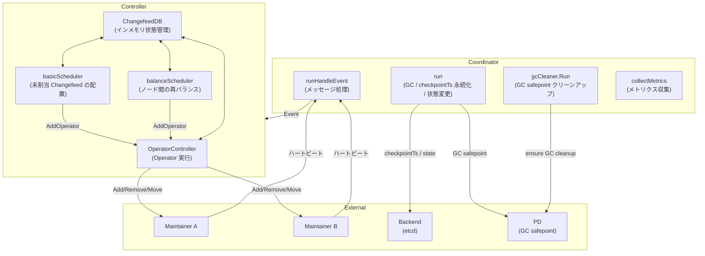
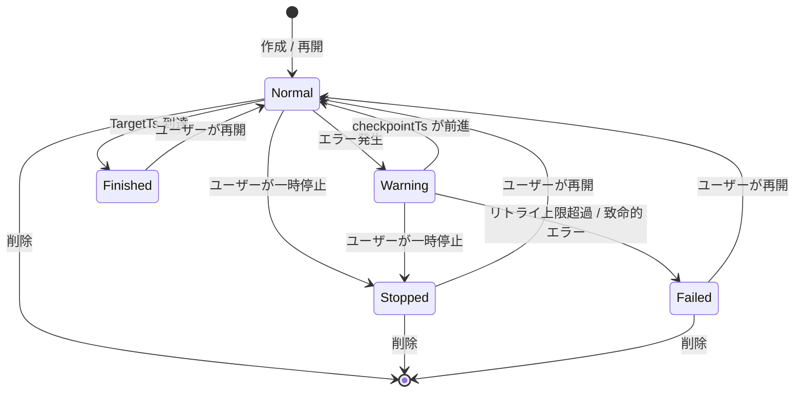

# 第12章 Coordinator と Changefeed 管理

> **本章で読むソース**
>
> - [`coordinator/coordinator.go`](https://github.com/pingcap/ticdc/blob/v8.5.6/coordinator/coordinator.go)
> - [`coordinator/controller.go`](https://github.com/pingcap/ticdc/blob/v8.5.6/coordinator/controller.go)
> - [`coordinator/helper.go`](https://github.com/pingcap/ticdc/blob/v8.5.6/coordinator/helper.go)
> - [`coordinator/changefeed/changefeed.go`](https://github.com/pingcap/ticdc/blob/v8.5.6/coordinator/changefeed/changefeed.go)
> - [`coordinator/changefeed/changefeed_db.go`](https://github.com/pingcap/ticdc/blob/v8.5.6/coordinator/changefeed/changefeed_db.go)
> - [`coordinator/changefeed/changefeed_db_backend.go`](https://github.com/pingcap/ticdc/blob/v8.5.6/coordinator/changefeed/changefeed_db_backend.go)
> - [`coordinator/changefeed/backoff.go`](https://github.com/pingcap/ticdc/blob/v8.5.6/coordinator/changefeed/backoff.go)
> - [`coordinator/operator/operator_controller.go`](https://github.com/pingcap/ticdc/blob/v8.5.6/coordinator/operator/operator_controller.go)
> - [`coordinator/operator/operator_add.go`](https://github.com/pingcap/ticdc/blob/v8.5.6/coordinator/operator/operator_add.go)
> - [`coordinator/operator/operator_move.go`](https://github.com/pingcap/ticdc/blob/v8.5.6/coordinator/operator/operator_move.go)
> - [`coordinator/operator/operator_stop.go`](https://github.com/pingcap/ticdc/blob/v8.5.6/coordinator/operator/operator_stop.go)
> - [`coordinator/scheduler/basic.go`](https://github.com/pingcap/ticdc/blob/v8.5.6/coordinator/scheduler/basic.go)
> - [`coordinator/scheduler/balance.go`](https://github.com/pingcap/ticdc/blob/v8.5.6/coordinator/scheduler/balance.go)
> - [`coordinator/gccleaner/cleaner.go`](https://github.com/pingcap/ticdc/blob/v8.5.6/coordinator/gccleaner/cleaner.go)
> - [`pkg/scheduler/scheduler.go`](https://github.com/pingcap/ticdc/blob/v8.5.6/pkg/scheduler/scheduler.go)
> - [`pkg/scheduler/basic.go`](https://github.com/pingcap/ticdc/blob/v8.5.6/pkg/scheduler/basic.go)
> - [`pkg/scheduler/balance.go`](https://github.com/pingcap/ticdc/blob/v8.5.6/pkg/scheduler/balance.go)

## この章の狙い

TiCDC クラスタには複数のノードが存在するが、Changefeed の作成や削除、ノード間の再配置といったクラスタ全体の管理を行う「頭脳」が必要になる。
**Coordinator** がその役割を担う。

本章では、Coordinator がリーダーノード上でどのように起動し、Changefeed のライフサイクル(作成、停止、障害時のリトライ、削除)を管理するかを読む。
Changefeed をノードに割り当てるスケジューラ、状態遷移を駆動する Operator パターン、GC safepoint のクリーンアップまでを扱う。

## 前提

- TiCDC クラスタでは、etcd のリーダー選挙によって1台のノードが Owner(リーダー)に選出される。
  Coordinator はこのリーダーノード上でのみ動作する。
- 各ノードには **Maintainer** が存在し、割り当てられた Changefeed の実処理(EventStore からの読み取り、Sink への書き込み)を担当する。
  Coordinator は Maintainer に対して「追加」「削除」「移動」のメッセージを送り、間接的に Changefeed を制御する。
- Changefeed のメタデータ(設定、checkpointTs、状態)は **Backend**(etcd)に永続化される。
  Coordinator はインメモリの ChangefeedDB と Backend を組み合わせて整合性を保つ。

## Coordinator の全体構成

Coordinator は3つのゴルーチンと、Controller 内部のスレッドプールで動作する。



## Coordinator の起動と停止

### 構造体と初期化

`coordinator` 構造体は Controller、Backend、GC 関連のコンポーネントを保持する。

[`coordinator/coordinator.go` L71-L99](https://github.com/pingcap/ticdc/blob/v8.5.6/coordinator/coordinator.go#L71-L99)

```go
type coordinator struct {
	nodeInfo     *node.Info
	version      int64
	gcServiceID  string
	lastTickTime time.Time

	controller *Controller
	backend    changefeed.Backend

	mc             messaging.MessageCenter
	gcManager      gc.Manager
	gcTickInterval time.Duration
	gcCleaner      *gccleaner.Cleaner

	pdClient pd.Client
	pdClock  pdutil.Clock

	eventCh *chann.DrainableChann[*Event]
	changefeedChangeCh chan []*changefeedChange

	msgGuardWaitGroup util.GuardedWaitGroup

	cancel func()
	closed atomic.Bool
}
```

`New` 関数では、MessageCenter に `CoordinatorTopic` のハンドラを登録し、Controller を初期化する。
もう1つ注目すべきは、NodeManager への Owner 変更ハンドラの登録である。
自ノードが Owner でなくなった場合、`Stop` を呼んで Coordinator を自動的に停止する。

[`coordinator/coordinator.go` L140-L153](https://github.com/pingcap/ticdc/blob/v8.5.6/coordinator/coordinator.go#L140-L153)

```go
nodeManager := appcontext.GetService[*watcher.NodeManager](watcher.NodeManagerName)
nodeManager.RegisterOwnerChangeHandler(
	string(c.nodeInfo.ID),
	func(newCoordinatorID string) {
		if newCoordinatorID != string(c.nodeInfo.ID) {
			log.Info("Coordinator changed, and I am not the coordinator, stop myself",
				zap.String("selfID", string(c.nodeInfo.ID)),
				zap.String("newCoordinatorID", newCoordinatorID))
			c.Stop()
		}
	})
```

### Run: 3つのゴルーチン

`Run` は `errgroup` で4つのゴルーチンを起動する。

[`coordinator/coordinator.go` L174-L194](https://github.com/pingcap/ticdc/blob/v8.5.6/coordinator/coordinator.go#L174-L194)

```go
func (c *coordinator) Run(ctx context.Context) error {
	ctx, cancel := context.WithCancel(ctx)
	c.cancel = cancel

	eg, ctx := errgroup.WithContext(ctx)
	eg.Go(func() error {
		return c.run(ctx)
	})
	eg.Go(func() error {
		return c.runHandleEvent(ctx)
	})
	eg.Go(func() error {
		return c.gcCleaner.Run(ctx)
	})
	eg.Go(func() error {
		return c.controller.collectMetrics(ctx)
	})

	return eg.Wait()
}
```

- **`run`**: GC safepoint の定期更新、checkpointTs の永続化、状態変更の処理を行うメインループ。
- **`runHandleEvent`**: Maintainer からのハートビートメッセージを Controller に転送する。
- **`gcCleaner.Run`**: Changefeed 作成/再開時に設定した一時的な GC safepoint を非同期にクリーンアップする。
- **`collectMetrics`**: 5秒ごとに Changefeed の状態やチェックポイントのラグをメトリクスに記録する。

### 安全な停止

`Stop` では、まず `closed` フラグを立ててメッセージハンドラの登録を解除し、進行中のハンドラが完了するのを `msgGuardWaitGroup.Wait()` で待つ。
この順序によって、`eventCh` を閉じる前にハンドラが書き込みを終えることが保証される。

[`coordinator/coordinator.go` L407-L417](https://github.com/pingcap/ticdc/blob/v8.5.6/coordinator/coordinator.go#L407-L417)

```go
func (c *coordinator) Stop() {
	if c.closed.CompareAndSwap(false, true) {
		c.mc.DeRegisterHandler(messaging.CoordinatorTopic)
		c.msgGuardWaitGroup.Wait()
		c.controller.Stop()
		c.cancel()
		c.eventCh.CloseAndDrain()
	}
}
```

## Controller とブートストラップ

### Controller の構造

**Controller** は Coordinator 内部の中核コンポーネントで、スケジューラ、OperatorController、ChangefeedDB の3つを統合する。

[`coordinator/controller.go` L58-L89](https://github.com/pingcap/ticdc/blob/v8.5.6/coordinator/controller.go#L58-L89)

```go
type Controller struct {
	version int64
	selfNode *node.Info

	pdClient           pd.Client
	pdClock            pdutil.Clock
	scheduler          *scheduler.Controller
	operatorController *operator.Controller
	changefeedDB       *changefeed.ChangefeedDB
	backend            changefeed.Backend
	eventCh            *chann.DrainableChann[*Event]

	initialized  *atomic.Bool
	bootstrapper *bootstrap.Bootstrapper[heartbeatpb.CoordinatorBootstrapResponse]
	// ... (中略) ...
}
```

Controller の初期化時に、`basicScheduler` と `balanceScheduler` の2種類のスケジューラが登録される。

[`coordinator/controller.go` L126-L140](https://github.com/pingcap/ticdc/blob/v8.5.6/coordinator/controller.go#L126-L140)

```go
scheduler: scheduler.NewController(map[string]scheduler.Scheduler{
	scheduler.BasicScheduler: coscheduler.NewBasicScheduler(
		selfNode.ID.String(),
		batchSize,
		oc,
		changefeedDB,
	),
	scheduler.BalanceScheduler: coscheduler.NewBalanceScheduler(
		selfNode.ID.String(),
		batchSize,
		oc,
		changefeedDB,
		balanceInterval,
	),
}),
```

### ブートストラップ: クラスタ状態の復元

Coordinator が起動すると、各ノードにブートストラップリクエストを送信する。
各ノードの Maintainer は、自分が担当している Changefeed の一覧を応答として返す。
全ノードの応答が揃うと `finishBootstrap` が呼ばれ、Backend(etcd)から読み込んだ全 Changefeed とリモートノードで稼働中の Changefeed を突き合わせる。

[`coordinator/controller.go` L507-L570](https://github.com/pingcap/ticdc/blob/v8.5.6/coordinator/controller.go#L507-L570)

```go
func (c *Controller) finishBootstrap(ctx context.Context, runningChangefeeds map[common.ChangeFeedID]remoteMaintainer) {
	allChangefeeds, err := c.backend.GetAllChangefeeds(ctx)
	if err != nil {
		log.Panic("load all changefeeds failed", zap.Error(err))
	}
	// ... (中略) ...
	for cfID, cfMeta := range allChangefeeds {
		rm, ok := runningChangefeeds[cfID]
		if !ok {
			cf := changefeed.NewChangefeed(cfID, cfMeta.Info, cfMeta.Status.CheckpointTs, false)
			if shouldRunChangefeed(cf.GetInfo().State) {
				c.changefeedDB.AddAbsentChangefeed(cf)
			} else {
				c.changefeedDB.AddStoppedChangefeed(cf)
			}
		} else {
			cf := changefeed.NewChangefeed(cfID, cfMeta.Info, rm.status.CheckpointTs, false)
			c.changefeedDB.AddReplicatingMaintainer(cf, rm.nodeID)
			delete(runningChangefeeds, cfID)
		}
		// ... (中略) ...
	}
	// ... (中略) ...
	c.initialized.Store(true)
}
```

この突き合わせでは3つのケースが発生する。

1. **Backend にあるがリモートで未稼働**: 状態が Normal/Warning なら ChangefeedDB の Absent キューに追加し、スケジューラによる再配置を待つ。Stopped/Failed/Finished なら Stopped マップに格納する。
2. **Backend にありリモートで稼働中**: そのまま Replicating として登録する。
3. **Backend になくリモートで稼働中**: 古い Changefeed なので、該当ノードに削除メッセージを送る。

## Changefeed の状態モデル

### FeedState の定義

Changefeed の状態は `FeedState` 型で定義される。

[`pkg/config/changefeed.go` L43-L60](https://github.com/pingcap/ticdc/blob/v8.5.6/pkg/config/changefeed.go#L43-L60)

```go
type FeedState string

const (
	StateNormal   FeedState = "normal"
	StatePending  FeedState = "pending"
	StateFailed   FeedState = "failed"
	StateStopped  FeedState = "stopped"
	StateRemoved  FeedState = "removed"
	StateFinished FeedState = "finished"
	StateWarning  FeedState = "warning"
)
```

Coordinator が管理の対象とする主要な状態は以下の5つである。

- **Normal**: 正常に稼働中。Maintainer がデータをキャプチャしている。
- **Warning**: エラーが発生したが、リトライ中。指数バックオフで再起動を試みる。
- **Failed**: リトライの上限(`MaxElapsedTime`)を超えた、または致命的エラーが発生した。手動での介入が必要。
- **Stopped**: ユーザーが明示的に一時停止した。
- **Finished**: `TargetTs` に到達して正常終了した。



### Backoff によるリトライ制御

Warning 状態への遷移とリトライは `Backoff` 構造体が制御する。
指数バックオフの間隔は 10秒から始まり、最大10分まで増加する。

[`coordinator/changefeed/backoff.go` L33-L39](https://github.com/pingcap/ticdc/blob/v8.5.6/coordinator/changefeed/backoff.go#L33-L39)

```go
const (
	defaultBackoffInitInterval        = 10 * time.Second
	defaultBackoffMaxInterval         = 10 * time.Minute
	defaultBackoffRandomizationFactor = 0.1
	defaultBackoffMultiplier          = 2.0
)
```

`CheckStatus` メソッドが状態遷移のロジックを担う。
Maintainer から報告された checkpointTs が前回より進んでいれば、エラーから回復したとみなしてバックオフをリセットし Normal に戻す。
checkpointTs が進まずエラーが報告された場合は、`HandleError` で次のリトライ時刻を計算する。

[`coordinator/changefeed/backoff.go` L125-L177](https://github.com/pingcap/ticdc/blob/v8.5.6/coordinator/changefeed/backoff.go#L125-L177)

```go
func (m *Backoff) CheckStatus(status *heartbeatpb.MaintainerStatus) (bool, config.FeedState, *heartbeatpb.RunningError) {
	if m.failed.Load() {
		return false, config.StateFailed, nil
	}

	if m.checkpointTs < status.CheckpointTs {
		m.checkpointTs = status.CheckpointTs
		if m.retrying.Load() {
			m.resetErrRetry()
			return true, config.StateNormal, nil
		}
		return false, config.StateNormal, nil
	}

	if len(status.Err) > 0 {
		// ... (中略) ...
		m.isRestarting.Store(true)
		failed, err := m.HandleError(status.Err)
		if failed {
			m.failed.Store(true)
			return true, config.StateFailed, err
		}
		return true, config.StateWarning, err
	}

	return false, config.StateNormal, nil
}
```

`HandleError` では、GC 系の致命的エラーや `ShouldFailChangefeed` に該当するエラーはリトライせず即座に Failed に遷移する。
それ以外のエラーは指数バックオフで再試行し、`MaxElapsedTime`(設定可能で、デフォルトは `ChangefeedErrorStuckDuration`)を超えた時点で Failed に遷移する。

[`coordinator/changefeed/backoff.go` L188-L227](https://github.com/pingcap/ticdc/blob/v8.5.6/coordinator/changefeed/backoff.go#L188-L227)

```go
func (m *Backoff) HandleError(errs []*heartbeatpb.RunningError) (bool, *heartbeatpb.RunningError) {
	for _, err := range errs {
		if cerrors.IsChangefeedGCFastFailErrorCode(errors.RFCErrorCode(err.Code)) ||
			ShouldFailChangefeed(err) {
			return true, err
		}
	}

	lastError := errs[len(errs)-1]
	if !m.retrying.Load() {
		m.resetErrRetry()
		m.retrying.Store(true)
	}
	m.backoffInterval = m.errBackoff.NextBackOff()
	m.nextRetryTime.Store(time.Now().Add(m.backoffInterval))

	if m.shouldFailWhenRetry() {
		return true, lastError
	}
	return false, lastError
}
```

### 状態変更の永続化

Coordinator のメインループ (`run`) は、`changefeedChangeCh` から状態変更イベントを受け取り、Backend に永続化する。

[`coordinator/coordinator.go` L255-L291](https://github.com/pingcap/ticdc/blob/v8.5.6/coordinator/coordinator.go#L255-L291)

```go
func (c *coordinator) handleStateChange(
	ctx context.Context,
	event *changefeedChange,
) error {
	cf := c.controller.getChangefeed(event.changefeedID)
	// ... (中略) ...
	cfInfo.State = event.state
	cfInfo.Error = event.err
	// ... (中略) ...
	if err = c.backend.UpdateChangefeed(ctx, cfInfo, cf.GetStatus().CheckpointTs, progress); err != nil {
		return errors.Trace(err)
	}
	cf.SetInfo(cfInfo)

	switch event.state {
	case config.StateWarning:
		c.controller.operatorController.StopChangefeed(ctx, event.changefeedID, false)
		c.controller.updateChangefeedEpoch(ctx, event.changefeedID)
		c.controller.moveChangefeedToSchedulingQueue(event.changefeedID, false, false)
	case config.StateFailed, config.StateFinished:
		c.controller.operatorController.StopChangefeed(ctx, event.changefeedID, false)
	default:
	}
	return nil
}
```

Warning 状態への遷移では、まず `StopChangefeed` で現在の Maintainer を停止し、新しい Epoch を割り当ててからスケジューリングキューに戻す。
こうすることで、古い Epoch の Maintainer がまだメッセージを送信していても無視できる。

## ChangefeedDB: インメモリ状態管理

**ChangefeedDB** は全 Changefeed のインメモリ状態を管理するデータ構造である。
`ReplicationDB` を埋め込んでおり、各 Changefeed を Absent(未割当)、Scheduling(割当中)、Replicating(稼働中)の3つのキューで管理する。
さらに Stopped マップで停止済みの Changefeed を保持する。

[`coordinator/changefeed/changefeed_db.go` L31-L41](https://github.com/pingcap/ticdc/blob/v8.5.6/coordinator/changefeed/changefeed_db.go#L31-L41)

```go
type ChangefeedDB struct {
	id                     string
	changefeeds            map[common.ChangeFeedID]*Changefeed
	changefeedDisplayNames map[common.ChangeFeedDisplayName]common.ChangeFeedID

	replica.ReplicationDB[common.ChangeFeedID, *Changefeed]

	stopped map[common.ChangeFeedID]*Changefeed
	lock    sync.RWMutex
}
```

`MoveToSchedulingQueue` は、停止中の Changefeed を Absent キューに戻してスケジューラによる再配置を可能にする。
Resume 操作では `resetBackoff` を true にして、バックオフ状態をリセットする。

[`coordinator/changefeed/changefeed_db.go` L250-L280](https://github.com/pingcap/ticdc/blob/v8.5.6/coordinator/changefeed/changefeed_db.go#L250-L280)

```go
func (db *ChangefeedDB) MoveToSchedulingQueue(
	id common.ChangeFeedID,
	resetBackoff bool,
	overwriteCheckpointTs bool,
) {
	db.lock.Lock()
	defer db.lock.Unlock()

	cf := db.changefeeds[id]
	if cf != nil {
		if resetBackoff {
			cf.backoff.resetErrRetry()
			cf.backoff.checkpointTs = cf.GetStatus().CheckpointTs
			cf.backoff.StartFinished()
		}
		delete(db.stopped, id)
		cf.isNew = overwriteCheckpointTs
		db.AddAbsentWithoutLock(cf)
		// ... (中略) ...
	}
}
```

### GC safepoint の計算

`CalculateGlobalGCSafepoint` は、稼働中の全 Changefeed の checkpointTs の最小値を返す。
Coordinator はこの値を PD に報告し、TiKV がこの時点より古いデータを GC しないようにする。

[`coordinator/changefeed/changefeed_db.go` L308-L325](https://github.com/pingcap/ticdc/blob/v8.5.6/coordinator/changefeed/changefeed_db.go#L308-L325)

```go
func (db *ChangefeedDB) CalculateGlobalGCSafepoint() uint64 {
	db.lock.RLock()
	defer db.lock.RUnlock()

	var minCpts uint64 = math.MaxUint64
	for _, cf := range db.changefeeds {
		info := cf.GetInfo()
		if info == nil || !info.NeedBlockGC() {
			continue
		}
		checkpointTs := cf.GetLastSavedCheckPointTs()
		if minCpts > checkpointTs {
			minCpts = checkpointTs
		}
	}
	return minCpts
}
```

`NeedBlockGC` は、Normal、Stopped、Warning のような GC をブロックすべき状態の Changefeed のみを対象とする。
GC が原因で Failed になった Changefeed は対象外となり、他の Changefeed の GC を妨げないようにする[^gc-failed]。

[^gc-failed]: `NeedBlockGC` の実装は `pkg/config/changefeed.go` L287-L299 にある。Failed 状態でも `isFailedByGC()` が false のときは GC をブロックする。

## Operator パターン

### 3種類の Operator

Coordinator は Changefeed の状態遷移を **Operator** として抽象化する。
各 Operator は非同期に実行され、OperatorController がライフサイクルを管理する。

- **AddMaintainerOperator**: 未割当の Changefeed をノードに配置する。対象ノードの Maintainer に `AddMaintainerRequest` を送信し、Maintainer が `Working` かつ `BootstrapDone` を報告するまで繰り返す。
- **MoveMaintainerOperator**: Changefeed を別ノードに移動する。元ノードの Maintainer を停止してから、新ノードに `AddMaintainerRequest` を送信する2段階の処理を行う。
- **StopChangefeedOperator**: Changefeed を停止する。Maintainer に `RemoveMaintainerRequest` を送信し、非 Working 状態が報告されたら完了となる。削除の場合は Backend からもメタデータを消去する。

### Operator のライフサイクル

OperatorController は優先度キュー(`runningQueue`)で全 Operator を管理する。

[`coordinator/operator/operator_controller.go` L72-L99](https://github.com/pingcap/ticdc/blob/v8.5.6/coordinator/operator/operator_controller.go#L72-L99)

```go
func (oc *Controller) Execute() time.Time {
	executedItem := 0
	for {
		r, next := oc.pollQueueingOperator()
		if !next {
			return time.Now().Add(time.Millisecond * 200)
		}
		if r == nil {
			continue
		}
		oc.mu.RLock()
		msg := r.Schedule()
		oc.mu.RUnlock()

		if msg != nil {
			_ = oc.messageCenter.SendCommand(msg)
		}
		executedItem++
		if executedItem >= oc.batchSize {
			return time.Now().Add(time.Millisecond * 50)
		}
	}
}
```

`Execute` はスレッドプールから定期的に呼ばれ、キューから Operator を取り出して `Schedule` を呼ぶ。
`Schedule` は冪等で、完了するまで毎回同じメッセージを送信し続ける。

`pollQueueingOperator` では、各 Operator に500ミリ秒の実行間隔(`NotifyAt`)を設定する。
完了した Operator は `PostFinish` が呼ばれて後処理を実行し、キューから除去される。

[`coordinator/operator/operator_controller.go` L238-L273](https://github.com/pingcap/ticdc/blob/v8.5.6/coordinator/operator/operator_controller.go#L238-L273)

```go
func (oc *Controller) pollQueueingOperator() (operator.Operator[common.ChangeFeedID, *heartbeatpb.MaintainerStatus], bool) {
	oc.mu.Lock()
	defer oc.mu.Unlock()
	// ... (中略) ...
	if op.IsFinished() {
		op.PostFinish()
		item.IsRemoved.Store(true)
		delete(oc.operators, opID)
		// ... (中略) ...
		return nil, true
	}
	now := time.Now()
	if now.Before(item.NotifyAt) {
		heap.Push(&oc.runningQueue, item)
		return nil, false
	}
	item.NotifyAt = time.Now().Add(time.Millisecond * 500)
	heap.Push(&oc.runningQueue, item)
	return op, true
}
```

### AddMaintainerOperator の詳細

`AddMaintainerOperator` は、`Start` で ChangefeedDB 上のバインドを行い、`Schedule` で `AddMaintainerRequest` メッセージを生成する。

[`coordinator/operator/operator_add.go` L123-L137](https://github.com/pingcap/ticdc/blob/v8.5.6/coordinator/operator/operator_add.go#L123-L137)

```go
func (m *AddMaintainerOperator) Start() {
	m.db.BindChangefeedToNode("", m.dest, m.cf)
}

func (m *AddMaintainerOperator) PostFinish() {
	switch m.canceled.Load() {
	case None:
		m.db.MarkMaintainerReplicating(m.cf)
		m.cf.SetIsNew(false)
	case NodeRemoved:
		m.db.MarkMaintainerAbsent(m.cf)
	}
}
```

正常完了時は `MarkMaintainerReplicating` で Replicating キューに移動する。
ノード障害で中断された場合は `MarkMaintainerAbsent` で Absent キューに戻し、スケジューラが別ノードへの再配置を行う。

### MoveMaintainerOperator の2段階処理

Move 操作は、元ノードの Maintainer 停止と新ノードへの追加を順に行う。
`Schedule` は状態に応じて送信するメッセージを切り替える。

[`coordinator/operator/operator_move.go` L79-L95](https://github.com/pingcap/ticdc/blob/v8.5.6/coordinator/operator/operator_move.go#L79-L95)

```go
func (m *MoveMaintainerOperator) Schedule() *messaging.TargetMessage {
	m.lck.Lock()
	defer m.lck.Unlock()

	if m.finished || m.canceled {
		return nil
	}

	if m.originNodeStopped {
		if !m.bind {
			m.db.BindChangefeedToNode(m.origin, m.dest, m.changefeed)
			m.bind = true
		}
		return m.changefeed.NewAddMaintainerMessage(m.dest)
	}
	return m.changefeed.NewRemoveMaintainerMessage(m.origin, false, false)
}
```

元ノードが停止を報告するまでは `RemoveMaintainerRequest` を送信し、停止が確認されたら新ノードへの `AddMaintainerRequest` に切り替える。
移動先ノードが障害で落ちた場合は、元ノードへの逆方向の移動に自動的にフォールバックする。

[`coordinator/operator/operator_move.go` L105-L126](https://github.com/pingcap/ticdc/blob/v8.5.6/coordinator/operator/operator_move.go#L105-L126)

```go
if n == m.dest {
	if m.originNodeStopped {
		m.db.MarkMaintainerAbsent(m.changefeed)
		m.canceled = true
		return
	}
	// ... (中略) ...
	m.dest = m.origin
	m.db.BindChangefeedToNode(m.dest, m.origin, m.changefeed)
	m.bind = true
	m.originNodeStopped = true
}
```

### StopChangefeedOperator と削除の後処理

`StopChangefeedOperator` の `PostFinish` は、削除フラグに応じて2つの処理を行う。

[`coordinator/operator/operator_stop.go` L103-L123](https://github.com/pingcap/ticdc/blob/v8.5.6/coordinator/operator/operator_stop.go#L103-L123)

```go
func (m *StopChangefeedOperator) PostFinish() {
	if m.changefeedIsRemoved {
		if err := m.backend.DeleteChangefeed(context.Background(), m.cfID); err != nil {
			log.Warn("failed to delete changefeed",
				zap.Stringer("changefeed", m.cfID),
				zap.Error(err))
		}
	} else {
		if err := m.backend.SetChangefeedProgress(
			context.Background(),
			m.cfID,
			config.ProgressNone,
		); err != nil {
			log.Warn("failed to set changefeed progress",
				zap.Stringer("changefeed", m.cfID),
				zap.Error(err),
			)
		}
	}
}
```

削除時は Backend からメタデータを消去する。
一時停止時は Progress を `ProgressNone` にリセットし、次回の再開に備える。

### ノード障害時の一括処理

OperatorController の `OnNodeRemoved` は、障害ノード上の全 Changefeed を処理する。
Operator が存在しない Changefeed は Absent キューに戻し、既存の Operator には `OnNodeRemove` を通知する。

[`coordinator/operator/operator_controller.go` L188-L201](https://github.com/pingcap/ticdc/blob/v8.5.6/coordinator/operator/operator_controller.go#L188-L201)

```go
func (oc *Controller) OnNodeRemoved(n node.ID) {
	oc.mu.RLock()
	defer oc.mu.RUnlock()

	for _, cf := range oc.changefeedDB.GetByNodeID(n) {
		_, ok := oc.operators[cf.ID]
		if !ok {
			oc.changefeedDB.MarkMaintainerAbsent(cf)
		}
	}
	for _, op := range oc.operators {
		op.OP.OnNodeRemove(n)
	}
}
```

## スケジューラ

### basicScheduler: 最小負荷ノードへの配置

`basicScheduler` は、Absent キューにある未割当の Changefeed をノードに配置する。
内部で呼び出す `BasicSchedule` は、各ノードのタスク数を最小ヒープで管理し、タスク数が最小のノードから順に割り当てる。

[`coordinator/scheduler/basic.go` L55-L69](https://github.com/pingcap/ticdc/blob/v8.5.6/coordinator/scheduler/basic.go#L55-L69)

```go
func (s *basicScheduler) Execute() time.Time {
	availableSize := s.batchSize - s.operatorController.OperatorSize()
	if s.changefeedDB.GetAbsentSize() <= 0 || availableSize <= 0 {
		return time.Now().Add(time.Millisecond * 500)
	}
	if availableSize < s.batchSize/2 {
		return time.Now().Add(time.Millisecond * 100)
	}

	s.doBasicSchedule(availableSize)
	return time.Now().Add(time.Millisecond * 500)
}
```

実行中の Operator が `batchSize` の半分以上あるときは100ミリ秒後にリトライする。
これによって、Operator の過剰発行を抑えつつ配置を進められる。

`BasicSchedule` の配置アルゴリズムは単純で、最小ヒープの先頭(タスク数最少のノード)に1つ割り当て、ヒープを更新する操作を繰り返す。

[`pkg/scheduler/basic.go` L24-L56](https://github.com/pingcap/ticdc/blob/v8.5.6/pkg/scheduler/basic.go#L24-L56)

```go
func BasicSchedule[T replica.ReplicationID, R replica.Replication[T]](
	availableSize int,
	absent []R,
	nodeTasks map[node.ID]int,
	schedule func(R, node.ID) bool,
) {
	// ... (中略) ...
	minPriorityQueue := priorityQueue[T, R]{
		h:    heap.NewHeap[*item[T, R]](),
		less: func(a, b int) bool { return a < b },
	}
	for key, size := range nodeTasks {
		minPriorityQueue.InitItem(key, size, nil)
	}

	taskSize := 0
	for _, cf := range absent {
		item, _ := minPriorityQueue.PeekTop()
		if schedule(cf, item.Node) {
			item.Load++
			taskSize++
		}
		if taskSize >= availableSize {
			break
		}
		minPriorityQueue.AddOrUpdate(item)
	}
}
```

### balanceScheduler: ノード間の再バランス

`balanceScheduler` は、稼働中の Changefeed がノード間で偏っている場合に、Move Operator を生成して均等化する。
定期的に(設定可能な `checkBalanceInterval` で)実行される。

[`coordinator/scheduler/balance.go` L67-L93](https://github.com/pingcap/ticdc/blob/v8.5.6/coordinator/scheduler/balance.go#L67-L93)

```go
func (s *balanceScheduler) Execute() time.Time {
	if !s.forceBalance && time.Since(s.lastRebalanceTime) < s.checkBalanceInterval {
		return s.lastRebalanceTime.Add(s.checkBalanceInterval)
	}
	now := time.Now()

	if s.operatorController.OperatorSize() > 0 || s.changefeedDB.GetAbsentSize() > 0 {
		return now.Add(s.checkBalanceInterval)
	}

	moveSize := pkgScheduler.CheckBalanceStatus(s.changefeedDB.GetTaskSizePerNode(), s.nodeManager.GetAliveNodes())
	if moveSize <= 0 {
		return now.Add(s.checkBalanceInterval)
	}
	movedSize := pkgScheduler.Balance(s.batchSize, s.random, s.nodeManager.GetAliveNodes(), s.changefeedDB.GetReplicating(),
		func(cf *changefeed.Changefeed, nodeID node.ID) bool {
			return s.operatorController.AddOperator(operator.NewMoveMaintainerOperator(s.changefeedDB, cf, cf.GetNodeID(), nodeID))
		})
	s.forceBalance = movedSize >= s.batchSize
	s.lastRebalanceTime = time.Now()
	return now.Add(s.checkBalanceInterval)
}
```

再バランスは、Operator が1つもなく Absent キューも空の「安定状態」でのみ実行される。
配置途中で再バランスが走ると、Operator 同士が競合する可能性があるためである。

`Balance` 関数は、ノードあたりの下限値(`floor(総数 / ノード数)`)を計算し、下限未満のノードに対して、過剰なノードから Changefeed を移動する。
移動元のノード内で Changefeed をシャッフルすることで、特定の Changefeed が常に移動対象になるのを防ぐ。

[`pkg/scheduler/balance.go` L53-L58](https://github.com/pingcap/ticdc/blob/v8.5.6/pkg/scheduler/balance.go#L53-L58)

```go
func Balance[T replica.ReplicationID, R replica.Replication[T]](
	batchSize int, random *rand.Rand,
	activeNodes map[node.ID]*node.Info,
	replicating []R, move func(R, node.ID) bool,
) (movedSize int) {
```

## GC Cleaner

Changefeed を作成または再開する際、TiCDC は PD に一時的な GC safepoint を設定して、Changefeed の開始 TSより古いデータが GC されないようにする。
Coordinator が全体の GC safepoint を正常に更新できた後は、この一時的な safepoint は不要になる。
**GC Cleaner** がこのクリーンアップを担当する。

[`coordinator/gccleaner/cleaner.go` L64-L80](https://github.com/pingcap/ticdc/blob/v8.5.6/coordinator/gccleaner/cleaner.go#L64-L80)

```go
type Cleaner struct {
	pdClient pd.Client
	gcServiceIDPrefix string

	mu sync.Mutex
	updateEpoch uint64
	lastSucceededEpoch uint64
	pending map[common.ChangeFeedID]*pendingEntry

	triggerCh chan struct{}
}
```

Cleaner は **epoch ベースの安全性保証**を採用している。
各 GC tick の開始時に `updateEpoch` をインクリメントし、GC safepoint の更新成功後に `lastSucceededEpoch` を更新する。
タスクが追加された epoch よりも `lastSucceededEpoch` が大きくなった時点で、そのタスクの一時的な safepoint はグローバルな safepoint にカバーされているため安全に削除できる。

[`coordinator/gccleaner/cleaner.go` L178-L209](https://github.com/pingcap/ticdc/blob/v8.5.6/coordinator/gccleaner/cleaner.go#L178-L209)

```go
func (c *Cleaner) takeReady(maxTasks int) []task {
	c.mu.Lock()
	defer c.mu.Unlock()

	epoch := c.lastSucceededEpoch
	tasks := make([]task, 0, maxTasks)
	for changefeedID, entry := range c.pending {
		if len(tasks) >= maxTasks {
			break
		}
		if entry.creating && entry.creatingAtEpoch < epoch && len(tasks) < maxTasks {
			tasks = append(tasks, task{
				changefeedID: changefeedID,
				keyspaceID:   entry.keyspaceID,
				tag:          gc.EnsureGCServiceCreating,
			})
			entry.creating = false
		}
		if entry.resuming && entry.resumingAtEpoch < epoch && len(tasks) < maxTasks {
			// ... (中略) ...
		}
		// ... (中略) ...
	}
	return tasks
}
```

同一 Changefeed に対して Creating と Resuming の両方のクリーンアップが保留中になることがある。
Cleaner はこの2つを独立したフラグで追跡し、一方だけクリーンアップして他方を失うことを防ぐ[^dual-gc]。

[^dual-gc]: コード中のコメント(L42-L54)にこの設計理由が詳述されている。Coordinator の GC 更新が遅延している間に Create と Resume が連続すると、両方の safepoint が残る。

クリーンアップ処理自体は1 tick あたり最大4タスクずつ進め、失敗時は指数バックオフで再試行する。

[`coordinator/gccleaner/cleaner.go` L148-L172](https://github.com/pingcap/ticdc/blob/v8.5.6/coordinator/gccleaner/cleaner.go#L148-L172)

```go
func (c *Cleaner) Run(ctx context.Context) error {
	backoff := time.Second
	for {
		select {
		case <-ctx.Done():
			return nil
		case <-c.triggerCh:
			ok := c.tryClearEnsureGCSafepoint(ctx)
			if ok {
				backoff = time.Second
				continue
			}
			// ... (中略) ...
			backoff *= 2
			if backoff > maxCleanerBackoffDelay {
				backoff = maxCleanerBackoffDelay
			}
		}
	}
}
```

## 最適化の工夫: Operator の冪等実行と非同期パイプライン

Coordinator の設計で注目すべき最適化は、Operator パターンによる **冪等な非同期実行** である。

従来の同期的な状態遷移(API 呼び出し -> Maintainer に指示 -> 応答を待つ -> 次の操作)では、ネットワーク遅延やノード障害のたびにブロックが発生する。
TiCDC の Coordinator は、この処理を Operator と OperatorController のパイプラインに分離した。

Operator の `Schedule` メソッドは冪等で、完了するまで500ミリ秒間隔で繰り返し呼ばれる。
Maintainer からの応答は `Check` メソッドで非同期に処理され、`IsFinished` が true になった時点で `PostFinish` が後処理を実行する。
この設計により、以下の利点が得られる。

1. **メッセージロスへの自動復旧**: メッセージが失われても、次の `Schedule` 呼び出しで同じメッセージが再送される。明示的な再送ロジックは不要である。
2. **ノード障害への統一的な対処**: `OnNodeRemove` コールバックが各 Operator に通知されるだけで、障害検知とリカバリが自然に組み合わさる。Add Operator はキャンセルされて Absent キューに戻り、Move Operator は逆方向へのフォールバックを試みる。
3. **バッチ制御**: `batchSize` で同時実行数を制限することで、大量の Changefeed が同時に再配置されるサンダーリングハード問題を防ぐ。
4. **スケジューラとの分離**: basicScheduler と balanceScheduler は Operator を生成するだけで、実行の詳細には関与しない。スケジューリングポリシーの変更が Operator の実行ロジックに影響しない。

## checkpointTs の永続化とフロー制御

Maintainer から報告された checkpointTs は、`saveCheckpointTs` でバッチ的に Backend に永続化される。

[`coordinator/coordinator.go` L325-L358](https://github.com/pingcap/ticdc/blob/v8.5.6/coordinator/coordinator.go#L325-L358)

```go
func (c *coordinator) saveCheckpointTs(ctx context.Context, changes []*changefeedChange) error {
	statusMap := make(map[common.ChangeFeedID]uint64)
	cfsMap := make(map[common.ChangeFeedID]*changefeed.Changefeed)
	for _, change := range changes {
		if change.changeType == ChangeState {
			continue
		}
		upCf := change.changefeed
		reportedCheckpointTs := upCf.GetStatus().CheckpointTs
		if upCf.GetLastSavedCheckPointTs() < reportedCheckpointTs {
			statusMap[upCf.ID] = reportedCheckpointTs
			cfsMap[upCf.ID] = upCf
			c.checkStaleCheckpointTs(ctx, upCf, reportedCheckpointTs)
		}
	}
	if len(statusMap) == 0 {
		return nil
	}
	err := c.controller.backend.UpdateChangefeedCheckpointTs(ctx, statusMap)
	// ... (中略) ...
}
```

永続化の前に `checkStaleCheckpointTs` で、checkpointTs が GC safepoint を下回っていないかを検証する。
下回っている場合は Warning または Failed への状態遷移イベントを生成する。

Kafka や Pulsar などの MQ 系 Sink では、Coordinator から Maintainer に最新の checkpointTs を通知する必要がある。
`NeedCheckpointTsMessage` で Sink の種類を判定し、必要な場合のみメッセージを送信する。

[`coordinator/changefeed/changefeed.go` L189-L195](https://github.com/pingcap/ticdc/blob/v8.5.6/coordinator/changefeed/changefeed.go#L189-L195)

```go
func (c *Changefeed) NeedCheckpointTsMessage() bool {
	switch c.sinkType {
	case common.KafkaSinkType, common.PulsarSinkType, common.CloudStorageSinkType, common.BlackHoleSinkType:
		return true
	}
	return false
}
```

MySQL 系の Sink ではトランザクション単位で commitTs を直接管理するため、Coordinator からの通知は不要となる。

## まとめ

Coordinator はリーダーノード上で動作し、以下の責務を担う。

- **ブートストラップ**: 起動時に各ノードの状態を収集し、Backend のメタデータと突き合わせてインメモリ状態を復元する。
- **Changefeed のライフサイクル管理**: 作成、一時停止、再開、削除の API を提供し、Operator 経由で Maintainer を制御する。
- **状態遷移と Backoff**: Maintainer からの報告に基づき、Normal、Warning、Failed 間の遷移を自動で行う。指数バックオフによるリトライと、致命的エラーの即時 Fail がある。
- **スケジューリング**: basicScheduler が最小負荷ノードへの配置を行い、balanceScheduler がノード間の均等化を行う。
- **GC safepoint 管理**: 全 Changefeed の最小 checkpointTs を PD に報告し、一時的な safepoint を GC Cleaner が非同期にクリーンアップする。

## 関連する章

- Maintainer の内部構造については第13章で扱う。
- Changefeed が使用する Sink の種類(MySQL、Kafka、Cloud Storage)と、それぞれの checkpointTs 管理の違いについては第8章から第10章を参照。
