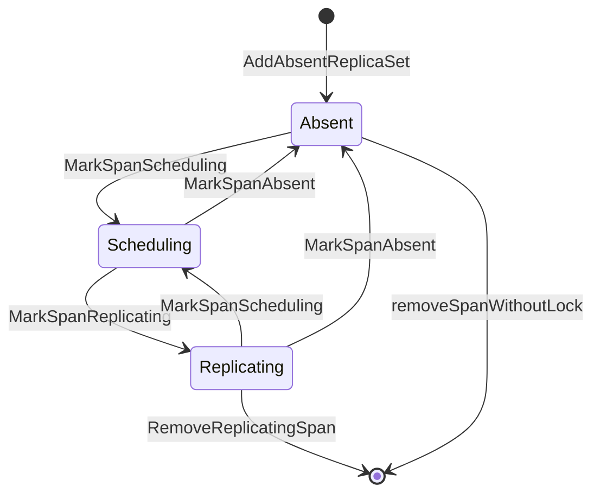
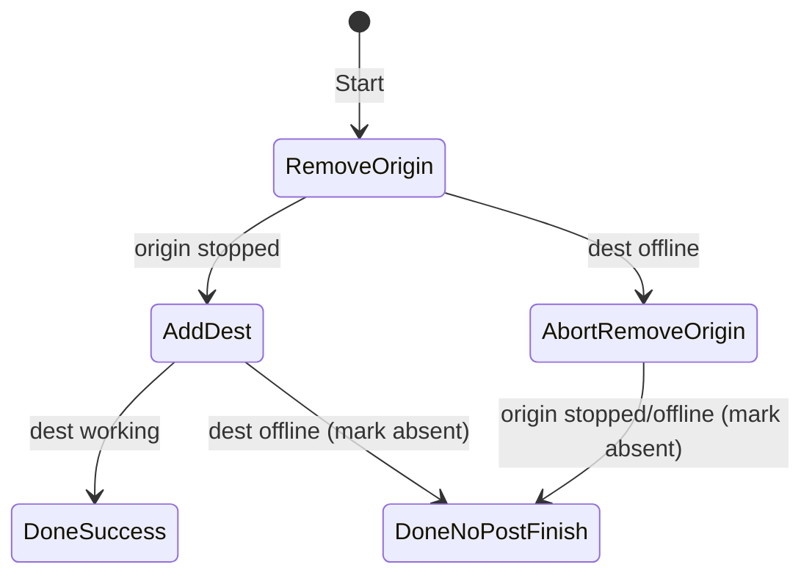
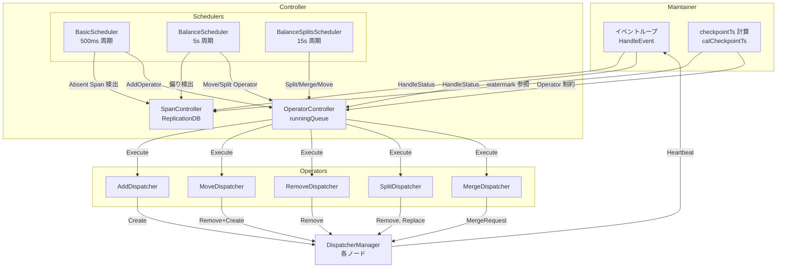

# 第13章 Maintainer とテーブルスケジューリング

> **本章で読むソース**
>
> - [`maintainer/maintainer.go`](https://github.com/pingcap/ticdc/blob/v8.5.6/maintainer/maintainer.go)
> - [`maintainer/maintainer_controller.go`](https://github.com/pingcap/ticdc/blob/v8.5.6/maintainer/maintainer_controller.go)
> - [`maintainer/maintainer_controller_bootstrap.go`](https://github.com/pingcap/ticdc/blob/v8.5.6/maintainer/maintainer_controller_bootstrap.go)
> - [`maintainer/maintainer_event.go`](https://github.com/pingcap/ticdc/blob/v8.5.6/maintainer/maintainer_event.go)
> - [`maintainer/scheduler.go`](https://github.com/pingcap/ticdc/blob/v8.5.6/maintainer/scheduler.go)
> - [`maintainer/replica/replication_span.go`](https://github.com/pingcap/ticdc/blob/v8.5.6/maintainer/replica/replication_span.go)
> - [`maintainer/operator/operator_controller.go`](https://github.com/pingcap/ticdc/blob/v8.5.6/maintainer/operator/operator_controller.go)
> - [`maintainer/operator/operator_add.go`](https://github.com/pingcap/ticdc/blob/v8.5.6/maintainer/operator/operator_add.go)
> - [`maintainer/operator/operator_move.go`](https://github.com/pingcap/ticdc/blob/v8.5.6/maintainer/operator/operator_move.go)
> - [`maintainer/operator/operator_remove.go`](https://github.com/pingcap/ticdc/blob/v8.5.6/maintainer/operator/operator_remove.go)
> - [`maintainer/operator/operator_split.go`](https://github.com/pingcap/ticdc/blob/v8.5.6/maintainer/operator/operator_split.go)
> - [`maintainer/operator/operator_merge.go`](https://github.com/pingcap/ticdc/blob/v8.5.6/maintainer/operator/operator_merge.go)
> - [`maintainer/scheduler/basic.go`](https://github.com/pingcap/ticdc/blob/v8.5.6/maintainer/scheduler/basic.go)
> - [`maintainer/scheduler/balance.go`](https://github.com/pingcap/ticdc/blob/v8.5.6/maintainer/scheduler/balance.go)
> - [`maintainer/scheduler/balance_splits.go`](https://github.com/pingcap/ticdc/blob/v8.5.6/maintainer/scheduler/balance_splits.go)
> - [`maintainer/span/span_controller.go`](https://github.com/pingcap/ticdc/blob/v8.5.6/maintainer/span/span_controller.go)
> - [`maintainer/split/splitter.go`](https://github.com/pingcap/ticdc/blob/v8.5.6/maintainer/split/splitter.go)
> - [`maintainer/split/region_count_splitter.go`](https://github.com/pingcap/ticdc/blob/v8.5.6/maintainer/split/region_count_splitter.go)
> - [`maintainer/range_checker/range_checker.go`](https://github.com/pingcap/ticdc/blob/v8.5.6/maintainer/range_checker/range_checker.go)
> - [`maintainer/range_checker/table_span_range_checker.go`](https://github.com/pingcap/ticdc/blob/v8.5.6/maintainer/range_checker/table_span_range_checker.go)

## この章の狙い

Coordinator がクラスタ全体の Changefeed を管理するのに対し、**Maintainer** は 1 つの Changefeed 内のテーブルスケジューリングを担う。
どのテーブルをどのノードの Dispatcher に割り当てるか、ノード障害時にテーブルを再配置するか、巨大テーブルを Region 単位で分割するかといった判断はすべて Maintainer が下す。

本章では、Maintainer の構造とイベント駆動ループ、テーブルレプリカの状態管理(**SpanReplication**)、スケジューリングの指示を実行する **Operator**、割り当て戦略を決定する3種類の **Scheduler**、そしてテーブル範囲の整合性を検証する **RangeChecker** を読む。

## 前提

Coordinator と Maintainer の起動関係（第12章）、Dispatcher と DispatcherManager の役割（第8章）、MessageCenter によるノード間通信（第3章）を前提とする。
TiKV の Region 概念と、TiCDC における Span（テーブルの Key 範囲の部分区間）の基本を想定する。

## Maintainer の構造とイベント駆動ループ

Maintainer は 1 つの Changefeed に対して 1 インスタンス生成される。
Coordinator が `NewMaintainer` を呼び出して起動し、以後は Maintainer が自律的にテーブルスケジューリングを行う。

コメントに記されたとおり、Maintainer の責務は4つある。

[`maintainer/maintainer.go` L54-L66](https://github.com/pingcap/ticdc/blob/v8.5.6/maintainer/maintainer.go#L54-L66)

```go
// Maintainer is response for handle changefeed replication tasks. Maintainer should:
// 1. schedule tables to dispatcher manager
// 2. calculate changefeed checkpoint ts
// 3. send changefeed status to coordinator
// 4. handle heartbeat reported by dispatcher
//
// There are four threads in maintainer:
// 1. controller thread , handled in dynstream, it handles the main logic of the maintainer, like barrier, heartbeat
// 2. scheduler thread, handled in threadpool, it schedules the tables to dispatcher manager
// 3. operator controller thread, handled in threadpool, it runs the operators
// 4. checker controller, handled in threadpool, it runs the checkers to dynamically adjust the schedule
// all threads are read/write information from/to the ReplicationDB
type Maintainer struct {
```

4つのスレッドがそれぞれ異なる役割を並行に実行し、共有データとして **ReplicationDB**（後述する SpanController が内部に持つ）を読み書きする。

### イベントの種類

Maintainer はイベント駆動で動作する。
イベントは3種類定義されている。

[`maintainer/maintainer_event.go` L22-L35](https://github.com/pingcap/ticdc/blob/v8.5.6/maintainer/maintainer_event.go#L22-L35)

```go
const (
	// EventInit initialize the changefeed maintainer
	EventInit = iota
	// EventMessage is triggered when a grpc message received
	EventMessage
	// EventPeriod is triggered periodically, maintainer handle some task in the loop, like resend messages
	EventPeriod
)

// Event identify the Event that maintainer will handle in event-driven loop
type Event struct {
	changefeedID common.ChangeFeedID
	eventType    int
	message      *messaging.TargetMessage
}
```

**EventInit** は起動時の初期化、**EventMessage** は Dispatcher Manager や Coordinator からのメッセージ受信、**EventPeriod** は 100ms 周期のタイマーで発火する。

### HandleEvent の処理フロー

メインループは `runHandleEvents` が駆動する。
チャネルからのメッセージとタイマーの2系統を `select` で待ち受け、いずれも `HandleEvent` に委譲する。

[`maintainer/maintainer.go` L1143-L1160](https://github.com/pingcap/ticdc/blob/v8.5.6/maintainer/maintainer.go#L1143-L1160)

```go
func (m *Maintainer) runHandleEvents(ctx context.Context) {
	ticker := time.NewTicker(periodEventInterval)
	defer ticker.Stop()

	for {
		select {
		case <-ctx.Done():
			return
		case event := <-m.eventCh.Out():
			m.HandleEvent(event)
		case <-ticker.C:
			m.HandleEvent(&Event{
				changefeedID: m.changefeedID,
				eventType:    EventPeriod,
			})
		}
	}
}
```

`HandleEvent` はまずノード変更を確認してから、イベント種別に応じて処理を分岐する。

[`maintainer/maintainer.go` L336-L344](https://github.com/pingcap/ticdc/blob/v8.5.6/maintainer/maintainer.go#L336-L344)

```go
	switch event.eventType {
	case EventInit:
		return m.onInit()
	case EventMessage:
		m.onMessage(event.message)
	case EventPeriod:
		m.onPeriodTask()
	}
```

`onMessage` は受信メッセージの型で分岐し、ハートビート処理、バリアイベント処理、ブートストラップ応答処理、Maintainer 削除要求処理などを呼び分ける。

## Controller: スケジューリングの中核

Maintainer のスケジューリングロジックは **Controller** に集約されている。
Controller は3つの主要コンポーネントを保持する。

[`maintainer/maintainer_controller.go` L41-L73](https://github.com/pingcap/ticdc/blob/v8.5.6/maintainer/maintainer_controller.go#L41-L73)

```go
// Controller schedules and balance tables
// there are 3 main components in the controller, scheduler, span controller and operator controller
type Controller struct {
	bootstrapped bool
	startTs      uint64

	schedulerController    *scheduler.Controller
	operatorController     *operator.Controller
	redoOperatorController *operator.Controller
	spanController         *span.Controller
	redoSpanController     *span.Controller
	barrier                *Barrier
	redoBarrier            *Barrier
	// ... (中略) ...
}
```

- **SpanController**: テーブル Span のライフサイクル管理と状態遷移を司る ReplicationDB
- **OperatorController**: 実際のスケジューリング指示（追加、移動、削除、分割、マージ）を Operator として管理し、スレッドプールで実行する
- **SchedulerController**: BasicScheduler、BalanceScheduler、BalanceSplitsScheduler の3種のスケジューラを統合し、スレッドプールで周期実行する

この3層構造により、「何をスケジュールすべきか」（Scheduler が判断）、「どう実行するか」（Operator が手順を定義）、「状態をどう管理するか」（SpanController が追跡）が分離されている。

## SpanReplication: テーブルレプリカの状態管理

テーブル Span の複製状態は **SpanReplication** 構造体で管理される。

[`maintainer/replica/replication_span.go` L35-L50](https://github.com/pingcap/ticdc/blob/v8.5.6/maintainer/replica/replication_span.go#L35-L50)

```go
type SpanReplication struct {
	ID           common.DispatcherID
	Span         *heartbeatpb.TableSpan
	ChangefeedID common.ChangeFeedID
	enabledSplit bool

	schemaID    int64
	nodeIDMutex sync.Mutex
	nodeID      node.ID
	groupID     replica.GroupID
	status      *atomic.Pointer[heartbeatpb.TableSpanStatus]
	blockState  *atomic.Pointer[heartbeatpb.State]
}
```

各フィールドの役割は次のとおりである。

- **ID**: Dispatcher を一意に識別する DispatcherID
- **Span**: テーブルの Key 範囲（TableID、StartKey、EndKey）
- **nodeID**: 現在この Span を担当しているノード（未割り当て時は空文字列）
- **groupID**: 同一テーブルを分割した Span 群を束ねるグループ ID。分割されていないテーブルは DefaultGroupID を使う
- **status**: Dispatcher から報告される最新のステータス（checkpointTs、ComponentState）
- **blockState**: DDL バリアや SyncPoint バリアへの参加状態

### 状態遷移

SpanReplication は SpanController 内で3つのカテゴリに分類される。
状態遷移は SpanController のメソッドを通じて行われる。



- **Absent**: まだどのノードにも割り当てられていない状態。新規テーブルの追加やノード障害後の再スケジュール時にこの状態になる
- **Scheduling**: Operator により割り当て処理が進行中の状態。BindSpanToNode でノードが設定される
- **Replicating**: Dispatcher が Working を報告し、正常にレプリケーションが動作している状態

SpanController はこの3状態を `ReplicationDB` インターフェイスで管理し、Dispatcher ID、テーブル ID、スキーマ ID の3次元でインデックスを持つ。

[`maintainer/span/span_controller.go` L52-L81](https://github.com/pingcap/ticdc/blob/v8.5.6/maintainer/span/span_controller.go#L52-L81)

```go
type Controller struct {
	changefeedID common.ChangeFeedID
	ddlSpan *replica.SpanReplication

	mu sync.RWMutex
	pkgreplica.ReplicationDB[common.DispatcherID, *replica.SpanReplication]
	allTasks    map[common.DispatcherID]*replica.SpanReplication
	schemaTasks map[int64]map[common.DispatcherID]*replica.SpanReplication
	tableTasks  map[int64]map[common.DispatcherID]*replica.SpanReplication
	// ... (中略) ...
}
```

## Operator によるスケジューリング指示の実行

Scheduler が「この Span をこのノードに割り当てる」と判断したあと、実際の割り当て手順を表現するのが **Operator** である。
TiCDC の Maintainer には5種類の Operator がある。

### AddDispatcherOperator

Absent 状態の Span をノードに割り当て、Dispatcher を新規作成する。

[`maintainer/operator/operator_add.go` L37-L61](https://github.com/pingcap/ticdc/blob/v8.5.6/maintainer/operator/operator_add.go#L37-L61)

```go
// AddDispatcherOperator is an operator to schedule a table span to a dispatcher
//
// State transitions:
//   - Start(): bind the span to dest and move it to scheduling.
//   - Check(dest, Working): finish successfully and PostFinish marks the span replicating.
//   - Check(dest, Removed) / OnNodeRemove(dest) / OnTaskRemoved(): finish as removed and PostFinish
//     marks the span absent (if it still exists in spanController) for rescheduling.
type AddDispatcherOperator struct {
	replicaSet *replica.SpanReplication
	dest       node.ID
	finished   atomic.Bool
	removed        atomic.Bool
	spanController *span.Controller
	operatorType heartbeatpb.OperatorType
	sendThrottler sendThrottler
}
```

`Start()` で Span をノードにバインドして Scheduling 状態に遷移させ、`Schedule()` で ScheduleDispatcherRequest(Create) メッセージを送信する。
対象ノードの Dispatcher が Working を報告すると `Check` が成功を記録し、`PostFinish` が Replicating に遷移させる。

[`maintainer/operator/operator_add.go` L147-L158](https://github.com/pingcap/ticdc/blob/v8.5.6/maintainer/operator/operator_add.go#L147-L158)

```go
func (m *AddDispatcherOperator) PostFinish() {
	if !m.removed.Load() {
		m.spanController.MarkSpanReplicating(m.replicaSet)
	} else {
		if m.spanController.GetTaskByID(m.replicaSet.ID) != nil {
			m.spanController.MarkSpanAbsent(m.replicaSet)
		}
	}
}
```

ノード障害やタスク削除で `removed` フラグが立った場合は、Span を Absent に戻して再スケジュールに委ねる。

### MoveDispatcherOperator

Replicating 状態の Span を別のノードに移動する。
2フェーズで動作し、移動元で Dispatcher を停止してから移動先で新しい Dispatcher を作成する。

[`maintainer/operator/operator_move.go` L32-L51](https://github.com/pingcap/ticdc/blob/v8.5.6/maintainer/operator/operator_move.go#L32-L51)

```go
const (
	moveStateRemoveOrigin moveState = iota
	moveStateAddDest
	moveStateAbortRemoveOrigin
	moveStateDoneSuccess
	moveStateDoneNoPostFinish
)
```

状態遷移は次のとおりである。



移動先ノードが途中でオフラインになった場合は、移動元の Dispatcher 停止を確認してから Span を Absent に戻す。
移動元がまだ動いている状態で Span を Absent にすると、BasicScheduler が新たな Dispatcher を作成してしまい、同一テーブルに2つの Dispatcher が存在する二重書き込みが発生しうるためである。

[`maintainer/operator/operator_move.go` L176-L195](https://github.com/pingcap/ticdc/blob/v8.5.6/maintainer/operator/operator_move.go#L176-L195)

```go
	if n == m.dest {
		log.Info("dest node is offline, abort move and reschedule span",
			zap.String("dest", m.dest.String()),
			// ... (中略) ...
		switch m.state {
		case moveStateAddDest:
			m.finishAsAbsent()
		case moveStateRemoveOrigin:
			m.state = moveStateAbortRemoveOrigin
		}
		return
	}
```

### removeDispatcherOperator

Span をノードから削除する。
DDL による DROP TABLE やテーブル移動の前段階で使用される。

[`maintainer/operator/operator_remove.go` L91-L104](https://github.com/pingcap/ticdc/blob/v8.5.6/maintainer/operator/operator_remove.go#L91-L104)

```go
func (m *removeDispatcherOperator) Check(from node.ID, status *heartbeatpb.TableSpanStatus) {
	if !m.finished.Load() &&
		from == m.nodeID &&
		(status.ComponentStatus == heartbeatpb.ComponentState_Stopped ||
			status.ComponentStatus == heartbeatpb.ComponentState_Removed) {
		m.replicaSet.UpdateStatus(status)
		log.Info("dispatcher report non-working status",
			zap.String("replicaSet", m.replicaSet.ID.String()))
		m.finished.Store(true)
	}
}
```

Stopped か Removed のみを終了条件とし、Merge 中の WaitingMerge などの中間状態では完了を判定しない。

### SplitDispatcherOperator

1つの大きな Span を複数の Span に分割する。
既存の Dispatcher を停止してから、`SpanController.ReplaceReplicaSet` で旧 Span を削除し新 Span 群を登録する。

[`maintainer/operator/operator_split.go` L163-L184](https://github.com/pingcap/ticdc/blob/v8.5.6/maintainer/operator/operator_split.go#L163-L184)

```go
func (m *SplitDispatcherOperator) PostFinish() {
	// ... (中略) ...
	if m.removed.Load() {
		m.spanController.MarkSpanAbsent(m.replicaSet)
		return
	}

	newReplicaSets, replicasInScheduling := m.spanController.ReplaceReplicaSet(
		[]*replica.SpanReplication{m.replicaSet},
		m.splitSpans,
		m.checkpointTs,
		m.splitTargetNodes,
	)

	if m.postFinish != nil && replicasInScheduling {
		for idx, span := range newReplicaSets {
			ret := m.postFinish(span, m.splitTargetNodes[idx])
			// ... (中略) ...
		}
	}
	// ... (中略) ...
}
```

分割後の新 Span は、ターゲットノードが指定されていれば Scheduling 状態で登録され、そうでなければ Absent 状態で登録されて BasicScheduler に委ねられる。

### MergeDispatcherOperator

同一ノード上の連続した Span 群を1つの Span に統合する。
対象の各 Span に OccupyDispatcherOperator を設定して他の Scheduler による操作をブロックしたうえで、MergeDispatcherRequest を送信する。

[`maintainer/operator/operator_merge.go` L100-L151](https://github.com/pingcap/ticdc/blob/v8.5.6/maintainer/operator/operator_merge.go#L100-L151)

```go
func NewMergeDispatcherOperator(
	spanController *span.Controller,
	toMergedReplicaSets []*replica.SpanReplication,
	occupyOperators []operator.Operator[common.DispatcherID, *heartbeatpb.TableSpanStatus],
) *MergeDispatcherOperator {
	// ... (中略) ...
	mergeTableSpan := &heartbeatpb.TableSpan{
		TableID:    toMergedSpans[0].TableID,
		StartKey:   toMergedSpans[0].StartKey,
		EndKey:     toMergedSpans[len(toMergedSpans)-1].EndKey,
		KeyspaceID: spanController.GetkeyspaceID(),
	}

	checkpointTs := minCheckpointTs(toMergedReplicaSets)

	newReplicaSet := replica.NewSpanReplication(
		toMergedReplicaSets[0].ChangefeedID,
		newDispatcherID,
		toMergedReplicaSets[0].GetSchemaID(),
		mergeTableSpan,
		checkpointTs,
		toMergedReplicaSets[0].GetMode(),
		toMergedReplicaSets[0].IsSplitEnabled())

	spanController.AddSchedulingReplicaSet(newReplicaSet, nodeID)
	// ... (中略) ...
}
```

統合先 Span の checkpointTs は、統合元 Span 群の最小値を採用する。
これにより、統合後に取りこぼしが発生しない。

### OperatorController による実行管理

Operator はヒープベースの優先度キュー（`runningQueue`）で管理され、スレッドプールから周期的にポーリングされる。

[`maintainer/operator/operator_controller.go` L87-L113](https://github.com/pingcap/ticdc/blob/v8.5.6/maintainer/operator/operator_controller.go#L87-L113)

```go
func (oc *Controller) Execute() time.Time {
	executedCounter := 0
	for {
		op, next := oc.pollQueueingOperator()
		if !next {
			return time.Now().Add(emptyPollInterval)
		}
		if op == nil {
			continue
		}

		msg := op.Schedule()

		if msg != nil {
			_ = oc.messageCenter.SendCommand(msg)
			// ... (中略) ...
		}
		executedCounter++
		if executedCounter >= oc.batchSize {
			return time.Now().Add(nextPollInterval)
		}
	}
}
```

1回の `Execute` でバッチサイズ（`batchSize`）分の Operator を処理し、超過した場合は 50ms 後に再実行する。
キューが空の場合は 200ms 後に再実行する。
Operator が完了すると `finalizeOperator` が呼ばれ、`PostFinish` でスケジューリング状態を確定させる。

## 3種類のスケジューラ

Maintainer は3種類のスケジューラを組み合わせてテーブル配置を決定する。

[`maintainer/scheduler.go` L28-L64](https://github.com/pingcap/ticdc/blob/v8.5.6/maintainer/scheduler.go#L28-L64)

```go
func NewScheduleController(changefeedID common.ChangeFeedID,
	// ... (中略) ...
) *pkgscheduler.Controller {
	schedulers := map[string]pkgscheduler.Scheduler{
		pkgscheduler.BasicScheduler: scheduler.NewBasicScheduler(
			// ... (中略) ...
		),
		pkgscheduler.BalanceScheduler: scheduler.NewBalanceScheduler(
			// ... (中略) ...
		),
	}
	if splitter != nil {
		schedulers[pkgscheduler.BalanceSplitScheduler] = scheduler.NewBalanceSplitsScheduler(
			// ... (中略) ...
		)
	}
	// ... (中略) ...
}
```

### BasicScheduler: 未割り当て Span の配置

Absent 状態の Span をノードに割り当てる、最も基本的なスケジューラである。

[`maintainer/scheduler/basic.go` L49-L59](https://github.com/pingcap/ticdc/blob/v8.5.6/maintainer/scheduler/basic.go#L49-L59)

```go
type basicScheduler struct {
	changefeedID common.ChangeFeedID
	batchSize    int
	schedulingTaskCountPerNode int

	operatorController *operator.Controller
	spanController     *span.Controller
	nodeManager        *watcher.NodeManager
	mode               int64
}
```

500ms 周期で実行され、Absent な Span を検出して AddDispatcherOperator を生成する。
グループ単位の割り当てでは、分割テーブル Span（DefaultGroupID 以外）を先に処理し、残りの容量で通常の Span を割り当てる。

[`maintainer/scheduler/basic.go` L103-L118](https://github.com/pingcap/ticdc/blob/v8.5.6/maintainer/scheduler/basic.go#L103-L118)

```go
	// deal with the split table spans first
	for _, id := range s.spanController.GetGroups() {
		if id == pkgreplica.DefaultGroupID {
			continue
		}
		availableSize -= s.schedule(id, availableSize)
		if availableSize <= 0 {
			break
		}
	}

	if availableSize > 0 {
		// still have available size, deal with the normal spans
		s.schedule(pkgreplica.DefaultGroupID, availableSize)
	}
```

各ノードの現在のスケジューリング数を考慮して割り当て先を選ぶため、インクリメンタルスキャンの負荷がノード間で均等になる。

### BalanceScheduler: 分割とノード間均衡

Replicating 状態が安定しているとき（Operator が0件かつ Absent が0件）に動作し、2つの操作を行う。

[`maintainer/scheduler/balance.go` L73-L98](https://github.com/pingcap/ticdc/blob/v8.5.6/maintainer/scheduler/balance.go#L73-L98)

```go
func (s *balanceScheduler) Execute() time.Time {
	// ... (中略) ...
	if s.operatorController.OperatorSize() > 0 || s.spanController.GetAbsentSize() > 0 {
		return time.Now().Add(time.Second * 5)
	}

	// 1. check whether we have spans in defaultGroupID need to be splitted.
	checkResults := s.spanController.CheckByGroup(pkgReplica.DefaultGroupID, s.batchSize)
	count := s.doSplit(checkResults)

	if count >= s.batchSize {
		return time.Now().Add(time.Second * 5)
	}

	// 2. do balance for the spans in defaultGroupID
	s.schedulerDefaultGroup(s.batchSize - count)

	return time.Now().Add(time.Second * 5)
}
```

1. DefaultGroupID の Span に対し、Region 数がしきい値を超えていれば SplitDispatcherOperator を生成する
2. ノード間の Span 数に偏りがあれば、MoveDispatcherOperator で再配置する

5秒周期で実行され、安定状態でなければスキップする。

### BalanceSplitsScheduler: 分割テーブルの動的管理

分割済みテーブル（DefaultGroupID 以外のグループ）を対象に、より高度な5段階の判定を行う。

[`maintainer/scheduler/balance_splits.go` L77-L151](https://github.com/pingcap/ticdc/blob/v8.5.6/maintainer/scheduler/balance_splits.go#L77-L151)

```go
func (s *balanceSplitsScheduler) Execute() time.Time {
	if s.operatorController.OperatorSize() > 0 || s.spanController.GetAbsentSize() > 0 {
		return time.Now().Add(time.Second * 15)
	}
	// ... (中略) ...
	for _, group := range s.spanController.GetGroups() {
		if group == pkgReplica.DefaultGroupID {
			continue
		}
		// ... check and split/move/merge ...
	}
	return time.Now().Add(15 * time.Second)
}
```

判定の5段階は次のとおりである。

1. Region 数やトラフィックが上限を超える Span があれば分割する
2. 全 Span の合計 Region 数とトラフィックが下限に収まり、ラグも小さければ、全 Span を1つに統合する
3. ノード間のトラフィック偏差が大きければ、移動または分割して均す
4. 同一ノード上の隣接 Span でラグが小さく、統合後の Region 数やトラフィックが上限以内なら統合する
5. Dispatcher 数が適正範囲外であれば、統合可能な配置になるよう移動する

15秒周期で実行され、各グループの全 Span が Replicating であるときのみ動作する。

## スケジューリングフロー全体像

以下の図は、Maintainer のスケジューリングフロー全体を示す。



## テーブル分割: Splitter

巨大テーブルを Region 境界で分割するのが **Splitter** である。

[`maintainer/split/splitter.go` L60-L70](https://github.com/pingcap/ticdc/blob/v8.5.6/maintainer/split/splitter.go#L60-L70)

```go
func (s *Splitter) Split(ctx context.Context,
	span *heartbeatpb.TableSpan, spansNum int, splitType SplitType,
) []*heartbeatpb.TableSpan {
	switch splitType {
	case SplitTypeWriteBytes:
		return s.writeBytesSplitter.split(ctx, span, spansNum)
	case SplitTypeRegionCount:
		return s.regionCounterSplitter.split(ctx, span, spansNum)
	}
	return nil
}
```

分割方式は2種類ある。

- **SplitTypeRegionCount**: Region 数に基づく分割。Region 数が5000未満のテーブルには SplitTypeWriteBytes が選択される[^split-threshold]
- **SplitTypeWriteBytes**: 書き込みバイト数に基づく分割。ホットスポットの検出に適する

[^split-threshold]: `GetSplitType` 関数（`maintainer/split/splitter.go` L81-L86）がしきい値 `MaxRegionCountForWriteBytesSplit = 5000` で判定する。

Region 数分割の実装では、`regionCountPerSpan`（設定値）をもとに Region 数を均等に分割する `evenlySplitStepper` を使う。

[`maintainer/split/region_count_splitter.go` L152-L193](https://github.com/pingcap/ticdc/blob/v8.5.6/maintainer/split/region_count_splitter.go#L152-L193)

```go
type evenlySplitStepper struct {
	spanCount     int
	regionPerSpan int
	remain        int
}

func newEvenlySplitStepper(totalRegion int, maxRegionPerSpan int, spansNum int) evenlySplitStepper {
	if spansNum > 0 {
		return evenlySplitStepper{
			regionPerSpan: totalRegion / spansNum,
			spanCount:     spansNum,
			remain:        totalRegion % spansNum,
		}
	}
	// ... (中略) ...
}
```

`remain` が示すのは、均等割り付けの余り Region を先頭の Span に1つずつ追加する回数である。
全 Span の Region 数差は最大1に抑えられる。

## RangeChecker: Span 範囲の整合性検証

テーブルの全 Key 範囲が Span 群でもれなくカバーされているかを検証するのが **RangeChecker** である。

[`maintainer/range_checker/range_checker.go` L17-L28](https://github.com/pingcap/ticdc/blob/v8.5.6/maintainer/range_checker/range_checker.go#L17-L28)

```go
type RangeChecker interface {
	AddSubRange(tableID int64, start, end []byte)
	IsFullyCovered() bool
	Reset()
	Detail() string
	MarkCovered()
}
```

実装は3種類ある。

- **TableSpanRangeChecker**: テーブルごとに BTree ベースの `SpanCoverageChecker` を持ち、報告された Span を挿入してギャップの有無を検査する
- **TableIDRangeChecker**: テーブル ID の集合として管理し、全テーブルが報告されたかを確認する
- **BoolRangeChecker**: 固定値を返す単純な実装。テーブル分割が無効な場合に使用する

`SpanCoverageChecker` は BTree にサブレンジを挿入するとき、隣接または重複するノードを検出してマージする。
最終的にツリー内のノードが1つで、そのノードの `[start, end)` がテーブル全体と一致すれば、カバレッジは完全である。

[`maintainer/range_checker/table_span_range_checker.go` L159-L182](https://github.com/pingcap/ticdc/blob/v8.5.6/maintainer/range_checker/table_span_range_checker.go#L159-L182)

```go
func (rc *SpanCoverageChecker) IsFullyCovered() bool {
	if rc.covered.Load() {
		return true
	}
	if rc.tree.Len() == 0 {
		return false
	}

	currentStart := rc.start
	rc.tree.Ascend(func(node *RangeNode) bool {
		if bytes.Compare(currentStart, node.start) < 0 {
			return false
		}
		currentStart = node.end
		return bytes.Compare(currentStart, rc.end) < 0
	})

	return bytes.Equal(currentStart, rc.end)
}
```

BTree を先頭から走査し、前のノードの `end` が次のノードの `start` 以上であれば連続とみなす。
走査終了時に `currentStart` がテーブル末尾に一致すれば、全範囲がカバーされている。

## checkpointTs の安全な前進: レースコンディションの防止

Maintainer は Changefeed の checkpointTs を計算し、Coordinator に報告する。
この計算は `calCheckpointTs` ゴルーチンが 100ms 周期で実行する。

checkpointTs を安全に前進させるには、Operator の制約とハートビートの制約の双方を考慮しなければならない。
ここに、DDL による新規 Dispatcher 追加とハートビートの到着順序に起因するレースコンディションが存在する。

[`maintainer/maintainer.go` L669-L687](https://github.com/pingcap/ticdc/blob/v8.5.6/maintainer/maintainer.go#L669-L687)

```go
// Race Condition Problem:
// 1. DDL creates operator_add for new dispatcher (startTs=150)
// 2. Old heartbeat (calculated before dispatcher creation) sent with checkpointTs=200
// 3. New heartbeat (with new dispatcher status) sent with checkpointTs=200
// 4. onHeartBeatRequest processes old heartbeat first -> updates checkpointTsByCapture to 200
// 5. onHeartBeatRequest processes new heartbeat -> operator_add completes -> no longer blocks
// 6. calCheckpointTs uses checkpointTsByCapture=200 but operator no longer blocks
// 7. RESULT: checkpointTs advances to 200 > newDispatcherStartTs=150 -> DATA LOSS on crash
```

解決策は2段階の原子的な更新である。

1. `onHeartbeatRequest` で checkpointTsByCapture を更新してから Operator のステータスを処理する（Part 1）
2. `calculateNewCheckpointTs` で Operator の制約を先に計算してからハートビートの制約を適用する（Part 2）

[`maintainer/maintainer.go` L689-L731](https://github.com/pingcap/ticdc/blob/v8.5.6/maintainer/maintainer.go#L689-L731)

```go
func (m *Maintainer) calculateNewCheckpointTs() (*heartbeatpb.Watermark, bool) {
	// Step 1: Get current operator and barrier constraints first
	newWatermark := heartbeatpb.NewMaxWatermark()
	minCheckpointTsForScheduler := m.controller.GetMinCheckpointTs(newWatermark.CheckpointTs)
	minCheckpointTsForBarrier := m.controller.barrier.GetMinBlockedCheckpointTsForNewTables(newWatermark.CheckpointTs)

	// Step 2: Apply heartbeat constraints from all nodes
	updateCheckpointTs := true
	for _, id := range m.bootstrapper.GetAllNodeIDs() {
		if id != m.selfNode.ID && m.controller.spanController.GetTaskSizeByNodeID(id) <= 0 {
			continue
		}
		watermark, ok := m.checkpointTsByCapture.Get(id)
		if !ok {
			updateCheckpointTs = false
			// ... (中略) ...
			continue
		}
		newWatermark.UpdateMin(watermark)
	}
	// ... (中略) ...
	newWatermark.UpdateMin(heartbeatpb.Watermark{CheckpointTs: minCheckpointTsForBarrier, ResolvedTs: minCheckpointTsForBarrier})
	newWatermark.UpdateMin(heartbeatpb.Watermark{CheckpointTs: minCheckpointTsForScheduler, ResolvedTs: minCheckpointTsForScheduler})
	// ... (中略) ...
	return newWatermark, true
}
```

Operator 制約を先に取得することで、ハートビートの値がどのタイミングで更新されても、新規 Dispatcher の startTs より先に checkpointTs が進むことはない。

## 最適化の工夫: ノード単位のスケジューリング流量制御

BasicScheduler は、ノードごとのグループ別スケジューリング数を追跡し、同時にスケジューリング状態にある Span 数を制限する。

[`maintainer/scheduler/basic.go` L121-L162](https://github.com/pingcap/ticdc/blob/v8.5.6/maintainer/scheduler/basic.go#L121-L162)

```go
func (s *basicScheduler) schedule(groupID pkgreplica.GroupID, availableSize int) int {
	scheduleNodeSize := s.spanController.GetScheduleTaskSizePerNodeByGroup(groupID)
	// ... (中略) ...
	size := 0
	nodeIDs := s.nodeManager.GetAliveNodeIDs()
	nodeSize := make(map[node.ID]int)
	for _, id := range nodeIDs {
		nodeSize[id] = scheduleNodeSize[id]

		if groupID != pkgreplica.DefaultGroupID {
			num := s.schedulingTaskCountPerNode - nodeSize[id]
			if num >= 0 {
				size += num
			}
			// ... (中略) ...
		}
	}
	// ... (中略) ...
	absentReplications := s.spanController.GetAbsentByGroup(groupID, availableSize)

	pkgScheduler.BasicSchedule(availableSize, absentReplications, nodeSize, func(replication *replica.SpanReplication, id node.ID) bool {
		return s.operatorController.AddOperator(operator.NewAddDispatcherOperator(s.spanController, replication, id, heartbeatpb.OperatorType_O_Add))
	})
	return len(absentReplications)
}
```

分割テーブルの Span 群は、各ノードに `schedulingTaskCountPerNode`（デフォルト1）の上限でスケジューリングされる。
この制御がない場合、数百の Span が一斉に同一ノードへスケジューリングされ、インクリメンタルスキャンの負荷が集中する。
ノードごとの同時スケジューリング数を制限することで、スキャン負荷がクラスタ全体に分散される。
全テーブルのスケジューリングが完了するまでの時間は増加するが、各ノードのリソース消費が平準化されるため、レプリケーション遅延のスパイクを抑制できる。

## まとめ

Maintainer は Changefeed 内のテーブルスケジューリングを、3層の分離された構造で実現する。

- **SpanController** がテーブル Span の状態（Absent、Scheduling、Replicating）を管理する
- **Scheduler** が状態を観察し、配置変更の意思決定を行う。BasicScheduler は未割り当ての即時配置、BalanceScheduler はノード間均衡と初期分割、BalanceSplitsScheduler は分割テーブルの動的な分割/統合/移動を担う
- **Operator** がスケジューリング指示の実行手順をカプセル化し、2フェーズの状態遷移（Scheduling から Replicating へ）で安全にテーブルを配置する

checkpointTs の前進に際しては、Operator の制約を先に計算してからハートビートの値を適用する2段階の手順により、DDL 起因のレースコンディションを防止する。
テーブル分割では、Region 数に基づく均等分割と書き込みバイト数に基づくホットスポット分割の2方式を使い分け、RangeChecker が Key 範囲のカバレッジを保証する。

## 関連する章

- 第12章: Coordinator と Changefeed 管理（Maintainer の起動元）
- 第8章: Dispatcher と EventCollector（Maintainer がスケジューリングする対象）
- 第14章: Barrier と DDL 処理（DDL に伴うテーブルの追加/削除の契機）
