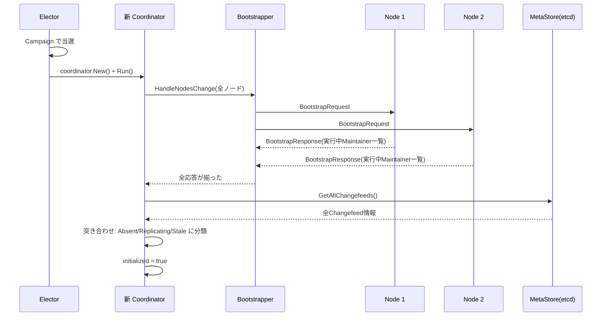
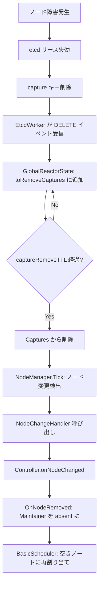

# 第14章 高可用性とフェイルオーバー

> **本章で読むソース**
>
> - [`server/module_election.go`](https://github.com/pingcap/ticdc/blob/v8.5.6/server/module_election.go)
> - [`server/watcher/module_node_manager.go`](https://github.com/pingcap/ticdc/blob/v8.5.6/server/watcher/module_node_manager.go)
> - [`server/watcher/etcd_watcher.go`](https://github.com/pingcap/ticdc/blob/v8.5.6/server/watcher/etcd_watcher.go)
> - [`server/server.go`](https://github.com/pingcap/ticdc/blob/v8.5.6/server/server.go)
> - [`server/server_prepare.go`](https://github.com/pingcap/ticdc/blob/v8.5.6/server/server_prepare.go)
> - [`pkg/etcd/etcd.go`](https://github.com/pingcap/ticdc/blob/v8.5.6/pkg/etcd/etcd.go)
> - [`pkg/orchestrator/etcd_worker.go`](https://github.com/pingcap/ticdc/blob/v8.5.6/pkg/orchestrator/etcd_worker.go)
> - [`pkg/orchestrator/reactor_state.go`](https://github.com/pingcap/ticdc/blob/v8.5.6/pkg/orchestrator/reactor_state.go)
> - [`pkg/bootstrap/bootstrap.go`](https://github.com/pingcap/ticdc/blob/v8.5.6/pkg/bootstrap/bootstrap.go)
> - [`coordinator/coordinator.go`](https://github.com/pingcap/ticdc/blob/v8.5.6/coordinator/coordinator.go)
> - [`coordinator/controller.go`](https://github.com/pingcap/ticdc/blob/v8.5.6/coordinator/controller.go)
> - [`coordinator/operator/operator_controller.go`](https://github.com/pingcap/ticdc/blob/v8.5.6/coordinator/operator/operator_controller.go)

## この章の狙い

TiCDC クラスタは複数ノードで構成され、任意のノードが障害を起こしても変更データの複製が中断しないよう設計されている。
本章では、その高可用性を支える4つの機構を読む。

1. etcd ベースのリーダー選出（`elector`）
2. ノードのディスカバリと障害検出（`NodeManager`）
3. Coordinator のフェイルオーバーとブートストラップ
4. グレースフルシャットダウン

## 前提

- [第2章 サーバーアーキテクチャ](../part00-overview/02-server-architecture.md)のモジュール起動順序を理解していること。
- [第12章 Coordinator と Changefeed 管理](../part03-scheduling/12-coordinator.md)で Coordinator と Controller の役割分担を理解していること。

## 14.1 etcd セッションとリース

TiCDC のノード管理は etcd のリース（Lease）を基盤とする。
各ノードは起動時に etcd リースを取得し、そのリースに紐づく `concurrency.Session` を作成する。

[`server/server_prepare.go` L212-L223](https://github.com/pingcap/ticdc/blob/v8.5.6/server/server_prepare.go#L212-L223)

```go
func (c *server) newEtcdSession(ctx context.Context) (*concurrency.Session, error) {
	cfg := config.GetGlobalServerConfig()
	lease, err := c.EtcdClient.GetEtcdClient().Grant(ctx, int64(cfg.CaptureSessionTTL))
	if err != nil {
		return nil, errors.Trace(err)
	}
	sess, err := c.EtcdClient.GetEtcdClient().NewSession(concurrency.WithLease(lease.ID))
	if err != nil {
		return nil, errors.Trace(err)
	}
	return sess, nil
}
```

`CaptureSessionTTL`（デフォルト10秒）の間にリースを更新できなければ、etcd がそのノードの登録情報を自動的に削除する。
この仕組みにより、プロセスがクラッシュしても最大 TTL 秒後に障害が検出される。

ノードの情報は、リース付きで etcd に書き込まれる。

[`server/server_prepare.go` L195-L210](https://github.com/pingcap/ticdc/blob/v8.5.6/server/server_prepare.go#L195-L210)

```go
func (c *server) registerNodeToEtcd(ctx context.Context) error {
	cInfo := &config.CaptureInfo{
		ID:             config.CaptureID(c.info.ID),
		AdvertiseAddr:  c.info.AdvertiseAddr,
		Version:        c.info.Version,
		GitHash:        c.info.GitHash,
		DeployPath:     c.info.DeployPath,
		StartTimestamp: c.info.StartTimestamp,
		IsNewArch:      true,
	}
	err := c.EtcdClient.PutCaptureInfo(ctx, cInfo, c.session.Lease())
	if err != nil {
		return errors.WrapError(errors.ErrCaptureRegister, err)
	}
	return nil
}
```

リース付きで `PutCaptureInfo` を呼ぶため、ノードがダウンしてリースが失効すると、対応する capture キーが etcd から消える。

## 14.2 リーダー選出（Elector）

TiCDC クラスタでは1台のノードだけが **Coordinator** の役割を担う。
どのノードが Coordinator になるかは、etcd の `concurrency.Election` を使った選出で決まる。

### 14.2.1 Elector の構造

**Elector**（`elector` 構造体）は Coordinator 用と Log Coordinator 用の2つの `Election` を保持する。

[`server/module_election.go` L37-L55](https://github.com/pingcap/ticdc/blob/v8.5.6/server/module_election.go#L37-L55)

```go
type elector struct {
	// election used for coordinator
	election *concurrency.Election
	// election used for log coordinator
	logElection *concurrency.Election
	svr         *server
}

func NewElector(server *server) common.SubModule {
	election := concurrency.NewElection(server.session,
		etcd.CaptureOwnerKey(server.EtcdClient.GetClusterID()))
	logElection := concurrency.NewElection(server.session,
		etcd.LogCoordinatorKey(server.EtcdClient.GetClusterID()))
	return &elector{
		election:    election,
		logElection: logElection,
		svr:         server,
	}
}
```

`CaptureOwnerKey` は `/<clusterID>/__cdc_meta__/owner` というパスを返す。
すべてのノードが同じパスに対して `Campaign` を呼ぶことで、etcd が1台だけを当選させる。

### 14.2.2 選出ループ

`campaignCoordinator` は無限ループで選出を試みる。
当選すると Coordinator インスタンスを生成して `Run` し、退任すると `resign` してから再度選出に参加する。

[`server/module_election.go` L68-L92](https://github.com/pingcap/ticdc/blob/v8.5.6/server/module_election.go#L68-L92)

```go
func (e *elector) campaignCoordinator(ctx context.Context) error {
	// Limit the frequency of elections to avoid putting too much pressure on the etcd server
	rl := rate.NewLimiter(rate.Every(time.Second), 1 /* burst */)
	nodeID := string(e.svr.info.ID)
	for {
		select {
		case <-ctx.Done():
			return nil
		default:
		}
		err := rl.Wait(ctx)
		if err != nil {
			// ... (中略) ...
			return errors.Trace(err)
		}
		// Before campaign check liveness
		if e.svr.liveness.Load() == api.LivenessCaptureStopping {
			log.Info("do not campaign coordinator, liveness is stopping", zap.String("nodeID", nodeID))
			return nil
		}
		log.Info("start to campaign coordinator", zap.String("nodeID", nodeID))
		// Campaign to be the coordinator, it blocks until it been elected.
		err = e.election.Campaign(ctx, nodeID)
```

選出前後の2箇所で `liveness` を確認する点が重要である。
ノードがシャットダウン中（`LivenessCaptureStopping`）であれば、選出に参加せず即座に返る。

[`server/module_election.go` L111-L121](https://github.com/pingcap/ticdc/blob/v8.5.6/server/module_election.go#L111-L121)

```go
		// After campaign check liveness again.
		// It is possible it becomes the coordinator right after receiving SIGTERM.
		if e.svr.liveness.Load() == api.LivenessCaptureStopping {
			// If the server is stopping, resign actively.
			log.Info("resign coordinator actively, liveness is stopping")
			if resignErr := e.resign(ctx); resignErr != nil {
				log.Warn("resign coordinator actively failed", zap.String("nodeID", nodeID), zap.Error(resignErr))
				return errors.Trace(err)
			}
			return nil
		}
```

SIGTERM 受信直後に当選してしまうケースがありえるため、当選後にも `liveness` を再チェックし、停止中であれば即座に退任する。

### 14.2.3 当選後の Coordinator 起動

当選したノードは etcd リビジョンを取得して `coordinatorVersion` とし、それを Coordinator に渡す。
このバージョンにより、旧リーダーが残したメッセージと新リーダーのメッセージを区別できる。

[`server/module_election.go` L123-L141](https://github.com/pingcap/ticdc/blob/v8.5.6/server/module_election.go#L123-L141)

```go
		coordinatorVersion, err := e.svr.EtcdClient.GetOwnerRevision(ctx, config.CaptureID(nodeID))
		if err != nil {
			return errors.Trace(err)
		}

		log.Info("campaign coordinator successfully",
			zap.String("nodeID", nodeID), zap.Int64("coordinatorVersion", coordinatorVersion))

		co := coordinator.New(
			e.svr.info,
			e.svr.pdClient,
			changefeed.NewEtcdBackend(e.svr.EtcdClient),
			e.svr.EtcdClient.GetGCServiceID(),
			coordinatorVersion,
			10000,
			time.Minute,
		)
		e.svr.setCoordinator(co)
		err = co.Run(ctx)
```

### 14.2.4 退任と再選出

Coordinator が終了すると、5秒のタイムアウト付きで `resign` を呼ぶ。
`resign` は etcd の `Election.Resign` を実行し、owner キーを削除して次の選出を開始させる。

[`server/module_election.go` L274-L283](https://github.com/pingcap/ticdc/blob/v8.5.6/server/module_election.go#L274-L283)

```go
// resign lets the coordinator start a new election.
func (e *elector) resign(ctx context.Context) error {
	if e.election == nil {
		return nil
	}
	failpoint.Inject("resign-failed", func() error {
		return errors.Trace(errors.New("resign failed"))
	})
	return errors.WrapError(errors.ErrCaptureResignOwner,
		e.election.Resign(ctx))
}
```

## 14.3 ノードディスカバリと障害検出（NodeManager）

**NodeManager** は etcd の watch を使い、クラスタ内のすべてのノードの参加と離脱をリアルタイムに追跡する。

### 14.3.1 etcd watch による状態同期

`NodeManager` は `EtcdWatcher` を介して etcd の capture キープレフィックスを監視する。
変更があるたびに `Tick` メソッドが呼ばれ、ノード一覧を更新する。

[`server/watcher/module_node_manager.go` L161-L172](https://github.com/pingcap/ticdc/blob/v8.5.6/server/watcher/module_node_manager.go#L161-L172)

```go
func (c *NodeManager) Run(ctx context.Context) error {
	cfg := config.GetGlobalServerConfig()
	watcher := NewEtcdWatcher(c.etcdClient,
		c.session,
		// captures info key prefix
		etcd.BaseKey(c.etcdClient.GetClusterID())+"/__cdc_meta__/capture",
		"capture-manager")

	return watcher.RunEtcdWorker(ctx, c,
		orchestrator.NewGlobalState(c.etcdClient.GetClusterID(),
			cfg.CaptureSessionTTL), time.Millisecond*50)
}
```

50ミリ秒間隔のタイマーで `Tick` が呼ばれるため、etcd イベントがなくてもリーダー変更の検出が定期的に行われる。

### 14.3.2 Tick によるノード差分検出

`Tick` メソッドは `GlobalReactorState` から最新のノード情報を受け取り、前回のスナップショットと比較する。
ノードの追加や削除を検出すると、登録済みのハンドラに通知する。

[`server/watcher/module_node_manager.go` L83-L141](https://github.com/pingcap/ticdc/blob/v8.5.6/server/watcher/module_node_manager.go#L83-L141)

```go
func (c *NodeManager) Tick(
	_ context.Context,
	raw orchestrator.ReactorState,
) (orchestrator.ReactorState, error) {
	state := raw.(*orchestrator.GlobalReactorState)
	// find changes
	changed := false
	allNodes := make(map[node.ID]*node.Info, len(state.Captures))
	oldMap := *c.nodes.Load()

	ownerChanged := false
	oldCoordinatorID := c.coordinatorID.Load().(string)
	newCoordinatorID, err := c.etcdClient.GetOwnerID(context.Background())
	// ... (中略) ...
	for _, info := range oldMap {
		if _, exist := state.Captures[config.CaptureID(info.ID)]; !exist {
			changed = true
		}
	}
	// ... (中略) ...
	if changed {
		log.Info("server change detected")
		c.nodeChangeHandlers.RLock()
		defer c.nodeChangeHandlers.RUnlock()
		for _, handler := range c.nodeChangeHandlers.m {
			handler(allNodes)
		}
	}

	if ownerChanged {
		c.ownerChangeHandlers.RLock()
		defer c.ownerChangeHandlers.RUnlock()
		for _, handler := range c.ownerChangeHandlers.m {
			handler(newCoordinatorID)
		}
	}
	// ... (中略) ...
}
```

「NodeManager」は2種類のイベントを分離している。
ノードの増減には `NodeChangeHandler` を、リーダー変更には `OwnerChangeHandler` を呼ぶ。
この分離により、各モジュールは自分に関係するイベントだけを購読できる。

### 14.3.3 GlobalReactorState のキャプチャ削除遅延

etcd 上で capture キーが削除されても、`GlobalReactorState` は即座に `Captures` マップからノードを除去しない。
`captureRemoveTTL`（セッション TTL の半分、最低5秒）だけ待ってから削除する。

[`pkg/orchestrator/reactor_state.go` L75-L86](https://github.com/pingcap/ticdc/blob/v8.5.6/pkg/orchestrator/reactor_state.go#L75-L86)

```go
func (s *GlobalReactorState) UpdatePendingChange() {
	for c, t := range s.toRemoveCaptures {
		if time.Since(t) >= time.Duration(s.captureRemoveTTL)*time.Second {
			log.Info("remote capture offline", zap.Any("info", s.Captures[c]), zap.String("role", s.Role))
			delete(s.Captures, c)
			if s.onCaptureRemoved != nil {
				s.onCaptureRemoved(c)
			}
			delete(s.toRemoveCaptures, c)
		}
	}
}
```

この遅延により、etcd の一時的な接続断でノードが誤ってオフラインと判定されるリスクを軽減する。

## 14.4 Coordinator のフェイルオーバー

Coordinator ノードが障害を起こすと、「Elector」による再選出で別のノードが新しい Coordinator になる。
新 Coordinator は**ブートストラップ**と呼ばれる手順で、クラスタ全体の状態を復元する。

### 14.4.1 Coordinator が自身の退任を検出する仕組み

Coordinator 生成時に `NodeManager` の `OwnerChangeHandler` を登録する。
etcd 上のオーナーキーが変わると、新しいオーナーが自分でなければ自ら停止する。

[`coordinator/coordinator.go` L140-L153](https://github.com/pingcap/ticdc/blob/v8.5.6/coordinator/coordinator.go#L140-L153)

```go
	nodeManager := appcontext.GetService[*watcher.NodeManager](watcher.NodeManagerName)
	nodeManager.RegisterOwnerChangeHandler(
		string(c.nodeInfo.ID),
		func(newCoordinatorID string) {
			if newCoordinatorID != string(c.nodeInfo.ID) {
				log.Info("Coordinator changed, and I am not the coordinator, stop myself",
					zap.String("selfID", string(c.nodeInfo.ID)),
					zap.String("newCoordinatorID", newCoordinatorID))
				c.Stop()
			}
		})
```

### 14.4.2 ブートストラップの流れ

`Bootstrapper` は汎用的なブートストラップフレームワークであり、Coordinator の初期化に使われる。
新 Coordinator は、クラスタ内の全ノードにブートストラップリクエストを送り、各ノードで実行中の Maintainer の情報を収集する。

[`pkg/bootstrap/bootstrap.go` L51-L60](https://github.com/pingcap/ticdc/blob/v8.5.6/pkg/bootstrap/bootstrap.go#L51-L60)

```go
func NewBootstrapper[T any](id string, newBootstrapMsg NewBootstrapRequestFn) *Bootstrapper[T] {
	return &Bootstrapper[T]{
		id:                  id,
		nodes:               make(map[node.ID]*node.Status[T]),
		allNodesReady:       false,
		newBootstrapRequest: newBootstrapMsg,
		currentTime:         time.Now,
		resendInterval:      defaultResendInterval,
	}
}
```

`HandleNodesChange` で新規ノードを検出するとブートストラップリクエストを送信し、`HandleBootstrapResponse` で応答を蓄積する。
全ノードから応答を受け取ると `allNodesReady` を `true` にして、蓄積した応答を返す。

[`pkg/bootstrap/bootstrap.go` L188-L212](https://github.com/pingcap/ticdc/blob/v8.5.6/pkg/bootstrap/bootstrap.go#L188-L212)

```go
func (b *Bootstrapper[T]) collectBootstrapResponses() map[node.ID]*T {
	if b.allNodesReady {
		return nil
	}

	if len(b.nodes) == 0 {
		return nil
	}

	for _, status := range b.nodes {
		if !status.Initialized() {
			return nil
		}
	}
	b.allNodesReady = true

	responses := make(map[node.ID]*T, len(b.nodes))
	for _, status := range b.nodes {
		resp := status.GetResponse()
		if resp != nil {
			responses[status.GetNodeInfo().ID] = resp
		}
	}
	return responses
}
```

応答が返らないノードには500ミリ秒間隔でリクエストを再送する。

[`pkg/bootstrap/bootstrap.go` L126-L142](https://github.com/pingcap/ticdc/blob/v8.5.6/pkg/bootstrap/bootstrap.go#L126-L142)

```go
func (b *Bootstrapper[T]) ResendBootstrapMessage() []*messaging.TargetMessage {
	b.mutex.Lock()
	defer b.mutex.Unlock()
	if b.allNodesReady {
		return nil
	}

	var messages []*messaging.TargetMessage
	now := b.currentTime()
	for id, status := range b.nodes {
		if !status.Initialized() &&
			now.Sub(status.GetLastBootstrapTime()) >= b.resendInterval {
			messages = append(messages, b.newBootstrapRequest(id, status.GetNodeInfo().AdvertiseAddr))
			status.SetLastBootstrapTime(now)
		}
	}
	return messages
}
```

### 14.4.3 状態の復元（finishBootstrap）

全ノードからの応答が揃うと、`Controller.finishBootstrap` がメタストアから全 Changefeed を読み込み、各ノードから報告された実行中の Maintainer と突き合わせる。

[`coordinator/controller.go` L507-L590](https://github.com/pingcap/ticdc/blob/v8.5.6/coordinator/controller.go#L507-L590)

```go
func (c *Controller) finishBootstrap(ctx context.Context, runningChangefeeds map[common.ChangeFeedID]remoteMaintainer) {
	// load all changefeeds from metastore, and check if the changefeed is already in workingMap
	allChangefeeds, err := c.backend.GetAllChangefeeds(ctx)
	if err != nil {
		log.Panic("load all changefeeds failed", zap.Error(err))
	}
	// ... (中略) ...
	for cfID, cfMeta := range allChangefeeds {
		rm, ok := runningChangefeeds[cfID]
		if !ok {
			// ... (中略) ...
			cf := changefeed.NewChangefeed(cfID, cfMeta.Info, cfMeta.Status.CheckpointTs, false)
			if shouldRunChangefeed(cf.GetInfo().State) {
				c.changefeedDB.AddAbsentChangefeed(cf)
			} else {
				c.changefeedDB.AddStoppedChangefeed(cf)
			}
		} else {
			// ... (中略) ...
			cf := changefeed.NewChangefeed(cfID, cfMeta.Info, rm.status.CheckpointTs, false)
			c.changefeedDB.AddReplicatingMaintainer(cf, rm.nodeID)
			delete(runningChangefeeds, cfID)
		}
		// ... (中略) ...
	}
	// ... (中略) ...
	c.initialized.Store(true)
	log.Info("coordinator bootstrapped", zap.Any("nodeID", c.selfNode.ID))
}
```

この処理は3つのケースを扱う。

1. メタストアにあるがどのノードでも実行されていない Changefeed は、`AddAbsentChangefeed` でスケジューリングキューに追加する。スケジューラが空きノードに割り当てる。
2. メタストアにあり、すでにいずれかのノードで実行中の Changefeed は、`AddReplicatingMaintainer` で実行中として登録する。不要な再起動を避ける。
3. ノード上で実行中だがメタストアに存在しない Changefeed は、古いデータと判断して Maintainer に削除メッセージを送る。



## 14.5 Changefeed のフェイルオーバー

ワーカーノードが障害を起こすと、そのノード上で動いていた Changefeed の Maintainer が失われる。
この状態は「NodeManager」のノード変更ハンドラ経由で Coordinator に伝わる。

### 14.5.1 ノード離脱時の処理

`Controller.onNodeChanged` はノード変更を検出すると、`Bootstrapper` に通知し、さらに離脱ノードについて `RemoveNode` を呼ぶ。

[`coordinator/controller.go` L330-L349](https://github.com/pingcap/ticdc/blob/v8.5.6/coordinator/controller.go#L330-L349)

```go
func (c *Controller) onNodeChanged(ctx context.Context) {
	addedNodes, removedNodes, requests, responses := c.bootstrapper.HandleNodesChange(c.nodeManager.GetAliveNodes())
	log.Info("controller detects node changed",
		zap.Int("addedCount", len(addedNodes)),
		zap.Int("removedCount", len(removedNodes)),
		zap.Any("addedNodes", addedNodes),
		zap.Any("removedNodes", removedNodes))

	for _, n := range removedNodes {
		c.RemoveNode(n)
	}
	for _, req := range requests {
		err := c.messageCenter.SendCommand(req)
		if err != nil {
			log.Warn("send request failed when boostrapping newly added node, will be resent later",
				zap.Any("targetNode", req.To), zap.Error(err))
		}
	}
	c.handleBootstrapResponses(ctx, responses)
}
```

### 14.5.2 Maintainer の再スケジューリング

`RemoveNode` は `operatorController.OnNodeRemoved` を呼ぶ。
この関数は、離脱ノード上のすべての Changefeed を `absent`（割り当てなし）状態に変更する。

[`coordinator/operator/operator_controller.go` L188-L201](https://github.com/pingcap/ticdc/blob/v8.5.6/coordinator/operator/operator_controller.go#L188-L201)

```go
func (oc *Controller) OnNodeRemoved(n node.ID) {
	oc.mu.RLock()
	defer oc.mu.RUnlock()

	for _, cf := range oc.changefeedDB.GetByNodeID(n) {
		_, ok := oc.operators[cf.ID]
		if !ok {
			oc.changefeedDB.MarkMaintainerAbsent(cf)
		}
	}
	for _, op := range oc.operators {
		op.OP.OnNodeRemove(n)
	}
}
```

`MarkMaintainerAbsent` でスケジューリングキューに戻された Changefeed は、`BasicScheduler` が次のスケジューリングサイクルで空きノードに再割り当てする。
すでにオペレータが存在する Changefeed（移動中やリバランス中など）については、そのオペレータに `OnNodeRemove` を通知し、オペレータ内部で適切に処理する。



## 14.6 グレースフルシャットダウン

TiCDC サーバーは、停止時にモジュールを起動と逆の順序で閉じることで、依存関係を壊さずにクリーンアップする。

[`server/server.go` L418-L481](https://github.com/pingcap/ticdc/blob/v8.5.6/server/server.go#L418-L481)

```go
func (c *server) Close(ctx context.Context) {
	if !c.closed.CompareAndSwap(false, true) {
		return
	}
	log.Info("server closing", zap.Any("ServerInfo", c.info))
	// Safety: Here we mainly want to stop the coordinator
	// and ignore it if the coordinator does not exist or is not set.
	o, _ := c.GetCoordinator()
	if o != nil {
		o.Stop()
		log.Info("coordinator closed", zap.String("captureID", string(c.info.ID)))
	}
	// ... (中略) ...
	// There are also some dependencies inside subModules,
	// so we close subModules in reverse order of their startup.
	for i := len(c.subModules) - 1; i >= 0; i-- {
		m := c.subModules[i]
		if err := m.Close(ctx); err != nil {
			log.Warn("failed to close sub module",
				zap.String("module", m.Name()),
				zap.Error(err))
		}
	}
	// ... (中略) ...
	// delete server info from etcd
	timeoutCtx, cancel := context.WithTimeout(context.Background(), cleanMetaDuration)
	defer cancel()
	if err := c.EtcdClient.DeleteCaptureInfo(timeoutCtx, string(c.info.ID)); err != nil {
		log.Warn("failed to delete server info when server exited",
			zap.String("captureID", string(c.info.ID)),
			zap.Error(err))
	}
	// ... (中略) ...
}
```

シャットダウンの順序は以下のとおりである。

1. Coordinator を停止する（存在する場合）。
2. `subModules`（EventService、MaintainerManager、EventStore、SchemaStore、SubscriptionClient）を起動と逆順に停止する。
3. `nodeModules`（NodeManager、Elector）を停止する。
4. `networkModules`（TCP、HTTP、gRPC）を停止する。
5. etcd から自ノードの capture 情報を明示的に削除する。
6. `preServices`（PDClock、MessageCenter 等）を並行して停止する。

30秒の `GracefulShutdownTimeout` を超えるとプロセスを強制終了する。

[`server/server.go` L344-L356](https://github.com/pingcap/ticdc/blob/v8.5.6/server/server.go#L344-L356)

```go
	// if it takes too long for all sub modules to exit, then exit directly to avoid hanging.
	ch := make(chan error, 1)
	go func() {
		<-gctx.Done()
		time.Sleep(GracefulShutdownTimeout)
		ch <- errors.ErrTimeout.FastGenByArgs("gracefull shutdown timeout")
	}()
	go func() {
		ch <- g.Wait()
	}()
	err = <-ch
	return err
```

## 14.7 EtcdWorker: etcd ベースの状態管理ループ

`NodeManager` をはじめとする etcd ベースのモジュールは、`EtcdWorker` の Reactor パターンで動作する。
`EtcdWorker` は etcd watch から変更を受信し、`ReactorState` を更新したうえで `Reactor.Tick` を呼ぶ。

### 14.7.1 watch とスナップショット隔離

`EtcdWorker` は初回に `syncRawState` で etcd の全データを取得し、以降は watch で差分を受信する。

[`pkg/orchestrator/etcd_worker.go` L374-L398](https://github.com/pingcap/ticdc/blob/v8.5.6/pkg/orchestrator/etcd_worker.go#L374-L398)

```go
func (worker *EtcdWorker) syncRawState(ctx context.Context) error {
	resp, err := worker.client.Get(ctx, worker.prefix.String(), clientv3.WithPrefix())
	if err != nil {
		return errors.Trace(err)
	}

	worker.rawState = make(map[util.EtcdKey]rawStateEntry)
	for _, kv := range resp.Kvs {
		// ... (中略) ...
		key := util.NewEtcdKeyFromBytes(kv.Key)
		worker.rawState[key] = rawStateEntry{
			value:       kv.Value,
			modRevision: kv.ModRevision,
		}
		err := worker.state.Update(key, kv.Value, true)
		if err != nil {
			return errors.Trace(err)
		}
	}

	worker.revision = resp.Header.Revision
	return nil
}
```

状態変更をコミットする際は、各キーの `modRevision` を使った compare-and-swap で楽観的排他制御を行う。
これにより、複数の EtcdWorker が同じキーを同時に書き換えても整合性が保たれる。

### 14.7.2 セッション切断の検出

`EtcdWorker.Run` では etcd セッションの `Done()` チャネルを監視し、セッションが切れたら `ErrEtcdSessionDone` を返す。

[`pkg/orchestrator/etcd_worker.go` L186-L189](https://github.com/pingcap/ticdc/blob/v8.5.6/pkg/orchestrator/etcd_worker.go#L186-L189)

```go
		case <-sessionDone:
			return errors.ErrEtcdSessionDone.GenWithStackByArgs()
```

## 14.8 最適化の工夫: 選出レートリミッタによる etcd 負荷軽減

リーダー選出の Coordinator 障害時、すべてのノードが一斉に `Campaign` を呼ぶと etcd に大きな書き込み負荷がかかる。
TiCDC は `rate.NewLimiter(rate.Every(time.Second), 1)` で選出頻度を毎秒1回に制限し、etcd への圧力を抑えている。

[`server/module_election.go` L70](https://github.com/pingcap/ticdc/blob/v8.5.6/server/module_election.go#L70)

```go
	rl := rate.NewLimiter(rate.Every(time.Second), 1 /* burst */)
```

etcd のデフォルト選出タイムアウトは 3~6 秒であるため、毎秒1回のリトライ頻度は再選出の遅延を最小限に保ちつつ、etcd へのリクエストを抑える適切なバランスである。

加えて、`EtcdWorker` の Reactor ループにも `rate.NewLimiter` が組み込まれている。

[`pkg/orchestrator/etcd_worker.go` L184](https://github.com/pingcap/ticdc/blob/v8.5.6/pkg/orchestrator/etcd_worker.go#L184)

```go
	rl := rate.NewLimiter(rate.Every(timerInterval), 2)
```

このリミッタにより、etcd イベントが短時間に大量に到着しても `Reactor.Tick` の呼び出し頻度が抑制され、イベントのバッチ処理が可能になる。

## まとめ

TiCDC の高可用性は、以下の機構の組み合わせで実現されている。

- etcd リースと `concurrency.Election` によるリーダー選出。`liveness` チェックで停止中のノードが誤って当選するのを防ぐ。
- `NodeManager` が etcd watch でノードの参加と離脱をリアルタイムに検出する。`captureRemoveTTL` の遅延により誤検出を緩和する。
- 新 Coordinator は `Bootstrapper` で全ノードから実行中の Maintainer 情報を収集し、メタストアと突き合わせて状態を復元する。
- ノード障害時、`OnNodeRemoved` が対象ノードの Maintainer を `absent` に戻し、スケジューラが別ノードに再割り当てする。
- グレースフルシャットダウンはモジュールを起動と逆順に停止し、etcd から自ノードの情報を明示的に削除する。

## 関連する章

- [第2章 サーバーアーキテクチャ](../part00-overview/02-server-architecture.md): モジュールの起動順序とサーバー構造。
- [第3章 メッセージングとノード間通信](../part00-overview/03-messaging.md): MessageCenter によるノード間通信の仕組み。
- [第12章 Coordinator と Changefeed 管理](../part03-scheduling/12-coordinator.md): Coordinator と Controller の詳細な動作。
- [第13章 Maintainer とテーブルスケジューリング](../part03-scheduling/13-maintainer.md): Maintainer のスケジューリングロジック。
