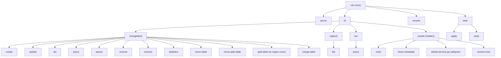
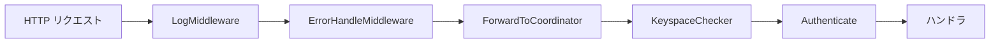
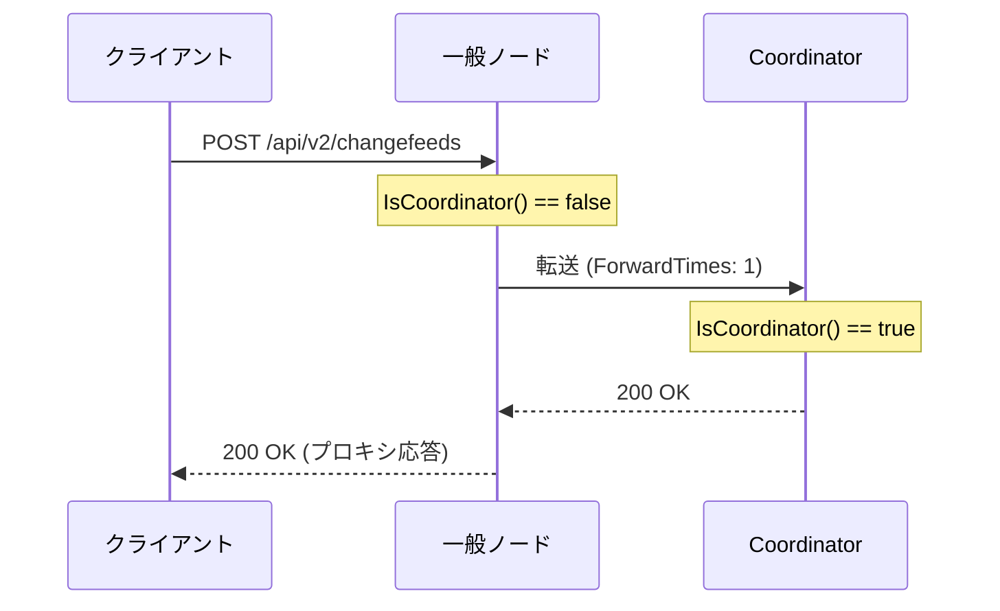

# 第15章 cdc cli と運用

> **本章で読むソース**
>
> - [`cmd/cdc/main.go`](https://github.com/pingcap/ticdc/blob/v8.5.6/cmd/cdc/main.go)
> - [`cmd/cdc/cli/cli.go`](https://github.com/pingcap/ticdc/blob/v8.5.6/cmd/cdc/cli/cli.go)
> - [`cmd/cdc/cli/cli_changefeed.go`](https://github.com/pingcap/ticdc/blob/v8.5.6/cmd/cdc/cli/cli_changefeed.go)
> - [`cmd/cdc/cli/cli_changefeed_create.go`](https://github.com/pingcap/ticdc/blob/v8.5.6/cmd/cdc/cli/cli_changefeed_create.go)
> - [`cmd/cdc/cli/cli_changefeed_pause.go`](https://github.com/pingcap/ticdc/blob/v8.5.6/cmd/cdc/cli/cli_changefeed_pause.go)
> - [`cmd/cdc/factory/factory.go`](https://github.com/pingcap/ticdc/blob/v8.5.6/cmd/cdc/factory/factory.go)
> - [`cmd/cdc/factory/factory_impl.go`](https://github.com/pingcap/ticdc/blob/v8.5.6/cmd/cdc/factory/factory_impl.go)
> - [`cmd/cdc/server/server.go`](https://github.com/pingcap/ticdc/blob/v8.5.6/cmd/cdc/server/server.go)
> - [`api/http.go`](https://github.com/pingcap/ticdc/blob/v8.5.6/api/http.go)
> - [`api/v2/api.go`](https://github.com/pingcap/ticdc/blob/v8.5.6/api/v2/api.go)
> - [`api/v2/changefeed.go`](https://github.com/pingcap/ticdc/blob/v8.5.6/api/v2/changefeed.go)
> - [`api/v2/helper.go`](https://github.com/pingcap/ticdc/blob/v8.5.6/api/v2/helper.go)
> - [`api/v1/api.go`](https://github.com/pingcap/ticdc/blob/v8.5.6/api/v1/api.go)
> - [`api/middleware/middleware.go`](https://github.com/pingcap/ticdc/blob/v8.5.6/api/middleware/middleware.go)
> - [`api/middleware/authenticate_middleware.go`](https://github.com/pingcap/ticdc/blob/v8.5.6/api/middleware/authenticate_middleware.go)
> - [`pkg/config/changefeed.go`](https://github.com/pingcap/ticdc/blob/v8.5.6/pkg/config/changefeed.go)
> - [`pkg/config/sink.go`](https://github.com/pingcap/ticdc/blob/v8.5.6/pkg/config/sink.go)
> - [`pkg/config/filter.go`](https://github.com/pingcap/ticdc/blob/v8.5.6/pkg/config/filter.go)
> - [`pkg/config/mounter.go`](https://github.com/pingcap/ticdc/blob/v8.5.6/pkg/config/mounter.go)

## この章の狙い

TiCDC はサーバープロセスとして動作するだけでなく、Changefeed の作成や一時停止といった運用操作を CLI と REST API の両方から受け付ける。
本章では `cdc` バイナリの cobra コマンドツリーと、サーバー側で対応する REST API v2 のルーティングを読む。
CLI がどのように API クライアントを組み立ててサーバーへリクエストを送るか、API ミドルウェアがリクエストを Coordinator へ転送する仕組み、Changefeed 設定の内部構造を順に追う。

## 前提

第12章の Coordinator による Changefeed 管理を前提とする。
Go の cobra ライブラリによるコマンドツリー構築と、gin フレームワークによる HTTP ルーティングの基本を想定する。

## cdc バイナリのエントリーポイント

`cdc` バイナリの `main` 関数はルートの cobra コマンドを作成し、4つのトップレベルサブコマンドを登録する。

[`cmd/cdc/main.go` L28-L56](https://github.com/pingcap/ticdc/blob/v8.5.6/cmd/cdc/main.go#L28-L56)

```go
func NewCmd() *cobra.Command {
	return &cobra.Command{
		Use:   "cdc",
		Short: "CDC",
		Long:  `Change Data Capture`,
		CompletionOptions: cobra.CompletionOptions{
			DisableDefaultCmd: true,
		},
	}
}

func main() {
	cmd := NewCmd()

	cmd.SetOut(os.Stdout)
	cmd.SetErr(os.Stderr)

	cmd.AddCommand(server.NewCmdServer())
	cmd.AddCommand(cli.NewCmdCli())
	cmd.AddCommand(version.NewCmdVersion())
	cmd.AddCommand(redo.NewCmdRedo())

	setNewCollationEnabled()
	if err := cmd.Execute(); err != nil {
		cmd.PrintErrln(err)
		os.Exit(1)
	}
}
```

`server` はサーバープロセスの起動、`cli` は運用操作、`version` はバージョン表示、`redo` は Redo ログの手動適用を担う。
`setNewCollationEnabled` は TiDB のコレーション設定をオフに初期化する処理で、主キーカラムのデコードに必要な前提条件を満たす。

## server コマンドとアーキテクチャ分岐

`server` サブコマンドは新アーキテクチャと旧アーキテクチャ（tiflow）の分岐点を持つ。
`isNewArchEnabled` がコマンドラインフラグ、環境変数 `TICDC_NEWARCH`、設定ファイルの3段階で判定する。

[`cmd/cdc/server/server.go` L294-L313](https://github.com/pingcap/ticdc/blob/v8.5.6/cmd/cdc/server/server.go#L294-L313)

```go
func isNewArchEnabled(o *options) bool {
	newarch := o.serverConfig.Newarch
	if newarch {
		log.Debug("Set newarch from command line")
		return newarch
	}

	newarch = os.Getenv("TICDC_NEWARCH") == "true"
	if newarch {
		log.Debug("Set newarch from environment variable")
		return newarch
	}

	serverConfigFilePath := parseConfigFlagFromOSArgs()
	newarch = isNewArchEnabledByConfig(serverConfigFilePath)
	if newarch {
		log.Debug("Set newarch from config file")
	}
	return newarch
}
```

`NewCmdServer` の `RunE` はこの判定結果に基づいて分岐する。
新アーキテクチャの場合は `options.run` で直接サーバーを起動し、旧アーキテクチャの場合は `runTiFlowServer` へ委譲する。

[`cmd/cdc/server/server.go` L360-L389](https://github.com/pingcap/ticdc/blob/v8.5.6/cmd/cdc/server/server.go#L360-L389)

```go
func NewCmdServer() *cobra.Command {
	o := newOptions()

	command := &cobra.Command{
		Use:   "server",
		Short: "Start a TiCDC server",
		Args:  cobra.NoArgs,
		RunE: func(cmd *cobra.Command, args []string) error {
			if isNewArchEnabled(o) {
				log.Info("Running TiCDC server in new architecture")
				err := o.complete(cmd)
				// ... (中略) ...
				return nil
			}
			log.Info("Running TiCDC server in old architecture")
			return runTiFlowServer(o, cmd)
		},
	}
	patchTiDBConfig()
	o.addFlags(command)
	return command
}
```

この分岐により、同一バイナリで新旧両アーキテクチャのサーバーを起動できる。

## cli コマンドツリー

### Factory パターンによるクライアント構築

`cli` サブコマンド群は **Factory パターン**でサーバーとの通信手段を抽象化する。
`Factory` インタフェースは etcd クライアント、PD クライアント、REST API v2 クライアントの3種を提供する。

[`cmd/cdc/factory/factory.go` L47-L64](https://github.com/pingcap/ticdc/blob/v8.5.6/cmd/cdc/factory/factory.go#L47-L64)

```go
type Factory interface {
	ClientGetter
	EtcdClient() (*etcd.CDCEtcdClientImpl, error)
	PdClient() (pd.Client, error)
	APIV2Client() (apiv2client.APIV2Interface, error)
}

type ClientGetter interface {
	ToTLSConfig() (*tls.Config, error)
	ToGRPCDialOption() (grpc.DialOption, error)
	GetPdAddr() string
	GetServerAddr() string
	GetLogLevel() string
	GetCredential() *security.Credential
	GetAuthParameters() url.Values
}
```

認証情報は `ClientAuth` 構造体にまとめられ、CLI フラグ、環境変数、クレデンシャルファイルの優先順で解決される。

[`cmd/cdc/factory/factory.go` L36-L45](https://github.com/pingcap/ticdc/blob/v8.5.6/cmd/cdc/factory/factory.go#L36-L45)

```go
const (
	defaultCrendentialConfigFile = ".ticdc/credentials"
	envVarTiCDCUser     = "TICDC_USER"
	envVarTiCDCPassword = "TICDC_PASSWORD"
	envVarTiCDCCAPath   = "TICDC_CA_PATH"
	envVarTiCDCCertPath = "TICDC_CERT_PATH"
	envVarTiCDCKeyPath  = "TICDC_KEY_PATH"
)
```

`factoryImpl` は `ClientGetter` を埋め込み、サーバーアドレスの自動発見機能を持つ。
`--server` フラグが指定されていなければ、PD と etcd を経由して CDC サーバーのアドレスを検出する。

[`cmd/cdc/factory/factory_impl.go` L40-L57](https://github.com/pingcap/ticdc/blob/v8.5.6/cmd/cdc/factory/factory_impl.go#L40-L57)

```go
type factoryImpl struct {
	ClientGetter
	ctx               context.Context
	fetchedServerAddr string
}

func NewFactory(ctx context.Context, clientGetter ClientGetter) Factory {
	if clientGetter == nil {
		panic("attempt to instantiate factory with nil clientGetter")
	}
	f := &factoryImpl{
		ctx:          ctx,
		ClientGetter: clientGetter,
	}
	return f
}
```

### cli ルートとサブコマンド登録

`NewCmdCli` は `cli` コマンドを作成し、`PersistentPreRun` でロガー初期化、シグナルハンドリング、認証パラメーターの解決を行う。
その後、4つのサブコマンドグループ（changefeed、capture、tso、unsafe）を登録する。

[`cmd/cdc/cli/cli.go` L28-L71](https://github.com/pingcap/ticdc/blob/v8.5.6/cmd/cdc/cli/cli.go#L28-L71)

```go
func NewCmdCli() *cobra.Command {
	cf := factory.NewClientFlags()

	cmds := &cobra.Command{
		Use:   "cli",
		Short: "Manage replication task and TiCDC cluster",
		Args:  cobra.NoArgs,
	}

	cf.AddFlags(cmds)
	ctx, cancel := context.WithCancel(context.Background())
	cmds.PersistentPreRun = func(cmd *cobra.Command, args []string) {
		err := logger.InitLogger(&logger.Config{Level: cf.GetLogLevel()})
		// ... (中略) ...
		util.CheckErr(cf.CompleteClientAuthParameters(cmd))
	}

	f := factory.NewFactory(ctx, cf)

	cmds.AddCommand(newCmdChangefeed(f))
	cmds.AddCommand(newCmdCapture(f))
	cmds.AddCommand(newCmdTso(f))
	cmds.AddCommand(newCmdUnsafe(f))

	return cmds
}
```

`changefeed` サブコマンドはさらに12個の操作コマンドを登録する。

[`cmd/cdc/cli/cli_changefeed.go` L22-L43](https://github.com/pingcap/ticdc/blob/v8.5.6/cmd/cdc/cli/cli_changefeed.go#L22-L43)

```go
func newCmdChangefeed(f factory.Factory) *cobra.Command {
	cmds := &cobra.Command{
		Use:   "changefeed",
		Short: "Manage changefeed (changefeed is a replication task)",
		Args:  cobra.NoArgs,
	}

	cmds.AddCommand(newCmdCreateChangefeed(f))
	cmds.AddCommand(newCmdUpdateChangefeed(f))
	cmds.AddCommand(newCmdStatisticsChangefeed(f))
	cmds.AddCommand(newCmdListChangefeed(f))
	cmds.AddCommand(newCmdPauseChangefeed(f))
	cmds.AddCommand(newCmdQueryChangefeed(f))
	cmds.AddCommand(newCmdRemoveChangefeed(f))
	cmds.AddCommand(newCmdResumeChangefeed(f))
	cmds.AddCommand(newCmdMoveTable(f))
	cmds.AddCommand(newCmdMoveSplitTable(f))
	cmds.AddCommand(newCmdSplitTableByRegionCount(f))
	cmds.AddCommand(newCmdMergeTable(f))

	return cmds
}
```

コマンドツリーの全体像を図にまとめる。



## 主要 CLI サブコマンドの実装パターン

### Options パターン

すべてのサブコマンドは統一された **Options パターン**で実装されている。
各コマンドは `xxxOptions` 構造体を持ち、`addFlags`(フラグ定義)、`complete`(API クライアント初期化)、`run`(実行) の3メソッドを備える。
cobra の `Run` コールバックがこれらを順に呼び出す。

`changefeed pause` の実装が、このパターンの最も簡潔な例になる。

[`cmd/cdc/cli/cli_changefeed_pause.go` L24-L78](https://github.com/pingcap/ticdc/blob/v8.5.6/cmd/cdc/cli/cli_changefeed_pause.go#L24-L78)

```go
type pauseChangefeedOptions struct {
	apiClient apiv2client.APIV2Interface

	changefeedID string
	keyspace     string
}

func (o *pauseChangefeedOptions) addFlags(cmd *cobra.Command) {
	cmd.PersistentFlags().StringVarP(&o.keyspace, "keyspace", "k", "", "Replication task (changefeed) Keyspace")
	cmd.PersistentFlags().StringVarP(&o.changefeedID, "changefeed-id", "c", "", "Replication task (changefeed) ID")
	_ = cmd.MarkPersistentFlagRequired("changefeed-id")
}

func (o *pauseChangefeedOptions) complete(f factory.Factory) error {
	apiClient, err := f.APIV2Client()
	if err != nil {
		return err
	}
	o.apiClient = apiClient
	return nil
}

func (o *pauseChangefeedOptions) run(cmd *cobra.Command) error {
	ctx := cmd.Context()
	return o.apiClient.Changefeeds().Pause(ctx, o.keyspace, o.changefeedID)
}

func newCmdPauseChangefeed(f factory.Factory) *cobra.Command {
	o := newPauseChangefeedOptions()

	command := &cobra.Command{
		Use:   "pause",
		Short: "Pause a replication task (changefeed)",
		Args:  cobra.NoArgs,
		Run: func(cmd *cobra.Command, args []string) {
			util.CheckErr(o.complete(f))
			util.CheckErr(o.run(cmd))
		},
	}
	o.addFlags(command)
	return command
}
```

`complete` で `Factory.APIV2Client()` を取得し、`run` でそのクライアント経由の API 呼び出しだけを行う。
この構造はすべてのサブコマンドに共通する。

### changefeed create の処理フロー

`changefeed create` はサブコマンドの中で最も複雑な処理を持つ。
`run` メソッドは以下の手順で Changefeed を作成する。

1. PD から現在の TSO を取得し、`--start-ts` が未指定なら TSO を使う
2. 開始タイムスタンプと現在時刻の差が大きい場合にユーザーへ確認を求める
3. `VerifyTable` API でレプリケーション対象テーブルの適格性を検証する
4. 不適格テーブルがあればユーザーに確認する
5. `Changefeeds().Create()` API で Changefeed を作成する

[`cmd/cdc/cli/cli_changefeed_create.go` L255-L351](https://github.com/pingcap/ticdc/blob/v8.5.6/cmd/cdc/cli/cli_changefeed_create.go#L255-L351)

```go
func (o *createChangefeedOptions) run(ctx context.Context, cmd *cobra.Command) error {
	tso, err := o.apiClient.Tso().Query(ctx, o.getUpstreamConfig())
	if err != nil {
		return err
	}

	if o.startTs == 0 {
		o.startTs = oracle.ComposeTS(tso.Timestamp, tso.LogicTime)
	}

	if !o.commonChangefeedOptions.noConfirm {
		if err = confirmLargeDataGap(cmd, tso.Timestamp, o.startTs, "create"); err != nil {
			return err
		}
	}

	createChangefeedCfg := o.getChangefeedConfig()
	// ... (中略) ...
	tables, err := o.apiClient.Changefeeds().VerifyTable(ctx, verifyTableConfig, o.keyspace)
	// ... (中略) ...
	info, err := o.apiClient.Changefeeds().Create(ctx, createChangefeedCfg, o.keyspace)
	// ... (中略) ...
	cmd.Printf("Create changefeed successfully!\nID: %s\nInfo: %s\n...", info.ID, infoStr, ...)
	return nil
}
```

`changefeedCommonOptions` が `--sink-uri`、`--config`、`--target-ts` などサブコマンド間で共有されるフラグを束ねる。

[`cmd/cdc/cli/cli_changefeed_create.go` L38-L51](https://github.com/pingcap/ticdc/blob/v8.5.6/cmd/cdc/cli/cli_changefeed_create.go#L38-L51)

```go
type changefeedCommonOptions struct {
	noConfirm      bool
	targetTs       uint64
	sinkURI        string
	schemaRegistry string
	configFile     string
	sortEngine     string
	sortDir        string

	upstreamPDAddrs  string
	upstreamCaPath   string
	upstreamCertPath string
	upstreamKeyPath  string
}
```

## REST API v2 のルーティング

### トップレベルのルート登録

サーバー側では、gin の `Engine` に対して v2、v1 の順にルートを登録する。
pprof と Prometheus メトリクスのエンドポイントも同じルーターに追加される。

[`api/http.go` L30-L55](https://github.com/pingcap/ticdc/blob/v8.5.6/api/http.go#L30-L55)

```go
func RegisterRoutes(
	router *gin.Engine,
	server server.Server,
	registry prometheus.Gatherer,
) {
	v2.RegisterOpenAPIV2Routes(router, v2.NewOpenAPIV2(server))
	v1.RegisterOpenAPIV1Routes(router, v1.NewOpenAPIV1(server))
	router.GET("/config", func(c *gin.Context) {
		c.JSON(http.StatusOK, config.GetGlobalServerConfig())
	})
	pprofGroup := router.Group("/debug/pprof/")
	// ... (中略) ...
	router.Any("/metrics", gin.WrapH(promhttp.Handler()))
}
```

### v2 ルートの構造

`RegisterOpenAPIV2Routes` は `/api/v2` グループを作成し、ミドルウェアとハンドラを組み合わせてルートを定義する。
ルートは機能ごとに5つのグループに分かれる。

[`api/v2/api.go` L33-L114](https://github.com/pingcap/ticdc/blob/v8.5.6/api/v2/api.go#L33-L114)

```go
func RegisterOpenAPIV2Routes(router *gin.Engine, api OpenAPIV2) {
	v2 := router.Group("/api/v2")

	v2.Use(middleware.LogMiddleware())
	v2.Use(middleware.ErrorHandleMiddleware())

	v2.GET("status", api.ServerStatus)
	v2.POST("log", api.SetLogLevel)
	// ... (中略) ...

	coordinatorMiddleware := middleware.ForwardToCoordinatorMiddleware(api.server)
	authenticateMiddleware := middleware.AuthenticateMiddleware(api.server)
	keyspaceCheckerMiddleware := middleware.KeyspaceCheckerMiddleware()

	// changefeed apis
	changefeedGroup := v2.Group("/changefeeds")
	changefeedGroup.POST("", coordinatorMiddleware, keyspaceCheckerMiddleware, authenticateMiddleware, api.CreateChangefeed)
	changefeedGroup.GET("", coordinatorMiddleware, keyspaceCheckerMiddleware, api.ListChangeFeeds)
	changefeedGroup.PUT("/:changefeed_id", coordinatorMiddleware, keyspaceCheckerMiddleware, authenticateMiddleware, api.UpdateChangefeed)
	changefeedGroup.POST("/:changefeed_id/pause", coordinatorMiddleware, keyspaceCheckerMiddleware, authenticateMiddleware, api.PauseChangefeed)
	changefeedGroup.DELETE("/:changefeed_id", coordinatorMiddleware, keyspaceCheckerMiddleware, authenticateMiddleware, api.DeleteChangefeed)
	// ... (中略) ...
}
```

各ルートに適用されるミドルウェアの組み合わせに注目する。
読み取り系の `GET` は認証ミドルウェアを省略し、変更系の `POST`/`PUT`/`DELETE` には認証を必須とする。
この設計によって、モニタリングツールからの参照クエリは認証なしで動作する。

CLI サブコマンドと REST API v2 エンドポイントの対応を表にまとめる。

| CLI サブコマンド | HTTP メソッド | API エンドポイント |
|---|---|---|
| `changefeed create` | POST | `/api/v2/changefeeds` |
| `changefeed list` | GET | `/api/v2/changefeeds` |
| `changefeed query` | GET | `/api/v2/changefeeds/:id` |
| `changefeed update` | PUT | `/api/v2/changefeeds/:id` |
| `changefeed pause` | POST | `/api/v2/changefeeds/:id/pause` |
| `changefeed resume` | POST | `/api/v2/changefeeds/:id/resume` |
| `changefeed remove` | DELETE | `/api/v2/changefeeds/:id` |
| `capture list` | GET | `/api/v2/captures` |

### CreateChangefeed ハンドラ

`CreateChangefeed` ハンドラの実装は、リクエストのバリデーションから Coordinator への委譲まで多段階の処理を行う。
JSON ボディをバインドした後、Changefeed ID の検証、keyspace の状態確認、重複チェック、Sink URI のパース、テーブル適格性の検証を順に実行する。

[`api/v2/changefeed.go` L67-L149](https://github.com/pingcap/ticdc/blob/v8.5.6/api/v2/changefeed.go#L67-L149)

```go
func (h *OpenAPIV2) CreateChangefeed(c *gin.Context) {
	ctx := c.Request.Context()
	cfg := &ChangefeedConfig{ReplicaConfig: GetDefaultReplicaConfig()}

	var err error
	if err = c.BindJSON(&cfg); err != nil {
		_ = c.Error(errors.WrapError(errors.ErrAPIInvalidParam, err))
		return
	}

	keyspaceName := GetKeyspaceValueWithDefault(c)
	cfg.Keyspace = keyspaceName

	var changefeedID common.ChangeFeedID
	if cfg.ID == "" {
		changefeedID = common.NewChangefeedID(keyspaceName)
	} else {
		changefeedID = common.NewChangeFeedIDWithName(cfg.ID, keyspaceName)
	}
	if err = common.ValidateChangefeedID(changefeedID.Name()); err != nil {
		_ = c.Error(errors.ErrAPIInvalidParam.GenWithStack("invalid changefeed_id: %s", cfg.ID))
		return
	}
	// ... (中略) ...
	co, err := h.server.GetCoordinator()
	// ... (中略) ...
	_, status, err := co.GetChangefeed(ctx, common.NewChangeFeedDisplayName(cfg.ID, cfg.Keyspace))
	if status != nil {
		err = errors.ErrChangeFeedAlreadyExists.GenWithStackByArgs(cfg.ID)
		_ = c.Error(err)
		return
	}
	// ... (中略) ...
}
```

ID が空の場合は UUID ベースの自動生成が行われる。
重複チェックは Coordinator 経由で既存の Changefeed を取得して判定する。

### v1 互換レイヤー

REST API v1 は v2 の薄いラッパーとして実装されている。
`OpenAPIV1` 構造体が `OpenAPIV2` を埋め込み、大半のハンドラは v2 の実装をそのまま委譲する。

[`api/v1/api.go` L40-L48](https://github.com/pingcap/ticdc/blob/v8.5.6/api/v1/api.go#L40-L48)

```go
type OpenAPIV1 struct {
	server server.Server
	v2     v2.OpenAPIV2
}

func NewOpenAPIV1(c server.Server) OpenAPIV1 {
	return OpenAPIV1{c, v2.NewOpenAPIV2(c)}
}
```

v1 固有のリクエスト形式を持つ `createChangefeed` と `updateChangefeed` だけが独自のハンドラを持ち、リクエストボディを v2 形式に変換してから v2 ハンドラへ処理を渡す。
v2 ハンドラへ委譲する多くの v1 互換ルートには `setV1Header` ミドルウェアによって `from-ticdc-api-v1: true` ヘッダーが付与される。
ただし `/status` と `/log` は v2 ハンドラへ直接ルーティングされるため、このヘッダーは付かない。

[`api/v1/api.go` L36-L38](https://github.com/pingcap/ticdc/blob/v8.5.6/api/v1/api.go#L36-L38)

```go
func setV1Header(c *gin.Context) {
	c.Request.Header.Set("from-ticdc-api-v1", "true")
}
```

v2 側の `helper.go` がこのヘッダーを検出して、レスポンス形式を切り替える。
v1 ではリストをそのまま配列で返し、v2 では `ListResponse` でラップする。

[`api/v2/helper.go` L88-L107](https://github.com/pingcap/ticdc/blob/v8.5.6/api/v2/helper.go#L88-L107)

```go
func isFromV1API(c *gin.Context) bool {
	return c.GetHeader("from-ticdc-api-v1") == "true"
}

func getStatus(c *gin.Context) int {
	if isFromV1API(c) {
		return http.StatusAccepted
	}
	return http.StatusOK
}

func toListResponse[T any](c *gin.Context, data []T) interface{} {
	if isFromV1API(c) {
		return data
	}
	return &ListResponse[T]{
		Items: data,
		Total: len(data),
	}
}
```

HTTP ステータスコードも v1 では 202(Accepted)、v2 では 200(OK) と異なる。
この設計により、v1 クライアントの後方互換性を維持しながら、v2 の一貫したレスポンス形式を提供できる。

## API ミドルウェア

### ミドルウェアチェーンの構成

v2 ルートには5種類のミドルウェアが適用される。



ルートグループ `/api/v2` に対して `LogMiddleware` と `ErrorHandleMiddleware` が全体に適用され、それ以降のミドルウェアはルートごとに選択的に付与される。

### Coordinator へのリクエスト転送

TiCDC クラスタでは Coordinator（リーダーノード）だけが Changefeed のメタデータを管理する。
非 Coordinator ノードに到達したリクエストは、`ForwardToCoordinatorMiddleware` が Coordinator ノードへプロキシする。

[`api/middleware/middleware.go` L105-L118](https://github.com/pingcap/ticdc/blob/v8.5.6/api/middleware/middleware.go#L105-L118)

```go
func ForwardToCoordinatorMiddleware(server server.Server) gin.HandlerFunc {
	return func(ctx *gin.Context) {
		if !server.IsCoordinator() {
			ForwardToCoordinator(ctx, server)
			ctx.Abort()
			return
		}
		ctx.Next()
	}
}
```

`ForwardToServer` がプロキシの実体である。
元のリクエストのメソッド、URI、ヘッダー、ボディをすべて保持したまま新しい HTTP リクエストを構築し、Coordinator のアドレスへ転送する。
レスポンスのヘッダー、ステータスコード、ボディもそのままクライアントへ返される。

[`api/middleware/middleware.go` L141-L224](https://github.com/pingcap/ticdc/blob/v8.5.6/api/middleware/middleware.go#L141-L224)

```go
func ForwardToServer(c *gin.Context, fromID node.ID, toAddr string) {
	ctx := c.Request.Context()

	timeStr := c.GetHeader(forwardTimes)
	var (
		err              error
		lastForwardTimes uint64
	)
	if len(timeStr) != 0 {
		lastForwardTimes, err = strconv.ParseUint(timeStr, 10, 64)
		// ... (中略) ...
		if lastForwardTimes > maxForwardTimes {
			err := errors.New("TiCDC cluster is unavailable, please try again later")
			_ = c.Error(err)
			return
		}
	}
	// ... (中略) ...
	req.Header.Set(forwardFrom, string(fromID))
	lastForwardTimes++
	req.Header.Set(forwardTimes, strconv.Itoa(int(lastForwardTimes)))
	// ... (中略) ...
	resp, err := cli.Do(req)
	// ... (中略) ...
	for k, values := range resp.Header {
		for _, v := range values {
			c.Header(k, v)
		}
	}
	c.Status(resp.StatusCode)
	defer resp.Body.Close()
	_, err = bufio.NewReader(resp.Body).WriteTo(c.Writer)
	// ... (中略) ...
}
```

転送回数の上限は `maxForwardTimes = 2` に設定されている。
これは「一般ノード → Coordinator → Changefeed オーナー」の最大2ホップを許容する設計である。
`TiCDC-ForwardTimes` ヘッダーで転送回数をカウントし、上限を超えるとエラーを返す。
無限転送ループを防ぐ安全装置として機能する。

[`api/middleware/middleware.go` L38-L44](https://github.com/pingcap/ticdc/blob/v8.5.6/api/middleware/middleware.go#L38-L44)

```go
const (
	forwardFrom = "TiCDC-ForwardFrom"
	forwardTimes = "TiCDC-ForwardTimes"
	maxForwardTimes = 2
)
```

### 認証ミドルウェア

`AuthenticateMiddleware` は TiDB インスタンスへの実際の MySQL 接続によってユーザー認証を行う。
この認証方式は、TiCDC 独自のユーザーデータベースを持たず、上流 TiDB の認証基盤をそのまま再利用する設計を反映している。

[`api/middleware/authenticate_middleware.go` L34-L46](https://github.com/pingcap/ticdc/blob/v8.5.6/api/middleware/authenticate_middleware.go#L34-L46)

```go
func AuthenticateMiddleware(server server.Server) gin.HandlerFunc {
	return func(ctx *gin.Context) {
		security := config.GetGlobalServerConfig().Security
		if security != nil && security.ClientUserRequired {
			if err := verify(ctx, server.GetEtcdClient().GetEtcdClient()); err != nil {
				ctx.IndentedJSON(http.StatusUnauthorized, api.NewHTTPError(err))
				ctx.Abort()
				return
			}
		}
		ctx.Next()
	}
}
```

`verify` 関数はまず HTTP リクエストの BasicAuth ヘッダーからユーザー名とパスワードを取得する。
次に、ユーザー名が許可リスト（`ClientAllowedUser`）に含まれているかを確認し、etcd から TiDB トポロジを取得して実際に MySQL 接続を試行する。

[`api/middleware/authenticate_middleware.go` L48-L93](https://github.com/pingcap/ticdc/blob/v8.5.6/api/middleware/authenticate_middleware.go#L48-L93)

```go
func verify(ctx *gin.Context, etcdCli etcd.Client) error {
	username, password, ok := ctx.Request.BasicAuth()
	if !ok {
		errMsg := "please specify the user and password via authorization header"
		return errors.ErrCredentialNotFound.GenWithStackByArgs(errMsg)
	}

	serverCfg := config.GetGlobalServerConfig()
	allowed := slices.Contains(serverCfg.Security.ClientAllowedUser, username)
	if !allowed {
		// ... (中略) ...
		return errors.ErrUnauthorized.GenWithStackByArgs(username, errMsg)
	}

	keyspaceMeta := GetKeyspaceFromContext(ctx)
	tidbs, err := upstream.FetchTiDBTopology(ctx, etcdCli, keyspaceMeta.Id)
	// ... (中略) ...
	for _, tidb := range tidbs {
		host := fmt.Sprintf("%s:%d", tidb.IP, tidb.Port)
		dsnStr := fmt.Sprintf("%s:%s@tcp(%s)/", username, password, host)
		err = doVerify(dsnStr)
		if err == nil {
			return nil
		}
		if errors.IsAccessDeniedError(err) {
			return errors.ErrUnauthorized.GenWithStackByArgs(username, err.Error())
		}
	}
	return errors.ErrUnauthorized.GenWithStackByArgs(username, err.Error())
}
```

複数の TiDB インスタンスが存在する場合、接続成功するインスタンスが1つでもあれば認証成功とする。
ただし、アクセス拒否エラー（パスワード不一致）の場合は即座に認証失敗を返す。
ネットワーク障害など他のエラーの場合のみ次のインスタンスへフォールバックする。

### Keyspace チェックミドルウェア

`KeyspaceCheckerMiddleware` はマルチテナント環境（nextgen モード）でのみ有効になる。
クラシックモードではスキップされる。

[`api/middleware/middleware.go` L227-L260](https://github.com/pingcap/ticdc/blob/v8.5.6/api/middleware/middleware.go#L227-L260)

```go
func KeyspaceCheckerMiddleware() gin.HandlerFunc {
	return func(c *gin.Context) {
		if kerneltype.IsClassic() {
			c.Next()
			return
		}

		ks := c.Query(api.APIOpVarKeyspace)
		if ks == "" {
			c.IndentedJSON(http.StatusBadRequest, errors.ErrAPIInvalidParam)
			c.Abort()
			return
		}

		keyspaceManager := appcontext.GetService[keyspace.Manager](appcontext.KeyspaceManager)
		meta, err := keyspaceManager.LoadKeyspace(c.Request.Context(), ks)
		// ... (中略) ...
		c.Set(ctxKeyspaceKey, meta)
		c.Next()
	}
}
```

## Changefeed 設定の構造

### ChangefeedConfig と ChangeFeedInfo

Changefeed の設定は2つの構造体に分かれる。
**`ChangefeedConfig`** はランタイムで使われる軽量な設定、**`ChangeFeedInfo`** は永続化される完全なメタデータである。

[`pkg/config/changefeed.go` L182-L207](https://github.com/pingcap/ticdc/blob/v8.5.6/pkg/config/changefeed.go#L182-L207)

```go
type ChangefeedConfig struct {
	ChangefeedID common.ChangeFeedID `json:"changefeed_id"`
	StartTS      uint64              `json:"start_ts"`
	TargetTS     uint64              `json:"target_ts"`
	SinkURI      string              `json:"sink_uri"`
	TimeZone      string `json:"timezone" default:"system"`
	CaseSensitive bool   `json:"case_sensitive" default:"false"`
	ForceReplicate bool          `json:"force_replicate" default:"false"`
	Filter         *FilterConfig `toml:"filter" json:"filter"`
	MemoryQuota    uint64        `toml:"memory-quota" json:"memory-quota"`
	EnableSyncPoint       bool          `json:"enable_sync_point" default:"false"`
	SyncPointInterval     time.Duration `json:"sync_point_interval" default:"1m"`
	SyncPointRetention    time.Duration `json:"sync_point_retention" default:"24h"`
	SinkConfig            *SinkConfig   `json:"sink_config"`
	// ... (中略) ...
}
```

`ChangeFeedInfo` は `ChangefeedConfig` のフィールドに加え、作成時刻、状態、エラー情報、バージョンなどの運用情報を保持する。

[`pkg/config/changefeed.go` L232-L261](https://github.com/pingcap/ticdc/blob/v8.5.6/pkg/config/changefeed.go#L232-L261)

```go
type ChangeFeedInfo struct {
	ChangefeedID common.ChangeFeedID `json:"id"`
	UpstreamID   uint64              `json:"upstream-id"`
	SinkURI      string              `json:"sink-uri"`
	CreateTime   time.Time           `json:"create-time"`
	StartTs uint64 `json:"start-ts"`
	TargetTs uint64 `json:"target-ts"`
	AdminJobType AdminJobType `json:"admin-job-type"`
	Engine       SortEngine   `json:"sort-engine"`
	// ... (中略) ...
	Config       *ReplicaConfig `json:"config"`
	State        FeedState      `json:"state"`
	Error        *RunningError  `json:"error"`
	Warning      *RunningError  `json:"warning"`
	CreatorVersion string `json:"creator-version"`
	Epoch uint64 `json:"epoch"`
	KeyspaceID uint32 `json:"keyspace-id"`
}
```

`ToChangefeedConfig` メソッドが `ChangeFeedInfo` からランタイム用の `ChangefeedConfig` を抽出する。
`String` メソッドはセンシティブ情報をマスクしてからシリアライズする設計で、ログ出力時に認証情報が漏洩しないようにしている。

### SinkConfig

`SinkConfig` は下流の種別ごとに異なるフィールドを1つの構造体にまとめている。
コメントで各フィールドが適用される下流を明示している。

[`pkg/config/sink.go` L138-L214](https://github.com/pingcap/ticdc/blob/v8.5.6/pkg/config/sink.go#L138-L214)

```go
type SinkConfig struct {
	TxnAtomicity *AtomicityLevel `toml:"transaction-atomicity" json:"transaction-atomicity,omitempty"`
	Protocol *string `toml:"protocol" json:"protocol,omitempty"`
	// DispatchRules is only available when the downstream is MQ.
	DispatchRules []*DispatchRule `toml:"dispatchers" json:"dispatchers,omitempty"`
	ColumnSelectors []*ColumnSelector `toml:"column-selectors" json:"column-selectors,omitempty"`
	// SchemaRegistry is only available when the downstream is MQ using avro protocol.
	SchemaRegistry *string `toml:"schema-registry" json:"schema-registry,omitempty"`
	// ... (中略) ...
	SafeMode           *bool               `toml:"safe-mode" json:"safe-mode,omitempty"`
	KafkaConfig        *KafkaConfig        `toml:"kafka-config" json:"kafka-config,omitempty"`
	PulsarConfig       *PulsarConfig       `toml:"pulsar-config" json:"pulsar-config,omitempty"`
	MySQLConfig        *MySQLConfig        `toml:"mysql-config" json:"mysql-config,omitempty"`
	CloudStorageConfig *CloudStorageConfig `toml:"cloud-storage-config" json:"cloud-storage-config,omitempty"`
	// ... (中略) ...
}
```

`SinkConfig` はフィールドのほとんどをポインター型で持つ。
これは設定ファイルと CLI フラグのどちらからも部分的に値を指定でき、未指定フィールドを `nil` で区別するためである。
`validateAndAdjust` メソッドが Sink URI のスキームに基づいて不整合な設定を検出する。

### FilterConfig と EventFilterRule

`FilterConfig` はテーブルフィルタルール、トランザクション開始タイムスタンプによるスキップ、SQL レベルのイベントフィルタの3層でフィルタリングを定義する。

[`pkg/config/filter.go` L21-L46](https://github.com/pingcap/ticdc/blob/v8.5.6/pkg/config/filter.go#L21-L46)

```go
type FilterConfig struct {
	Rules            []string           `toml:"rules" json:"rules"`
	IgnoreTxnStartTs []uint64           `toml:"ignore-txn-start-ts" json:"ignore-txn-start-ts"`
	EventFilters     []*EventFilterRule `toml:"event-filters" json:"event-filters"`
}

type EventFilterRule struct {
	Matcher     []string       `toml:"matcher" json:"matcher"`
	IgnoreEvent []bf.EventType `toml:"ignore-event" json:"ignore-event"`
	IgnoreSQL []string `toml:"ignore-sql" json:"ignore-sql"`
	IgnoreInsertValueExpr    *string `toml:"ignore-insert-value-expr" json:"ignore-insert-value-expr,omitempty"`
	IgnoreUpdateNewValueExpr *string `toml:"ignore-update-new-value-expr" json:"ignore-update-new-value-expr,omitempty"`
	IgnoreUpdateOldValueExpr *string `toml:"ignore-update-old-value-expr" json:"ignore-update-old-value-expr,omitempty"`
	IgnoreDeleteValueExpr    *string `toml:"ignore-delete-value-expr" json:"ignore-delete-value-expr,omitempty"`
}
```

`Rules` のデフォルトは `["*.*"]`（全テーブル）である。
`EventFilterRule` の `Matcher` でテーブルパターンを指定し、`IgnoreEvent` で DDL イベント種別、`IgnoreSQL` で SQL の正規表現、`IgnoreInsertValueExpr` 等で SQL 式による行レベルのフィルタリングを行う。

### MounterConfig

`MounterConfig` は Mounter（TiKV の Key-Value からテーブル行へのデコード処理）のワーカー数だけを保持する最小の設定構造体である。

[`pkg/config/mounter.go` L17-L19](https://github.com/pingcap/ticdc/blob/v8.5.6/pkg/config/mounter.go#L17-L19)

```go
type MounterConfig struct {
	WorkerNum int `toml:"worker-num" json:"worker-num"`
}
```

## 高速化の工夫: 転送ホップ数制限による無限ループ防止

分散システムの API プロキシでは、ノード間転送が無限ループに陥るリスクがある。
TiCDC はこの問題を `TiCDC-ForwardTimes` ヘッダーによるホップ数カウントで解決している。



転送1回あたりのオーバーヘッドは HTTP リクエストの再構築とレスポンスの中継だけであり、最大2ホップに制限されているため性能への影響は小さい。
この設計には2つの利点がある。

1. クライアントは任意の TiCDC ノードに接続すればよく、Coordinator のアドレスを事前に知る必要がない
2. ヘッダーベースのカウントにより、ルーティングテーブルのような追加のステート管理が不要になる

転送時のヘッダー操作はアトミックに行われるわけではないが、HTTP リクエストは単一のノードで順次処理されるため、競合は発生しない。
`maxForwardTimes` を超えた場合のエラーメッセージ「TiCDC cluster is unavailable」は、転送ループではなくクラスタ自体の問題を示唆するよう設計されている。

## まとめ

TiCDC の `cdc` バイナリは cobra ベースの4層コマンドツリーを持ち、`server` でサーバー起動、`cli` で運用操作、`redo` で Redo ログ適用を行う。
CLI サブコマンドは Options パターンで統一され、`Factory` 経由の API v2 クライアントを通じてサーバーと通信する。
サーバー側の REST API v2 は gin のミドルウェアチェーンでログ記録、エラーハンドリング、Coordinator 転送、Keyspace 検証、認証を積み重ねる。
認証は TiDB への実 MySQL 接続で行い、独自のユーザー管理を持たない。
v1 API は v2 のラッパーとして後方互換性を維持する。
Changefeed 設定は `ChangefeedConfig`(ランタイム用) と `ChangeFeedInfo`(永続化用) に分かれ、`SinkConfig` が下流種別ごとの設定を集約する。

## 関連する章

- 第12章 Coordinator と Changefeed 管理: Changefeed の作成や状態変更が Coordinator でどのように処理されるか
- 第9章 MySQL Sink: `SinkConfig.MySQLConfig` の設定がどのように MySQL Sink で消費されるか
- 第10章 Kafka Sink とコーデック: `SinkConfig.KafkaConfig` と `DispatchRule` の実際の使用
