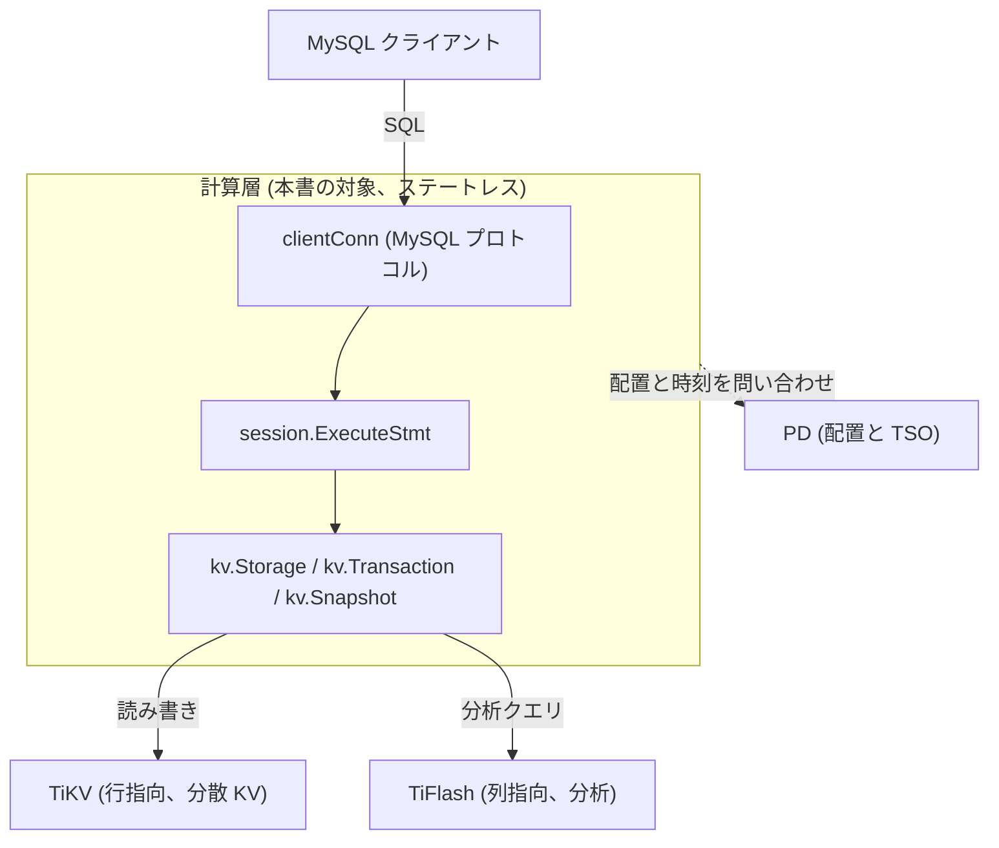

# 第1章 TiDB とは何か

> **本章で読むソース**
>
> - [`pkg/server/conn.go`](https://github.com/pingcap/tidb/blob/v8.5.6/pkg/server/conn.go)
> - [`pkg/session/session.go`](https://github.com/pingcap/tidb/blob/v8.5.6/pkg/session/session.go)
> - [`pkg/kv/kv.go`](https://github.com/pingcap/tidb/blob/v8.5.6/pkg/kv/kv.go)

## この章の狙い

TiDB は、MySQL 互換のインターフェースを持つ**分散 SQL データベース**である。
本書が読み解くのは、その中で SQL を解釈して実行する**計算層**である。
計算層は状態を持たず、実データの保持と複製は別の層に委ねる。
この章では、計算層がどこに位置し、何を担い、何に委ねるのかを、入口のコードから確認する。

論を進める順序は3段である。
最初に、計算層が外から MySQL プロトコルでクエリを受ける入口を見る。
次に、受けたクエリを実行に渡すセッションの入口を見る。
最後に、計算層がデータをストレージ抽象越しに読み書きする境界を見る。

## 前提

読者には Go と一般的なリレーショナルデータベースの基礎を仮定する。
分散合意プロトコルやストレージエンジンの内部は前提としない。
TiKV、TiFlash、PD という周辺コンポーネントは名前で参照するにとどめ、その内部実装は本書の対象外とする。

## 計算層とストレージ層の分離

TiDB のアーキテクチャは、SQL を解釈する計算層と、データを保持する分散ストレージ層に分かれる。
計算層は状態を持たないプロセス群であり、SQL の解析、最適化、分散実行を担う。
実データは TiKV という分散キーバリューストアに置かれ、Raft で複製される。
分析向けのクエリは、列指向の TiFlash が受け持つ。
データの配置と、トランザクションに必要な時刻の発番（TSO）は、PD が司る。

この分離が生む効果を一つ挙げる。
計算層が状態を持たないため、計算ノードはいつでも追加や削除ができる。
クエリを受けるノードはどれでも同じストレージ層を読み書きするので、ノードを増やせばクエリの受け口がそのまま増える。
状態がノードに固定されていれば、ノード追加のたびにデータの再配置が要る。
TiDB は状態をストレージ層へ追い出すことで、計算層の水平スケールをデータ再配置から切り離している。

TiDB は、この構成のまま OLTP と OLAP を1つのデータベースで扱う**HTAP** という立ち位置を取る。
行指向の TiKV が更新主体の処理を、列指向の TiFlash が分析主体の処理を引き受け、同じデータの異なる複製として両者が併存する。



## MySQL 互換の入口

外から見た TiDB は、MySQL サーバーとして振る舞う。
クライアントとの1接続を表すのが `clientConn` 構造体であり、MySQL プロトコルのパケットを読み書きする。
構造体の `ctx` フィールドは、SQL 文を実行するためのインターフェースだと注記されている。

[`pkg/server/conn.go L163-181`](https://github.com/pingcap/tidb/blob/v8.5.6/pkg/server/conn.go#L163-L181)

```go
type clientConn struct {
	pkt          *internal.PacketIO      // a helper to read and write data in packet format.
	bufReadConn  *util2.BufferedReadConn // a buffered-read net.Conn or buffered-read tls.Conn.
	tlsConn      *tls.Conn               // TLS connection, nil if not TLS.
	server       *Server                 // a reference of server instance.
	capability   uint32                  // client capability affects the way server handles client request.
	connectionID uint64                  // atomically allocated by a global variable, unique in process scope.
	user         string                  // user of the client.
	dbname       string                  // default database name.
	salt         []byte                  // random bytes used for authentication.
	alloc        arena.Allocator         // an memory allocator for reducing memory allocation.
	chunkAlloc   chunk.Allocator
	lastPacket   []byte // latest sql query string, currently used for logging error.
	// ShowProcess() and mysql.ComChangeUser both visit this field, ShowProcess() read information through
	// the TiDBContext and mysql.ComChangeUser re-create it, so a lock is required here.
	ctx struct {
		sync.RWMutex
		*TiDBContext // an interface to execute sql statements.
	}
```

接続ごとのループは、クライアントから届くコマンドパケットを1つずつ `dispatch` に渡す。
最も多く使われるコマンドが `ComQuery` であり、テキストの SQL 文を1つ運ぶ。
`dispatch` はこのコマンドを `handleQuery` に振り分ける。

[`pkg/server/conn.go L1403-1412`](https://github.com/pingcap/tidb/blob/v8.5.6/pkg/server/conn.go#L1403-L1412)

```go
	case mysql.ComQuery: // Most frequently used command.
		// For issue 1989
		// Input payload may end with byte '\0', we didn't find related mysql document about it, but mysql
		// implementation accept that case. So trim the last '\0' here as if the payload an EOF string.
		// See http://dev.mysql.com/doc/internals/en/com-query.html
		if len(data) > 0 && data[len(data)-1] == 0 {
			data = data[:len(data)-1]
			dataStr = string(hack.String(data))
		}
		return cc.handleQuery(ctx, dataStr)
```

ここまでが、MySQL クライアントから見える TiDB の表面である。
プロトコルの互換性により、既存の MySQL クライアントやドライバはコードを変えずに TiDB へ接続できる。

## SQL 実行の入口となるセッション

`handleQuery` が運んだ SQL 文は、最終的にセッションの実行口に渡される。
1つのクライアント接続には1つの `session` が対応し、SQL 文の実行はこのセッション上で行われる。
パース済みの構文木を受けて実行する中心の口が `ExecuteStmt` である。

[`pkg/session/session.go L2013-2019`](https://github.com/pingcap/tidb/blob/v8.5.6/pkg/session/session.go#L2013-L2019)

```go
func (s *session) ExecuteStmt(ctx context.Context, stmtNode ast.StmtNode) (sqlexec.RecordSet, error) {
	r, ctx := tracing.StartRegionEx(ctx, "session.ExecuteStmt")
	defer r.End()

	if err := s.PrepareTxnCtx(ctx); err != nil {
		return nil, err
	}
```

`ExecuteStmt` は、引数に構文木 `stmtNode` を取り、結果を読み出す `RecordSet` を返す。
冒頭で `PrepareTxnCtx` を呼び、この文を実行するためのトランザクション文脈を整える。
最適化や分散実行はこの先で組み立てられるが、それらは後続の各部で扱う。
本章で押さえるのは、テキストの SQL がプロトコル層を抜けて構文木になり、セッションの実行口に入るという経路である。

## ストレージ抽象という境界

計算層がデータを読み書きするとき、TiKV の通信や複製の詳細を直接は扱わない。
計算層とストレージ層のあいだには `kv` パッケージのインターフェース群が置かれ、計算層はこの抽象越しにデータへアクセスする。
ストレージ全体を表すのが `Storage` インターフェースである。

[`pkg/kv/kv.go L749-783`](https://github.com/pingcap/tidb/blob/v8.5.6/pkg/kv/kv.go#L749-L783)

```go
type Storage interface {
	// Begin a global transaction
	Begin(opts ...tikv.TxnOption) (Transaction, error)
	// GetSnapshot gets a snapshot that is able to read any data which data is <= ver.
	// if ver is MaxVersion or > current max committed version, we will use current version for this snapshot.
	GetSnapshot(ver Version) Snapshot
	// GetClient gets a client instance.
	GetClient() Client
	// GetMPPClient gets a mpp client instance.
	GetMPPClient() MPPClient
	// Close store
	Close() error
	// UUID return a unique ID which represents a Storage.
	UUID() string
	// CurrentVersion returns current max committed version with the given txnScope (local or global).
	CurrentVersion(txnScope string) (Version, error)
	// GetOracle gets a timestamp oracle client.
	GetOracle() oracle.Oracle
	// SupportDeleteRange gets the storage support delete range or not.
	SupportDeleteRange() (supported bool)
	// Name gets the name of the storage engine
	Name() string
	// Describe returns of brief introduction of the storage
	Describe() string
	// ShowStatus returns the specified status of the storage
	ShowStatus(ctx context.Context, key string) (any, error)
	// GetMemCache return memory manager of the storage.
	GetMemCache() MemManager
	// GetMinSafeTS return the minimal SafeTS of the storage with given txnScope.
	GetMinSafeTS(txnScope string) uint64
	// GetLockWaits return all lock wait information
	GetLockWaits() ([]*deadlockpb.WaitForEntry, error)
	// GetCodec gets the codec of the storage.
	GetCodec() tikv.Codec
}
```

`Storage` の `Begin` は、書き込みを伴う処理のための `Transaction` を開始する。
`GetSnapshot` は、ある時刻までに確定したデータを読むための `Snapshot` を返す。
`GetOracle` が返す時刻発番器が、計算層から見た PD の時刻供給の入口である。

書き込み側のインターフェース `Transaction` は、コミットとロールバックを持つ。
読み取りと書き込みの両方を束ねる `RetrieverMutator` を埋め込み、その上にトランザクション固有の操作を重ねる。

[`pkg/kv/kv.go L261-266`](https://github.com/pingcap/tidb/blob/v8.5.6/pkg/kv/kv.go#L261-L266)

```go
type Transaction interface {
	RetrieverMutator
	AssertionProto
	FairLockingController
	// Size returns sum of keys and values length.
	Size() int
```

読み取り専用の側が `Snapshot` インターフェースである。
ある時刻のスナップショットに対するキー取得とイテレーションを提供する。

[`pkg/kv/kv.go L697-704`](https://github.com/pingcap/tidb/blob/v8.5.6/pkg/kv/kv.go#L697-L704)

```go
type Snapshot interface {
	Retriever
	// BatchGet gets a batch of values from snapshot.
	BatchGet(ctx context.Context, keys []Key, options ...BatchGetOption) (map[string]ValueEntry, error)
	// SetOption sets an option with a value, when val is nil, uses the default
	// value of this option. Only ReplicaRead is supported for snapshot
	SetOption(opt int, val any)
}
```

これらのインターフェースが、計算層と分散ストレージのあいだの境界になる。
計算層は `Storage`、`Transaction`、`Snapshot` という型だけを相手にし、リージョンの所在やリーダーの切り替えといった分散の詳細から切り離されている。
具体的な実装が TiKV を相手にする本番用なのか、テスト用の組み込みストアなのかは、この境界の向こう側の差し替えで済む。

## まとめ

TiDB は MySQL 互換のインターフェースを持つ分散 SQL データベースであり、本書はその計算層を読む。
計算層は状態を持たず、外からは `clientConn` で MySQL プロトコルを話し、`ComQuery` を `handleQuery` から `session.ExecuteStmt` へ流して SQL を実行する。
実データの読み書きは `kv.Storage`、`kv.Transaction`、`kv.Snapshot` という抽象越しに行い、複製や配置の詳細は TiKV と PD に委ねる。
状態をストレージ層へ追い出すこの分離により、計算ノードはデータ再配置なしに増やせ、読み書きの受け口がそのままスケールする。

## 関連する章

計算層と周辺コンポーネントの関係、および HTAP の構成は、[エコシステムとアーキテクチャ](02-architecture.md)で詳しく扱う。
本章で見た接続からセッション、ストレージ抽象に至る経路を1クエリの流れとして追うのは、[ソースツリーと、1クエリの一生](03-source-tree-and-query-flow.md)である。
