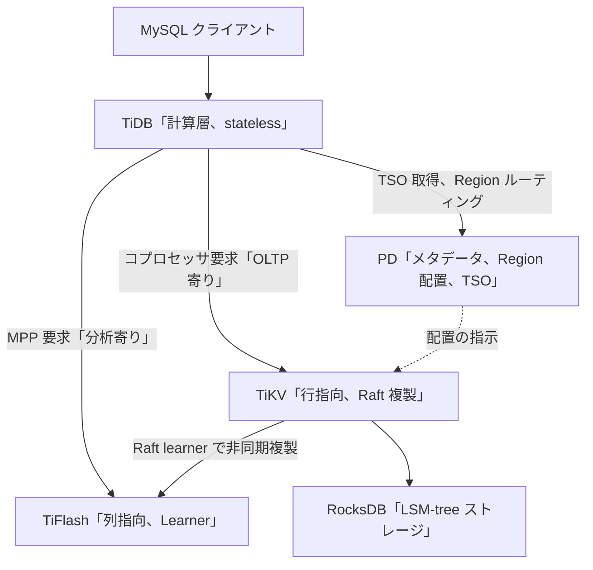

# 第2章 エコシステムとアーキテクチャ

> **本章で読むソース**
>
> - [`pkg/kv/kv.go`](https://github.com/pingcap/tidb/blob/v8.5.6/pkg/kv/kv.go)
> - [`pkg/distsql/request_builder.go`](https://github.com/pingcap/tidb/blob/v8.5.6/pkg/distsql/request_builder.go)
> - [`pkg/distsql/distsql.go`](https://github.com/pingcap/tidb/blob/v8.5.6/pkg/distsql/distsql.go)
> - [`pkg/distsql/select_result.go`](https://github.com/pingcap/tidb/blob/v8.5.6/pkg/distsql/select_result.go)

## この章の狙い

TiDB は単独で動くデータベースではない。
SQL を解釈する計算層の TiDB、データを Raft で複製する TiKV、分析を高速化する TiFlash、クラスタ全体を統制する PD が連携して、1つの HTAP データベースを構成する。
本章では、まず各コンポーネントの役割を分担として整理する。
そのうえで、1つの SQL リクエストがどのコンポーネントをどう流れるかを、計算層が分散ストレージへ要求を送り出す境界のソースコードで確認する。

計算層を主に読む本書にとって、この境界は出発点になる。
TiDB がどこまでを自分で処理し、何を下層へ任せるかは、この境界の設計に表れる。

## 前提

読者は SQL と一般的なリレーショナルデータベースの基礎を持つものとする。
TiDB が何を解決するためのデータベースかは第1章で扱った。
本章は、その TiDB を取り巻くコンポーネントと、計算層からストレージへの要求の流れに絞る。
ソースコードの引用は計算層リポジトリの `pkg/kv` と `pkg/distsql` に集中する。

下層ストレージの内部構造には立ち入らない。
TiKV が行データを保持するために使う LSM-tree 型ストレージエンジンは RocksDB であり、その機構は別の本で扱う（[RocksDB ソースコードリーディング](../../../rocksdb/README.md)）。
TiKV は RocksDB のフォークを下層に持つ点だけをここで述べておく。

## コンポーネントの役割分担

TiDB エコシステムは、状態を持つ層と持たない層を分離している。

**TiDB**（計算層、本書の対象）は、クライアントからの SQL を受け取り、パース、最適化、分散実行を担う。
TiDB プロセスはユーザーデータの状態を持たない。
どの TiDB ノードに接続しても同じ結果が得られるため、ノードを増やすだけで計算能力を水平に拡張できる。

**TiKV** は、行データを保持する分散トランザクショナルキーバリューストアである。
データは Region と呼ぶキー範囲の単位に分割され、各 Region は Raft によって複数のノードへ複製される。
TiKV の下層ストレージエンジンは RocksDB であり、LSM-tree の書き込みと読み出しの機構はそちらに譲る。

**PD**（Placement Driver）は、クラスタのメタデータを司る。
どの Region がどの TiKV ノードに配置されているか、負荷の偏りをどう均すかを管理し、配置を動かす。
加えて、クラスタ全体で単調増加する論理時刻を発番する **TSO**（timestamp oracle）の役割も持つ。
TSO はトランザクションの全体順序を決め、スナップショットの一貫性を支える基盤になる。

**TiFlash** は、列指向の分析エンジンである。
TiKV の Raft グループに Learner として加わり、行指向のデータを非同期で受け取って列指向に変換して保持する。
同じデータが行指向（TiKV）と列指向（TiFlash）の両方で参照できるため、点アクセス中心の OLTP と集計中心の OLAP を1つのクラスタで両立できる。



## 計算層とストレージの境界

TiDB がストレージへ要求を送るとき、その入口は `pkg/kv` が定義する `Client` インターフェースである。
計算層は具体的な通信実装を知らず、このインターフェースを通じて要求を送り、応答を受け取る。

[`pkg/kv/kv.go L359-L366`](https://github.com/pingcap/tidb/blob/v8.5.6/pkg/kv/kv.go#L359-L366)

```go
// Client is used to send request to KV layer.
type Client interface {
	// Send sends request to KV layer, returns a Response.
	Send(ctx context.Context, req *Request, vars any, option *ClientSendOption) Response

	// IsRequestTypeSupported checks if reqType and subType is supported.
	IsRequestTypeSupported(reqType, subType int64) bool
}
```

`Send` が受け取る `Request` には、宛先ストアの種別を示す `StoreType` フィールドがある。
同じ `Client.Send` の呼び出しが、`StoreType` の値によって TiKV へのコプロセッサ要求にも TiFlash への要求にもなる。
ストア種別は次のように定義されている。

[`pkg/kv/kv.go L396-L420`](https://github.com/pingcap/tidb/blob/v8.5.6/pkg/kv/kv.go#L396-L420)

```go
// StoreType represents the type of a store.
type StoreType uint8

const (
	// TiKV means the type of a store is TiKV.
	TiKV StoreType = iota
	// TiFlash means the type of a store is TiFlash.
	TiFlash
	// TiDB means the type of a store is TiDB.
	TiDB
	// UnSpecified means the store type is unknown
	UnSpecified = 255
)

// Name returns the name of store type.
func (t StoreType) Name() string {
	if t == TiFlash {
		return "tiflash"
	} else if t == TiDB {
		return "tidb"
	} else if t == TiKV {
		return "tikv"
	}
	return "unspecified"
}
```

この `StoreType` が、本章の冒頭で述べた読み取り経路の分岐点になる。
OLTP 寄りの要求は `TiKV` を、分析寄りの要求は `TiFlash` を指す。

## コプロセッサ要求の組み立て

計算層が TiKV へ要求を送るとき、行を1件ずつ取得するわけではない。
スキャン、フィルタ、集約といった処理の一部を **コプロセッサ**（coprocessor）としてストレージ側へ押し下げ、絞り込んだ結果だけを受け取る。
押し下げる処理の木は **DAG**（有向非巡回グラフ）として表現され、`RequestBuilder` が `kv.Request` に詰める。

[`pkg/distsql/request_builder.go L189-L199`](https://github.com/pingcap/tidb/blob/v8.5.6/pkg/distsql/request_builder.go#L189-L199)

```go
func (builder *RequestBuilder) SetDAGRequest(dag *tipb.DAGRequest) *RequestBuilder {
	if builder.err == nil {
		builder.Request.Tp = kv.ReqTypeDAG
		builder.Request.Cacheable = true
		builder.Request.Data, builder.err = dag.Marshal()
		builder.dag = dag
		execCnt := len(dag.Executors)
		if execCnt != 0 && dag.Executors[execCnt-1].GetLimit() != nil {
			limit := dag.Executors[execCnt-1].GetLimit()
			builder.Request.LimitSize = limit.GetLimit()
		}
```

`SetDAGRequest` は、押し下げる実行木を `tipb.DAGRequest` として直列化し、要求種別を `ReqTypeDAG` に設定する。
押し下げ対象の実行木そのものをどう選ぶかは、オプティマイザの章で扱う（[コプロセッサ押し下げ](../part02-optimizer/10-coprocessor-pushdown.md)）。
本章で確認したいのは、計算層がストレージへ「データを取って来い」ではなく「この処理木を実行して結果だけ返せ」と要求している点である。

宛先のストア種別は別のメソッドで設定する。

[`pkg/distsql/request_builder.go L298-L302`](https://github.com/pingcap/tidb/blob/v8.5.6/pkg/distsql/request_builder.go#L298-L302)

```go
// SetStoreType sets "StoreType" for "kv.Request".
func (builder *RequestBuilder) SetStoreType(storeType kv.StoreType) *RequestBuilder {
	builder.Request.StoreType = storeType
	return builder
}
```

同じ `RequestBuilder` の組み立てに、押し下げる DAG と宛先ストア種別が乗る。
オプティマイザが TiKV と TiFlash のどちらを選んだかが、この `StoreType` に反映される。
エンジン選択と分析向けの MPP プランは別の章で扱う（[エンジン選択と MPP プラン](../part02-optimizer/11-engine-selection-and-mpp.md)）。

## 要求の送出と結果の受信

組み立てた `kv.Request` を実際に送り出すのが `distsql.Select` である。
ここで `StoreType` が `TiFlash` のときだけ TiFlash 向けの設定を補い、それ以外は同じ経路で `Client.Send` を呼ぶ。

[`pkg/distsql/distsql.go L102-L132`](https://github.com/pingcap/tidb/blob/v8.5.6/pkg/distsql/distsql.go#L102-L132)

```go
	if kvReq.StoreType == kv.TiFlash {
		ctx = SetTiFlashConfVarsInContext(ctx, dctx)
		option.TiFlashReplicaRead = dctx.TiFlashReplicaRead
		option.AppendWarning = dctx.AppendWarning
	}

	resp := dctx.Client.Send(ctx, kvReq, dctx.KVVars, option)
	if resp == nil {
		return nil, errors.New("client returns nil response")
	}

	label := metrics.LblGeneral
	if dctx.InRestrictedSQL {
		label = metrics.LblInternal
	}

	// kvReq.MemTracker is used to trace and control memory usage in DistSQL layer;
	// for selectResult, we just use the kvReq.MemTracker prepared for co-processor
	// instead of creating a new one for simplification.
	return &selectResult{
		label:              "dag",
		resp:               resp,
		rowLen:             len(fieldTypes),
		fieldTypes:         fieldTypes,
		ctx:                dctx,
		sqlType:            label,
		memTracker:         kvReq.MemTracker,
		storeType:          kvReq.StoreType,
		paging:             kvReq.Paging.Enable,
		distSQLConcurrency: kvReq.Concurrency,
	}, nil
```

`Send` は `Response` を返す。
この `Response` は全結果を一度に返さず、ストレージ単位の部分結果を1つずつ取り出すイテレータとして設計されている。

[`pkg/kv/kv.go L674-L694`](https://github.com/pingcap/tidb/blob/v8.5.6/pkg/kv/kv.go#L674-L694)

```go
// ResultSubset represents a result subset from a single storage unit.
// TODO: Find a better interface for ResultSubset that can reuse bytes.
type ResultSubset interface {
	// GetData gets the data.
	GetData() []byte
	// GetStartKey gets the start key.
	GetStartKey() Key
	// MemSize returns how many bytes of memory this result use for tracing memory usage.
	MemSize() int64
	// RespTime returns the response time for the request.
	RespTime() time.Duration
}

// Response represents the response returned from KV layer.
type Response interface {
	// Next returns a resultSubset from a single storage unit.
	// When full result set is returned, nil is returned.
	Next(ctx context.Context) (resultSubset ResultSubset, err error)
	// Close response.
	Close() error
}
```

`selectResult` は、この `Response` を繰り返し `Next` で読み、各 Region から返る部分結果を順に取り込む。

[`pkg/distsql/select_result.go L389-L401`](https://github.com/pingcap/tidb/blob/v8.5.6/pkg/distsql/select_result.go#L389-L401)

```go
	for {
		r.respChkIdx = 0
		startTime := time.Now()
		resultSubset, err := r.resp.Next(ctx)
		duration := time.Since(startTime)
		r.fetchDuration += duration
		if err != nil {
			return errors.Trace(err)
		}
		if r.selectResp != nil {
			r.memConsume(-atomic.LoadInt64(&r.selectRespSize))
		}
		if resultSubset == nil {
```

`Next` が `nil` を返すまでループし、各部分結果を `tipb.SelectResponse` として展開していく。
TiKV へ押し下げた処理の結果が、Region ごとの部分結果として戻り、計算層はそれを束ねて上位の実行器へ渡す。
分散読み取りの合流と並列度の制御は、エグゼキュータの章で扱う（[分散読み取りと結果の合流](../part03-executor/13-distributed-read.md)）。

## 機構の工夫：何を押し下げ、何を手元で処理するか

計算層とストレージを分けた設計で速度を決めるのは、両者のあいだを流れるデータ量である。
TiDB は、フィルタや集約のようにデータ量を減らす処理を `SetDAGRequest` で DAG に詰めて TiKV へ押し下げ、絞り込んだ結果だけを受け取る。
結合の最終段やクライアントへの整形といった、全 Region をまたぐ処理は計算層の手元に残す。

この分担が効くのは、押し下げによってネットワークを渡るデータ量が減るからである。
たとえば条件に合う1割の行を集計するとき、行をすべて計算層へ運んでから絞り込むと9割が無駄に転送される。
フィルタと集約を TiKV 側で実行すれば、各 Region は絞り込み済みの部分結果だけを返し、転送量と往復回数がともに小さくなる。
さらに `Response` を部分結果のイテレータにしたことで、各 Region の結果が出そろうのを待たず、届いた順に処理を進められる。

押し下げの判断は、`StoreType` の選択と一体になっている。
点アクセス中心の OLTP では行指向の TiKV にコプロセッサ要求を押し下げ、集計中心の OLAP では列指向の TiFlash へ MPP で投げる。
同じ `Client.Send` の入口を保ちながら、`StoreType` の違いだけで宛先と実行モデルを切り替える設計が、HTAP を1つの計算層で扱えるようにしている。

## まとめ

TiDB エコシステムは、状態を持たない計算層（TiDB）と、状態を持つストレージ（TiKV、TiFlash）、それらを統制する PD に役割を分けている。
1つの SQL リクエストは、TiDB でパースと最適化を受け、`RequestBuilder` が組み立てた `kv.Request` として `Client.Send` から送り出される。
宛先は `StoreType` が決め、OLTP 寄りは TiKV へコプロセッサ要求を押し下げ、分析寄りは TiFlash へ MPP で投げる。
PD は TSO の発番と Region 配置でこの流れを下支えする。
計算層が「何を押し下げ、何を手元に残すか」を選ぶ設計が、ネットワークを渡るデータ量を抑え、分散実行の速度を支えている。

## 関連する章

- [TiDB とは何か](01-what-is-tidb.md)
- [ソースツリーと、1クエリの一生](03-source-tree-and-query-flow.md)
- [コプロセッサ押し下げ](../part02-optimizer/10-coprocessor-pushdown.md)
- [エンジン選択と MPP プラン](../part02-optimizer/11-engine-selection-and-mpp.md)
- [分散読み取りと結果の合流](../part03-executor/13-distributed-read.md)
- [RocksDB ソースコードリーディング](../../../rocksdb/README.md)
